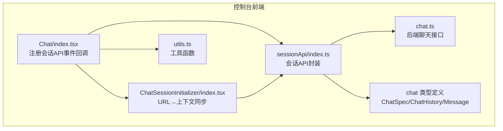
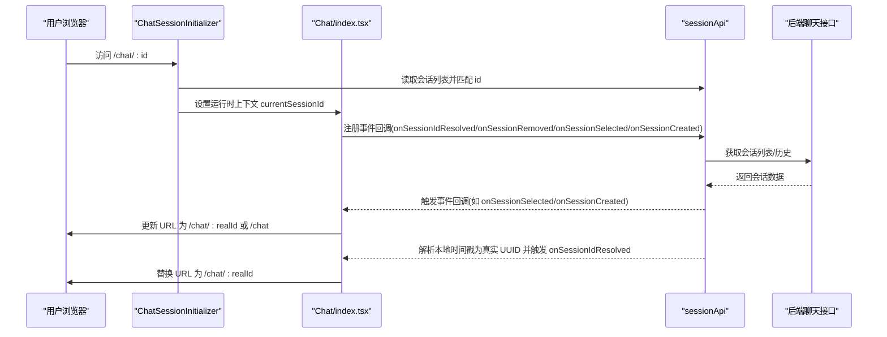
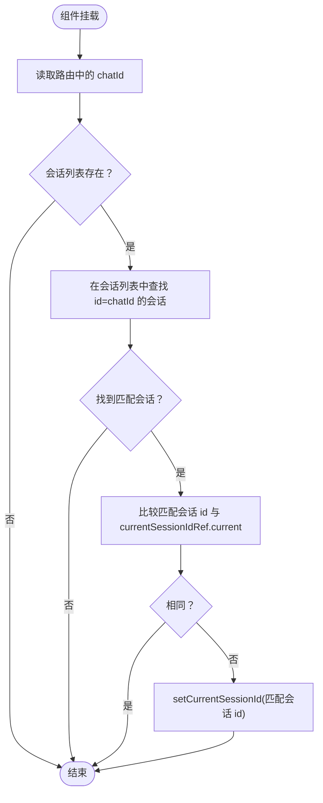
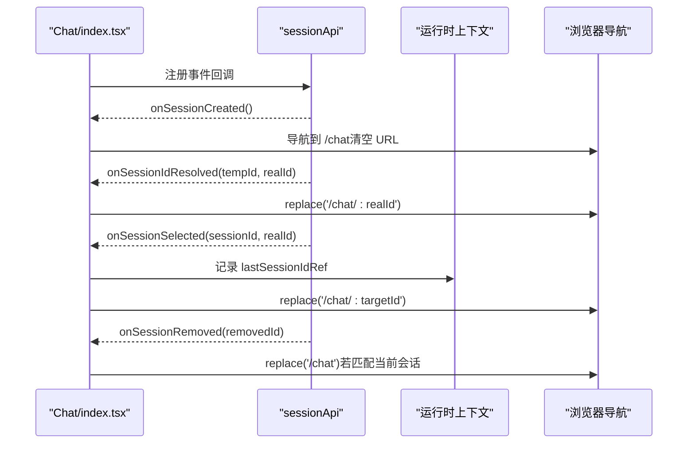
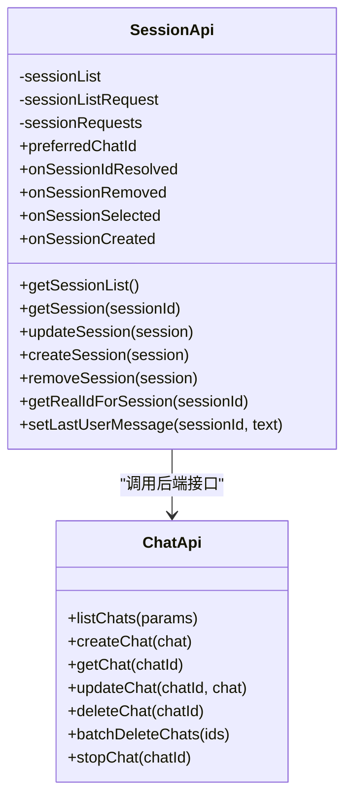
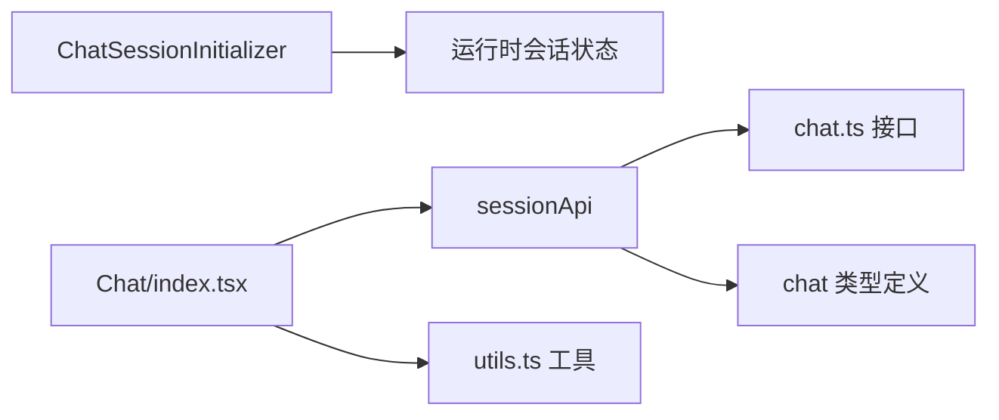
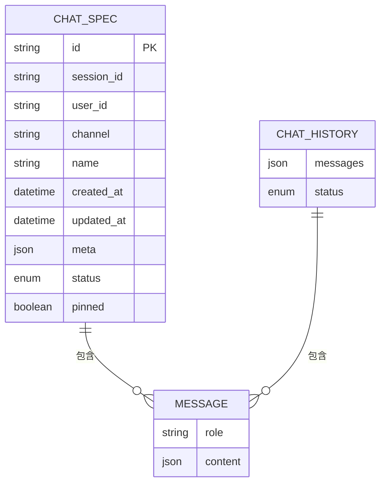

# 聊天会话初始化器

<cite>
**本文引用的文件**
- [console/src/pages/Chat/components/ChatSessionInitializer/index.tsx](file://console/src/pages/Chat/components/ChatSessionInitializer/index.tsx)
- [console/src/pages/Chat/index.tsx](file://console/src/pages/Chat/index.tsx)
- [console/src/pages/Chat/sessionApi/index.ts](file://console/src/pages/Chat/sessionApi/index.ts)
- [console/src/pages/Chat/utils.ts](file://console/src/pages/Chat/utils.ts)
- [console/src/api/modules/chat.ts](file://console/src/api/modules/chat.ts)
- [console/src/api/types/chat.ts](file://console/src/api/types/chat.ts)
</cite>

## 目录
1. [简介](#简介)
2. [项目结构](#项目结构)
3. [核心组件](#核心组件)
4. [架构总览](#架构总览)
5. [详细组件分析](#详细组件分析)
6. [依赖分析](#依赖分析)
7. [性能考虑](#性能考虑)
8. [故障排查指南](#故障排查指南)
9. [结论](#结论)
10. [附录](#附录)

## 简介
本文件针对 QwenPaw 控制台聊天页面中的“聊天会话初始化器”（ChatSessionInitializer）进行系统化技术文档说明。该初始化器负责在用户访问 /chat/:id 页面时，将 URL 中的会话标识与聊天运行时上下文进行双向同步，确保：
- 首次访问时根据 URL 自动选择正确的会话；
- 在会话列表变化或 URL 变化时保持当前会话与地址栏一致；
- 避免因上下文变更导致的循环刷新；
- 与会话 API 协作完成会话创建、选择、删除等生命周期管理。

同时，文档还覆盖 URL 同步、状态恢复（含最后活动会话记录）、代理/通道切换、以及与后端聊天接口的协作方式，并给出错误处理与回退策略。

## 项目结构
与会话初始化器直接相关的核心文件如下：
- ChatSessionInitializer：负责从 URL 到运行时上下文的单向同步；
- Chat/index.tsx：注册会话 API 的事件回调，处理 URL 同步与代理/通道切换；
- sessionApi/index.ts：封装会话 API，提供会话列表、获取、创建、删除、实时 ID 解析等功能；
- utils.ts：提供复制文本、消息提取、URL 规范化等工具；
- chat.ts：后端聊天接口封装（上传、列表、查询、更新、删除、停止）；
- chat 类型定义：会话规格、历史、消息等类型。

**图表来源**
- [console/src/pages/Chat/index.tsx:400-522](file://console/src/pages/Chat/index.tsx#L400-L522)
- [console/src/pages/Chat/components/ChatSessionInitializer/index.tsx:12-34](file://console/src/pages/Chat/components/ChatSessionInitializer/index.tsx#L12-L34)
- [console/src/pages/Chat/sessionApi/index.ts:339-735](file://console/src/pages/Chat/sessionApi/index.ts#L339-L735)
- [console/src/pages/Chat/utils.ts:1-208](file://console/src/pages/Chat/utils.ts#L1-L208)
- [console/src/api/modules/chat.ts:21-97](file://console/src/api/modules/chat.ts#L21-L97)
- [console/src/api/types/chat.ts:3-25](file://console/src/api/types/chat.ts#L3-L25)

**章节来源**
- [console/src/pages/Chat/index.tsx:400-522](file://console/src/pages/Chat/index.tsx#L400-L522)
- [console/src/pages/Chat/components/ChatSessionInitializer/index.tsx:12-34](file://console/src/pages/Chat/components/ChatSessionInitializer/index.tsx#L12-L34)
- [console/src/pages/Chat/sessionApi/index.ts:339-735](file://console/src/pages/Chat/sessionApi/index.ts#L339-L735)
- [console/src/pages/Chat/utils.ts:1-208](file://console/src/pages/Chat/utils.ts#L1-L208)
- [console/src/api/modules/chat.ts:21-97](file://console/src/api/modules/chat.ts#L21-L97)
- [console/src/api/types/chat.ts:3-25](file://console/src/api/types/chat.ts#L3-L25)

## 核心组件
- ChatSessionInitializer：读取当前路由中的 chatId，匹配会话列表并设置运行时上下文的当前会话 ID；通过 ref 避免因上下文变化触发重复同步，防止循环刷新。
- Chat/index.tsx：注册 sessionApi 的事件回调，实现 URL 与会话状态的双向同步；处理首次访问、URL 参数传递、代理/通道切换、会话创建/删除/选择等场景。
- sessionApi/index.ts：封装会话 API，提供去重并发请求、本地时间戳会话 ID 解析为真实 UUID、会话消息补丁（生成中未持久化的最后一条用户消息）、窗口变量注入（currentSessionId/currentUserId/currentChannel）等能力。
- utils.ts：提供复制文本、消息内容提取、URL 规范化、显示 URL 转换等工具方法。
- chat.ts：封装后端聊天接口，包括上传附件、列出/获取/更新/删除会话、批量删除、停止生成等。
- chat 类型定义：定义 ChatSpec、ChatHistory、Message 等类型，支撑前后端数据契约。

**章节来源**
- [console/src/pages/Chat/components/ChatSessionInitializer/index.tsx:12-34](file://console/src/pages/Chat/components/ChatSessionInitializer/index.tsx#L12-L34)
- [console/src/pages/Chat/index.tsx:447-522](file://console/src/pages/Chat/index.tsx#L447-L522)
- [console/src/pages/Chat/sessionApi/index.ts:339-735](file://console/src/pages/Chat/sessionApi/index.ts#L339-L735)
- [console/src/pages/Chat/utils.ts:29-185](file://console/src/pages/Chat/utils.ts#L29-L185)
- [console/src/api/modules/chat.ts:21-97](file://console/src/api/modules/chat.ts#L21-L97)
- [console/src/api/types/chat.ts:3-25](file://console/src/api/types/chat.ts#L3-L25)

## 架构总览
会话初始化器在整体聊天流程中的作用：
- 在用户访问 /chat/:id 时，ChatSessionInitializer 将 URL 中的会话 ID 与运行时上下文对齐；
- Chat/index.tsx 注册 sessionApi 的事件回调，监听会话解析完成、会话移除、会话选择、会话创建等事件，动态更新 URL；
- sessionApi 负责与后端聊天接口交互，解析本地时间戳 ID 为真实 UUID，并在会话生成过程中补丁最后一条用户消息；
- utils 提供 URL 规范化与显示转换，保障多端一致性；
- chat.ts 提供上传、停止等能力，配合会话生命周期管理。

**图表来源**
- [console/src/pages/Chat/components/ChatSessionInitializer/index.tsx:12-34](file://console/src/pages/Chat/components/ChatSessionInitializer/index.tsx#L12-L34)
- [console/src/pages/Chat/index.tsx:447-522](file://console/src/pages/Chat/index.tsx#L447-L522)
- [console/src/pages/Chat/sessionApi/index.ts:522-560](file://console/src/pages/Chat/sessionApi/index.ts#L522-L560)
- [console/src/api/modules/chat.ts:56-96](file://console/src/api/modules/chat.ts#L56-L96)

## 详细组件分析

### 组件一：ChatSessionInitializer（URL→上下文同步）
职责与行为：
- 从路由中提取 chatId；
- 从运行时上下文中读取会话列表，查找与 chatId 匹配的会话；
- 若匹配且与当前上下文不同，则调用 setCurrentSessionId 进行切换；
- 使用 ref 记录 currentSessionId，避免因上下文变化触发重复同步，防止循环刷新。

关键点：
- 仅响应 URL 或会话列表变化，不响应 currentSessionId 的变化；
- 通过 ref 读取 currentSessionId，避免副作用依赖导致的重复渲染。

**图表来源**
- [console/src/pages/Chat/components/ChatSessionInitializer/index.tsx:12-34](file://console/src/pages/Chat/components/ChatSessionInitializer/index.tsx#L12-L34)

**章节来源**
- [console/src/pages/Chat/components/ChatSessionInitializer/index.tsx:12-34](file://console/src/pages/Chat/components/ChatSessionInitializer/index.tsx#L12-L34)

### 组件二：Chat/index.tsx（URL 同步与代理/通道切换）
职责与行为：
- 在组件挂载时注册 sessionApi 的事件回调：
  - onSessionIdResolved：当本地时间戳会话 ID 解析为真实 UUID 时，更新 URL；
  - onSessionRemoved：当会话被删除时，若当前会话匹配则清空 URL；
  - onSessionSelected：当会话被选中时，若与当前 URL 不同则更新 URL；
  - onSessionCreated：新建会话时清空 URL，等待真实 UUID 解析后再更新；
- 处理代理/通道切换：通过 window.currentSessionId/currentUserId/currentChannel 与后端交互；
- 保存/恢复每个代理的最后活动会话 ID，实现跨代理的会话记忆。

关键点：
- preferredChatId 预设策略：在首次加载时将 URL 中的 chatId 设为首选，避免库默认选择第一个会话；
- 去重与延迟回调抑制：记录上次选中的会话 ID 与“陈旧自动选择”的 ID，避免 URL 与 UI 的反复跳转；
- 与 sessionApi 的协作：在创建/删除/选择/解析 ID 等节点更新 URL。

**图表来源**
- [console/src/pages/Chat/index.tsx:447-522](file://console/src/pages/Chat/index.tsx#L447-L522)
- [console/src/pages/Chat/sessionApi/index.ts:379-400](file://console/src/pages/Chat/sessionApi/index.ts#L379-L400)

**章节来源**
- [console/src/pages/Chat/index.tsx:447-522](file://console/src/pages/Chat/index.tsx#L447-L522)
- [console/src/pages/Chat/index.tsx:526-552](file://console/src/pages/Chat/index.tsx#L526-L552)

### 组件三：sessionApi（会话 API 封装与状态恢复）
职责与行为：
- 会话列表与会话详情获取：去重并发请求，避免重复网络调用；
- 本地时间戳 ID 解析：将前端临时会话 ID（时间戳）解析为后端真实 UUID，并保留原 id 用于内部逻辑；
- 会话消息补丁：在会话处于“生成中”时，从 sessionStorage 恢复最后一条用户消息，保证断线/重连后消息完整性；
- 窗口变量注入：维护 window.currentSessionId/currentUserId/currentChannel，供后端接口使用；
- 事件回调：onSessionIdResolved/onSessionRemoved/onSessionSelected/onSessionCreated；
- 会话生命周期：创建、更新、删除、获取列表。

关键点：
- preferredChatId：在首次获取会话列表时将指定会话置顶，避免默认选择第一个；
- 生成状态判断：根据会话状态与最后一条消息角色判断是否仍在生成；
- sessionStorage：持久化最后用户消息，支持页面刷新后的恢复。

**图表来源**
- [console/src/pages/Chat/sessionApi/index.ts:339-735](file://console/src/pages/Chat/sessionApi/index.ts#L339-L735)
- [console/src/api/modules/chat.ts:56-96](file://console/src/api/modules/chat.ts#L56-L96)

**章节来源**
- [console/src/pages/Chat/sessionApi/index.ts:339-735](file://console/src/pages/Chat/sessionApi/index.ts#L339-L735)

### 组件四：utils.ts（工具函数）
职责与行为：
- 文本提取：从响应输出中提取可复制文本，支持纯文本与拒绝信息；
- 用户消息文本提取：从消息内容数组中提取文本；
- URL 规范化：将内容中的图片/音频/视频/文件 URL 规范化为后端存储路径；
- 显示 URL 转换：将后端存储路径转换为可展示的完整 URL；
- 复制文本：在非安全上下文下的降级复制方案。

**章节来源**
- [console/src/pages/Chat/utils.ts:29-185](file://console/src/pages/Chat/utils.ts#L29-L185)

### 组件五：chat.ts（后端聊天接口）
职责与行为：
- 文件上传：支持聊天附件上传，返回预览 URL；
- 文件预览 URL：拼接带 token 的预览链接；
- 会话 CRUD：列出、创建、获取、更新、删除、批量删除；
- 停止生成：取消正在生成的会话。

**章节来源**
- [console/src/api/modules/chat.ts:21-97](file://console/src/api/modules/chat.ts#L21-L97)

## 依赖分析
- ChatSessionInitializer 依赖运行时上下文提供的会话状态钩子，读取会话列表并设置当前会话；
- Chat/index.tsx 依赖 sessionApi 的事件回调，实现 URL 同步与代理/通道切换；
- sessionApi 依赖 chat.ts 的接口，完成会话列表与历史的获取；
- utils.ts 为 Chat/index.tsx 与 sessionApi 提供通用工具方法；
- 类型定义为前后端数据契约提供约束。

**图表来源**
- [console/src/pages/Chat/components/ChatSessionInitializer/index.tsx:19-20](file://console/src/pages/Chat/components/ChatSessionInitializer/index.tsx#L19-L20)
- [console/src/pages/Chat/index.tsx:447-522](file://console/src/pages/Chat/index.tsx#L447-L522)
- [console/src/pages/Chat/sessionApi/index.ts:522-560](file://console/src/pages/Chat/sessionApi/index.ts#L522-L560)
- [console/src/pages/Chat/utils.ts:1-208](file://console/src/pages/Chat/utils.ts#L1-L208)
- [console/src/api/modules/chat.ts:21-97](file://console/src/api/modules/chat.ts#L21-L97)
- [console/src/api/types/chat.ts:3-25](file://console/src/api/types/chat.ts#L3-L25)

**章节来源**
- [console/src/pages/Chat/components/ChatSessionInitializer/index.tsx:12-34](file://console/src/pages/Chat/components/ChatSessionInitializer/index.tsx#L12-L34)
- [console/src/pages/Chat/index.tsx:447-522](file://console/src/pages/Chat/index.tsx#L447-L522)
- [console/src/pages/Chat/sessionApi/index.ts:339-735](file://console/src/pages/Chat/sessionApi/index.ts#L339-L735)
- [console/src/pages/Chat/utils.ts:1-208](file://console/src/pages/Chat/utils.ts#L1-L208)
- [console/src/api/modules/chat.ts:21-97](file://console/src/api/modules/chat.ts#L21-L97)
- [console/src/api/types/chat.ts:3-25](file://console/src/api/types/chat.ts#L3-L25)

## 性能考虑
- 并发请求去重：sessionApi 对 getSessionList 与 getSession 做了并发去重，避免重复网络请求与状态写入；
- 本地时间戳 ID 解析：通过异步轮询与回调触发，避免阻塞主线程；
- 会话列表预取：preferredChatId 首次加载时将目标会话置顶，减少不必要的默认选择；
- sessionStorage 使用：仅在生成中场景缓存最后用户消息，避免持久化开销过大；
- URL 同步节流：通过 ref 与事件回调去重，避免循环刷新。

[本节为通用性能建议，无需具体文件分析]

## 故障排查指南
常见问题与处理：
- URL 与当前会话不一致
  - 现象：切换会话后地址栏未更新或反复跳转；
  - 处理：检查 Chat/index.tsx 中的 onSessionSelected 回调与 lastSessionIdRef/staleAutoSelectedIdRef 的记录逻辑；
  - 参考：[console/src/pages/Chat/index.tsx:471-507](file://console/src/pages/Chat/index.tsx#L471-L507)
- 新建会话后地址栏为空
  - 现象：创建新会话后 URL 为 /chat；
  - 处理：等待 sessionApi 解析真实 UUID 后再更新 URL；
  - 参考：[console/src/pages/Chat/index.tsx:509-514](file://console/src/pages/Chat/index.tsx#L509-L514)
- 会话删除后地址栏未清空
  - 现象：删除会话后 URL 仍指向已删除会话；
  - 处理：确认 onSessionRemoved 回调是否触发并匹配当前会话；
  - 参考：[console/src/pages/Chat/index.tsx:458-469](file://console/src/pages/Chat/index.tsx#L458-L469)
- 生成中消息丢失
  - 现象：断线/刷新后最后一条用户消息未显示；
  - 处理：确认 setLastUserMessage 与 patchLastUserMessage 的使用；
  - 参考：[console/src/pages/Chat/sessionApi/index.ts:410-442](file://console/src/pages/Chat/sessionApi/index.ts#L410-L442)
- 代理/通道切换无效
  - 现象：切换代理后会话上下文未更新；
  - 处理：确认 window.currentSessionId/currentUserId/currentChannel 是否正确注入；
  - 参考：[console/src/pages/Chat/sessionApi/index.ts:459-463](file://console/src/pages/Chat/sessionApi/index.ts#L459-L463)

**章节来源**
- [console/src/pages/Chat/index.tsx:458-514](file://console/src/pages/Chat/index.tsx#L458-L514)
- [console/src/pages/Chat/sessionApi/index.ts:410-442](file://console/src/pages/Chat/sessionApi/index.ts#L410-L442)
- [console/src/pages/Chat/sessionApi/index.ts:459-463](file://console/src/pages/Chat/sessionApi/index.ts#L459-L463)

## 结论
聊天会话初始化器通过“URL→上下文”的单向同步与“上下文→URL”的事件驱动回调，实现了在多种会话场景下的稳定与一致体验。结合 sessionApi 的并发去重、本地时间戳 ID 解析、消息补丁与窗口变量注入，系统能够在首次访问、URL 参数传递、代理/通道切换、会话创建/删除/选择等复杂场景下保持 URL 与会话状态的强一致。配合工具函数与后端接口，形成完整的会话生命周期闭环。

[本节为总结性内容，无需具体文件分析]

## 附录
- 数据模型（简化）
  - ChatSpec：会话规格，包含 id、session_id、user_id、channel、name、created_at、updated_at、meta、status、pinned；
  - ChatHistory：会话历史，包含 messages、status；
  - Message：消息，包含 role、content 等。

**图表来源**
- [console/src/api/types/chat.ts:3-25](file://console/src/api/types/chat.ts#L3-L25)