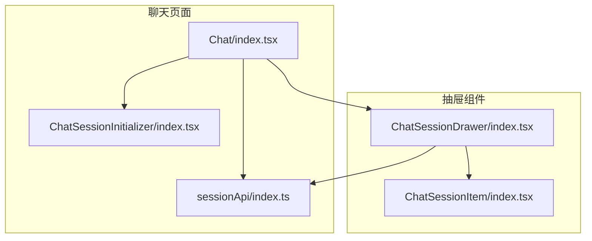
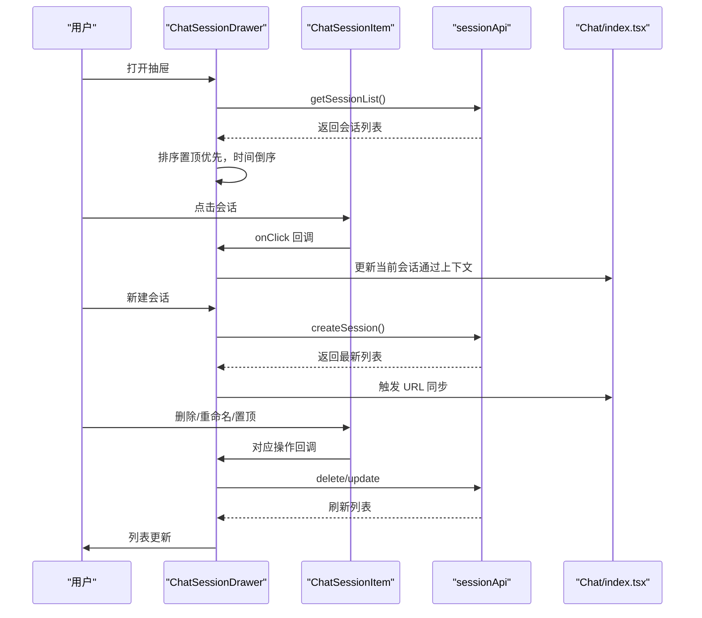
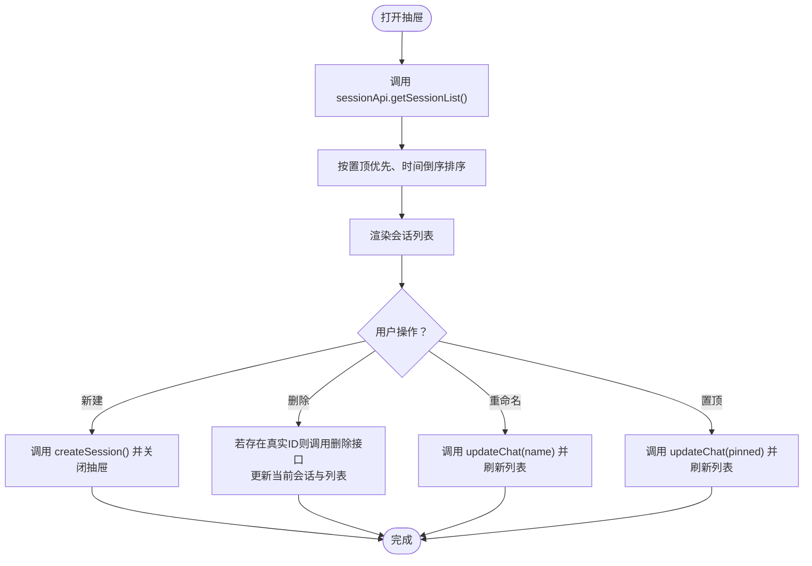
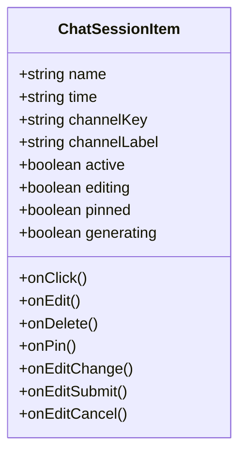
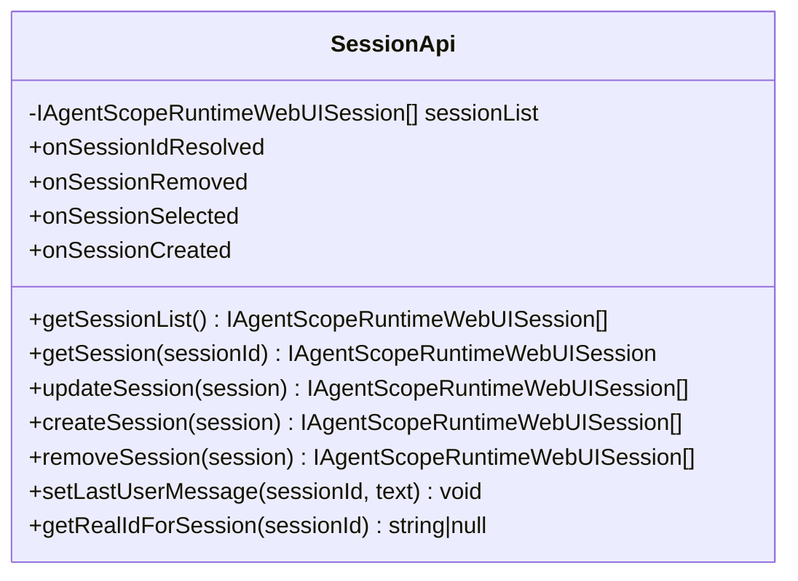
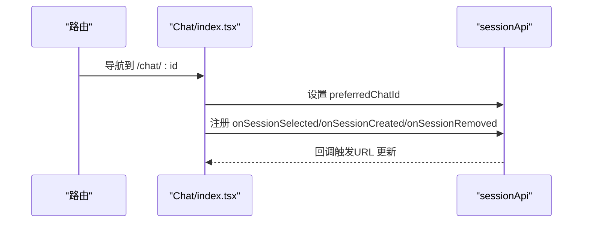
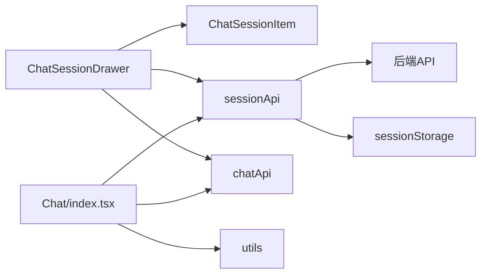

# 聊天会话抽屉组件

<cite>
**本文档引用的文件**
- [ChatSessionDrawer/index.tsx](file://console/src/pages/Chat/components/ChatSessionDrawer/index.tsx)
- [ChatSessionItem/index.tsx](file://console/src/pages/Chat/components/ChatSessionItem/index.tsx)
- [ChatSessionItem/index.module.less](file://console/src/pages/Chat/components/ChatSessionItem/index.module.less)
- [ChatSessionDrawer/index.module.less](file://console/src/pages/Chat/components/ChatSessionDrawer/index.module.less)
- [sessionApi/index.ts](file://console/src/pages/Chat/sessionApi/index.ts)
- [Chat/index.tsx](file://console/src/pages/Chat/index.tsx)
- [ChatSessionInitializer/index.tsx](file://console/src/pages/Chat/components/ChatSessionInitializer/index.tsx)
- [chat.ts](file://console/src/api/types/chat.ts)
- [utils.ts](file://console/src/pages/Chat/utils.ts)
- [useProgressiveRender.ts](file://console/src/hooks/useProgressiveRender.ts)
</cite>

## 目录
1. [简介](#简介)
2. [项目结构](#项目结构)
3. [核心组件](#核心组件)
4. [架构总览](#架构总览)
5. [详细组件分析](#详细组件分析)
6. [依赖关系分析](#依赖关系分析)
7. [性能考虑](#性能考虑)
8. [故障排除指南](#故障排除指南)
9. [结论](#结论)
10. [附录](#附录)

## 简介
本文件为 QwenPaw 聊天会话抽屉组件的技术文档，聚焦于会话列表展示、会话切换与管理功能，涵盖会话数据获取与管理（含 API 集成、数据缓存与状态同步）、抽屉交互设计（滑动打开、会话选择与快捷操作）、会话列表渲染优化（虚拟滚动、懒加载与性能提升），以及与聊天页面的集成方式与会话状态传递的实现示例。

## 项目结构
该组件位于控制台前端的聊天页面模块中，采用按功能分层的组织方式：
- Chat 页面：承载聊天 UI 与会话 API 集成
- ChatSessionDrawer：右侧抽屉，展示会话列表并支持新建、删除、重命名、置顶等操作
- ChatSessionItem：单个会话条目，支持编辑、删除、置顶与状态指示
- sessionApi：封装与后端的会话数据交互，包含缓存与去重逻辑
- ChatSessionInitializer：根据 URL 同步当前会话到上下文

**图表来源**
- [Chat/index.tsx:447-522](file://console/src/pages/Chat/index.tsx#L447-L522)
- [sessionApi/index.ts:339-735](file://console/src/pages/Chat/sessionApi/index.ts#L339-L735)
- [ChatSessionDrawer/index.tsx:59-305](file://console/src/pages/Chat/components/ChatSessionDrawer/index.tsx#L59-L305)
- [ChatSessionItem/index.tsx:54-177](file://console/src/pages/Chat/components/ChatSessionItem/index.tsx#L54-L177)
- [ChatSessionInitializer/index.tsx:12-37](file://console/src/pages/Chat/components/ChatSessionInitializer/index.tsx#L12-L37)

**章节来源**
- [Chat/index.tsx:400-894](file://console/src/pages/Chat/index.tsx#L400-L894)
- [ChatSessionDrawer/index.tsx:1-308](file://console/src/pages/Chat/components/ChatSessionDrawer/index.tsx#L1-L308)
- [sessionApi/index.ts:339-735](file://console/src/pages/Chat/sessionApi/index.ts#L339-L735)

## 核心组件
- 会话抽屉（ChatSessionDrawer）：负责渲染右侧抽屉、会话列表排序、新建会话、删除会话、重命名、置顶、刷新列表等
- 会话条目（ChatSessionItem）：负责单个会话项的渲染与交互（点击、编辑、删除、置顶）
- 会话 API（sessionApi）：封装与后端的会话数据交互，包含去重请求、本地临时会话处理、实时生成状态检测、用户消息缓存等
- 聊天页面（Chat/index.tsx）：注册会话 API 的事件回调，实现 URL 与会话状态的双向同步
- 会话初始化器（ChatSessionInitializer）：根据 URL 将当前会话同步到上下文，避免循环更新

**章节来源**
- [ChatSessionDrawer/index.tsx:59-305](file://console/src/pages/Chat/components/ChatSessionDrawer/index.tsx#L59-L305)
- [ChatSessionItem/index.tsx:54-177](file://console/src/pages/Chat/components/ChatSessionItem/index.tsx#L54-L177)
- [sessionApi/index.ts:339-735](file://console/src/pages/Chat/sessionApi/index.ts#L339-L735)
- [Chat/index.tsx:447-522](file://console/src/pages/Chat/index.tsx#L447-L522)
- [ChatSessionInitializer/index.tsx:12-37](file://console/src/pages/Chat/components/ChatSessionInitializer/index.tsx#L12-L37)

## 架构总览
组件间的数据流与控制流如下：

**图表来源**
- [ChatSessionDrawer/index.tsx:98-155](file://console/src/pages/Chat/components/ChatSessionDrawer/index.tsx#L98-L155)
- [sessionApi/index.ts:522-560](file://console/src/pages/Chat/sessionApi/index.ts#L522-L560)
- [Chat/index.tsx:447-522](file://console/src/pages/Chat/index.tsx#L447-L522)

## 详细组件分析

### 会话抽屉（ChatSessionDrawer）
职责与特性：
- 渲染右侧抽屉，包含头部、新建会话按钮、会话列表与渐变遮罩
- 会话列表排序：置顶优先，时间倒序
- 会话管理：新建、删除、重命名、置顶
- 数据同步：打开时从后端刷新列表，保持与上下文一致
- 与后端 API 的集成：使用 sessionApi 获取列表，使用 chatApi 进行删除与更新

关键实现点：
- 排序逻辑：先比较置顶字段，再比较创建时间
- 刷新策略：打开抽屉时触发一次去重化的列表拉取
- 删除流程：若存在真实后端 ID，则调用删除接口；同时更新当前选中会话与列表
- 重命名流程：仅向后端发送最小化更新（仅 name 字段），避免覆盖其他字段
- 置顶切换：调用更新接口并重新拉取列表

**图表来源**
- [ChatSessionDrawer/index.tsx:77-155](file://console/src/pages/Chat/components/ChatSessionDrawer/index.tsx#L77-L155)
- [sessionApi/index.ts:522-560](file://console/src/pages/Chat/sessionApi/index.ts#L522-L560)

**章节来源**
- [ChatSessionDrawer/index.tsx:59-305](file://console/src/pages/Chat/components/ChatSessionDrawer/index.tsx#L59-L305)

### 会话条目（ChatSessionItem）
职责与特性：
- 渲染单个会话项：名称、时间、渠道标签、状态指示（进行中/空闲）
- 支持内联编辑：输入框、回车或失焦确认、取消
- 快捷操作：编辑、删除、置顶按钮（悬停显示）
- 状态指示：根据 generating 或 status 显示呼吸动画或空闲点

**图表来源**
- [ChatSessionItem/index.tsx:18-52](file://console/src/pages/Chat/components/ChatSessionItem/index.tsx#L18-L52)

**章节来源**
- [ChatSessionItem/index.tsx:54-177](file://console/src/pages/Chat/components/ChatSessionItem/index.tsx#L54-L177)
- [ChatSessionItem/index.module.less:16-294](file://console/src/pages/Chat/components/ChatSessionItem/index.module.less#L16-L294)

### 会话 API（sessionApi）
职责与特性：
- 去重并发请求：getSessionList 与 getSession 使用内部缓存避免重复网络请求
- 本地临时会话处理：当会话 ID 为纯数字时间戳时，等待真实 UUID 解析后再拉取历史
- 实时生成状态检测：根据最后一条消息角色判断是否仍在生成
- 用户消息缓存：在会话未完成时，将用户最新输入缓存至 sessionStorage，并在重连时补丁到消息列表
- URL 同步回调：提供 onSessionIdResolved、onSessionRemoved、onSessionSelected、onSessionCreated 回调供上层更新路由

**图表来源**
- [sessionApi/index.ts:339-735](file://console/src/pages/Chat/sessionApi/index.ts#L339-L735)

**章节来源**
- [sessionApi/index.ts:339-735](file://console/src/pages/Chat/sessionApi/index.ts#L339-L735)
- [chat.ts:1-39](file://console/src/api/types/chat.ts#L1-L39)

### 聊天页面集成（Chat/index.tsx）
职责与特性：
- 注册 sessionApi 的事件回调，实现 URL 与会话状态的双向同步
- 在 URL 中存在 chatId 时，设置 preferredChatId，确保首次自动选择正确会话
- 提供自定义 fetch 以携带当前会话信息（session_id、user_id、channel），并在发送用户消息时缓存最新输入
- 关闭/停止会话时调用后端接口

**图表来源**
- [Chat/index.tsx:447-522](file://console/src/pages/Chat/index.tsx#L447-L522)
- [sessionApi/index.ts:339-401](file://console/src/pages/Chat/sessionApi/index.ts#L339-L401)

**章节来源**
- [Chat/index.tsx:400-894](file://console/src/pages/Chat/index.tsx#L400-L894)

### 会话初始化器（ChatSessionInitializer）
职责与特性：
- 从 URL 中解析 chatId，并将其同步到上下文 currentSessionId
- 使用 ref 保存 currentSessionId，避免因上下文变化导致的循环更新
- 仅响应 URL 或会话列表变化，不反向触发 URL 更新

**章节来源**
- [ChatSessionInitializer/index.tsx:12-37](file://console/src/pages/Chat/components/ChatSessionInitializer/index.tsx#L12-L37)

## 依赖关系分析
- ChatSessionDrawer 依赖：
  - useChatAnywhereSessionsState/useChatAnywhereSessions（上下文状态与会话操作）
  - sessionApi（会话列表与 CRUD）
  - chatApi（删除与更新）
  - ChatSessionItem（子组件）
- Chat/index.tsx 依赖：
  - sessionApi（事件回调与 URL 同步）
  - chatApi（上传文件、停止会话）
  - utils（URL 处理、复制文本等）
- sessionApi 内部依赖：
  - 后端 API（listChats/getChat/deleteChat）
  - 浏览器 sessionStorage（用户消息缓存）

**图表来源**
- [ChatSessionDrawer/index.tsx:1-16](file://console/src/pages/Chat/components/ChatSessionDrawer/index.tsx#L1-L16)
- [Chat/index.tsx:13-40](file://console/src/pages/Chat/index.tsx#L13-L40)
- [sessionApi/index.ts:1-12](file://console/src/pages/Chat/sessionApi/index.ts#L1-L12)

**章节来源**
- [ChatSessionDrawer/index.tsx:1-16](file://console/src/pages/Chat/components/ChatSessionDrawer/index.tsx#L1-L16)
- [Chat/index.tsx:13-40](file://console/src/pages/Chat/index.tsx#L13-L40)
- [sessionApi/index.ts:1-12](file://console/src/pages/Chat/sessionApi/index.ts#L1-L12)

## 性能考虑
- 列表渲染优化：
  - 当前实现为直接遍历渲染所有会话项，适合中小规模会话列表
  - 若会话数量较大，建议引入虚拟滚动或懒加载策略
- 懒加载与渐进渲染：
  - 可参考项目中的 useProgressiveRender 钩子，对长列表进行分批渲染，提升首屏性能
- 请求去重：
  - sessionApi 已内置对 getSessionList 与 getSession 的去重逻辑，避免并发请求风暴
- 缓存策略：
  - 会话列表缓存与 sessionStorage 的用户消息缓存减少不必要的网络往返
- 交互反馈：
  - 抽屉内使用渐变遮罩与滚动条隐藏，提升视觉体验与性能表现

**章节来源**
- [useProgressiveRender.ts:17-51](file://console/src/hooks/useProgressiveRender.ts#L17-L51)
- [sessionApi/index.ts:364-375](file://console/src/pages/Chat/sessionApi/index.ts#L364-L375)

## 故障排除指南
常见问题与排查要点：
- 抽屉打开后列表为空
  - 检查 sessionApi.getSessionList 是否成功返回数据
  - 确认 ChatSessionDrawer 的 useEffect 是否被触发
- 无法切换当前会话
  - 检查 ChatSessionInitializer 是否正确解析 URL 并设置 currentSessionId
  - 确认 Chat/index.tsx 的 onSessionSelected 回调是否被触发
- 删除会话后仍显示
  - 确认 handleDelete 是否调用了 chatApi.deleteChat 并刷新了列表
  - 检查 refreshSessions 是否执行
- 重命名无效
  - 确认后端 updateChat 接口是否收到 name 参数
  - 检查 handleEditSubmit 的提交逻辑
- 置顶状态不同步
  - 确认 updateChat 的 pinned 参数是否正确传入
  - 检查刷新列表逻辑是否执行

**章节来源**
- [ChatSessionDrawer/index.tsx:98-155](file://console/src/pages/Chat/components/ChatSessionDrawer/index.tsx#L98-L155)
- [ChatSessionInitializer/index.tsx:25-34](file://console/src/pages/Chat/components/ChatSessionInitializer/index.tsx#L25-L34)
- [Chat/index.tsx:447-522](file://console/src/pages/Chat/index.tsx#L447-L522)

## 结论
该会话抽屉组件通过清晰的职责划分与完善的 API 集成，实现了会话列表的高效展示与管理。结合 sessionApi 的去重与缓存机制，保证了在复杂交互场景下的稳定性与性能。未来可在大规模会话场景下引入虚拟滚动与懒加载策略，进一步优化渲染性能。

## 附录
- 会话状态传递示例路径：
  - URL → 上下文：[ChatSessionInitializer/index.tsx:25-34](file://console/src/pages/Chat/components/ChatSessionInitializer/index.tsx#L25-L34)
  - 上下文 → URL：[Chat/index.tsx:471-507](file://console/src/pages/Chat/index.tsx#L471-L507)
- 会话数据类型定义：
  - [chat.ts:3-14](file://console/src/api/types/chat.ts#L3-L14)
- URL 与内容转换工具：
  - [utils.ts:180-185](file://console/src/pages/Chat/utils.ts#L180-L185)