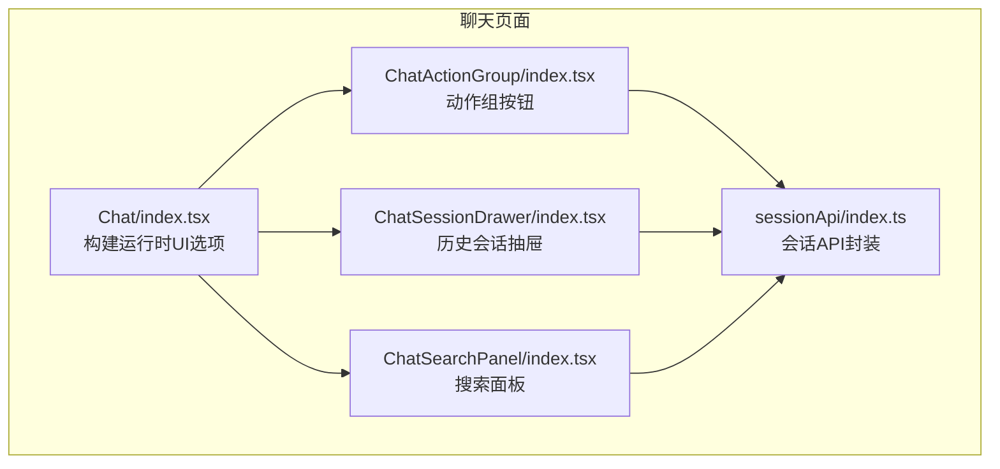
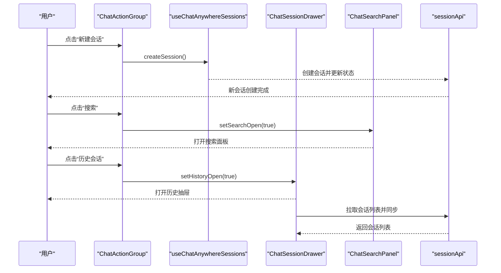
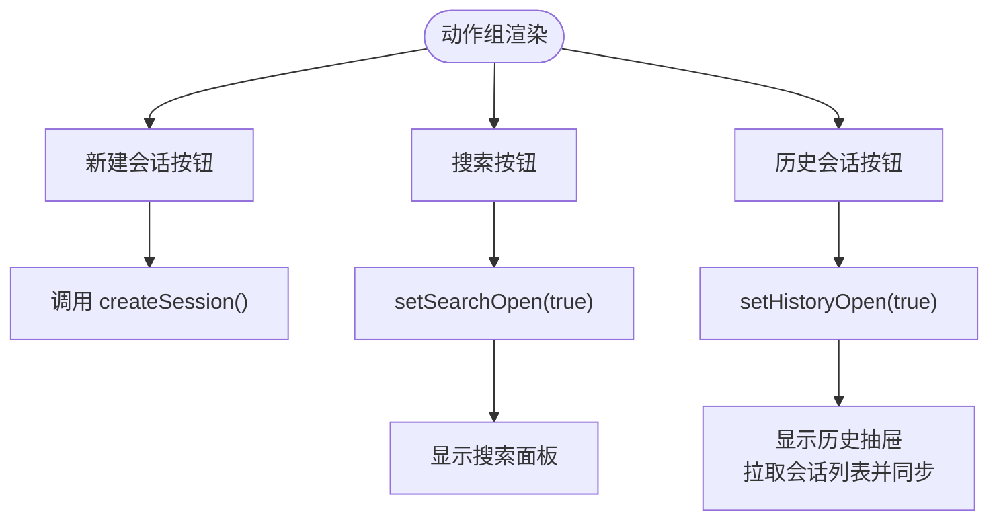
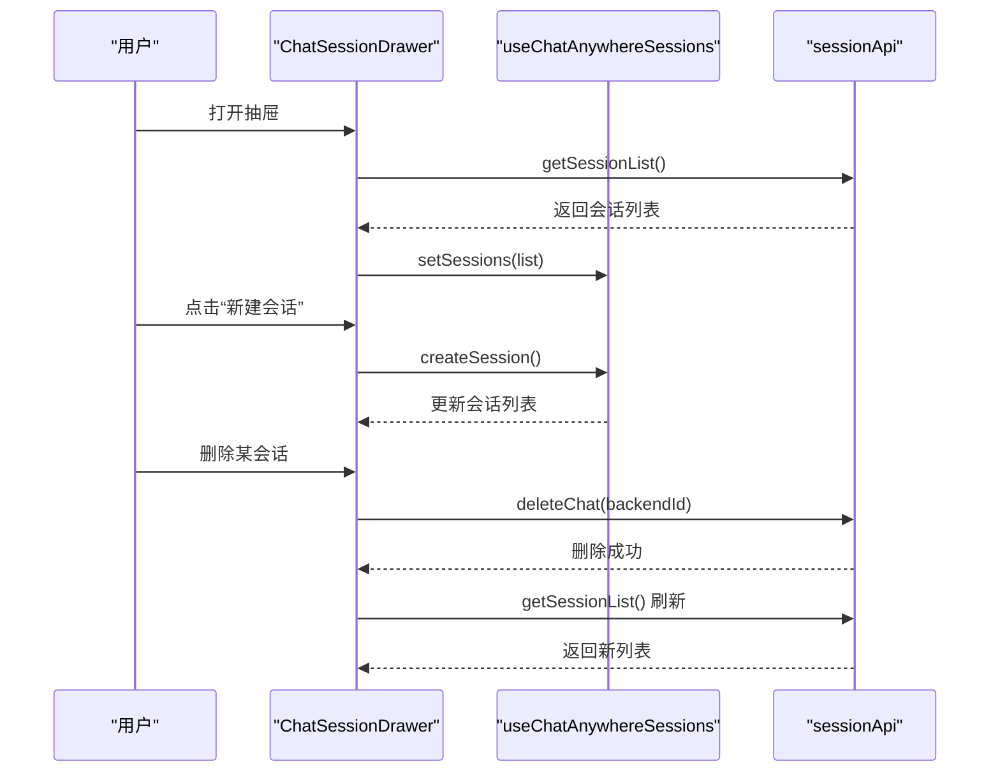
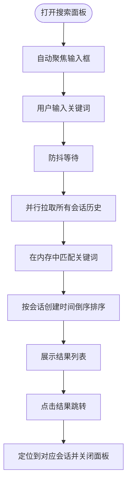
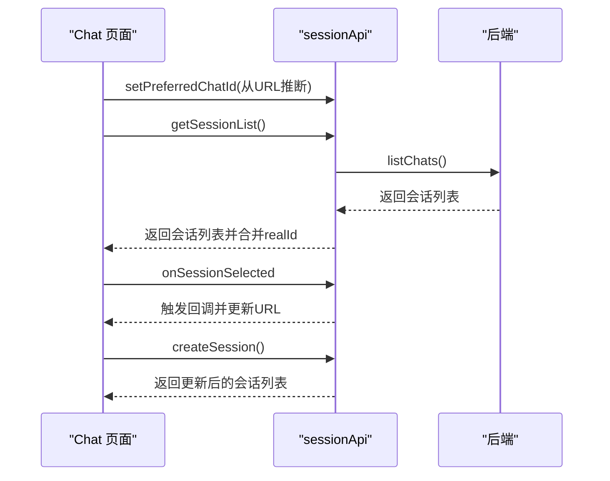
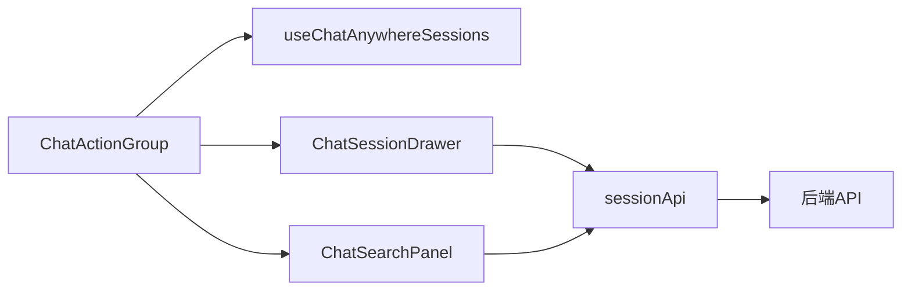

# 聊天动作组组件

<cite>
**本文引用的文件**
- [ChatActionGroup/index.tsx](file://console/src/pages/Chat/components/ChatActionGroup/index.tsx)
- [Chat/index.tsx](file://console/src/pages/Chat/index.tsx)
- [ChatSearchPanel/index.tsx](file://console/src/pages/Chat/components/ChatSearchPanel/index.tsx)
- [ChatSessionDrawer/index.tsx](file://console/src/pages/Chat/components/ChatSessionDrawer/index.tsx)
- [sessionApi/index.ts](file://console/src/pages/Chat/sessionApi/index.ts)
- [zh.json](file://console/src/locales/zh.json)
</cite>

## 目录
1. [简介](#简介)
2. [项目结构](#项目结构)
3. [核心组件](#核心组件)
4. [架构总览](#架构总览)
5. [详细组件分析](#详细组件分析)
6. [依赖关系分析](#依赖关系分析)
7. [性能考量](#性能考量)
8. [故障排查指南](#故障排查指南)
9. [结论](#结论)
10. [附录](#附录)

## 简介
本文件为 QwenPaw 控制台“聊天动作组”组件的技术文档，聚焦于聊天界面顶部右侧的动作按钮集合，包括“新建会话”“搜索”“历史会话”三个核心动作。文档将深入解析其实现设计、状态管理、交互逻辑、布局与样式、与聊天会话 API 的集成方式、错误处理与可扩展性，并给出在不同场景下的行为表现与用户体验优化建议。

## 项目结构
聊天动作组位于聊天页面的右上角区域，作为头部右侧插槽的一部分被注入到运行时 UI 中。其直接依赖会话状态与会话 API，配合抽屉式的历史会话面板与搜索面板共同构成完整的会话管理与检索体验。

图表来源
- [Chat/index.tsx:726-735](file://console/src/pages/Chat/index.tsx#L726-L735)
- [ChatActionGroup/index.tsx:14-50](file://console/src/pages/Chat/components/ChatActionGroup/index.tsx#L14-L50)
- [ChatSessionDrawer/index.tsx:59-126](file://console/src/pages/Chat/components/ChatSessionDrawer/index.tsx#L59-L126)
- [ChatSearchPanel/index.tsx:58-175](file://console/src/pages/Chat/components/ChatSearchPanel/index.tsx#L58-L175)
- [sessionApi/index.ts:339-735](file://console/src/pages/Chat/sessionApi/index.ts#L339-L735)

章节来源
- [Chat/index.tsx:726-735](file://console/src/pages/Chat/index.tsx#L726-L735)
- [ChatActionGroup/index.tsx:14-50](file://console/src/pages/Chat/components/ChatActionGroup/index.tsx#L14-L50)

## 核心组件
- 聊天动作组（ChatActionGroup）
  - 提供三个图标按钮：新建会话、搜索、历史会话。
  - 使用会话状态钩子创建新会话，使用内部状态控制抽屉与面板的显隐。
- 历史会话抽屉（ChatSessionDrawer）
  - 展示会话列表，支持新建、重命名、删除、置顶/取消置顶、跳转到会话。
  - 与会话 API 同步，保证列表与后端一致。
- 搜索面板（ChatSearchPanel）
  - 支持跨会话全文检索，展示匹配结果并可直接跳转到对应会话。
- 会话 API（sessionApi）
  - 统一封装会话列表、会话详情、创建、删除、重命名、置顶等操作。
  - 处理本地临时会话 ID 与真实后端 UUID 的映射，维护 URL 同步。

章节来源
- [ChatActionGroup/index.tsx:14-50](file://console/src/pages/Chat/components/ChatActionGroup/index.tsx#L14-L50)
- [ChatSessionDrawer/index.tsx:59-305](file://console/src/pages/Chat/components/ChatSessionDrawer/index.tsx#L59-L305)
- [ChatSearchPanel/index.tsx:58-305](file://console/src/pages/Chat/components/ChatSearchPanel/index.tsx#L58-L305)
- [sessionApi/index.ts:339-735](file://console/src/pages/Chat/sessionApi/index.ts#L339-L735)

## 架构总览
动作组通过运行时 UI 的“右侧头部”插槽注入，按钮点击分别触发会话创建、打开搜索面板、打开历史抽屉。抽屉与面板内部通过会话 API 与后端交互，确保状态一致性与 URL 同步。

图表来源
- [Chat/index.tsx:726-735](file://console/src/pages/Chat/index.tsx#L726-L735)
- [ChatActionGroup/index.tsx:16-47](file://console/src/pages/Chat/components/ChatActionGroup/index.tsx#L16-L47)
- [ChatSessionDrawer/index.tsx:98-126](file://console/src/pages/Chat/components/ChatSessionDrawer/index.tsx#L98-L126)
- [ChatSearchPanel/index.tsx:80-175](file://console/src/pages/Chat/components/ChatSearchPanel/index.tsx#L80-L175)
- [sessionApi/index.ts:522-535](file://console/src/pages/Chat/sessionApi/index.ts#L522-L535)

## 详细组件分析

### 聊天动作组（ChatActionGroup）
- 组件职责
  - 提供“新建会话”“搜索”“历史会话”三个动作入口。
  - 使用会话状态钩子创建新会话，使用本地状态控制抽屉与面板的显隐。
- 状态管理
  - 使用 useState 维护历史抽屉与搜索面板的开关状态。
  - 通过 useChatAnywhereSessions 提供的 createSession 创建新会话。
- 交互逻辑
  - 新建会话：点击图标按钮触发 createSession，无需等待后端即刻生效。
  - 搜索：点击图标按钮将搜索面板设为可见，自动聚焦输入框。
  - 历史会话：点击图标按钮将历史抽屉设为可见，抽屉打开时异步拉取并同步会话列表。
- 禁用条件
  - 动作组按钮本身未设置禁用态；搜索与历史抽屉的显隐由组件内部状态控制。
- 错误处理
  - 抽屉与面板内部对网络请求进行 try/catch 并记录日志，避免影响主流程。
- 国际化与提示
  - 使用 Tooltip 显示标题，标题文本来自国际化资源。

图表来源
- [ChatActionGroup/index.tsx:14-50](file://console/src/pages/Chat/components/ChatActionGroup/index.tsx#L14-L50)
- [ChatSearchPanel/index.tsx:68-78](file://console/src/pages/Chat/components/ChatSearchPanel/index.tsx#L68-L78)
- [ChatSessionDrawer/index.tsx:103-126](file://console/src/pages/Chat/components/ChatSessionDrawer/index.tsx#L103-L126)

章节来源
- [ChatActionGroup/index.tsx:14-50](file://console/src/pages/Chat/components/ChatActionGroup/index.tsx#L14-L50)
- [zh.json:1-200](file://console/src/locales/zh.json#L1-L200)

### 历史会话抽屉（ChatSessionDrawer）
- 功能要点
  - 展示会话列表，支持新建、重命名、删除、置顶/取消置顶、跳转到会话。
  - 列表按“置顶优先、创建时间倒序”排序。
  - 抽屉打开时异步拉取会话列表并同步到运行时状态。
- 状态与交互
  - 通过 useChatAnywhereSessionsState 获取当前会话与会话列表，通过 useChatAnywhereSessions 获取创建会话能力。
  - 删除会话时，若删除的是当前会话，则自动切换到下一个会话。
  - 重命名采用最小化 PATCH，避免后端旧字段覆盖。
- 错误处理
  - 列表刷新与置顶切换均包含 try/catch 并记录错误日志。
- 与会话 API 的集成
  - 通过 sessionApi.getSessionList 与 sessionApi.updateSession 等接口实现列表与状态同步。

图表来源
- [ChatSessionDrawer/index.tsx:97-155](file://console/src/pages/Chat/components/ChatSessionDrawer/index.tsx#L97-L155)
- [sessionApi/index.ts:522-535](file://console/src/pages/Chat/sessionApi/index.ts#L522-L535)
- [sessionApi/index.ts:711-731](file://console/src/pages/Chat/sessionApi/index.ts#L711-L731)

章节来源
- [ChatSessionDrawer/index.tsx:59-305](file://console/src/pages/Chat/components/ChatSessionDrawer/index.tsx#L59-L305)
- [sessionApi/index.ts:339-735](file://console/src/pages/Chat/sessionApi/index.ts#L339-L735)

### 搜索面板（ChatSearchPanel）
- 功能要点
  - 支持跨会话全文检索，展示匹配结果并可直接跳转到对应会话。
  - 输入框具有防抖（约 300ms），避免频繁请求。
  - 结果按会话创建时间倒序排序。
- 数据提取与匹配
  - 从消息内容数组中提取纯文本，忽略非文本类型内容。
  - 匹配时区分大小写，但展示上下文片段。
- 与会话 API 的集成
  - 检索时并行拉取所有会话历史，再在内存中匹配，最后统一排序。
  - 跳转时根据本地会话列表或直接使用后端 ID 进行路由跳转。

图表来源
- [ChatSearchPanel/index.tsx:80-175](file://console/src/pages/Chat/components/ChatSearchPanel/index.tsx#L80-L175)
- [ChatSearchPanel/index.tsx:177-199](file://console/src/pages/Chat/components/ChatSearchPanel/index.tsx#L177-L199)

章节来源
- [ChatSearchPanel/index.tsx:58-305](file://console/src/pages/Chat/components/ChatSearchPanel/index.tsx#L58-L305)

### 与聊天会话 API 的集成
- 会话 API 的职责
  - 统一封装会话列表、会话详情、创建、删除、更新（含重命名、置顶）等操作。
  - 处理本地临时会话 ID 与真实后端 UUID 的映射，维护 URL 同步回调。
- 关键接口
  - getSessionList：去重并发请求，合并 realId 与 generating 状态。
  - getSession/updateSession/createSession/removeSession：围绕会话生命周期的增删改查。
- URL 同步
  - 通过 onSessionIdResolved/onSessionRemoved/onSessionSelected/onSessionCreated 回调，驱动路由跳转与 URL 更新。

图表来源
- [sessionApi/index.ts:347-348](file://console/src/pages/Chat/sessionApi/index.ts#L347-L348)
- [sessionApi/index.ts:522-535](file://console/src/pages/Chat/sessionApi/index.ts#L522-L535)
- [sessionApi/index.ts:695-709](file://console/src/pages/Chat/sessionApi/index.ts#L695-L709)
- [Chat/index.tsx:449-522](file://console/src/pages/Chat/index.tsx#L449-L522)

章节来源
- [sessionApi/index.ts:339-735](file://console/src/pages/Chat/sessionApi/index.ts#L339-L735)
- [Chat/index.tsx:449-522](file://console/src/pages/Chat/index.tsx#L449-L522)

## 依赖关系分析
- 组件耦合
  - ChatActionGroup 低耦合：仅依赖会话状态钩子与本地状态，不直接依赖会话 API。
  - ChatSessionDrawer 与 ChatSearchPanel 高内聚：均依赖 sessionApi 与运行时会话状态。
- 外部依赖
  - @agentscope-ai/chat：提供会话状态钩子、会话 API 类型与运行时 UI。
  - antd：提供 Drawer、List、Input、Typography、Empty、Spin 等 UI 组件。
  - @agentscope-ai/design：提供 IconButton。
  - react-i18next：提供国际化文本。
- 潜在循环依赖
  - 未发现循环依赖；各组件通过 sessionApi 单向依赖后端。

图表来源
- [ChatActionGroup/index.tsx:1-12](file://console/src/pages/Chat/components/ChatActionGroup/index.tsx#L1-L12)
- [ChatSessionDrawer/index.tsx:1-16](file://console/src/pages/Chat/components/ChatSessionDrawer/index.tsx#L1-L16)
- [ChatSearchPanel/index.tsx:1-11](file://console/src/pages/Chat/components/ChatSearchPanel/index.tsx#L1-L11)
- [sessionApi/index.ts:1-12](file://console/src/pages/Chat/sessionApi/index.ts#L1-L12)

章节来源
- [ChatActionGroup/index.tsx:1-12](file://console/src/pages/Chat/components/ChatActionGroup/index.tsx#L1-L12)
- [ChatSessionDrawer/index.tsx:1-16](file://console/src/pages/Chat/components/ChatSessionDrawer/index.tsx#L1-L16)
- [ChatSearchPanel/index.tsx:1-11](file://console/src/pages/Chat/components/ChatSearchPanel/index.tsx#L1-L11)
- [sessionApi/index.ts:1-12](file://console/src/pages/Chat/sessionApi/index.ts#L1-L12)

## 性能考量
- 搜索防抖
  - 搜索面板对输入进行约 300ms 防抖，减少不必要的请求与计算。
- 并行拉取
  - 搜索时对所有会话历史并行拉取，缩短整体等待时间。
- 列表去重与缓存
  - sessionApi 对 getSessionList 与 getSession 请求进行去重，避免并发重复请求。
- 本地状态与 URL 同步
  - 通过 preferredChatId 与回调机制，减少不必要的网络往返，提升首屏体验。

## 故障排查指南
- 新建会话无反应
  - 检查会话状态钩子是否正确初始化，确认 createSession 是否被调用。
  - 查看 sessionApi 的创建流程与回调是否触发。
- 历史抽屉为空或不更新
  - 确认抽屉打开时是否调用了 sessionApi.getSessionList 并成功 setSessions。
  - 检查 onSessionCreated/onSessionRemoved/onSessionSelected 回调是否被正确设置。
- 搜索无结果或卡顿
  - 检查防抖逻辑是否生效，确认并行拉取是否完成。
  - 若会话较多，考虑增加分页或增量加载策略。
- 删除会话后当前会话未切换
  - 确认 handleDelete 中是否在删除当前会话时设置了下一个会话为当前会话。
- 国际化文案未显示
  - 检查 zh.json 中相关键是否存在，确认 useTranslation 是否正确初始化。

章节来源
- [ChatSessionDrawer/index.tsx:135-155](file://console/src/pages/Chat/components/ChatSessionDrawer/index.tsx#L135-L155)
- [ChatSearchPanel/index.tsx:80-175](file://console/src/pages/Chat/components/ChatSearchPanel/index.tsx#L80-L175)
- [sessionApi/index.ts:522-535](file://console/src/pages/Chat/sessionApi/index.ts#L522-L535)

## 结论
聊天动作组通过简洁的三个按钮，结合会话 API 与抽屉/面板组件，实现了从“新建会话”到“历史检索”的完整闭环。其设计遵循低耦合、高内聚的原则，具备良好的可扩展性与可维护性。未来可在动作组中引入更多动作（如清空、批准等），并通过统一的配置与钩子扩展新的交互与状态管理。

## 附录

### 动作组布局与样式定制
- 布局
  - 使用 Flex 容器水平排列，间距固定为 8px，垂直居中对齐。
- 尺寸与主题
  - 图标按钮采用 bordered=false 的设计风格，适配深色/浅色主题。
  - Tooltip 提供延迟显示，提升交互体验。
- 可定制点
  - 可通过运行时 UI 的“右侧头部”插槽注入自定义组件，或在 ChatActionGroup 内部扩展更多动作按钮。

章节来源
- [ChatActionGroup/index.tsx:20-28](file://console/src/pages/Chat/components/ChatActionGroup/index.tsx#L20-L28)
- [Chat/index.tsx:720-735](file://console/src/pages/Chat/index.tsx#L720-L735)

### 与聊天会话 API 的集成细节
- 会话生命周期
  - 创建：通过 createSession 生成本地临时 ID，并在后端解析为真实 UUID 后同步 URL。
  - 选择：通过 onSessionSelected 回调更新 URL，避免重复导航。
  - 删除：调用后端删除接口并刷新列表，必要时切换当前会话。
- 状态同步
  - 通过 sessionApi 的回调与运行时状态钩子，确保 URL 与 UI 状态一致。

章节来源
- [sessionApi/index.ts:347-400](file://console/src/pages/Chat/sessionApi/index.ts#L347-L400)
- [Chat/index.tsx:449-522](file://console/src/pages/Chat/index.tsx#L449-L522)

### 可扩展性设计
- 自定义动作添加
  - 在 ChatActionGroup 中新增按钮，绑定相应状态与回调。
  - 如需与会话 API 交互，优先复用现有 sessionApi 或扩展其接口。
- 配置选项
  - 通过运行时 UI 的“右侧头部”插槽注入自定义组件，或在 ChatActionGroup 内部引入配置项以控制动作可见性与行为。

章节来源
- [Chat/index.tsx:726-735](file://console/src/pages/Chat/index.tsx#L726-L735)
- [ChatActionGroup/index.tsx:14-50](file://console/src/pages/Chat/components/ChatActionGroup/index.tsx#L14-L50)