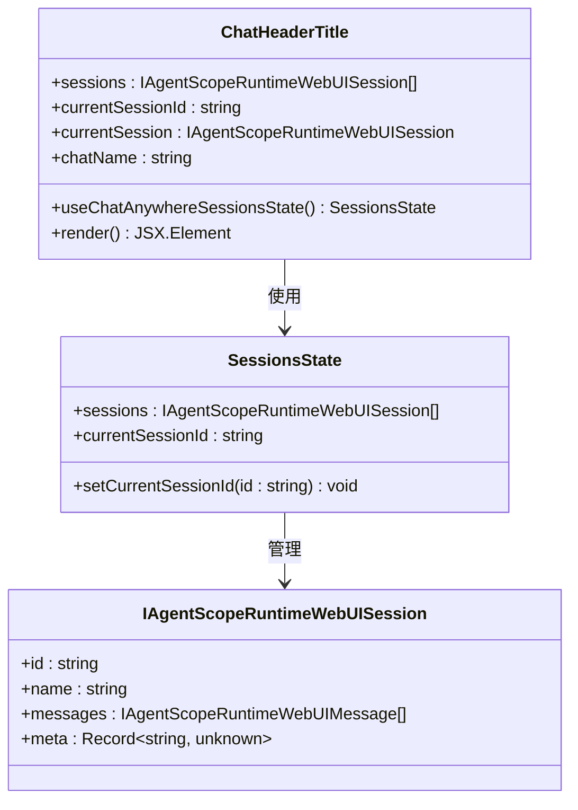
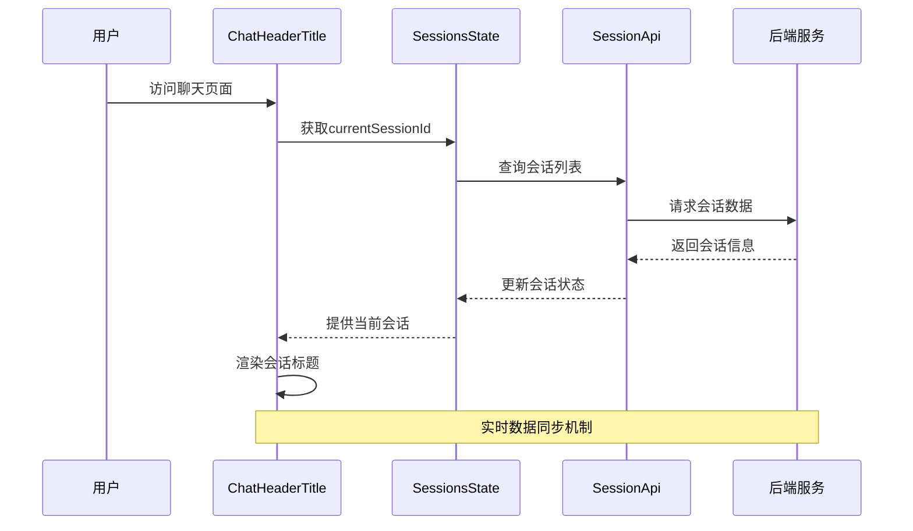
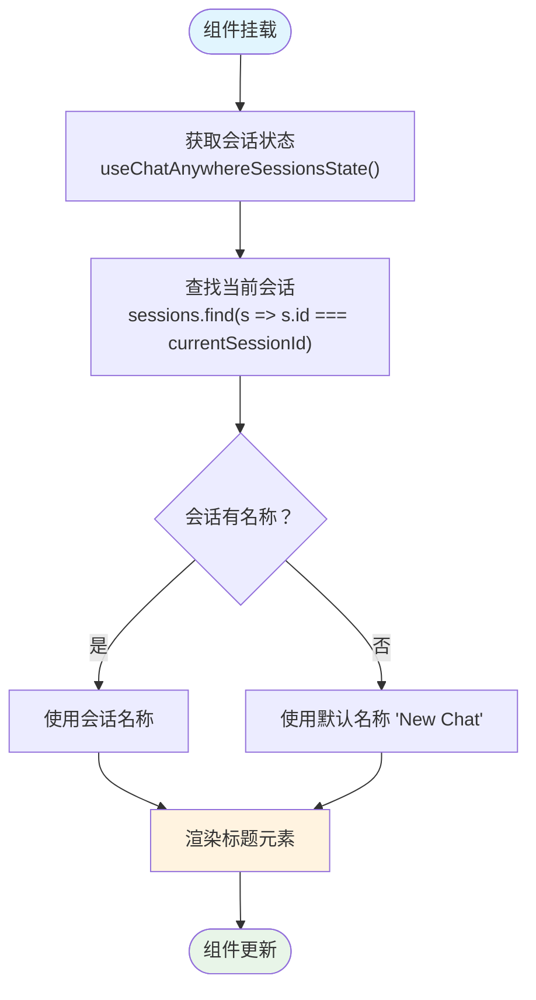
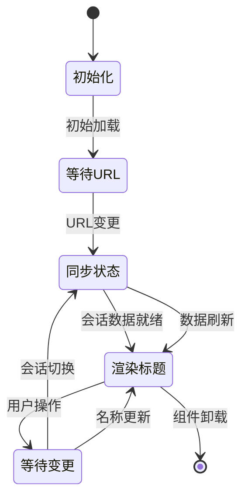
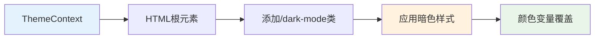
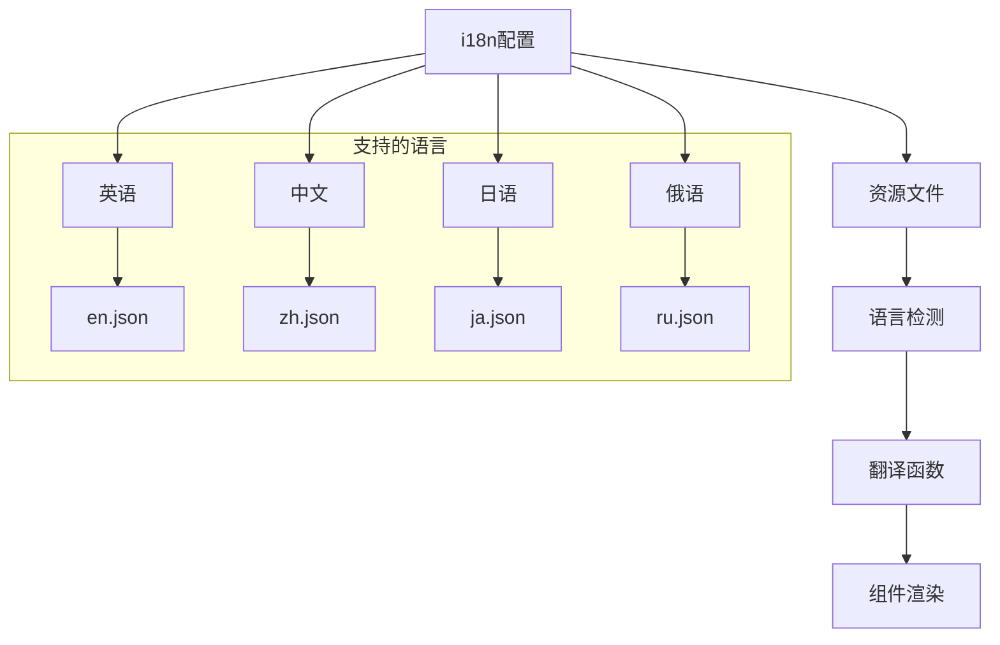
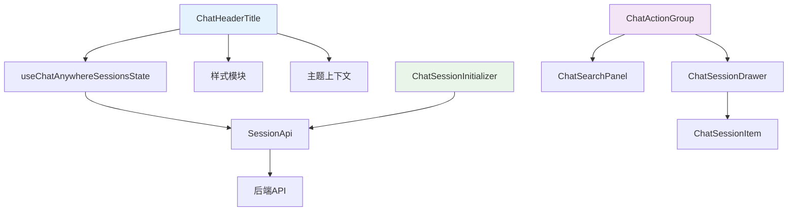
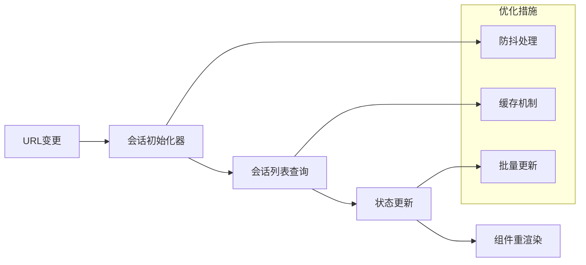

# 聊天头部标题组件

<cite>
**本文档引用的文件**
- [ChatHeaderTitle/index.tsx](file://console/src/pages/Chat/components/ChatHeaderTitle/index.tsx)
- [ChatHeaderTitle/index.module.less](file://console/src/pages/Chat/components/ChatHeaderTitle/index.module.less)
- [Chat/index.tsx](file://console/src/pages/Chat/index.tsx)
- [ChatSessionInitializer/index.tsx](file://console/src/pages/Chat/components/ChatSessionInitializer/index.tsx)
- [ChatSessionDrawer/index.tsx](file://console/src/pages/Chat/components/ChatSessionDrawer/index.tsx)
- [ChatSessionItem/index.tsx](file://console/src/pages/Chat/components/ChatSessionItem/index.tsx)
- [sessionApi/index.ts](file://console/src/pages/Chat/sessionApi/index.ts)
- [ChatActionGroup/index.tsx](file://console/src/pages/Chat/components/ChatActionGroup/index.tsx)
- [ChatSearchPanel/index.tsx](file://console/src/pages/Chat/components/ChatSearchPanel/index.tsx)
- [ThemeContext.tsx](file://console/src/contexts/ThemeContext.tsx)
- [i18n.ts](file://console/src/i18n.ts)
- [index.module.less](file://console/src/pages/Chat/index.module.less)
</cite>

## 目录
1. [简介](#简介)
2. [项目结构](#项目结构)
3. [核心组件](#核心组件)
4. [架构概览](#架构概览)
5. [详细组件分析](#详细组件分析)
6. [依赖关系分析](#依赖关系分析)
7. [性能考虑](#性能考虑)
8. [故障排除指南](#故障排除指南)
9. [结论](#结论)

## 简介

聊天头部标题组件是QwenPaw聊天界面中的关键UI元素，负责显示当前会话的标题信息。该组件实现了会话信息展示、标题自定义和动态更新机制，为用户提供直观的会话标识和导航功能。

本组件基于React构建，集成了会话状态管理、主题适配和国际化支持，提供了完整的响应式设计和交互功能。组件通过与AgentScope聊天运行时库的深度集成，实现了会话信息的实时同步和状态管理。

## 项目结构

聊天头部标题组件位于聊天页面的组件目录中，采用模块化设计，便于维护和扩展：

```mermaid
graph TB
subgraph "聊天页面组件结构"
A[ChatHeaderTitle 组件] --> B[样式文件]
A --> C[会话状态管理]
A --> D[主题上下文]
A --> E[国际化支持]
end
subgraph "相关集成组件"
F[ChatSessionInitializer] --> G[会话API]
H[ChatActionGroup] --> I[搜索面板]
J[ChatSessionDrawer] --> K[会话项组件]
end
subgraph "外部依赖"
L[@agentscope-ai/chat] --> M[聊天运行时库]
N[Ant Design] --> O[UI组件库]
P[i18next] --> Q[国际化框架]
end
A --> F
A --> H
A --> L
A --> N
A --> P
```

**图表来源**
- [ChatHeaderTitle/index.tsx:1-14](file://console/src/pages/Chat/components/ChatHeaderTitle/index.tsx#L1-L14)
- [Chat/index.tsx:27-730](file://console/src/pages/Chat/index.tsx#L27-L730)

**章节来源**
- [ChatHeaderTitle/index.tsx:1-14](file://console/src/pages/Chat/components/ChatHeaderTitle/index.tsx#L1-L14)
- [Chat/index.tsx:1-894](file://console/src/pages/Chat/index.tsx#L1-L894)

## 核心组件

### ChatHeaderTitle 组件架构

ChatHeaderTitle组件是一个轻量级的纯函数组件，专注于会话标题的显示和管理：



**图表来源**
- [ChatHeaderTitle/index.tsx:5-11](file://console/src/pages/Chat/components/ChatHeaderTitle/index.tsx#L5-L11)
- [sessionApi/index.ts:254-266](file://console/src/pages/Chat/sessionApi/index.ts#L254-L266)

### 会话信息展示机制

组件通过以下流程获取和显示会话信息：

1. **状态订阅**: 使用`useChatAnywhereSessionsState`钩子订阅会话状态变化
2. **会话查找**: 基于`currentSessionId`在会话列表中查找当前会话
3. **标题渲染**: 显示会话名称或默认"New Chat"文本

**章节来源**
- [ChatHeaderTitle/index.tsx:6-10](file://console/src/pages/Chat/components/ChatHeaderTitle/index.tsx#L6-L10)

## 架构概览

### 整体系统架构

```mermaid
graph TB
subgraph "用户界面层"
A[ChatHeaderTitle] --> B[ChatActionGroup]
B --> C[ChatSessionDrawer]
B --> D[ChatSearchPanel]
end
subgraph "状态管理层"
E[useChatAnywhereSessionsState] --> F[SessionApi]
F --> G[后端API]
end
subgraph "主题和国际化"
H[ThemeContext] --> I[主题切换]
J[i18n] --> K[多语言支持]
end
subgraph "外部集成"
L[@agentscope-ai/chat] --> M[聊天运行时]
N[Ant Design] --> O[UI组件]
end
A --> E
A --> H
A --> J
A --> L
B --> N
C --> G
D --> G
```

**图表来源**
- [Chat/index.tsx:400-827](file://console/src/pages/Chat/index.tsx#L400-L827)
- [ChatHeaderTitle/index.tsx:1-14](file://console/src/pages/Chat/components/ChatHeaderTitle/index.tsx#L1-L14)

### 数据流架构



**图表来源**
- [ChatSessionInitializer/index.tsx:19-34](file://console/src/pages/Chat/components/ChatSessionInitializer/index.tsx#L19-L34)
- [sessionApi/index.ts:522-535](file://console/src/pages/Chat/sessionApi/index.ts#L522-L535)

## 详细组件分析

### ChatHeaderTitle 组件实现

#### 核心功能实现

组件的核心逻辑简洁而高效：



**图表来源**
- [ChatHeaderTitle/index.tsx:6-10](file://console/src/pages/Chat/components/ChatHeaderTitle/index.tsx#L6-L10)

#### 样式设计分析

组件采用CSS Modules进行样式管理，支持主题适配：

| 样式属性 | 值 | 说明 |
|---------|----|-----|
| 字体大小 | 16px | 主要标题字号 |
| 字体粗细 | 500 | 中等字重 |
| 行高 | 22px | 文本行间距 |
| 颜色 | var(--colorText, rgba(0, 0, 0, 0.88)) | 支持CSS变量 |
| 最大宽度 | 240px | 防止标题过长 |
| 溢出处理 | ellipsis | 超出省略号 |

**章节来源**
- [ChatHeaderTitle/index.module.less:1-17](file://console/src/pages/Chat/components/ChatHeaderTitle/index.module.less#L1-L17)

### 会话状态管理

#### 状态同步机制



**图表来源**
- [ChatSessionInitializer/index.tsx:25-34](file://console/src/pages/Chat/components/ChatSessionInitializer/index.tsx#L25-L34)

#### 会话信息字段

组件可访问的会话信息包括：

| 字段名 | 类型 | 描述 | 来源 |
|-------|------|------|------|
| id | string | 会话唯一标识符 | 会话API |
| name | string | 会话显示名称 | 会话API |
| sessionId | string | 后端会话ID | 扩展字段 |
| userId | string | 用户标识符 | 扩展字段 |
| channel | string | 通信渠道 | 扩展字段 |
| createdAt | string | 创建时间 | 扩展字段 |
| status | ChatStatus | 会话状态 | 扩展字段 |
| generating | boolean | 生成状态 | 扩展字段 |

**章节来源**
- [sessionApi/index.ts:62-81](file://console/src/pages/Chat/sessionApi/index.ts#L62-L81)

### 主题适配机制

#### 暗色模式支持

组件通过全局CSS类实现暗色模式适配：



**图表来源**
- [ThemeContext.tsx:58-65](file://console/src/contexts/ThemeContext.tsx#L58-L65)
- [ChatHeaderTitle/index.module.less:13-17](file://console/src/pages/Chat/components/ChatHeaderTitle/index.module.less#L13-L17)

#### 响应式设计

组件支持多种屏幕尺寸的自适应：

- **桌面端**: 最大宽度240px，防止标题溢出
- **移动端**: 通过父容器的flex布局自动调整
- **高DPI屏幕**: 通过CSS变量确保清晰度

**章节来源**
- [ChatHeaderTitle/index.module.less:6-9](file://console/src/pages/Chat/components/ChatHeaderTitle/index.module.less#L6-L9)

### 国际化支持

#### 多语言实现

组件通过i18n框架支持多语言：



**图表来源**
- [i18n.ts:7-20](file://console/src/i18n.ts#L7-L20)

#### 默认文本处理

当会话名称为空时，组件显示"New Chat"作为默认标题，该文本通过i18n框架进行本地化处理。

**章节来源**
- [ChatHeaderTitle/index.tsx:8-8](file://console/src/pages/Chat/components/ChatHeaderTitle/index.tsx#L8-L8)

## 依赖关系分析

### 组件间依赖关系



**图表来源**
- [Chat/index.tsx:27-730](file://console/src/pages/Chat/index.tsx#L27-L730)
- [ChatHeaderTitle/index.tsx:2-3](file://console/src/pages/Chat/components/ChatHeaderTitle/index.tsx#L2-L3)

### 外部依赖分析

| 依赖包 | 版本 | 用途 | 关键功能 |
|-------|------|------|----------|
| @agentscope-ai/chat | ^1.0.0 | 聊天运行时 | 会话状态管理、UI渲染 |
| antd | ^4.0.0 | UI组件库 | 基础组件、样式系统 |
| react-i18next | ^11.0.0 | 国际化 | 多语言支持 |
| less | ^4.0.0 | 样式预处理器 | CSS模块化 |

**章节来源**
- [Chat/index.tsx:1-50](file://console/src/pages/Chat/index.tsx#L1-L50)

## 性能考虑

### 渲染优化策略

1. **最小化重新渲染**: 组件仅在`currentSessionId`变化时更新
2. **内存优化**: 使用引用避免不必要的状态更新
3. **样式缓存**: CSS Modules确保样式缓存效率

### 数据获取优化



**图表来源**
- [ChatSessionInitializer/index.tsx:25-34](file://console/src/pages/Chat/components/ChatSessionInitializer/index.tsx#L25-L34)

## 故障排除指南

### 常见问题及解决方案

#### 会话标题不显示

**问题描述**: 标题区域显示为空白或默认文本

**可能原因**:
1. 会话状态未正确初始化
2. 当前会话ID不存在
3. API调用失败

**解决步骤**:
1. 检查会话API连接状态
2. 验证`currentSessionId`的有效性
3. 查看控制台错误日志

#### 主题切换异常

**问题描述**: 暗色模式下标题颜色不正确

**解决方法**:
1. 确认HTML根元素包含`dark-mode`类
2. 检查CSS变量是否正确设置
3. 刷新页面重新应用主题

**章节来源**
- [ThemeContext.tsx:58-65](file://console/src/contexts/ThemeContext.tsx#L58-L65)

## 结论

聊天头部标题组件作为QwenPaw聊天界面的重要组成部分，展现了现代前端开发的最佳实践。组件通过简洁的架构设计、完善的主题适配和国际化支持，为用户提供了优秀的用户体验。

### 主要优势

1. **架构简洁**: 组件职责单一，易于维护和测试
2. **性能优秀**: 通过状态管理和优化策略确保流畅体验
3. **扩展性强**: 基于标准的React Hooks模式，便于功能扩展
4. **用户体验**: 响应式设计和主题适配提升可用性

### 技术亮点

- **状态管理**: 与AgentScope聊天运行时深度集成
- **主题系统**: 完整的明暗主题支持
- **国际化**: 多语言本地化实现
- **响应式设计**: 适配多种设备和屏幕尺寸

该组件为整个聊天系统的用户界面奠定了坚实的基础，体现了高质量软件工程的设计理念和实现水平。