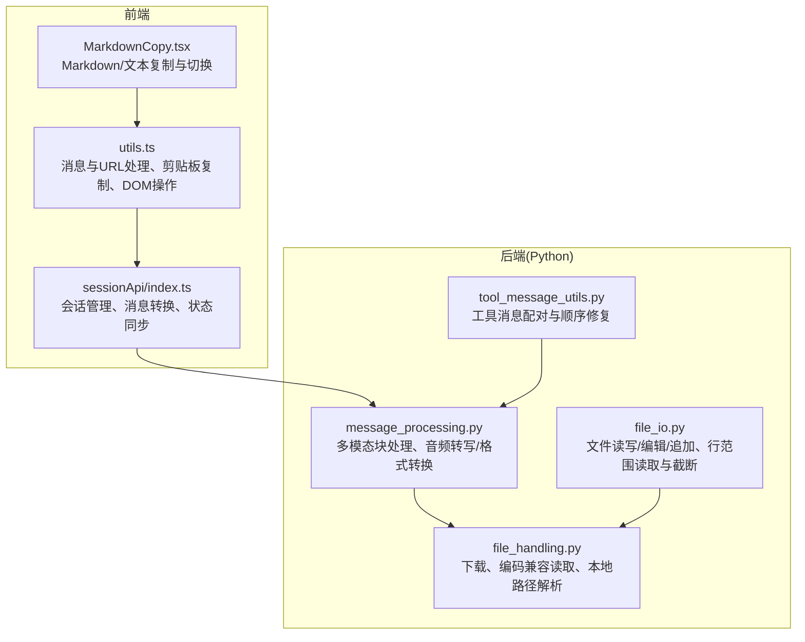
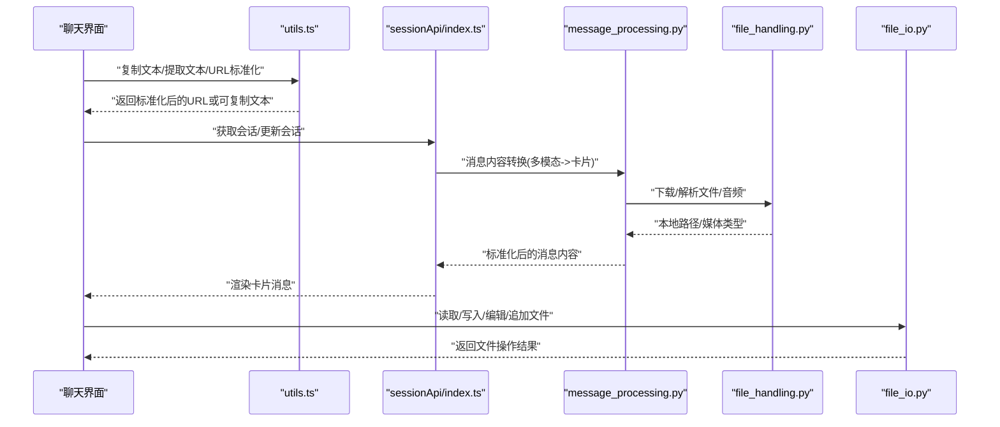
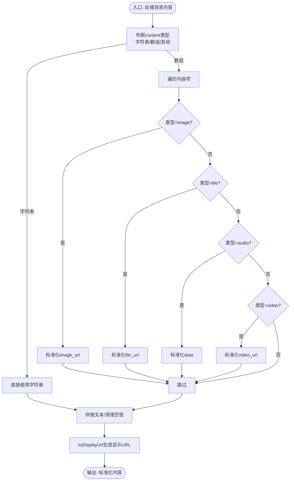
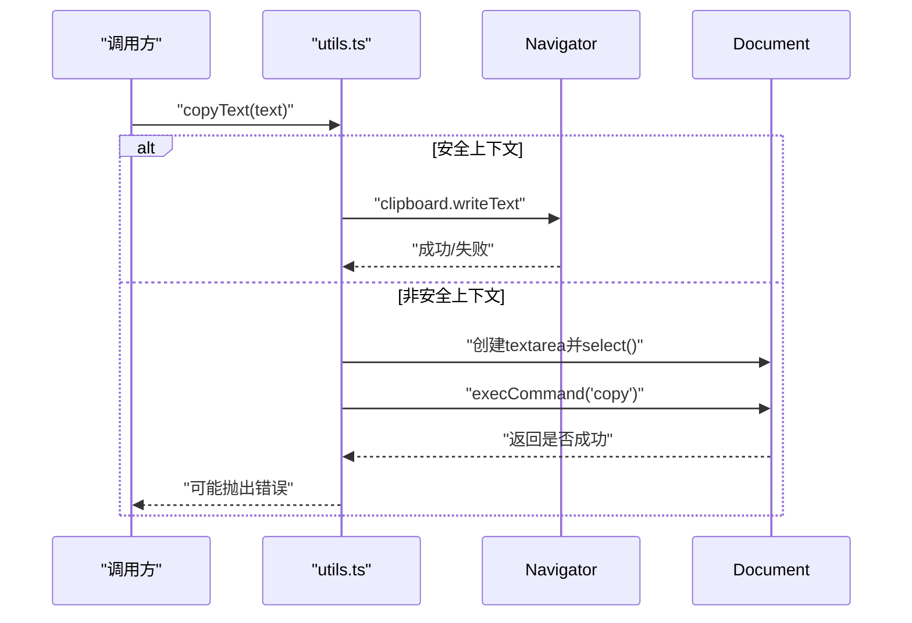
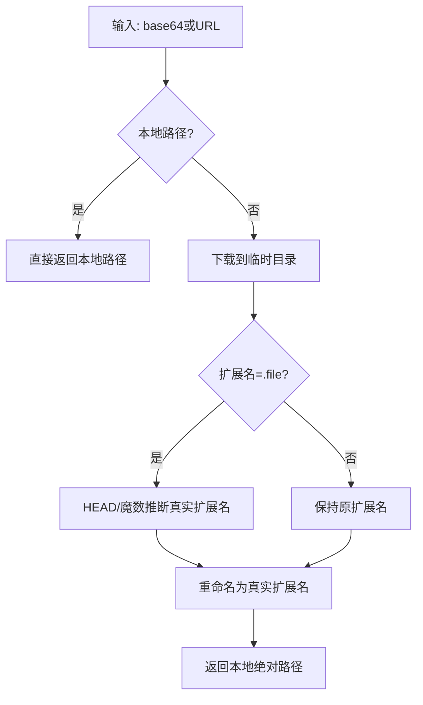
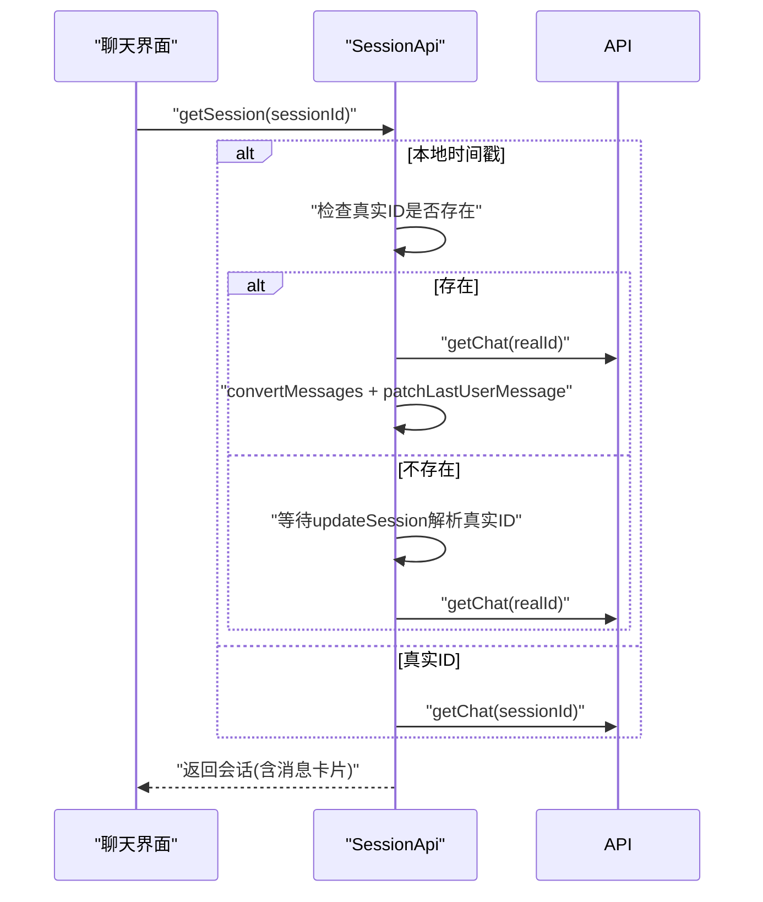
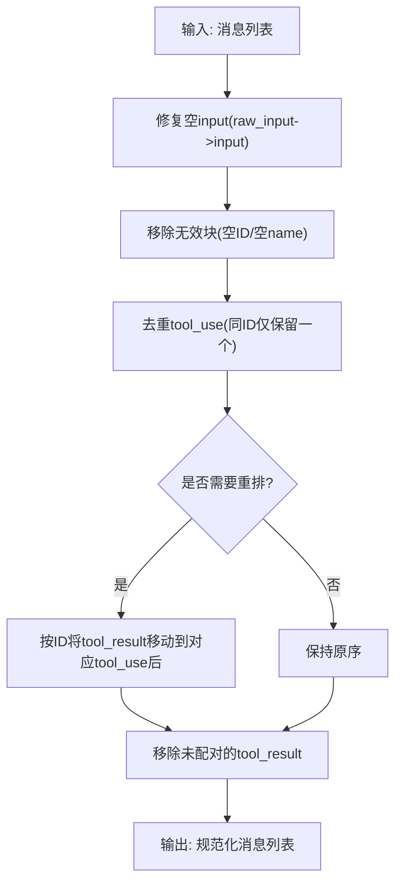
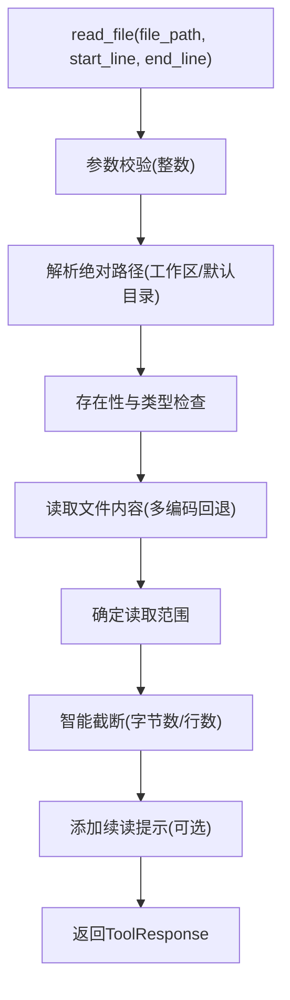
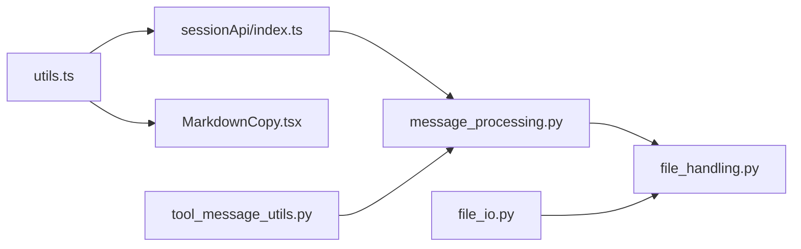

# 聊天工具函数集合

<cite>
**本文引用的文件**
- [utils.ts](file://console/src/pages/Chat/utils.ts)
- [sessionApi/index.ts](file://console/src/pages/Chat/sessionApi/index.ts)
- [MarkdownCopy.tsx](file://console/src/components/MarkdownCopy/MarkdownCopy.tsx)
- [message_processing.py](file://src/qwenpaw/agents/utils/message_processing.py)
- [tool_message_utils.py](file://src/qwenpaw/agents/utils/tool_message_utils.py)
- [file_handling.py](file://src/qwenpaw/agents/utils/file_handling.py)
- [file_io.py](file://src/qwenpaw/agents/tools/file_io.py)
- [error.ts](file://console/src/utils/error.ts)
</cite>

## 目录
1. [简介](#简介)
2. [项目结构](#项目结构)
3. [核心组件](#核心组件)
4. [架构总览](#架构总览)
5. [详细组件分析](#详细组件分析)
6. [依赖分析](#依赖分析)
7. [性能考虑](#性能考虑)
8. [故障排查指南](#故障排查指南)
9. [结论](#结论)
10. [附录](#附录)

## 简介
本技术文档聚焦于QwenPaw聊天工具函数集合，系统梳理并深入解析以下能力：
- 消息处理：多模态内容解析（文本、图片、音频、视频、文件）、媒体URL标准化与显示URL生成
- 文本操作：复制文本提取、用户消息识别、文本内容转换
- 文件上传与预览：文件大小与类型校验、预览URL生成、跨平台编码兼容读取
- 聊天状态管理：会话ID映射、消息历史跟踪、状态同步与去重
- 错误处理、性能优化与可复用性设计

文档以代码级分析为基础，配合流程图与类图，帮助读者快速理解各模块职责、数据流与交互方式。

## 项目结构
本节从聊天工具函数的角度，概览前端与后端（Python）侧的关键文件与职责划分：
- 前端聊天页面工具函数：负责消息内容提取、剪贴板复制、URL标准化与显示、DOM操作等
- 前端会话API：负责会话列表与单会话加载、消息卡片化渲染、状态同步与去重
- Markdown复制组件：提供Markdown/纯文本切换与复制能力
- 后端消息处理与工具消息校验：负责多模态块处理、音频转写或格式转换、工具消息配对与顺序修复
- 文件处理与IO工具：负责下载、编码兼容读取、安全路径解析、行范围读取与智能截断

图表来源
- [utils.ts:1-208](file://console/src/pages/Chat/utils.ts#L1-L208)
- [sessionApi/index.ts:1-735](file://console/src/pages/Chat/sessionApi/index.ts#L1-L735)
- [MarkdownCopy.tsx:1-197](file://console/src/components/MarkdownCopy/MarkdownCopy.tsx#L1-L197)
- [message_processing.py:1-476](file://src/qwenpaw/agents/utils/message_processing.py#L1-L476)
- [tool_message_utils.py:1-390](file://src/qwenpaw/agents/utils/tool_message_utils.py#L1-L390)
- [file_handling.py:1-357](file://src/qwenpaw/agents/utils/file_handling.py#L1-L357)
- [file_io.py:1-396](file://src/qwenpaw/agents/tools/file_io.py#L1-L396)

章节来源
- [utils.ts:1-208](file://console/src/pages/Chat/utils.ts#L1-L208)
- [sessionApi/index.ts:1-735](file://console/src/pages/Chat/sessionApi/index.ts#L1-L735)
- [MarkdownCopy.tsx:1-197](file://console/src/components/MarkdownCopy/MarkdownCopy.tsx#L1-L197)
- [message_processing.py:1-476](file://src/qwenpaw/agents/utils/message_processing.py#L1-L476)
- [tool_message_utils.py:1-390](file://src/qwenpaw/agents/utils/tool_message_utils.py#L1-L390)
- [file_handling.py:1-357](file://src/qwenpaw/agents/utils/file_handling.py#L1-L357)
- [file_io.py:1-396](file://src/qwenpaw/agents/tools/file_io.py#L1-L396)

## 核心组件
本节对聊天工具函数的核心能力进行分层说明，并给出关键实现位置与调用关系。

- 消息内容处理与URL标准化
  - 提取助手响应中的可复制文本、提取用户消息文本、从消息卡片中抽取用户输入
  - 将内容部分的URL标准化为后端存储路径，或将后端存储路径转换为前端显示URL
  - 将多模态内容（图片/音频/视频/文件）映射为UI可展示的卡片内容
  - 关键实现位置：
    - [extractCopyableText:29-60](file://console/src/pages/Chat/utils.ts#L29-L60)
    - [extractUserMessageText:62-70](file://console/src/pages/Chat/utils.ts#L62-L70)
    - [extractTextFromMessage:72-76](file://console/src/pages/Chat/utils.ts#L72-L76)
    - [normalizeContentUrls:165-177](file://console/src/pages/Chat/utils.ts#L165-L177)
    - [toDisplayUrl:179-185](file://console/src/pages/Chat/utils.ts#L179-L185)
    - [contentToRequestParts:123-141](file://console/src/pages/Chat/sessionApi/index.ts#L123-L141)
    - [normalizeOutputMessageContent:142-146](file://console/src/pages/Chat/sessionApi/index.ts#L142-L146)

- 剪贴板复制与DOM操作
  - 在安全上下文优先使用现代剪贴板API；非安全上下文回退至textarea选择复制
  - 设置textarea值并触发React内部事件，确保状态同步
  - 关键实现位置：
    - [copyText:82-108](file://console/src/pages/Chat/utils.ts#L82-L108)
    - [setTextareaValue:191-207](file://console/src/pages/Chat/utils.ts#L191-L207)
    - [MarkdownCopy 复制逻辑:77-111](file://console/src/components/MarkdownCopy/MarkdownCopy.tsx#L77-L111)

- 文件上传与预览
  - 下载base64或URL文件，自动推断真实扩展名，处理空文件与下载失败
  - 读取文件时采用多编码回退策略，提升跨平台兼容性
  - 生成预览URL（统一前缀），支持Windows绝对路径与相对路径
  - 关键实现位置：
    - [download_file_from_base64:246-284](file://src/qwenpaw/agents/utils/file_handling.py#L246-L284)
    - [download_file_from_url:287-356](file://src/qwenpaw/agents/utils/file_handling.py#L287-L356)
    - [_guess_suffix_from_url_headers/_guess_suffix_from_file_content:196-244](file://src/qwenpaw/agents/utils/file_handling.py#L196-L244)
    - [read_text_file_with_encoding_fallback:31-103](file://src/qwenpaw/agents/utils/file_handling.py#L31-L103)
    - [toStoredName:144-163](file://console/src/pages/Chat/utils.ts#L144-L163)

- 聊天状态管理
  - 会话列表去重请求、单会话并发请求缓存、会话选中去重回调
  - 本地时间戳会话与真实ID映射、生成状态检测、消息补丁（未完成生成时保留最新用户消息）
  - 关键实现位置：
    - [SessionApi 类与方法:339-735](file://console/src/pages/Chat/sessionApi/index.ts#L339-L735)
    - [getSessionList/getSession/updateSession/createSession/removeSession:522-731](file://console/src/pages/Chat/sessionApi/index.ts#L522-L731)
    - [patchLastUserMessage:410-442](file://console/src/pages/Chat/sessionApi/index.ts#L410-L442)

- 工具消息校验与修复
  - 校验tool_use与tool_result是否成对出现，修复顺序与重复项
  - 修复空input但raw_input有效的场景，移除无效ID/名称的块
  - 关键实现位置：
    - [check_valid_messages:35-53](file://src/qwenpaw/agents/utils/tool_message_utils.py#L35-L53)
    - [extract_tool_ids:13-32](file://src/qwenpaw/agents/utils/tool_message_utils.py#L13-L32)
    - [_sanitize_tool_messages/_remove_unpaired_tool_messages/_reorder_tool_results:322-356](file://src/qwenpaw/agents/utils/tool_message_utils.py#L322-L356)

- 文本操作与文件IO
  - 行范围读取、智能截断与续读提示、编码选择（CSV/TSV/文本BOM）
  - 写入/编辑/追加文件，自动选择编码
  - 关键实现位置：
    - [read_file:66-206](file://src/qwenpaw/agents/tools/file_io.py#L66-L206)
    - [write_file/edit_file/append_file:208-396](file://src/qwenpaw/agents/tools/file_io.py#L208-L396)
    - [_get_encoding_for_file:42-64](file://src/qwenpaw/agents/tools/file_io.py#L42-L64)

章节来源
- [utils.ts:29-207](file://console/src/pages/Chat/utils.ts#L29-L207)
- [sessionApi/index.ts:339-735](file://console/src/pages/Chat/sessionApi/index.ts#L339-L735)
- [MarkdownCopy.tsx:77-111](file://console/src/components/MarkdownCopy/MarkdownCopy.tsx#L77-L111)
- [message_processing.py:25-476](file://src/qwenpaw/agents/utils/message_processing.py#L25-L476)
- [tool_message_utils.py:13-390](file://src/qwenpaw/agents/utils/tool_message_utils.py#L13-L390)
- [file_handling.py:246-356](file://src/qwenpaw/agents/utils/file_handling.py#L246-L356)
- [file_io.py:66-396](file://src/qwenpaw/agents/tools/file_io.py#L66-L396)

## 架构总览
下图展示了前端聊天工具函数与后端消息处理的整体交互：

图表来源
- [utils.ts:29-185](file://console/src/pages/Chat/utils.ts#L29-L185)
- [sessionApi/index.ts:123-252](file://console/src/pages/Chat/sessionApi/index.ts#L123-L252)
- [message_processing.py:388-432](file://src/qwenpaw/agents/utils/message_processing.py#L388-L432)
- [file_handling.py:246-356](file://src/qwenpaw/agents/utils/file_handling.py#L246-L356)
- [file_io.py:66-396](file://src/qwenpaw/agents/tools/file_io.py#L66-L396)

## 详细组件分析

### 组件A：消息内容处理与URL标准化
- 功能要点
  - 提取助手可复制文本：支持字符串与多模态数组，过滤text/refusal类型
  - 用户消息文本提取：从卡片内消息中抽取纯文本
  - URL标准化：将前端预览URL还原为后端存储路径，支持Windows绝对路径与查询/片段剥离
  - 显示URL生成：将后端存储路径或相对路径转换为完整预览URL
  - 多模态内容映射：将图片/音频/视频/文件映射为显示URL，补充文件名
- 复杂度与性能
  - 文本提取与拼接为线性复杂度，按消息数量与内容项数量线性增长
  - URL标准化与解码按路径段数线性处理，整体开销较小
- 错误处理
  - 非安全上下文回退复制失败抛出异常，调用方需捕获
  - toStoredName对Windows绝对路径与相对路径分别处理，避免错误归一化
- 可复用性
  - normalizeContentUrls与toStoredName独立封装，便于在不同模块复用

图表来源
- [utils.ts:29-185](file://console/src/pages/Chat/utils.ts#L29-L185)
- [sessionApi/index.ts:123-146](file://console/src/pages/Chat/sessionApi/index.ts#L123-L146)

章节来源
- [utils.ts:29-185](file://console/src/pages/Chat/utils.ts#L29-L185)
- [sessionApi/index.ts:123-146](file://console/src/pages/Chat/sessionApi/index.ts#L123-L146)

### 组件B：剪贴板复制与DOM操作
- 功能要点
  - 现代剪贴板API优先，非安全上下文回退textarea选择复制
  - setTextareaValue通过原生setter绕过React内部值追踪，手动触发input事件
- 复杂度与性能
  - 复制操作为O(n)文本长度，DOM操作开销极小
- 错误处理
  - 回退复制失败抛出异常，调用方应捕获并提示
- 可复用性
  - copyText与setTextareaValue作为通用工具，可在其他组件复用

图表来源
- [utils.ts:82-108](file://console/src/pages/Chat/utils.ts#L82-L108)

章节来源
- [utils.ts:82-108](file://console/src/pages/Chat/utils.ts#L82-L108)
- [utils.ts:191-207](file://console/src/pages/Chat/utils.ts#L191-L207)

### 组件C：文件上传与预览
- 功能要点
  - 支持base64与URL两种来源，自动推断真实扩展名（HEAD/魔数）
  - 多编码回退读取文本文件，兼容Windows记事本与跨平台差异
  - 生成预览URL，统一前缀，支持Windows绝对路径
- 复杂度与性能
  - 下载过程受网络与磁盘I/O影响；编码回退为常数次尝试
- 错误处理
  - 空文件、下载失败、编码失败均有明确异常与错误提示
- 可复用性
  - 下载与读取函数独立，便于在工具链中复用

图表来源
- [file_handling.py:246-356](file://src/qwenpaw/agents/utils/file_handling.py#L246-L356)

章节来源
- [file_handling.py:246-356](file://src/qwenpaw/agents/utils/file_handling.py#L246-L356)
- [utils.ts:144-185](file://console/src/pages/Chat/utils.ts#L144-L185)

### 组件D：聊天状态管理
- 功能要点
  - 会话列表去重请求、单会话并发请求缓存，避免重复网络请求
  - 本地时间戳ID与真实ID映射，首次解析后持久化
  - 生成状态检测：当最后一条消息为用户消息且会话处于运行中时，视为生成中
  - 消息补丁：在会话恢复时将未持久化的最新用户消息注入UI
- 复杂度与性能
  - Map缓存与去重逻辑为O(1)查找，消息补丁按消息数量线性
- 错误处理
  - 解析真实ID失败时回退本地会话，保证可用性
- 可复用性
  - SessionApi封装了完整的会话生命周期管理，可作为全局状态源

图表来源
- [sessionApi/index.ts:540-661](file://console/src/pages/Chat/sessionApi/index.ts#L540-L661)

章节来源
- [sessionApi/index.ts:339-735](file://console/src/pages/Chat/sessionApi/index.ts#L339-L735)

### 组件E：工具消息校验与修复
- 功能要点
  - 校验tool_use与tool_result是否成对出现
  - 修复顺序：将tool_result移动到对应tool_use之后
  - 去重：同一消息内相同ID的tool_use仅保留一个
  - 修复空input：从raw_input解析参数填充
- 复杂度与性能
  - 单次扫描与哈希表维护，整体近似O(n)
- 错误处理
  - 移除无效ID/名称的块，记录警告日志
- 可复用性
  - sanitize接口统一入口，便于在消息流中串联使用

图表来源
- [tool_message_utils.py:322-356](file://src/qwenpaw/agents/utils/tool_message_utils.py#L322-L356)

章节来源
- [tool_message_utils.py:13-390](file://src/qwenpaw/agents/utils/tool_message_utils.py#L13-L390)

### 组件F：文本操作与文件IO
- 功能要点
  - 行范围读取：支持start_line/end_line，自动计算范围与续读提示
  - 智能截断：根据最大字节数截断，保留首尾并添加标记
  - 编码选择：CSV/TSV/文本使用UTF-8-BOM，其他文件使用UTF-8
  - 写入/编辑/追加：自动选择编码，返回人类可读结果
- 复杂度与性能
  - 读取为O(n)行数；截断与编码选择为常数开销
- 错误处理
  - 参数类型错误、路径不存在、内容为空等均有明确错误响应
- 可复用性
  - 与工作区上下文结合，支持相对路径解析

图表来源
- [file_io.py:66-206](file://src/qwenpaw/agents/tools/file_io.py#L66-L206)

章节来源
- [file_io.py:66-396](file://src/qwenpaw/agents/tools/file_io.py#L66-L396)

## 依赖分析
- 前端模块间依赖
  - utils.ts被sessionApi与MarkdownCopy广泛使用
  - sessionApi依赖utils.ts的toDisplayUrl与消息转换函数
- 后端模块间依赖
  - message_processing依赖file_handling进行下载与路径解析
  - tool_message_utils与message_processing协同，确保消息合法性
  - file_io依赖file_handling进行编码与路径解析
- 外部依赖
  - 前端：@agentscope-ai/chat、@ant-design/x-markdown、Ant Design图标库
  - 后端：agentscope消息模型、子进程调用ffmpeg进行音频转换

图表来源
- [utils.ts:1-208](file://console/src/pages/Chat/utils.ts#L1-L208)
- [sessionApi/index.ts:1-735](file://console/src/pages/Chat/sessionApi/index.ts#L1-L735)
- [MarkdownCopy.tsx:1-197](file://console/src/components/MarkdownCopy/MarkdownCopy.tsx#L1-L197)
- [message_processing.py:1-476](file://src/qwenpaw/agents/utils/message_processing.py#L1-L476)
- [tool_message_utils.py:1-390](file://src/qwenpaw/agents/utils/tool_message_utils.py#L1-L390)
- [file_handling.py:1-357](file://src/qwenpaw/agents/utils/file_handling.py#L1-L357)
- [file_io.py:1-396](file://src/qwenpaw/agents/tools/file_io.py#L1-L396)

章节来源
- [utils.ts:1-208](file://console/src/pages/Chat/utils.ts#L1-L208)
- [sessionApi/index.ts:1-735](file://console/src/pages/Chat/sessionApi/index.ts#L1-L735)
- [MarkdownCopy.tsx:1-197](file://console/src/components/MarkdownCopy/MarkdownCopy.tsx#L1-L197)
- [message_processing.py:1-476](file://src/qwenpaw/agents/utils/message_processing.py#L1-L476)
- [tool_message_utils.py:1-390](file://src/qwenpaw/agents/utils/tool_message_utils.py#L1-L390)
- [file_handling.py:1-357](file://src/qwenpaw/agents/utils/file_handling.py#L1-L357)
- [file_io.py:1-396](file://src/qwenpaw/agents/tools/file_io.py#L1-L396)

## 性能考虑
- 并发控制
  - 会话列表与单会话请求均采用去重与缓存，避免重复网络请求
- I/O优化
  - 下载优先尝试wget/curl，失败回退urllib；编码回退为常数次尝试
- 渲染优化
  - 消息转换阶段一次性构建卡片，减少多次渲染
- 复制与DOM
  - setTextareaValue绕过React内部追踪，降低状态抖动风险

[本节为通用指导，无需列出具体文件来源]

## 故障排查指南
- 剪贴板复制失败
  - 确认当前上下文为安全（HTTPS），否则回退复制会抛错
  - 参考：[copyText:82-108](file://console/src/pages/Chat/utils.ts#L82-L108)
- 预览URL无法显示
  - 检查toStoredName是否正确剥离查询/片段，确认路径存在
  - 参考：[toStoredName:144-163](file://console/src/pages/Chat/utils.ts#L144-L163)
- 会话选中重复触发
  - 使用lastSelectedSessionId避免重复回调
  - 参考：[onSessionSelected去重:549-555](file://console/src/pages/Chat/sessionApi/index.ts#L549-L555)
- 工具消息不配对
  - 使用sanitize_tool_messages修复顺序与配对问题
  - 参考：[sanitize:322-356](file://src/qwenpaw/agents/utils/tool_message_utils.py#L322-L356)
- 文件读取乱码或失败
  - 使用read_text_file_with_encoding_fallback进行多编码回退
  - 参考：[read_text_file_with_encoding_fallback:31-103](file://src/qwenpaw/agents/utils/file_handling.py#L31-L103)
- 错误详情解析
  - 使用parseErrorDetail从错误消息中提取JSON细节
  - 参考：[parseErrorDetail:1-11](file://console/src/utils/error.ts#L1-L11)

章节来源
- [utils.ts:82-108](file://console/src/pages/Chat/utils.ts#L82-L108)
- [utils.ts:144-163](file://console/src/pages/Chat/utils.ts#L144-L163)
- [sessionApi/index.ts:549-555](file://console/src/pages/Chat/sessionApi/index.ts#L549-L555)
- [tool_message_utils.py:322-356](file://src/qwenpaw/agents/utils/tool_message_utils.py#L322-L356)
- [file_handling.py:31-103](file://src/qwenpaw/agents/utils/file_handling.py#L31-L103)
- [error.ts:1-11](file://console/src/utils/error.ts#L1-L11)

## 结论
本聊天工具函数集合围绕“消息内容处理、文本操作、文件上传与预览、会话状态管理”四大维度构建，前端与后端模块职责清晰、耦合度低、可复用性强。通过URL标准化、多模态内容映射、并发请求去重、工具消息修复与文件编码回退等机制，系统在易用性与稳定性之间取得良好平衡。建议在实际集成中：
- 优先使用标准化工具函数，避免重复实现
- 对会话状态变更注册回调，确保URL与路由同步
- 在工具消息流中串联sanitize，保障API一致性
- 对文件读写设置合理的超时与截断策略

[本节为总结性内容，无需列出具体文件来源]

## 附录
- 相关类型定义与常量
  - 前端类型：CopyableContent/CopyableMessage/CopyableResponse/RuntimeLoadingBridgeApi
  - 常量：默认用户ID、通道、会话名、卡片类型等
  - 参考：[utils.ts类型定义:4-23](file://console/src/pages/Chat/utils.ts#L4-L23)、[sessionApi常量:18-26](file://console/src/pages/Chat/sessionApi/index.ts#L18-L26)

章节来源
- [utils.ts:4-23](file://console/src/pages/Chat/utils.ts#L4-L23)
- [sessionApi/index.ts:18-26](file://console/src/pages/Chat/sessionApi/index.ts#L18-L26)