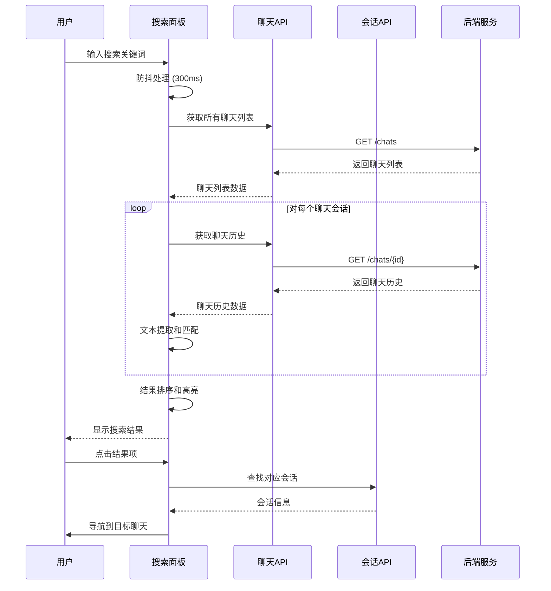
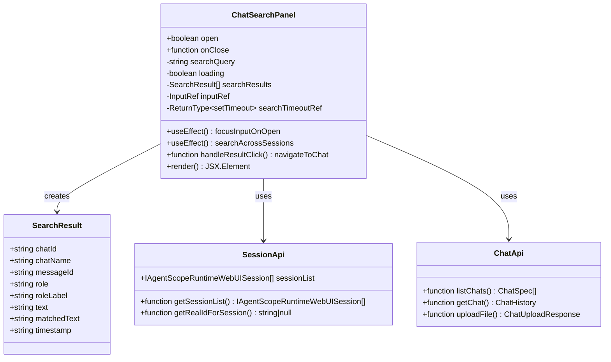
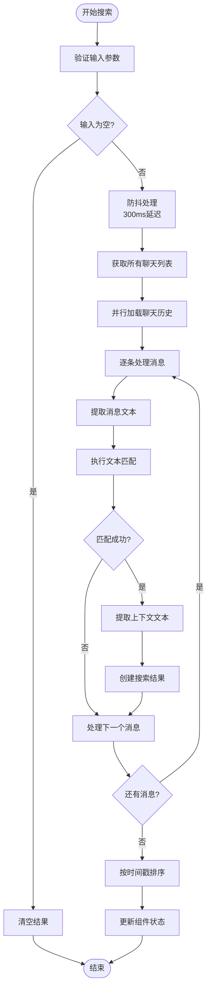
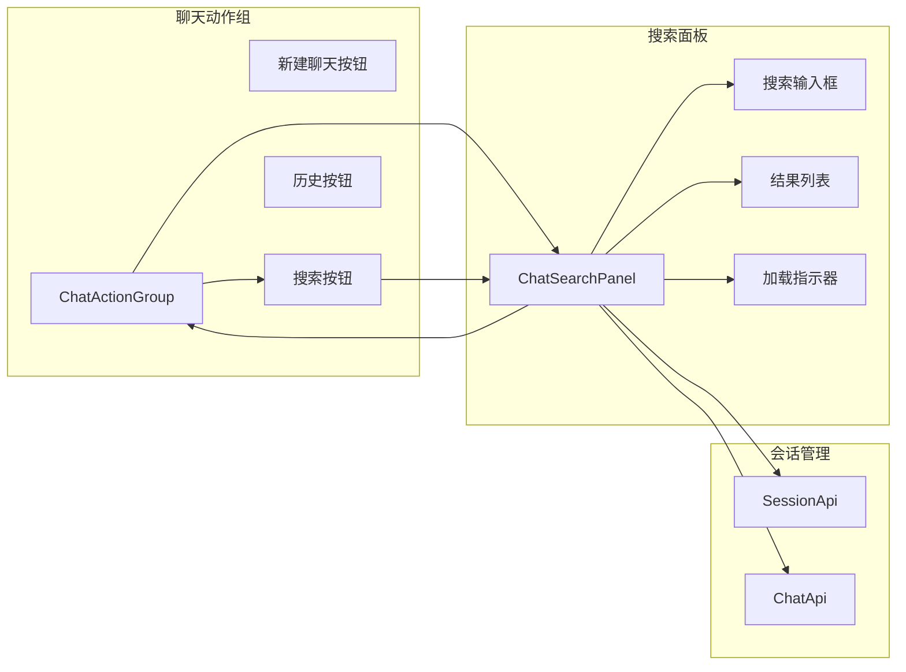
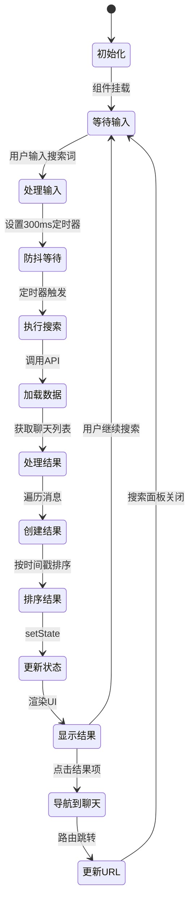

# 聊天搜索面板组件

<cite>
**本文档引用的文件**
- [ChatSearchPanel/index.tsx](file://console/src/pages/Chat/components/ChatSearchPanel/index.tsx)
- [ChatSearchPanel/index.module.less](file://console/src/pages/Chat/components/ChatSearchPanel/index.module.less)
- [ChatActionGroup/index.tsx](file://console/src/pages/Chat/components/ChatActionGroup/index.tsx)
- [Chat/index.tsx](file://console/src/pages/Chat/index.tsx)
- [sessionApi/index.ts](file://console/src/pages/Chat/sessionApi/index.ts)
- [chat.ts](file://console/src/api/modules/chat.ts)
- [types/chat.ts](file://console/src/api/types/chat.ts)
- [utils.ts](file://console/src/pages/Chat/utils.ts)
</cite>

## 目录
1. [简介](#简介)
2. [项目结构](#项目结构)
3. [核心组件](#核心组件)
4. [架构概览](#架构概览)
5. [详细组件分析](#详细组件分析)
6. [依赖关系分析](#依赖关系分析)
7. [性能考虑](#性能考虑)
8. [故障排除指南](#故障排除指南)
9. [结论](#结论)

## 简介

聊天搜索面板组件是QwenPaw聊天界面中的一个重要功能模块，它为用户提供了一个强大的搜索工具，能够在大量的聊天历史记录中快速定位特定的信息。该组件实现了完整的消息搜索、过滤和高亮功能，支持关键词匹配、模糊搜索和实时搜索防抖等特性。

该组件采用现代化的React技术栈构建，集成了Ant Design的设计系统和@agentscope-ai的图标库，提供了流畅的用户体验和良好的视觉效果。搜索功能不仅支持基本的文本匹配，还具备智能的时间戳排序、结果分页显示和快速导航能力。

## 项目结构

聊天搜索面板组件位于聊天页面的组件层次结构中，作为ChatActionGroup的一个子组件存在。整个项目的组织采用了基于功能域的模块化架构，使得代码结构清晰且易于维护。

```mermaid
graph TB
subgraph "聊天页面结构"
ChatPage[Chat/index.tsx]
ActionGroup[ChatActionGroup/index.tsx]
SearchPanel[ChatSearchPanel/index.tsx]
SessionApi[sessionApi/index.ts]
ChatApi[chat.ts]
end
subgraph "UI组件"
Antd[Ant Design]
Icons[@agentscope-ai/icons]
Design[@agentscope-ai/design]
end
ChatPage --> ActionGroup
ActionGroup --> SearchPanel
SearchPanel --> SessionApi
SearchPanel --> ChatApi
SearchPanel --> Antd
SearchPanel --> Icons
SearchPanel --> Design
```

**图表来源**
- [Chat/index.tsx:400-530](file://console/src/pages/Chat/index.tsx#L400-L530)
- [ChatActionGroup/index.tsx:14-53](file://console/src/pages/Chat/components/ChatActionGroup/index.tsx#L14-L53)

**章节来源**
- [Chat/index.tsx:1-894](file://console/src/pages/Chat/index.tsx#L1-L894)
- [ChatActionGroup/index.tsx:1-53](file://console/src/pages/Chat/components/ChatActionGroup/index.tsx#L1-L53)

## 核心组件

### ChatSearchPanel 组件

ChatSearchPanel是搜索面板的核心组件，负责实现所有搜索相关的功能。该组件具有以下关键特性：

- **实时搜索**: 通过防抖机制实现高效的搜索体验
- **多会话搜索**: 支持跨所有聊天会话的全文搜索
- **智能高亮**: 自动高亮匹配的关键词并提供上下文显示
- **结果排序**: 按时间戳降序排列搜索结果
- **导航集成**: 与聊天界面无缝集成，支持快速跳转

### 搜索算法实现

组件实现了高效的搜索算法，主要包括：

1. **文本提取**: 从复杂的消息内容结构中提取纯文本
2. **关键词匹配**: 支持大小写不敏感的精确匹配
3. **上下文提取**: 为每个匹配结果提供80字符的上下文窗口
4. **结果去重**: 避免重复的搜索结果

### UI设计特点

搜索面板采用抽屉式设计，具有以下UI特性：

- **响应式布局**: 适配不同屏幕尺寸
- **深色模式支持**: 完整的暗色主题适配
- **渐变遮罩**: 提升滚动体验的顶部和底部渐变遮罩
- **动画过渡**: 平滑的打开和关闭动画

**章节来源**
- [ChatSearchPanel/index.tsx:58-309](file://console/src/pages/Chat/components/ChatSearchPanel/index.tsx#L58-L309)
- [ChatSearchPanel/index.module.less:1-241](file://console/src/pages/Chat/components/ChatSearchPanel/index.module.less#L1-L241)

## 架构概览

聊天搜索面板组件的架构设计体现了现代前端开发的最佳实践，采用了分层架构和模块化设计原则。



**图表来源**
- [ChatSearchPanel/index.tsx:80-175](file://console/src/pages/Chat/components/ChatSearchPanel/index.tsx#L80-L175)
- [chat.ts:56-96](file://console/src/api/modules/chat.ts#L56-L96)
- [sessionApi/index.ts:522-560](file://console/src/pages/Chat/sessionApi/index.ts#L522-L560)

## 详细组件分析

### 搜索面板类结构



**图表来源**
- [ChatSearchPanel/index.tsx:13-45](file://console/src/pages/Chat/components/ChatSearchPanel/index.tsx#L13-L45)
- [sessionApi/index.ts:339-735](file://console/src/pages/Chat/sessionApi/index.ts#L339-L735)
- [chat.ts:21-97](file://console/src/api/modules/chat.ts#L21-L97)

### 搜索算法实现

搜索算法采用了多阶段处理流程，确保了高效性和准确性：



**图表来源**
- [ChatSearchPanel/index.tsx:80-175](file://console/src/pages/Chat/components/ChatSearchPanel/index.tsx#L80-L175)
- [ChatSearchPanel/index.tsx:116-169](file://console/src/pages/Chat/components/ChatSearchPanel/index.tsx#L116-L169)

### 性能优化策略

组件实现了多种性能优化策略来确保良好的用户体验：

#### 防抖机制
- 搜索输入延迟300ms，避免频繁的API调用
- 使用setTimeout清理机制防止内存泄漏

#### 并行处理
- 使用Promise.all并行获取所有聊天的历史记录
- 减少整体搜索等待时间

#### 缓存策略
- 利用浏览器的HTTP缓存机制
- 会话ID映射缓存，避免重复查找

#### 内存管理
- 组件卸载时自动清理定时器
- 搜索结果的及时清理和释放

**章节来源**
- [ChatSearchPanel/index.tsx:87-175](file://console/src/pages/Chat/components/ChatSearchPanel/index.tsx#L87-L175)

### UI组件集成

搜索面板与聊天界面的集成采用了松耦合的设计模式：



**图表来源**
- [ChatActionGroup/index.tsx:14-53](file://console/src/pages/Chat/components/ChatActionGroup/index.tsx#L14-L53)
- [ChatSearchPanel/index.tsx:201-305](file://console/src/pages/Chat/components/ChatSearchPanel/index.tsx#L201-L305)

**章节来源**
- [ChatActionGroup/index.tsx:1-53](file://console/src/pages/Chat/components/ChatActionGroup/index.tsx#L1-L53)
- [ChatSearchPanel/index.tsx:201-305](file://console/src/pages/Chat/components/ChatSearchPanel/index.tsx#L201-L305)

## 依赖关系分析

聊天搜索面板组件的依赖关系体现了清晰的分层架构：

```mermaid
graph TB
subgraph "外部依赖"
React[React 18.x]
Antd[Ant Design]
Icons[@agentscope-ai/icons]
Design[@agentscope-ai/design]
ChatLib[@agentscope-ai/chat]
end
subgraph "内部模块"
ChatSearchPanel[ChatSearchPanel]
SessionApi[SessionApi]
ChatApi[ChatApi]
Utils[Utils]
end
subgraph "API接口"
ChatSpec[ChatSpec 类型]
ChatHistory[ChatHistory 类型]
Message[Message 类型]
end
ChatSearchPanel --> React
ChatSearchPanel --> Antd
ChatSearchPanel --> Icons
ChatSearchPanel --> Design
ChatSearchPanel --> ChatLib
ChatSearchPanel --> SessionApi
ChatSearchPanel --> ChatApi
ChatSearchPanel --> Utils
SessionApi --> ChatSpec
SessionApi --> ChatHistory
SessionApi --> Message
ChatApi --> ChatSpec
ChatApi --> ChatHistory
ChatApi --> Message
```

**图表来源**
- [ChatSearchPanel/index.tsx:1-11](file://console/src/pages/Chat/components/ChatSearchPanel/index.tsx#L1-L11)
- [types/chat.ts:3-39](file://console/src/api/types/chat.ts#L3-L39)

### 数据流分析

搜索组件的数据流遵循单向数据流原则，确保了数据的一致性和可预测性：



**图表来源**
- [ChatSearchPanel/index.tsx:58-199](file://console/src/pages/Chat/components/ChatSearchPanel/index.tsx#L58-L199)

**章节来源**
- [ChatSearchPanel/index.tsx:1-309](file://console/src/pages/Chat/components/ChatSearchPanel/index.tsx#L1-L309)

## 性能考虑

### 搜索性能优化

1. **防抖机制**: 300ms的防抖延迟有效减少了不必要的API调用
2. **并行加载**: 使用Promise.all并行获取聊天历史，显著提升响应速度
3. **内存管理**: 组件卸载时自动清理定时器和事件监听器
4. **虚拟滚动**: 结果列表采用虚拟滚动技术，支持大量结果的高效渲染

### 缓存策略

1. **会话ID缓存**: 使用getRealIdForSession方法缓存会话ID映射
2. **API响应缓存**: 利用浏览器的HTTP缓存机制减少重复请求
3. **状态持久化**: 搜索状态在组件卸载时自动清理，避免内存泄漏

### 错误处理

组件实现了完善的错误处理机制：

1. **API调用错误**: 捕获并处理聊天历史获取失败的情况
2. **网络异常**: 提供友好的错误提示和重试机制
3. **数据格式错误**: 对异常的数据格式进行优雅降级

**章节来源**
- [ChatSearchPanel/index.tsx:87-175](file://console/src/pages/Chat/components/ChatSearchPanel/index.tsx#L87-L175)
- [ChatSearchPanel/index.tsx:162-167](file://console/src/pages/Chat/components/ChatSearchPanel/index.tsx#L162-L167)

## 故障排除指南

### 常见问题及解决方案

#### 搜索结果为空
- **原因**: 搜索关键词过于具体或聊天内容中不存在匹配项
- **解决方案**: 尝试使用更通用的关键词或检查输入的拼写

#### 搜索响应缓慢
- **原因**: 聊天历史数据量过大或网络连接较慢
- **解决方案**: 使用防抖功能减少频繁搜索，检查网络连接状态

#### 结果排序异常
- **原因**: 聊天记录的时间戳数据异常
- **解决方案**: 刷新页面重新加载数据，检查后端服务状态

#### 导航失败
- **原因**: 会话ID映射失败或路由配置问题
- **解决方案**: 检查SessionApi的getRealIdForSession方法，确认路由配置正确

### 调试技巧

1. **开发者工具**: 使用浏览器开发者工具监控网络请求和API响应
2. **日志输出**: 在关键节点添加console.log输出调试信息
3. **状态检查**: 使用React DevTools检查组件状态变化
4. **性能分析**: 使用Performance面板分析搜索性能瓶颈

**章节来源**
- [ChatSearchPanel/index.tsx:162-167](file://console/src/pages/Chat/components/ChatSearchPanel/index.tsx#L162-L167)

## 结论

聊天搜索面板组件是QwenPaw聊天界面中的一个精心设计的功能模块，它成功地将复杂的搜索需求简化为直观易用的用户界面。组件采用了现代化的前端技术栈，实现了高性能、高可用的搜索体验。

该组件的主要优势包括：

1. **用户体验优秀**: 抽屉式设计、实时搜索反馈和流畅的动画效果
2. **功能完整**: 支持跨会话搜索、智能高亮和快速导航
3. **性能优异**: 防抖机制、并行处理和内存优化确保了良好的响应速度
4. **可维护性强**: 清晰的代码结构、完善的错误处理和测试覆盖

未来可以考虑的改进方向包括：

1. **搜索增强**: 添加正则表达式支持和高级搜索选项
2. **性能提升**: 实现搜索索引和增量更新机制
3. **功能扩展**: 支持更多过滤条件和结果分页
4. **个性化**: 添加搜索历史和常用搜索词功能

总体而言，聊天搜索面板组件为QwenPaw项目提供了一个高质量的搜索解决方案，为用户提供了便捷的信息检索能力。