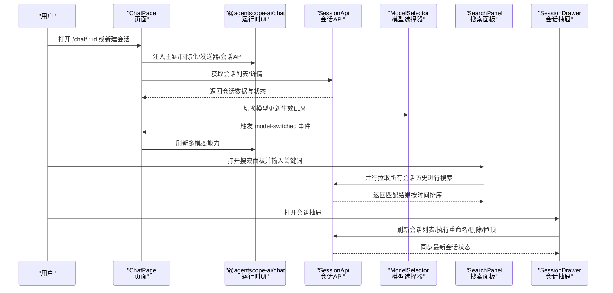
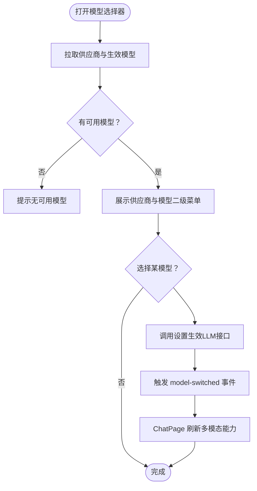
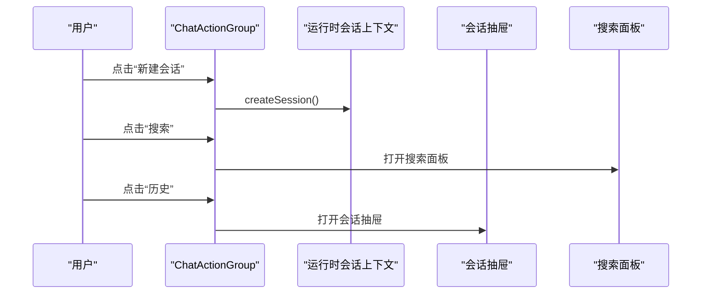
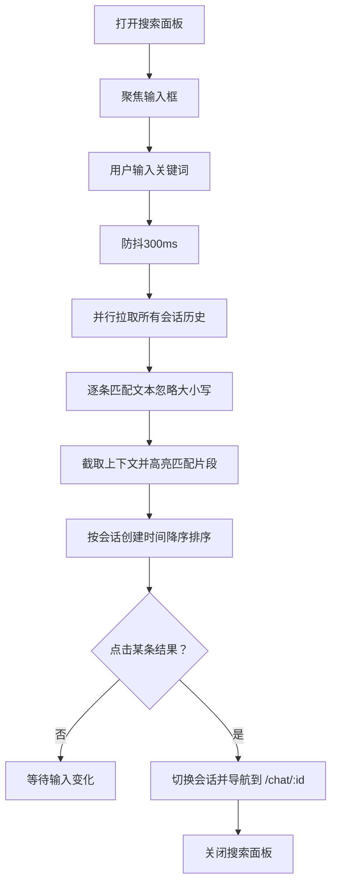
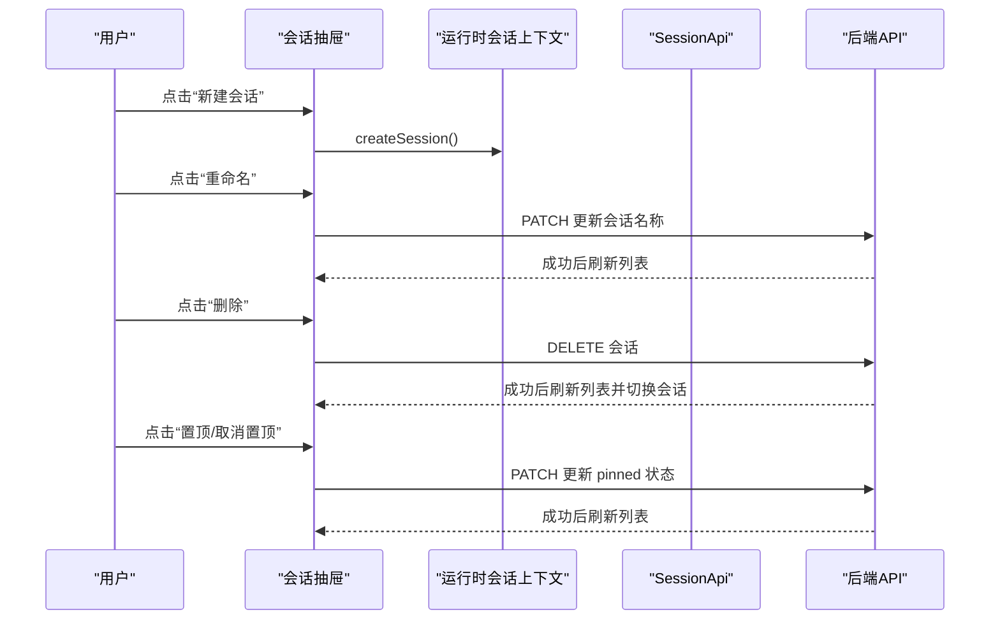
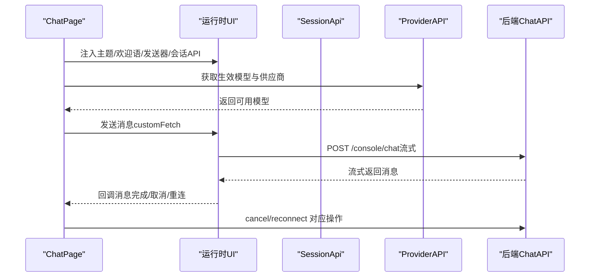
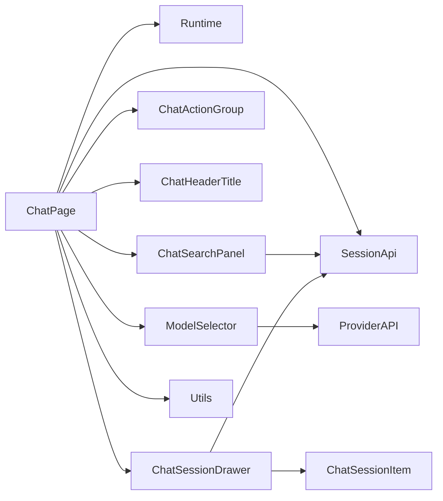

# 聊天界面页面

<cite>
**本文引用的文件**
- [console/src/pages/Chat/index.tsx](file://console/src/pages/Chat/index.tsx)
- [console/src/pages/Chat/index.module.less](file://console/src/pages/Chat/index.module.less)
- [console/src/pages/Chat/utils.ts](file://console/src/pages/Chat/utils.ts)
- [console/src/pages/Chat/sessionApi/index.ts](file://console/src/pages/Chat/sessionApi/index.ts)
- [console/src/pages/Chat/ModelSelector/index.tsx](file://console/src/pages/Chat/ModelSelector/index.tsx)
- [console/src/pages/Chat/ModelSelector/index.module.less](file://console/src/pages/Chat/ModelSelector/index.module.less)
- [console/src/pages/Chat/OptionsPanel/defaultConfig.ts](file://console/src/pages/Chat/OptionsPanel/defaultConfig.ts)
- [console/src/pages/Chat/components/ChatActionGroup/index.tsx](file://console/src/pages/Chat/components/ChatActionGroup/index.tsx)
- [console/src/pages/Chat/components/ChatHeaderTitle/index.tsx](file://console/src/pages/Chat/components/ChatHeaderTitle/index.tsx)
- [console/src/pages/Chat/components/ChatSearchPanel/index.tsx](file://console/src/pages/Chat/components/ChatSearchPanel/index.tsx)
- [console/src/pages/Chat/components/ChatSearchPanel/index.module.less](file://console/src/pages/Chat/components/ChatSearchPanel/index.module.less)
- [console/src/pages/Chat/components/ChatSessionDrawer/index.tsx](file://console/src/pages/Chat/components/ChatSessionDrawer/index.tsx)
- [console/src/pages/Chat/components/ChatSessionDrawer/index.module.less](file://console/src/pages/Chat/components/ChatSessionDrawer/index.module.less)
- [console/src/pages/Chat/components/ChatSessionInitializer/index.tsx](file://console/src/pages/Chat/components/ChatSessionInitializer/index.tsx)
- [console/src/pages/Chat/components/ChatSessionItem/index.tsx](file://console/src/pages/Chat/components/ChatSessionItem/index.tsx)
</cite>

## 目录
1. [简介](#简介)
2. [项目结构](#项目结构)
3. [核心组件](#核心组件)
4. [架构总览](#架构总览)
5. [详细组件分析](#详细组件分析)
6. [依赖关系分析](#依赖关系分析)
7. [性能考虑](#性能考虑)
8. [故障排查指南](#故障排查指南)
9. [结论](#结论)
10. [附录](#附录)

## 简介
本文件面向 QwenPaw 控制台中的“聊天界面页面”，系统性梳理其整体架构与实现细节，覆盖消息显示区域、输入组件、模型选择器、选项面板、聊天动作组、聊天头部标题、聊天搜索面板、聊天会话抽屉等模块，并给出聊天会话 API 的使用方法与最佳实践。文档同时提供响应式设计、性能优化与用户体验改进建议，帮助开发者快速理解并扩展该聊天界面。

## 项目结构
聊天页面位于控制台前端工程的页面目录中，采用按功能分层的组织方式：页面入口负责装配运行时 UI、会话 API、主题与国际化；各子组件分别承担模型选择、动作组、头部标题、搜索面板、会话抽屉与会话项渲染；工具函数提供复制、文本提取、URL 规范化等通用能力；会话 API 封装后端聊天会话的增删查改与状态同步。

```mermaid
graph TB
subgraph "页面层"
ChatPage["ChatPage<br/>console/src/pages/Chat/index.tsx"]
OptionsPanel["默认配置<br/>console/src/pages/Chat/OptionsPanel/defaultConfig.ts"]
end
subgraph "运行时与会话"
Runtime["@agentscope-ai/chat<br/>运行时UI"]
SessionApi["会话API<br/>console/src/pages/Chat/sessionApi/index.ts"]
end
subgraph "头部与动作"
ModelSelector["模型选择器<br/>console/src/pages/Chat/ModelSelector/index.tsx"]
ChatActionGroup["聊天动作组<br/>console/src/pages/Chat/components/ChatActionGroup/index.tsx"]
ChatHeaderTitle["聊天头部标题<br/>console/src/pages/Chat/components/ChatHeaderTitle/index.tsx"]
ChatSessionInitializer["会话初始化器<br/>console/src/pages/Chat/components/ChatSessionInitializer/index.tsx"]
end
subgraph "会话管理"
ChatSessionDrawer["会话抽屉<br/>console/src/pages/Chat/components/ChatSessionDrawer/index.tsx"]
ChatSessionItem["会话项<br/>console/src/pages/Chat/components/ChatSessionItem/index.tsx"]
ChatSearchPanel["搜索面板<br/>console/src/pages/Chat/components/ChatSearchPanel/index.tsx"]
end
subgraph "工具与样式"
Utils["工具函数<br/>console/src/pages/Chat/utils.ts"]
Styles["样式与主题<br/>console/src/pages/Chat/index.module.less"]
ModelSelStyles["模型选择器样式<br/>console/src/pages/Chat/ModelSelector/index.module.less"]
SearchStyles["搜索面板样式<br/>console/src/pages/Chat/components/ChatSearchPanel/index.module.less"]
DrawerStyles["会话抽屉样式<br/>console/src/pages/Chat/components/ChatSessionDrawer/index.module.less"]
end
ChatPage --> Runtime
ChatPage --> SessionApi
ChatPage --> OptionsPanel
ChatPage --> ModelSelector
ChatPage --> ChatActionGroup
ChatPage --> ChatHeaderTitle
ChatPage --> ChatSessionInitializer
ChatPage --> ChatSearchPanel
ChatPage --> ChatSessionDrawer
ChatSessionDrawer --> ChatSessionItem
ChatPage --> Utils
ChatPage --> Styles
ModelSelector --> ModelSelStyles
ChatSearchPanel --> SearchStyles
ChatSessionDrawer --> DrawerStyles
```

图表来源
- [console/src/pages/Chat/index.tsx:400-800](file://console/src/pages/Chat/index.tsx#L400-L800)
- [console/src/pages/Chat/sessionApi/index.ts:339-735](file://console/src/pages/Chat/sessionApi/index.ts#L339-L735)
- [console/src/pages/Chat/ModelSelector/index.tsx:24-267](file://console/src/pages/Chat/ModelSelector/index.tsx#L24-L267)
- [console/src/pages/Chat/components/ChatActionGroup/index.tsx:14-53](file://console/src/pages/Chat/components/ChatActionGroup/index.tsx#L14-L53)
- [console/src/pages/Chat/components/ChatHeaderTitle/index.tsx:5-14](file://console/src/pages/Chat/components/ChatHeaderTitle/index.tsx#L5-L14)
- [console/src/pages/Chat/components/ChatSessionDrawer/index.tsx:59-308](file://console/src/pages/Chat/components/ChatSessionDrawer/index.tsx#L59-L308)
- [console/src/pages/Chat/components/ChatSessionItem/index.tsx:54-180](file://console/src/pages/Chat/components/ChatSessionItem/index.tsx#L54-L180)
- [console/src/pages/Chat/components/ChatSearchPanel/index.tsx:58-309](file://console/src/pages/Chat/components/ChatSearchPanel/index.tsx#L58-L309)
- [console/src/pages/Chat/utils.ts:1-208](file://console/src/pages/Chat/utils.ts#L1-L208)
- [console/src/pages/Chat/index.module.less:1-134](file://console/src/pages/Chat/index.module.less#L1-L134)
- [console/src/pages/Chat/ModelSelector/index.module.less:1-261](file://console/src/pages/Chat/ModelSelector/index.module.less#L1-L261)
- [console/src/pages/Chat/components/ChatSearchPanel/index.module.less:1-241](file://console/src/pages/Chat/components/ChatSearchPanel/index.module.less#L1-L241)
- [console/src/pages/Chat/components/ChatSessionDrawer/index.module.less:1-181](file://console/src/pages/Chat/components/ChatSessionDrawer/index.module.less#L1-L181)

章节来源
- [console/src/pages/Chat/index.tsx:1-894](file://console/src/pages/Chat/index.tsx#L1-L894)
- [console/src/pages/Chat/index.module.less:1-134](file://console/src/pages/Chat/index.module.less#L1-L134)

## 核心组件
- 页面入口与运行时装配：通过运行时 UI 组件承载消息卡片渲染、输入与发送、取消与重连等交互；注入会话 API 实现多会话管理与状态同步；注入主题与国际化配置。
- 模型选择器：拉取可用供应商与模型，支持切换当前生效模型，并在切换后通知运行时刷新多模态能力。
- 聊天动作组：提供新建会话、搜索、历史抽屉等快捷入口。
- 聊天头部标题：展示当前会话名称。
- 会话抽屉：展示所有会话列表，支持新建、重命名、删除、置顶与跳转。
- 搜索面板：跨会话全文检索，支持高亮匹配片段与时间排序。
- 工具函数：统一处理复制、文本提取、错误响应、URL 规范化与输入框值设置。
- 会话 API：封装后端聊天接口，负责会话列表、详情、创建、删除与状态同步，支持本地临时会话到真实会话 ID 的解析与缓存。

章节来源
- [console/src/pages/Chat/index.tsx:400-800](file://console/src/pages/Chat/index.tsx#L400-L800)
- [console/src/pages/Chat/ModelSelector/index.tsx:24-267](file://console/src/pages/Chat/ModelSelector/index.tsx#L24-L267)
- [console/src/pages/Chat/components/ChatActionGroup/index.tsx:14-53](file://console/src/pages/Chat/components/ChatActionGroup/index.tsx#L14-L53)
- [console/src/pages/Chat/components/ChatHeaderTitle/index.tsx:5-14](file://console/src/pages/Chat/components/ChatHeaderTitle/index.tsx#L5-L14)
- [console/src/pages/Chat/components/ChatSessionDrawer/index.tsx:59-308](file://console/src/pages/Chat/components/ChatSessionDrawer/index.tsx#L59-L308)
- [console/src/pages/Chat/components/ChatSearchPanel/index.tsx:58-309](file://console/src/pages/Chat/components/ChatSearchPanel/index.tsx#L58-L309)
- [console/src/pages/Chat/utils.ts:1-208](file://console/src/pages/Chat/utils.ts#L1-L208)
- [console/src/pages/Chat/sessionApi/index.ts:339-735](file://console/src/pages/Chat/sessionApi/index.ts#L339-L735)

## 架构总览
下图展示了页面与运行时 UI、会话 API、模型选择器与搜索/抽屉组件之间的交互关系，以及数据流向（消息卡片、会话列表、模型切换、搜索结果）。

图表来源
- [console/src/pages/Chat/index.tsx:400-800](file://console/src/pages/Chat/index.tsx#L400-L800)
- [console/src/pages/Chat/sessionApi/index.ts:522-735](file://console/src/pages/Chat/sessionApi/index.ts#L522-L735)
- [console/src/pages/Chat/ModelSelector/index.tsx:137-166](file://console/src/pages/Chat/ModelSelector/index.tsx#L137-L166)
- [console/src/pages/Chat/components/ChatSearchPanel/index.tsx:80-175](file://console/src/pages/Chat/components/ChatSearchPanel/index.tsx#L80-L175)
- [console/src/pages/Chat/components/ChatSessionDrawer/index.tsx:97-155](file://console/src/pages/Chat/components/ChatSessionDrawer/index.tsx#L97-L155)

## 详细组件分析

### 模型选择器
- 功能概述
  - 加载可用供应商与模型，筛选已配置且可使用的模型集合。
  - 支持点击切换当前生效模型，保存至后端并触发页面刷新多模态能力。
  - 下拉菜单支持二级子菜单（供应商 -> 模型），并高亮当前选中模型。
- 关键流程
  - 首次加载与每次打开下拉框时重新获取“生效模型”。
  - 切换成功后通过自定义事件通知 ChatPage 更新多模态能力。
- 性能与体验
  - 使用防抖与并发请求去重，避免重复网络请求。
  - 在切换过程中显示保存状态，提升反馈及时性。

图表来源
- [console/src/pages/Chat/ModelSelector/index.tsx:38-166](file://console/src/pages/Chat/ModelSelector/index.tsx#L38-L166)
- [console/src/pages/Chat/index.tsx:217-224](file://console/src/pages/Chat/index.tsx#L217-L224)

章节来源
- [console/src/pages/Chat/ModelSelector/index.tsx:24-267](file://console/src/pages/Chat/ModelSelector/index.tsx#L24-L267)
- [console/src/pages/Chat/ModelSelector/index.module.less:1-261](file://console/src/pages/Chat/ModelSelector/index.module.less#L1-L261)

### 聊天动作组
- 功能概述
  - 提供“新建会话”“搜索”“历史”三个入口按钮。
  - 新建会话通过运行时会话上下文创建新会话。
  - 搜索与历史抽屉通过状态控制显隐。
- 交互要点
  - 使用气泡提示增强可发现性。
  - 与运行时会话上下文解耦，仅通过回调触发行为。

图表来源
- [console/src/pages/Chat/components/ChatActionGroup/index.tsx:14-53](file://console/src/pages/Chat/components/ChatActionGroup/index.tsx#L14-L53)
- [console/src/pages/Chat/components/ChatSessionDrawer/index.tsx:59-101](file://console/src/pages/Chat/components/ChatSessionDrawer/index.tsx#L59-L101)
- [console/src/pages/Chat/components/ChatSearchPanel/index.tsx:58-80](file://console/src/pages/Chat/components/ChatSearchPanel/index.tsx#L58-L80)

章节来源
- [console/src/pages/Chat/components/ChatActionGroup/index.tsx:14-53](file://console/src/pages/Chat/components/ChatActionGroup/index.tsx#L14-L53)

### 聊天头部标题
- 功能概述
  - 从运行时会话上下文中读取当前会话，展示会话名称。
  - 若未找到则回退为“新建会话”。

章节来源
- [console/src/pages/Chat/components/ChatHeaderTitle/index.tsx:5-14](file://console/src/pages/Chat/components/ChatHeaderTitle/index.tsx#L5-L14)

### 聊天搜索面板
- 功能概述
  - 全局跨会话搜索，对每个会话的历史消息进行内容提取与匹配。
  - 支持关键词高亮与上下文截取，按会话创建时间倒序排列。
  - 点击结果可切换会话并导航到对应聊天页。
- 性能策略
  - 输入防抖（300ms）减少频繁请求。
  - 并行拉取所有会话历史，避免串行等待。
  - 结果为空时显示占位提示，避免空白体验。

图表来源
- [console/src/pages/Chat/components/ChatSearchPanel/index.tsx:80-175](file://console/src/pages/Chat/components/ChatSearchPanel/index.tsx#L80-L175)
- [console/src/pages/Chat/components/ChatSearchPanel/index.tsx:177-199](file://console/src/pages/Chat/components/ChatSearchPanel/index.tsx#L177-L199)

章节来源
- [console/src/pages/Chat/components/ChatSearchPanel/index.tsx:58-309](file://console/src/pages/Chat/components/ChatSearchPanel/index.tsx#L58-L309)
- [console/src/pages/Chat/components/ChatSearchPanel/index.module.less:1-241](file://console/src/pages/Chat/components/ChatSearchPanel/index.module.less#L1-L241)

### 聊天会话抽屉
- 功能概述
  - 展示所有会话，支持新建、重命名、删除、置顶与跳转。
  - 会话排序规则：置顶优先，其次按创建时间倒序。
  - 与后端 API 协作，确保删除与更新操作实时同步。
- 交互细节
  - 删除当前会话时自动切换到下一个会话。
  - 重命名采用最小补丁提交，避免覆盖旧字段。
  - 置顶状态变更后刷新列表，保证 UI 与后端一致。

图表来源
- [console/src/pages/Chat/components/ChatSessionDrawer/index.tsx:97-155](file://console/src/pages/Chat/components/ChatSessionDrawer/index.tsx#L97-L155)
- [console/src/pages/Chat/components/ChatSessionDrawer/index.tsx:157-219](file://console/src/pages/Chat/components/ChatSessionDrawer/index.tsx#L157-L219)

章节来源
- [console/src/pages/Chat/components/ChatSessionDrawer/index.tsx:59-308](file://console/src/pages/Chat/components/ChatSessionDrawer/index.tsx#L59-L308)
- [console/src/pages/Chat/components/ChatSessionDrawer/index.module.less:1-181](file://console/src/pages/Chat/components/ChatSessionDrawer/index.module.less#L1-L181)

### 会话项组件
- 功能概述
  - 渲染单个会话项，包含名称、时间、渠道标签与状态指示。
  - 支持内联编辑模式（输入框），编辑完成后提交并刷新。
  - 提供置顶、编辑、删除等操作按钮，仅在悬停时可见。
- 可访问性
  - 状态指示具备 ARIA 标签，便于屏幕阅读器识别。

章节来源
- [console/src/pages/Chat/components/ChatSessionItem/index.tsx:54-180](file://console/src/pages/Chat/components/ChatSessionItem/index.tsx#L54-L180)

### 会话初始化器
- 功能概述
  - 将 URL 中的 chatId 同步到运行时会话上下文的 currentSessionId，实现 URL 与上下文的单向同步。
  - 通过引用保存 currentSessionId，避免因上下文变化导致的循环刷新。

章节来源
- [console/src/pages/Chat/components/ChatSessionInitializer/index.tsx:12-37](file://console/src/pages/Chat/components/ChatSessionInitializer/index.tsx#L12-L37)

### 页面入口与运行时装配
- 主要职责
  - 注入运行时 UI 的主题、欢迎语、发送器与会话 API。
  - 处理模型切换后的多模态能力刷新与文件上传校验。
  - 建立会话 URL 同步与事件回调，确保路由与会话状态一致。
- 关键点
  - 自定义 fetch 包装：校验生效模型、规范化内容 URL、携带认证头、记录最后用户消息。
  - 文件上传：根据模型多模态能力提示限制，校验大小并预览。
  - 命令建议：支持 /clear、/compact、/approve、/deny 等命令提示。

图表来源
- [console/src/pages/Chat/index.tsx:566-800](file://console/src/pages/Chat/index.tsx#L566-L800)
- [console/src/pages/Chat/sessionApi/index.ts:522-735](file://console/src/pages/Chat/sessionApi/index.ts#L522-L735)

章节来源
- [console/src/pages/Chat/index.tsx:400-800](file://console/src/pages/Chat/index.tsx#L400-L800)
- [console/src/pages/Chat/OptionsPanel/defaultConfig.ts:3-58](file://console/src/pages/Chat/OptionsPanel/defaultConfig.ts#L3-L58)

## 依赖关系分析
- 组件耦合
  - ChatPage 作为中枢，依赖运行时 UI、会话 API、模型选择器、动作组、头部标题与搜索/抽屉组件。
  - 模型选择器与 ChatPage 通过自定义事件解耦，降低直接依赖。
  - 会话抽屉与搜索面板均依赖会话 API 进行数据同步。
- 外部依赖
  - @agentscope-ai/chat：运行时 UI、会话上下文与卡片渲染。
  - 后端 API：聊天列表、详情、上传、停止、更新等。
- 潜在风险
  - 并发请求去重与防抖策略需持续监控，避免内存泄漏或过期请求影响。
  - 多模态能力刷新需确保事件传播路径稳定。

图表来源
- [console/src/pages/Chat/index.tsx:1-800](file://console/src/pages/Chat/index.tsx#L1-L800)
- [console/src/pages/Chat/sessionApi/index.ts:339-735](file://console/src/pages/Chat/sessionApi/index.ts#L339-L735)
- [console/src/pages/Chat/ModelSelector/index.tsx:1-267](file://console/src/pages/Chat/ModelSelector/index.tsx#L1-L267)

章节来源
- [console/src/pages/Chat/index.tsx:1-800](file://console/src/pages/Chat/index.tsx#L1-L800)
- [console/src/pages/Chat/sessionApi/index.ts:339-735](file://console/src/pages/Chat/sessionApi/index.ts#L339-L735)

## 性能考虑
- 请求去重与并发控制
  - 会话列表与单个会话获取使用请求去重，避免重复网络往返。
  - 搜索面板对所有会话历史采用 Promise.all 并行拉取，缩短等待时间。
- UI 响应与滚动优化
  - 消息区域与抽屉列表启用隐藏滚动条与渐变遮罩，提升视觉层次。
  - 搜索面板与会话抽屉使用固定宽度抽屉，配合渐变遮罩优化滚动体验。
- 事件与状态同步
  - 通过自定义事件与 URL 同步机制，避免不必要的重渲染与重复请求。
- 复制与文本处理
  - 复制文本采用安全上下文优先策略与降级方案，提升成功率与稳定性。

章节来源
- [console/src/pages/Chat/sessionApi/index.ts:364-374](file://console/src/pages/Chat/sessionApi/index.ts#L364-L374)
- [console/src/pages/Chat/components/ChatSearchPanel/index.tsx:80-175](file://console/src/pages/Chat/components/ChatSearchPanel/index.tsx#L80-L175)
- [console/src/pages/Chat/index.module.less:25-78](file://console/src/pages/Chat/index.module.less#L25-L78)
- [console/src/pages/Chat/components/ChatSearchPanel/index.module.less:67-119](file://console/src/pages/Chat/components/ChatSearchPanel/index.module.less#L67-L119)
- [console/src/pages/Chat/components/ChatSessionDrawer/index.module.less:75-95](file://console/src/pages/Chat/components/ChatSessionDrawer/index.module.less#L75-L95)
- [console/src/pages/Chat/utils.ts:82-108](file://console/src/pages/Chat/utils.ts#L82-L108)

## 故障排查指南
- 模型未配置导致发送失败
  - 现象：发送请求返回 400，提示“模型未配置”。
  - 处理：打开模型选择器配置有效模型，或在切换后刷新多模态能力。
  - 参考：构建错误响应的工具函数。
- 文件上传被拒绝
  - 现象：超出大小限制或模型不支持多模态。
  - 处理：检查模型多模态能力提示，调整文件类型与大小。
- 搜索无结果
  - 现象：输入关键词后无匹配。
  - 处理：确认关键词大小写无关，等待防抖结束后查看结果。
- 会话无法切换
  - 现象：点击会话项后未切换。
  - 处理：确认会话 ID 解析与 URL 同步逻辑是否生效，必要时刷新列表。

章节来源
- [console/src/pages/Chat/utils.ts:114-123](file://console/src/pages/Chat/utils.ts#L114-L123)
- [console/src/pages/Chat/index.tsx:644-686](file://console/src/pages/Chat/index.tsx#L644-L686)
- [console/src/pages/Chat/components/ChatSearchPanel/index.tsx:80-175](file://console/src/pages/Chat/components/ChatSearchPanel/index.tsx#L80-L175)
- [console/src/pages/Chat/components/ChatSessionDrawer/index.tsx:128-155](file://console/src/pages/Chat/components/ChatSessionDrawer/index.tsx#L128-L155)

## 结论
该聊天界面通过运行时 UI 与会话 API 的清晰边界，结合模型选择器、搜索面板与会话抽屉等组件，实现了完整的多会话管理与高效交互体验。页面在性能与可维护性方面采取了多项优化措施，适合在复杂场景下扩展与迭代。后续可在以下方向进一步完善：增加更多命令与快捷键、优化大消息渲染性能、增强离线与断网恢复能力。

## 附录
- 聊天会话 API 使用方法（基于会话 API 封装）
  - 获取会话列表：调用 getSessionList，内部进行去重与合并 realId。
  - 获取会话详情：调用 getSession，支持本地临时 ID 解析与生成中状态检测。
  - 创建会话：调用 createSession，设置默认窗口变量并触发创建回调。
  - 更新会话：调用 updateSession，支持 realId 解析与 onSessionIdResolved 回调。
  - 删除会话：调用 removeSession，删除后触发 onSessionRemoved 回调。
  - 设置最后用户消息：setLastUserMessage，用于重连时补全未持久化的用户消息。
  - 获取真实会话 ID：getRealIdForSession，支持本地时间戳到真实 UUID 的映射。

章节来源
- [console/src/pages/Chat/sessionApi/index.ts:522-735](file://console/src/pages/Chat/sessionApi/index.ts#L522-L735)