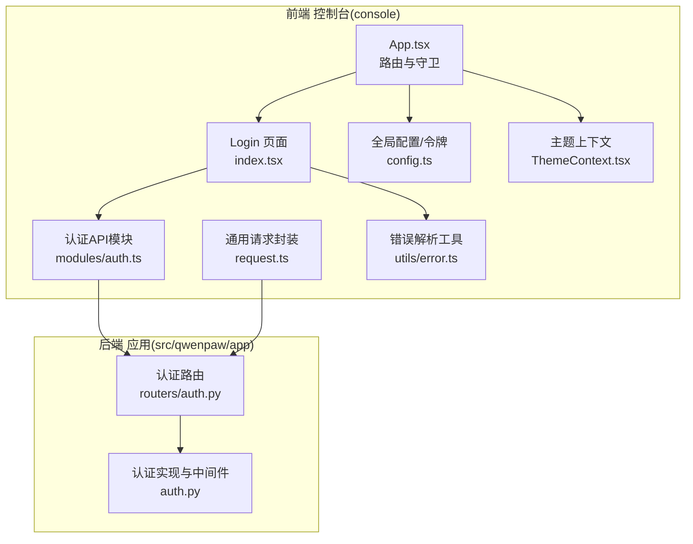
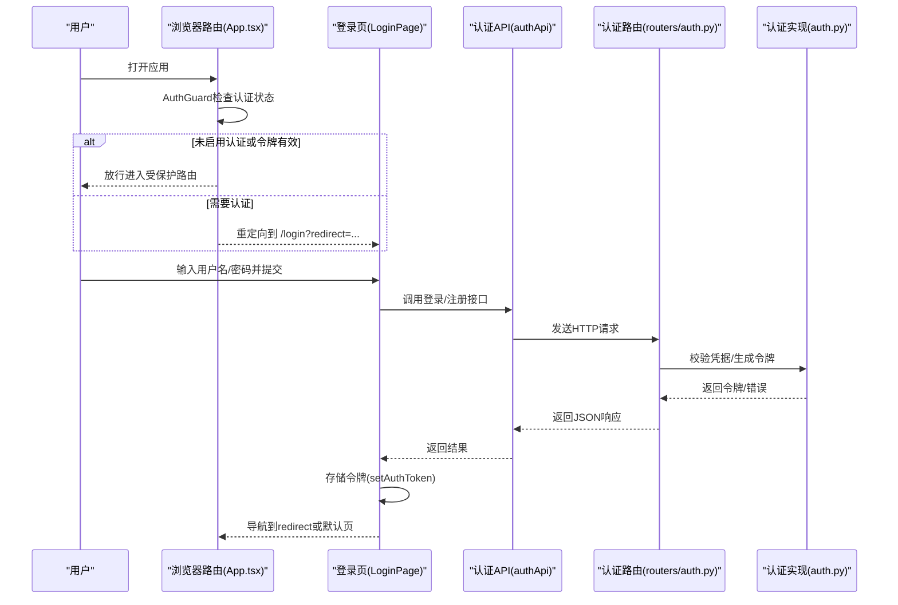
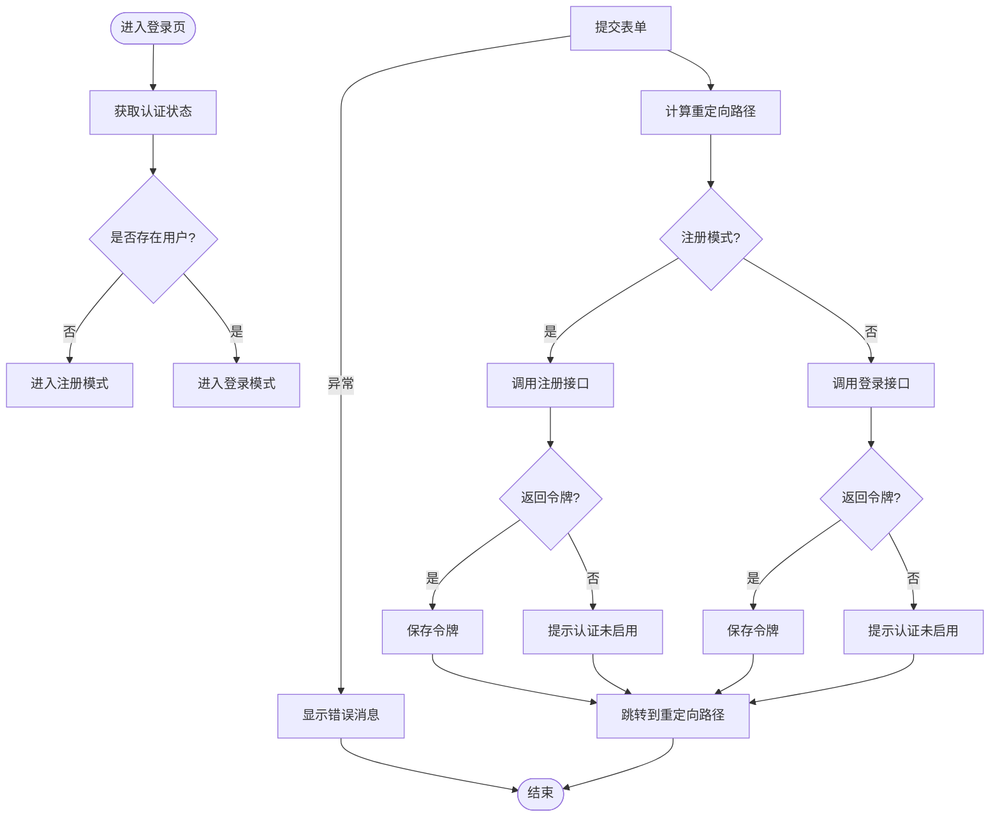
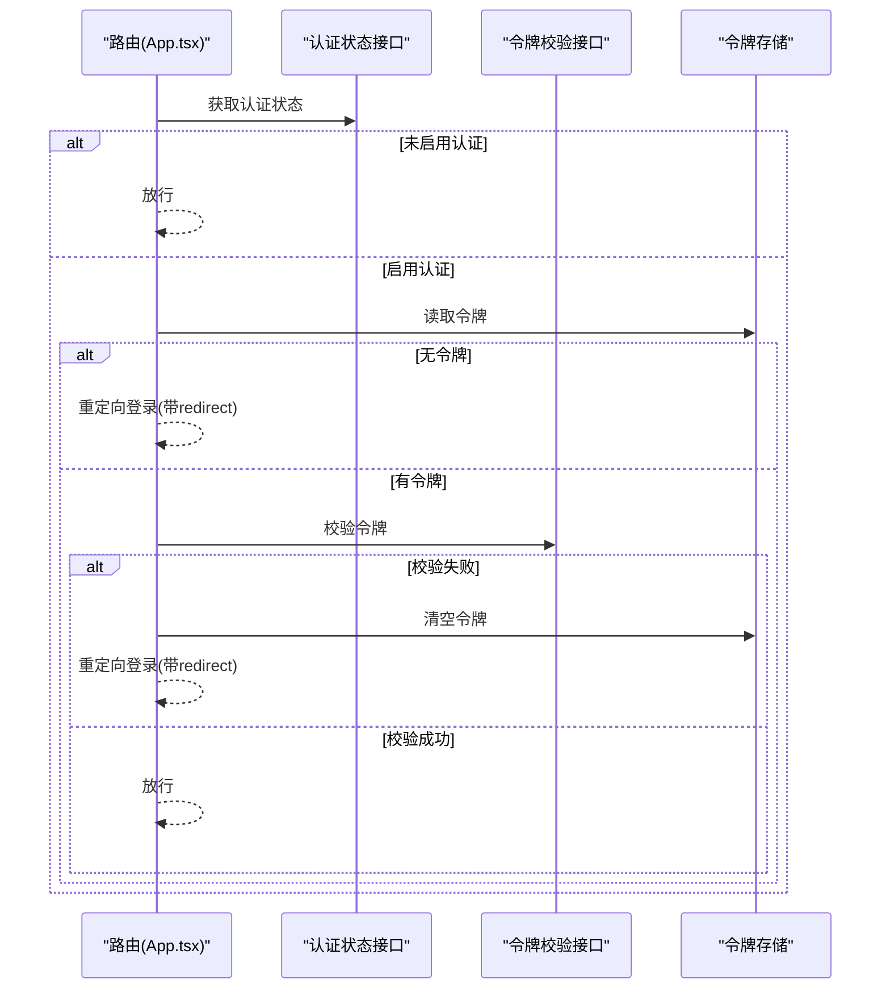
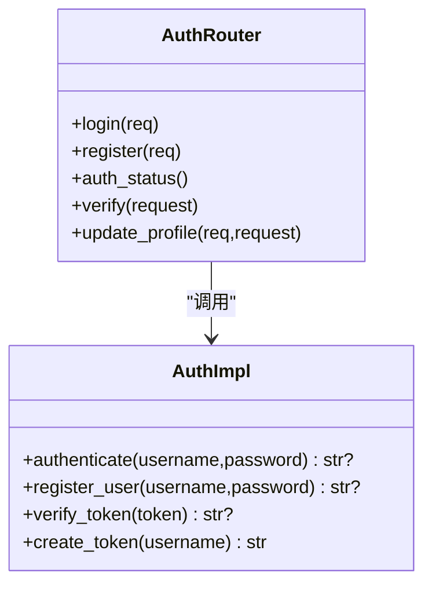
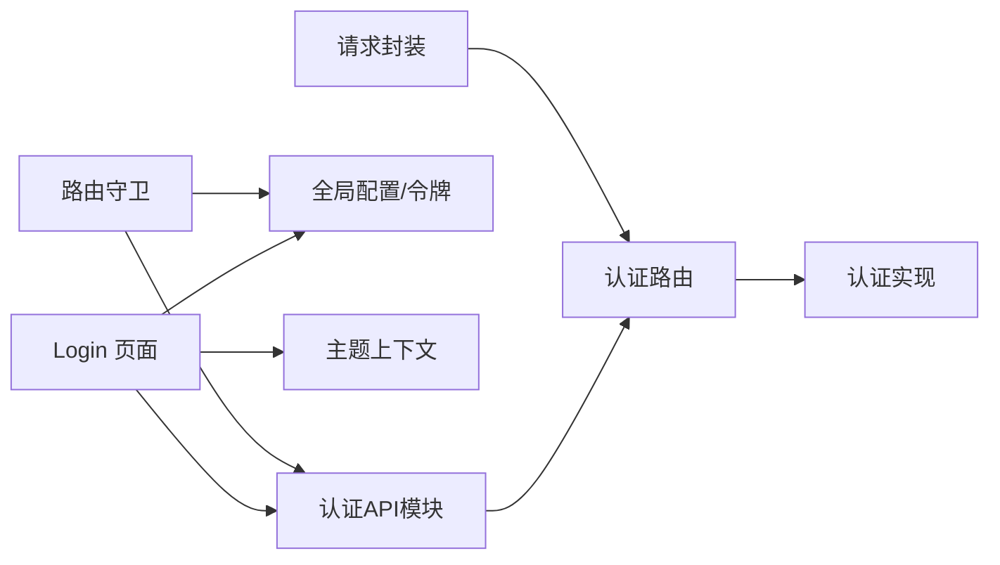

# 认证登录页面

<cite>
**本文引用的文件**
- [console/src/pages/Login/index.tsx](file://console/src/pages/Login/index.tsx)
- [console/src/api/modules/auth.ts](file://console/src/api/modules/auth.ts)
- [console/src/api/config.ts](file://console/src/api/config.ts)
- [console/src/api/request.ts](file://console/src/api/request.ts)
- [console/src/App.tsx](file://console/src/App.tsx)
- [console/src/contexts/ThemeContext.tsx](file://console/src/contexts/ThemeContext.tsx)
- [console/src/utils/error.ts](file://console/src/utils/error.ts)
- [src/qwenpaw/app/routers/auth.py](file://src/qwenpaw/app/routers/auth.py)
- [src/qwenpaw/app/auth.py](file://src/qwenpaw/app/auth.py)
- [console/src/locales/zh.json](file://console/src/locales/zh.json)
- [console/src/locales/en.json](file://console/src/locales/en.json)
</cite>

## 目录
1. [简介](#简介)
2. [项目结构](#项目结构)
3. [核心组件](#核心组件)
4. [架构总览](#架构总览)
5. [详细组件分析](#详细组件分析)
6. [依赖分析](#依赖分析)
7. [性能考虑](#性能考虑)
8. [故障排查指南](#故障排查指南)
9. [结论](#结论)
10. [附录](#附录)

## 简介
本文件面向QwenPaw控制台的认证登录页面，提供从前端到后端的完整技术文档。内容涵盖登录表单设计与验证、认证状态管理、路由守卫与权限校验、错误处理机制、用户体验优化以及安全最佳实践。读者无需深入代码即可理解登录流程，同时也能获得足够的实现细节以支持二次开发与维护。

## 项目结构
登录功能涉及前后端协作：
- 前端控制台(console)负责用户界面、表单验证、认证状态检查、路由守卫与跳转。
- 后端服务(src/qwenpaw/app)负责认证接口、令牌签发与校验、中间件保护等。

图表来源
- [console/src/App.tsx:49-104](file://console/src/App.tsx#L49-L104)
- [console/src/pages/Login/index.tsx:11-178](file://console/src/pages/Login/index.tsx#L11-L178)
- [console/src/api/modules/auth.ts:14-74](file://console/src/api/modules/auth.ts#L14-L74)
- [console/src/api/config.ts:11-42](file://console/src/api/config.ts#L11-L42)
- [console/src/api/request.ts:60-104](file://console/src/api/request.ts#L60-L104)
- [src/qwenpaw/app/routers/auth.py:18-174](file://src/qwenpaw/app/routers/auth.py#L18-L174)
- [src/qwenpaw/app/auth.py:42-200](file://src/qwenpaw/app/auth.py#L42-L200)

章节来源
- [console/src/App.tsx:49-104](file://console/src/App.tsx#L49-L104)
- [console/src/pages/Login/index.tsx:11-178](file://console/src/pages/Login/index.tsx#L11-L178)
- [console/src/api/modules/auth.ts:14-74](file://console/src/api/modules/auth.ts#L14-L74)
- [console/src/api/config.ts:11-42](file://console/src/api/config.ts#L11-L42)
- [console/src/api/request.ts:60-104](file://console/src/api/request.ts#L60-L104)
- [src/qwenpaw/app/routers/auth.py:18-174](file://src/qwenpaw/app/routers/auth.py#L18-L174)
- [src/qwenpaw/app/auth.py:42-200](file://src/qwenpaw/app/auth.py#L42-L200)

## 核心组件
- 登录页面(LoginPage)
  - 负责表单渲染、表单验证、提交处理、跳转逻辑与错误提示。
  - 关键点：根据后端状态决定注册/登录模式；使用国际化文案；基于主题切换视觉样式。
- 认证API(authApi)
  - 提供登录、注册、状态查询、更新资料等方法，统一处理HTTP错误与JSON解析。
- 全局配置与令牌(config.ts)
  - 统一构建API地址、读取/存储令牌、清理令牌。
- 请求封装(request.ts)
  - 统一封装fetch，处理401自动登出、错误消息提取与抛错。
- 路由守卫(AuthGuard)
  - 在进入受保护路由前检查认证状态，必要时重定向至登录页。
- 认证路由与实现(routers/auth.py, auth.py)
  - 提供登录/注册/状态/校验/更新资料接口，实现令牌签发与校验、中间件保护。

章节来源
- [console/src/pages/Login/index.tsx:11-178](file://console/src/pages/Login/index.tsx#L11-L178)
- [console/src/api/modules/auth.ts:14-74](file://console/src/api/modules/auth.ts#L14-L74)
- [console/src/api/config.ts:11-42](file://console/src/api/config.ts#L11-L42)
- [console/src/api/request.ts:60-104](file://console/src/api/request.ts#L60-L104)
- [console/src/App.tsx:49-104](file://console/src/App.tsx#L49-L104)
- [src/qwenpaw/app/routers/auth.py:18-174](file://src/qwenpaw/app/routers/auth.py#L18-L174)
- [src/qwenpaw/app/auth.py:42-200](file://src/qwenpaw/app/auth.py#L42-L200)

## 架构总览
登录流程从用户访问开始，经前端路由守卫与登录页面，调用后端认证接口，完成令牌签发与存储，随后进行页面跳转与后续请求的鉴权。

图表来源
- [console/src/App.tsx:49-104](file://console/src/App.tsx#L49-L104)
- [console/src/pages/Login/index.tsx:37-72](file://console/src/pages/Login/index.tsx#L37-L72)
- [console/src/api/modules/auth.ts:14-74](file://console/src/api/modules/auth.ts#L14-L74)
- [src/qwenpaw/app/routers/auth.py:41-113](file://src/qwenpaw/app/routers/auth.py#L41-L113)
- [src/qwenpaw/app/auth.py:347-440](file://src/qwenpaw/app/auth.py#L347-L440)

## 详细组件分析

### 登录页面(LoginPage)
- 表单设计
  - 用户名与密码输入项，分别绑定必填规则与占位符文案。
  - 支持注册模式与登录模式的动态切换，首用户场景自动进入注册。
- 认证状态管理
  - 首次挂载调用状态接口判断是否启用认证与是否存在用户。
  - 登录/注册成功后，若返回令牌则存入本地存储，并根据redirect参数或默认路径跳转。
- 错误提示
  - 使用应用消息组件展示错误/成功信息；注册失败与登录失败分别提示。
- 视觉与交互
  - 基于主题上下文切换深浅色背景与阴影；按钮加载态；首用户提示文案。

图表来源
- [console/src/pages/Login/index.tsx:21-72](file://console/src/pages/Login/index.tsx#L21-L72)
- [console/src/api/modules/auth.ts:14-74](file://console/src/api/modules/auth.ts#L14-L74)
- [console/src/api/config.ts:32-41](file://console/src/api/config.ts#L32-L41)

章节来源
- [console/src/pages/Login/index.tsx:11-178](file://console/src/pages/Login/index.tsx#L11-L178)
- [console/src/contexts/ThemeContext.tsx:1-105](file://console/src/contexts/ThemeContext.tsx#L1-105)
- [console/src/locales/zh.json:1-200](file://console/src/locales/zh.json#L1-L200)
- [console/src/locales/en.json:1-200](file://console/src/locales/en.json#L1-L200)

### 认证API模块(authApi)
- 接口职责
  - 登录(login)：用户名+密码换取令牌。
  - 注册(register)：首次注册单用户，仅允许一次。
  - 状态查询(getStatus)：判断认证是否启用与是否存在用户。
  - 更新资料(updateProfile)：需要携带当前令牌进行身份校验。
- 错误处理
  - 非2xx响应时解析JSON中的detail作为错误消息，否则抛出通用错误。
- 数据结构
  - 登录响应包含token与username；状态响应包含enabled与has_users。

章节来源
- [console/src/api/modules/auth.ts:14-74](file://console/src/api/modules/auth.ts#L14-L74)

### 全局配置与令牌(config.ts)
- 地址拼接
  - 统一构建带/api前缀的完整URL，支持VITE_API_BASE_URL环境变量。
- 令牌管理
  - 优先从localStorage读取；支持build-time常量回退；提供setAuthToken/clearAuthToken。

章节来源
- [console/src/api/config.ts:11-42](file://console/src/api/config.ts#L11-L42)

### 请求封装(request.ts)
- 统一处理
  - 自动注入认证头；对401响应清除令牌并强制跳转登录；非JSON响应体提取错误信息。
  - 对204/非JSON响应做特殊处理，保证返回类型安全。

章节来源
- [console/src/api/request.ts:60-104](file://console/src/api/request.ts#L60-L104)

### 路由守卫(AuthGuard)
- 逻辑
  - 首次进入时检查认证状态：若未启用认证则放行；若启用且无令牌则重定向登录。
  - 若存在令牌，调用后端校验接口验证有效性，无效则清空令牌并重定向登录。
- 重定向
  - 将当前路径编码为redirect参数传给登录页，登录成功后回到原路径。

图表来源
- [console/src/App.tsx:49-104](file://console/src/App.tsx#L49-L104)
- [console/src/api/config.ts:23-27](file://console/src/api/config.ts#L23-L27)
- [src/qwenpaw/app/routers/auth.py:95-113](file://src/qwenpaw/app/routers/auth.py#L95-L113)

章节来源
- [console/src/App.tsx:49-104](file://console/src/App.tsx#L49-L104)

### 后端认证路由与实现
- 路由
  - POST /auth/login：校验凭据，返回token或未启用时返回空token。
  - POST /auth/register：首次注册单用户，校验环境开关与用户存在性。
  - GET /auth/status：返回认证开关与是否存在用户。
  - GET /auth/verify：校验Bearer令牌有效性。
  - POST /auth/update-profile：更新用户名或密码，需当前令牌。
- 实现
  - 凭据校验：使用盐值SHA-256哈希比对。
  - 令牌签发：HMAC-SHA256签名，含sub/exp/iat，有效期7天。
  - 中间件保护：对/api/*受保护路径进行令牌校验，跳过公共路径与OPTIONS预检。

图表来源
- [src/qwenpaw/app/routers/auth.py:41-174](file://src/qwenpaw/app/routers/auth.py#L41-L174)
- [src/qwenpaw/app/auth.py:88-166](file://src/qwenpaw/app/auth.py#L88-L166)

章节来源
- [src/qwenpaw/app/routers/auth.py:18-174](file://src/qwenpaw/app/routers/auth.py#L18-L174)
- [src/qwenpaw/app/auth.py:88-166](file://src/qwenpaw/app/auth.py#L88-L166)

## 依赖分析
- 前端
  - LoginPage依赖authApi、config.ts、ThemeContext、国际化资源。
  - App.tsx的AuthGuard依赖authApi、config.ts与后端校验接口。
  - request.ts被其他API模块复用，统一处理401与错误消息。
- 后端
  - routers/auth.py依赖auth.py提供的认证与中间件能力。
  - 中间件跳过公共路径与OPTIONS预检，仅保护/api/*。

图表来源
- [console/src/pages/Login/index.tsx:11-178](file://console/src/pages/Login/index.tsx#L11-L178)
- [console/src/App.tsx:49-104](file://console/src/App.tsx#L49-L104)
- [console/src/api/modules/auth.ts:14-74](file://console/src/api/modules/auth.ts#L14-L74)
- [console/src/api/config.ts:11-42](file://console/src/api/config.ts#L11-L42)
- [console/src/api/request.ts:60-104](file://console/src/api/request.ts#L60-L104)
- [src/qwenpaw/app/routers/auth.py:18-174](file://src/qwenpaw/app/routers/auth.py#L18-L174)
- [src/qwenpaw/app/auth.py:42-200](file://src/qwenpaw/app/auth.py#L42-L200)

章节来源
- [console/src/pages/Login/index.tsx:11-178](file://console/src/pages/Login/index.tsx#L11-L178)
- [console/src/App.tsx:49-104](file://console/src/App.tsx#L49-L104)
- [console/src/api/modules/auth.ts:14-74](file://console/src/api/modules/auth.ts#L14-L74)
- [console/src/api/config.ts:11-42](file://console/src/api/config.ts#L11-L42)
- [console/src/api/request.ts:60-104](file://console/src/api/request.ts#L60-L104)
- [src/qwenpaw/app/routers/auth.py:18-174](file://src/qwenpaw/app/routers/auth.py#L18-L174)
- [src/qwenpaw/app/auth.py:42-200](file://src/qwenpaw/app/auth.py#L42-L200)

## 性能考虑
- 登录页渲染
  - 使用局部状态控制加载态与模式切换，避免不必要的重渲染。
- 请求层优化
  - request.ts统一处理401与错误消息，减少重复逻辑。
- 资源加载
  - 图标与静态资源按需加载，主题切换通过CSS类控制，避免频繁样式重排。

## 故障排查指南
- 登录失败
  - 检查后端认证是否启用与是否已有用户；确认用户名/密码正确。
  - 查看前端错误消息与后端HTTP状态码与detail字段。
- 401未认证
  - request.ts会在401时清除令牌并跳转登录；确认令牌是否过期或被篡改。
- 重定向异常
  - 确认redirect参数是否为绝对路径且不包含协议；Login页面对非法路径进行过滤。
- 国际化文案缺失
  - 检查对应语言包中login.*键是否存在；确保useTranslation正确初始化。

章节来源
- [console/src/api/modules/auth.ts:21-26](file://console/src/api/modules/auth.ts#L21-L26)
- [console/src/api/request.ts:74-91](file://console/src/api/request.ts#L74-L91)
- [console/src/pages/Login/index.tsx:40-42](file://console/src/pages/Login/index.tsx#L40-L42)
- [console/src/locales/zh.json:1-200](file://console/src/locales/zh.json#L1-L200)
- [console/src/locales/en.json:1-200](file://console/src/locales/en.json#L1-L200)

## 结论
QwenPaw登录页面采用前后端分离的认证方案：前端负责表单与交互、路由守卫与令牌存储，后端负责凭据校验、令牌签发与中间件保护。整体流程清晰、错误处理统一、安全性通过哈希存储与HMAC令牌得到保障。建议在生产环境中结合HTTPS、CORS策略与速率限制进一步加固。

## 附录
- 安全最佳实践
  - 密码存储：使用盐值SHA-256哈希，文件权限严格限制。
  - 令牌格式：HMAC-SHA256签名，7天有效期，浏览器localStorage存储。
  - 会话安全：仅/api/*受保护，跳过公共路径与OPTIONS预检；本地回环请求可绕过认证。
  - 防暴力破解：建议在网关或反向代理层增加IP限速与验证码策略（当前仓库未实现）。
- 用户体验优化
  - 加载状态：登录按钮loading态；首用户提示文案。
  - 动画与响应式：基于主题切换背景与阴影；表单尺寸与间距适配移动端。
  - 国际化：多语言文案覆盖登录标题、占位符与错误提示。

章节来源
- [src/qwenpaw/app/auth.py:88-166](file://src/qwenpaw/app/auth.py#L88-L166)
- [src/qwenpaw/app/routers/auth.py:41-113](file://src/qwenpaw/app/routers/auth.py#L41-L113)
- [console/src/pages/Login/index.tsx:16-178](file://console/src/pages/Login/index.tsx#L16-L178)
- [console/src/contexts/ThemeContext.tsx:57-77](file://console/src/contexts/ThemeContext.tsx#L57-L77)