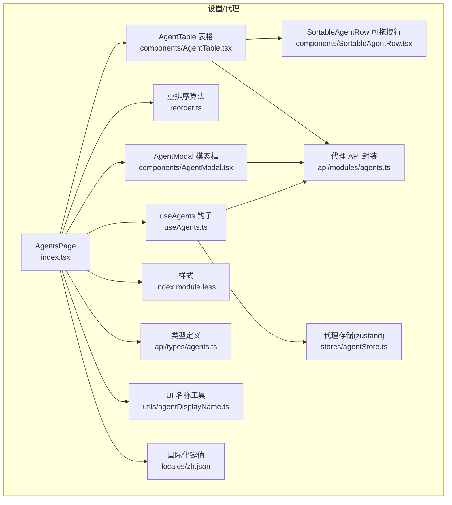
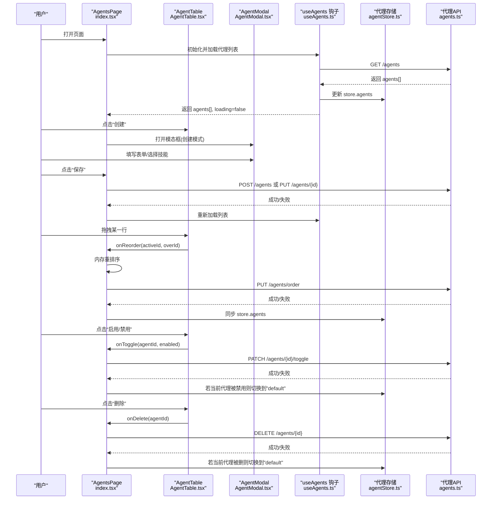
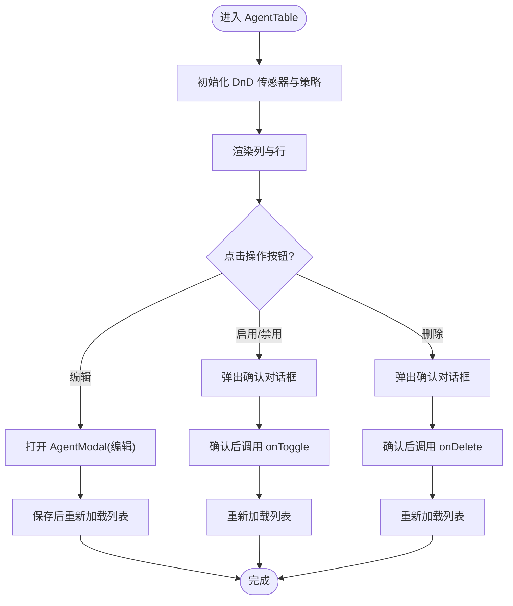
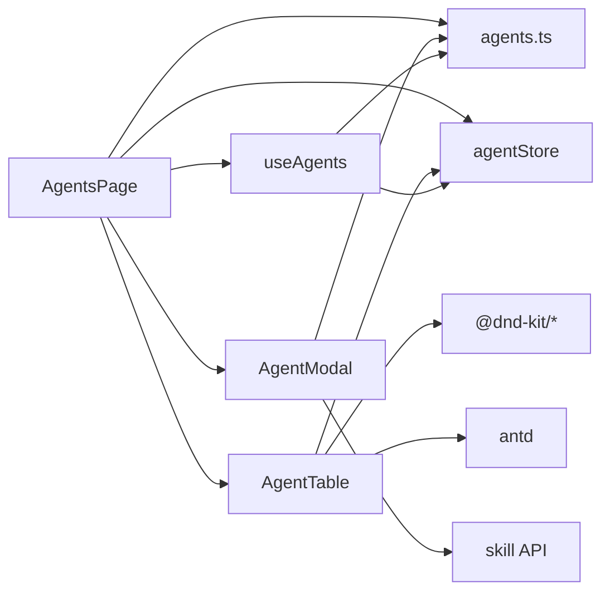

# 代理设置

<cite>
**本文引用的文件**
- [console/src/pages/Settings/Agents/index.tsx](file://console/src/pages/Settings/Agents/index.tsx)
- [console/src/pages/Settings/Agents/useAgents.ts](file://console/src/pages/Settings/Agents/useAgents.ts)
- [console/src/pages/Settings/Agents/reorder.ts](file://console/src/pages/Settings/Agents/reorder.ts)
- [console/src/pages/Settings/Agents/components/AgentTable.tsx](file://console/src/pages/Settings/Agents/components/AgentTable.tsx)
- [console/src/pages/Settings/Agents/components/AgentModal.tsx](file://console/src/pages/Settings/Agents/components/AgentModal.tsx)
- [console/src/pages/Settings/Agents/components/SortableAgentRow.tsx](file://console/src/pages/Settings/Agents/components/SortableAgentRow.tsx)
- [console/src/pages/Settings/Agents/index.module.less](file://console/src/pages/Settings/Agents/index.module.less)
- [console/src/api/modules/agents.ts](file://console/src/api/modules/agents.ts)
- [console/src/api/types/agents.ts](file://console/src/api/types/agents.ts)
- [console/src/stores/agentStore.ts](file://console/src/stores/agentStore.ts)
- [console/src/utils/agentDisplayName.ts](file://console/src/utils/agentDisplayName.ts)
- [console/src/locales/zh.json](file://console/src/locales/zh.json)
</cite>

## 目录
1. [简介](#简介)
2. [项目结构](#项目结构)
3. [核心组件](#核心组件)
4. [架构总览](#架构总览)
5. [详细组件分析](#详细组件分析)
6. [依赖关系分析](#依赖关系分析)
7. [性能考量](#性能考量)
8. [故障排查指南](#故障排查指南)
9. [结论](#结论)
10. [附录](#附录)

## 简介
本文件面向 QwenPaw 控制台“代理设置”页面，系统性梳理代理列表管理与交互流程，覆盖代理表格组件、状态显示与操作按钮设计；代理创建与编辑的表单校验、技能选择器、工作空间配置与配置持久化；启用/禁用切换机制（含状态更新、默认代理切换逻辑与用户反馈）；代理拖拽重排序（事件处理、算法与 API 调用）；以及删除功能的安全性（确认对话框、依赖检查与错误处理）。同时给出国际化支持、样式设计与响应式布局的实现要点与参考路径。

## 项目结构
代理设置页面位于控制台前端工程的设置模块下，采用“页面 + 组件 + 样式 + 类型 + 存储 + API”的分层组织方式，便于职责分离与复用。

图示来源
- [console/src/pages/Settings/Agents/index.tsx:1-186](file://console/src/pages/Settings/Agents/index.tsx#L1-L186)
- [console/src/pages/Settings/Agents/useAgents.ts:1-87](file://console/src/pages/Settings/Agents/useAgents.ts#L1-L87)
- [console/src/pages/Settings/Agents/reorder.ts:1-24](file://console/src/pages/Settings/Agents/reorder.ts#L1-L24)
- [console/src/pages/Settings/Agents/components/AgentTable.tsx:1-223](file://console/src/pages/Settings/Agents/components/AgentTable.tsx#L1-L223)
- [console/src/pages/Settings/Agents/components/AgentModal.tsx:1-216](file://console/src/pages/Settings/Agents/components/AgentModal.tsx#L1-L216)
- [console/src/pages/Settings/Agents/components/SortableAgentRow.tsx:1-95](file://console/src/pages/Settings/Agents/components/SortableAgentRow.tsx#L1-L95)
- [console/src/pages/Settings/Agents/index.module.less:1-313](file://console/src/pages/Settings/Agents/index.module.less#L1-L313)
- [console/src/api/modules/agents.ts:1-79](file://console/src/api/modules/agents.ts#L1-L79)
- [console/src/api/types/agents.ts:1-47](file://console/src/api/types/agents.ts#L1-L47)
- [console/src/stores/agentStore.ts:1-89](file://console/src/stores/agentStore.ts#L1-L89)
- [console/src/utils/agentDisplayName.ts:1-16](file://console/src/utils/agentDisplayName.ts#L1-L16)
- [console/src/locales/zh.json:81-145](file://console/src/locales/zh.json#L81-L145)

章节来源
- [console/src/pages/Settings/Agents/index.tsx:1-186](file://console/src/pages/Settings/Agents/index.tsx#L1-L186)
- [console/src/pages/Settings/Agents/components/AgentTable.tsx:1-223](file://console/src/pages/Settings/Agents/components/AgentTable.tsx#L1-L223)
- [console/src/pages/Settings/Agents/components/AgentModal.tsx:1-216](file://console/src/pages/Settings/Agents/components/AgentModal.tsx#L1-L216)
- [console/src/pages/Settings/Agents/components/SortableAgentRow.tsx:1-95](file://console/src/pages/Settings/Agents/components/SortableAgentRow.tsx#L1-L95)
- [console/src/pages/Settings/Agents/index.module.less:1-313](file://console/src/pages/Settings/Agents/index.module.less#L1-L313)
- [console/src/api/modules/agents.ts:1-79](file://console/src/api/modules/agents.ts#L1-L79)
- [console/src/api/types/agents.ts:1-47](file://console/src/api/types/agents.ts#L1-L47)
- [console/src/stores/agentStore.ts:1-89](file://console/src/stores/agentStore.ts#L1-L89)
- [console/src/utils/agentDisplayName.ts:1-16](file://console/src/utils/agentDisplayName.ts#L1-L16)
- [console/src/locales/zh.json:81-145](file://console/src/locales/zh.json#L81-L145)

## 核心组件
- 页面容器与编排：负责加载代理列表、处理创建/编辑/删除/启用/禁用/重排序等动作，并与全局消息提示与国际化集成。
- 列表表格：展示代理基本信息、状态与操作列，集成拖拽排序与交互反馈。
- 模态框：封装代理创建/编辑表单、技能选择器与工作空间配置。
- 重排序算法：在内存中对代理数组进行交换，随后通过 API 持久化顺序。
- 存储与 API：统一管理代理状态、持久化与后端接口调用。

章节来源
- [console/src/pages/Settings/Agents/index.tsx:16-186](file://console/src/pages/Settings/Agents/index.tsx#L16-L186)
- [console/src/pages/Settings/Agents/useAgents.ts:18-87](file://console/src/pages/Settings/Agents/useAgents.ts#L18-L87)
- [console/src/pages/Settings/Agents/reorder.ts:3-24](file://console/src/pages/Settings/Agents/reorder.ts#L3-L24)
- [console/src/pages/Settings/Agents/components/AgentTable.tsx:34-223](file://console/src/pages/Settings/Agents/components/AgentTable.tsx#L34-L223)
- [console/src/pages/Settings/Agents/components/AgentModal.tsx:33-216](file://console/src/pages/Settings/Agents/components/AgentModal.tsx#L33-L216)
- [console/src/stores/agentStore.ts:19-89](file://console/src/stores/agentStore.ts#L19-L89)
- [console/src/api/modules/agents.ts:12-79](file://console/src/api/modules/agents.ts#L12-L79)

## 架构总览
下图展示“代理设置”页面从用户交互到后端 API 的整体调用链路与状态流转。

图示来源
- [console/src/pages/Settings/Agents/index.tsx:16-186](file://console/src/pages/Settings/Agents/index.tsx#L16-L186)
- [console/src/pages/Settings/Agents/components/AgentTable.tsx:34-223](file://console/src/pages/Settings/Agents/components/AgentTable.tsx#L34-L223)
- [console/src/pages/Settings/Agents/components/AgentModal.tsx:33-216](file://console/src/pages/Settings/Agents/components/AgentModal.tsx#L33-L216)
- [console/src/pages/Settings/Agents/useAgents.ts:18-87](file://console/src/pages/Settings/Agents/useAgents.ts#L18-L87)
- [console/src/stores/agentStore.ts:19-89](file://console/src/stores/agentStore.ts#L19-L89)
- [console/src/api/modules/agents.ts:12-79](file://console/src/api/modules/agents.ts#L12-L79)

## 详细组件分析

### 代理表格组件（AgentTable）
- 数据与交互
  - 接收 agents、loading、reordering 状态与回调函数（编辑、删除、启用/禁用、重排序）。
  - 使用 DnD Kit 实现拖拽排序，列头包含拖拽手柄，行内渲染启用状态与禁用标签。
- 状态显示
  - 名称列根据 enabled 显示不同透明度与“已禁用”标签。
  - 操作列包含编辑、启用/禁用、删除三个按钮，其中默认代理禁用编辑、禁用与删除。
- 国际化与可访问性
  - 所有文案来自 i18n 键值，按钮带 title 提示。
- 样式与主题
  - 暗色主题下的颜色与 hover 效果在样式文件中集中定义。

章节来源
- [console/src/pages/Settings/Agents/components/AgentTable.tsx:34-223](file://console/src/pages/Settings/Agents/components/AgentTable.tsx#L34-L223)
- [console/src/pages/Settings/Agents/index.module.less:111-141](file://console/src/pages/Settings/Agents/index.module.less#L111-L141)
- [console/src/locales/zh.json:81-145](file://console/src/locales/zh.json#L81-L145)

#### 表格列与操作流程图

图示来源
- [console/src/pages/Settings/Agents/components/AgentTable.tsx:138-191](file://console/src/pages/Settings/Agents/components/AgentTable.tsx#L138-L191)
- [console/src/pages/Settings/Agents/index.tsx:40-77](file://console/src/pages/Settings/Agents/index.tsx#L40-L77)

### 可拖拽行与拖拽手柄（SortableAgentRow）
- 行级拖拽
  - 使用 useSortable 提供的属性与监听器绑定到表格行，支持拖拽变换与拖拽样式类。
- 拖拽手柄
  - 拖拽手柄按钮通过上下文注入 DnD 绑定，禁用状态下禁用交互。
- 样式
  - 拖拽时应用高亮背景类，提升视觉反馈。

章节来源
- [console/src/pages/Settings/Agents/components/SortableAgentRow.tsx:22-95](file://console/src/pages/Settings/Agents/components/SortableAgentRow.tsx#L22-L95)
- [console/src/pages/Settings/Agents/index.module.less:138-141](file://console/src/pages/Settings/Agents/index.module.less#L138-L141)

### 代理模态框（AgentModal）
- 表单与校验
  - 基于 Ant Design Form，包含名称必填校验、描述多行文本、工作区路径输入。
  - 编辑模式下 ID 字段禁用。
- 技能选择器
  - 异步加载技能池与已安装技能，支持全选、内置、清空三种批量操作。
  - 已安装技能不可再次选择，避免重复添加。
- 工作空间配置
  - 创建模式允许填写工作区路径；编辑模式禁用输入。
- 保存流程
  - 校验通过后，若为编辑：对新增技能执行“下载到目标工作区”，再更新代理配置；若为新建：创建代理并返回 ID。

章节来源
- [console/src/pages/Settings/Agents/components/AgentModal.tsx:33-216](file://console/src/pages/Settings/Agents/components/AgentModal.tsx#L33-L216)
- [console/src/api/modules/agents.ts:20-32](file://console/src/api/modules/agents.ts#L20-L32)
- [console/src/locales/zh.json:138-144](file://console/src/locales/zh.json#L138-L144)

### 代理列表页（AgentsPage）
- 加载与刷新
  - 初始化时加载代理列表；每次保存/删除/启用/禁用/重排序后重新拉取最新数据。
- 创建与编辑
  - 打开模态框，重置表单，设置默认工作区路径；编辑时加载代理完整配置。
- 删除与切换
  - 删除后若当前代理被删，自动切换到默认代理并提示。
- 启用/禁用
  - 切换状态后若当前代理被禁用，自动切换到默认代理并提示。
- 重排序
  - 先在内存中交换顺序，再调用 API 持久化；失败时回滚并提示。

章节来源
- [console/src/pages/Settings/Agents/index.tsx:16-186](file://console/src/pages/Settings/Agents/index.tsx#L16-L186)
- [console/src/pages/Settings/Agents/useAgents.ts:18-87](file://console/src/pages/Settings/Agents/useAgents.ts#L18-L87)

### 重排序算法（reorder.ts）
- 输入：当前 agents 数组、被拖拽项 id 与悬停项 id。
- 输出：新的 agents 数组（交换位置）。
- 边界：相同 id 或索引不存在时返回原数组。

章节来源
- [console/src/pages/Settings/Agents/reorder.ts:3-24](file://console/src/pages/Settings/Agents/reorder.ts#L3-L24)

### API 与类型定义
- API 方法
  - 列表、详情、创建、更新、删除、重排序、启用/禁用、工作区文件读写等。
- 类型
  - AgentSummary、AgentProfileConfig、CreateAgentRequest、ReorderAgentsResponse 等。

章节来源
- [console/src/api/modules/agents.ts:12-79](file://console/src/api/modules/agents.ts#L12-L79)
- [console/src/api/types/agents.ts:3-47](file://console/src/api/types/agents.ts#L3-L47)

### 存储与状态同步（agentStore）
- 状态
  - selectedAgent、agents、按代理记录的最后会话 ID 映射。
- 行为
  - 添加/删除/更新代理；删除代理时若当前即为该代理则自动切换到默认代理；持久化到 sessionStorage。
- 与 useAgents 的联动
  - useAgents 在加载/更新后同步写入 store，保证 UI 与缓存一致。

章节来源
- [console/src/stores/agentStore.ts:19-89](file://console/src/stores/agentStore.ts#L19-L89)
- [console/src/pages/Settings/Agents/useAgents.ts:26-29](file://console/src/pages/Settings/Agents/useAgents.ts#L26-L29)

### 国际化与 UI 名称
- 国际化键值
  - 代理相关文案集中在 locales/zh.json 的 agent 节点，涵盖标题、提示、确认对话框文案等。
- UI 名称
  - 默认代理使用 i18n 文案，其他代理优先使用 name，否则回退到 id。

章节来源
- [console/src/locales/zh.json:81-145](file://console/src/locales/zh.json#L81-L145)
- [console/src/utils/agentDisplayName.ts:7-15](file://console/src/utils/agentDisplayName.ts#L7-L15)

## 依赖关系分析
- 组件耦合
  - AgentsPage 是主控制器，依赖 useAgents、agentStore、agents API、国际化与样式。
  - AgentTable 依赖 DnD Kit、Ant Design 组件、主题上下文与 UI 名称工具。
  - AgentModal 依赖技能池 API、表单与国际化。
- 外部依赖
  - dnd-kit：拖拽排序。
  - antd：表格、按钮、模态框、标签、气泡确认等。
  - zustand/persist：本地状态持久化。
- 循环依赖
  - 未见直接循环依赖；页面通过钩子与存储间接协作。

图示来源
- [console/src/pages/Settings/Agents/index.tsx:1-186](file://console/src/pages/Settings/Agents/index.tsx#L1-L186)
- [console/src/pages/Settings/Agents/components/AgentTable.tsx:1-223](file://console/src/pages/Settings/Agents/components/AgentTable.tsx#L1-L223)
- [console/src/pages/Settings/Agents/components/AgentModal.tsx:1-216](file://console/src/pages/Settings/Agents/components/AgentModal.tsx#L1-L216)
- [console/src/pages/Settings/Agents/useAgents.ts:1-87](file://console/src/pages/Settings/Agents/useAgents.ts#L1-L87)
- [console/src/stores/agentStore.ts:1-89](file://console/src/stores/agentStore.ts#L1-L89)
- [console/src/api/modules/agents.ts:1-79](file://console/src/api/modules/agents.ts#L1-L79)

## 性能考量
- 渲染优化
  - 表格禁用分页，按需加载；拖拽过程中仅更新内存数组，减少不必要的重渲染。
- 请求合并
  - 技能池与已安装技能通过 Promise.all 并发加载，缩短首屏等待时间。
- 状态同步
  - useAgents 与 agentStore 双向同步，避免 UI 与本地状态不一致导致的二次请求。
- 样式隔离
  - 使用 CSS Modules 与主题变量，避免全局样式污染与重绘。

## 故障排查指南
- 加载失败
  - 现象：列表加载报错或空白。
  - 排查：检查 agents API 是否可达；查看 useAgents 的错误处理与消息提示。
- 保存失败
  - 现象：创建/编辑失败，弹出错误消息。
  - 排查：核对表单校验规则；确认技能选择是否正确；查看后端返回的错误信息。
- 删除失败
  - 现象：删除后仍可见或提示失败。
  - 排查：确认删除 API 返回；检查当前代理是否为默认代理（默认代理不可删除）；查看消息提示。
- 启用/禁用失败
  - 现象：切换状态无效。
  - 排查：确认 PATCH /agents/{id}/toggle 是否成功；检查当前代理是否为默认代理（默认代理不可禁用）。
- 重排序失败
  - 现象：拖拽后顺序未保存。
  - 排查：确认 PUT /agents/order 是否成功；若失败，页面会回滚到旧顺序并提示错误。
- 默认代理切换
  - 现象：删除或禁用当前代理后未切换。
  - 排查：确认 agentStore 的 removeAgent/updateAgent 逻辑是否触发；确认 UI 是否收到最新 agents。

章节来源
- [console/src/pages/Settings/Agents/useAgents.ts:31-71](file://console/src/pages/Settings/Agents/useAgents.ts#L31-L71)
- [console/src/pages/Settings/Agents/index.tsx:52-77](file://console/src/pages/Settings/Agents/index.tsx#L52-L77)
- [console/src/stores/agentStore.ts:35-52](file://console/src/stores/agentStore.ts#L35-L52)

## 结论
“代理设置”页面通过清晰的分层设计与完善的交互流程，实现了代理的全生命周期管理。表格组件提供直观的状态与操作入口，模态框承载复杂的创建/编辑体验，拖拽重排序与启用/禁用切换满足日常运维需求。配合国际化、主题适配与本地存储，为用户提供稳定、一致且可扩展的管理界面。

## 附录
- 国际化键值参考
  - 代理相关键值集中在 locales/zh.json 的 agent 节点，如创建/编辑/删除/启用/禁用/重排序等文案。
- 样式与主题
  - 暗色主题下的颜色与 hover 效果在 index.module.less 中集中定义；表格与拖拽行的高亮样式也在此文件中维护。
- 响应式布局
  - 表格列宽固定与省略策略结合 ellipsis 属性，确保在窄屏下具备可读性；技能选择网格使用 CSS Grid 自适应列数。

章节来源
- [console/src/locales/zh.json:81-145](file://console/src/locales/zh.json#L81-L145)
- [console/src/pages/Settings/Agents/index.module.less:1-313](file://console/src/pages/Settings/Agents/index.module.less#L1-L313)
- [console/src/pages/Settings/Agents/components/AgentTable.tsx:113-120](file://console/src/pages/Settings/Agents/components/AgentTable.tsx#L113-L120)
- [console/src/pages/Settings/Agents/components/AgentModal.tsx:188-211](file://console/src/pages/Settings/Agents/components/AgentModal.tsx#L188-L211)