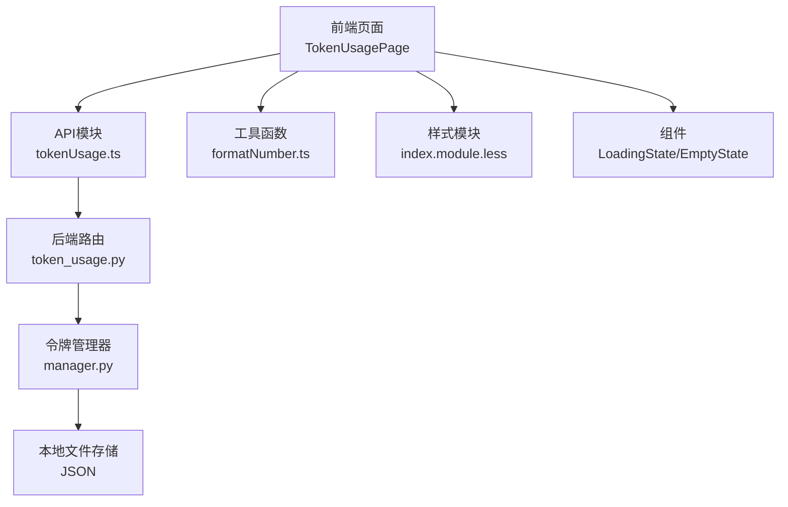
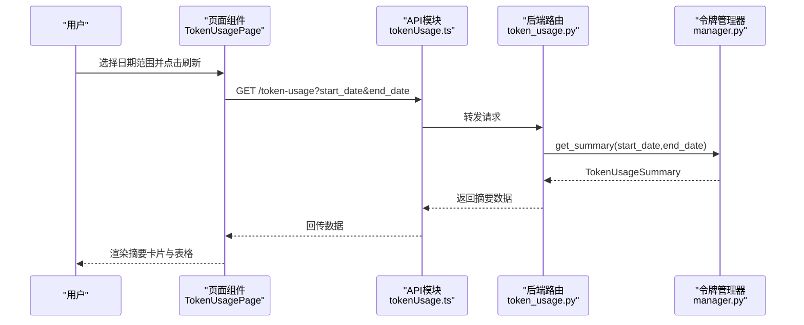
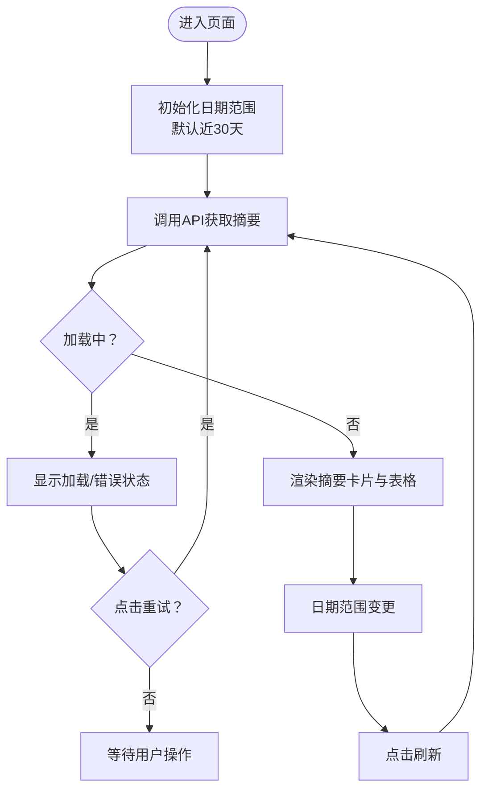
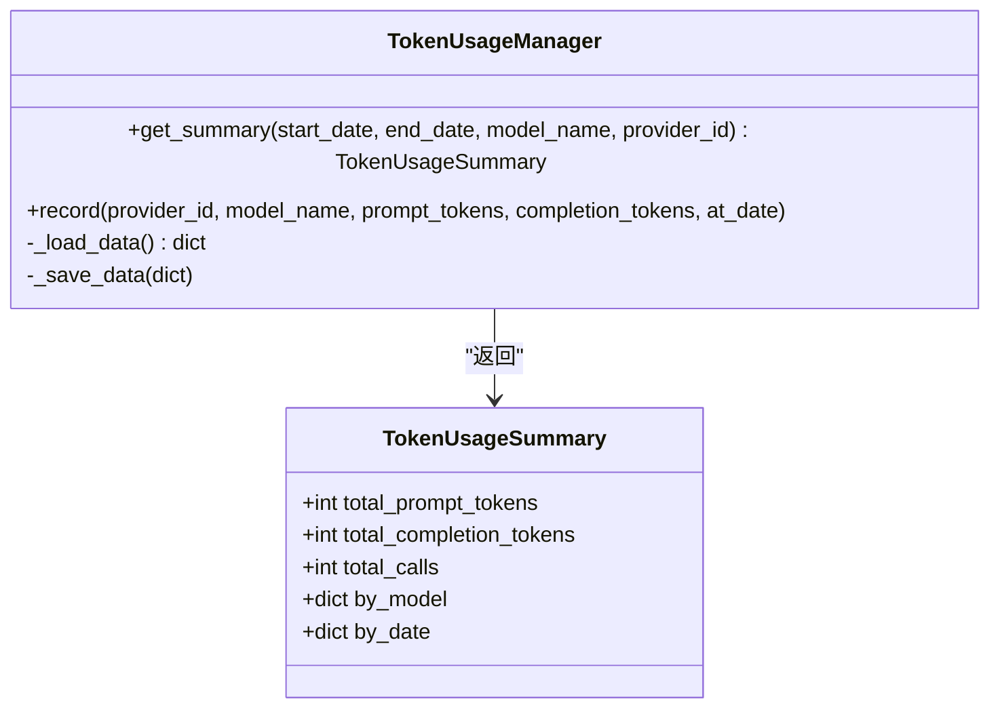
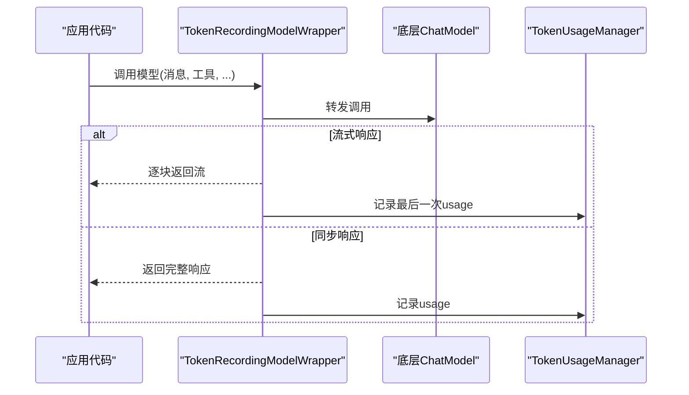
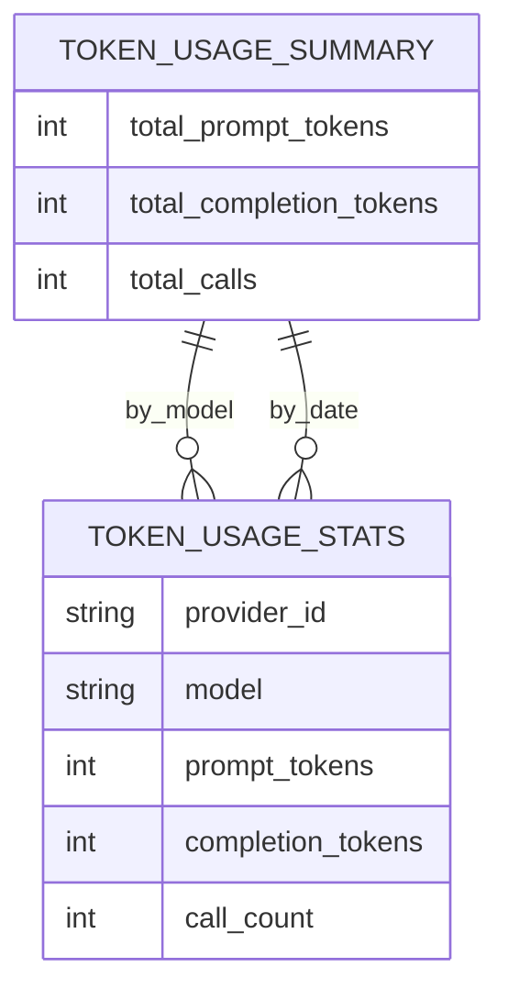
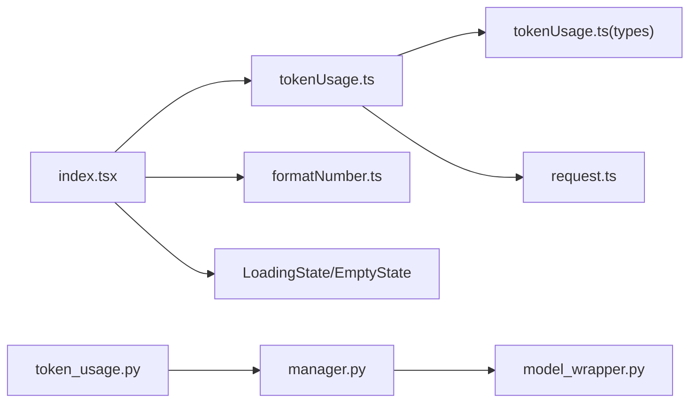

# 令牌使用设置

<cite>
**本文引用的文件**
- [console/src/pages/Settings/TokenUsage/index.tsx](file://console/src/pages/Settings/TokenUsage/index.tsx)
- [console/src/pages/Settings/TokenUsage/components/LoadingState.tsx](file://console/src/pages/Settings/TokenUsage/components/LoadingState.tsx)
- [console/src/pages/Settings/TokenUsage/components/EmptyState.tsx](file://console/src/pages/Settings/TokenUsage/components/EmptyState.tsx)
- [console/src/pages/Settings/TokenUsage/index.module.less](file://console/src/pages/Settings/TokenUsage/index.module.less)
- [console/src/api/modules/tokenUsage.ts](file://console/src/api/modules/tokenUsage.ts)
- [console/src/api/types/tokenUsage.ts](file://console/src/api/types/tokenUsage.ts)
- [console/src/api/index.ts](file://console/src/api/index.ts)
- [console/src/utils/formatNumber.ts](file://console/src/utils/formatNumber.ts)
- [src/qwenpaw/token_usage/manager.py](file://src/qwenpaw/token_usage/manager.py)
- [src/qwenpaw/token_usage/model_wrapper.py](file://src/qwenpaw/token_usage/model_wrapper.py)
- [src/qwenpaw/app/routers/token_usage.py](file://src/qwenpaw/app/routers/token_usage.py)
</cite>

## 目录
1. [简介](#简介)
2. [项目结构](#项目结构)
3. [核心组件](#核心组件)
4. [架构总览](#架构总览)
5. [详细组件分析](#详细组件分析)
6. [依赖分析](#依赖分析)
7. [性能考虑](#性能考虑)
8. [故障排查指南](#故障排查指南)
9. [结论](#结论)
10. [附录](#附录)

## 简介
本文件面向“令牌使用设置”页面的技术文档，系统性阐述以下能力与实现细节：
- 令牌使用统计：按模型、日期维度的汇总与展示，包含提示词与补全令牌总量、调用次数等指标卡片。
- 趋势分析与报表：通过日期范围筛选与表格分组，支持按模型与按日期的趋势查看。
- 限额设置与告警：当前实现聚焦统计与查询，限额与自动限制策略需在后续扩展中补充。
- 费用控制：当前未内置计费与预算管理逻辑，建议在后端聚合时引入单价配置，并在前端进行预算/超支提示。
- 历史记录与审计：以本地文件持久化存储令牌使用明细，具备可审计基础；建议增加操作审计日志与导出能力。
- 数据可视化与性能优化：页面采用轻量组件与紧凑数字格式化，结合懒加载与错误重试提升体验。

## 项目结构
“令牌使用设置”页面位于控制台前端，后端提供REST接口，数据由Python侧的令牌使用管理器聚合并持久化。

**图示来源**
- [console/src/pages/Settings/TokenUsage/index.tsx:1-224](file://console/src/pages/Settings/TokenUsage/index.tsx#L1-L224)
- [console/src/api/modules/tokenUsage.ts:1-21](file://console/src/api/modules/tokenUsage.ts#L1-L21)
- [src/qwenpaw/app/routers/token_usage.py:1-62](file://src/qwenpaw/app/routers/token_usage.py#L1-L62)
- [src/qwenpaw/token_usage/manager.py:1-309](file://src/qwenpaw/token_usage/manager.py#L1-L309)
- [console/src/utils/formatNumber.ts:1-27](file://console/src/utils/formatNumber.ts#L1-L27)
- [console/src/pages/Settings/TokenUsage/index.module.less:1-300](file://console/src/pages/Settings/TokenUsage/index.module.less#L1-L300)
- [console/src/pages/Settings/TokenUsage/components/LoadingState.tsx:1-36](file://console/src/pages/Settings/TokenUsage/components/LoadingState.tsx#L1-L36)
- [console/src/pages/Settings/TokenUsage/components/EmptyState.tsx:1-16](file://console/src/pages/Settings/TokenUsage/components/EmptyState.tsx#L1-L16)

**章节来源**
- [console/src/pages/Settings/TokenUsage/index.tsx:1-224](file://console/src/pages/Settings/TokenUsage/index.tsx#L1-L224)
- [console/src/api/modules/tokenUsage.ts:1-21](file://console/src/api/modules/tokenUsage.ts#L1-L21)
- [src/qwenpaw/app/routers/token_usage.py:1-62](file://src/qwenpaw/app/routers/token_usage.py#L1-L62)
- [src/qwenpaw/token_usage/manager.py:1-309](file://src/qwenpaw/token_usage/manager.py#L1-L309)
- [console/src/utils/formatNumber.ts:1-27](file://console/src/utils/formatNumber.ts#L1-L27)
- [console/src/pages/Settings/TokenUsage/index.module.less:1-300](file://console/src/pages/Settings/TokenUsage/index.module.less#L1-L300)
- [console/src/pages/Settings/TokenUsage/components/LoadingState.tsx:1-36](file://console/src/pages/Settings/TokenUsage/components/LoadingState.tsx#L1-L36)
- [console/src/pages/Settings/TokenUsage/components/EmptyState.tsx:1-16](file://console/src/pages/Settings/TokenUsage/components/EmptyState.tsx#L1-L16)

## 核心组件
- 页面容器与交互
  - 日期范围选择器：默认近30天，支持刷新按钮触发重新拉取。
  - 摘要卡片：展示提示词令牌、补全令牌与总调用次数的紧凑格式化数值。
  - 分类表格：按模型与按日期两套表格，列包含提供商、模型、提示词令牌、补全令牌、调用次数。
- 组件与样式
  - 加载与空状态组件：统一错误提示与重试入口。
  - 样式模块：适配暗色模式、卡片与表格主题。
- 工具函数
  - 数字格式化：千/百万/十亿级缩写，提升可读性。
- API与类型
  - 请求封装：GET /token-usage，携带起止日期参数。
  - 类型定义：摘要与按模型/日期统计字段。

**章节来源**
- [console/src/pages/Settings/TokenUsage/index.tsx:18-224](file://console/src/pages/Settings/TokenUsage/index.tsx#L18-L224)
- [console/src/pages/Settings/TokenUsage/components/LoadingState.tsx:1-36](file://console/src/pages/Settings/TokenUsage/components/LoadingState.tsx#L1-L36)
- [console/src/pages/Settings/TokenUsage/components/EmptyState.tsx:1-16](file://console/src/pages/Settings/TokenUsage/components/EmptyState.tsx#L1-L16)
- [console/src/pages/Settings/TokenUsage/index.module.less:125-221](file://console/src/pages/Settings/TokenUsage/index.module.less#L125-L221)
- [console/src/utils/formatNumber.ts:1-27](file://console/src/utils/formatNumber.ts#L1-L27)
- [console/src/api/modules/tokenUsage.ts:1-21](file://console/src/api/modules/tokenUsage.ts#L1-L21)
- [console/src/api/types/tokenUsage.ts:1-17](file://console/src/api/types/tokenUsage.ts#L1-L17)

## 架构总览
从前端到后端的数据流如下：

**图示来源**
- [console/src/pages/Settings/TokenUsage/index.tsx:32-54](file://console/src/pages/Settings/TokenUsage/index.tsx#L32-L54)
- [console/src/api/modules/tokenUsage.ts:17-20](file://console/src/api/modules/tokenUsage.ts#L17-L20)
- [src/qwenpaw/app/routers/token_usage.py:28-61](file://src/qwenpaw/app/routers/token_usage.py#L28-L61)
- [src/qwenpaw/token_usage/manager.py:198-294](file://src/qwenpaw/token_usage/manager.py#L198-L294)

## 详细组件分析

### 前端页面与交互流程
- 初始化与数据拉取
  - 首次挂载即触发拉取，默认时间窗口为近30天。
  - 错误处理：捕获异常、国际化提示、显示错误状态与重试按钮。
- 日期筛选与刷新
  - 使用日期范围选择器更新状态，点击刷新触发重新请求。
- 数据源转换
  - 将后端返回的映射结构转换为表格所需的数组形式，并注入唯一键。
- 可视化与布局
  - 摘要卡片水平排列，表格卡片垂直堆叠，支持暗色模式适配。
  - 表头背景与悬停态优化阅读体验。

**图示来源**
- [console/src/pages/Settings/TokenUsage/index.tsx:21-54](file://console/src/pages/Settings/TokenUsage/index.tsx#L21-L54)
- [console/src/pages/Settings/TokenUsage/index.tsx:61-76](file://console/src/pages/Settings/TokenUsage/index.tsx#L61-L76)
- [console/src/pages/Settings/TokenUsage/components/LoadingState.tsx:12-35](file://console/src/pages/Settings/TokenUsage/components/LoadingState.tsx#L12-L35)

**章节来源**
- [console/src/pages/Settings/TokenUsage/index.tsx:1-224](file://console/src/pages/Settings/TokenUsage/index.tsx#L1-L224)
- [console/src/pages/Settings/TokenUsage/components/LoadingState.tsx:1-36](file://console/src/pages/Settings/TokenUsage/components/LoadingState.tsx#L1-L36)
- [console/src/pages/Settings/TokenUsage/components/EmptyState.tsx:1-16](file://console/src/pages/Settings/TokenUsage/components/EmptyState.tsx#L1-L16)
- [console/src/pages/Settings/TokenUsage/index.module.less:125-221](file://console/src/pages/Settings/TokenUsage/index.module.less#L125-L221)

### 后端路由与数据聚合
- 路由层
  - 提供GET /token-usage，支持start_date、end_date、model、provider四个查询参数。
  - 参数校验：解析失败则回退到默认区间（近30天）。
- 聚合层
  - 从本地文件加载历史明细，按日期、模型、提供商三维度聚合。
  - 输出摘要对象：总提示词令牌、总补全令牌、总调用次数，以及按模型与按日期的统计映射。

**图示来源**
- [src/qwenpaw/token_usage/manager.py:42-60](file://src/qwenpaw/token_usage/manager.py#L42-L60)
- [src/qwenpaw/token_usage/manager.py:198-294](file://src/qwenpaw/token_usage/manager.py#L198-L294)
- [src/qwenpaw/app/routers/token_usage.py:28-61](file://src/qwenpaw/app/routers/token_usage.py#L28-L61)

**章节来源**
- [src/qwenpaw/app/routers/token_usage.py:1-62](file://src/qwenpaw/app/routers/token_usage.py#L1-L62)
- [src/qwenpaw/token_usage/manager.py:1-309](file://src/qwenpaw/token_usage/manager.py#L1-L309)

### 模型包装器与使用记录
- 包装器职责
  - 在LLM调用前后提取usage中的输入/输出令牌数，记录到令牌管理器。
  - 支持同步与流式响应两种场景，仅在存在usage时进行记录。
- 会话级使用缓存
  - 将本次调用的令牌使用信息按会话ID缓存，便于上层业务查询。

**图示来源**
- [src/qwenpaw/token_usage/model_wrapper.py:15-92](file://src/qwenpaw/token_usage/model_wrapper.py#L15-L92)
- [src/qwenpaw/token_usage/manager.py:110-156](file://src/qwenpaw/token_usage/manager.py#L110-L156)

**章节来源**
- [src/qwenpaw/token_usage/model_wrapper.py:1-92](file://src/qwenpaw/token_usage/model_wrapper.py#L1-L92)
- [src/qwenpaw/token_usage/manager.py:1-309](file://src/qwenpaw/token_usage/manager.py#L1-L309)

### 数据类型与API契约
- 类型定义
  - TokenUsageStats：包含provider_id、model、prompt_tokens、completion_tokens、call_count。
  - TokenUsageSummary：包含总数与按模型、按日期的映射。
- API定义
  - GET /token-usage?start_date&end_date&model&provider
  - 返回TokenUsageSummary对象。

**图示来源**
- [console/src/api/types/tokenUsage.ts:10-16](file://console/src/api/types/tokenUsage.ts#L10-L16)

**章节来源**
- [console/src/api/types/tokenUsage.ts:1-17](file://console/src/api/types/tokenUsage.ts#L1-L17)
- [console/src/api/modules/tokenUsage.ts:1-21](file://console/src/api/modules/tokenUsage.ts#L1-L21)

## 依赖分析
- 前端
  - 页面依赖API模块、格式化工具、组件与样式。
  - API模块依赖请求封装与类型定义。
- 后端
  - 路由依赖令牌管理器与Pydantic模型。
  - 管理器依赖本地文件系统与异步文件访问库。

**图示来源**
- [console/src/pages/Settings/TokenUsage/index.tsx:1-224](file://console/src/pages/Settings/TokenUsage/index.tsx#L1-L224)
- [console/src/api/modules/tokenUsage.ts:1-21](file://console/src/api/modules/tokenUsage.ts#L1-L21)
- [console/src/api/types/tokenUsage.ts:1-17](file://console/src/api/types/tokenUsage.ts#L1-L17)
- [src/qwenpaw/app/routers/token_usage.py:1-62](file://src/qwenpaw/app/routers/token_usage.py#L1-L62)
- [src/qwenpaw/token_usage/manager.py:1-309](file://src/qwenpaw/token_usage/manager.py#L1-L309)
- [src/qwenpaw/token_usage/model_wrapper.py:1-92](file://src/qwenpaw/token_usage/model_wrapper.py#L1-L92)

**章节来源**
- [console/src/api/index.ts:1-85](file://console/src/api/index.ts#L1-L85)
- [console/src/pages/Settings/TokenUsage/index.tsx:1-224](file://console/src/pages/Settings/TokenUsage/index.tsx#L1-L224)
- [src/qwenpaw/app/routers/token_usage.py:1-62](file://src/qwenpaw/app/routers/token_usage.py#L1-L62)
- [src/qwenpaw/token_usage/manager.py:1-309](file://src/qwenpaw/token_usage/manager.py#L1-L309)
- [src/qwenpaw/token_usage/model_wrapper.py:1-92](file://src/qwenpaw/token_usage/model_wrapper.py#L1-L92)

## 性能考虑
- 前端
  - 使用useMemo避免重复转换数据源，减少表格重渲染开销。
  - 数字格式化采用紧凑缩写，降低长串数字渲染压力。
  - 加载与错误状态组件提供即时反馈，避免长时间空白。
- 后端
  - 聚合过程遍历日期范围与明细，时间复杂度与记录数量线性相关。
  - 文件I/O采用异步读写，避免阻塞事件循环。
- 建议
  - 对于大范围查询，可在前端增加分页或分段加载策略。
  - 对高频刷新场景，可引入防抖与缓存策略，减少重复请求。

[本节为通用性能讨论，不直接分析具体文件]

## 故障排查指南
- 常见问题
  - 无法加载数据：检查网络请求是否成功、后端服务是否启动、日期参数格式是否正确。
  - 显示空数据：确认本地存储文件是否存在且可读，检查记录是否已写入。
  - 数值异常：核对usage字段是否为空或缺失，确保模型包装器已正确注入。
- 定位方法
  - 前端：查看错误消息与重试按钮，确认请求URL与参数。
  - 后端：检查路由参数解析与默认值，确认文件路径与权限。
  - 存储：验证JSON文件结构与字段完整性。

**章节来源**
- [console/src/pages/Settings/TokenUsage/index.tsx:42-49](file://console/src/pages/Settings/TokenUsage/index.tsx#L42-L49)
- [console/src/pages/Settings/TokenUsage/components/LoadingState.tsx:12-35](file://console/src/pages/Settings/TokenUsage/components/LoadingState.tsx#L12-L35)
- [src/qwenpaw/app/routers/token_usage.py:13-21](file://src/qwenpaw/app/routers/token_usage.py#L13-L21)
- [src/qwenpaw/token_usage/manager.py:73-108](file://src/qwenpaw/token_usage/manager.py#L73-L108)

## 结论
“令牌使用设置”页面已完成从采集、聚合到可视化的闭环：前端负责交互与展示，后端负责数据聚合与持久化。当前实现聚焦统计与查询，限额、预算与计费控制尚未内置，建议在后续版本中扩展配额策略与费用计算模块，并完善审计与导出能力。

[本节为总结性内容，不直接分析具体文件]

## 附录

### 数据可视化设计要点
- 摘要卡片：突出关键指标，采用紧凑数字格式化。
- 表格：按模型与按日期双表，列宽自适应，支持暗色模式。
- 交互：日期范围选择与刷新按钮，错误状态支持重试。

**章节来源**
- [console/src/pages/Settings/TokenUsage/index.tsx:162-217](file://console/src/pages/Settings/TokenUsage/index.tsx#L162-L217)
- [console/src/pages/Settings/TokenUsage/index.module.less:125-221](file://console/src/pages/Settings/TokenUsage/index.module.less#L125-L221)
- [console/src/utils/formatNumber.ts:1-27](file://console/src/utils/formatNumber.ts#L1-L27)

### 实时更新与性能优化示例
- 实时更新
  - 前端：定时器轮询或WebSocket推送（建议在后续扩展中引入）。
  - 后端：文件落盘后触发通知或缓存失效（建议引入消息队列或事件总线）。
- 性能优化
  - 前端：useMemo、防抖、懒加载、骨架屏。
  - 后端：异步I/O、批量写入、索引字段（如按日期分区）。

[本节为通用实践建议，不直接分析具体文件]