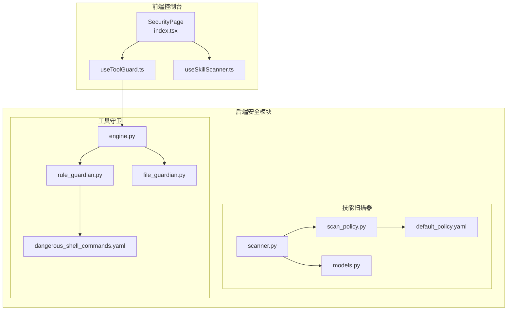
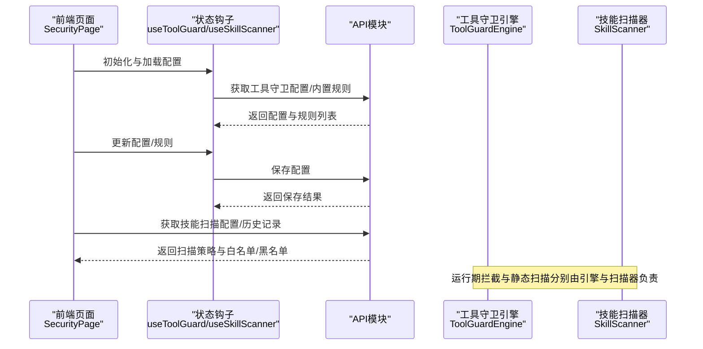
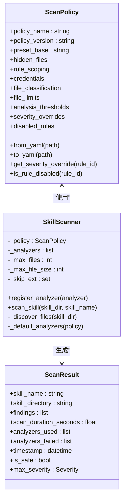
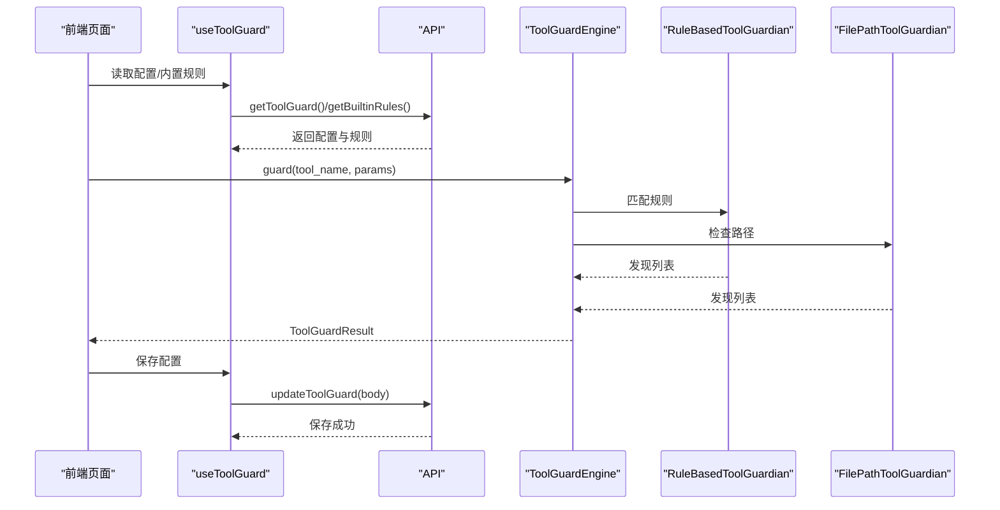
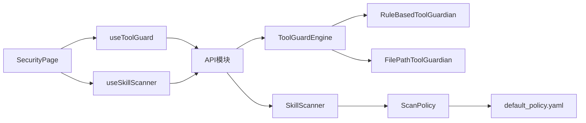
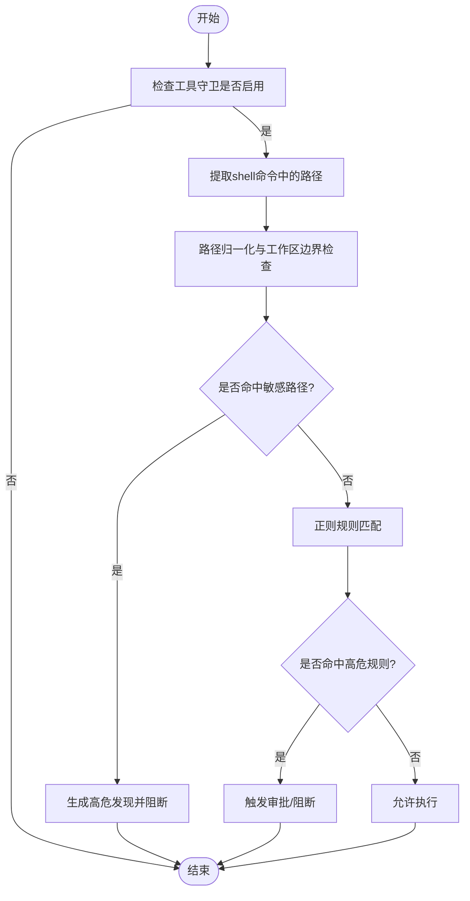

# 安全设置

<cite>
**本文引用的文件**
- [console/src/pages/Settings/Security/index.tsx](file://console/src/pages/Settings/Security/index.tsx)
- [console/src/pages/Settings/Security/useToolGuard.ts](file://console/src/pages/Settings/Security/useToolGuard.ts)
- [console/src/pages/Settings/Security/useSkillScanner.ts](file://console/src/pages/Settings/Security/useSkillScanner.ts)
- [src/qwenpaw/security/__init__.py](file://src/qwenpaw/security/__init__.py)
- [src/qwenpaw/security/skill_scanner/scanner.py](file://src/qwenpaw/security/skill_scanner/scanner.py)
- [src/qwenpaw/security/skill_scanner/scan_policy.py](file://src/qwenpaw/security/skill_scanner/scan_policy.py)
- [src/qwenpaw/security/skill_scanner/models.py](file://src/qwenpaw/security/skill_scanner/models.py)
- [src/qwenpaw/security/skill_scanner/data/default_policy.yaml](file://src/qwenpaw/security/skill_scanner/data/default_policy.yaml)
- [src/qwenpaw/security/tool_guard/engine.py](file://src/qwenpaw/security/tool_guard/engine.py)
- [src/qwenpaw/security/tool_guard/guardians/rule_guardian.py](file://src/qwenpaw/security/tool_guard/guardians/rule_guardian.py)
- [src/qwenpaw/security/tool_guard/guardians/file_guardian.py](file://src/qwenpaw/security/tool_guard/guardians/file_guardian.py)
- [src/qwenpaw/security/tool_guard/rules/dangerous_shell_commands.yaml](file://src/qwenpaw/security/tool_guard/rules/dangerous_shell_commands.yaml)
</cite>

## 目录
1. [简介](#简介)
2. [项目结构](#项目结构)
3. [核心组件](#核心组件)
4. [架构总览](#架构总览)
5. [详细组件分析](#详细组件分析)
6. [依赖分析](#依赖分析)
7. [性能考虑](#性能考虑)
8. [故障排查指南](#故障排查指南)
9. [结论](#结论)
10. [附录](#附录)

## 简介
本文件面向QwenPaw“安全设置”页面，系统化梳理后端安全框架与前端配置界面的实现，重点覆盖以下方面：
- 技能扫描器配置：扫描策略设置、规则配置与扫描结果展示
- 工具守卫功能：危险命令检测、路径级防护、权限控制与审批流程
- 安全策略管理：访问控制、审计日志与合规检查
- 安全规则自定义：正则表达式规则、签名匹配与行为分析
- 实时监控与告警机制：运行期告警与可视化反馈
- 用户界面设计：权限验证与安全最佳实践的前端落地

## 项目结构
安全相关代码主要分布在两部分：
- 前端控制台（console）：安全设置页面、表单、表格与弹窗交互
- 后端安全模块（src/qwenpaw/security）：技能扫描器与工具守卫引擎及规则

图表来源
- [console/src/pages/Settings/Security/index.tsx:1-438](file://console/src/pages/Settings/Security/index.tsx#L1-L438)
- [console/src/pages/Settings/Security/useToolGuard.ts:1-125](file://console/src/pages/Settings/Security/useToolGuard.ts#L1-L125)
- [console/src/pages/Settings/Security/useSkillScanner.ts:1-128](file://console/src/pages/Settings/Security/useSkillScanner.ts#L1-L128)
- [src/qwenpaw/security/skill_scanner/scanner.py:1-319](file://src/qwenpaw/security/skill_scanner/scanner.py#L1-L319)
- [src/qwenpaw/security/skill_scanner/scan_policy.py:1-476](file://src/qwenpaw/security/skill_scanner/scan_policy.py#L1-L476)
- [src/qwenpaw/security/skill_scanner/models.py:1-235](file://src/qwenpaw/security/skill_scanner/models.py#L1-L235)
- [src/qwenpaw/security/skill_scanner/data/default_policy.yaml:1-243](file://src/qwenpaw/security/skill_scanner/data/default_policy.yaml#L1-L243)
- [src/qwenpaw/security/tool_guard/engine.py:1-238](file://src/qwenpaw/security/tool_guard/engine.py#L1-L238)
- [src/qwenpaw/security/tool_guard/guardians/rule_guardian.py:1-758](file://src/qwenpaw/security/tool_guard/guardians/rule_guardian.py#L1-L758)
- [src/qwenpaw/security/tool_guard/guardians/file_guardian.py:1-365](file://src/qwenpaw/security/tool_guard/guardians/file_guardian.py#L1-L365)
- [src/qwenpaw/security/tool_guard/rules/dangerous_shell_commands.yaml:1-187](file://src/qwenpaw/security/tool_guard/rules/dangerous_shell_commands.yaml#L1-L187)

章节来源
- [console/src/pages/Settings/Security/index.tsx:1-438](file://console/src/pages/Settings/Security/index.tsx#L1-L438)
- [src/qwenpaw/security/__init__.py:1-21](file://src/qwenpaw/security/__init__.py#L1-L21)

## 核心组件
- 技能扫描器（SkillScanner）
  - 负责遍历技能目录、加载策略、注册分析器并聚合扫描结果
  - 支持策略覆盖、文件分类、大小限制与去重
- 扫描策略（ScanPolicy）
  - 组织级策略：隐藏文件处理、规则作用域、凭证抑制、文件分类、阈值与严重性覆盖
  - 默认策略内置在default_policy.yaml中，支持从YAML加载与合并
- 工具守卫引擎（ToolGuardEngine）
  - 运行期参数扫描，拦截危险工具调用；支持默认规则守护与路径级防护
  - 可动态启用/禁用、重载规则、按工具集/禁用集过滤
- 规则守护（RuleBasedToolGuardian）
  - 基于YAML签名的正则匹配，覆盖危险命令、系统操作、网络滥用等威胁类别
- 文件路径守护（FilePathToolGuardian）
  - 阻断对敏感文件/目录的直接访问，支持从配置加载与路径提取

章节来源
- [src/qwenpaw/security/skill_scanner/scanner.py:76-319](file://src/qwenpaw/security/skill_scanner/scanner.py#L76-L319)
- [src/qwenpaw/security/skill_scanner/scan_policy.py:156-476](file://src/qwenpaw/security/skill_scanner/scan_policy.py#L156-L476)
- [src/qwenpaw/security/skill_scanner/data/default_policy.yaml:1-243](file://src/qwenpaw/security/skill_scanner/data/default_policy.yaml#L1-L243)
- [src/qwenpaw/security/tool_guard/engine.py:53-238](file://src/qwenpaw/security/tool_guard/engine.py#L53-L238)
- [src/qwenpaw/security/tool_guard/guardians/rule_guardian.py:559-758](file://src/qwenpaw/security/tool_guard/guardians/rule_guardian.py#L559-L758)
- [src/qwenpaw/security/tool_guard/guardians/file_guardian.py:184-365](file://src/qwenpaw/security/tool_guard/guardians/file_guardian.py#L184-L365)

## 架构总览
前端“安全设置”页面通过API与后端安全模块交互，实现配置读取、保存与规则管理；后端以懒加载方式组织子模块，降低导入成本。

图表来源
- [console/src/pages/Settings/Security/index.tsx:60-120](file://console/src/pages/Settings/Security/index.tsx#L60-L120)
- [console/src/pages/Settings/Security/useToolGuard.ts:22-47](file://console/src/pages/Settings/Security/useToolGuard.ts#L22-L47)
- [console/src/pages/Settings/Security/useSkillScanner.ts:17-41](file://console/src/pages/Settings/Security/useSkillScanner.ts#L17-L41)
- [src/qwenpaw/security/tool_guard/engine.py:169-226](file://src/qwenpaw/security/tool_guard/engine.py#L169-L226)
- [src/qwenpaw/security/skill_scanner/scanner.py:148-242](file://src/qwenpaw/security/skill_scanner/scanner.py#L148-L242)

## 详细组件分析

### 技能扫描器配置与规则
- 扫描策略设置
  - 通过ScanPolicy加载默认策略，并允许组织策略覆盖
  - 支持隐藏文件、规则作用域、凭证抑制、文件分类、阈值与严重性覆盖
- 规则配置
  - PatternAnalyzer作为默认分析器，基于签名规则进行正则匹配
  - 支持规则去重、文档路径跳过、仅代码文件扫描等作用域控制
- 扫描结果展示
  - ScanResult包含最高严重级别、发现数量、耗时与失败分析器列表
  - 前端可据此渲染“安全/高危/中危”等状态与详情

图表来源
- [src/qwenpaw/security/skill_scanner/scan_policy.py:156-476](file://src/qwenpaw/security/skill_scanner/scan_policy.py#L156-L476)
- [src/qwenpaw/security/skill_scanner/scanner.py:76-319](file://src/qwenpaw/security/skill_scanner/scanner.py#L76-L319)
- [src/qwenpaw/security/skill_scanner/models.py:168-235](file://src/qwenpaw/security/skill_scanner/models.py#L168-L235)

章节来源
- [src/qwenpaw/security/skill_scanner/scan_policy.py:236-304](file://src/qwenpaw/security/skill_scanner/scan_policy.py#L236-L304)
- [src/qwenpaw/security/skill_scanner/data/default_policy.yaml:1-243](file://src/qwenpaw/security/skill_scanner/data/default_policy.yaml#L1-L243)
- [src/qwenpaw/security/skill_scanner/scanner.py:100-134](file://src/qwenpaw/security/skill_scanner/scanner.py#L100-L134)
- [src/qwenpaw/security/skill_scanner/models.py:168-235](file://src/qwenpaw/security/skill_scanner/models.py#L168-L235)

### 工具守卫功能：危险命令检测、权限控制与审批流程
- 危险命令检测
  - RuleBasedToolGuardian基于YAML规则进行正则匹配，覆盖rm/mv、格式化/写盘、fork炸弹、管道下载执行、反向连接、系统重启、服务管理、进程终止、提权等
  - 对rm命令额外增强：解析命令、提取目标路径、判断是否越出工作区边界，并在结果中注入结构化提示
- 权限控制
  - FilePathToolGuardian阻断对敏感文件/目录的访问；支持从配置加载、路径归一化与目录前缀匹配
- 审批流程
  - ToolGuardEngine统一编排守护者，支持按工具集/禁用集过滤、动态启用/禁用与规则重载
  - 前端通过开关与标签选择控制“受保护工具”和“直接拒绝工具”，并保存至后端配置

图表来源
- [console/src/pages/Settings/Security/index.tsx:89-120](file://console/src/pages/Settings/Security/index.tsx#L89-L120)
- [console/src/pages/Settings/Security/useToolGuard.ts:22-47](file://console/src/pages/Settings/Security/useToolGuard.ts#L22-L47)
- [src/qwenpaw/security/tool_guard/engine.py:169-226](file://src/qwenpaw/security/tool_guard/engine.py#L169-L226)
- [src/qwenpaw/security/tool_guard/guardians/rule_guardian.py:608-758](file://src/qwenpaw/security/tool_guard/guardians/rule_guardian.py#L608-L758)
- [src/qwenpaw/security/tool_guard/guardians/file_guardian.py:313-365](file://src/qwenpaw/security/tool_guard/guardians/file_guardian.py#L313-L365)

章节来源
- [src/qwenpaw/security/tool_guard/engine.py:53-164](file://src/qwenpaw/security/tool_guard/engine.py#L53-L164)
- [src/qwenpaw/security/tool_guard/guardians/rule_guardian.py:559-758](file://src/qwenpaw/security/tool_guard/guardians/rule_guardian.py#L559-L758)
- [src/qwenpaw/security/tool_guard/guardians/file_guardian.py:184-365](file://src/qwenpaw/security/tool_guard/guardians/file_guardian.py#L184-L365)
- [src/qwenpaw/security/tool_guard/rules/dangerous_shell_commands.yaml:1-187](file://src/qwenpaw/security/tool_guard/rules/dangerous_shell_commands.yaml#L1-L187)

### 安全策略管理：访问控制、审计日志与合规检查
- 访问控制
  - 工具守卫支持“受保护工具”集合与“直接拒绝工具”集合；未在集合内时可选择仅运行始终运行的守护者（如路径检查）
- 审计日志
  - 扫描器与工具守卫均记录关键事件（如扫描耗时、失败分析器、命中规则、路径越界提示），便于问题定位与合规追溯
- 合规检查
  - 通过策略覆盖与严重性调整，满足不同组织的合规基线；默认策略内置常见抑制项与文档路径跳过逻辑

章节来源
- [src/qwenpaw/security/tool_guard/engine.py:131-164](file://src/qwenpaw/security/tool_guard/engine.py#L131-L164)
- [src/qwenpaw/security/skill_scanner/scan_policy.py:183-231](file://src/qwenpaw/security/skill_scanner/scan_policy.py#L183-L231)
- [src/qwenpaw/security/skill_scanner/scanner.py:200-242](file://src/qwenpaw/security/skill_scanner/scanner.py#L200-L242)

### 安全规则的自定义配置：正则表达式、签名匹配与行为分析
- 正则表达式规则
  - 规则文件采用YAML格式，支持工具/参数作用域、模式与排除模式、描述与修复建议
  - 引擎在字符串化参数值上进行匹配，支持忽略注释行与大小写不敏感
- 签名匹配
  - 内置签名覆盖命令注入、系统破坏、资源滥用、网络滥用、权限提升等威胁类别
- 行为分析
  - rm命令增强：解析多命令、转义模式、平台差异、路径提取与越界检测，并在结果中注入结构化提示

章节来源
- [src/qwenpaw/security/tool_guard/guardians/rule_guardian.py:331-425](file://src/qwenpaw/security/tool_guard/guardians/rule_guardian.py#L331-L425)
- [src/qwenpaw/security/tool_guard/guardians/rule_guardian.py:608-758](file://src/qwenpaw/security/tool_guard/guardians/rule_guardian.py#L608-L758)
- [src/qwenpaw/security/tool_guard/rules/dangerous_shell_commands.yaml:1-187](file://src/qwenpaw/security/tool_guard/rules/dangerous_shell_commands.yaml#L1-L187)

### 实时监控与告警机制
- 运行期拦截
  - 工具守卫在工具调用前进行参数扫描，命中高危规则时返回阻断结果，必要时触发审批流程
- 可视化反馈
  - 前端根据ToolGuardResult与ScanResult渲染严重级别、发现详情与修复建议
- 历史与白名单
  - 技能扫描支持“阻止历史”与“白名单”管理，便于回溯与合规放行

章节来源
- [console/src/pages/Settings/Security/index.tsx:332-342](file://console/src/pages/Settings/Security/index.tsx#L332-L342)
- [console/src/pages/Settings/Security/useSkillScanner.ts:17-41](file://console/src/pages/Settings/Security/useSkillScanner.ts#L17-L41)
- [src/qwenpaw/security/skill_scanner/models.py:168-235](file://src/qwenpaw/security/skill_scanner/models.py#L168-L235)

### 用户界面设计、权限验证与安全最佳实践
- 页面布局
  - 分页签：工具守卫、文件守卫、技能扫描器
  - 工具守卫：开关控制、受保护工具与拒绝工具的选择、规则表格与新增/编辑弹窗
- 权限验证
  - 前端通过表单校验与错误状态提示保障输入合法性；保存时将配置体发送至后端持久化
- 安全最佳实践
  - 默认开启工具守卫；合理配置受保护工具集合；为高危规则设置高严重性并结合审批流程
  - 使用策略文件进行组织级覆盖，避免硬编码风险

章节来源
- [console/src/pages/Settings/Security/index.tsx:239-434](file://console/src/pages/Settings/Security/index.tsx#L239-L434)
- [console/src/pages/Settings/Security/useToolGuard.ts:97-123](file://console/src/pages/Settings/Security/useToolGuard.ts#L97-L123)

## 依赖分析
- 前端依赖后端API模块，后端模块间保持低耦合：工具守卫与技能扫描器各自独立，通过懒加载减少启动开销
- 规则与策略文件以YAML形式分发，便于版本化与组织定制

图表来源
- [console/src/pages/Settings/Security/index.tsx:1-40](file://console/src/pages/Settings/Security/index.tsx#L1-L40)
- [console/src/pages/Settings/Security/useToolGuard.ts:1-21](file://console/src/pages/Settings/Security/useToolGuard.ts#L1-L21)
- [console/src/pages/Settings/Security/useSkillScanner.ts:1-16](file://console/src/pages/Settings/Security/useSkillScanner.ts#L1-L16)
- [src/qwenpaw/security/tool_guard/engine.py:53-102](file://src/qwenpaw/security/tool_guard/engine.py#L53-L102)
- [src/qwenpaw/security/skill_scanner/scan_policy.py:236-282](file://src/qwenpaw/security/skill_scanner/scan_policy.py#L236-L282)

章节来源
- [src/qwenpaw/security/__init__.py:1-21](file://src/qwenpaw/security/__init__.py#L1-L21)

## 性能考虑
- 扫描器
  - 文件上限与大小限制：防止超大包导致内存与IO压力
  - 去重与作用域：减少重复扫描与无效规则触发
- 守卫引擎
  - 懒加载守护者与规则，按需初始化
  - 字符串化参数扫描，避免深度序列化开销
- 前端
  - 并行加载配置与内置规则，减少首屏等待

## 故障排查指南
- 工具守卫未生效
  - 检查开关状态与受保护工具集合；确认规则已重载
- 规则未命中
  - 核对工具/参数作用域、排除模式与大小写；检查规则文件语法
- 路径越界误报
  - 校验工作区根目录与路径归一化逻辑；确认环境变量与用户展开
- 扫描结果异常
  - 查看失败分析器列表与扫描耗时；核对策略覆盖与文件分类

章节来源
- [src/qwenpaw/security/tool_guard/engine.py:148-164](file://src/qwenpaw/security/tool_guard/engine.py#L148-L164)
- [src/qwenpaw/security/tool_guard/guardians/rule_guardian.py:432-511](file://src/qwenpaw/security/tool_guard/guardians/rule_guardian.py#L432-L511)
- [src/qwenpaw/security/skill_scanner/scanner.py:200-242](file://src/qwenpaw/security/skill_scanner/scanner.py#L200-L242)

## 结论
“安全设置”页面将工具守卫与技能扫描器的配置能力前端化，配合策略与规则的组织化管理，形成从“静态扫描”到“运行期拦截”的闭环。通过合理的权限控制、审批流程与可视化反馈，既能满足合规要求，又兼顾易用性与可观测性。

## 附录
- 关键流程图：规则匹配与路径检查

图表来源
- [src/qwenpaw/security/tool_guard/guardians/file_guardian.py:313-365](file://src/qwenpaw/security/tool_guard/guardians/file_guardian.py#L313-L365)
- [src/qwenpaw/security/tool_guard/guardians/rule_guardian.py:608-758](file://src/qwenpaw/security/tool_guard/guardians/rule_guardian.py#L608-L758)