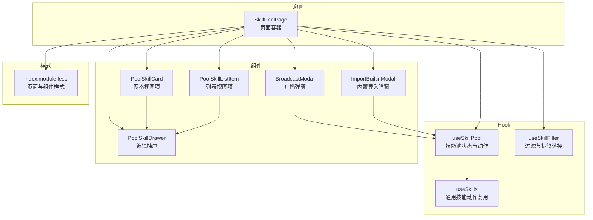
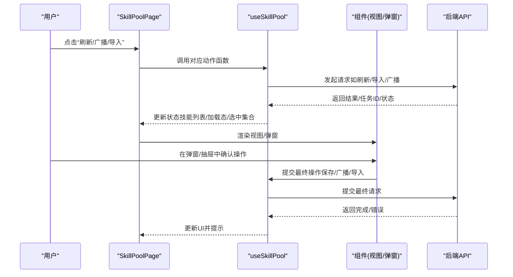
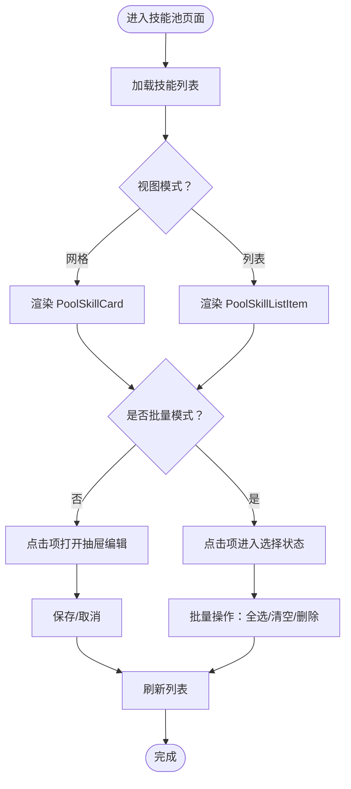
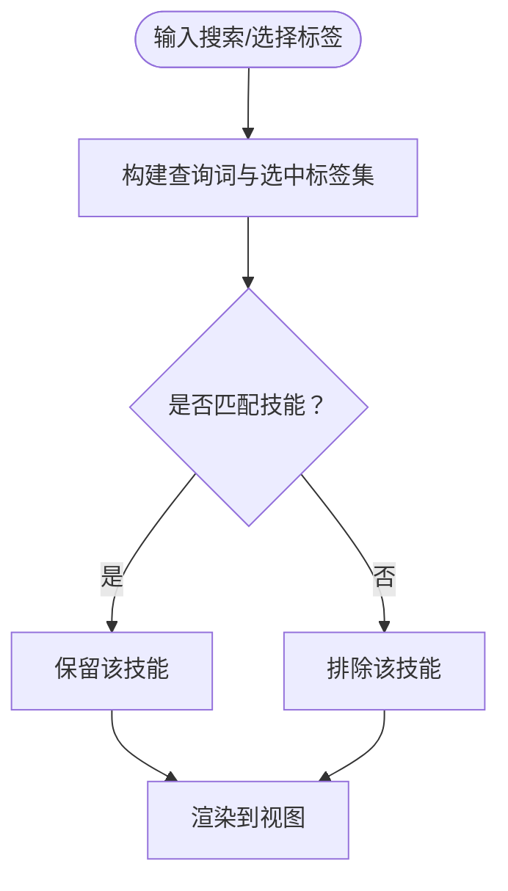
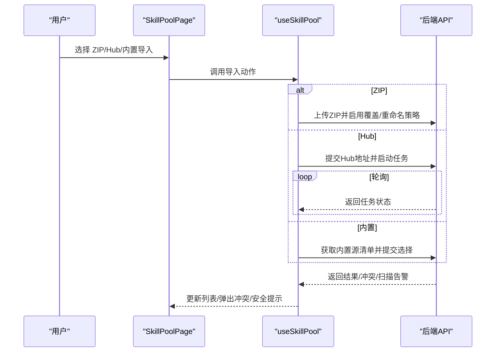
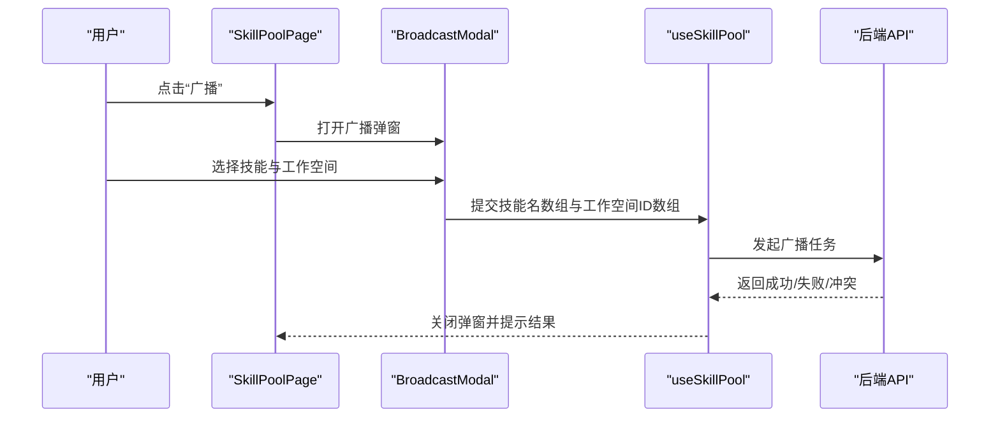
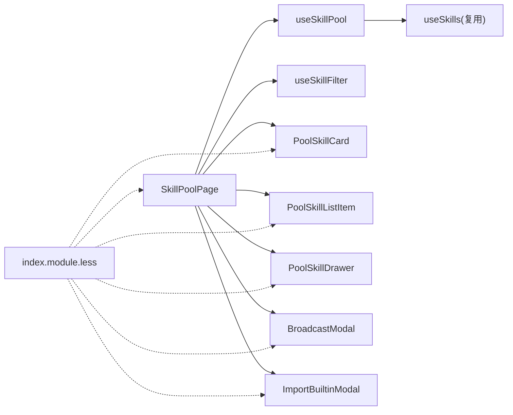

# 技能池设置

<cite>
**本文引用的文件**
- [SkillPoolPage 页面](file://console/src/pages/Settings/SkillPool/index.tsx)
- [useSkillPool 钩子（技能池）](file://console/src/pages/Settings/SkillPool/useSkillPool.tsx)
- [useSkills 钩子（通用技能）](file://console/src/pages/Agent/Skills/useSkills.ts)
- [useSkillFilter 过滤器](file://console/src/pages/Agent/Skills/useSkillFilter.ts)
- [技能池组件：BroadcastModal 广播弹窗](file://console/src/pages/Settings/SkillPool/components/BroadcastModal.tsx)
- [技能池组件：PoolSkillCard 卡片视图项](file://console/src/pages/Settings/SkillPool/components/PoolSkillCard.tsx)
- [技能池组件：PoolSkillListItem 列表视图项](file://console/src/pages/Settings/SkillPool/components/PoolSkillListItem.tsx)
- [技能池组件：PoolSkillDrawer 抽屉编辑器](file://console/src/pages/Settings/SkillPool/components/PoolSkillDrawer.tsx)
- [技能池组件：ImportBuiltinModal 内置技能导入弹窗](file://console/src/pages/Settings/SkillPool/components/ImportBuiltinModal.tsx)
- [技能池样式：index.module.less](file://console/src/pages/Settings/SkillPool/index.module.less)
- [技能常量：skill.ts](file://console/src/constants/skill.ts)
</cite>

## 目录
1. [简介](#简介)
2. [项目结构](#项目结构)
3. [核心组件](#核心组件)
4. [架构总览](#架构总览)
5. [详细组件分析](#详细组件分析)
6. [依赖关系分析](#依赖关系分析)
7. [性能考量](#性能考量)
8. [故障排查指南](#故障排查指南)
9. [结论](#结论)
10. [附录](#附录)

## 简介
本文件面向 QwenPaw 控制台“技能池设置”页面，系统性梳理技能池管理的前端实现，覆盖以下主题：
- 技能列表展示与视图切换
- 分类筛选与搜索
- 技能导入与导出（ZIP 上传、Hub 导入、内置技能导入）
- 技能池广播（批量分发到工作空间）、批量安装与冲突处理
- 版本状态与兼容性提示
- 同步与更新机制（手动刷新、轮询状态）
- 用户交互设计、批量操作与错误处理

## 项目结构
技能池设置页面位于控制台前端目录下，采用“页面 + 组件 + Hook + 样式”的分层组织方式：
- 页面入口负责布局、工具栏、视图渲染与模态框调度
- 组件层包含卡片/列表视图项、抽屉编辑器、广播弹窗、内置技能导入弹窗等
- Hook 层封装技能池状态、过滤、导入、广播、保存等业务逻辑
- 样式层通过模块化 CSS 提供统一的视觉与交互规范

图表来源
- [SkillPoolPage 页面:30-290](file://console/src/pages/Settings/SkillPool/index.tsx#L30-L290)
- [useSkillPool 钩子（技能池）](file://console/src/pages/Settings/SkillPool/useSkillPool.tsx)
- [useSkills 钩子（通用技能）:21-323](file://console/src/pages/Agent/Skills/useSkills.ts#L21-L323)
- [useSkillFilter 过滤器:10-50](file://console/src/pages/Agent/Skills/useSkillFilter.ts#L10-L50)
- [技能池组件：PoolSkillCard 卡片视图项:24-161](file://console/src/pages/Settings/SkillPool/components/PoolSkillCard.tsx#L24-L161)
- [技能池组件：PoolSkillListItem 列表视图项:26-113](file://console/src/pages/Settings/SkillPool/components/PoolSkillListItem.tsx#L26-L113)
- [技能池组件：PoolSkillDrawer 抽屉编辑器:30-147](file://console/src/pages/Settings/SkillPool/components/PoolSkillDrawer.tsx#L30-L147)
- [技能池组件：BroadcastModal 广播弹窗:21-191](file://console/src/pages/Settings/SkillPool/components/BroadcastModal.tsx#L21-L191)
- [技能池组件：ImportBuiltinModal 内置技能导入弹窗:16-112](file://console/src/pages/Settings/SkillPool/components/ImportBuiltinModal.tsx#L16-L112)
- [技能池样式：index.module.less:1-800](file://console/src/pages/Settings/SkillPool/index.module.less#L1-L800)

章节来源
- [SkillPoolPage 页面:30-290](file://console/src/pages/Settings/SkillPool/index.tsx#L30-L290)
- [技能池样式：index.module.less:1-800](file://console/src/pages/Settings/SkillPool/index.module.less#L1-L800)

## 核心组件
- 页面容器：负责面包屑、头部操作区（刷新、广播、内置导入、ZIP 上传、Hub 导入、批量模式切换、新建）、工具栏（搜索 + 标签筛选 + 视图切换）、内容区（网格/列表视图）以及各弹窗/抽屉的挂载与状态传递。
- 过滤器 Hook：提供文本查询与标签过滤能力，支持多选标签筛选与“tag:”前缀识别。
- 视图项组件：PoolSkillCard 与 PoolSkillListItem 提供统一的技能卡片/列表项 UI，包含名称、描述、标签、内置/自定义标识、版本状态徽章、时间信息与底部操作按钮。
- 编辑抽屉：PoolSkillDrawer 提供技能名称、内容（Markdown 编辑器）、标签、配置文本的编辑与保存。
- 广播弹窗：BroadcastModal 支持从技能池中选择若干技能，并批量分发到多个工作空间；内置技能默认可选。
- 内置导入弹窗：ImportBuiltinModal 展示内置技能源清单，标注当前版本、目标版本与导入状态（缺失/冲突/已最新），支持一键全选。

章节来源
- [SkillPoolPage 页面:30-290](file://console/src/pages/Settings/SkillPool/index.tsx#L30-L290)
- [useSkillFilter 过滤器:10-50](file://console/src/pages/Agent/Skills/useSkillFilter.ts#L10-L50)
- [技能池组件：PoolSkillCard 卡片视图项:24-161](file://console/src/pages/Settings/SkillPool/components/PoolSkillCard.tsx#L24-L161)
- [技能池组件：PoolSkillListItem 列表视图项:26-113](file://console/src/pages/Settings/SkillPool/components/PoolSkillListItem.tsx#L26-L113)
- [技能池组件：PoolSkillDrawer 抽屉编辑器:30-147](file://console/src/pages/Settings/SkillPool/components/PoolSkillDrawer.tsx#L30-L147)
- [技能池组件：BroadcastModal 广播弹窗:21-191](file://console/src/pages/Settings/SkillPool/components/BroadcastModal.tsx#L21-L191)
- [技能池组件：ImportBuiltinModal 内置技能导入弹窗:16-112](file://console/src/pages/Settings/SkillPool/components/ImportBuiltinModal.tsx#L16-L112)

## 架构总览
技能池设置页面采用“页面 + Hook + 组件 + 样式”的分层架构，数据流自上而下：
- 页面接收用户输入，调用 Hook 暴露的动作函数
- Hook 调用通用 API（来自 useSkills 或独立 useSkillPool 实现）进行网络请求
- 组件根据状态渲染视图、触发批量操作或打开弹窗
- 样式模块化保证一致的视觉与交互体验

图表来源
- [SkillPoolPage 页面:30-290](file://console/src/pages/Settings/SkillPool/index.tsx#L30-L290)
- [useSkillPool 钩子（技能池）](file://console/src/pages/Settings/SkillPool/useSkillPool.tsx)
- [useSkills 钩子（通用技能）:55-323](file://console/src/pages/Agent/Skills/useSkills.ts#L55-L323)

## 详细组件分析

### 技能列表与视图切换
- 列表展示：支持网格（PoolSkillCard）与列表（PoolSkillListItem）两种视图，通过顶部工具栏的切换按钮切换。
- 批量模式：开启后，点击项进入选择状态；支持全选、清空、批量删除。
- 交互细节：卡片视图在悬停或批量模式下显示底部操作按钮；列表视图在批量模式下显示复选框。

图表来源
- [SkillPoolPage 页面:150-242](file://console/src/pages/Settings/SkillPool/index.tsx#L150-L242)
- [技能池组件：PoolSkillCard 卡片视图项:24-161](file://console/src/pages/Settings/SkillPool/components/PoolSkillCard.tsx#L24-L161)
- [技能池组件：PoolSkillListItem 列表视图项:26-113](file://console/src/pages/Settings/SkillPool/components/PoolSkillListItem.tsx#L26-L113)

章节来源
- [SkillPoolPage 页面:150-242](file://console/src/pages/Settings/SkillPool/index.tsx#L150-L242)
- [技能池组件：PoolSkillCard 卡片视图项:24-161](file://console/src/pages/Settings/SkillPool/components/PoolSkillCard.tsx#L24-L161)
- [技能池组件：PoolSkillListItem 列表视图项:26-113](file://console/src/pages/Settings/SkillPool/components/PoolSkillListItem.tsx#L26-L113)

### 分类筛选与搜索
- 文本搜索：在工具栏的 Select 中输入关键词，匹配技能名称与描述。
- 标签筛选：支持多选标签，标签以“tag:”前缀区分；过滤器会同时满足文本与标签条件。
- 全量标签：由所有技能的 tags 去重排序生成，便于快速选择。

图表来源
- [useSkillFilter 过滤器:10-50](file://console/src/pages/Agent/Skills/useSkillFilter.ts#L10-L50)
- [SkillPoolPage 页面:153-203](file://console/src/pages/Settings/SkillPool/index.tsx#L153-L203)

章节来源
- [useSkillFilter 过滤器:10-50](file://console/src/pages/Agent/Skills/useSkillFilter.ts#L10-L50)
- [SkillPoolPage 页面:153-203](file://console/src/pages/Settings/SkillPool/index.tsx#L153-L203)

### 技能导入与导出
- ZIP 上传：通过隐藏的文件输入框触发，选择 .zip 包后调用导入流程，返回导入成功的技能名列表。
- Hub 导入：支持从受信 Hub 地址导入技能包，内部使用任务 ID 轮询状态，支持超时与取消。
- 内置技能导入：展示内置技能源清单，标注版本与状态，支持批量选择并导入。
- 导出：页面未提供直接导出功能；可通过编辑技能并在抽屉中复制内容实现导出。

图表来源
- [SkillPoolPage 页面:45-51](file://console/src/pages/Settings/SkillPool/index.tsx#L45-L51)
- [useSkillPool 钩子（技能池）](file://console/src/pages/Settings/SkillPool/useSkillPool.tsx)
- [useSkills 钩子（通用技能）:111-240](file://console/src/pages/Agent/Skills/useSkills.ts#L111-L240)
- [技能常量：skill.ts:1-21](file://console/src/constants/skill.ts#L1-L21)

章节来源
- [SkillPoolPage 页面:45-51](file://console/src/pages/Settings/SkillPool/index.tsx#L45-L51)
- [useSkills 钩子（通用技能）:111-240](file://console/src/pages/Agent/Skills/useSkills.ts#L111-L240)
- [技能常量：skill.ts:1-21](file://console/src/constants/skill.ts#L1-L21)

### 技能池广播与批量安装
- 技能池广播：在 BroadcastModal 中选择若干技能与目标工作空间，支持一键全选技能（含内置）、一键全选工作空间。
- 冲突处理：当存在冲突时，返回冲突详情，由上层逻辑决定后续行为（例如重命名或跳过）。
- 批量安装：通过内置导入弹窗批量选择并安装。

图表来源
- [技能池组件：BroadcastModal 广播弹窗:21-191](file://console/src/pages/Settings/SkillPool/components/BroadcastModal.tsx#L21-L191)
- [SkillPoolPage 页面:252-259](file://console/src/pages/Settings/SkillPool/index.tsx#L252-L259)
- [useSkillPool 钩子（技能池）](file://console/src/pages/Settings/SkillPool/useSkillPool.tsx)

章节来源
- [技能池组件：BroadcastModal 广播弹窗:21-191](file://console/src/pages/Settings/SkillPool/components/BroadcastModal.tsx#L21-L191)
- [SkillPoolPage 页面:252-259](file://console/src/pages/Settings/SkillPool/index.tsx#L252-L259)

### 技能版本控制与兼容性
- 版本状态：技能项包含同步状态（如已同步/已过期/中性），用于直观提示版本一致性。
- 内置源版本：内置导入弹窗展示“目标版本/当前版本”，并标注导入状态（缺失/冲突/已最新）。
- 兼容性与依赖：Hub 导入与 ZIP 上传均可能返回冲突详情，需结合上层逻辑进行重命名或回退处理。

章节来源
- [技能池组件：PoolSkillCard 卡片视图项:35-65](file://console/src/pages/Settings/SkillPool/components/PoolSkillCard.tsx#L35-L65)
- [技能池组件：ImportBuiltinModal 内置技能导入弹窗:64-107](file://console/src/pages/Settings/SkillPool/components/ImportBuiltinModal.tsx#L64-L107)

### 同步与更新机制
- 手动刷新：页面提供“刷新”按钮，调用刷新接口并清理缓存后重新拉取技能列表。
- Hub 导入轮询：导入 Hub 技能时，基于任务 ID 轮询状态，支持超时自动取消与手动取消。
- 安全扫描：导入完成后对新技能执行安全扫描提示，必要时弹出扫描错误对话框。

章节来源
- [SkillPoolPage 页面:83-89](file://console/src/pages/Settings/SkillPool/index.tsx#L83-L89)
- [useSkills 钩子（通用技能）:68-80](file://console/src/pages/Agent/Skills/useSkills.ts#L68-L80)
- [useSkills 钩子（通用技能）:176-240](file://console/src/pages/Agent/Skills/useSkills.ts#L176-L240)

### 用户交互设计与批量操作
- 头部操作区：提供刷新、广播、内置导入、ZIP 上传、Hub 导入、批量模式切换、新建技能等快捷入口。
- 批量模式：显示已选数量、全选/清空/批量删除按钮；在批量模式下，点击项为选择而非编辑。
- 抽屉编辑：支持技能名称、内容（Markdown）、标签、配置文本的编辑与保存。
- 弹窗交互：广播弹窗与内置导入弹窗均提供“全选/清空/一键选择内置”等批量操作按钮。

章节来源
- [SkillPoolPage 页面:44-147](file://console/src/pages/Settings/SkillPool/index.tsx#L44-L147)
- [技能池组件：PoolSkillDrawer 抽屉编辑器:30-147](file://console/src/pages/Settings/SkillPool/components/PoolSkillDrawer.tsx#L30-L147)
- [技能池组件：BroadcastModal 广播弹窗:72-88](file://console/src/pages/Settings/SkillPool/components/BroadcastModal.tsx#L72-L88)
- [技能池组件：ImportBuiltinModal 内置技能导入弹窗:52-62](file://console/src/pages/Settings/SkillPool/components/ImportBuiltinModal.tsx#L52-L62)

### 错误处理与安全扫描
- 错误处理：统一通过消息提示与错误解析，区分扫描错误与常规错误；对于 Hub 导入失败，优先检查冲突与扫描错误类型。
- 冲突处理：ZIP 与 Hub 导入可能返回冲突详情，需引导用户进行重命名或跳过。
- 安全扫描：导入完成后对新技能执行扫描，若发现风险则弹出扫描错误对话框。

章节来源
- [useSkills 钩子（通用技能）:32-42](file://console/src/pages/Agent/Skills/useSkills.ts#L32-L42)
- [useSkills 钩子（通用技能）:139-148](file://console/src/pages/Agent/Skills/useSkills.ts#L139-L148)
- [useSkills 钩子（通用技能）:194-210](file://console/src/pages/Agent/Skills/useSkills.ts#L194-L210)

## 依赖关系分析
- 页面依赖 Hook 提供的状态与动作函数，同时组合多个组件以完成不同视图与交互。
- Hook 之间存在复用关系：技能池页面可复用通用技能 Hook 的导入/刷新/删除等能力。
- 组件间解耦：视图项组件不直接访问 API，而是通过页面/Hook 间接调用；弹窗与抽屉仅负责 UI 与参数传递。
- 样式模块化：页面与组件共享同一套样式模块，确保视觉一致性。

图表来源
- [SkillPoolPage 页面:30-290](file://console/src/pages/Settings/SkillPool/index.tsx#L30-L290)
- [useSkillPool 钩子（技能池）](file://console/src/pages/Settings/SkillPool/useSkillPool.tsx)
- [useSkills 钩子（通用技能）:21-323](file://console/src/pages/Agent/Skills/useSkills.ts#L21-L323)
- [技能池样式：index.module.less:1-800](file://console/src/pages/Settings/SkillPool/index.module.less#L1-L800)

章节来源
- [SkillPoolPage 页面:30-290](file://console/src/pages/Settings/SkillPool/index.tsx#L30-L290)
- [useSkillPool 钩子（技能池）](file://console/src/pages/Settings/SkillPool/useSkillPool.tsx)
- [useSkills 钩子（通用技能）:21-323](file://console/src/pages/Agent/Skills/useSkills.ts#L21-L323)
- [技能池样式：index.module.less:1-800](file://console/src/pages/Settings/SkillPool/index.module.less#L1-L800)

## 性能考量
- 渐进渲染：页面使用渐进渲染钩子对长列表进行分页渲染，提升首屏与滚动性能。
- 缓存失效：在关键变更（创建/上传/导入/删除/刷新）后主动清理缓存，避免重复请求与脏数据。
- 轮询节流：Hub 导入轮询间隔合理设置，避免频繁请求；超时自动取消，防止长时间占用资源。
- 样式按需：组件样式模块化，仅在需要时加载，减少全局样式体积。

章节来源
- [SkillPoolPage 页面:33-37](file://console/src/pages/Settings/SkillPool/index.tsx#L33-L37)
- [useSkills 钩子（通用技能）:97-98](file://console/src/pages/Agent/Skills/useSkills.ts#L97-L98)
- [useSkills 钩子（通用技能）:179-229](file://console/src/pages/Agent/Skills/useSkills.ts#L179-L229)

## 故障排查指南
- 导入失败
  - 检查 Hub 地址是否在受信前缀列表内
  - 查看轮询状态是否为失败，优先处理冲突与扫描错误
  - 若超时，确认网络状况与任务是否被取消
- 冲突问题
  - ZIP/Hub 导入返回冲突详情时，建议重命名或跳过冲突项
- 安全扫描告警
  - 导入完成后出现扫描错误，需根据提示修正或拒绝导入
- 刷新无效
  - 确认刷新按钮未禁用，查看网络请求与缓存清理是否生效

章节来源
- [技能常量：skill.ts:1-21](file://console/src/constants/skill.ts#L1-L21)
- [useSkills 钩子（通用技能）:194-210](file://console/src/pages/Agent/Skills/useSkills.ts#L194-L210)
- [useSkills 钩子（通用技能）:223-227](file://console/src/pages/Agent/Skills/useSkills.ts#L223-L227)

## 结论
技能池设置页面通过清晰的分层架构与完善的交互设计，实现了技能的浏览、筛选、导入、广播与批量管理。配合版本状态提示与安全扫描机制，保障了技能生态的可控与安全。未来可在以下方面持续优化：
- 增加导出功能（ZIP/JSON）以完善闭环
- 优化 Hub 导入的并发与重试策略
- 提供更细粒度的权限与审计日志

## 附录
- 术语
  - 技能池：集中管理的技能集合，支持内置与自定义技能
  - 广播：将技能从技能池分发到多个工作空间
  - 冲突：导入时与现有技能名称或版本产生冲突
  - Hub：外部技能市场/仓库，支持链接导入