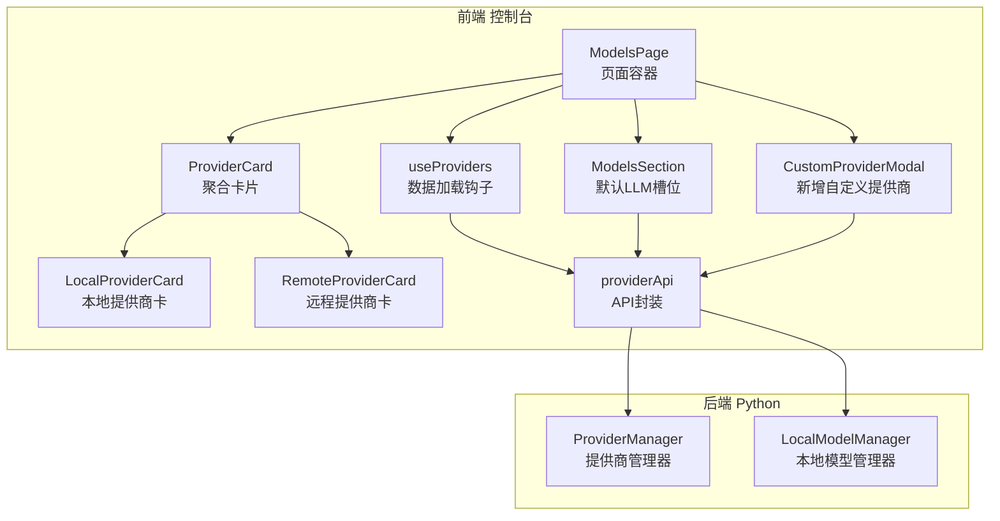
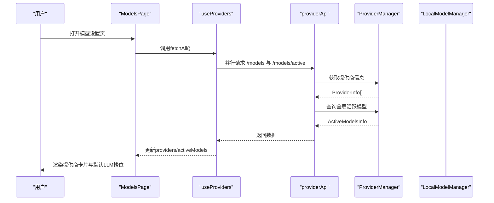
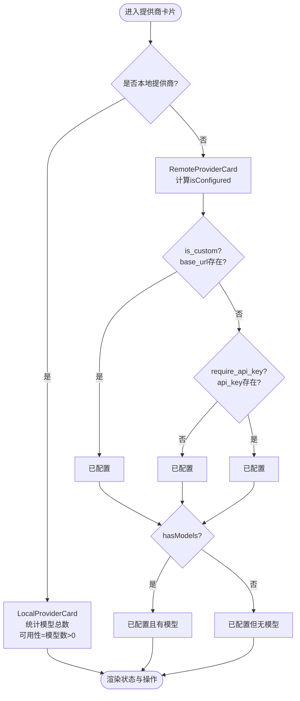
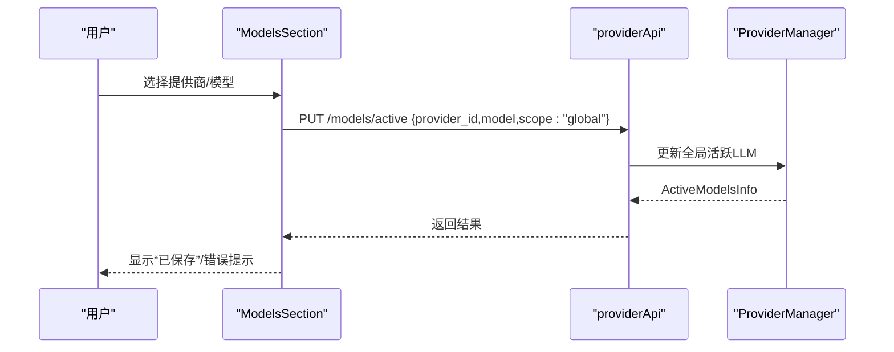
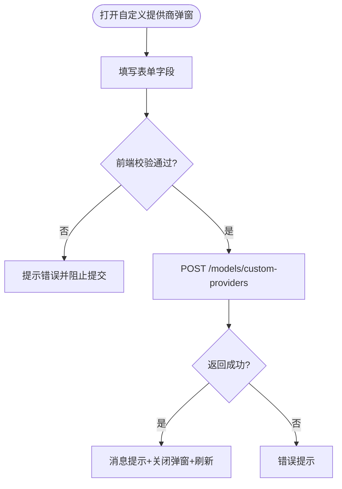
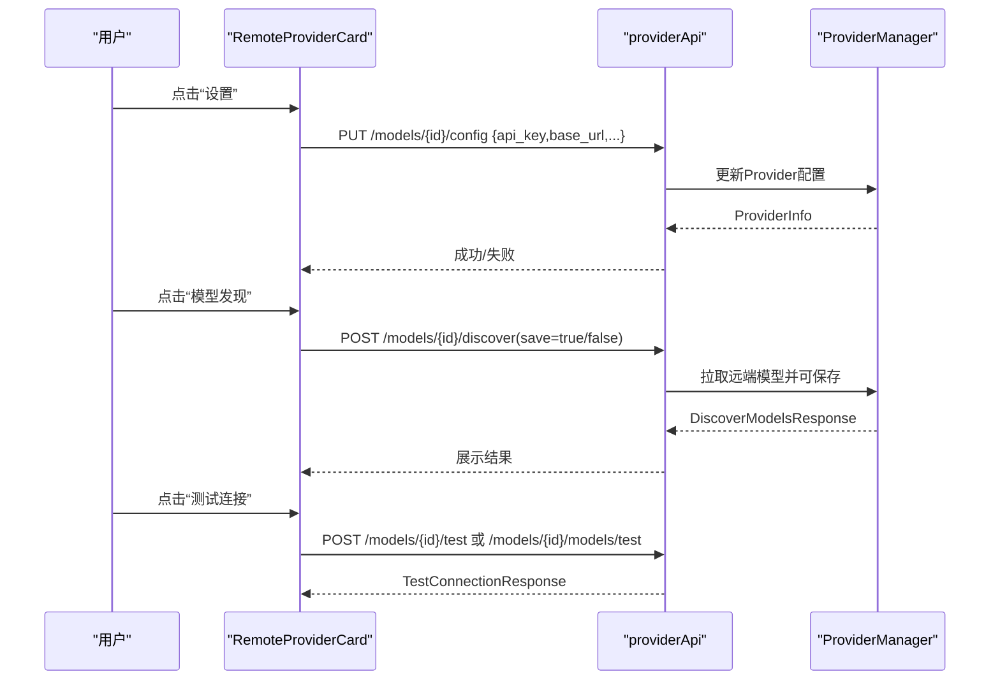
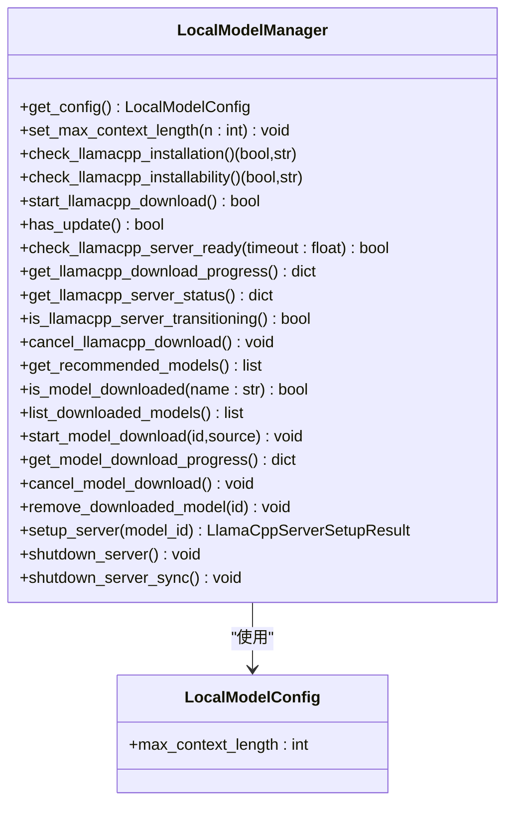
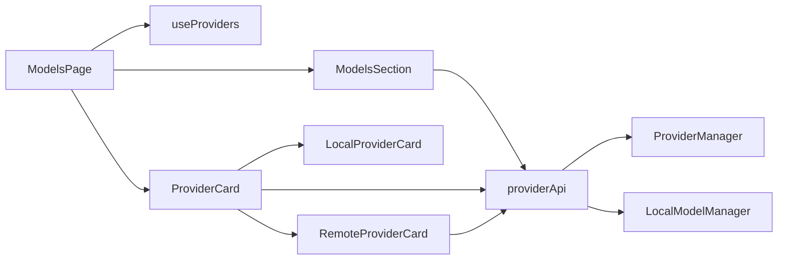

# 模型设置

<cite>
**本文引用的文件**
- [console/src/pages/Settings/Models/index.tsx](file://console/src/pages/Settings/Models/index.tsx)
- [console/src/pages/Settings/Models/useProviders.ts](file://console/src/pages/Settings/Models/useProviders.ts)
- [console/src/pages/Settings/Models/components/cards/ProviderCard.tsx](file://console/src/pages/Settings/Models/components/cards/ProviderCard.tsx)
- [console/src/pages/Settings/Models/components/cards/LocalProviderCard.tsx](file://console/src/pages/Settings/Models/components/cards/LocalProviderCard.tsx)
- [console/src/pages/Settings/Models/components/cards/RemoteProviderCard.tsx](file://console/src/pages/Settings/Models/components/cards/RemoteProviderCard.tsx)
- [console/src/pages/Settings/Models/components/sections/ModelsSection.tsx](file://console/src/pages/Settings/Models/components/sections/ModelsSection.tsx)
- [console/src/pages/Settings/Models/components/modals/CustomProviderModal.tsx](file://console/src/pages/Settings/Models/components/modals/CustomProviderModal.tsx)
- [console/src/api/modules/provider.ts](file://console/src/api/modules/provider.ts)
- [console/src/api/types/provider.ts](file://console/src/api/types/provider.ts)
- [src/qwenpaw/providers/provider_manager.py](file://src/qwenpaw/providers/provider_manager.py)
- [src/qwenpaw/local_models/manager.py](file://src/qwenpaw/local_models/manager.py)
</cite>

## 目录
1. [简介](#简介)
2. [项目结构](#项目结构)
3. [核心组件](#核心组件)
4. [架构总览](#架构总览)
5. [详细组件分析](#详细组件分析)
6. [依赖分析](#依赖分析)
7. [性能考虑](#性能考虑)
8. [故障排查指南](#故障排查指南)
9. [结论](#结论)
10. [附录](#附录)

## 简介
本文件面向QwenPaw模型设置页面，系统化梳理“模型提供商管理”“本地模型配置”“远程模型管理”“配置验证与连通性测试”“模型切换与回滚”等关键能力，并给出前端组件与后端服务的实现映射、数据流图与优化建议。目标是帮助开发者快速理解并扩展模型设置功能。

## 项目结构
模型设置页面位于控制台前端，围绕“提供商卡片”“默认LLM槽位选择”“自定义提供商”“本地模型管理”等模块组织；后端由Python侧提供统一的提供商管理器与本地模型管理器支撑。

图表来源
- [console/src/pages/Settings/Models/index.tsx:1-152](file://console/src/pages/Settings/Models/index.tsx#L1-L152)
- [console/src/pages/Settings/Models/useProviders.ts:1-56](file://console/src/pages/Settings/Models/useProviders.ts#L1-L56)
- [console/src/pages/Settings/Models/components/cards/ProviderCard.tsx:1-29](file://console/src/pages/Settings/Models/components/cards/ProviderCard.tsx#L1-L29)
- [console/src/pages/Settings/Models/components/cards/LocalProviderCard.tsx:1-112](file://console/src/pages/Settings/Models/components/cards/LocalProviderCard.tsx#L1-L112)
- [console/src/pages/Settings/Models/components/cards/RemoteProviderCard.tsx:1-226](file://console/src/pages/Settings/Models/components/cards/RemoteProviderCard.tsx#L1-L226)
- [console/src/pages/Settings/Models/components/sections/ModelsSection.tsx:1-178](file://console/src/pages/Settings/Models/components/sections/ModelsSection.tsx#L1-L178)
- [console/src/pages/Settings/Models/components/modals/CustomProviderModal.tsx:1-132](file://console/src/pages/Settings/Models/components/modals/CustomProviderModal.tsx#L1-L132)
- [console/src/api/modules/provider.ts:1-152](file://console/src/api/modules/provider.ts#L1-L152)
- [src/qwenpaw/providers/provider_manager.py:670-800](file://src/qwenpaw/providers/provider_manager.py#L670-L800)
- [src/qwenpaw/local_models/manager.py:33-229](file://src/qwenpaw/local_models/manager.py#L33-L229)

章节来源
- [console/src/pages/Settings/Models/index.tsx:1-152](file://console/src/pages/Settings/Models/index.tsx#L1-L152)
- [console/src/pages/Settings/Models/useProviders.ts:1-56](file://console/src/pages/Settings/Models/useProviders.ts#L1-L56)
- [console/src/api/modules/provider.ts:1-152](file://console/src/api/modules/provider.ts#L1-L152)

## 核心组件
- 页面容器与布局：负责加载提供商列表、活跃模型、搜索过滤、添加自定义提供商弹窗。
- 提供商卡片：根据是否本地/自定义/内置，渲染不同状态与操作入口。
- 默认LLM槽位：选择提供商与模型，保存到全局作用域。
- 自定义提供商：表单校验与创建流程。
- API封装：统一REST调用，包含提供商CRUD、模型增删改、本地模型配置、连通性测试、模型发现等。

章节来源
- [console/src/pages/Settings/Models/index.tsx:20-149](file://console/src/pages/Settings/Models/index.tsx#L20-L149)
- [console/src/pages/Settings/Models/components/cards/ProviderCard.tsx:12-28](file://console/src/pages/Settings/Models/components/cards/ProviderCard.tsx#L12-L28)
- [console/src/pages/Settings/Models/components/sections/ModelsSection.tsx:31-177](file://console/src/pages/Settings/Models/components/sections/ModelsSection.tsx#L31-L177)
- [console/src/pages/Settings/Models/components/modals/CustomProviderModal.tsx:13-131](file://console/src/pages/Settings/Models/components/modals/CustomProviderModal.tsx#L13-L131)
- [console/src/api/modules/provider.ts:37-151](file://console/src/api/modules/provider.ts#L37-L151)

## 架构总览
前端通过useProviders在挂载时并行拉取“提供商列表+全局活跃模型”，随后在页面中分组展示本地与远程提供商卡片。用户可在默认LLM区域选择提供商与模型并保存；在提供商卡片内可打开“模型管理”或“设置”弹窗进行配置与操作。所有交互最终落到providerApi封装的HTTP请求，后端由ProviderManager与LocalModelManager承接。

图表来源
- [console/src/pages/Settings/Models/useProviders.ts:15-42](file://console/src/pages/Settings/Models/useProviders.ts#L15-L42)
- [console/src/api/modules/provider.ts:37-47](file://console/src/api/modules/provider.ts#L37-L47)
- [src/qwenpaw/providers/provider_manager.py:736-751](file://src/qwenpaw/providers/provider_manager.py#L736-L751)

## 详细组件分析

### 提供商卡片设计与连接状态显示
- ProviderCard作为聚合入口，依据provider.id区分本地与远程，分别渲染LocalProviderCard与RemoteProviderCard。
- LocalProviderCard：仅显示本地可用性（模型数量>0即“可用”），悬停显示“模型管理”入口。
- RemoteProviderCard：综合“是否自定义/是否冻结URL/是否需要API Key/API Key是否存在/是否有模型”判断可用性，状态点颜色与文案区分“已配置且有模型/已配置但无模型/未配置”。

图表来源
- [console/src/pages/Settings/Models/components/cards/LocalProviderCard.tsx:22-26](file://console/src/pages/Settings/Models/components/cards/LocalProviderCard.tsx#L22-L26)
- [console/src/pages/Settings/Models/components/cards/RemoteProviderCard.tsx:53-68](file://console/src/pages/Settings/Models/components/cards/RemoteProviderCard.tsx#L53-L68)

章节来源
- [console/src/pages/Settings/Models/components/cards/ProviderCard.tsx:12-28](file://console/src/pages/Settings/Models/components/cards/ProviderCard.tsx#L12-L28)
- [console/src/pages/Settings/Models/components/cards/LocalProviderCard.tsx:14-111](file://console/src/pages/Settings/Models/components/cards/LocalProviderCard.tsx#L14-L111)
- [console/src/pages/Settings/Models/components/cards/RemoteProviderCard.tsx:18-225](file://console/src/pages/Settings/Models/components/cards/RemoteProviderCard.tsx#L18-L225)

### 默认LLM槽位与模型切换
- ModelsSection根据providers筛选“可选提供商”（需满足API Key/URL/模型存在等条件），生成下拉选项。
- 用户选择提供商与模型后，调用setActiveLlm写入全局作用域，成功后刷新页面状态。
- 当前选择与活跃槽位一致时按钮显示“已保存”。

图表来源
- [console/src/pages/Settings/Models/components/sections/ModelsSection.tsx:89-111](file://console/src/pages/Settings/Models/components/sections/ModelsSection.tsx#L89-L111)
- [console/src/api/modules/provider.ts:49-53](file://console/src/api/modules/provider.ts#L49-L53)
- [src/qwenpaw/providers/provider_manager.py:792-794](file://src/qwenpaw/providers/provider_manager.py#L792-L794)

章节来源
- [console/src/pages/Settings/Models/components/sections/ModelsSection.tsx:31-177](file://console/src/pages/Settings/Models/components/sections/ModelsSection.tsx#L31-L177)

### 自定义提供商与配置验证
- CustomProviderModal提供表单：id/name/base_url/api_key_prefix/chat_model等字段，内置规则校验（必填、正则、协议选择）。
- 创建成功后通过message提示并回调onSaved刷新列表；失败时捕获错误并提示。

图表来源
- [console/src/pages/Settings/Models/components/modals/CustomProviderModal.tsx:29-55](file://console/src/pages/Settings/Models/components/modals/CustomProviderModal.tsx#L29-L55)
- [console/src/api/modules/provider.ts:57-67](file://console/src/api/modules/provider.ts#L57-L67)

章节来源
- [console/src/pages/Settings/Models/components/modals/CustomProviderModal.tsx:13-131](file://console/src/pages/Settings/Models/components/modals/CustomProviderModal.tsx#L13-L131)

### 远程模型管理：API密钥配置、模型列表获取与连接测试
- 配置管理：RemoteProviderCard支持打开“设置”弹窗，调用configureProvider更新base_url/api_key/chat_model/generate_kwargs等。
- 模型发现：discoverModels支持从远端API拉取可用模型并可选择保存。
- 连接测试：testProviderConnection/testModelConnection用于连通性与模型可用性验证。

图表来源
- [console/src/pages/Settings/Models/components/cards/RemoteProviderCard.tsx:29-51](file://console/src/pages/Settings/Models/components/cards/RemoteProviderCard.tsx#L29-L51)
- [console/src/api/modules/provider.ts:40-44](file://console/src/api/modules/provider.ts#L40-L44)
- [console/src/api/modules/provider.ts:128-142](file://console/src/api/modules/provider.ts#L128-L142)
- [console/src/api/modules/provider.ts:110-126](file://console/src/api/modules/provider.ts#L110-L126)

章节来源
- [console/src/pages/Settings/Models/components/cards/RemoteProviderCard.tsx:18-225](file://console/src/pages/Settings/Models/components/cards/RemoteProviderCard.tsx#L18-L225)
- [console/src/api/modules/provider.ts:37-151](file://console/src/api/modules/provider.ts#L37-L151)

### 本地模型配置：下载、安装路径与运行时参数
- 本地模型管理入口：LocalProviderCard提供“模型管理”入口，打开ModelManageModal后可进行模型下载、删除、服务器启动/停止等。
- 运行时参数：LocalModelManager维护max_context_length等配置，持久化至config.json，影响llama.cpp启动参数。
- 下载与服务器生命周期：LocalModelManager封装下载进度、服务器状态查询、启动/停止等，避免并发冲突。

图表来源
- [src/qwenpaw/local_models/manager.py:23-103](file://src/qwenpaw/local_models/manager.py#L23-L103)
- [src/qwenpaw/local_models/manager.py:105-229](file://src/qwenpaw/local_models/manager.py#L105-L229)

章节来源
- [console/src/pages/Settings/Models/components/cards/LocalProviderCard.tsx:14-111](file://console/src/pages/Settings/Models/components/cards/LocalProviderCard.tsx#L14-L111)
- [src/qwenpaw/local_models/manager.py:33-229](file://src/qwenpaw/local_models/manager.py#L33-L229)

### 模型配置验证机制
- 前端表单验证：CustomProviderModal对id/name/base_url/chat_model等字段进行必填与格式校验；ProviderCard/RemoteProviderCard基于字段存在性与require_api_key/freeze_url等属性判断“已配置/部分配置/未配置”。
- 后端配置校验：ProviderManager在更新配置或执行连接测试时进行参数校验与连通性检查，确保API Key、Base URL、模型ID等有效。
- 连接测试：testProviderConnection/testModelConnection返回success/message，前端据此提示用户。

章节来源
- [console/src/pages/Settings/Models/components/modals/CustomProviderModal.tsx:78-127](file://console/src/pages/Settings/Models/components/modals/CustomProviderModal.tsx#L78-L127)
- [console/src/pages/Settings/Models/components/cards/RemoteProviderCard.tsx:55-65](file://console/src/pages/Settings/Models/components/cards/RemoteProviderCard.tsx#L55-L65)
- [console/src/api/modules/provider.ts:110-126](file://console/src/api/modules/provider.ts#L110-L126)
- [src/qwenpaw/providers/provider_manager.py:796-800](file://src/qwenpaw/providers/provider_manager.py#L796-L800)

### 模型切换与回滚（配置备份、版本管理与故障恢复）
- 切换流程：ModelsSection保存全局活跃LLM，后端ProviderManager记录active_llm，便于后续路由与推理使用。
- 回滚建议：当前实现未见显式“版本/备份/回滚”逻辑。建议在后端为Provider配置与ActiveModels变更引入快照/版本号字段，并在前端提供“恢复到上次有效配置”的操作入口。
- 故障恢复：当切换失败时，前端保持原状态并提示错误；后端应保证配置原子性与幂等性，必要时提供“撤销/重试”接口。

章节来源
- [console/src/pages/Settings/Models/components/sections/ModelsSection.tsx:89-111](file://console/src/pages/Settings/Models/components/sections/ModelsSection.tsx#L89-L111)
- [src/qwenpaw/providers/provider_manager.py:670-800](file://src/qwenpaw/providers/provider_manager.py#L670-L800)

## 依赖分析
- 前端依赖关系：ModelsPage依赖useProviders；ProviderCard依赖LocalProviderCard/RemoteProviderCard；ModelsSection与CustomProviderModal依赖providerApi；providerApi封装对后端ProviderManager与LocalModelManager的调用。
- 数据契约：ProviderInfo/ActiveModelsInfo/ModelSlotRequest等类型定义前后端一致，保障数据一致性。

图表来源
- [console/src/pages/Settings/Models/index.tsx:20-149](file://console/src/pages/Settings/Models/index.tsx#L20-L149)
- [console/src/pages/Settings/Models/components/cards/ProviderCard.tsx:12-28](file://console/src/pages/Settings/Models/components/cards/ProviderCard.tsx#L12-L28)
- [console/src/pages/Settings/Models/components/sections/ModelsSection.tsx:31-177](file://console/src/pages/Settings/Models/components/sections/ModelsSection.tsx#L31-L177)
- [console/src/api/modules/provider.ts:37-151](file://console/src/api/modules/provider.ts#L37-L151)

章节来源
- [console/src/api/types/provider.ts:10-91](file://console/src/api/types/provider.ts#L10-L91)
- [console/src/api/modules/provider.ts:37-151](file://console/src/api/modules/provider.ts#L37-L151)

## 性能考虑
- 并发加载：useProviders使用Promise.all并行拉取提供商与活跃模型，减少首屏等待。
- 搜索与过滤：前端对providers进行内存过滤，建议在数据量增大时引入虚拟滚动与服务端分页。
- 缓存策略：ProviderManager在内存中聚合builtin/custom/plugin提供商信息，避免重复构建；建议在前端对最近一次成功响应做短期缓存，降低频繁刷新带来的抖动。
- 本地模型下载：LocalModelManager对下载与服务器生命周期加锁，避免竞态；建议在UI层展示下载队列与进度条，提升可观测性。
- 错误处理：统一捕获异常并提示，避免页面崩溃；对网络超时与重试策略进行统一配置。

章节来源
- [console/src/pages/Settings/Models/useProviders.ts:21-42](file://console/src/pages/Settings/Models/useProviders.ts#L21-L42)
- [src/qwenpaw/local_models/manager.py:53-56](file://src/qwenpaw/local_models/manager.py#L53-L56)

## 故障排查指南
- 无法加载提供商：检查VITE_API_BASE_URL配置与网络连通性；查看useProviders错误分支与控制台日志。
- 自定义提供商创建失败：确认id命名规范（小写字母/数字/下划线/短横线，长度限制）、必填项完整；查看表单rules提示。
- 连接测试失败：核对base_url/api_key/chat_model/generate_kwargs；对于不支持连接检查的提供商，按其特性调整配置。
- 本地模型不可用：检查llama.cpp安装状态与下载进度；确认max_context_length等运行时参数合理。

章节来源
- [console/src/pages/Settings/Models/useProviders.ts:25-41](file://console/src/pages/Settings/Models/useProviders.ts#L25-L41)
- [console/src/pages/Settings/Models/components/modals/CustomProviderModal.tsx:30-54](file://console/src/pages/Settings/Models/components/modals/CustomProviderModal.tsx#L30-L54)
- [console/src/api/modules/provider.ts:110-126](file://console/src/api/modules/provider.ts#L110-L126)
- [src/qwenpaw/local_models/manager.py:111-156](file://src/qwenpaw/local_models/manager.py#L111-L156)

## 结论
模型设置页面以“提供商卡片+默认LLM槽位+自定义提供商+本地模型管理”为核心，结合providerApi与后端ProviderManager/LocalModelManager，实现了从配置到运行的闭环。建议后续增强“配置版本/备份/回滚”能力与“服务端分页/虚拟滚动/缓存策略”，进一步提升稳定性与用户体验。

## 附录
- 关键API一览
  - 列出提供商：GET /models
  - 获取活跃模型：GET /models/active?scope=global
  - 设置默认LLM：PUT /models/active
  - 新增自定义提供商：POST /models/custom-providers
  - 删除自定义提供商：DELETE /models/custom-providers/{id}
  - 配置提供商：PUT /models/{id}/config
  - 发现模型：POST /models/{id}/discover?save=true
  - 测试连接：POST /models/{id}/test 或 /models/{id}/models/test
  - 本地模型配置：PUT /local-models/config；GET /local-models/config

章节来源
- [console/src/api/modules/provider.ts:37-151](file://console/src/api/modules/provider.ts#L37-L151)