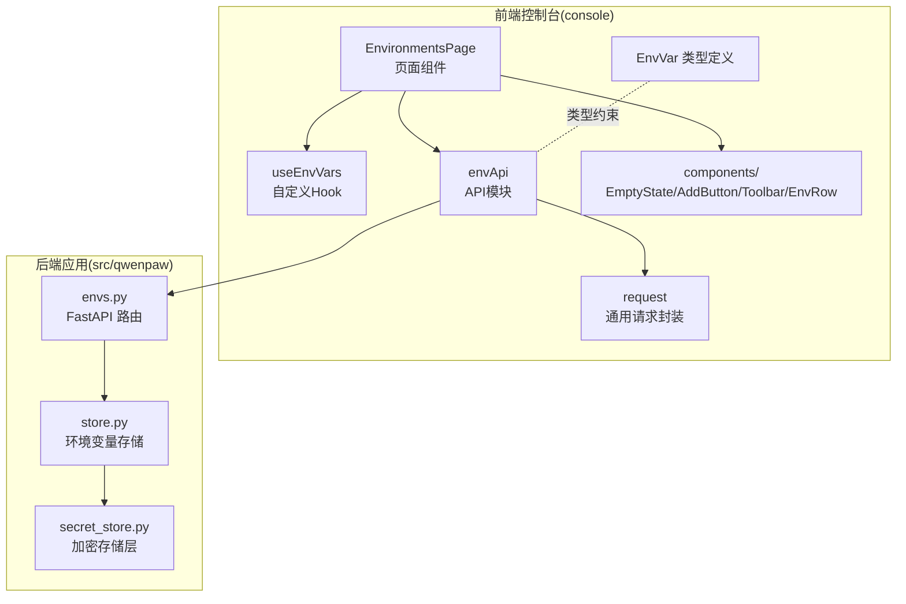
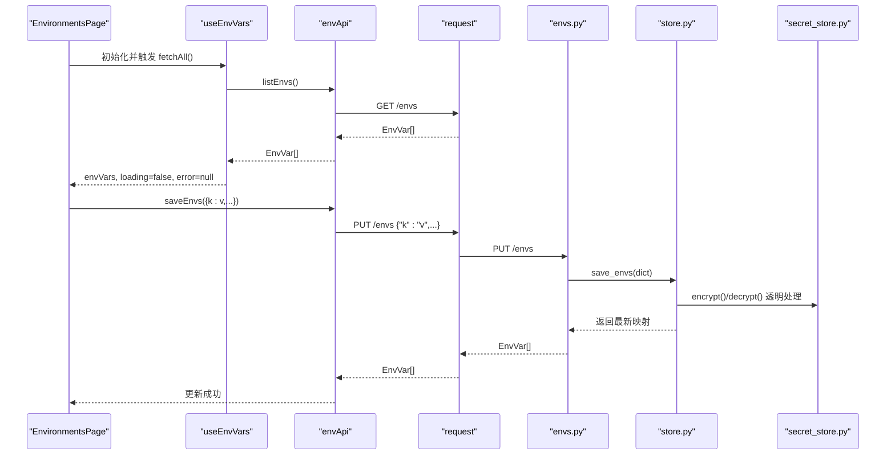
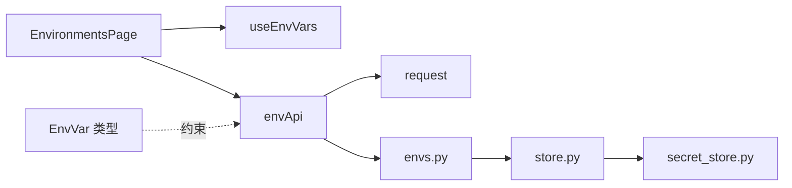
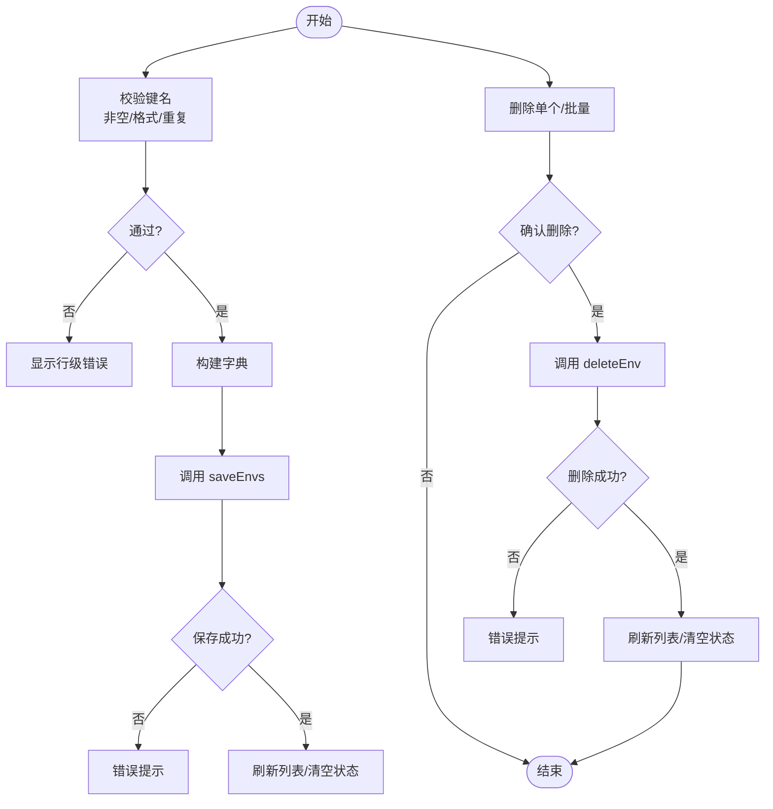

# 环境变量设置

<cite>
**本文引用的文件**
- [console/src/pages/Settings/Environments/index.tsx](file://console/src/pages/Settings/Environments/index.tsx)
- [console/src/pages/Settings/Environments/useEnvVars.ts](file://console/src/pages/Settings/Environments/useEnvVars.ts)
- [console/src/pages/Settings/Environments/components/index.ts](file://console/src/pages/Settings/Environments/components/index.ts)
- [console/src/api/modules/env.ts](file://console/src/api/modules/env.ts)
- [console/src/api/types/env.ts](file://console/src/api/types/env.ts)
- [console/src/api/request.ts](file://console/src/api/request.ts)
- [src/qwenpaw/app/routers/envs.py](file://src/qwenpaw/app/routers/envs.py)
- [src/qwenpaw/envs/store.py](file://src/qwenpaw/envs/store.py)
- [src/qwenpaw/security/secret_store.py](file://src/qwenpaw/security/secret_store.py)
</cite>

## 目录
1. [简介](#简介)
2. [项目结构](#项目结构)
3. [核心组件](#核心组件)
4. [架构总览](#架构总览)
5. [详细组件分析](#详细组件分析)
6. [依赖分析](#依赖分析)
7. [性能考虑](#性能考虑)
8. [故障排查指南](#故障排查指南)
9. [结论](#结论)
10. [附录](#附录)

## 简介
本文件面向 QwenPaw 的“环境变量设置”页面，系统性梳理前端页面、API 路由与后端持久化层的实现细节，覆盖以下主题：
- 环境变量列表展示：表格设计、本地编辑态、选择与批量操作
- 添加、编辑、删除：表单校验、键名格式与重复性检查、冲突检测与确认流程
- 批量管理：全量替换保存、删除选中项、与后端保持数据一致性
- 作用域与可见性：全局持久化变量、进程注入行为、受保护键的排除策略
- 安全与加密：磁盘存储加密、主密钥管理、透明加解密与降级容错
- 用户交互与错误处理：加载状态、错误提示、消息反馈与重试机制

## 项目结构
该页面位于控制台前端的设置模块下，采用“页面 + 自定义 Hook + API 模块 + 组件集合”的分层组织方式；后端通过 FastAPI 路由对接到环境变量存储模块。

图表来源
- [console/src/pages/Settings/Environments/index.tsx:1-326](file://console/src/pages/Settings/Environments/index.tsx#L1-L326)
- [console/src/pages/Settings/Environments/useEnvVars.ts:1-34](file://console/src/pages/Settings/Environments/useEnvVars.ts#L1-L34)
- [console/src/pages/Settings/Environments/components/index.ts:1-5](file://console/src/pages/Settings/Environments/components/index.ts#L1-L5)
- [console/src/api/modules/env.ts:1-19](file://console/src/api/modules/env.ts#L1-L19)
- [console/src/api/request.ts:1-105](file://console/src/api/request.ts#L1-L105)
- [console/src/api/types/env.ts:1-5](file://console/src/api/types/env.ts#L1-L5)
- [src/qwenpaw/app/routers/envs.py:1-81](file://src/qwenpaw/app/routers/envs.py#L1-L81)
- [src/qwenpaw/envs/store.py:1-263](file://src/qwenpaw/envs/store.py#L1-L263)
- [src/qwenpaw/security/secret_store.py:1-291](file://src/qwenpaw/security/secret_store.py#L1-L291)

章节来源
- [console/src/pages/Settings/Environments/index.tsx:1-326](file://console/src/pages/Settings/Environments/index.tsx#L1-L326)
- [console/src/pages/Settings/Environments/useEnvVars.ts:1-34](file://console/src/pages/Settings/Environments/useEnvVars.ts#L1-L34)
- [console/src/pages/Settings/Environments/components/index.ts:1-5](file://console/src/pages/Settings/Environments/components/index.ts#L1-L5)
- [console/src/api/modules/env.ts:1-19](file://console/src/api/modules/env.ts#L1-L19)
- [console/src/api/request.ts:1-105](file://console/src/api/request.ts#L1-L105)
- [console/src/api/types/env.ts:1-5](file://console/src/api/types/env.ts#L1-L5)
- [src/qwenpaw/app/routers/envs.py:1-81](file://src/qwenpaw/app/routers/envs.py#L1-L81)
- [src/qwenpaw/envs/store.py:1-263](file://src/qwenpaw/envs/store.py#L1-L263)
- [src/qwenpaw/security/secret_store.py:1-291](file://src/qwenpaw/security/secret_store.py#L1-L291)

## 核心组件
- 页面组件：负责渲染列表、工具栏、行编辑、选择与批量操作、保存与重置、加载/错误状态与重试。
- 自定义 Hook：封装环境变量的拉取、缓存与刷新，统一错误处理。
- API 模块：封装 /envs 的 GET/PUT/DELETE 请求，返回 EnvVar 列表。
- 存储与路由：后端路由提供全量列出、全量替换保存、按键删除；存储层负责磁盘持久化与进程注入。
- 加密层：提供透明加解密、主密钥管理与降级容错。

章节来源
- [console/src/pages/Settings/Environments/index.tsx:30-326](file://console/src/pages/Settings/Environments/index.tsx#L30-L326)
- [console/src/pages/Settings/Environments/useEnvVars.ts:5-33](file://console/src/pages/Settings/Environments/useEnvVars.ts#L5-L33)
- [console/src/api/modules/env.ts:4-18](file://console/src/api/modules/env.ts#L4-L18)
- [src/qwenpaw/app/routers/envs.py:32-81](file://src/qwenpaw/app/routers/envs.py#L32-L81)
- [src/qwenpaw/envs/store.py:142-263](file://src/qwenpaw/envs/store.py#L142-L263)
- [src/qwenpaw/security/secret_store.py:213-247](file://src/qwenpaw/security/secret_store.py#L213-L247)

## 架构总览
前端通过 envApi 调用后端 /envs 接口，后端路由调用存储模块完成磁盘读写与进程注入同步。加密层在读写时对值进行透明加解密，并在首次访问时迁移明文。

图表来源
- [console/src/pages/Settings/Environments/index.tsx:33-326](file://console/src/pages/Settings/Environments/index.tsx#L33-L326)
- [console/src/pages/Settings/Environments/useEnvVars.ts:10-33](file://console/src/pages/Settings/Environments/useEnvVars.ts#L10-L33)
- [console/src/api/modules/env.ts:5-12](file://console/src/api/modules/env.ts#L5-L12)
- [console/src/api/request.ts:60-104](file://console/src/api/request.ts#L60-L104)
- [src/qwenpaw/app/routers/envs.py:43-63](file://src/qwenpaw/app/routers/envs.py#L43-L63)
- [src/qwenpaw/envs/store.py:198-221](file://src/qwenpaw/envs/store.py#L198-L221)
- [src/qwenpaw/security/secret_store.py:213-247](file://src/qwenpaw/security/secret_store.py#L213-L247)

## 详细组件分析

### 页面与交互（EnvironmentsPage）
- 列表渲染与本地编辑态
  - workingRows 基于 envVars 或本地 rows 计算，支持“未保存编辑态”与“服务器同步态”切换。
  - 行编辑通过 updateRow 支持 key/value 变更，新增行标记 isNew，便于区分持久化与本地状态。
- 选择与批量操作
  - 单选/全选逻辑，维护 selected 集合；批量删除时区分“仅本地新增”与“已持久化”，分别走本地移除或 API 删除。
  - 删除前弹窗确认，避免误删；删除成功后刷新列表并清空选择与错误。
- 保存与重置
  - validate 校验：键名非空、符合命名规范、无重复；校验结果以 keyErrors 映射到行级错误。
  - handleSave 将 workingRows 转换为字典后调用 saveEnvs，成功后刷新并清空状态。
  - handleReset 清空本地编辑态与选择。
- 错误处理与加载状态
  - loading/error 控制占位与错误提示；错误时提供“重试”按钮重新拉取。

章节来源
- [console/src/pages/Settings/Environments/index.tsx:30-326](file://console/src/pages/Settings/Environments/index.tsx#L30-L326)

### 数据获取与刷新（useEnvVars）
- 使用 React Hook 管理 envVars、loading、error。
- fetchAll 调用 api.listEnvs，异常时记录错误并输出日志；最终关闭 loading。

章节来源
- [console/src/pages/Settings/Environments/useEnvVars.ts:5-33](file://console/src/pages/Settings/Environments/useEnvVars.ts#L5-L33)

### API 模块与类型（envApi、EnvVar）
- envApi 提供 listEnvs、saveEnvs、deleteEnv 三个方法，分别对应 GET/PUT/DELETE /envs 与 /envs/{key}。
- EnvVar 类型定义包含 key 与 value 字段，用于前后端契约一致。

章节来源
- [console/src/api/modules/env.ts:4-18](file://console/src/api/modules/env.ts#L4-L18)
- [console/src/api/types/env.ts:1-5](file://console/src/api/types/env.ts#L1-L5)

### 后端路由与存储（envs.py、store.py）
- 路由
  - GET /envs：返回排序后的 EnvVar 列表。
  - PUT /envs：全量替换，先清洗键名（去空白），再保存；键名为空时报 400。
  - DELETE /envs/{key}：按键删除，不存在时报 404。
- 存储
  - load_envs：从 envs.json 读取并透明解密；若发现明文则迁移加密。
  - save_envs：加密后写入 envs.json，并同步到 os.environ。
  - set_env_var/delete_env_var：单键增删。
  - load_envs_into_environ：启动时将非受保护键注入当前进程环境，且不覆盖运行时显式设置的键。

章节来源
- [src/qwenpaw/app/routers/envs.py:32-81](file://src/qwenpaw/app/routers/envs.py#L32-L81)
- [src/qwenpaw/envs/store.py:142-263](file://src/qwenpaw/envs/store.py#L142-L263)

### 加密与安全（secret_store.py）
- 主密钥管理：优先使用 OS keychain（keyring），失败回退到 SECRET_DIR/.master_key；容器/无桌面/CI 环境跳过 keyring。
- 加密算法：Fernet（AES-128-CBC + HMAC-SHA256），值带 ENC: 前缀。
- 透明加解密：load_envs 在读取时自动解密，必要时迁移明文；写入时自动加密。
- 容错：解密失败时返回原文，避免崩溃。

章节来源
- [src/qwenpaw/security/secret_store.py:49-189](file://src/qwenpaw/security/secret_store.py#L49-L189)
- [src/qwenpaw/security/secret_store.py:213-247](file://src/qwenpaw/security/secret_store.py#L213-L247)

### 组件集合（components/index.ts）
- 导出 EmptyState、AddButton、Toolbar、EnvRow 等子组件，页面通过组合这些组件实现列表、工具栏与行编辑。

章节来源
- [console/src/pages/Settings/Environments/components/index.ts:1-5](file://console/src/pages/Settings/Environments/components/index.ts#L1-L5)

## 依赖分析
- 前端依赖链
  - EnvironmentsPage 依赖 useEnvVars 与 envApi；envApi 依赖 request；EnvVar 类型约束 API。
- 后端依赖链
  - envs.py 路由依赖 envs.store；store.py 依赖 security.secret_store。
- 数据流
  - 前端发起请求，后端路由调用存储层，存储层读写磁盘并同步进程环境，加密层贯穿读写过程。

图表来源
- [console/src/pages/Settings/Environments/index.tsx:30-326](file://console/src/pages/Settings/Environments/index.tsx#L30-L326)
- [console/src/pages/Settings/Environments/useEnvVars.ts:5-33](file://console/src/pages/Settings/Environments/useEnvVars.ts#L5-L33)
- [console/src/api/modules/env.ts:4-18](file://console/src/api/modules/env.ts#L4-L18)
- [console/src/api/request.ts:60-104](file://console/src/api/request.ts#L60-L104)
- [src/qwenpaw/app/routers/envs.py:32-81](file://src/qwenpaw/app/routers/envs.py#L32-L81)
- [src/qwenpaw/envs/store.py:142-263](file://src/qwenpaw/envs/store.py#L142-L263)
- [src/qwenpaw/security/secret_store.py:213-247](file://src/qwenpaw/security/secret_store.py#L213-L247)
- [console/src/api/types/env.ts:1-5](file://console/src/api/types/env.ts#L1-L5)

## 性能考虑
- 本地编辑与批量保存
  - workingRows 与 rows 的 memo 化减少不必要的重渲染；批量保存一次 PUT，避免多次往返。
- 加载与错误处理
  - 列表加载失败可直接重试，避免频繁刷新导致的抖动。
- 进程注入同步
  - 保存后同步 os.environ，确保子进程立即可见，避免额外查询开销。
- 加密成本
  - 加密/解密为 CPU 密集型，但仅在读写时发生；通过透明处理降低调用方负担。

[本节为通用指导，无需列出章节来源]

## 故障排查指南
- 列表加载失败
  - 检查网络与鉴权状态；查看错误信息并点击“重试”。若持续失败，检查后端路由与存储文件权限。
- 保存失败
  - 校验键名是否为空、是否重复、是否符合命名规范；修正后重试。
- 删除失败
  - 确认目标键是否存在；后端 404 表示键不存在；确认是否为受保护键被排除注入。
- 加密相关问题
  - 若解密失败，检查主密钥来源与文件权限；确认磁盘上值是否带有 ENC: 前缀；必要时清理旧密钥并重新生成。
- 进程内不可见
  - 确认键是否属于受保护键（如工作目录相关）；运行时显式设置的键不会被覆盖。

章节来源
- [console/src/api/request.ts:73-92](file://console/src/api/request.ts#L73-L92)
- [src/qwenpaw/app/routers/envs.py:54-63](file://src/qwenpaw/app/routers/envs.py#L54-L63)
- [src/qwenpaw/envs/store.py:84-91](file://src/qwenpaw/envs/store.py#L84-L91)
- [src/qwenpaw/envs/store.py:242-263](file://src/qwenpaw/envs/store.py#L242-L263)
- [src/qwenpaw/security/secret_store.py:232-241](file://src/qwenpaw/security/secret_store.py#L232-L241)

## 结论
该页面以“本地编辑态 + 全量替换保存”的模式实现了高效、安全的环境变量管理：前端提供直观的表格与批量操作，后端通过磁盘持久化与进程注入保障可用性，加密层确保敏感数据的安全性。整体设计在易用性与安全性之间取得平衡，适合日常开发与生产场景使用。

[本节为总结性内容，无需列出章节来源]

## 附录

### 关键流程图：保存与删除

图表来源
- [console/src/pages/Settings/Environments/index.tsx:212-251](file://console/src/pages/Settings/Environments/index.tsx#L212-L251)
- [console/src/pages/Settings/Environments/index.tsx:115-208](file://console/src/pages/Settings/Environments/index.tsx#L115-L208)
- [console/src/api/modules/env.ts:7-18](file://console/src/api/modules/env.ts#L7-L18)