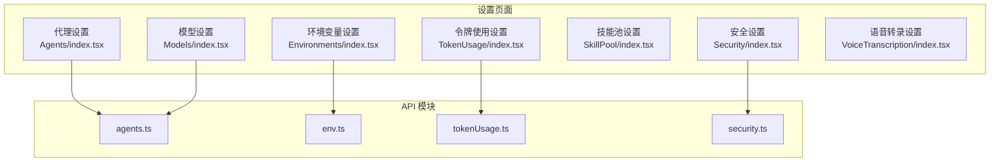
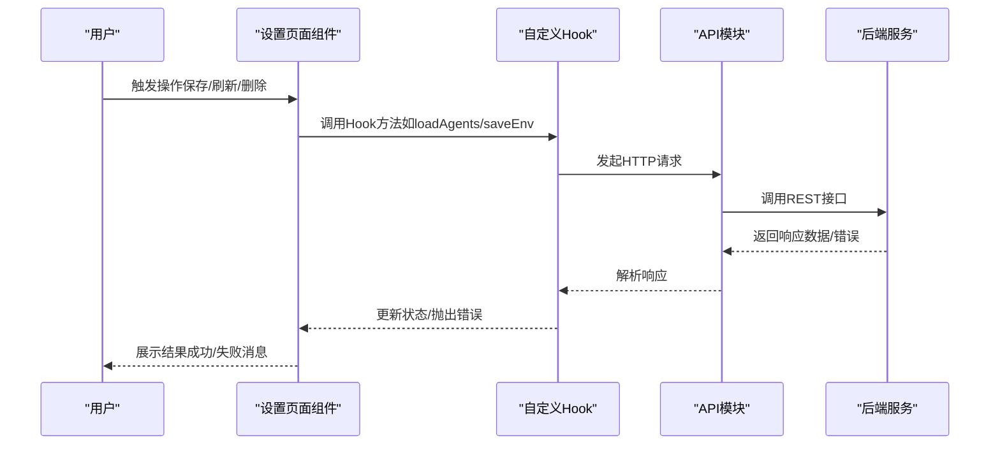
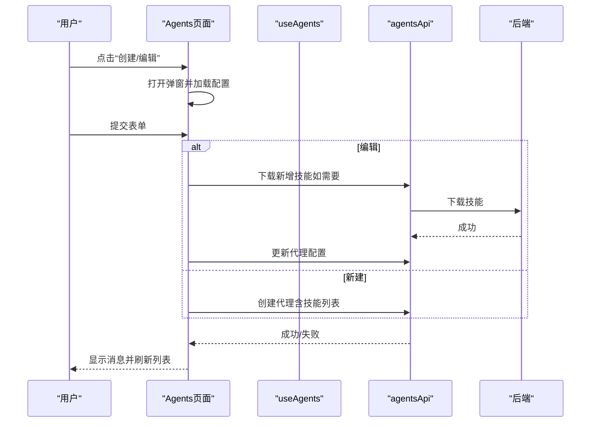
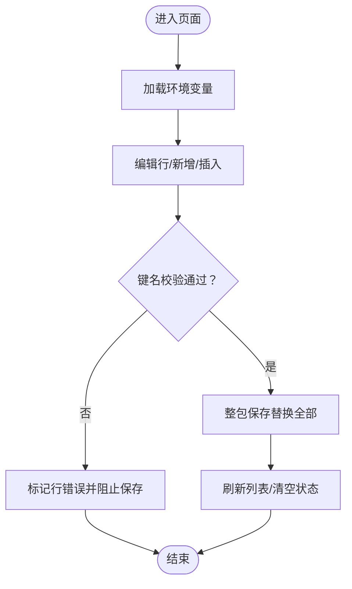
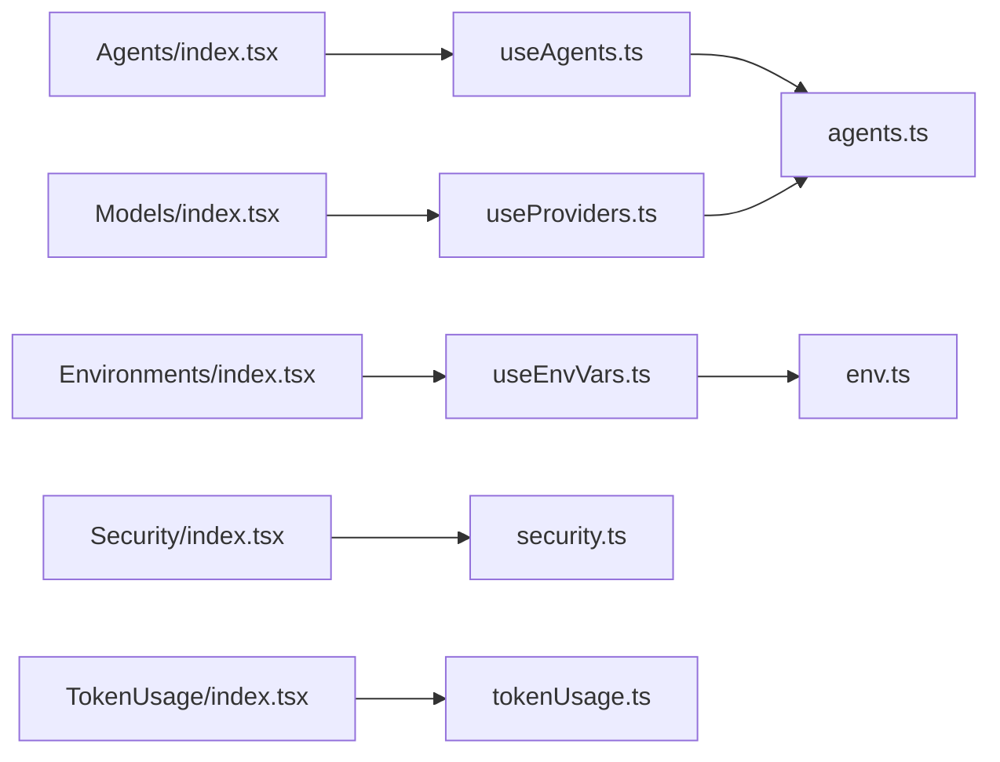

# 设置管理页面

<cite>
**本文引用的文件**
- [console/src/pages/Settings/Agents/index.tsx](file://console/src/pages/Settings/Agents/index.tsx)
- [console/src/pages/Settings/Agents/useAgents.ts](file://console/src/pages/Settings/Agents/useAgents.ts)
- [console/src/pages/Settings/Agents/reorder.ts](file://console/src/pages/Settings/Agents/reorder.ts)
- [console/src/pages/Settings/Environments/index.tsx](file://console/src/pages/Settings/Environments/index.tsx)
- [console/src/pages/Settings/Environments/useEnvVars.ts](file://console/src/pages/Settings/Environments/useEnvVars.ts)
- [console/src/api/modules/env.ts](file://console/src/api/modules/env.ts)
- [console/src/api/modules/agents.ts](file://console/src/api/modules/agents.ts)
- [console/src/pages/Settings/Models/index.tsx](file://console/src/pages/Settings/Models/index.tsx)
- [console/src/pages/Settings/Models/useProviders.ts](file://console/src/pages/Settings/Models/useProviders.ts)
- [console/src/pages/Settings/Security/index.tsx](file://console/src/pages/Settings/Security/index.tsx)
- [console/src/pages/Settings/SkillPool/index.tsx](file://console/src/pages/Settings/SkillPool/index.tsx)
- [console/src/pages/Settings/TokenUsage/index.tsx](file://console/src/pages/Settings/TokenUsage/index.tsx)
- [console/src/api/modules/tokenUsage.ts](file://console/src/api/modules/tokenUsage.ts)
- [console/src/pages/Settings/VoiceTranscription/index.tsx](file://console/src/pages/Settings/VoiceTranscription/index.tsx)
</cite>

## 目录
1. [简介](#简介)
2. [项目结构](#项目结构)
3. [核心组件](#核心组件)
4. [架构总览](#架构总览)
5. [详细组件分析](#详细组件分析)
6. [依赖分析](#依赖分析)
7. [性能考虑](#性能考虑)
8. [故障排查指南](#故障排查指南)
9. [结论](#结论)
10. [附录](#附录)

## 简介
本文件面向 QwenPaw 控制台“设置”管理页面，系统性梳理以下页面的前端实现与交互流程：代理设置（代理列表、排序、创建/删除）、环境变量设置（列表、增删改、批量管理）、模型设置（提供商管理、本地模型配置、测试连接与配置校验）、安全设置（工具守卫、技能扫描器、安全策略）、技能池设置（管理、导入导出、版本控制）、令牌使用设置（统计、限额与费用控制）、语音转录设置（配置、转录服务与音频处理）。文档同时给出数据流、错误处理、持久化与用户反馈机制的实现要点，并以图示方式呈现关键流程。

## 项目结构
设置页面位于控制台前端目录 console/src/pages/Settings 下，按功能划分为独立页面与通用模块：
- 代理设置：Agents 页面及其 Hook、排序工具
- 环境变量设置：Environments 页面及其 Hook
- 模型设置：Models 页面及其 Hook
- 安全设置：Security 页面
- 技能池设置：SkillPool 页面
- 令牌使用设置：TokenUsage 页面
- 语音转录设置：VoiceTranscription 页面

图表来源
- [console/src/pages/Settings/Agents/index.tsx:16-186](file://console/src/pages/Settings/Agents/index.tsx#L16-L186)
- [console/src/pages/Settings/Environments/index.tsx:30-326](file://console/src/pages/Settings/Environments/index.tsx#L30-L326)
- [console/src/pages/Settings/Models/index.tsx:20-152](file://console/src/pages/Settings/Models/index.tsx#L20-L152)
- [console/src/pages/Settings/Security/index.tsx:40-438](file://console/src/pages/Settings/Security/index.tsx#L40-L438)
- [console/src/pages/Settings/SkillPool/index.tsx:30-290](file://console/src/pages/Settings/SkillPool/index.tsx#L30-L290)
- [console/src/pages/Settings/TokenUsage/index.tsx:21-224](file://console/src/pages/Settings/TokenUsage/index.tsx#L21-L224)
- [console/src/pages/Settings/VoiceTranscription/index.tsx:22-288](file://console/src/pages/Settings/VoiceTranscription/index.tsx#L22-L288)
- [console/src/api/modules/agents.ts:12-79](file://console/src/api/modules/agents.ts#L12-L79)
- [console/src/api/modules/env.ts:4-19](file://console/src/api/modules/env.ts#L4-L19)
- [console/src/api/modules/tokenUsage.ts:17-21](file://console/src/api/modules/tokenUsage.ts#L17-L21)
- [console/src/api/modules/security.ts:77-149](file://console/src/api/modules/security.ts#L77-L149)

章节来源
- [console/src/pages/Settings/Agents/index.tsx:16-186](file://console/src/pages/Settings/Agents/index.tsx#L16-L186)
- [console/src/pages/Settings/Environments/index.tsx:30-326](file://console/src/pages/Settings/Environments/index.tsx#L30-L326)
- [console/src/pages/Settings/Models/index.tsx:20-152](file://console/src/pages/Settings/Models/index.tsx#L20-L152)
- [console/src/pages/Settings/Security/index.tsx:40-438](file://console/src/pages/Settings/Security/index.tsx#L40-L438)
- [console/src/pages/Settings/SkillPool/index.tsx:30-290](file://console/src/pages/Settings/SkillPool/index.tsx#L30-L290)
- [console/src/pages/Settings/TokenUsage/index.tsx:21-224](file://console/src/pages/Settings/TokenUsage/index.tsx#L21-L224)
- [console/src/pages/Settings/VoiceTranscription/index.tsx:22-288](file://console/src/pages/Settings/VoiceTranscription/index.tsx#L22-L288)

## 核心组件
- 代理设置页面：负责代理列表展示、启用/禁用切换、拖拽重排、创建/编辑弹窗、技能关联与保存。
- 环境变量页面：负责环境变量列表、新增/插入/删除行、批量选择与删除、键名格式校验、保存与重置。
- 模型设置页面：负责提供商分组与搜索、本地/常规提供商卡片、活动模型状态、自定义提供商弹窗。
- 安全设置页面：负责工具守卫开关与工具白/黑名单、规则表格与增删改预览、文件守卫与技能扫描器配置。
- 技能池页面：负责技能池列表/网格视图、筛选标签、批量操作、导入/广播/上传/内置导入、抽屉式编辑。
- 令牌使用页面：负责日期范围筛选、令牌统计汇总与按模型/按日统计表格。
- 语音转录页面：负责音频模式、转录提供商类型与可用提供商选择、本地 Whisper 状态提示与保存。

章节来源
- [console/src/pages/Settings/Agents/index.tsx:16-186](file://console/src/pages/Settings/Agents/index.tsx#L16-L186)
- [console/src/pages/Settings/Environments/index.tsx:30-326](file://console/src/pages/Settings/Environments/index.tsx#L30-L326)
- [console/src/pages/Settings/Models/index.tsx:20-152](file://console/src/pages/Settings/Models/index.tsx#L20-L152)
- [console/src/pages/Settings/Security/index.tsx:40-438](file://console/src/pages/Settings/Security/index.tsx#L40-L438)
- [console/src/pages/Settings/SkillPool/index.tsx:30-290](file://console/src/pages/Settings/SkillPool/index.tsx#L30-L290)
- [console/src/pages/Settings/TokenUsage/index.tsx:21-224](file://console/src/pages/Settings/TokenUsage/index.tsx#L21-L224)
- [console/src/pages/Settings/VoiceTranscription/index.tsx:22-288](file://console/src/pages/Settings/VoiceTranscription/index.tsx#L22-L288)

## 架构总览
设置页面整体采用“页面组件 + 自定义 Hook + API 模块”的分层设计：
- 页面组件：负责布局、交互与用户反馈（消息提示、加载态、确认对话框）。
- 自定义 Hook：封装数据拉取、状态管理与业务逻辑（如 useAgents、useEnvVars、useProviders）。
- API 模块：统一请求封装，暴露 CRUD 与查询接口。

图表来源
- [console/src/pages/Settings/Agents/index.tsx:18-119](file://console/src/pages/Settings/Agents/index.tsx#L18-L119)
- [console/src/pages/Settings/Environments/index.tsx:230-251](file://console/src/pages/Settings/Environments/index.tsx#L230-L251)
- [console/src/pages/Settings/Models/index.tsx:60-80](file://console/src/pages/Settings/Models/index.tsx#L60-L80)
- [console/src/pages/Settings/Security/index.tsx:89-115](file://console/src/pages/Settings/Security/index.tsx#L89-L115)
- [console/src/pages/Settings/TokenUsage/index.tsx:32-50](file://console/src/pages/Settings/TokenUsage/index.tsx#L32-L50)
- [console/src/pages/Settings/VoiceTranscription/index.tsx:34-78](file://console/src/pages/Settings/VoiceTranscription/index.tsx#L34-L78)
- [console/src/api/modules/agents.ts:12-79](file://console/src/api/modules/agents.ts#L12-L79)
- [console/src/api/modules/env.ts:4-19](file://console/src/api/modules/env.ts#L4-L19)
- [console/src/api/modules/tokenUsage.ts:17-21](file://console/src/api/modules/tokenUsage.ts#L17-L21)
- [console/src/api/modules/security.ts:77-149](file://console/src/api/modules/security.ts#L77-L149)

## 详细组件分析

### 代理设置页面
- 列表管理：通过 Hook 加载代理列表，支持启用/禁用切换与删除；删除后若当前选中代理被删除则自动切回默认代理。
- 排序：拖拽排序在前端即时更新显示顺序，提交时调用后端接口持久化顺序。
- 创建/编辑：打开弹窗，读取已有配置或清空表单；保存时根据是否编辑区分创建或更新，必要时先下载新技能再更新代理配置。
- 用户反馈：统一使用消息提示组件反馈成功/失败信息。

图表来源
- [console/src/pages/Settings/Agents/index.tsx:29-119](file://console/src/pages/Settings/Agents/index.tsx#L29-L119)
- [console/src/pages/Settings/Agents/useAgents.ts:31-71](file://console/src/pages/Settings/Agents/useAgents.ts#L31-L71)
- [console/src/api/modules/agents.ts:12-55](file://console/src/api/modules/agents.ts#L12-L55)

章节来源
- [console/src/pages/Settings/Agents/index.tsx:16-186](file://console/src/pages/Settings/Agents/index.tsx#L16-L186)
- [console/src/pages/Settings/Agents/useAgents.ts:18-86](file://console/src/pages/Settings/Agents/useAgents.ts#L18-L86)
- [console/src/pages/Settings/Agents/reorder.ts:3-23](file://console/src/pages/Settings/Agents/reorder.ts#L3-L23)
- [console/src/api/modules/agents.ts:12-79](file://console/src/api/modules/agents.ts#L12-L79)

### 环境变量设置页面
- 列表与行操作：支持新增、插入、删除行；对已持久化的行删除前进行二次确认；支持全选/反选与批量删除。
- 键名校验：非空、符合标识符格式、去重；错误按行高亮提示。
- 保存策略：将本地变更合并为字典后进行整包替换保存；保存后刷新列表并清空选择与错误。
- 用户反馈：加载、错误、重试、保存成功/失败等状态明确提示。

图表来源
- [console/src/pages/Settings/Environments/index.tsx:212-251](file://console/src/pages/Settings/Environments/index.tsx#L212-L251)
- [console/src/pages/Settings/Environments/useEnvVars.ts:10-26](file://console/src/pages/Settings/Environments/useEnvVars.ts#L10-L26)
- [console/src/api/modules/env.ts:4-18](file://console/src/api/modules/env.ts#L4-L18)

章节来源
- [console/src/pages/Settings/Environments/index.tsx:30-326](file://console/src/pages/Settings/Environments/index.tsx#L30-L326)
- [console/src/pages/Settings/Environments/useEnvVars.ts:5-33](file://console/src/pages/Settings/Environments/useEnvVars.ts#L5-L33)
- [console/src/api/modules/env.ts:4-19](file://console/src/api/modules/env.ts#L4-L19)

### 模型设置页面
- 提供商分组：区分本地与常规提供商，支持名称模糊搜索过滤。
- 活动模型：全局活动模型状态用于指示当前生效的模型集合。
- 自定义提供商：通过弹窗添加自定义提供商，保存后静默刷新列表。
- 用户反馈：加载态、错误态与重试按钮，提升可恢复性。

章节来源
- [console/src/pages/Settings/Models/index.tsx:20-152](file://console/src/pages/Settings/Models/index.tsx#L20-L152)
- [console/src/pages/Settings/Models/useProviders.ts:6-55](file://console/src/pages/Settings/Models/useProviders.ts#L6-L55)

### 安全设置页面
- 工具守卫：支持开启/关闭、受保护工具与禁止工具的标签选择；规则表格支持启用/禁用、预览、编辑、删除自定义规则。
- 文件守卫：通过回调注入保存/重置函数，实现子组件与父组件的状态联动。
- 技能扫描器：支持扫描模式、超时与白名单管理，提供阻断历史查看与清理能力。
- 配置持久化：统一构建保存体，调用后端接口写入配置。

章节来源
- [console/src/pages/Settings/Security/index.tsx:40-438](file://console/src/pages/Settings/Security/index.tsx#L40-L438)
- [console/src/api/modules/security.ts:77-149](file://console/src/api/modules/security.ts#L77-L149)

### 技能池设置页面
- 视图与筛选：网格/列表视图切换，多选标签筛选；支持刷新、广播、导入内置、上传 ZIP、导入 Hub、批量操作与抽屉式编辑。
- 批量管理：批量选择、全选、清空、批量删除；导入/广播流程通过模态框驱动。
- 版本控制：导入/广播涉及目标工作区与技能名称，结合冲突重命名提示。

章节来源
- [console/src/pages/Settings/SkillPool/index.tsx:30-290](file://console/src/pages/Settings/SkillPool/index.tsx#L30-L290)

### 令牌使用设置页面
- 时间范围：默认近 30 天，支持调整起止日期并刷新。
- 统计展示：总提示词/补全令牌与调用次数卡片，按模型与按日期的明细表格。
- 数据获取：通过 API 拉取指定日期范围内的统计摘要。

章节来源
- [console/src/pages/Settings/TokenUsage/index.tsx:21-224](file://console/src/pages/Settings/TokenUsage/index.tsx#L21-L224)
- [console/src/api/modules/tokenUsage.ts:17-21](file://console/src/api/modules/tokenUsage.ts#L17-L21)

### 语音转录设置页面
- 音频模式：自动/原生两种模式；原生模式下检查本地 Whisper 依赖状态。
- 提供商类型：禁用、Whisper API、本地 Whisper 三种；Whisper API 需选择可用提供商。
- 保存策略：并发更新音频模式与提供商类型，必要时更新配置提供商 ID。
- 用户反馈：加载态、错误提示、保存成功/失败消息。

章节来源
- [console/src/pages/Settings/VoiceTranscription/index.tsx:22-288](file://console/src/pages/Settings/VoiceTranscription/index.tsx#L22-L288)

## 依赖分析
- 页面到 Hook：各页面通过自定义 Hook 封装数据与副作用，降低页面复杂度。
- Hook 到 API：API 模块集中封装请求，统一错误处理与返回值类型。
- 组件到样式：页面引入对应 less 模块，保证样式隔离与主题适配。
- 组件到国际化：页面与组件均使用翻译钩子，确保文案本地化。

图表来源
- [console/src/pages/Settings/Agents/index.tsx:16-186](file://console/src/pages/Settings/Agents/index.tsx#L16-L186)
- [console/src/pages/Settings/Agents/useAgents.ts:18-86](file://console/src/pages/Settings/Agents/useAgents.ts#L18-L86)
- [console/src/pages/Settings/Environments/index.tsx:30-326](file://console/src/pages/Settings/Environments/index.tsx#L30-L326)
- [console/src/pages/Settings/Environments/useEnvVars.ts:5-33](file://console/src/pages/Settings/Environments/useEnvVars.ts#L5-L33)
- [console/src/pages/Settings/Models/index.tsx:20-152](file://console/src/pages/Settings/Models/index.tsx#L20-L152)
- [console/src/pages/Settings/Models/useProviders.ts:6-55](file://console/src/pages/Settings/Models/useProviders.ts#L6-L55)
- [console/src/pages/Settings/Security/index.tsx:40-438](file://console/src/pages/Settings/Security/index.tsx#L40-L438)
- [console/src/pages/Settings/TokenUsage/index.tsx:21-224](file://console/src/pages/Settings/TokenUsage/index.tsx#L21-L224)
- [console/src/api/modules/agents.ts:12-79](file://console/src/api/modules/agents.ts#L12-L79)
- [console/src/api/modules/env.ts:4-19](file://console/src/api/modules/env.ts#L4-L19)
- [console/src/api/modules/tokenUsage.ts:17-21](file://console/src/api/modules/tokenUsage.ts#L17-L21)
- [console/src/api/modules/security.ts:77-149](file://console/src/api/modules/security.ts#L77-L149)

## 性能考虑
- 列表渲染：技能池页面采用渐进渲染 Hook，避免大数据量下的首屏卡顿。
- 并发请求：环境变量保存与语音转录保存采用 Promise.all 并发，减少往返延迟。
- 搜索与过滤：模型提供商支持前端模糊匹配，降低无效网络请求。
- 加载与错误：各页面提供加载态与错误态，配合重试按钮提升用户体验。

## 故障排查指南
- 代理保存失败：检查表单校验与技能下载流程，关注消息提示与异常堆栈。
- 环境变量保存失败：确认键名格式与唯一性，查看行级错误提示；必要时重试或回滚。
- 模型提供商加载失败：检查后端基础地址配置与网络连通性。
- 安全策略保存失败：核对规则 ID 唯一性与必填字段，查看表单验证错误定位。
- 令牌使用无数据：确认日期范围与后端数据生成情况。
- 语音转录保存失败：检查本地 Whisper 依赖状态与提供商可用性。

章节来源
- [console/src/pages/Settings/Agents/index.tsx:115-119](file://console/src/pages/Settings/Agents/index.tsx#L115-L119)
- [console/src/pages/Settings/Environments/index.tsx:244-251](file://console/src/pages/Settings/Environments/index.tsx#L244-L251)
- [console/src/pages/Settings/Security/index.tsx:105-115](file://console/src/pages/Settings/Security/index.tsx#L105-L115)
- [console/src/pages/Settings/TokenUsage/index.tsx:42-47](file://console/src/pages/Settings/TokenUsage/index.tsx#L42-L47)
- [console/src/pages/Settings/VoiceTranscription/index.tsx:72-78](file://console/src/pages/Settings/VoiceTranscription/index.tsx#L72-L78)

## 结论
设置管理页面通过清晰的分层设计与完善的用户反馈机制，覆盖了代理、环境变量、模型、安全、技能池、令牌使用与语音转录等关键配置场景。页面组件专注于交互与展示，自定义 Hook 负责状态与业务逻辑，API 模块统一处理请求与错误，形成高内聚低耦合的体系。建议在后续迭代中进一步完善配置校验规则与批量操作的原子性保障，持续优化大列表渲染性能与错误恢复体验。

## 附录
- 国际化与主题：页面普遍使用翻译钩子与主题切换组件，确保多语言与主题一致性。
- 样式组织：页面引入对应的 less 模块，便于维护与主题扩展。
- 可访问性：各页面提供加载、错误与重试状态，提升可恢复性与可访问性。