# 语音转录设置

<cite>
**本文档引用的文件**
- [audio_transcription.py](file://src/qwenpaw/agents/utils/audio_transcription.py)
- [index.tsx](file://console/src/pages/Settings/VoiceTranscription/index.tsx)
- [index.module.less](file://console/src/pages/Settings/VoiceTranscription/index.module.less)
- [agent.ts](file://console/src/api/modules/agent.ts)
- [voice.py](file://src/qwenpaw/app/routers/voice.py)
- [agent.py](file://src/qwenpaw/app/routers/agent.py)
- [config.py](file://src/qwenpaw/config/config.py)
- [message_processing.py](file://src/qwenpaw/agents/utils/message_processing.py)
- [zh.json](file://console/src/locales/zh.json)
</cite>

## 目录
1. [简介](#简介)
2. [项目结构](#项目结构)
3. [核心组件](#核心组件)
4. [架构概览](#架构概览)
5. [详细组件分析](#详细组件分析)
6. [依赖关系分析](#依赖关系分析)
7. [性能考虑](#性能考虑)
8. [故障排除指南](#故障排除指南)
9. [结论](#结论)
10. [附录](#附录)

## 简介
本文件为 QwenPaw 语音转录设置页面的技术文档，深入解释语音转录配置的实现机制，包括转录引擎选择、语言设置和质量参数配置。文档涵盖语音服务的设置选项（API 密钥配置、服务提供商选择和连接测试）、音频处理功能（格式转换、采样率设置和噪声抑制）、准确性优化（方言支持、口音识别和上下文理解），以及隐私保护措施（数据加密和本地处理选项）。同时提供语音转录设置页面的用户界面设计、实时预览和故障诊断的具体实现示例。

## 项目结构
语音转录设置功能涉及前端页面、API 接口、后端路由和音频处理工具等多个层次：

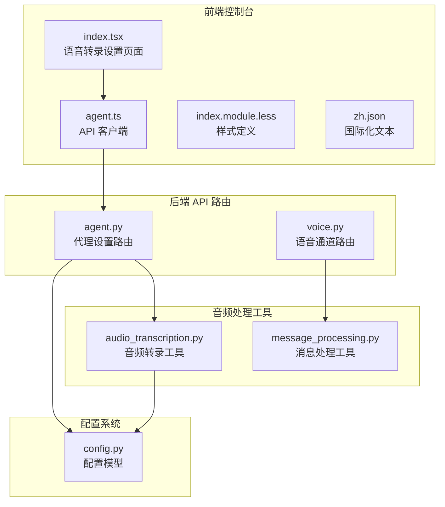

**图表来源**
- [index.tsx:1-288](file://console/src/pages/Settings/VoiceTranscription/index.tsx#L1-L288)
- [agent.ts:1-86](file://console/src/api/modules/agent.ts#L1-L86)
- [agent.py:320-505](file://src/qwenpaw/app/routers/agent.py#L320-L505)
- [audio_transcription.py:1-318](file://src/qwenpaw/agents/utils/audio_transcription.py#L1-L318)
- [config.py:749-788](file://src/qwenpaw/config/config.py#L749-L788)

**章节来源**
- [index.tsx:1-288](file://console/src/pages/Settings/VoiceTranscription/index.tsx#L1-L288)
- [agent.ts:1-86](file://console/src/api/modules/agent.ts#L1-L86)
- [agent.py:320-505](file://src/qwenpaw/app/routers/agent.py#L320-L505)

## 核心组件
语音转录设置系统由以下核心组件构成：

### 前端设置页面
- **VoiceTranscriptionPage 组件**：提供语音转录配置的用户界面
- **状态管理**：音频模式、转录提供者类型、提供商选择等
- **实时预览**：根据配置动态显示可用性状态

### 后端 API 路由
- **转录提供者路由**：获取/设置转录提供者类型和配置
- **本地 Whisper 状态检查**：验证本地依赖可用性
- **提供商列表管理**：动态获取可用的转录服务提供商

### 音频处理工具
- **转录引擎**：支持本地 Whisper 和远程 Whisper API
- **音频格式转换**：FFmpeg 驱动的格式转换和采样率调整
- **缓存机制**：本地 Whisper 模型的懒加载和缓存

**章节来源**
- [audio_transcription.py:27-38](file://src/qwenpaw/agents/utils/audio_transcription.py#L27-L38)
- [config.py:749-788](file://src/qwenpaw/config/config.py#L749-L788)

## 架构概览
语音转录设置的完整架构流程如下：

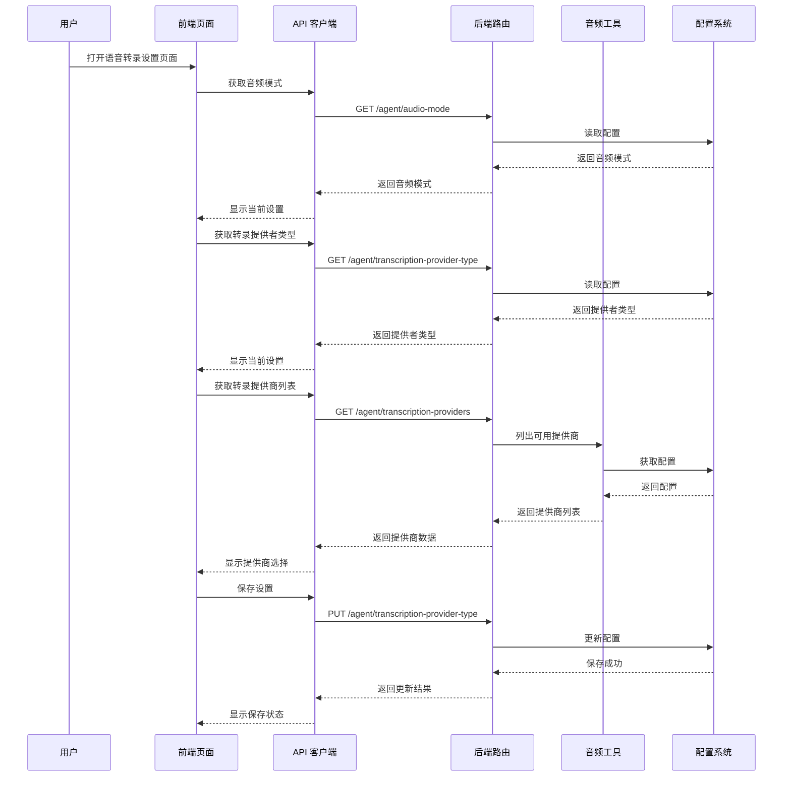

**图表来源**
- [index.tsx:34-78](file://console/src/pages/Settings/VoiceTranscription/index.tsx#L34-L78)
- [agent.ts:45-85](file://console/src/api/modules/agent.ts#L45-L85)
- [agent.py:327-361](file://src/qwenpaw/app/routers/agent.py#L327-L361)

## 详细组件分析

### 前端设置页面组件分析

#### 页面状态管理
页面使用 React Hooks 管理关键状态：
- `audioMode`：音频处理模式（auto/native）
- `providerType`：转录提供者类型（disabled/whisper_api/local_whisper）
- `providers`：可用的转录提供商列表
- `selectedProviderId`：当前选中的提供商
- `localWhisperStatus`：本地 Whisper 可用性状态

#### 实时预览机制
页面实现了完整的实时预览功能：

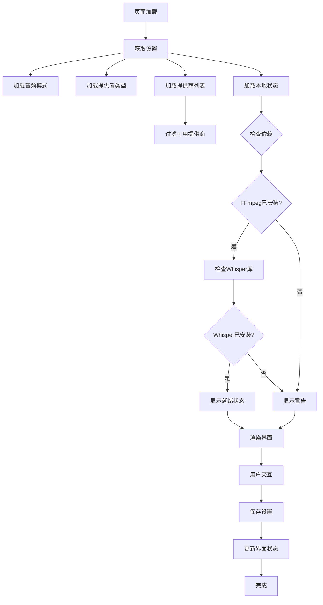

**图表来源**
- [index.tsx:34-78](file://console/src/pages/Settings/VoiceTranscription/index.tsx#L34-L78)
- [index.tsx:145-162](file://console/src/pages/Settings/VoiceTranscription/index.tsx#L145-L162)

#### 用户界面设计
页面采用卡片式布局，提供清晰的配置选项：

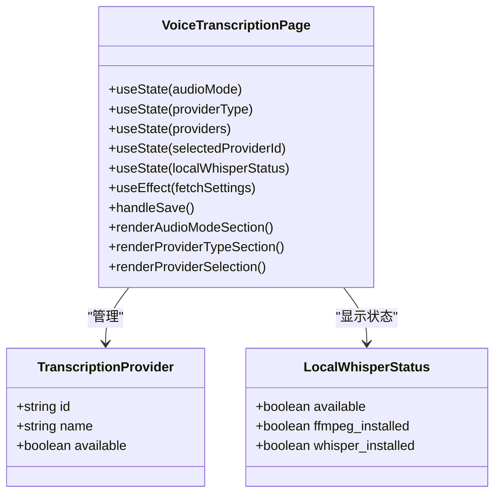

**图表来源**
- [index.tsx:10-32](file://console/src/pages/Settings/VoiceTranscription/index.tsx#L10-L32)

**章节来源**
- [index.tsx:22-288](file://console/src/pages/Settings/VoiceTranscription/index.tsx#L22-L288)
- [index.module.less:1-117](file://console/src/pages/Settings/VoiceTranscription/index.module.less#L1-L117)

### 后端 API 路由组件分析

#### 转录提供者管理
后端提供了完整的转录提供者管理接口：

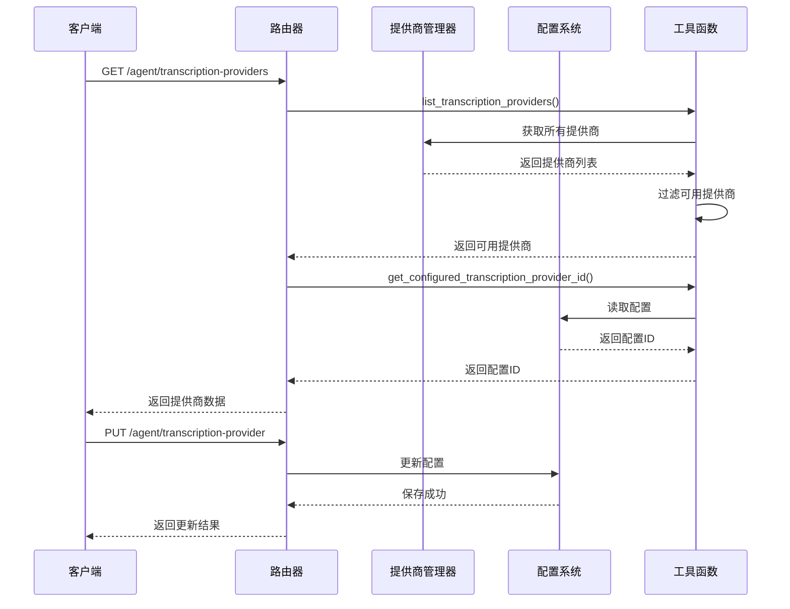

**图表来源**
- [agent.py:381-425](file://src/qwenpaw/app/routers/agent.py#L381-L425)
- [audio_transcription.py:87-120](file://src/qwenpaw/agents/utils/audio_transcription.py#L87-L120)

#### 本地 Whisper 状态检查
系统提供了详细的本地依赖检查功能：

```mermaid
flowchart TD
CheckLocalWhisper[check_local_whisper_available] --> CheckFFmpeg[检查FFmpeg]
CheckFFmpeg --> FFmpegOK{FFmpeg可用?}
FFmpegOK --> |否| FFmpegFail[标记FFmpeg缺失]
FFmpegOK --> |是| CheckWhisper[检查Whisper库]
CheckWhisper --> WhisperOK{Whisper可用?}
WhisperOK --> |否| WhisperFail[标记Whisper缺失]
WhisperOK --> |是| Success[标记可用]
FFmpegFail --> ReturnStatus[返回状态]
WhisperFail --> ReturnStatus
Success --> ReturnStatus
ReturnStatus --> StatusObject[{"available": boolean, "ffmpeg_installed": boolean, "whisper_installed": boolean}]
```

**图表来源**
- [audio_transcription.py:122-147](file://src/qwenpaw/agents/utils/audio_transcription.py#L122-L147)

**章节来源**
- [agent.py:327-425](file://src/qwenpaw/app/routers/agent.py#L327-L425)
- [audio_transcription.py:122-147](file://src/qwenpaw/agents/utils/audio_transcription.py#L122-L147)

### 音频处理组件分析

#### 转录引擎实现
系统支持两种转录引擎：

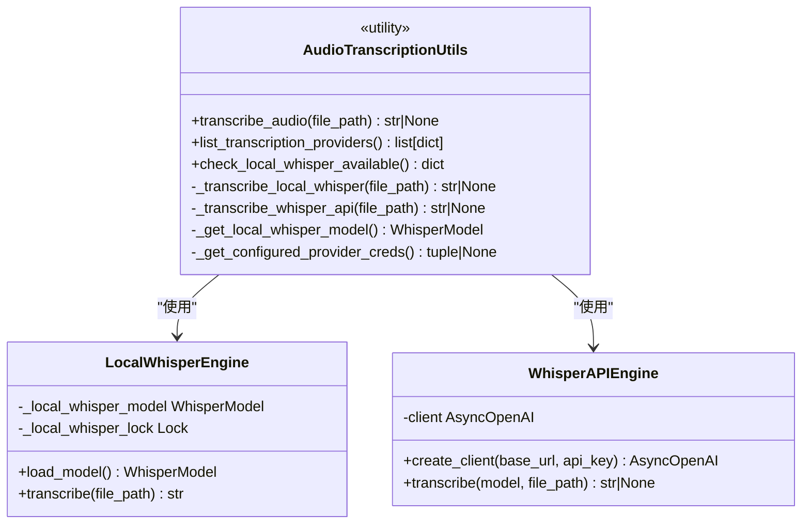

**图表来源**
- [audio_transcription.py:155-201](file://src/qwenpaw/agents/utils/audio_transcription.py#L155-L201)
- [audio_transcription.py:236-288](file://src/qwenpaw/agents/utils/audio_transcription.py#L236-L288)

#### 音频格式转换
系统提供了完整的音频格式转换功能：

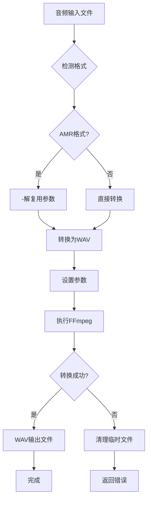

**图表来源**
- [message_processing.py:154-192](file://src/qwenpaw/agents/utils/message_processing.py#L154-L192)

**章节来源**
- [audio_transcription.py:155-318](file://src/qwenpaw/agents/utils/audio_transcription.py#L155-L318)
- [message_processing.py:154-192](file://src/qwenpaw/agents/utils/message_processing.py#L154-L192)

## 依赖关系分析

### 组件耦合关系
语音转录设置系统展现了良好的分层架构：

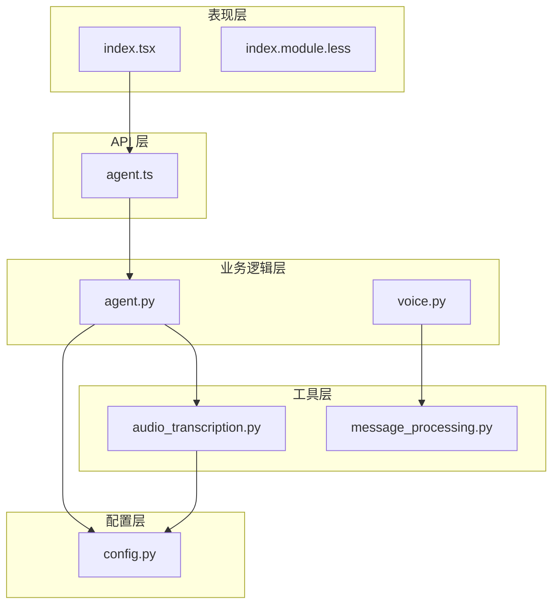

**图表来源**
- [index.tsx:1-8](file://console/src/pages/Settings/VoiceTranscription/index.tsx#L1-L8)
- [agent.ts:1-86](file://console/src/api/modules/agent.ts#L1-L86)
- [agent.py:320-505](file://src/qwenpaw/app/routers/agent.py#L320-L505)

### 外部依赖管理
系统对外部依赖有完善的管理机制：

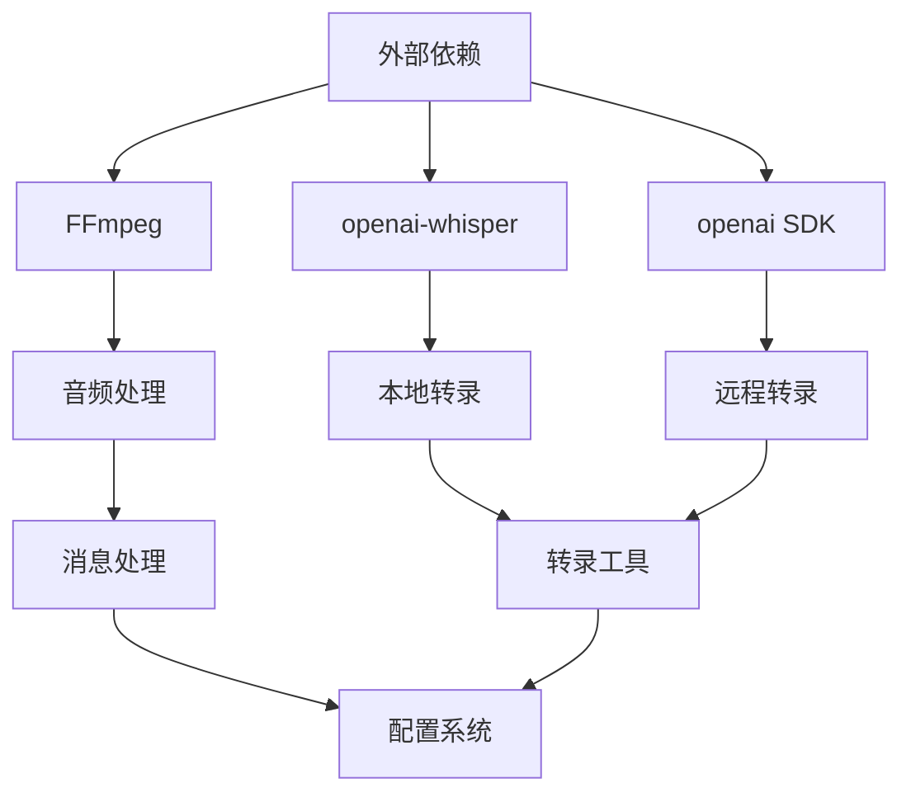

**图表来源**
- [audio_transcription.py:133-147](file://src/qwenpaw/agents/utils/audio_transcription.py#L133-L147)
- [message_processing.py:154-176](file://src/qwenpaw/agents/utils/message_processing.py#L154-L176)

**章节来源**
- [audio_transcription.py:133-147](file://src/qwenpaw/agents/utils/audio_transcription.py#L133-L147)
- [config.py:749-788](file://src/qwenpaw/config/config.py#L749-L788)

## 性能考虑
语音转录设置系统在性能方面采用了多项优化策略：

### 异步处理
- **异步转录**：使用 `asyncio.to_thread` 在独立线程中执行 Whisper 转录
- **并发请求**：前端使用 `Promise.all` 并行获取多个设置值
- **非阻塞操作**：避免阻塞主线程，提升用户体验

### 缓存机制
- **模型缓存**：本地 Whisper 模型采用懒加载和全局缓存
- **锁机制**：使用线程锁确保模型加载的线程安全性
- **内存管理**：合理管理模型生命周期，避免内存泄漏

### 依赖检查
- **预检查机制**：在执行转录前检查所有依赖是否可用
- **降级策略**：当依赖缺失时提供友好的错误提示
- **状态反馈**：实时显示依赖状态，帮助用户诊断问题

## 故障排除指南

### 常见问题诊断
系统提供了完善的故障诊断功能：

#### 本地 Whisper 问题
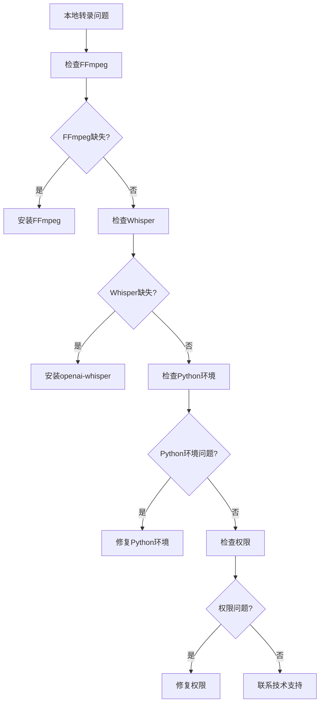

#### 远程转录问题
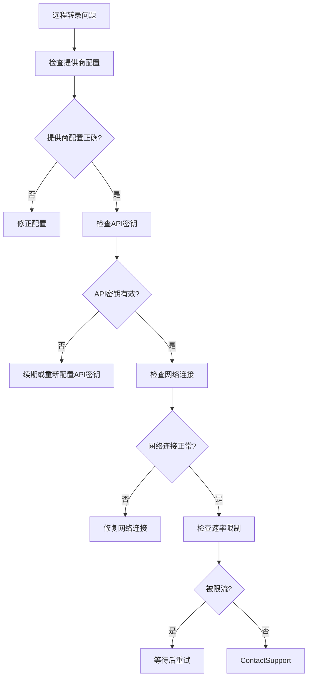

**章节来源**
- [index.tsx:145-233](file://console/src/pages/Settings/VoiceTranscription/index.tsx#L145-L233)
- [audio_transcription.py:161-200](file://src/qwenpaw/agents/utils/audio_transcription.py#L161-L200)

## 结论
QwenPaw 的语音转录设置系统展现了优秀的架构设计和实现质量。系统通过清晰的分层架构、完善的错误处理机制和友好的用户界面，为用户提供了灵活且可靠的语音转录配置体验。前端页面提供了直观的配置界面和实时预览功能，后端路由实现了完整的 API 支持，音频处理工具则确保了高效的转录性能。

系统的可扩展性设计允许未来添加更多转录引擎和提供商，同时保持现有功能的稳定性。通过合理的依赖管理和缓存机制，系统在保证性能的同时也提升了用户体验。

## 附录

### 配置选项参考
系统支持的主要配置选项包括：

| 配置项 | 类型 | 默认值 | 描述 |
|--------|------|--------|------|
| audio_mode | enum | "auto" | 音频处理模式：auto/native |
| transcription_provider_type | enum | "disabled" | 转录提供者类型：disabled/whisper_api/local_whisper |
| transcription_provider_id | string | "" | 远程转录提供商ID |
| transcription_model | string | "whisper-1" | Whisper模型名称 |

### 国际化支持
系统支持多语言界面，包括：
- 中文 (zh)
- 英语 (en) 
- 日语 (ja)
- 俄语 (ru)

**章节来源**
- [config.py:749-788](file://src/qwenpaw/config/config.py#L749-L788)
- [zh.json:1331-1367](file://console/src/locales/zh.json#L1331-L1367)