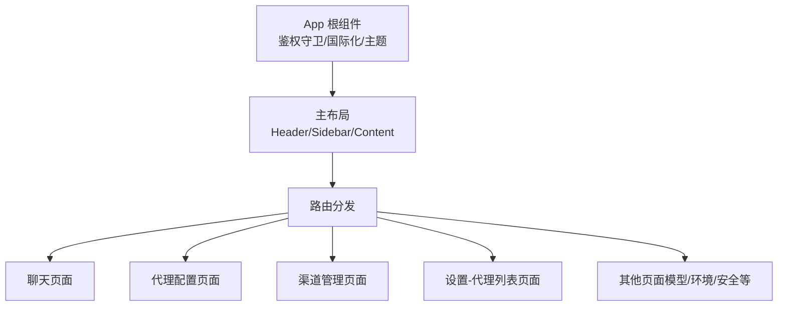
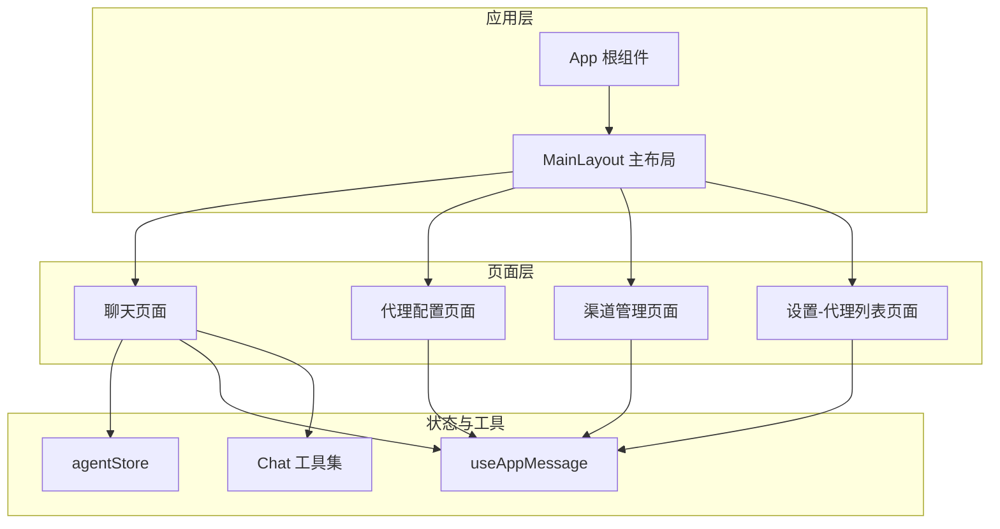
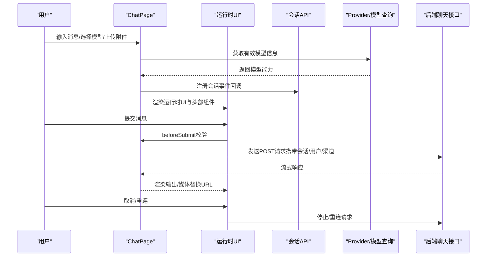
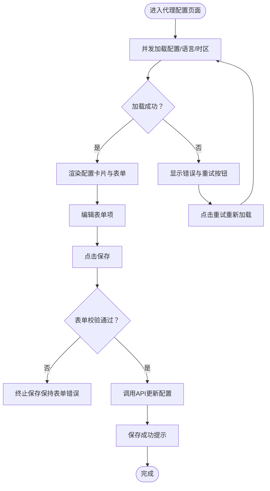
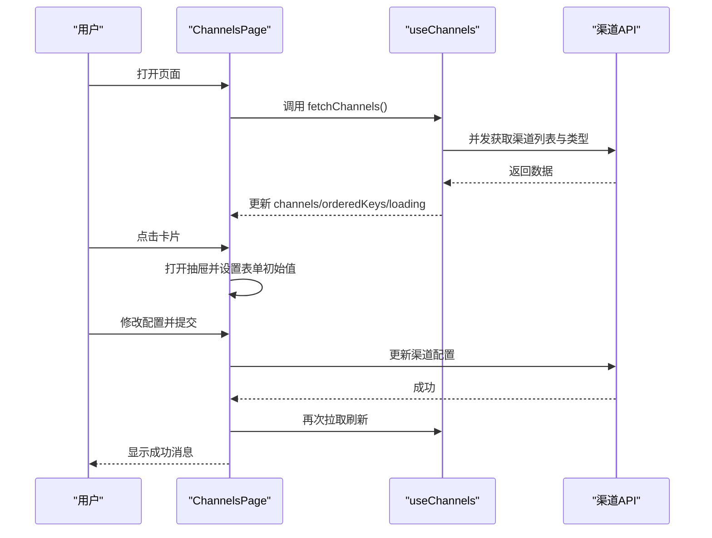
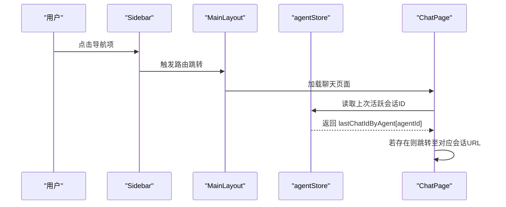
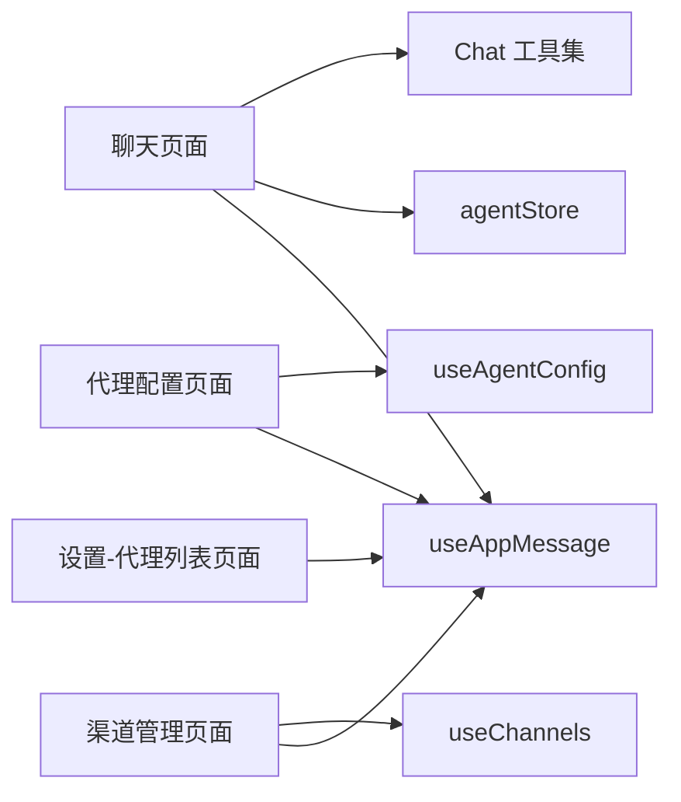

# 页面组件

<cite>
**本文引用的文件**
- [console/src/App.tsx](file://console/src/App.tsx)
- [console/src/layouts/MainLayout/index.tsx](file://console/src/layouts/MainLayout/index.tsx)
- [console/src/pages/Chat/index.tsx](file://console/src/pages/Chat/index.tsx)
- [console/src/pages/Chat/utils.ts](file://console/src/pages/Chat/utils.ts)
- [console/src/pages/Chat/components/ChatSessionInitializer/index.tsx](file://console/src/pages/Chat/components/ChatSessionInitializer/index.tsx)
- [console/src/pages/Agent/Config/index.tsx](file://console/src/pages/Agent/Config/index.tsx)
- [console/src/pages/Agent/Config/useAgentConfig.tsx](file://console/src/pages/Agent/Config/useAgentConfig.tsx)
- [console/src/pages/Control/Channels/index.tsx](file://console/src/pages/Control/Channels/index.tsx)
- [console/src/pages/Control/Channels/useChannels.ts](file://console/src/pages/Control/Channels/useChannels.ts)
- [console/src/pages/Settings/Agents/index.tsx](file://console/src/pages/Settings/Agents/index.tsx)
- [console/src/stores/agentStore.ts](file://console/src/stores/agentStore.ts)
- [console/src/hooks/useAppMessage.ts](file://console/src/hooks/useAppMessage.ts)
</cite>

## 目录
1. [简介](#简介)
2. [项目结构](#项目结构)
3. [核心组件](#核心组件)
4. [架构总览](#架构总览)
5. [详细组件分析](#详细组件分析)
6. [依赖分析](#依赖分析)
7. [性能考量](#性能考量)
8. [故障排查指南](#故障排查指南)
9. [结论](#结论)
10. [附录](#附录)

## 简介
本文件面向QwenPaw控制台前端页面组件，系统化梳理以下页面的实现架构与交互：代理配置页面、聊天页面、渠道管理页面、设置页面（代理列表）。内容涵盖功能职责、组件层次、数据流、页面间导航与状态传递、页面级状态管理（表单、加载、错误）、通用组件复用与组合模式、响应式与移动端适配策略，以及性能优化、用户体验与可维护性最佳实践。

## 项目结构
控制台采用路由驱动的布局结构：应用根组件负责国际化、主题与鉴权守卫；主布局负责侧边栏、头部与页面容器；各页面按需懒加载并以路由分发到对应页面组件。

图表来源
- [console/src/App.tsx:110-184](file://console/src/App.tsx#L110-L184)
- [console/src/layouts/MainLayout/index.tsx:75-128](file://console/src/layouts/MainLayout/index.tsx#L75-L128)

章节来源
- [console/src/App.tsx:1-196](file://console/src/App.tsx#L1-L196)
- [console/src/layouts/MainLayout/index.tsx:1-129](file://console/src/layouts/MainLayout/index.tsx#L1-L129)

## 核心组件
- 应用与布局
  - App：全局配置、国际化语言切换、主题算法切换、鉴权守卫、路由基础路径。
  - MainLayout：侧边栏导航、头部、页面容器、路由分发、错误边界与懒加载。
- 页面级组件
  - 聊天页面：集成运行时UI、会话API、多模态能力检测、输入建议、附件上传、命令提示、取消/重连。
  - 代理配置页面：运行时配置表单、语言与时区变更、保存与重试。
  - 渠道管理页面：内置/自定义过滤、卡片排序、抽屉编辑、保存与消息反馈。
  - 设置-代理列表页面：代理增删改启停、技能关联、拖拽重排、持久化存储。
- 状态与工具
  - agentStore：Zustand 持久化存储，记录当前选中代理与各代理上次活跃会话ID。
  - useAppMessage：从Ant Design App上下文获取消息实例，确保与前缀一致。
  - Chat 工具集：复制文本、消息解析、URL归一化、DOM操作桥接。

章节来源
- [console/src/App.tsx:110-184](file://console/src/App.tsx#L110-L184)
- [console/src/layouts/MainLayout/index.tsx:75-128](file://console/src/layouts/MainLayout/index.tsx#L75-L128)
- [console/src/pages/Chat/index.tsx:400-894](file://console/src/pages/Chat/index.tsx#L400-L894)
- [console/src/pages/Agent/Config/index.tsx:16-106](file://console/src/pages/Agent/Config/index.tsx#L16-L106)
- [console/src/pages/Agent/Config/useAgentConfig.tsx:8-138](file://console/src/pages/Agent/Config/useAgentConfig.tsx#L8-L138)
- [console/src/pages/Control/Channels/index.tsx:18-164](file://console/src/pages/Control/Channels/index.tsx#L18-L164)
- [console/src/pages/Control/Channels/useChannels.ts:5-73](file://console/src/pages/Control/Channels/useChannels.ts#L5-L73)
- [console/src/pages/Settings/Agents/index.tsx:16-186](file://console/src/pages/Settings/Agents/index.tsx#L16-L186)
- [console/src/stores/agentStore.ts:19-89](file://console/src/stores/agentStore.ts#L19-L89)
- [console/src/hooks/useAppMessage.ts:12-16](file://console/src/hooks/useAppMessage.ts#L12-L16)
- [console/src/pages/Chat/utils.ts:1-208](file://console/src/pages/Chat/utils.ts#L1-L208)

## 架构总览
页面间通过路由进行导航，主布局统一承载侧边栏与内容区域。聊天页面作为默认入口，其余页面按需懒加载并具备错误边界与重试机制。页面内部通过自定义Hook与外部API模块解耦，形成清晰的数据流与状态管理。

图表来源
- [console/src/App.tsx:110-184](file://console/src/App.tsx#L110-L184)
- [console/src/layouts/MainLayout/index.tsx:75-128](file://console/src/layouts/MainLayout/index.tsx#L75-L128)
- [console/src/pages/Chat/index.tsx:400-894](file://console/src/pages/Chat/index.tsx#L400-L894)
- [console/src/pages/Agent/Config/index.tsx:16-106](file://console/src/pages/Agent/Config/index.tsx#L16-L106)
- [console/src/pages/Control/Channels/index.tsx:18-164](file://console/src/pages/Control/Channels/index.tsx#L18-L164)
- [console/src/pages/Settings/Agents/index.tsx:16-186](file://console/src/pages/Settings/Agents/index.tsx#L16-L186)
- [console/src/stores/agentStore.ts:19-89](file://console/src/stores/agentStore.ts#L19-L89)
- [console/src/hooks/useAppMessage.ts:12-16](file://console/src/hooks/useAppMessage.ts#L12-L16)
- [console/src/pages/Chat/utils.ts:1-208](file://console/src/pages/Chat/utils.ts#L1-L208)

## 详细组件分析

### 聊天页面（Chat）
- 功能职责
  - 集成运行时聊天UI，支持多模态输入（文本、图片、视频、音频、文件），提供命令建议与附件大小限制提示。
  - 会话管理：基于会话API实现会话列表、选择、创建、移除与URL同步，支持首选会话优先策略。
  - 多代理支持：根据当前选中代理恢复上次活跃会话，代理切换时持久化并跳转。
  - 错误与加载：模型未配置时返回错误响应；运行时加载状态桥接；附件上传失败与超限提示。
- 组件层次
  - ChatPage：顶层页面容器，注册会话事件回调、构建运行时选项、封装自定义fetch与附件上传。
  - ChatSessionInitializer：根据URL初始化当前会话ID，避免双向同步导致的循环更新。
  - ModelSelector、ChatActionGroup、ChatHeaderTitle：右上角头部组件，提供模型切换与操作入口。
- 数据流
  - 输入校验与提交：beforeSubmit在输入法组合期间阻止提交；命令建议渲染与点击处理。
  - 附件上传：校验多模态能力与文件大小，调用后端接口生成预览URL。
  - 取消/重连：调用后端停止接口或重新发起请求。
- 状态管理
  - 表单状态：运行时UI内部状态；页面级loading由运行时桥接。
  - 加载状态：运行时加载状态桥接；附件上传进度回调。
  - 错误状态：模型未配置、网络异常、文件超限、复制失败等统一通过消息反馈。
- 复用性设计
  - 自定义Hook拆分：useIMEComposition、useMultimodalCapabilities、useMessageHistoryNavigation。
  - 通用工具：复制文本、消息解析、URL归一化、DOM桥接。
- 响应式与移动端适配
  - 使用Ant Design组件与主题变量，结合暗/亮主题算法自动适配。
  - 附件触发器根据多模态能力动态提示，移动端体验更友好。
- 最佳实践
  - 输入法组合期间抑制提交，避免误触发。
  - 会话URL与会话列表双向同步时使用ref与条件判断，防止循环更新。
  - 附件上传采用进度回调与错误捕获，提升用户感知。

图表来源
- [console/src/pages/Chat/index.tsx:400-894](file://console/src/pages/Chat/index.tsx#L400-L894)
- [console/src/pages/Chat/utils.ts:114-123](file://console/src/pages/Chat/utils.ts#L114-L123)

章节来源
- [console/src/pages/Chat/index.tsx:400-894](file://console/src/pages/Chat/index.tsx#L400-L894)
- [console/src/pages/Chat/components/ChatSessionInitializer/index.tsx:12-37](file://console/src/pages/Chat/components/ChatSessionInitializer/index.tsx#L12-L37)
- [console/src/pages/Chat/utils.ts:1-208](file://console/src/pages/Chat/utils.ts#L1-L208)
- [console/src/stores/agentStore.ts:19-89](file://console/src/stores/agentStore.ts#L19-L89)

### 代理配置页面（Agent Config）
- 功能职责
  - 展示与编辑代理运行时配置，包含语言与时区设置、重试与速率限制、上下文压缩、工具结果压缩、内存摘要、嵌入配置等卡片。
  - 支持一键重置与保存，失败时显示错误并允许重试。
- 组件层次
  - AgentConfigPage：页面容器，聚合多个配置卡片与页脚操作按钮。
  - useAgentConfig：页面级Hook，负责加载配置、表单验证、保存、语言与时区变更确认与提示。
- 数据流
  - 并行拉取配置、语言与时区，设置表单初始值；保存时校验并通过API更新。
  - 语言变更弹窗确认，必要时复制文件并提示数量。
- 状态管理
  - 表单状态：Form 实例与字段值。
  - 加载状态：初次加载与语言/时区保存时的loading。
  - 错误状态：加载失败、保存失败、表单校验失败统一消息提示。
- 复用性设计
  - 将配置卡片抽象为独立组件，便于组合与扩展。
- 响应式与移动端适配
  - 使用垂直布局表单，适合小屏设备阅读与编辑。
- 最佳实践
  - 语言与时区变更采用二次确认，避免误操作。
  - 并行加载多项配置，缩短首屏等待时间。

图表来源
- [console/src/pages/Agent/Config/index.tsx:16-106](file://console/src/pages/Agent/Config/index.tsx#L16-L106)
- [console/src/pages/Agent/Config/useAgentConfig.tsx:20-59](file://console/src/pages/Agent/Config/useAgentConfig.tsx#L20-L59)

章节来源
- [console/src/pages/Agent/Config/index.tsx:16-106](file://console/src/pages/Agent/Config/index.tsx#L16-L106)
- [console/src/pages/Agent/Config/useAgentConfig.tsx:8-138](file://console/src/pages/Agent/Config/useAgentConfig.tsx#L8-L138)

### 渠道管理页面（Control Channels）
- 功能职责
  - 列出所有渠道，支持内置/自定义过滤；启用/禁用优先展示；点击卡片打开抽屉进行编辑；保存后刷新列表并提示。
- 组件层次
  - ChannelsPage：页面容器，管理过滤状态、抽屉开关、表单实例与提交流程。
  - useChannels：Hook负责拉取渠道列表与类型，计算内置/自定义顺序，暴露加载状态与刷新函数。
- 数据流
  - 列表加载与类型排序；抽屉打开时设置初始值；提交时合并更新并调用API保存。
- 状态管理
  - 表单状态：抽屉内表单字段值。
  - 加载状态：列表加载与保存中的loading。
  - 错误状态：加载失败与保存失败统一消息提示。
- 复用性设计
  - ChannelCard 与 ChannelDrawer 抽象为可复用组件，支持不同渠道键与内置标识。
- 响应式与移动端适配
  - 网格布局按列自适应，卡片点击行为在移动端友好。
- 最佳实践
  - 过滤逻辑在渲染前计算，减少重复渲染。
  - 保存流程中对布尔字段进行取反映射，保证前后端语义一致。

图表来源
- [console/src/pages/Control/Channels/index.tsx:18-164](file://console/src/pages/Control/Channels/index.tsx#L18-L164)
- [console/src/pages/Control/Channels/useChannels.ts:13-32](file://console/src/pages/Control/Channels/useChannels.ts#L13-L32)

章节来源
- [console/src/pages/Control/Channels/index.tsx:18-164](file://console/src/pages/Control/Channels/index.tsx#L18-L164)
- [console/src/pages/Control/Channels/useChannels.ts:5-73](file://console/src/pages/Control/Channels/useChannels.ts#L5-L73)

### 设置-代理列表页面（Settings Agents）
- 功能职责
  - 展示代理列表，支持创建、编辑、删除、启用/禁用；可关联技能池并下载技能；支持拖拽重排并持久化。
- 组件层次
  - AgentsPage：页面容器，管理模态框、表单、技能选择与重排逻辑。
  - useAgents：Hook负责加载、删除、启用/禁用代理，并与后端API交互。
- 数据流
  - 编辑时加载代理配置；创建/更新时校验表单并批量下载新增技能；重排时调用后端更新顺序。
- 状态管理
  - 表单状态：新建/编辑表单字段值。
  - 加载状态：列表加载、重排中loading。
  - 错误状态：加载失败、保存失败、重排失败统一消息提示。
- 复用性设计
  - AgentTable 与 AgentModal 抽象为可复用组件，支持编辑/新建场景。
- 响应式与移动端适配
  - 表格与模态框在移动端通过Ant Design组件自动适配。
- 最佳实践
  - 删除/禁用当前选中代理时回退到默认代理，避免无代理可用。
  - 新增技能与更新代理配置分步执行，保证幂等性。

章节来源
- [console/src/pages/Settings/Agents/index.tsx:16-186](file://console/src/pages/Settings/Agents/index.tsx#L16-L186)

### 页面间导航与状态传递
- 导航关系
  - 默认路由指向聊天页面；主布局根据当前路径高亮侧边栏；其他页面按需懒加载。
- 状态传递
  - 代理切换：通过 agentStore 记录上次活跃会话ID并在新代理下恢复。
  - 会话同步：聊天页面监听会话API事件，将当前会话ID与URL双向同步，避免循环更新。
  - 语言与时区：代理配置页面通过Hook与API交互，保存后即时生效并提示。

图表来源
- [console/src/layouts/MainLayout/index.tsx:75-128](file://console/src/layouts/MainLayout/index.tsx#L75-L128)
- [console/src/stores/agentStore.ts:54-59](file://console/src/stores/agentStore.ts#L54-L59)
- [console/src/pages/Chat/index.tsx:526-552](file://console/src/pages/Chat/index.tsx#L526-L552)

章节来源
- [console/src/layouts/MainLayout/index.tsx:75-128](file://console/src/layouts/MainLayout/index.tsx#L75-L128)
- [console/src/stores/agentStore.ts:19-89](file://console/src/stores/agentStore.ts#L19-L89)
- [console/src/pages/Chat/index.tsx:447-522](file://console/src/pages/Chat/index.tsx#L447-L522)

## 依赖分析
- 组件耦合
  - 页面与Hook：页面通过自定义Hook解耦业务逻辑，降低组件复杂度。
  - 页面与API：通过API模块集中管理后端交互，便于测试与替换。
  - 页面与状态：agentStore 仅存放跨页面共享的状态，避免过度耦合。
- 外部依赖
  - 运行时UI：@agentscope-ai/chat 提供聊天UI与会话API。
  - 设计系统：@agentscope-ai/design 与 Ant Design 提供组件与主题。
  - 国际化：react-i18next 提供多语言支持。
- 循环依赖
  - 通过Hook与API模块隔离，避免页面与组件之间的循环导入。

图表来源
- [console/src/pages/Chat/index.tsx:400-894](file://console/src/pages/Chat/index.tsx#L400-L894)
- [console/src/pages/Chat/utils.ts:1-208](file://console/src/pages/Chat/utils.ts#L1-L208)
- [console/src/stores/agentStore.ts:19-89](file://console/src/stores/agentStore.ts#L19-L89)
- [console/src/hooks/useAppMessage.ts:12-16](file://console/src/hooks/useAppMessage.ts#L12-L16)
- [console/src/pages/Agent/Config/index.tsx:16-106](file://console/src/pages/Agent/Config/index.tsx#L16-L106)
- [console/src/pages/Agent/Config/useAgentConfig.tsx:8-138](file://console/src/pages/Agent/Config/useAgentConfig.tsx#L8-L138)
- [console/src/pages/Control/Channels/index.tsx:18-164](file://console/src/pages/Control/Channels/index.tsx#L18-L164)
- [console/src/pages/Control/Channels/useChannels.ts:5-73](file://console/src/pages/Control/Channels/useChannels.ts#L5-L73)
- [console/src/pages/Settings/Agents/index.tsx:16-186](file://console/src/pages/Settings/Agents/index.tsx#L16-L186)

章节来源
- [console/src/pages/Chat/index.tsx:400-894](file://console/src/pages/Chat/index.tsx#L400-L894)
- [console/src/pages/Agent/Config/index.tsx:16-106](file://console/src/pages/Agent/Config/index.tsx#L16-L106)
- [console/src/pages/Control/Channels/index.tsx:18-164](file://console/src/pages/Control/Channels/index.tsx#L18-L164)
- [console/src/pages/Settings/Agents/index.tsx:16-186](file://console/src/pages/Settings/Agents/index.tsx#L16-L186)

## 性能考量
- 懒加载与错误重试：主布局对非聊天页面采用懒加载与自动重试，提升首屏性能与稳定性。
- 并行加载：代理配置页面并行获取配置、语言与时区，缩短首屏等待。
- 会话URL同步去抖：聊天页面通过ref与条件判断避免双向同步导致的循环更新与重复渲染。
- 附件上传进度：上传过程提供进度回调，改善长耗时操作的用户体验。
- 本地存储：agentStore 使用持久化中间件，减少频繁切换代理时的重复请求。

## 故障排查指南
- 聊天页面
  - 模型未配置：当有效模型缺失时返回错误响应，页面提示“请先配置模型”，检查Provider与模型激活状态。
  - 附件超限：超过最大尺寸限制时提示错误，调整文件大小或格式。
  - 复制失败：非安全上下文或浏览器不支持剪贴板API时回退方案失败，检查HTTPS与权限。
- 代理配置页面
  - 加载失败：网络异常或权限不足，点击重试或检查鉴权头。
  - 保存失败：表单校验失败或后端错误，查看消息提示并修正。
- 渠道管理页面
  - 列表为空：检查渠道类型与内置/自定义过滤条件。
  - 保存失败：后端返回错误，查看消息提示并重试。
- 设置-代理列表页面
  - 重排失败：后端顺序更新失败，回滚到上一次顺序并提示错误。
  - 技能下载失败：网络异常或目标工作区不可用，检查网络与权限。

章节来源
- [console/src/pages/Chat/index.tsx:576-642](file://console/src/pages/Chat/index.tsx#L576-L642)
- [console/src/pages/Chat/utils.ts:82-108](file://console/src/pages/Chat/utils.ts#L82-L108)
- [console/src/pages/Agent/Config/useAgentConfig.tsx:20-59](file://console/src/pages/Agent/Config/useAgentConfig.tsx#L20-L59)
- [console/src/pages/Control/Channels/index.tsx:70-100](file://console/src/pages/Control/Channels/index.tsx#L70-L100)
- [console/src/pages/Settings/Agents/index.tsx:121-141](file://console/src/pages/Settings/Agents/index.tsx#L121-L141)

## 结论
本项目通过清晰的页面分层、自定义Hook与通用工具集，实现了高内聚低耦合的前端页面组件体系。聊天页面作为核心入口，提供了完善的会话管理与多模态能力；代理配置、渠道管理与设置页面分别覆盖运行时配置、渠道治理与代理管理的关键场景。配合懒加载、并行加载与本地存储，整体具备良好的性能与可维护性。建议在后续迭代中持续完善错误边界与可访问性，进一步提升用户体验。

## 附录
- 组件使用示例与扩展方法
  - 聊天页面：通过运行时UI选项注入头部组件与会话API，扩展新的命令建议与附件类型。
  - 代理配置页面：新增配置卡片时遵循现有表单结构与Hook模式，确保保存与重置流程一致。
  - 渠道管理页面：新增渠道类型时在useChannels中补充内置顺序，保持排序一致性。
  - 设置-代理列表页面：新增代理字段时在表单校验与后端payload映射处同步扩展。