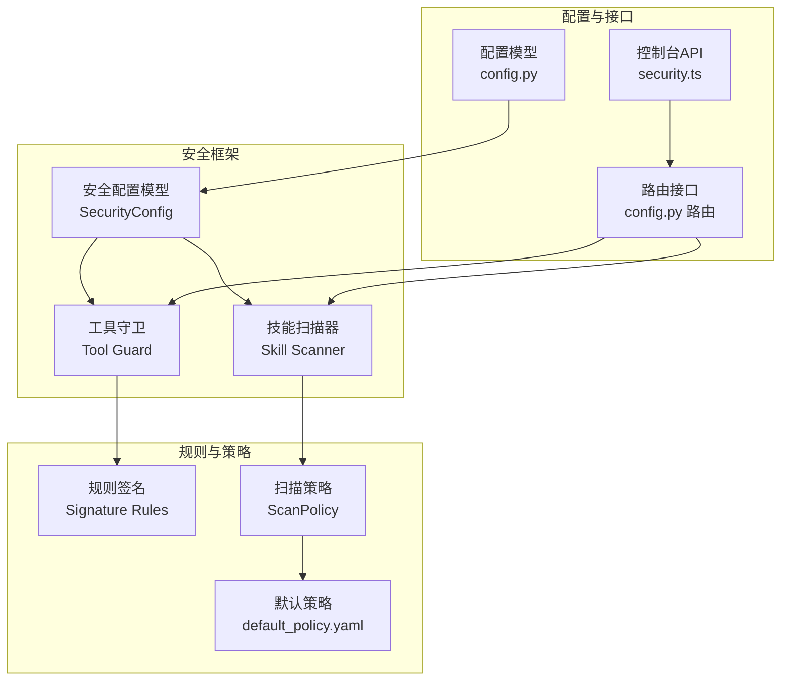
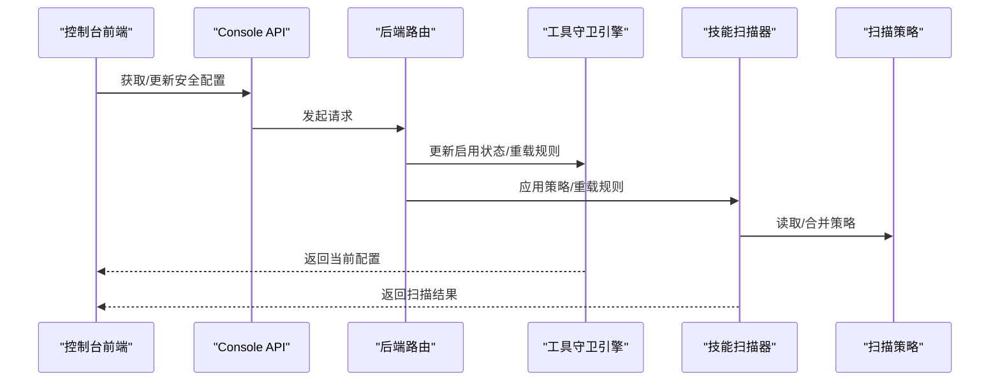
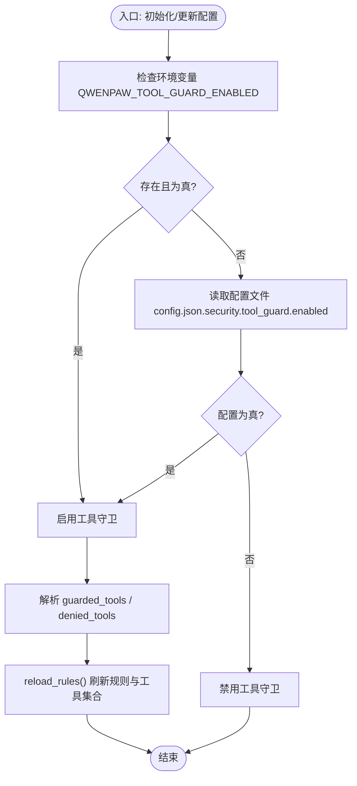
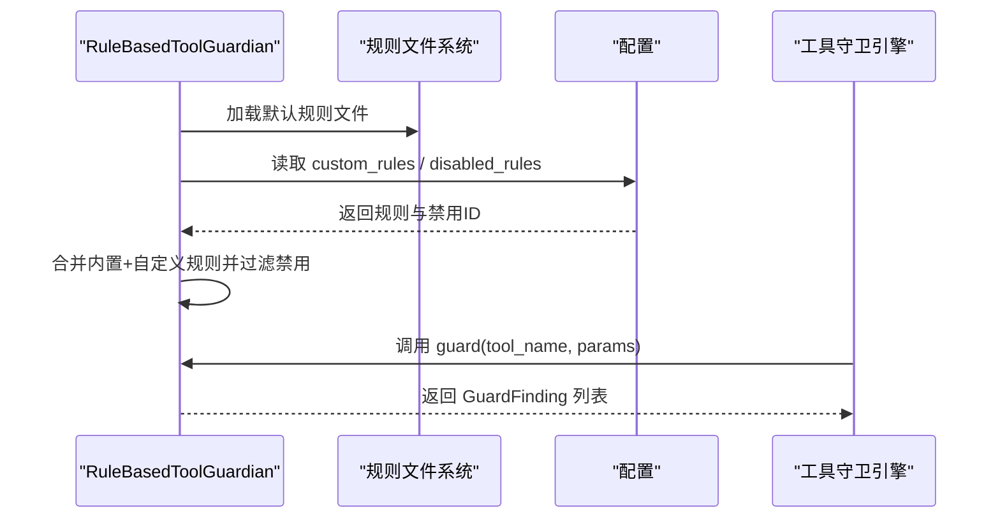
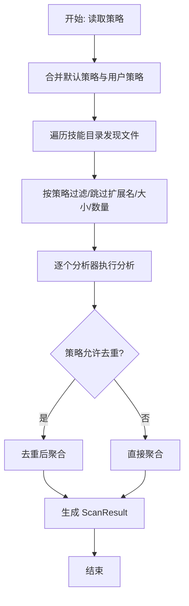
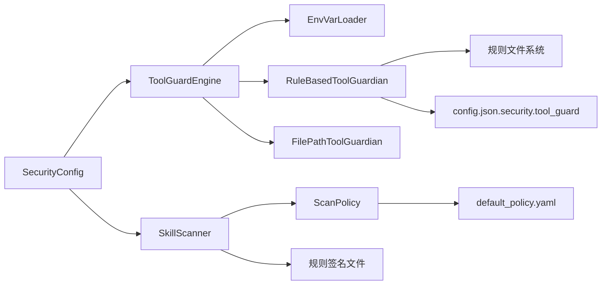

# 安全配置管理

<cite>
**本文引用的文件**
- [src/qwenpaw/security/__init__.py](file://src/qwenpaw/security/__init__.py)
- [src/qwenpaw/security/tool_guard/engine.py](file://src/qwenpaw/security/tool_guard/engine.py)
- [src/qwenpaw/security/tool_guard/guardians/rule_guardian.py](file://src/qwenpaw/security/tool_guard/guardians/rule_guardian.py)
- [src/qwenpaw/security/tool_guard/models.py](file://src/qwenpaw/security/tool_guard/models.py)
- [src/qwenpaw/security/skill_scanner/scanner.py](file://src/qwenpaw/security/skill_scanner/scanner.py)
- [src/qwenpaw/security/skill_scanner/scan_policy.py](file://src/qwenpaw/security/skill_scanner/scan_policy.py)
- [src/qwenpaw/security/skill_scanner/data/default_policy.yaml](file://src/qwenpaw/security/skill_scanner/data/default_policy.yaml)
- [src/qwenpaw/security/skill_scanner/rules/signatures/command_injection.yaml](file://src/qwenpaw/security/skill_scanner/rules/signatures/command_injection.yaml)
- [src/qwenpaw/security/skill_scanner/rules/signatures/data_exfiltration.yaml](file://src/qwenpaw/security/skill_scanner/rules/signatures/data_exfiltration.yaml)
- [src/qwenpaw/security/tool_guard/rules/dangerous_shell_commands.yaml](file://src/qwenpaw/security/tool_guard/rules/dangerous_shell_commands.yaml)
- [src/qwenpaw/config/config.py](file://src/qwenpaw/config/config.py)
- [console/src/api/modules/security.ts](file://console/src/api/modules/security.ts)
- [src/qwenpaw/app/routers/config.py](file://src/qwenpaw/app/routers/config.py)
</cite>

## 目录
1. [简介](#简介)
2. [项目结构](#项目结构)
3. [核心组件](#核心组件)
4. [架构总览](#架构总览)
5. [详细组件分析](#详细组件分析)
6. [依赖分析](#依赖分析)
7. [性能考虑](#性能考虑)
8. [故障排除指南](#故障排除指南)
9. [结论](#结论)
10. [附录](#附录)

## 简介
本文件面向QwenPaw安全配置管理系统，系统性阐述安全配置的层次结构与优先级、工具守卫（Tool Guard）的启用/禁用机制、安全策略（扫描策略、规则集、阈值）的配置与管理、热重载与配置验证流程、默认值与推荐设置、配置文件结构与字段语义、版本管理与迁移策略、错误诊断与故障排除，以及与其他系统组件的集成与影响，并提供备份与恢复建议。

## 项目结构
安全子系统由三大部分组成：
- 工具调用守卫（Tool Guard）：在工具执行前对参数进行预扫描，识别潜在危险模式。
- 技能扫描器（Skill Scanner）：对技能包进行静态分析，基于规则集与策略评估安全性。
- 配置与模型：定义顶层安全配置、规则模型、策略模型及默认策略文件。

图示来源
- [src/qwenpaw/security/__init__.py:1-21](file://src/qwenpaw/security/__init__.py#L1-L21)
- [src/qwenpaw/config/config.py:1122-1130](file://src/qwenpaw/config/config.py#L1122-L1130)
- [src/qwenpaw/security/skill_scanner/scan_policy.py:236-282](file://src/qwenpaw/security/skill_scanner/scan_policy.py#L236-L282)
- [src/qwenpaw/security/skill_scanner/data/default_policy.yaml:1-243](file://src/qwenpaw/security/skill_scanner/data/default_policy.yaml#L1-L243)

章节来源
- [src/qwenpaw/security/__init__.py:1-21](file://src/qwenpaw/security/__init__.py#L1-L21)
- [src/qwenpaw/config/config.py:1122-1130](file://src/qwenpaw/config/config.py#L1122-L1130)

## 核心组件
- 工具守卫引擎（ToolGuardEngine）
  - 通过环境变量、配置文件与默认值确定是否启用；支持动态注册/注销守卫者、热重载规则、按工具白名单/黑名单过滤。
- 规则型工具守卫（RuleBasedToolGuardian）
  - 加载内置与自定义规则，按工具名/参数名匹配，生成“发现”（Finding）并返回结果。
- 技能扫描器（SkillScanner）
  - 基于策略（ScanPolicy）加载规则签名，遍历技能目录，聚合分析结果。
- 扫描策略（ScanPolicy）
  - 支持从默认策略叠加自定义策略，覆盖隐藏文件、规则作用域、凭证处理、文件分类、文件限制、分析阈值、严重度覆盖与禁用规则等。
- 安全配置模型（SecurityConfig）
  - 统一承载工具守卫、文件守卫、技能扫描器的配置项，支持在config.json中持久化。

章节来源
- [src/qwenpaw/security/tool_guard/engine.py:53-238](file://src/qwenpaw/security/tool_guard/engine.py#L53-L238)
- [src/qwenpaw/security/tool_guard/guardians/rule_guardian.py:559-758](file://src/qwenpaw/security/tool_guard/guardians/rule_guardian.py#L559-L758)
- [src/qwenpaw/security/skill_scanner/scanner.py:76-319](file://src/qwenpaw/security/skill_scanner/scanner.py#L76-L319)
- [src/qwenpaw/security/skill_scanner/scan_policy.py:156-476](file://src/qwenpaw/security/skill_scanner/scan_policy.py#L156-L476)
- [src/qwenpaw/config/config.py:1061-1130](file://src/qwenpaw/config/config.py#L1061-L1130)

## 架构总览
下图展示安全配置在系统中的交互关系：控制台API与后端路由负责读写安全配置；工具守卫与技能扫描器在运行期消费配置；规则与策略文件作为配置的外部来源参与生效。

图示来源
- [console/src/api/modules/security.ts:77-99](file://console/src/api/modules/security.ts#L77-L99)
- [src/qwenpaw/app/routers/config.py:426-470](file://src/qwenpaw/app/routers/config.py#L426-L470)
- [src/qwenpaw/security/tool_guard/engine.py:148-154](file://src/qwenpaw/security/tool_guard/engine.py#L148-L154)
- [src/qwenpaw/security/skill_scanner/scanner.py:100-128](file://src/qwenpaw/security/skill_scanner/scanner.py#L100-L128)

## 详细组件分析

### 工具守卫：层次结构与优先级
- 启用/禁用优先级（环境变量 > 配置文件 > 默认值）
  - 环境变量：QWENPAW_TOOL_GUARD_ENABLED（true/1/yes视为启用）
  - 配置文件：config.json中security.tool_guard.enabled
  - 默认值：未找到配置时启用
- 工具范围与黑名单
  - guarded_tools为空表示对所有工具生效；非空列表仅对指定工具生效
  - denied_tools直接拒绝，不进入审批流程
- 动态规则与热重载
  - reload_rules触发各守卫者重新加载规则，随后刷新工具集合
- 结果聚合
  - ToolGuardResult记录最高严重度、守护耗时、失败的守卫者等

图示来源
- [src/qwenpaw/security/tool_guard/engine.py:35-51](file://src/qwenpaw/security/tool_guard/engine.py#L35-L51)
- [src/qwenpaw/security/tool_guard/engine.py:141-154](file://src/qwenpaw/security/tool_guard/engine.py#L141-L154)
- [src/qwenpaw/config/config.py:1061-1073](file://src/qwenpaw/config/config.py#L1061-L1073)

章节来源
- [src/qwenpaw/security/tool_guard/engine.py:35-51](file://src/qwenpaw/security/tool_guard/engine.py#L35-L51)
- [src/qwenpaw/security/tool_guard/engine.py:141-154](file://src/qwenpaw/security/tool_guard/engine.py#L141-L154)
- [src/qwenpaw/config/config.py:1061-1073](file://src/qwenpaw/config/config.py#L1061-L1073)

### 工具守卫：规则加载与匹配
- 内置规则目录与文件
  - 默认规则目录包含危险命令检测等规则文件
- 自定义规则与禁用规则
  - 从config.json.security.tool_guard.custom_rules加载用户自定义规则
  - 从config.json.security.tool_guard.disabled_rules过滤禁用规则ID
- 匹配逻辑
  - 按工具名/参数名筛选规则，对字符串化参数值进行正则匹配，支持排除模式
  - 特定规则（如rm命令）可附加工作区边界检查与提示信息

图示来源
- [src/qwenpaw/security/tool_guard/guardians/rule_guardian.py:467-511](file://src/qwenpaw/security/tool_guard/guardians/rule_guardian.py#L467-L511)
- [src/qwenpaw/security/tool_guard/guardians/rule_guardian.py:518-552](file://src/qwenpaw/security/tool_guard/guardians/rule_guardian.py#L518-L552)
- [src/qwenpaw/security/tool_guard/guardians/rule_guardian.py:608-758](file://src/qwenpaw/security/tool_guard/guardians/rule_guardian.py#L608-L758)
- [src/qwenpaw/security/tool_guard/engine.py:148-154](file://src/qwenpaw/security/tool_guard/engine.py#L148-L154)

章节来源
- [src/qwenpaw/security/tool_guard/guardians/rule_guardian.py:467-511](file://src/qwenpaw/security/tool_guard/guardians/rule_guardian.py#L467-L511)
- [src/qwenpaw/security/tool_guard/guardians/rule_guardian.py:518-552](file://src/qwenpaw/security/tool_guard/guardians/rule_guardian.py#L518-L552)
- [src/qwenpaw/security/tool_guard/guardians/rule_guardian.py:608-758](file://src/qwenpaw/security/tool_guard/guardians/rule_guardian.py#L608-L758)
- [src/qwenpaw/security/tool_guard/engine.py:148-154](file://src/qwenpaw/security/tool_guard/engine.py#L148-L154)

### 技能扫描器：策略驱动的静态分析
- 策略来源与合并
  - 默认策略文件（default_policy.yaml）提供基础规则与阈值
  - 用户策略通过ScanPolicy.from_yaml加载，与默认策略深合并
- 文件发现与过滤
  - 遍历技能目录，跳过符号链接、不在目录内的路径、超大文件、超过上限的文件数
  - 基于策略的文件分类决定是否跳过（如图片、压缩包、可执行代码等）
- 分析器与去重
  - PatternAnalyzer等分析器逐个执行，收集Finding
  - 可根据策略开启重复发现去重
- 结果聚合
  - ScanResult包含最高严重度、分析器使用情况、失败列表等

图示来源
- [src/qwenpaw/security/skill_scanner/scan_policy.py:261-282](file://src/qwenpaw/security/skill_scanner/scan_policy.py#L261-L282)
- [src/qwenpaw/security/skill_scanner/scan_policy.py:316-334](file://src/qwenpaw/security/skill_scanner/scan_policy.py#L316-L334)
- [src/qwenpaw/security/skill_scanner/scanner.py:148-242](file://src/qwenpaw/security/skill_scanner/scanner.py#L148-L242)
- [src/qwenpaw/security/skill_scanner/data/default_policy.yaml:1-243](file://src/qwenpaw/security/skill_scanner/data/default_policy.yaml#L1-L243)

章节来源
- [src/qwenpaw/security/skill_scanner/scan_policy.py:261-282](file://src/qwenpaw/security/skill_scanner/scan_policy.py#L261-L282)
- [src/qwenpaw/security/skill_scanner/scan_policy.py:316-334](file://src/qwenpaw/security/skill_scanner/scan_policy.py#L316-L334)
- [src/qwenpaw/security/skill_scanner/scanner.py:148-242](file://src/qwenpaw/security/skill_scanner/scanner.py#L148-L242)
- [src/qwenpaw/security/skill_scanner/data/default_policy.yaml:1-243](file://src/qwenpaw/security/skill_scanner/data/default_policy.yaml#L1-L243)

### 控制台API与路由：配置读写与热重载
- 控制台API类型定义
  - ToolGuardConfig、SkillScannerConfig、FileGuardUpdateBody等
- 路由接口
  - 获取/更新工具守卫配置
  - 获取内置规则清单
  - 获取/更新文件守卫配置
- 热重载
  - 更新启用状态后调用reload_rules以即时生效

章节来源
- [console/src/api/modules/security.ts:3-99](file://console/src/api/modules/security.ts#L3-L99)
- [src/qwenpaw/app/routers/config.py:426-470](file://src/qwenpaw/app/routers/config.py#L426-L470)

## 依赖分析
- 工具守卫依赖
  - 引擎依赖环境变量加载器、规则型守卫与文件路径守卫
  - 规则型守卫依赖规则文件系统、配置中的自定义规则与禁用规则
- 技能扫描器依赖
  - 策略模型与默认策略文件
  - 规则签名文件（命令注入、数据泄露等）
- 配置模型
  - SecurityConfig统一承载三类安全配置，便于持久化与跨模块共享

图示来源
- [src/qwenpaw/security/tool_guard/engine.py:24-28](file://src/qwenpaw/security/tool_guard/engine.py#L24-L28)
- [src/qwenpaw/security/tool_guard/guardians/rule_guardian.py:467-511](file://src/qwenpaw/security/tool_guard/guardians/rule_guardian.py#L467-L511)
- [src/qwenpaw/security/skill_scanner/scan_policy.py:236-282](file://src/qwenpaw/security/skill_scanner/scan_policy.py#L236-L282)
- [src/qwenpaw/config/config.py:1122-1130](file://src/qwenpaw/config/config.py#L1122-L1130)

章节来源
- [src/qwenpaw/security/tool_guard/engine.py:24-28](file://src/qwenpaw/security/tool_guard/engine.py#L24-L28)
- [src/qwenpaw/security/tool_guard/guardians/rule_guardian.py:467-511](file://src/qwenpaw/security/tool_guard/guardians/rule_guardian.py#L467-L511)
- [src/qwenpaw/security/skill_scanner/scan_policy.py:236-282](file://src/qwenpaw/security/skill_scanner/scan_policy.py#L236-L282)
- [src/qwenpaw/config/config.py:1122-1130](file://src/qwenpaw/config/config.py#L1122-L1130)

## 性能考虑
- 工具守卫
  - 正则编译缓存与排除模式优先匹配，减少无效匹配开销
  - 仅在启用状态下执行，避免不必要的扫描
- 技能扫描器
  - 文件发现阶段严格限制数量与大小，防止资源耗尽
  - 分析器失败记录用于定位瓶颈
- 策略合并
  - 深合并策略时注意正则长度与复杂度，避免过长正则导致性能问题

## 故障排除指南
- 工具守卫未生效
  - 检查环境变量QWENPAW_TOOL_GUARD_ENABLED是否被设置为true/1/yes
  - 确认config.json.security.tool_guard.enabled为true
  - 使用控制台API获取当前配置，确认enabled状态
- 规则未生效或频繁误报
  - 检查custom_rules与disabled_rules是否正确配置
  - 通过“获取内置规则”接口核对规则ID与匹配模式
- 技能扫描超时或失败
  - 调整timeout与max_files/max_file_size
  - 检查策略中的file_limits与file_classification
  - 查看analyzers_failed定位具体分析器问题
- 热重载无效
  - 确保调用更新接口后执行reload_rules
  - 检查守卫者实现是否支持reload方法

章节来源
- [src/qwenpaw/app/routers/config.py:426-470](file://src/qwenpaw/app/routers/config.py#L426-L470)
- [src/qwenpaw/security/tool_guard/engine.py:148-154](file://src/qwenpaw/security/tool_guard/engine.py#L148-L154)
- [src/qwenpaw/security/skill_scanner/scanner.py:194-213](file://src/qwenpaw/security/skill_scanner/scanner.py#L194-L213)

## 结论
QwenPaw的安全配置体系通过“环境变量 > 配置文件 > 默认值”的优先级确保灵活部署，结合工具守卫与技能扫描器的双层防护，配合策略驱动的规则与阈值管理，实现了可演进、可验证、可热重载的安全治理能力。建议在生产环境中采用严格的扫描策略与最小权限原则，并定期审查规则与策略以适应新的威胁形态。

## 附录

### 安全配置层次与优先级
- 工具守卫
  - 环境变量 > 配置文件 > 默认值
- 技能扫描器
  - 用户策略 > 默认策略 > 固定回退阈值

章节来源
- [src/qwenpaw/security/tool_guard/engine.py:35-51](file://src/qwenpaw/security/tool_guard/engine.py#L35-L51)
- [src/qwenpaw/security/skill_scanner/scan_policy.py:236-282](file://src/qwenpaw/security/skill_scanner/scan_policy.py#L236-L282)

### 工具守卫：环境变量与配置字段
- 环境变量
  - QWENPAW_TOOL_GUARD_ENABLED：启用/禁用工具守卫
- 配置字段（config.json.security.tool_guard）
  - enabled：布尔，是否启用
  - guarded_tools：字符串数组或null，受保护工具集合
  - denied_tools：字符串数组，直接拒绝的工具
  - custom_rules：自定义规则数组
  - disabled_rules：禁用规则ID数组

章节来源
- [src/qwenpaw/config/config.py:1061-1073](file://src/qwenpaw/config/config.py#L1061-L1073)

### 技能扫描器：策略字段与默认值
- 策略字段（ScanPolicy）
  - hidden_files：隐藏文件白名单
  - rule_scoping：规则作用域与去重
  - credentials：测试凭证与占位符
  - file_classification：文件类型分类
  - file_limits：文件数量/大小/名称长度等
  - analysis_thresholds：最小置信度与最大正则长度
  - severity_overrides：规则严重度覆盖
  - disabled_rules：禁用规则ID集合
- 默认策略（default_policy.yaml）
  - 提供默认分类、阈值与规则覆盖

章节来源
- [src/qwenpaw/security/skill_scanner/scan_policy.py:156-476](file://src/qwenpaw/security/skill_scanner/scan_policy.py#L156-L476)
- [src/qwenpaw/security/skill_scanner/data/default_policy.yaml:1-243](file://src/qwenpaw/security/skill_scanner/data/default_policy.yaml#L1-L243)

### 规则文件结构与字段
- 工具守卫规则（dangerous_shell_commands.yaml）
  - id、tools、params、category、severity、patterns、exclude_patterns、description、remediation
- 技能扫描规则（command_injection.yaml、data_exfiltration.yaml）
  - id、category、severity、patterns、file_types、description、remediation
  - 可选exclude_patterns与file_types限定范围

章节来源
- [src/qwenpaw/security/tool_guard/rules/dangerous_shell_commands.yaml:1-187](file://src/qwenpaw/security/tool_guard/rules/dangerous_shell_commands.yaml#L1-L187)
- [src/qwenpaw/security/skill_scanner/rules/signatures/command_injection.yaml:1-195](file://src/qwenpaw/security/skill_scanner/rules/signatures/command_injection.yaml#L1-L195)
- [src/qwenpaw/security/skill_scanner/rules/signatures/data_exfiltration.yaml:1-142](file://src/qwenpaw/security/skill_scanner/rules/signatures/data_exfiltration.yaml#L1-L142)

### 热重载与配置验证
- 热重载
  - 工具守卫：更新enabled后reload_rules
  - 技能扫描器：应用新策略并重载规则
- 验证
  - 通过控制台API获取当前配置与规则清单
  - 关注analyzers_failed与守卫者失败列表

章节来源
- [src/qwenpaw/app/routers/config.py:426-470](file://src/qwenpaw/app/routers/config.py#L426-L470)
- [src/qwenpaw/security/tool_guard/engine.py:148-154](file://src/qwenpaw/security/tool_guard/engine.py#L148-L154)
- [src/qwenpaw/security/skill_scanner/scanner.py:194-213](file://src/qwenpaw/security/skill_scanner/scanner.py#L194-L213)

### 默认值与推荐设置
- 工具守卫
  - 默认启用；建议在生产环境保持启用并配置受限的guarded_tools与deny_tools
- 技能扫描器
  - mode建议使用"warn"或"block"；timeout根据实际技能规模调整；合理设置file_limits
- 策略
  - 基于default_policy.yaml定制，逐步收紧规则作用域与阈值

章节来源
- [src/qwenpaw/config/config.py:1097-1120](file://src/qwenpaw/config/config.py#L1097-L1120)
- [src/qwenpaw/security/skill_scanner/data/default_policy.yaml:1-243](file://src/qwenpaw/security/skill_scanner/data/default_policy.yaml#L1-L243)

### 版本管理与迁移策略
- 策略文件
  - 通过ScanPolicy.to_yaml导出策略，便于版本化管理
- 迁移
  - 使用migrate_legacy_config_to_multi_agent进行多代理结构迁移，保留向后兼容字段

章节来源
- [src/qwenpaw/security/skill_scanner/scan_policy.py:283-304](file://src/qwenpaw/security/skill_scanner/scan_policy.py#L283-L304)
- [src/qwenpaw/config/config.py:1304-1439](file://src/qwenpaw/config/config.py#L1304-L1439)

### 备份与恢复
- 备份
  - 备份config.json（含security段）、策略文件（default_policy.yaml与自定义策略）、规则文件
- 恢复
  - 恢复上述文件后，重启服务并验证工具守卫与技能扫描器状态

章节来源
- [src/qwenpaw/config/config.py:1122-1130](file://src/qwenpaw/config/config.py#L1122-L1130)
- [src/qwenpaw/security/skill_scanner/scan_policy.py:283-304](file://src/qwenpaw/security/skill_scanner/scan_policy.py#L283-L304)