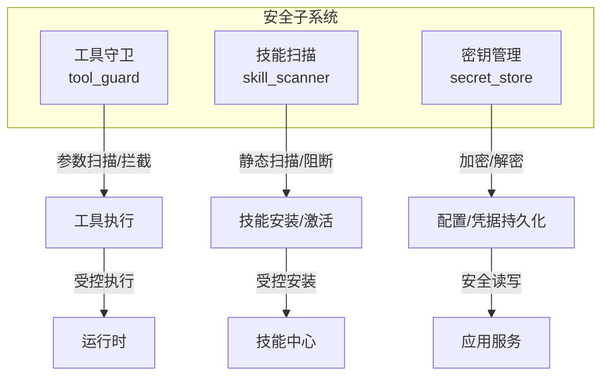
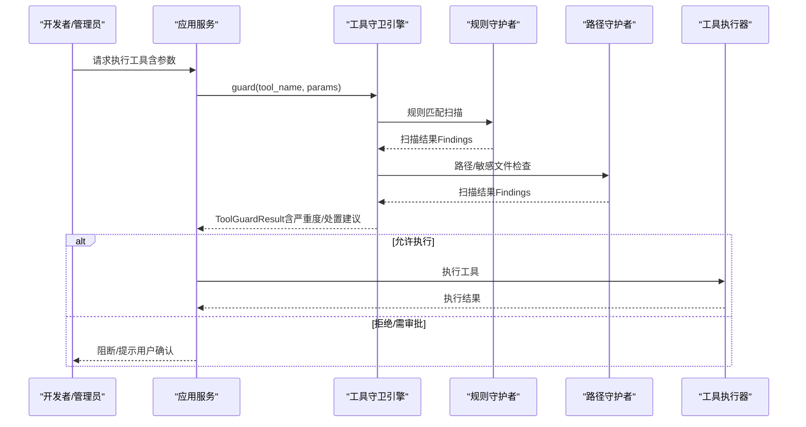
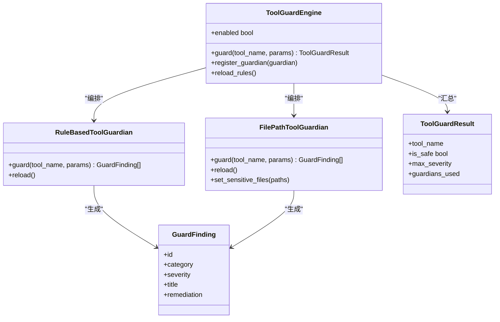
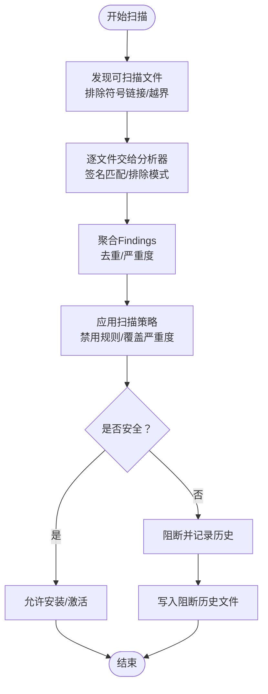
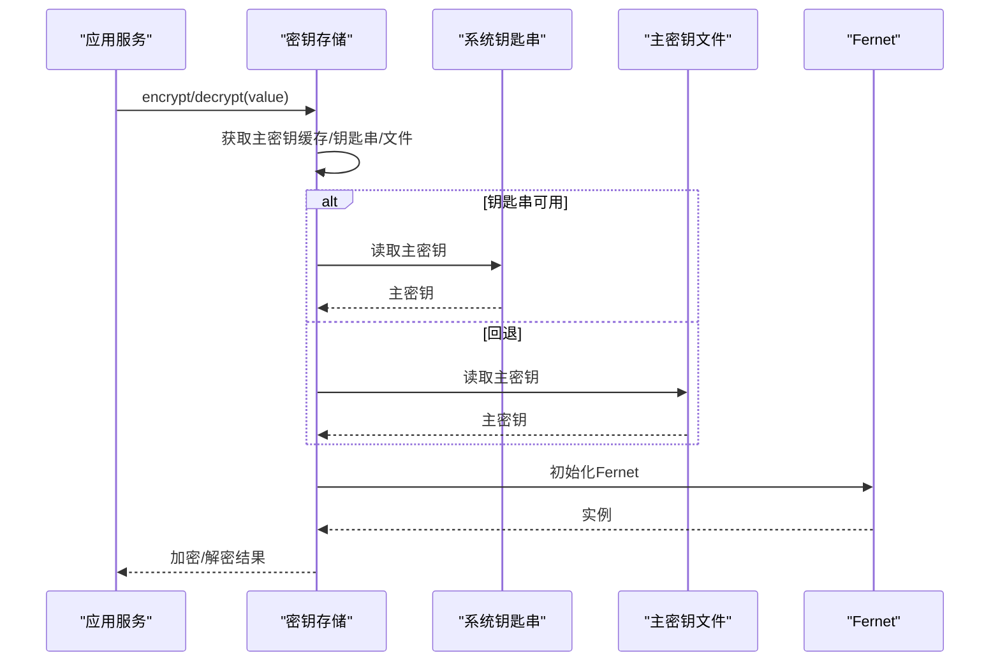
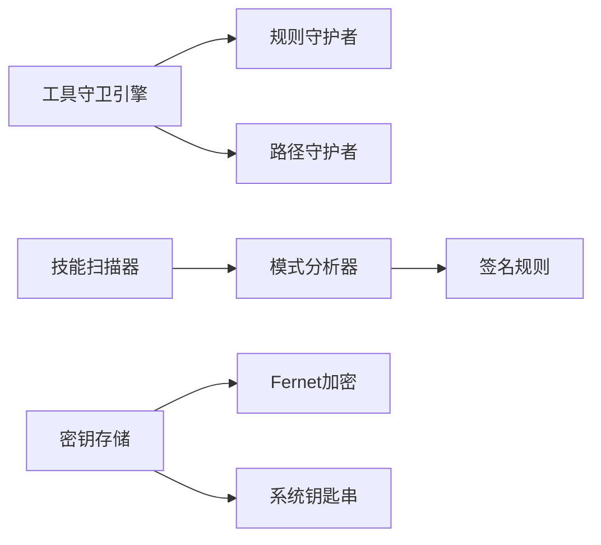

# 安全防护系统

<cite>
**本文引用的文件**
- [security/__init__.py](file://src/qwenpaw/security/__init__.py)
- [security/tool_guard/__init__.py](file://src/qwenpaw/security/tool_guard/__init__.py)
- [security/tool_guard/engine.py](file://src/qwenpaw/security/tool_guard/engine.py)
- [security/tool_guard/guardians/rule_guardian.py](file://src/qwenpaw/security/tool_guard/guardians/rule_guardian.py)
- [security/tool_guard/guardians/file_guardian.py](file://src/qwenpaw/security/tool_guard/guardians/file_guardian.py)
- [security/tool_guard/models.py](file://src/qwenpaw/security/tool_guard/models.py)
- [security/skill_scanner/__init__.py](file://src/qwenpaw/security/skill_scanner/__init__.py)
- [security/skill_scanner/scanner.py](file://src/qwenpaw/security/skill_scanner/scanner.py)
- [security/skill_scanner/analyzers/pattern_analyzer.py](file://src/qwenpaw/security/skill_scanner/analyzers/pattern_analyzer.py)
- [security/skill_scanner/models.py](file://src/qwenpaw/security/skill_scanner/models.py)
- [security/skill_scanner/scan_policy.py](file://src/qwenpaw/security/skill_scanner/scan_policy.py)
- [security/skill_scanner/rules/signatures/command_injection.yaml](file://src/qwenpaw/security/skill_scanner/rules/signatures/command_injection.yaml)
- [security/skill_scanner/rules/signatures/data_exfiltration.yaml](file://src/qwenpaw/security/skill_scanner/rules/signatures/data_exfiltration.yaml)
- [security/skill_scanner/rules/signatures/hardcoded_secrets.yaml](file://src/qwenpaw/security/skill_scanner/rules/signatures/hardcoded_secrets.yaml)
- [security/tool_guard/rules/dangerous_shell_commands.yaml](file://src/qwenpaw/security/tool_guard/rules/dangerous_shell_commands.yaml)
- [security/secret_store.py](file://src/qwenpaw/security/secret_store.py)
</cite>

## 目录
1. [简介](#简介)
2. [项目结构](#项目结构)
3. [核心组件](#核心组件)
4. [架构总览](#架构总览)
5. [详细组件分析](#详细组件分析)
6. [依赖关系分析](#依赖关系分析)
7. [性能考量](#性能考量)
8. [故障排查指南](#故障排查指南)
9. [结论](#结论)
10. [附录](#附录)

## 简介
本文件面向QwenPaw的安全防护系统，系统化阐述其多层次安全机制的设计理念与实现方式，覆盖工具守卫（危险命令拦截、文件访问控制、权限限制）、技能安全扫描（恶意代码检测、注入攻击防护、数据泄露预防）、密钥管理（敏感信息加密存储、访问控制、轮换策略）、安全配置（Web认证、防火墙、审计日志）、安全规则的自定义与扩展、安全事件监控与响应、最佳实践与合规性，以及与系统其他组件的集成与影响。

## 项目结构
安全子系统位于src/qwenpaw/security目录下，分为三大子域：
- 工具守卫（tool_guard）：在工具调用前进行参数扫描与拦截，防止危险命令、敏感文件访问与越权行为。
- 技能扫描（skill_scanner）：对技能包进行静态扫描，识别注入、硬编码凭证、数据外泄等风险。
- 密钥管理（secret_store）：基于Fernet的透明加解密层，结合操作系统钥匙串/文件持久化主密钥，保障磁盘上敏感字段安全。

图示来源
- [security/__init__.py:1-21](file://src/qwenpaw/security/__init__.py#L1-L21)

章节来源
- [security/__init__.py:1-21](file://src/qwenpaw/security/__init__.py#L1-L21)

## 核心组件
- 工具守卫引擎（ToolGuardEngine）
  - 统一编排多个守护者（RuleBasedToolGuardian、FilePathToolGuardian），在工具调用前进行参数扫描与拦截。
  - 支持按环境变量/配置启用/禁用，支持动态重载规则与受控工具集。
- 技能扫描器（SkillScanner）
  - 发现技能目录中的可扫描文件，交由分析器（PatternAnalyzer）执行签名匹配，聚合结果并支持白名单/黑名单与严重度覆盖。
- 密钥存储（SecretStore）
  - 基于Fernet（AES-128-CBC + HMAC-SHA256）的透明加解密，主密钥来自系统钥匙串或文件，支持加密字典字段批量处理。

章节来源
- [security/tool_guard/engine.py:53-238](file://src/qwenpaw/security/tool_guard/engine.py#L53-L238)
- [security/skill_scanner/scanner.py:76-319](file://src/qwenpaw/security/skill_scanner/scanner.py#L76-L319)
- [security/secret_store.py:1-291](file://src/qwenpaw/security/secret_store.py#L1-L291)

## 架构总览
工具守卫与技能扫描分别在“预执行”和“预安装/激活”阶段提供安全边界；密钥管理贯穿配置持久化与运行时读取，形成端到端的机密性保护。

图示来源
- [security/tool_guard/engine.py:169-227](file://src/qwenpaw/security/tool_guard/engine.py#L169-L227)
- [security/tool_guard/guardians/rule_guardian.py:608-758](file://src/qwenpaw/security/tool_guard/guardians/rule_guardian.py#L608-L758)
- [security/tool_guard/guardians/file_guardian.py:313-365](file://src/qwenpaw/security/tool_guard/guardians/file_guardian.py#L313-L365)

## 详细组件分析

### 工具守卫机制
- 设计理念
  - 预执行拦截：在工具函数被调用之前，对参数进行快速正则签名匹配与路径解析，避免潜在破坏性/越权操作。
  - 可插拔守护者：规则守护者（正则签名）与路径守护者（敏感文件/目录）分离，便于扩展与独立演进。
  - 可配置范围：支持通过配置限定受控工具集合与禁用工具清单，满足不同场景下的最小授权原则。
- 关键实现
  - 规则守护者：从YAML加载签名规则，对字符串化参数值进行多行/单行匹配，并对特定高危命令（如rm、sudo、反向连接）做增强提示与工作区外文件检测。
  - 路径守护者：解析shell命令中的重定向与路径令牌，判断是否指向敏感目录或文件，支持配置化敏感路径列表。
  - 结果模型：统一的发现（GuardFinding）与结果（ToolGuardResult）模型，包含严重度、类别、修复建议与元数据。
- 规则与签名
  - 危险shell命令规则：涵盖rm/mv破坏性操作、格式化/擦除块设备、fork炸弹、管道下载执行、反向shell、系统重启/关机、服务管理、进程终止、权限变更、越权提升等。
  - 工作区边界：对rm命令的目标路径进行规范化与工作区外检测，提供中英双语提示与拒绝建议。

图示来源
- [security/tool_guard/engine.py:53-238](file://src/qwenpaw/security/tool_guard/engine.py#L53-L238)
- [security/tool_guard/guardians/rule_guardian.py:559-758](file://src/qwenpaw/security/tool_guard/guardians/rule_guardian.py#L559-L758)
- [security/tool_guard/guardians/file_guardian.py:184-365](file://src/qwenpaw/security/tool_guard/guardians/file_guardian.py#L184-L365)
- [security/tool_guard/models.py:60-185](file://src/qwenpaw/security/tool_guard/models.py#L60-L185)

章节来源
- [security/tool_guard/engine.py:35-164](file://src/qwenpaw/security/tool_guard/engine.py#L35-L164)
- [security/tool_guard/guardians/rule_guardian.py:1-758](file://src/qwenpaw/security/tool_guard/guardians/rule_guardian.py#L1-L758)
- [security/tool_guard/guardians/file_guardian.py:1-365](file://src/qwenpaw/security/tool_guard/guardians/file_guardian.py#L1-L365)
- [security/tool_guard/models.py:1-185](file://src/qwenpaw/security/tool_guard/models.py#L1-L185)
- [security/tool_guard/rules/dangerous_shell_commands.yaml:1-187](file://src/qwenpaw/security/tool_guard/rules/dangerous_shell_commands.yaml#L1-L187)

### 技能安全扫描系统
- 设计理念
  - 在技能安装/激活前进行静态扫描，基于YAML签名规则与组织化扫描策略，降低运行时风险。
  - 支持策略覆盖（规则禁用、严重度覆盖、仅代码文件扫描、文档路径跳过、去重等），兼顾准确性与可维护性。
- 关键实现
  - 文件发现：遍历技能目录，排除符号链接与不在技能根内的真实路径，按策略过滤扩展名与大小/数量阈值。
  - 分析器：默认使用模式分析器（PatternAnalyzer），基于签名规则进行正则匹配，支持多行模式与排除模式。
  - 结果聚合：统一的Finding与ScanResult模型，支持最大严重度计算与按严重度/类别的分组查询。
- 规则与签名
  - 注入攻击：eval/exec/compile、os.system/subprocess shell=True、路径遍历、SQL注入、SVG/JS嵌入脚本、find -exec滥用等。
  - 数据泄露：网络请求、socket直连、敏感文件读取、base64+网络组合、JS FS访问等。
  - 硬编码凭证：AWS/GitHub/Stripe/Google/JWT私钥、密码/密钥变量、连接串等。

图示来源
- [security/skill_scanner/scanner.py:148-242](file://src/qwenpaw/security/skill_scanner/scanner.py#L148-L242)
- [security/skill_scanner/analyzers/pattern_analyzer.py:265-347](file://src/qwenpaw/security/skill_scanner/analyzers/pattern_analyzer.py#L265-L347)
- [security/skill_scanner/models.py:168-235](file://src/qwenpaw/security/skill_scanner/models.py#L168-L235)
- [security/skill_scanner/scan_policy.py:156-476](file://src/qwenpaw/security/skill_scanner/scan_policy.py#L156-L476)

章节来源
- [security/skill_scanner/scanner.py:76-319](file://src/qwenpaw/security/skill_scanner/scanner.py#L76-L319)
- [security/skill_scanner/analyzers/pattern_analyzer.py:1-393](file://src/qwenpaw/security/skill_scanner/analyzers/pattern_analyzer.py#L1-L393)
- [security/skill_scanner/models.py:1-235](file://src/qwenpaw/security/skill_scanner/models.py#L1-L235)
- [security/skill_scanner/scan_policy.py:1-476](file://src/qwenpaw/security/skill_scanner/scan_policy.py#L1-L476)
- [security/skill_scanner/rules/signatures/command_injection.yaml:1-195](file://src/qwenpaw/security/skill_scanner/rules/signatures/command_injection.yaml#L1-L195)
- [security/skill_scanner/rules/signatures/data_exfiltration.yaml:1-142](file://src/qwenpaw/security/skill_scanner/rules/signatures/data_exfiltration.yaml#L1-L142)
- [security/skill_scanner/rules/signatures/hardcoded_secrets.yaml:1-150](file://src/qwenpaw/security/skill_scanner/rules/signatures/hardcoded_secrets.yaml#L1-L150)

### 密钥管理系统
- 设计理念
  - 透明加密：对磁盘上的敏感字段（如API Key、JWT Secret）进行透明加解密，读写时自动区分明文与密文。
  - 主密钥管理：优先使用系统钥匙串（keyring），在容器/无桌面环境中回退至安全权限的文件存储，支持生成、缓存与迁移。
  - 字段级控制：针对不同配置结构（provider/auth）定义应加密字段集合，提供批量加密/解密辅助方法。
- 关键实现
  - 主密钥获取：双重检查锁定，线程安全地缓存主密钥；支持容器/无显示环境跳过钥匙串访问。
  - Fernet实例：基于主密钥派生Fernet密钥，缓存以减少开销。
  - 加密/解密：对带前缀的密文进行解密，失败时返回原文以便降级处理；提供字段级加解密工具。

图示来源
- [security/secret_store.py:154-242](file://src/qwenpaw/security/secret_store.py#L154-L242)

章节来源
- [security/secret_store.py:1-291](file://src/qwenpaw/security/secret_store.py#L1-L291)

## 依赖关系分析
- 组件内聚与耦合
  - 工具守卫与技能扫描均采用“编排器 + 多守护者/分析器”的松耦合设计，便于独立演进与替换。
  - 规则/签名集中于各自目录，便于版本化与组织策略覆盖。
- 外部依赖
  - 工具守卫：依赖yaml正则库、系统钥匙串（可选）、配置加载。
  - 技能扫描：依赖yaml解析、正则匹配、策略合并。
  - 密钥管理：依赖cryptography.fernet、keyring（可选）。

图示来源
- [security/tool_guard/engine.py:25-28](file://src/qwenpaw/security/tool_guard/engine.py#L25-L28)
- [security/skill_scanner/analyzers/pattern_analyzer.py:15-19](file://src/qwenpaw/security/skill_scanner/analyzers/pattern_analyzer.py#L15-L19)
- [security/secret_store.py:205-210](file://src/qwenpaw/security/secret_store.py#L205-L210)

章节来源
- [security/tool_guard/engine.py:1-238](file://src/qwenpaw/security/tool_guard/engine.py#L1-L238)
- [security/skill_scanner/analyzers/pattern_analyzer.py:1-393](file://src/qwenpaw/security/skill_scanner/analyzers/pattern_analyzer.py#L1-L393)
- [security/secret_store.py:1-291](file://src/qwenpaw/security/secret_store.py#L1-L291)

## 性能考量
- 工具守卫
  - 正则匹配与字符串化参数扫描为O(n)级别，规则数量有限且按工具/参数维度裁剪，延迟可控。
  - 提供always_run守护者用于非受控工具的路径级检查，避免全量扫描。
- 技能扫描
  - 文件发现阶段限制最大文件数与单文件大小，避免大体积技能导致扫描时间过长。
  - 缓存最近扫描结果（基于目录mtime），减少重复扫描成本。
- 密钥管理
  - 主密钥与Fernet实例缓存，避免频繁初始化；容器/无桌面环境跳过钥匙串以规避阻塞。

## 故障排查指南
- 工具守卫
  - 现象：工具被误判/阻断
    - 排查：检查规则严重度、排除模式与工作区外文件提示；必要时调整配置或提供用户确认。
    - 参考：规则文件与守护者实现。
  - 现象：守护者异常失败
    - 排查：查看守护者失败列表与日志，确认规则加载与正则有效性。
- 技能扫描
  - 现象：扫描超时/未生效
    - 排查：检查扫描模式（block/warn/off）、超时配置、白名单/黑名单与策略覆盖。
  - 现象：误报/漏报
    - 排查：调整签名规则、排除模式、策略去重与严重度覆盖。
- 密钥管理
  - 现象：解密失败/返回原文
    - 排查：确认主密钥是否变更、文件权限是否正确、容器/无桌面环境是否跳过钥匙串。

章节来源
- [security/tool_guard/engine.py:214-224](file://src/qwenpaw/security/tool_guard/engine.py#L214-L224)
- [security/skill_scanner/__init__.py:424-514](file://src/qwenpaw/security/skill_scanner/__init__.py#L424-L514)
- [security/secret_store.py:236-242](file://src/qwenpaw/security/secret_store.py#L236-L242)

## 结论
QwenPaw的安全防护系统通过“预执行工具守卫 + 预安装技能扫描 + 透明密钥管理”的三层机制，构建了从开发到运行的全链路安全边界。规则与策略可配置、可扩展，既满足企业合规要求，又保持灵活性与可维护性。建议在生产环境中结合Web认证、防火墙与审计日志，完善纵深防御体系。

## 附录

### 安全配置指南（建议）
- Web认证与会话
  - 使用强认证（如OAuth/JWT）与短期有效会话，强制HTTPS传输。
- 防火墙与网络
  - 限制对外出站连接，仅放行必需域名/端口；对内网服务启用最小暴露面。
- 审计日志
  - 记录工具调用、技能扫描结果、密钥访问与变更事件，保留至少90天以上。
- 环境隔离
  - 将技能沙箱化运行，限制文件系统与网络权限；容器部署时避免特权模式。

### 自定义与扩展机制
- 工具守卫
  - 新增守护者：实现BaseToolGuardian接口，注册到ToolGuardEngine。
  - 新增规则：在规则目录新增YAML条目，遵循现有字段与严重度约定。
- 技能扫描
  - 新增分析器：实现BaseAnalyzer接口，注册到SkillScanner。
  - 新增签名：在签名目录新增YAML条目，配合策略覆盖与严重度调整。
- 密钥管理
  - 字段扩展：在相应字段集合中加入新敏感字段，确保持久化时自动加密。

### 安全事件监控与响应
- 监控
  - 关注工具守卫阻断事件、技能扫描阻断历史、密钥访问异常。
- 响应
  - 快速定位规则/策略问题，必要时临时放宽策略并发布补丁；对高危事件启动应急响应流程。

### 合规性与最佳实践
- 合规性
  - 依据组织安全基线定制扫描策略与规则；定期评审与更新。
- 最佳实践
  - 最小权限原则：仅授予必要工具与路径访问；严格限制特权命令。
  - 不信任输入：对所有外部输入进行参数化与白名单校验。
  - 可追溯性：完整记录安全事件与处置过程，支持审计与复盘。