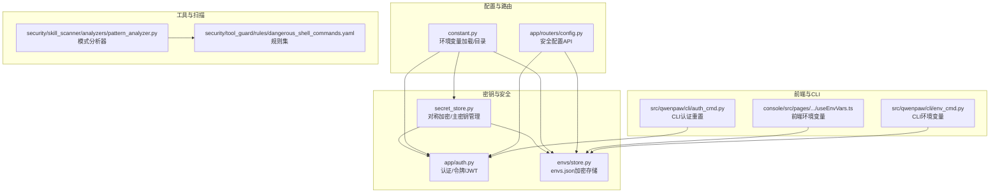
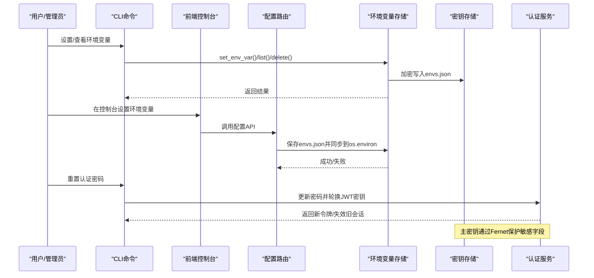
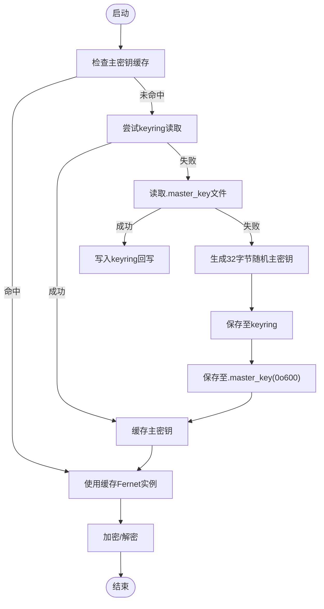
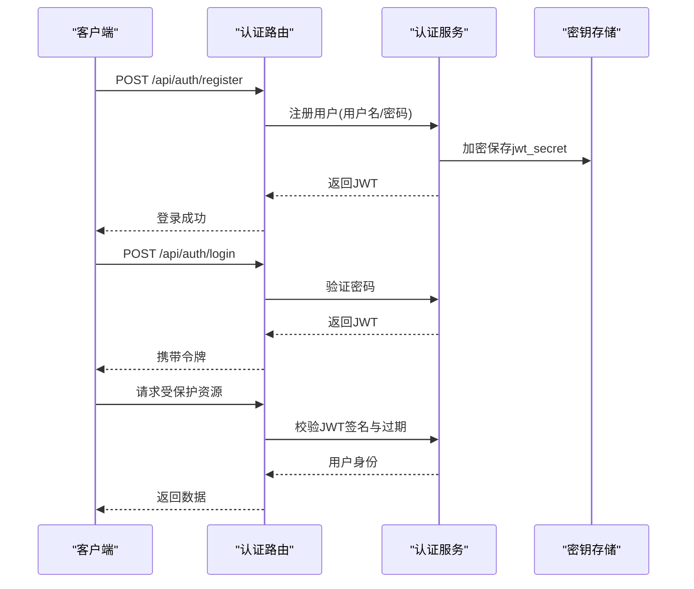
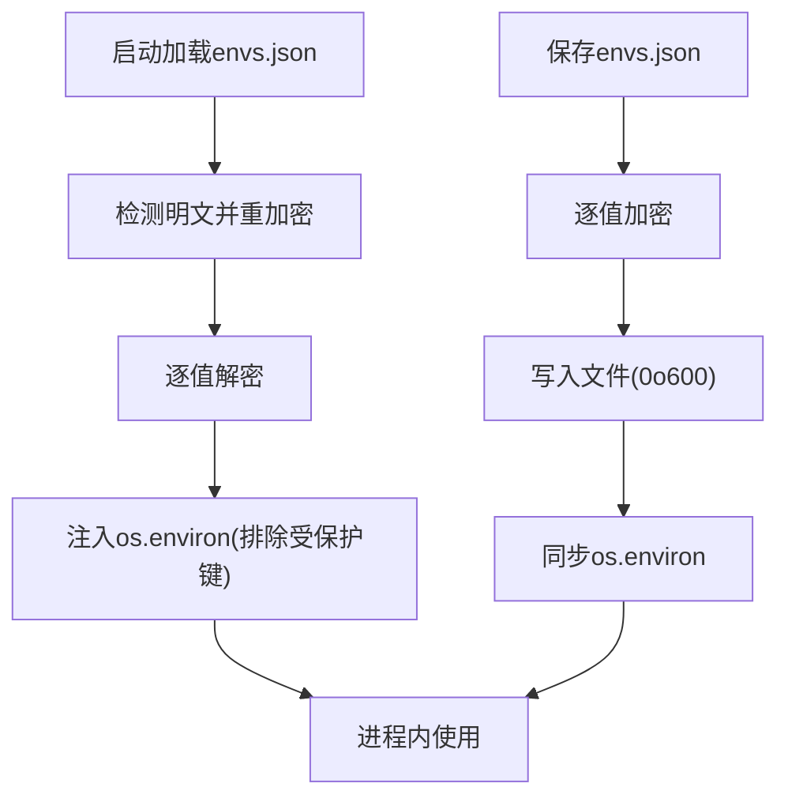
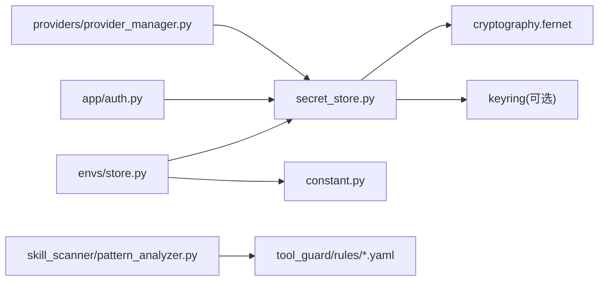

# 密钥管理系统

<cite>
**本文引用的文件**
- [secret_store.py](file://src/qwenpaw/security/secret_store.py)
- [store.py](file://src/qwenpaw/envs/store.py)
- [constant.py](file://src/qwenpaw/constant.py)
- [auth.py](file://src/qwenpaw/app/auth.py)
- [auth_cmd.py](file://src/qwenpaw/cli/auth_cmd.py)
- [provider_manager.py](file://src/qwenpaw/providers/provider_manager.py)
- [pattern_analyzer.py](file://src/qwenpaw/security/skill_scanner/analyzers/pattern_analyzer.py)
- [dangerous_shell_commands.yaml](file://src/qwenpaw/security/tool_guard/rules/dangerous_shell_commands.yaml)
- [security.en.md](file://website/public/docs/security.en.md)
- [SECURITY.md](file://SECURITY.md)
- [logging.py](file://src/qwenpaw/utils/logging.py)
- [env.ts](file://console/src/api/types/env.ts)
- [useEnvVars.ts](file://console/src/pages/Settings/Environments/useEnvVars.ts)
- [env_cmd.py](file://src/qwenpaw/cli/env_cmd.py)
</cite>

## 目录
1. [简介](#简介)
2. [项目结构](#项目结构)
3. [核心组件](#核心组件)
4. [架构总览](#架构总览)
5. [详细组件分析](#详细组件分析)
6. [依赖关系分析](#依赖关系分析)
7. [性能考量](#性能考量)
8. [故障排查指南](#故障排查指南)
9. [结论](#结论)
10. [附录](#附录)

## 简介
本文件面向QwenPaw密钥管理系统，系统性阐述密钥存储的安全架构与加密机制（对称加密与非对称加密应用）、敏感信息管理策略（API密钥、数据库凭证、认证令牌）、密钥轮换与更新机制、访问控制与权限管理、密钥恢复与备份、与环境变量系统的集成、最佳实践与合规要求、监控与审计能力，以及密钥在不同组件间的传递与使用方式，并提供密钥泄露应急响应流程。

## 项目结构
QwenPaw的密钥管理由以下模块协同完成：
- 安全存储层：对称加密（Fernet）与主密钥管理（OS Keychain优先，文件回退）
- 认证与令牌：密码哈希（SHA-256+盐）、HMAC-SHA256签名JWT
- 环境变量持久化：envs.json加密存储与进程注入
- 配置与路由：安全相关配置项与API端点
- 工具守卫与技能扫描：规则引擎与模式检测，抑制误报
- 日志与审计：统一日志格式与文件输出
- 前端与CLI：环境变量与认证管理的用户界面与命令行工具

图表来源
- [secret_store.py:1-291](file://src/qwenpaw/security/secret_store.py#L1-L291)
- [store.py:1-263](file://src/qwenpaw/envs/store.py#L1-L263)
- [constant.py:1-307](file://src/qwenpaw/constant.py#L1-L307)
- [auth.py:1-441](file://src/qwenpaw/app/auth.py#L1-L441)
- [env_cmd.py:1-50](file://src/qwenpaw/cli/env_cmd.py#L1-L50)
- [auth_cmd.py:1-67](file://src/qwenpaw/cli/auth_cmd.py#L1-L67)
- [pattern_analyzer.py:347-380](file://src/qwenpaw/security/skill_scanner/analyzers/pattern_analyzer.py#L347-L380)
- [dangerous_shell_commands.yaml:75-187](file://src/qwenpaw/security/tool_guard/rules/dangerous_shell_commands.yaml#L75-L187)

章节来源
- [secret_store.py:1-291](file://src/qwenpaw/security/secret_store.py#L1-L291)
- [store.py:1-263](file://src/qwenpaw/envs/store.py#L1-L263)
- [constant.py:1-307](file://src/qwenpaw/constant.py#L1-L307)
- [auth.py:1-441](file://src/qwenpaw/app/auth.py#L1-L441)
- [env_cmd.py:1-50](file://src/qwenpaw/cli/env_cmd.py#L1-L50)
- [auth_cmd.py:1-67](file://src/qwenpaw/cli/auth_cmd.py#L1-L67)
- [pattern_analyzer.py:347-380](file://src/qwenpaw/security/skill_scanner/analyzers/pattern_analyzer.py#L347-L380)
- [dangerous_shell_commands.yaml:75-187](file://src/qwenpaw/security/tool_guard/rules/dangerous_shell_commands.yaml#L75-L187)

## 核心组件
- 对称加密与主密钥管理：基于Fernet（AES-128-CBC + HMAC-SHA256），主密钥优先从操作系统钥匙串读取，失败时回退到文件存储并设置严格权限
- 认证与令牌：密码以加盐SHA-256存储；JWT使用HMAC-SHA256签名，带签发/过期时间，支持轮换
- 环境变量持久化：envs.json位于SECRET_DIR，值加密存储，启动时注入os.environ，受保护键不注入
- 配置与路由：通过API暴露安全相关配置（工具守卫、文件守卫、技能扫描等）
- 工具守卫与技能扫描：内置规则检测高危模式，抑制测试凭据与占位符误报
- 日志与审计：统一命名空间日志，支持文件轮转与过滤
- 前端与CLI：提供环境变量与认证管理的UI与命令行入口

章节来源
- [secret_store.py:1-291](file://src/qwenpaw/security/secret_store.py#L1-L291)
- [store.py:1-263](file://src/qwenpaw/envs/store.py#L1-L263)
- [auth.py:1-441](file://src/qwenpaw/app/auth.py#L1-L441)
- [constant.py:1-307](file://src/qwenpaw/constant.py#L1-L307)

## 架构总览
下图展示密钥与安全相关模块之间的交互关系与数据流：

图表来源
- [env_cmd.py:1-50](file://src/qwenpaw/cli/env_cmd.py#L1-L50)
- [useEnvVars.ts:1-33](file://console/src/pages/Settings/Environments/useEnvVars.ts#L1-L33)
- [store.py:198-221](file://src/qwenpaw/envs/store.py#L198-L221)
- [auth_cmd.py:21-67](file://src/qwenpaw/cli/auth_cmd.py#L21-L67)
- [auth.py:305-340](file://src/qwenpaw/app/auth.py#L305-L340)

## 详细组件分析

### 对称加密与主密钥管理（Fernet）
- 加密算法：Fernet（对称加密，AES-128-CBC + HMAC-SHA256）
- 主密钥来源：
  - 优先：操作系统钥匙串（keyring），服务名qwenpaw，账户master_key
  - 回退：文件路径SECRET_DIR/.master_key，权限0o600
- 双重检查锁定：多线程环境下仅一个线程生成或加载主密钥
- 缓存策略：主密钥与Fernet实例缓存，避免重复解密开销
- 兼容性：支持容器/无桌面环境跳过keyring，CI环境自动回退
- 前缀标识：密文以ENC:前缀区分，透明迁移

图表来源
- [secret_store.py:154-188](file://src/qwenpaw/security/secret_store.py#L154-L188)
- [secret_store.py:199-210](file://src/qwenpaw/security/secret_store.py#L199-L210)

章节来源
- [secret_store.py:1-291](file://src/qwenpaw/security/secret_store.py#L1-L291)

### 认证与令牌（密码哈希与JWT）
- 密码存储：加盐SHA-256哈希，盐值与哈希分离存储于auth.json
- JWT签名：HMAC-SHA256，载荷包含sub、iat、exp，有效期7天
- 会话轮换：重置密码或轮换JWT密钥时，所有现有会话失效
- 中间件：FastAPI中间件校验Bearer令牌，跳过公共路径与本地回环请求
- 自动注册：从环境变量批量创建管理员账号（自动化部署友好）

图表来源
- [auth.py:246-271](file://src/qwenpaw/app/auth.py#L246-L271)
- [auth.py:347-364](file://src/qwenpaw/app/auth.py#L347-L364)
- [auth.py:371-441](file://src/qwenpaw/app/auth.py#L371-L441)
- [auth_cmd.py:21-67](file://src/qwenpaw/cli/auth_cmd.py#L21-L67)

章节来源
- [auth.py:1-441](file://src/qwenpaw/app/auth.py#L1-L441)
- [auth_cmd.py:1-67](file://src/qwenpaw/cli/auth_cmd.py#L1-L67)

### 环境变量系统与密钥集成
- 存储位置：envs.json位于SECRET_DIR，值加密存储，权限0o600
- 启动注入：首次加载时将非受保护键注入os.environ，避免子进程读取明文
- 迁移策略：检测历史明文并透明重加密
- 受保护键：如工作目录与密钥目录等关键环境变量不会注入进程，防止泄露
- 前端与CLI：提供列表、设置、删除操作，保障密钥安全变更

图表来源
- [store.py:142-181](file://src/qwenpaw/envs/store.py#L142-L181)
- [store.py:198-221](file://src/qwenpaw/envs/store.py#L198-L221)
- [store.py:242-263](file://src/qwenpaw/envs/store.py#L242-L263)
- [constant.py:88-111](file://src/qwenpaw/constant.py#L88-L111)

章节来源
- [store.py:1-263](file://src/qwenpaw/envs/store.py#L1-L263)
- [constant.py:1-307](file://src/qwenpaw/constant.py#L1-L307)

### 敏感信息管理策略
- API密钥：provider配置中的api_key字段在持久化时自动加密
- 数据库凭证：建议通过环境变量或外部密管系统注入，避免硬编码
- 认证令牌：auth.json中的jwt_secret字段加密存储，迁移时透明处理
- 机密字段集合：PROVIDER_SECRET_FIELDS与AUTH_SECRET_FIELDS定义需加密的字段集

章节来源
- [secret_store.py:253-258](file://src/qwenpaw/security/secret_store.py#L253-L258)
- [provider_manager.py:1142-1173](file://src/qwenpaw/providers/provider_manager.py#L1142-L1173)
- [auth.py:173-221](file://src/qwenpaw/app/auth.py#L173-L221)

### 密钥轮换与更新机制
- 自动轮换：
  - 主密钥生成：首次缺失时自动生成并写入keyring与文件
  - JWT密钥轮换：重置密码或认证系统重置时自动轮换，使旧会话失效
- 手动更新流程：
  - CLI重置密码：交互式输入新密码，自动轮换JWT密钥
  - 前端设置环境变量：通过控制台修改后立即加密保存并同步到进程

章节来源
- [secret_store.py:149-151](file://src/qwenpaw/security/secret_store.py#L149-L151)
- [auth_cmd.py:21-67](file://src/qwenpaw/cli/auth_cmd.py#L21-L67)
- [auth.py:305-340](file://src/qwenpaw/app/auth.py#L305-L340)
- [env_cmd.py:1-50](file://src/qwenpaw/cli/env_cmd.py#L1-L50)

### 访问控制与权限管理
- 最小权限原则：仅授予必要权限，限制工具范围与技能启用
- 单用户信任模型：同一实例内的已认证调用者被视为可信操作员
- 会话边界：会话标识与标签用于路由/上下文控制，不作为每用户的授权边界
- 多用户隔离：推荐按用户/主机/OS用户隔离，避免共享实例中互不可信场景

章节来源
- [SECURITY.md:65-118](file://SECURITY.md#L65-L118)

### 密钥恢复与备份机制
- 主密钥恢复：若keyring不可用，可从SECRET_DIR/.master_key文件恢复；若文件损坏，将重新生成并提示迁移
- 认证数据恢复：auth.json损坏时返回错误状态，可通过删除文件后重启服务重新注册
- 环境变量恢复：envs.json损坏不影响运行，但会回退到空配置；可通过CLI/前端重新设置

章节来源
- [secret_store.py:115-136](file://src/qwenpaw/security/secret_store.py#L115-L136)
- [auth.py:173-208](file://src/qwenpaw/app/auth.py#L173-L208)
- [store.py:142-181](file://src/qwenpaw/envs/store.py#L142-L181)

### 与环境变量系统的集成
- 目录解析：SECRET_DIR与WORKING_DIR通过EnvVarLoader解析，支持COPAW_兼容回退
- 运行环境判断：容器/无显示环境/CI环境自动跳过keyring访问
- 受保护键注入：启动时仅注入非受保护键，避免泄露关键路径

章节来源
- [constant.py:12-26](file://src/qwenpaw/constant.py#L12-L26)
- [constant.py:162-166](file://src/qwenpaw/constant.py#L162-L166)
- [store.py:254-263](file://src/qwenpaw/envs/store.py#L254-L263)

### 密钥安全最佳实践与合规要求
- 不在工作目录与可被技能访问的路径中存放密钥
- 使用工具守卫与技能扫描限制危险命令与模式
- 定期轮换认证密钥与主密钥，确保会话失效
- 采用最小权限原则，限制通道与用户白名单
- 保持日志可审计，记录关键安全事件

章节来源
- [SECURITY.md:143-152](file://SECURITY.md#L143-L152)
- [security.en.md:539-562](file://website/public/docs/security.en.md#L539-L562)

### 监控与审计
- 日志命名空间：仅输出项目包内日志，避免第三方噪声
- 文件输出：支持Windows/Linux简单文件处理器与macOS轮转文件处理器
- 过滤器：可抑制特定访问日志，便于聚焦安全事件
- 建议：结合外部SIEM进行集中审计与告警

章节来源
- [logging.py:121-202](file://src/qwenpaw/utils/logging.py#L121-L202)

### 密钥在组件间的传递与使用
- 环境变量：通过envs.json加密存储，启动时注入os.environ，供子进程读取
- 认证令牌：浏览器localStorage存储，自动附加到API请求头
- 提供商密钥：在provider配置中以api_key形式加密保存，按需解密使用

章节来源
- [store.py:242-263](file://src/qwenpaw/envs/store.py#L242-L263)
- [auth.py:371-441](file://src/qwenpaw/app/auth.py#L371-L441)
- [provider_manager.py:1142-1173](file://src/qwenpaw/providers/provider_manager.py#L1142-L1173)

### 密钥泄露应急响应流程
- 立即处置：
  - 重置认证密码并轮换JWT密钥，使所有现有会话失效
  - 检查并清理可能泄露的环境变量与配置
- 深入调查：
  - 审计日志与访问记录，定位泄露路径
  - 检查是否使用了受保护键注入或明文存储
- 补救措施：
  - 清理auth.json或envs.json后重启服务，重新初始化
  - 强制轮换主密钥（如有必要），确保历史数据无法解密
  - 加强工具守卫与技能扫描规则，抑制高危模式

章节来源
- [auth_cmd.py:21-67](file://src/qwenpaw/cli/auth_cmd.py#L21-L67)
- [auth.py:305-340](file://src/qwenpaw/app/auth.py#L305-L340)
- [store.py:142-181](file://src/qwenpaw/envs/store.py#L142-L181)

## 依赖关系分析
- 组件耦合：
  - secret_store依赖cryptography库与keyring（可选），与constant模块存在循环导入规避
  - envs/store依赖secret_store进行加密/解密，同时与constant协作解析目录
  - app/auth依赖secret_store进行认证数据的加密存储
  - 工具守卫与技能扫描依赖规则文件与模式分析器
- 外部依赖：
  - cryptography（Fernet）
  - keyring（可选，OS钥匙串）
  - fastapi/starlette（中间件与路由）
  - pydantic（配置模型）

图表来源
- [secret_store.py:205-209](file://src/qwenpaw/security/secret_store.py#L205-L209)
- [store.py:20-21](file://src/qwenpaw/envs/store.py#L20-L21)
- [auth.py:32-38](file://src/qwenpaw/app/auth.py#L32-L38)
- [provider_manager.py:1142-1173](file://src/qwenpaw/providers/provider_manager.py#L1142-L1173)
- [pattern_analyzer.py:347-380](file://src/qwenpaw/security/skill_scanner/analyzers/pattern_analyzer.py#L347-L380)

章节来源
- [secret_store.py:1-291](file://src/qwenpaw/security/secret_store.py#L1-L291)
- [store.py:1-263](file://src/qwenpaw/envs/store.py#L1-L263)
- [auth.py:1-441](file://src/qwenpaw/app/auth.py#L1-L441)
- [provider_manager.py:1142-1173](file://src/qwenpaw/providers/provider_manager.py#L1142-L1173)
- [pattern_analyzer.py:347-380](file://src/qwenpaw/security/skill_scanner/analyzers/pattern_analyzer.py#L347-L380)

## 性能考量
- 缓存策略：主密钥与Fernet实例缓存减少重复解密成本
- 并发安全：双重检查锁定避免并发生成主密钥
- I/O优化：文件权限一次性设置，避免频繁chmod
- 日志开销：默认抑制第三方日志，仅输出项目日志，降低IO压力

## 故障排查指南
- keyring不可用：
  - 现象：keyring不可用，回退到文件存储
  - 排查：确认运行环境（容器/CI/无桌面）是否触发跳过逻辑
- master_key文件异常：
  - 现象：长度不符或损坏，系统警告并重新生成
  - 排查：检查文件权限与内容，必要时删除后重启服务
- 解密失败：
  - 现象：返回原始密文，避免崩溃
  - 排查：确认主密钥是否变更或数据损坏
- 认证数据加载失败：
  - 现象：返回错误标志，拒绝放行
  - 排查：检查auth.json权限与内容，必要时删除后重新注册

章节来源
- [secret_store.py:49-68](file://src/qwenpaw/security/secret_store.py#L49-L68)
- [secret_store.py:115-136](file://src/qwenpaw/security/secret_store.py#L115-L136)
- [secret_store.py:222-241](file://src/qwenpaw/security/secret_store.py#L222-L241)
- [auth.py:173-208](file://src/qwenpaw/app/auth.py#L173-L208)

## 结论
QwenPaw密钥管理系统通过“主密钥+对称加密”的组合，在保证易用性的同时兼顾安全性：主密钥优先存放在操作系统钥匙串，容器/无桌面环境自动回退到文件存储；敏感字段（API密钥、JWT密钥等）均加密持久化；认证采用标准密码哈希与HMAC签名令牌；环境变量系统支持加密存储与进程注入；工具守卫与技能扫描抑制高危行为与误报；日志与审计提供可观测性。配合最小权限原则与单用户信任模型，满足个人与自动化部署场景下的密钥管理需求。

## 附录
- 前端环境变量类型定义与数据流
- CLI命令参考（环境变量与认证管理）
- 安全文档与合规指引链接

章节来源
- [env.ts:1-4](file://console/src/api/types/env.ts#L1-L4)
- [useEnvVars.ts:1-33](file://console/src/pages/Settings/Environments/useEnvVars.ts#L1-L33)
- [env_cmd.py:1-50](file://src/qwenpaw/cli/env_cmd.py#L1-L50)
- [auth_cmd.py:1-67](file://src/qwenpaw/cli/auth_cmd.py#L1-L67)
- [security.en.md:539-724](file://website/public/docs/security.en.md#L539-L724)
- [SECURITY.md:1-158](file://SECURITY.md#L1-L158)