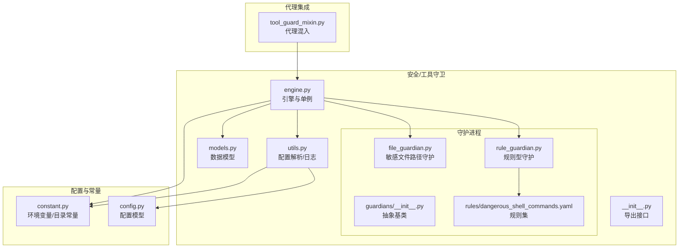
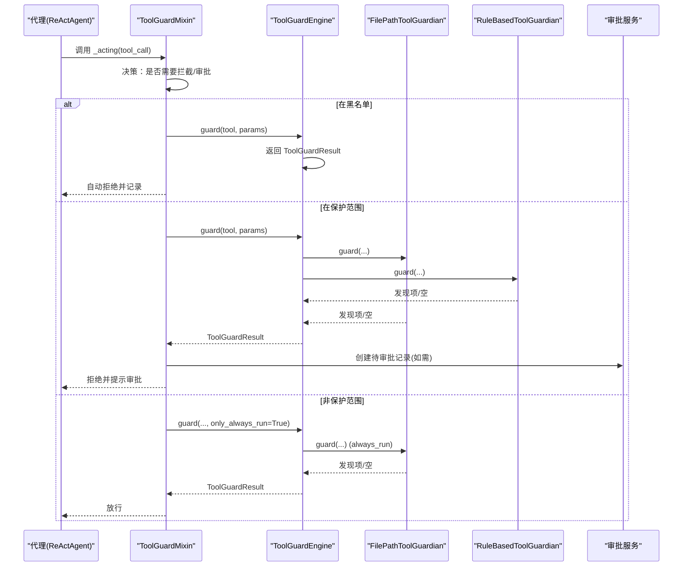
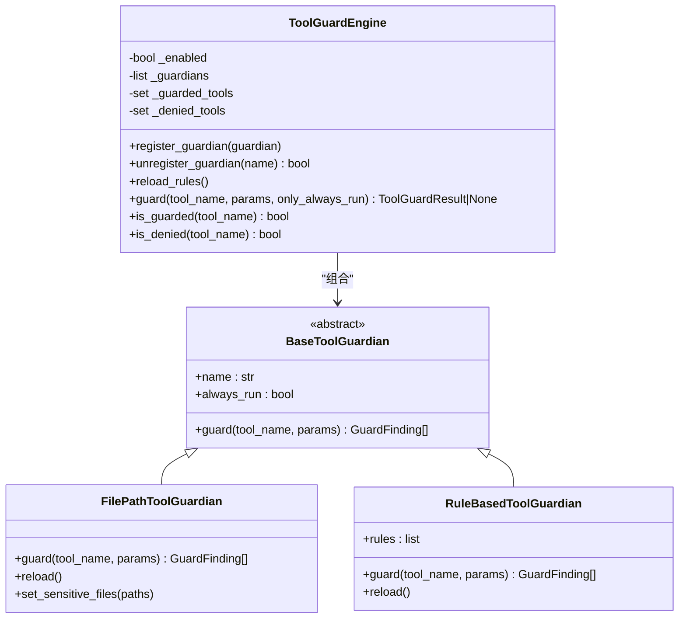
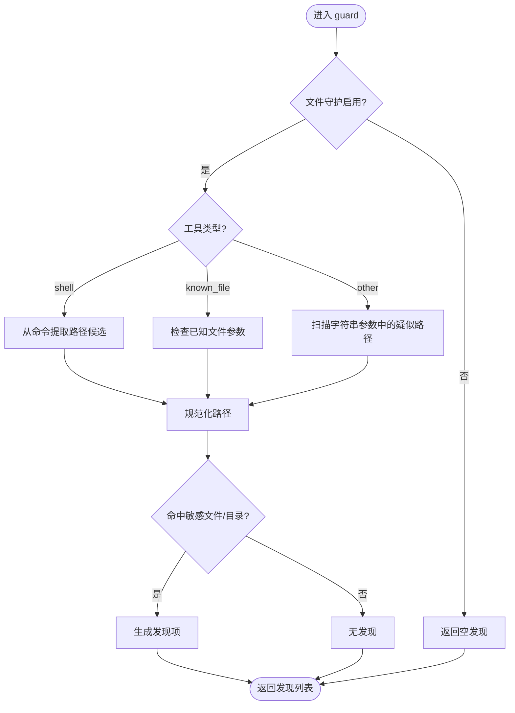
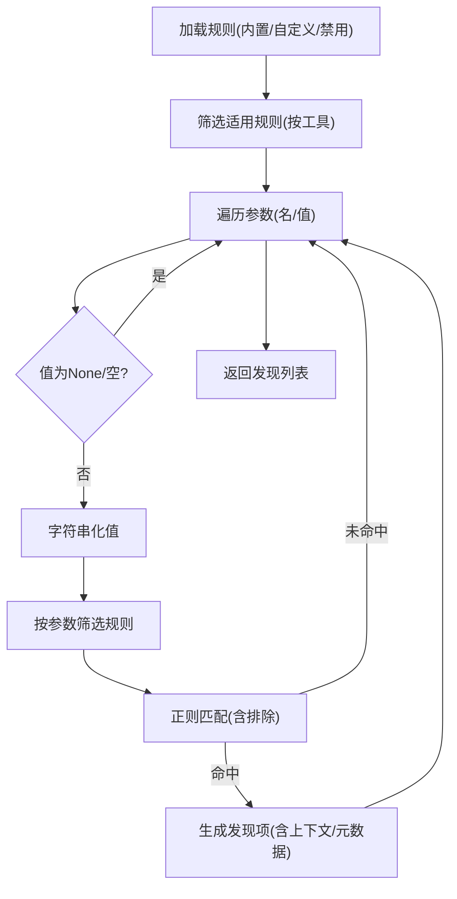
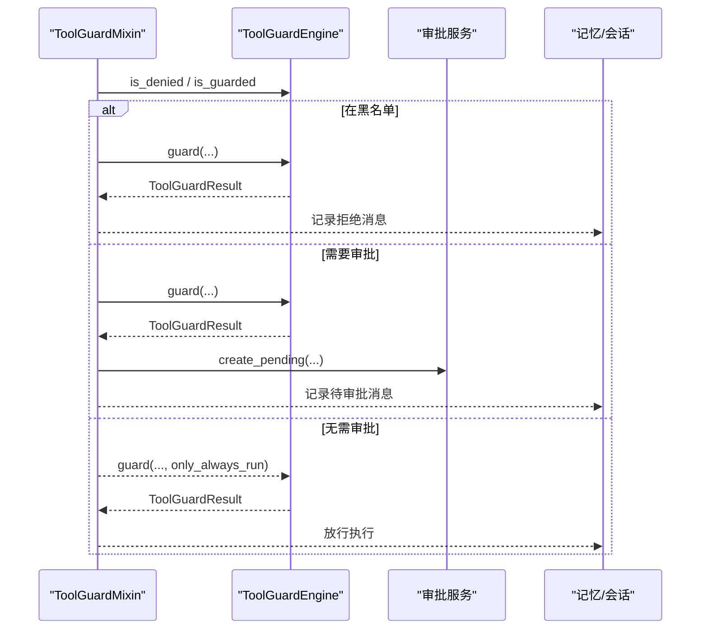
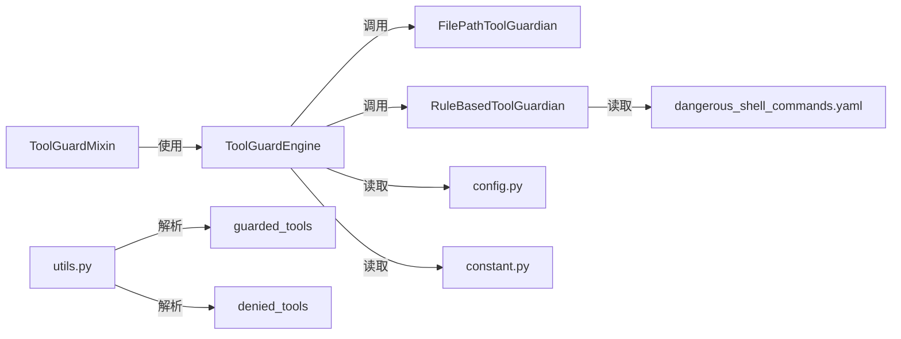

# 工具守卫引擎

<cite>
**本文引用的文件**
- [engine.py](file://src/qwenpaw/security/tool_guard/engine.py)
- [__init__.py](file://src/qwenpaw/security/tool_guard/__init__.py)
- [models.py](file://src/qwenpaw/security/tool_guard/models.py)
- [utils.py](file://src/qwenpaw/security/tool_guard/utils.py)
- [guardians/__init__.py](file://src/qwenpaw/security/tool_guard/guardians/__init__.py)
- [file_guardian.py](file://src/qwenpaw/security/tool_guard/guardians/file_guardian.py)
- [rule_guardian.py](file://src/qwenpaw/security/tool_guard/guardians/rule_guardian.py)
- [dangerous_shell_commands.yaml](file://src/qwenpaw/security/tool_guard/rules/dangerous_shell_commands.yaml)
- [tool_guard_mixin.py](file://src/qwenpaw/agents/tool_guard_mixin.py)
- [constant.py](file://src/qwenpaw/constant.py)
- [config.py](file://src/qwenpaw/config/config.py)
</cite>

## 目录
1. [简介](#简介)
2. [项目结构](#项目结构)
3. [核心组件](#核心组件)
4. [架构总览](#架构总览)
5. [详细组件分析](#详细组件分析)
6. [依赖分析](#依赖分析)
7. [性能考虑](#性能考虑)
8. [故障排查指南](#故障排查指南)
9. [结论](#结论)
10. [附录](#附录)

## 简介
本文件为 QwenPaw 工具守卫引擎的技术文档，聚焦于“工具调用前”的安全检查与风险控制。引擎通过懒加载单例模式提供统一入口，协调多个守护进程（Guardian），对工具参数进行参数验证、威胁检测与风险评估，并支持动态配置重载与审批流程集成。文档同时覆盖默认守护进程集合的初始化、危险命令拦截规则、白名单/黑名单配置管理、以及自定义守护进程的开发与集成方法。

## 项目结构
工具守卫相关代码主要位于 src/qwenpaw/security/tool_guard 及其子模块，配合 agents 中的 ToolGuardMixin 实现与代理的深度集成。

图表来源
- [engine.py:53-238](file://src/qwenpaw/security/tool_guard/engine.py#L53-L238)
- [__init__.py:1-59](file://src/qwenpaw/security/tool_guard/__init__.py#L1-L59)
- [models.py:1-185](file://src/qwenpaw/security/tool_guard/models.py#L1-L185)
- [utils.py:1-164](file://src/qwenpaw/security/tool_guard/utils.py#L1-L164)
- [guardians/__init__.py:1-62](file://src/qwenpaw/security/tool_guard/guardians/__init__.py#L1-L62)
- [file_guardian.py:1-365](file://src/qwenpaw/security/tool_guard/guardians/file_guardian.py#L1-L365)
- [rule_guardian.py:1-758](file://src/qwenpaw/security/tool_guard/guardians/rule_guardian.py#L1-L758)
- [dangerous_shell_commands.yaml:1-187](file://src/qwenpaw/security/tool_guard/rules/dangerous_shell_commands.yaml#L1-L187)
- [tool_guard_mixin.py:1-853](file://src/qwenpaw/agents/tool_guard_mixin.py#L1-L853)
- [constant.py:1-200](file://src/qwenpaw/constant.py#L1-L200)
- [config.py:1-200](file://src/qwenpaw/config/config.py#L1-L200)

章节来源
- [engine.py:1-238](file://src/qwenpaw/security/tool_guard/engine.py#L1-L238)
- [__init__.py:1-59](file://src/qwenpaw/security/tool_guard/__init__.py#L1-L59)
- [models.py:1-185](file://src/qwenpaw/security/tool_guard/models.py#L1-L185)
- [utils.py:1-164](file://src/qwenpaw/security/tool_guard/utils.py#L1-L164)
- [guardians/__init__.py:1-62](file://src/qwenpaw/security/tool_guard/guardians/__init__.py#L1-L62)
- [file_guardian.py:1-365](file://src/qwenpaw/security/tool_guard/guardians/file_guardian.py#L1-L365)
- [rule_guardian.py:1-758](file://src/qwenpaw/security/tool_guard/guardians/rule_guardian.py#L1-L758)
- [dangerous_shell_commands.yaml:1-187](file://src/qwenpaw/security/tool_guard/rules/dangerous_shell_commands.yaml#L1-L187)
- [tool_guard_mixin.py:1-853](file://src/qwenpaw/agents/tool_guard_mixin.py#L1-L853)
- [constant.py:1-200](file://src/qwenpaw/constant.py#L1-L200)
- [config.py:1-200](file://src/qwenpaw/config/config.py#L1-L200)

## 核心组件
- 引擎与单例
  - ToolGuardEngine：负责注册/注销守护进程、按作用域与黑名单过滤工具、执行守护并聚合结果、动态重载规则与配置。
  - get_guard_engine：懒加载单例，避免重复初始化。
- 守护进程
  - BaseToolGuardian：抽象基类，定义 guard 接口与 always_run 行为。
  - FilePathToolGuardian：基于敏感文件/目录集合与路径提取逻辑，阻断敏感路径访问。
  - RuleBasedToolGuardian：基于 YAML 规则集的正则匹配守护，支持自定义规则与禁用规则。
- 数据模型
  - GuardFinding/ToolGuardResult：封装发现项、聚合结果、严重级别与统计信息。
- 配置与工具集解析
  - resolve_guarded_tools/resolve_denied_tools：从环境变量、配置文件、默认集合解析受保护与禁止工具集。
- 代理集成
  - ToolGuardMixin：在 ReActAgent 的 _acting/_reasoning 生命周期中插入拦截、审批与回放逻辑。

章节来源
- [engine.py:53-238](file://src/qwenpaw/security/tool_guard/engine.py#L53-L238)
- [guardians/__init__.py:17-62](file://src/qwenpaw/security/tool_guard/guardians/__init__.py#L17-L62)
- [file_guardian.py:184-365](file://src/qwenpaw/security/tool_guard/guardians/file_guardian.py#L184-L365)
- [rule_guardian.py:559-758](file://src/qwenpaw/security/tool_guard/guardians/rule_guardian.py#L559-L758)
- [models.py:60-185](file://src/qwenpaw/security/tool_guard/models.py#L60-L185)
- [utils.py:64-164](file://src/qwenpaw/security/tool_guard/utils.py#L64-L164)
- [tool_guard_mixin.py:45-853](file://src/qwenpaw/agents/tool_guard_mixin.py#L45-L853)

## 架构总览
工具守卫引擎采用“懒加载单例 + 多守护进程协调”的架构，核心流程如下：

图表来源
- [tool_guard_mixin.py:261-396](file://src/qwenpaw/agents/tool_guard_mixin.py#L261-L396)
- [engine.py:169-226](file://src/qwenpaw/security/tool_guard/engine.py#L169-L226)
- [file_guardian.py:313-365](file://src/qwenpaw/security/tool_guard/guardians/file_guardian.py#L313-L365)
- [rule_guardian.py:608-758](file://src/qwenpaw/security/tool_guard/guardians/rule_guardian.py#L608-L758)

## 详细组件分析

### 引擎与懒加载单例
- 单例实现
  - 使用全局变量缓存实例，首次访问时构造 ToolGuardEngine。
  - 通过 _guard_enabled 判定开关优先级：环境变量 > 配置文件 > 默认开启。
- 默认守护进程集合
  - 初始化时尝试构造 FilePathToolGuardian 与 RuleBasedToolGuardian；失败会记录警告但不影响其他守护进程。
- 注册/注销与动态重载
  - register_guardian/unregister_guardian：运行时增删守护进程。
  - reload_rules：逐个调用守护进程的 reload 并刷新工具集。
- 工具集与黑名单
  - guarded_tools：None 表示全量保护；空集表示不保护；支持通配符与关闭值。
  - denied_tools：无条件拒绝的工具集合。
- 结果聚合
  - 统计使用过的守护进程、失败的守护进程、耗时与最高严重级别。

图表来源
- [engine.py:53-238](file://src/qwenpaw/security/tool_guard/engine.py#L53-L238)
- [guardians/__init__.py:17-62](file://src/qwenpaw/security/tool_guard/guardians/__init__.py#L17-L62)
- [file_guardian.py:184-365](file://src/qwenpaw/security/tool_guard/guardians/file_guardian.py#L184-L365)
- [rule_guardian.py:559-758](file://src/qwenpaw/security/tool_guard/guardians/rule_guardian.py#L559-L758)

章节来源
- [engine.py:35-238](file://src/qwenpaw/security/tool_guard/engine.py#L35-L238)
- [guardians/__init__.py:17-62](file://src/qwenpaw/security/tool_guard/guardians/__init__.py#L17-L62)

### 敏感文件路径守护（FilePathToolGuardian）
- 功能要点
  - 基于配置加载敏感文件/目录集合，兼容历史与当前密钥目录。
  - 对 execute_shell_command 提取命令中的路径候选；对已知文件工具参数直接扫描；对其他工具扫描字符串参数中疑似路径。
  - 路径规范化与相对路径解析，支持目录型阻断。
- 关键算法
  - 路径提取：shlex 分词 + 重定向操作符分离/拼接，去重稳定保留。
  - 路径判定：绝对化后判断是否命中敏感文件或处于敏感目录内。
- 配置来源
  - security.file_guard.enabled 与 sensitive_files 由配置模型提供；若为空则回退到默认敏感目录集合。

图表来源
- [file_guardian.py:313-365](file://src/qwenpaw/security/tool_guard/guardians/file_guardian.py#L313-L365)
- [file_guardian.py:134-182](file://src/qwenpaw/security/tool_guard/guardians/file_guardian.py#L134-L182)
- [file_guardian.py:244-247](file://src/qwenpaw/security/tool_guard/guardians/file_guardian.py#L244-L247)

章节来源
- [file_guardian.py:1-365](file://src/qwenpaw/security/tool_guard/guardians/file_guardian.py#L1-L365)

### 规则型守护（RuleBasedToolGuardian）
- 规则加载
  - 默认规则目录：rules/；默认加载 dangerous_shell_commands.yaml。
  - 支持自定义规则与禁用规则，来自配置模型 security.tool_guard.custom_rules 与 disabled_rules。
- 匹配策略
  - 将参数值转为字符串后，按工具/参数维度筛选适用规则，逐条正则匹配并生成发现项。
  - 支持排除模式（exclude_patterns）。
- 特殊增强
  - rm 命令：额外检测目标是否位于工作区外，生成结构化元数据用于 UI 提示与风险提醒。
- 性能优化
  - 预编译正则表达式；长串截断上下文片段；仅在必要时进行路径解析与边界检查。

图表来源
- [rule_guardian.py:583-594](file://src/qwenpaw/security/tool_guard/guardians/rule_guardian.py#L583-L594)
- [rule_guardian.py:608-758](file://src/qwenpaw/security/tool_guard/guardians/rule_guardian.py#L608-L758)
- [dangerous_shell_commands.yaml:1-187](file://src/qwenpaw/security/tool_guard/rules/dangerous_shell_commands.yaml#L1-L187)

章节来源
- [rule_guardian.py:1-758](file://src/qwenpaw/security/tool_guard/guardians/rule_guardian.py#L1-L758)
- [dangerous_shell_commands.yaml:1-187](file://src/qwenpaw/security/tool_guard/rules/dangerous_shell_commands.yaml#L1-L187)

### 工具调用前拦截与审批流程（ToolGuardMixin）
- 拦截决策
  - 黑名单直拒；保护范围内先尝试一次性预审批，否则执行所有守护进程；非保护范围仅执行 always_run 的守护进程。
- 审批与回放
  - 若需要审批，向审批服务提交待审批记录，同时保留思考块与剩余队列以便后续回放。
  - 支持清理被拦截的消息与回放完成后的自然退出。
- 锁与并发
  - 决策阶段加锁保证状态一致性；实际工具执行阶段释放锁以保持并行。

图表来源
- [tool_guard_mixin.py:316-396](file://src/qwenpaw/agents/tool_guard_mixin.py#L316-L396)
- [tool_guard_mixin.py:447-615](file://src/qwenpaw/agents/tool_guard_mixin.py#L447-L615)

章节来源
- [tool_guard_mixin.py:1-853](file://src/qwenpaw/agents/tool_guard_mixin.py#L1-L853)

### 配置与工具集解析（resolve_guarded_tools / resolve_denied_tools）
- 工具集解析优先级
  - 用户传入 > 环境变量 > 配置文件 > 默认高危集合。
  - 环境变量支持通配符与关闭值；配置文件通过 Pydantic 模型读取。
- 日志输出
  - log_findings：按严重级别输出结构化日志，便于审计与告警。

章节来源
- [utils.py:64-164](file://src/qwenpaw/security/tool_guard/utils.py#L64-L164)
- [constant.py:28-87](file://src/qwenpaw/constant.py#L28-L87)
- [config.py:1-200](file://src/qwenpaw/config/config.py#L1-L200)

### 危险命令拦截规则
- 规则类别
  - rm/mv 破坏性文件操作、文件系统破坏、拒绝服务/炸弹程序、管道下载执行、反向连接/隧道、凭证与计划任务访问、权限变更、混淆与规避、系统重启/关机、服务管理、进程终止、提权等。
- 规则格式
  - id、tools/params、category、severity、patterns/exclude_patterns、description/remediation。
- 规则加载
  - 默认从 rules/dangerous_shell_commands.yaml 加载；可结合配置模型的 custom_rules 与 disabled_rules 进行扩展与禁用。

章节来源
- [dangerous_shell_commands.yaml:1-187](file://src/qwenpaw/security/tool_guard/rules/dangerous_shell_commands.yaml#L1-L187)
- [rule_guardian.py:432-511](file://src/qwenpaw/security/tool_guard/guardians/rule_guardian.py#L432-L511)
- [rule_guardian.py:518-552](file://src/qwenpaw/security/tool_guard/guardians/rule_guardian.py#L518-L552)

### 白名单/黑名单与动态配置重载
- 白名单/黑名单
  - guarded_tools：受保护工具集合；None 表示全量保护。
  - denied_tools：无条件拒绝集合。
- 动态重载
  - reload_rules：重新加载规则与工具集；守护进程的 reload 由各自实现决定。
- 环境变量与配置文件
  - QWENPAW_TOOL_GUARD_ENABLED、QWENPAW_TOOL_GUARD_TOOLS、QWENPAW_TOOL_GUARD_DENIED_TOOLS 等。

章节来源
- [engine.py:141-154](file://src/qwenpaw/security/tool_guard/engine.py#L141-L154)
- [utils.py:64-127](file://src/qwenpaw/security/tool_guard/utils.py#L64-L127)
- [constant.py:28-87](file://src/qwenpaw/constant.py#L28-L87)

### 自定义守护进程开发指南
- 实现步骤
  - 继承 BaseToolGuardian，实现 guard 方法；如需始终运行，设置 always_run=True。
  - 在构造函数中加载所需配置或规则；实现 reload 方法以支持动态重载。
  - 在 ToolGuardEngine 中注册：engine.register_guardian(YourGuardian())。
- 注意事项
  - guard 返回空列表表示未发现问题；异常会被捕获并记录到 ToolGuardResult.guardians_failed。
  - 严格遵循参数签名与类型约定，确保与引擎聚合流程兼容。

章节来源
- [guardians/__init__.py:17-62](file://src/qwenpaw/security/tool_guard/guardians/__init__.py#L17-L62)
- [engine.py:108-121](file://src/qwenpaw/security/tool_guard/engine.py#L108-L121)
- [engine.py:210-224](file://src/qwenpaw/security/tool_guard/engine.py#L210-L224)

## 依赖分析
- 组件耦合
  - ToolGuardEngine 与各守护进程松耦合，通过抽象接口交互；新增守护进程无需修改引擎。
  - RuleBasedToolGuardian 依赖 YAML 规则文件与配置模型；FilePathToolGuardian 依赖配置与工作区上下文。
- 外部依赖
  - 配置加载：qwenpaw.config.load_config；环境变量：EnvVarLoader。
  - 代理集成：agentscope 的 Msg/ToolUseBlock/ToolResultBlock。

图表来源
- [engine.py:141-154](file://src/qwenpaw/security/tool_guard/engine.py#L141-L154)
- [utils.py:64-127](file://src/qwenpaw/security/tool_guard/utils.py#L64-L127)
- [rule_guardian.py:432-511](file://src/qwenpaw/security/tool_guard/guardians/rule_guardian.py#L432-L511)
- [tool_guard_mixin.py:57-70](file://src/qwenpaw/agents/tool_guard_mixin.py#L57-L70)
- [constant.py:28-87](file://src/qwenpaw/constant.py#L28-L87)
- [config.py:1-200](file://src/qwenpaw/config/config.py#L1-L200)

章节来源
- [engine.py:1-238](file://src/qwenpaw/security/tool_guard/engine.py#L1-L238)
- [utils.py:1-164](file://src/qwenpaw/security/tool_guard/utils.py#L1-L164)
- [rule_guardian.py:1-758](file://src/qwenpaw/security/tool_guard/guardians/rule_guardian.py#L1-L758)
- [tool_guard_mixin.py:1-853](file://src/qwenpaw/agents/tool_guard_mixin.py#L1-L853)
- [constant.py:1-200](file://src/qwenpaw/constant.py#L1-L200)
- [config.py:1-200](file://src/qwenpaw/config/config.py#L1-L200)

## 性能考虑
- 规则匹配
  - 预编译正则表达式，减少重复编译开销；仅在适用工具/参数上匹配。
- 字符串扫描
  - 将参数值转换为字符串后再扫描，避免复杂对象序列化成本。
- 路径提取
  - shell 命令路径提取采用分词与重定向操作符处理，尽量减少误报与漏报。
- 并发与锁
  - 决策阶段加锁，执行阶段释放锁，兼顾一致性与吞吐。
- 日志与统计
  - 仅在高严重级别时使用警告日志，降低 I/O 压力；结果中包含耗时与使用过的守护进程列表，便于监控。

[本节为通用指导，无需列出具体文件来源]

## 故障排查指南
- 守护进程异常
  - 引擎会捕获守护进程的异常并记录到 ToolGuardResult.guardians_failed，检查对应守护进程的 reload 与配置。
- 规则加载失败
  - YAML 解析失败或规则无效会被跳过并记录警告；检查规则文件语法与字段完整性。
- 路径解析问题
  - FilePathToolGuardian 在路径规范化与工作区边界检查中可能抛出异常；确认工作区根目录与环境变量设置。
- 审批流程异常
  - ToolGuardMixin 在审批服务调用失败时会记录警告并回退到正常推理；检查会话 ID、通道与审批服务可用性。

章节来源
- [engine.py:210-224](file://src/qwenpaw/security/tool_guard/engine.py#L210-L224)
- [rule_guardian.py:432-465](file://src/qwenpaw/security/tool_guard/guardians/rule_guardian.py#L432-L465)
- [file_guardian.py:120-132](file://src/qwenpaw/security/tool_guard/guardians/file_guardian.py#L120-L132)
- [tool_guard_mixin.py:190-201](file://src/qwenpaw/agents/tool_guard_mixin.py#L190-L201)

## 结论
工具守卫引擎通过懒加载单例与多守护进程协作，实现了对工具调用前的参数验证、威胁检测与风险评估。默认守护进程覆盖敏感文件路径与危险命令规则，支持动态配置重载与审批流程集成。开发者可通过实现 BaseToolGuardian 快速扩展新的检测能力，满足不同场景下的安全需求。

[本节为总结性内容，无需列出具体文件来源]

## 附录
- 关键环境变量
  - QWENPAW_TOOL_GUARD_ENABLED：总开关
  - QWENPAW_TOOL_GUARD_TOOLS：受保护工具集（支持通配符与关闭值）
  - QWENPAW_TOOL_GUARD_DENIED_TOOLS：禁止工具集
- 配置模型字段
  - security.tool_guard.enabled、security.tool_guard.guarded_tools、security.tool_guard.denied_tools、security.tool_guard.custom_rules、security.tool_guard.disabled_rules
- 规则文件
  - rules/dangerous_shell_commands.yaml：默认危险命令规则集

章节来源
- [constant.py:28-87](file://src/qwenpaw/constant.py#L28-L87)
- [config.py:1-200](file://src/qwenpaw/config/config.py#L1-L200)
- [utils.py:64-127](file://src/qwenpaw/security/tool_guard/utils.py#L64-L127)
- [dangerous_shell_commands.yaml:1-187](file://src/qwenpaw/security/tool_guard/rules/dangerous_shell_commands.yaml#L1-L187)