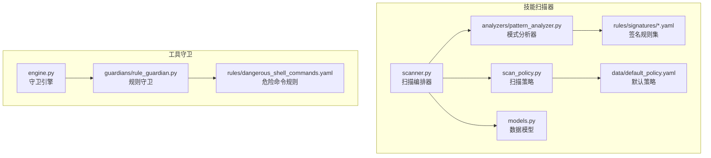
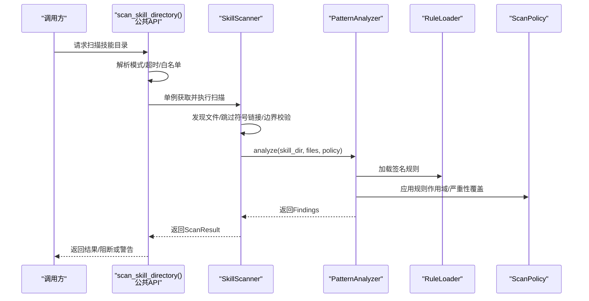
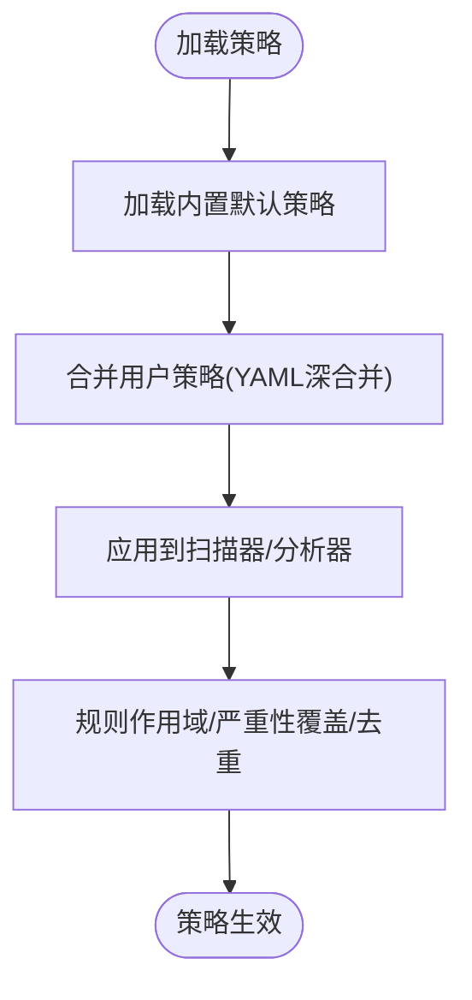
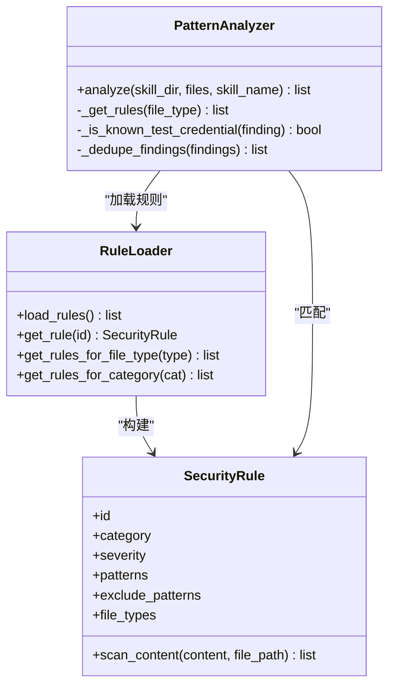
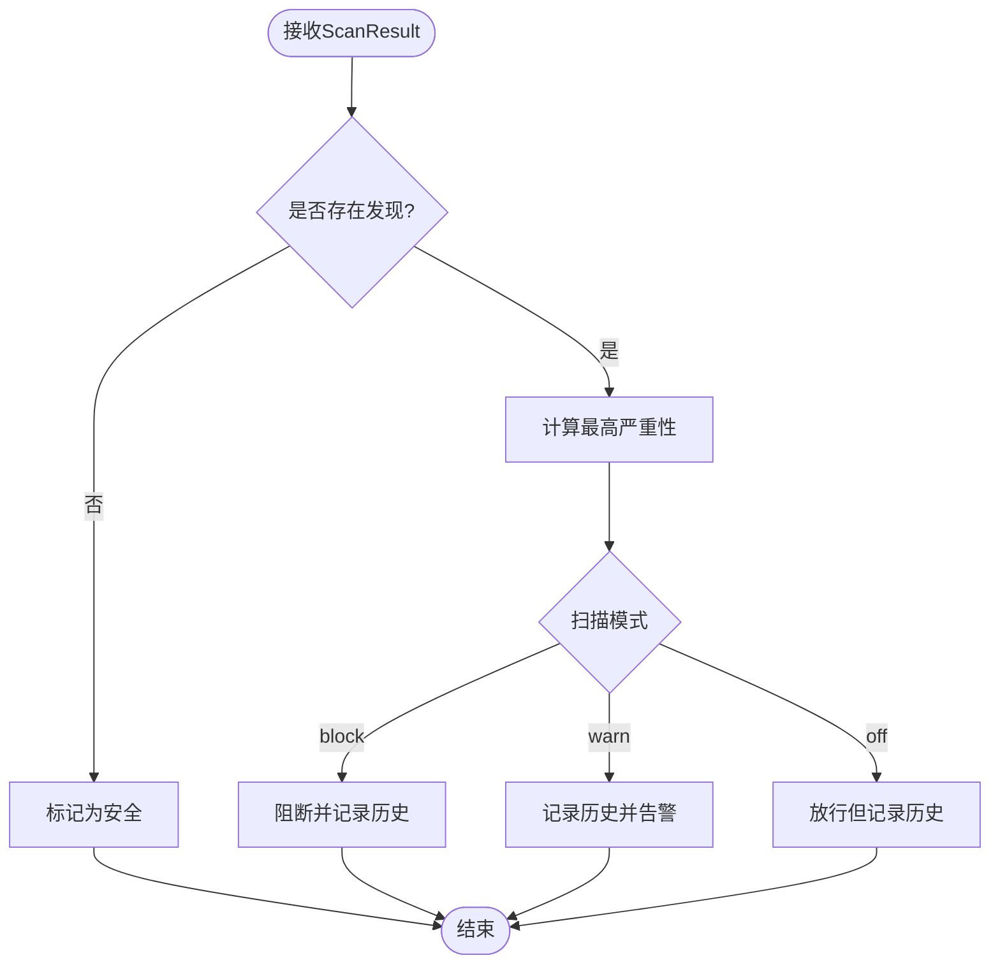
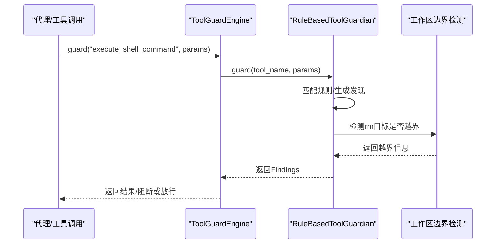
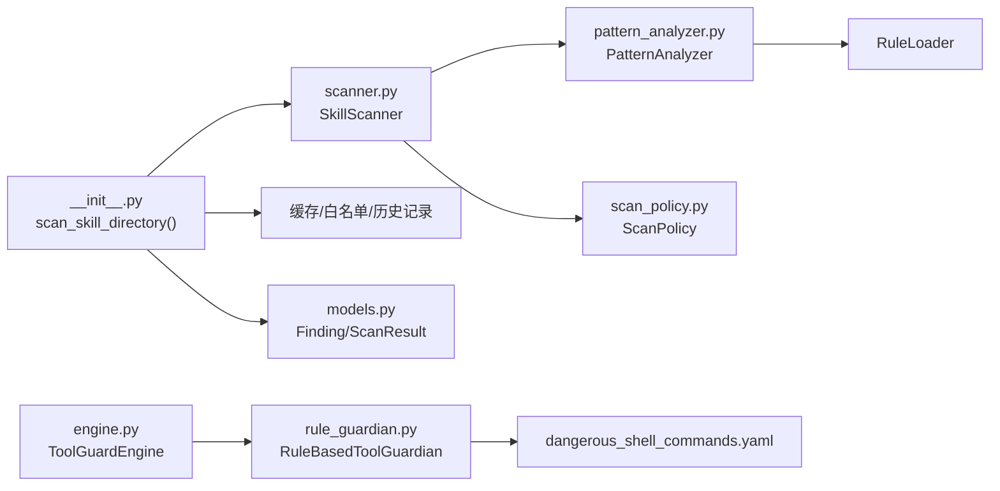

# 技能安全扫描

<cite>
**本文引用的文件**
- [src/qwenpaw/security/skill_scanner/__init__.py](file://src/qwenpaw/security/skill_scanner/__init__.py)
- [src/qwenpaw/security/skill_scanner/scanner.py](file://src/qwenpaw/security/skill_scanner/scanner.py)
- [src/qwenpaw/security/skill_scanner/scan_policy.py](file://src/qwenpaw/security/skill_scanner/scan_policy.py)
- [src/qwenpaw/security/skill_scanner/models.py](file://src/qwenpaw/security/skill_scanner/models.py)
- [src/qwenpaw/security/skill_scanner/data/default_policy.yaml](file://src/qwenpaw/security/skill_scanner/data/default_policy.yaml)
- [src/qwenpaw/security/skill_scanner/analyzers/pattern_analyzer.py](file://src/qwenpaw/security/skill_scanner/analyzers/pattern_analyzer.py)
- [src/qwenpaw/security/skill_scanner/rules/signatures/command_injection.yaml](file://src/qwenpaw/security/skill_scanner/rules/signatures/command_injection.yaml)
- [src/qwenpaw/security/skill_scanner/rules/signatures/data_exfiltration.yaml](file://src/qwenpaw/security/skill_scanner/rules/signatures/data_exfiltration.yaml)
- [src/qwenpaw/security/skill_scanner/rules/signatures/hardcoded_secrets.yaml](file://src/qwenpaw/security/skill_scanner/rules/signatures/hardcoded_secrets.yaml)
- [src/qwenpaw/security/skill_scanner/rules/signatures/obfuscation.yaml](file://src/qwenpaw/security/skill_scanner/rules/signatures/obfuscation.yaml)
- [src/qwenpaw/security/skill_scanner/rules/signatures/prompt_injection.yaml](file://src/qwenpaw/security/skill_scanner/rules/signatures/prompt_injection.yaml)
- [src/qwenpaw/security/skill_scanner/rules/signatures/social_engineering.yaml](file://src/qwenpaw/security/skill_scanner/rules/signatures/social_engineering.yaml)
- [src/qwenpaw/security/tool_guard/engine.py](file://src/qwenpaw/security/tool_guard/engine.py)
- [src/qwenpaw/security/tool_guard/guardians/rule_guardian.py](file://src/qwenpaw/security/tool_guard/guardians/rule_guardian.py)
- [src/qwenpaw/security/tool_guard/rules/dangerous_shell_commands.yaml](file://src/qwenpaw/security/tool_guard/rules/dangerous_shell_commands.yaml)
</cite>

## 目录
1. [引言](#引言)
2. [项目结构](#项目结构)
3. [核心组件](#核心组件)
4. [架构总览](#架构总览)
5. [详细组件分析](#详细组件分析)
6. [依赖关系分析](#依赖关系分析)
7. [性能考虑](#性能考虑)
8. [故障排查指南](#故障排查指南)
9. [结论](#结论)
10. [附录](#附录)

## 引言
本文件面向QwenPaw“技能安全扫描”系统，提供从架构、策略、规则、性能到与“工具守卫”系统集成的全栈技术文档。系统通过“静态签名匹配”的轻量基线扫描器，结合可扩展的策略与规则引擎，实现对技能包的快速安全扫描；同时在运行期通过“工具守卫”对工具调用参数进行实时阻断与审批联动，形成“入库扫描 + 出库守护”的双层安全防线。

## 项目结构
技能安全扫描相关代码主要位于src/qwenpaw/security目录下，分为两大部分：
- 技能扫描器（skill_scanner）：负责对技能包进行静态扫描，基于YAML签名规则进行正则匹配，支持策略化过滤、去重与缓存。
- 工具守卫（tool_guard）：负责对工具调用参数进行实时安全检查，针对高危命令模式进行阻断或提示。

图表来源
- [src/qwenpaw/security/skill_scanner/scanner.py:76-319](file://src/qwenpaw/security/skill_scanner/scanner.py#L76-L319)
- [src/qwenpaw/security/skill_scanner/scan_policy.py:156-476](file://src/qwenpaw/security/skill_scanner/scan_policy.py#L156-L476)
- [src/qwenpaw/security/skill_scanner/models.py:19-235](file://src/qwenpaw/security/skill_scanner/models.py#L19-L235)
- [src/qwenpaw/security/skill_scanner/analyzers/pattern_analyzer.py:236-393](file://src/qwenpaw/security/skill_scanner/analyzers/pattern_analyzer.py#L236-L393)
- [src/qwenpaw/security/skill_scanner/data/default_policy.yaml:1-243](file://src/qwenpaw/security/skill_scanner/data/default_policy.yaml#L1-L243)
- [src/qwenpaw/security/tool_guard/engine.py:53-238](file://src/qwenpaw/security/tool_guard/engine.py#L53-L238)
- [src/qwenpaw/security/tool_guard/guardians/rule_guardian.py:559-758](file://src/qwenpaw/security/tool_guard/guardians/rule_guardian.py#L559-L758)

章节来源
- [src/qwenpaw/security/skill_scanner/__init__.py:1-514](file://src/qwenpaw/security/skill_scanner/__init__.py#L1-L514)
- [src/qwenpaw/security/skill_scanner/scanner.py:76-319](file://src/qwenpaw/security/skill_scanner/scanner.py#L76-L319)
- [src/qwenpaw/security/skill_scanner/scan_policy.py:156-476](file://src/qwenpaw/security/skill_scanner/scan_policy.py#L156-L476)
- [src/qwenpaw/security/skill_scanner/models.py:19-235](file://src/qwenpaw/security/skill_scanner/models.py#L19-L235)
- [src/qwenpaw/security/skill_scanner/data/default_policy.yaml:1-243](file://src/qwenpaw/security/skill_scanner/data/default_policy.yaml#L1-L243)
- [src/qwenpaw/security/tool_guard/engine.py:53-238](file://src/qwenpaw/security/tool_guard/engine.py#L53-L238)
- [src/qwenpaw/security/tool_guard/guardians/rule_guardian.py:559-758](file://src/qwenpaw/security/tool_guard/guardians/rule_guardian.py#L559-L758)

## 核心组件
- 扫描编排器（SkillScanner）：遍历技能目录，发现可扫描文件，按策略筛选并调用各分析器，聚合结果。
- 策略系统（ScanPolicy）：组织隐藏文件、规则作用域、凭证白名单、文件分类、阈值与严重性覆盖等，支持从YAML加载与合并。
- 模式分析器（PatternAnalyzer）：从签名规则集中加载规则，对文件内容进行行级与多行正则匹配，支持排除模式、严重性覆盖与去重。
- 数据模型（Finding/ScanResult/Severity/ThreatCategory）：统一表示扫描发现、结果聚合与严重性排序。
- 守卫引擎（ToolGuardEngine）：对工具调用参数进行实时扫描，支持注册多个守卫，按配置启用/禁用与规则重载。
- 规则守卫（RuleBasedToolGuardian）：加载危险命令规则，对execute_shell_command等高危工具的参数进行匹配与增强提示（如rm跨工作区检测）。

章节来源
- [src/qwenpaw/security/skill_scanner/scanner.py:76-242](file://src/qwenpaw/security/skill_scanner/scanner.py#L76-L242)
- [src/qwenpaw/security/skill_scanner/scan_policy.py:156-476](file://src/qwenpaw/security/skill_scanner/scan_policy.py#L156-L476)
- [src/qwenpaw/security/skill_scanner/analyzers/pattern_analyzer.py:236-347](file://src/qwenpaw/security/skill_scanner/analyzers/pattern_analyzer.py#L236-L347)
- [src/qwenpaw/security/skill_scanner/models.py:19-235](file://src/qwenpaw/security/skill_scanner/models.py#L19-L235)
- [src/qwenpaw/security/tool_guard/engine.py:53-227](file://src/qwenpaw/security/tool_guard/engine.py#L53-L227)
- [src/qwenpaw/security/tool_guard/guardians/rule_guardian.py:559-758](file://src/qwenpaw/security/tool_guard/guardians/rule_guardian.py#L559-L758)

## 架构总览
系统采用“策略驱动 + 规则引擎 + 缓存”的轻量扫描架构，扫描入口提供懒加载单例与缓存，分析器以插件形式可扩展；运行期通过工具守卫对高危工具调用进行阻断与审批提示。

图表来源
- [src/qwenpaw/security/skill_scanner/__init__.py:424-514](file://src/qwenpaw/security/skill_scanner/__init__.py#L424-L514)
- [src/qwenpaw/security/skill_scanner/scanner.py:148-242](file://src/qwenpaw/security/skill_scanner/scanner.py#L148-L242)
- [src/qwenpaw/security/skill_scanner/analyzers/pattern_analyzer.py:265-347](file://src/qwenpaw/security/skill_scanner/analyzers/pattern_analyzer.py#L265-L347)
- [src/qwenpaw/security/skill_scanner/scan_policy.py:236-282](file://src/qwenpaw/security/skill_scanner/scan_policy.py#L236-L282)

## 详细组件分析

### 扫描策略与配置管理
- 默认策略：内置default_policy.yaml，定义隐藏文件、规则作用域、凭证白名单、文件分类、阈值与严重性覆盖等。
- 组织策略：支持从YAML加载并覆盖默认策略，采用深合并策略仅覆盖指定键。
- 运行时策略：扫描器在构造时注入策略，分析器按策略应用规则过滤、文档路径跳过、代码文件限定与去重。

图表来源
- [src/qwenpaw/security/skill_scanner/scan_policy.py:236-304](file://src/qwenpaw/security/skill_scanner/scan_policy.py#L236-L304)
- [src/qwenpaw/security/skill_scanner/data/default_policy.yaml:1-243](file://src/qwenpaw/security/skill_scanner/data/default_policy.yaml#L1-L243)

章节来源
- [src/qwenpaw/security/skill_scanner/scan_policy.py:156-476](file://src/qwenpaw/security/skill_scanner/scan_policy.py#L156-L476)
- [src/qwenpaw/security/skill_scanner/data/default_policy.yaml:1-243](file://src/qwenpaw/security/skill_scanner/data/default_policy.yaml#L1-L243)

### 恶意代码检测算法与威胁类型
- 命令注入：覆盖Python/JS/Shell等多语言的危险函数、字符串格式化拼接、子进程shell=True、find -exec等。
- 数据泄露：网络请求、socket连接、敏感文件读取、base64编码+网络组合等。
- 硬编码密钥：AWS/GitHub/Stripe/私钥块、连接串、密码变量等。
- 混淆与恶意：base64解码+执行链、十六进制大块、XOR编码、二进制文件等。
- 提示词注入：覆盖系统指令、禁用安全策略、隐藏动作等。
- 社会工程：描述模糊、品牌冒用等。

章节来源
- [src/qwenpaw/security/skill_scanner/rules/signatures/command_injection.yaml:1-195](file://src/qwenpaw/security/skill_scanner/rules/signatures/command_injection.yaml#L1-L195)
- [src/qwenpaw/security/skill_scanner/rules/signatures/data_exfiltration.yaml:1-142](file://src/qwenpaw/security/skill_scanner/rules/signatures/data_exfiltration.yaml#L1-L142)
- [src/qwenpaw/security/skill_scanner/rules/signatures/hardcoded_secrets.yaml:1-150](file://src/qwenpaw/security/skill_scanner/rules/signatures/hardcoded_secrets.yaml#L1-L150)
- [src/qwenpaw/security/skill_scanner/rules/signatures/obfuscation.yaml:1-47](file://src/qwenpaw/security/skill_scanner/rules/signatures/obfuscation.yaml#L1-L47)
- [src/qwenpaw/security/skill_scanner/rules/signatures/prompt_injection.yaml:1-80](file://src/qwenpaw/security/skill_scanner/rules/signatures/prompt_injection.yaml#L1-L80)
- [src/qwenpaw/security/skill_scanner/rules/signatures/social_engineering.yaml:1-28](file://src/qwenpaw/security/skill_scanner/rules/signatures/social_engineering.yaml#L1-L28)

### 签名规则系统与规则引擎
- 规则加载：RuleLoader从目录或文件加载YAML列表，构建SecurityRule对象并索引。
- 匹配策略：行级正则优先，对含换行的模式进行多行匹配；支持排除模式与文件类型限定。
- 严重性与去重：支持策略级严重性覆盖与重复发现去重；内置已知测试凭证自动抑制。
- 分析器接口：BaseAnalyzer约定analyze方法，PatternAnalyzer作为默认实现。

图表来源
- [src/qwenpaw/security/skill_scanner/analyzers/pattern_analyzer.py:38-156](file://src/qwenpaw/security/skill_scanner/analyzers/pattern_analyzer.py#L38-L156)
- [src/qwenpaw/security/skill_scanner/analyzers/pattern_analyzer.py:163-229](file://src/qwenpaw/security/skill_scanner/analyzers/pattern_analyzer.py#L163-L229)
- [src/qwenpaw/security/skill_scanner/analyzers/pattern_analyzer.py:236-347](file://src/qwenpaw/security/skill_scanner/analyzers/pattern_analyzer.py#L236-L347)

章节来源
- [src/qwenpaw/security/skill_scanner/analyzers/pattern_analyzer.py:236-393](file://src/qwenpaw/security/skill_scanner/analyzers/pattern_analyzer.py#L236-L393)

### 扫描结果解读与处理流程
- 结果聚合：ScanResult包含技能名、目录、发现列表、耗时、分析器使用情况与失败信息。
- 严重性评估：按CRITICAL/HIGH/MEDIUM/LOW/INFO排序，无CRITICAL/HIGH即为安全。
- 风险等级分类：依据最高严重性分级；支持按类别/严重性分组查询。
- 处理流程：根据扫描模式（block/warn/off）与白名单决定是否阻断或仅记录；支持历史记录持久化与清理。

图表来源
- [src/qwenpaw/security/skill_scanner/models.py:168-235](file://src/qwenpaw/security/skill_scanner/models.py#L168-L235)
- [src/qwenpaw/security/skill_scanner/__init__.py:424-514](file://src/qwenpaw/security/skill_scanner/__init__.py#L424-L514)

章节来源
- [src/qwenpaw/security/skill_scanner/models.py:168-235](file://src/qwenpaw/security/skill_scanner/models.py#L168-L235)
- [src/qwenpaw/security/skill_scanner/__init__.py:424-514](file://src/qwenpaw/security/skill_scanner/__init__.py#L424-L514)

### 扫描性能优化技术
- 增量扫描与缓存：基于目录最新修改时间戳的缓存，命中直接返回；LRU上限控制内存占用。
- 文件发现优化：跳过符号链接、边界校验、扩展名分类、大小与数量阈值限制。
- 并发与超时：扫描在独立线程池中执行，支持超时控制。
- 规则加载优化：规则按文件类型缓存，避免重复筛选。

章节来源
- [src/qwenpaw/security/skill_scanner/__init__.py:336-390](file://src/qwenpaw/security/skill_scanner/__init__.py#L336-L390)
- [src/qwenpaw/security/skill_scanner/scanner.py:248-299](file://src/qwenpaw/security/skill_scanner/scanner.py#L248-L299)

### 扫描规则自定义开发指南与最佳实践
- 规则格式：每条规则包含id、category、severity、patterns、exclude_patterns、file_types、description、remediation。
- 建议：
  - patterns尽量精确，配合exclude_patterns降低误报。
  - 优先使用行级匹配，必要时启用多行模式。
  - 对于高危类别（如CRITICAL），建议配合工具守卫共同拦截。
  - 使用策略覆盖严重性或禁用特定规则，满足组织差异化需求。
- 策略覆盖：通过ScanPolicy的severity_overrides与disabled_rules实现全局调整。

章节来源
- [src/qwenpaw/security/skill_scanner/analyzers/pattern_analyzer.py:38-92](file://src/qwenpaw/security/skill_scanner/analyzers/pattern_analyzer.py#L38-L92)
- [src/qwenpaw/security/skill_scanner/scan_policy.py:183-193](file://src/qwenpaw/security/skill_scanner/scan_policy.py#L183-L193)

### 监控与日志记录
- 扫描器：记录文件发现、分析器异常、扫描耗时与结果摘要。
- 公共API：记录扫描模式、白名单命中、缓存命中、超时与阻断历史记录。
- 工具守卫：记录启用状态、规则重载、守护范围与失败详情。

章节来源
- [src/qwenpaw/security/skill_scanner/scanner.py:194-213](file://src/qwenpaw/security/skill_scanner/scanner.py#L194-L213)
- [src/qwenpaw/security/skill_scanner/__init__.py:496-514](file://src/qwenpaw/security/skill_scanner/__init__.py#L496-L514)
- [src/qwenpaw/security/tool_guard/engine.py:194-226](file://src/qwenpaw/security/tool_guard/engine.py#L194-L226)

### 与工具守卫系统的集成
- 入口：ToolGuardEngine按配置加载默认守卫（文件路径与规则守卫），支持注册/注销与规则重载。
- 规则守卫：RuleBasedToolGuardian加载dangerous_shell_commands.yaml等规则，对高危命令进行阻断或提示。
- 工作区边界：对rm命令的目标路径进行规范化与工作区外检测，增强UI提示与元数据。
- 集成点：扫描器与守卫分别在“入库”和“出库”阶段提供安全保障，形成闭环。

图表来源
- [src/qwenpaw/security/tool_guard/engine.py:169-227](file://src/qwenpaw/security/tool_guard/engine.py#L169-L227)
- [src/qwenpaw/security/tool_guard/guardians/rule_guardian.py:608-758](file://src/qwenpaw/security/tool_guard/guardians/rule_guardian.py#L608-L758)
- [src/qwenpaw/security/tool_guard/rules/dangerous_shell_commands.yaml:1-187](file://src/qwenpaw/security/tool_guard/rules/dangerous_shell_commands.yaml#L1-L187)

章节来源
- [src/qwenpaw/security/tool_guard/engine.py:53-238](file://src/qwenpaw/security/tool_guard/engine.py#L53-L238)
- [src/qwenpaw/security/tool_guard/guardians/rule_guardian.py:559-758](file://src/qwenpaw/security/tool_guard/guardians/rule_guardian.py#L559-L758)
- [src/qwenpaw/security/tool_guard/rules/dangerous_shell_commands.yaml:1-187](file://src/qwenpaw/security/tool_guard/rules/dangerous_shell_commands.yaml#L1-L187)

## 依赖关系分析
- 扫描器依赖策略与模型，调用分析器；分析器依赖规则加载器与策略。
- 守卫引擎依赖各守卫实现，规则守卫依赖规则文件与工作区检测逻辑。
- 公共API封装扫描器、缓存、白名单与历史记录，提供统一入口。

图表来源
- [src/qwenpaw/security/skill_scanner/__init__.py:424-514](file://src/qwenpaw/security/skill_scanner/__init__.py#L424-L514)
- [src/qwenpaw/security/skill_scanner/scanner.py:148-242](file://src/qwenpaw/security/skill_scanner/scanner.py#L148-L242)
- [src/qwenpaw/security/skill_scanner/analyzers/pattern_analyzer.py:265-347](file://src/qwenpaw/security/skill_scanner/analyzers/pattern_analyzer.py#L265-L347)
- [src/qwenpaw/security/tool_guard/engine.py:169-227](file://src/qwenpaw/security/tool_guard/engine.py#L169-L227)
- [src/qwenpaw/security/tool_guard/guardians/rule_guardian.py:608-758](file://src/qwenpaw/security/tool_guard/guardians/rule_guardian.py#L608-L758)

章节来源
- [src/qwenpaw/security/skill_scanner/__init__.py:1-514](file://src/qwenpaw/security/skill_scanner/__init__.py#L1-L514)
- [src/qwenpaw/security/skill_scanner/scanner.py:76-319](file://src/qwenpaw/security/skill_scanner/scanner.py#L76-L319)
- [src/qwenpaw/security/skill_scanner/analyzers/pattern_analyzer.py:236-393](file://src/qwenpaw/security/skill_scanner/analyzers/pattern_analyzer.py#L236-L393)
- [src/qwenpaw/security/tool_guard/engine.py:53-238](file://src/qwenpaw/security/tool_guard/engine.py#L53-L238)
- [src/qwenpaw/security/tool_guard/guardians/rule_guardian.py:559-758](file://src/qwenpaw/security/tool_guard/guardians/rule_guardian.py#L559-L758)

## 性能考虑
- 缓存：以目录路径为键，保存最近修改时间与结果，命中后直接返回，避免重复扫描。
- 限流：文件数量与单文件大小阈值，防止超大包导致内存与IO压力。
- 并发：扫描在独立线程池中执行，避免阻塞主线程。
- 规则预编译：正则在加载时编译，减少运行时开销。
- 去重：策略开启时按规则+文件+行号去重，降低重复发现带来的后续处理成本。

## 故障排查指南
- 扫描超时：检查timeout配置与文件数量/大小阈值；关注缓存是否命中。
- 白名单误伤：核对content_hash与技能名称；必要时移除或更新白名单条目。
- 规则加载失败：检查YAML格式与字段完整性；查看日志中的错误提示。
- 守卫未生效：确认QWENPAW_TOOL_GUARD_ENABLED环境变量与配置项；检查受保护工具集合与禁用规则。
- 工作区外rm：关注提示中的具体路径，确认是否为预期删除。

章节来源
- [src/qwenpaw/security/skill_scanner/__init__.py:496-514](file://src/qwenpaw/security/skill_scanner/__init__.py#L496-L514)
- [src/qwenpaw/security/skill_scanner/scan_policy.py:236-282](file://src/qwenpaw/security/skill_scanner/scan_policy.py#L236-L282)
- [src/qwenpaw/security/tool_guard/engine.py:35-51](file://src/qwenpaw/security/tool_guard/engine.py#L35-L51)

## 结论
QwenPaw技能安全扫描系统以“策略驱动 + 规则引擎 + 缓存优化”的轻量架构，提供了可扩展、可定制、可审计的安全扫描能力；配合工具守卫的实时阻断与审批提示，形成“入库扫描 + 出库守护”的双层安全防线，既满足快速扫描的需求，又兼顾组织差异化的合规要求。

## 附录
- 快速开始：通过scan_skill_directory()传入技能目录与可选参数，即可获得ScanResult并按模式决定阻断或放行。
- 策略导出：使用ScanPolicy.to_yaml()导出当前策略，便于编辑与版本化管理。
- 规则开发：参考现有YAML规则格式，结合策略覆盖与去重选项，提升准确性与可维护性。