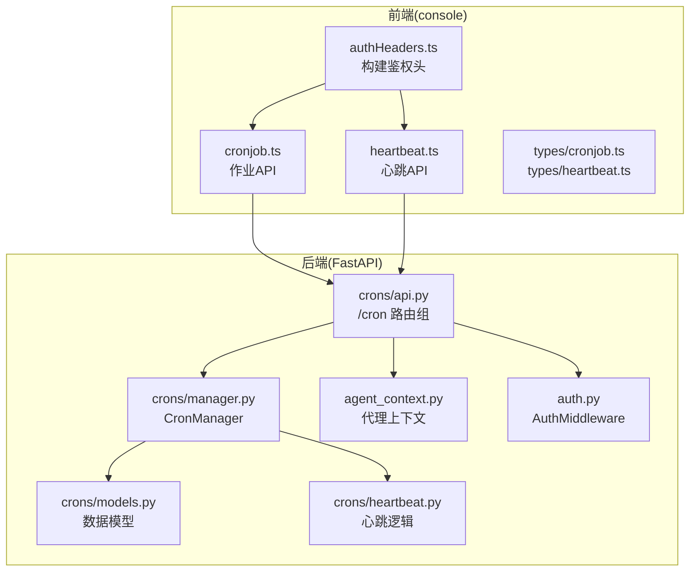
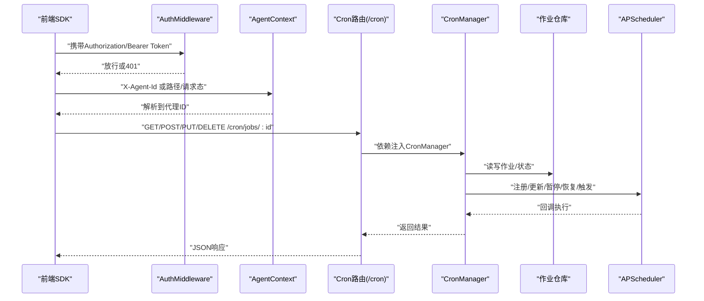
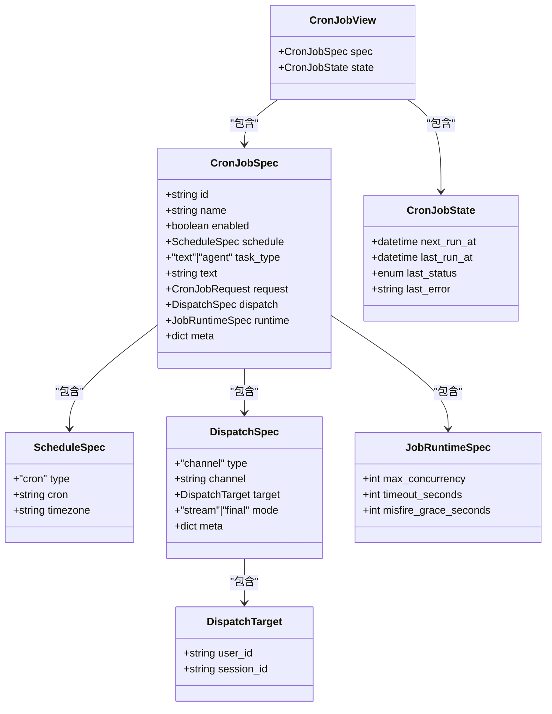

# Cron API接口

<cite>
**本文档引用的文件**
- [src/qwenpaw/app/crons/api.py](file://src/qwenpaw/app/crons/api.py)
- [src/qwenpaw/app/crons/models.py](file://src/qwenpaw/app/crons/models.py)
- [src/qwenpaw/app/crons/manager.py](file://src/qwenpaw/app/crons/manager.py)
- [src/qwenpaw/app/crons/heartbeat.py](file://src/qwenpaw/app/crons/heartbeat.py)
- [src/qwenpaw/app/agent_context.py](file://src/qwenpaw/app/agent_context.py)
- [src/qwenpaw/app/auth.py](file://src/qwenpaw/app/auth.py)
- [src/qwenpaw/app/routers/console.py](file://src/qwenpaw/app/routers/console.py)
- [console/src/api/modules/cronjob.ts](file://console/src/api/modules/cronjob.ts)
- [console/src/api/modules/heartbeat.ts](file://console/src/api/modules/heartbeat.ts)
- [console/src/api/types/cronjob.ts](file://console/src/api/types/cronjob.ts)
- [console/src/api/types/heartbeat.ts](file://console/src/api/types/heartbeat.ts)
- [console/src/api/authHeaders.ts](file://console/src/api/authHeaders.ts)
- [src/qwenpaw/cli/cron_cmd.py](file://src/qwenpaw/cli/cron_cmd.py)
</cite>

## 目录
1. [简介](#简介)
2. [项目结构](#项目结构)
3. [核心组件](#核心组件)
4. [架构总览](#架构总览)
5. [详细组件分析](#详细组件分析)
6. [依赖关系分析](#依赖关系分析)
7. [性能考虑](#性能考虑)
8. [故障排除指南](#故障排除指南)
9. [结论](#结论)
10. [附录](#附录)

## 简介
本文件为 Cron API 接口的完整技术文档，覆盖以下内容：
- RESTful API 端点设计与请求/响应格式
- 作业管理（CRUD、状态查询、触发执行）
- 心跳配置（启用/禁用、参数设置、状态查询）
- 认证与授权机制（含权限控制与访问限制）
- 使用示例（curl 命令与 SDK 调用）
- 错误处理与状态码说明
- 版本管理与向后兼容性
- 性能优化建议与最佳实践
- 测试与调试工具使用指南

## 项目结构
Cron API 的实现由后端 FastAPI 路由、模型定义、调度器与前端 SDK 共同组成。关键模块如下：
- 后端路由：/cron 路由组，提供作业 CRUD、暂停/恢复、立即执行、状态查询
- 核心管理器：CronManager 负责调度、并发控制、状态维护与心跳集成
- 模型定义：CronJobSpec、CronJobView、CronJobState 等数据结构
- 前端 SDK：console 端的 cronjob.ts 与 heartbeat.ts 模块封装 API 请求
- 认证中间件：AuthMiddleware 提供 Bearer Token 验证与代理头支持

**图表来源**
- [src/qwenpaw/app/crons/api.py:1-117](file://src/qwenpaw/app/crons/api.py#L1-L117)
- [src/qwenpaw/app/crons/manager.py:1-388](file://src/qwenpaw/app/crons/manager.py#L1-L388)
- [src/qwenpaw/app/crons/models.py:1-180](file://src/qwenpaw/app/crons/models.py#L1-L180)
- [src/qwenpaw/app/crons/heartbeat.py:1-213](file://src/qwenpaw/app/crons/heartbeat.py#L1-L213)
- [src/qwenpaw/app/agent_context.py:1-155](file://src/qwenpaw/app/agent_context.py#L1-L155)
- [src/qwenpaw/app/auth.py:1-441](file://src/qwenpaw/app/auth.py#L1-L441)
- [console/src/api/modules/cronjob.ts:1-54](file://console/src/api/modules/cronjob.ts#L1-L54)
- [console/src/api/modules/heartbeat.ts:1-13](file://console/src/api/modules/heartbeat.ts#L1-L13)
- [console/src/api/authHeaders.ts:1-23](file://console/src/api/authHeaders.ts#L1-L23)

**章节来源**
- [src/qwenpaw/app/crons/api.py:1-117](file://src/qwenpaw/app/crons/api.py#L1-L117)
- [src/qwenpaw/app/crons/manager.py:1-388](file://src/qwenpaw/app/crons/manager.py#L1-L388)
- [src/qwenpaw/app/crons/models.py:1-180](file://src/qwenpaw/app/crons/models.py#L1-L180)
- [src/qwenpaw/app/crons/heartbeat.py:1-213](file://src/qwenpaw/app/crons/heartbeat.py#L1-L213)
- [src/qwenpaw/app/agent_context.py:1-155](file://src/qwenpaw/app/agent_context.py#L1-L155)
- [src/qwenpaw/app/auth.py:1-441](file://src/qwenpaw/app/auth.py#L1-L441)
- [console/src/api/modules/cronjob.ts:1-54](file://console/src/api/modules/cronjob.ts#L1-L54)
- [console/src/api/modules/heartbeat.ts:1-13](file://console/src/api/modules/heartbeat.ts#L1-L13)
- [console/src/api/authHeaders.ts:1-23](file://console/src/api/authHeaders.ts#L1-L23)

## 核心组件
- CronManager：负责作业注册/更新、暂停/恢复、立即执行、状态维护、并发控制与心跳任务调度
- CronJobSpec/CronJobView/CronJobState：定义作业规范、视图与运行时状态
- AuthMiddleware：统一鉴权中间件，支持 Bearer Token 与本地回环免鉴权
- AgentContext：多代理上下文解析，支持通过路径、请求态或头部注入代理标识

**章节来源**
- [src/qwenpaw/app/crons/manager.py:38-118](file://src/qwenpaw/app/crons/manager.py#L38-L118)
- [src/qwenpaw/app/crons/models.py:126-180](file://src/qwenpaw/app/crons/models.py#L126-L180)
- [src/qwenpaw/app/auth.py:371-441](file://src/qwenpaw/app/auth.py#L371-L441)
- [src/qwenpaw/app/agent_context.py:28-112](file://src/qwenpaw/app/agent_context.py#L28-L112)

## 架构总览
Cron API 的请求流从前端 SDK 发起，经由认证中间件与代理上下文解析，最终由 CronManager 执行调度与业务逻辑。

**图表来源**
- [src/qwenpaw/app/auth.py:371-441](file://src/qwenpaw/app/auth.py#L371-L441)
- [src/qwenpaw/app/agent_context.py:28-112](file://src/qwenpaw/app/agent_context.py#L28-L112)
- [src/qwenpaw/app/crons/api.py:13-25](file://src/qwenpaw/app/crons/api.py#L13-L25)
- [src/qwenpaw/app/crons/manager.py:132-153](file://src/qwenpaw/app/crons/manager.py#L132-L153)

## 详细组件分析

### 作业管理 API
- 列表作业：GET /cron/jobs
- 创建作业：POST /cron/jobs（服务端生成ID，忽略客户端传入的id）
- 获取作业：GET /cron/jobs/{job_id}
- 替换作业：PUT /cron/jobs/{job_id}（校验job_id一致性）
- 删除作业：DELETE /cron/jobs/{job_id}
- 暂停作业：POST /cron/jobs/{job_id}/pause
- 恢复作业：POST /cron/jobs/{job_id}/resume
- 立即执行：POST /cron/jobs/{job_id}/run（异步后台执行，不阻塞）
- 查询状态：GET /cron/jobs/{job_id}/state（返回 next_run_at、last_run_at、last_status、last_error）

请求/响应要点：
- 请求体使用 JSON；响应体遵循 FastAPI 自动生成的 Pydantic 模型序列化
- 404 表示作业不存在；400 表示参数不合法或状态转换异常；500 表示内部错误
- 状态字段 last_status 支持 success/error/running/skipped/cancelled

**章节来源**
- [src/qwenpaw/app/crons/api.py:28-117](file://src/qwenpaw/app/crons/api.py#L28-L117)
- [src/qwenpaw/app/crons/models.py:168-180](file://src/qwenpaw/app/crons/models.py#L168-L180)
- [src/qwenpaw/app/crons/manager.py:190-214](file://src/qwenpaw/app/crons/manager.py#L190-L214)

### 心跳配置 API
- 获取配置：GET /config/heartbeat
- 更新配置：PUT /config/heartbeat（支持启用/禁用、执行间隔/表达式、目标通道、活跃时段）

配置项说明：
- enabled：布尔值，是否启用心跳
- every：字符串，支持 cron 表达式或 "NhMmSs" 形式的间隔
- target："main" 或 "last"，分别表示主会话或上次分发的目标
- activeHours：可选对象，包含 start/end（HH:MM），用于限定活跃时段

**章节来源**
- [console/src/api/modules/heartbeat.ts:1-13](file://console/src/api/modules/heartbeat.ts#L1-L13)
- [console/src/api/types/heartbeat.ts:1-12](file://console/src/api/types/heartbeat.ts#L1-L12)
- [src/qwenpaw/app/crons/heartbeat.py:28-78](file://src/qwenpaw/app/crons/heartbeat.py#L28-L78)

### 数据模型与约束
- CronJobSpec：作业规范，包含 id、name、enabled、schedule、task_type、text/request、dispatch、runtime、meta
- CronJobView：在规范基础上附加 state 字段
- CronJobState：运行时状态，包含 next_run_at、last_run_at、last_status、last_error
- ScheduleSpec：支持 5 字段 cron（不含秒），自动规范化周字段
- DispatchSpec：分发目标（用户/会话）与通道
- JobRuntimeSpec：并发、超时、错失宽限时间等运行时参数

验证规则：
- task_type 为 text 时必须提供非空 text
- task_type 为 agent 时必须提供 request，并同步 user_id/session_id 到分发目标
- cron 表达式必须为 5 字段，秒字段不支持

**章节来源**
- [src/qwenpaw/app/crons/models.py:59-180](file://src/qwenpaw/app/crons/models.py#L59-L180)

### 并发与调度
- CronManager 使用 APScheduler 异步调度器
- 每个作业内置信号量控制最大并发数
- 支持错失触发的宽限时间（misfire_grace_seconds）
- 立即执行 run_job 采用 fire-and-forget，异常记录并推送前端提示

**章节来源**
- [src/qwenpaw/app/crons/manager.py:242-294](file://src/qwenpaw/app/crons/manager.py#L242-L294)
- [src/qwenpaw/app/crons/manager.py:349-387](file://src/qwenpaw/app/crons/manager.py#L349-L387)

### 认证与授权
- 鉴权中间件 AuthMiddleware：
  - 放行公共路径与静态资源
  - 对 /api/ 路由进行 Bearer Token 校验
  - 支持本地回环地址（127.0.0.1/::1）免鉴权（便于 CLI）
  - 支持通过 Authorization 头或查询参数 token 进行鉴权
- 代理隔离：
  - 通过 X-Agent-Id 头或路径/请求态注入 agent_id
  - 未找到代理或代理被禁用时返回 404/403
- CLI 工具：
  - cron 子命令通过 X-Agent-Id 头指定代理
  - 支持 base-url 覆盖与 agent-id 参数

**章节来源**
- [src/qwenpaw/app/auth.py:371-441](file://src/qwenpaw/app/auth.py#L371-L441)
- [src/qwenpaw/app/agent_context.py:28-112](file://src/qwenpaw/app/agent_context.py#L28-L112)
- [src/qwenpaw/cli/cron_cmd.py:65-479](file://src/qwenpaw/cli/cron_cmd.py#L65-L479)
- [console/src/api/authHeaders.ts:1-23](file://console/src/api/authHeaders.ts#L1-L23)

### 前端 SDK 与使用示例
- 作业 API 封装：
  - listCronJobs、createCronJob、getCronJob、replaceCronJob、deleteCronJob
  - pauseCronJob、resumeCronJob、runCronJob、triggerCronJob、getCronJobState
- 心跳 API 封装：
  - getHeartbeatConfig、updateHeartbeatConfig
- 示例（以 curl 方式展示）：
  - 获取作业列表：curl -H "Authorization: Bearer <token>" -H "X-Agent-Id: default" https://host/api/cron/jobs
  - 创建作业：curl -X POST -H "Authorization: Bearer <token>" -H "X-Agent-Id: default" -H "Content-Type: application/json" -d '{...}' https://host/api/cron/jobs
  - 立即执行：curl -X POST -H "Authorization: Bearer <token>" -H "X-Agent-Id: default" https://host/api/cron/jobs/<job_id>/run
  - 获取心跳配置：curl -H "Authorization: Bearer <token>" https://host/api/config/heartbeat
  - 更新心跳配置：curl -X PUT -H "Authorization: Bearer <token>" -H "Content-Type: application/json" -d '{...}' https://host/api/config/heartbeat

注意：SDK 调用时需确保已设置 Authorization 与 X-Agent-Id，且根据实际部署环境调整 base URL。

**章节来源**
- [console/src/api/modules/cronjob.ts:1-54](file://console/src/api/modules/cronjob.ts#L1-L54)
- [console/src/api/modules/heartbeat.ts:1-13](file://console/src/api/modules/heartbeat.ts#L1-L13)
- [console/src/api/authHeaders.ts:1-23](file://console/src/api/authHeaders.ts#L1-L23)
- [src/qwenpaw/cli/cron_cmd.py:65-479](file://src/qwenpaw/cli/cron_cmd.py#L65-L479)

## 依赖关系分析

**图表来源**
- [src/qwenpaw/app/crons/models.py:59-180](file://src/qwenpaw/app/crons/models.py#L59-L180)

**章节来源**
- [src/qwenpaw/app/crons/models.py:126-180](file://src/qwenpaw/app/crons/models.py#L126-L180)

## 性能考虑
- 并发控制：通过每作业信号量限制最大并发，避免资源争用
- 超时与宽限：合理设置 timeout_seconds 与 misfire_grace_seconds，平衡吞吐与准确性
- 异步执行：run_job 采用 fire-and-forget，减少请求阻塞
- 调度器：APScheduler 在异步环境下运行，注意避免长时间阻塞回调
- 前端轮询：状态查询建议按需轮询，避免频繁请求

[本节为通用性能建议，无需特定文件引用]

## 故障排除指南
常见错误与排查步骤：
- 401 未认证：检查 Authorization 头或查询参数 token 是否正确传递
- 403 代理禁用：确认 X-Agent-Id 指向的代理存在且启用
- 404 作业不存在：确认 job_id 正确，或先创建再执行
- 400 参数错误：检查 cron 表达式格式、task_type 与字段一致性
- 500 内部错误：查看后端日志，关注任务执行异常与调度器状态

**章节来源**
- [src/qwenpaw/app/crons/api.py:36-105](file://src/qwenpaw/app/crons/api.py#L36-L105)
- [src/qwenpaw/app/agent_context.py:70-112](file://src/qwenpaw/app/agent_context.py#L70-L112)
- [src/qwenpaw/app/auth.py:385-399](file://src/qwenpaw/app/auth.py#L385-L399)

## 结论
Cron API 提供了完整的作业生命周期管理与心跳配置能力，结合认证中间件与代理上下文实现了安全可靠的多代理隔离。通过前端 SDK 与 CLI 工具，用户可以便捷地进行作业的增删改查、状态监控与即时触发。建议在生产环境中合理配置并发与超时参数，并通过鉴权与代理隔离保障系统安全。

[本节为总结性内容，无需特定文件引用]

## 附录

### API 端点一览
- 作业管理
  - GET /cron/jobs
  - POST /cron/jobs
  - GET /cron/jobs/{job_id}
  - PUT /cron/jobs/{job_id}
  - DELETE /cron/jobs/{job_id}
  - POST /cron/jobs/{job_id}/pause
  - POST /cron/jobs/{job_id}/resume
  - POST /cron/jobs/{job_id}/run
  - GET /cron/jobs/{job_id}/state
- 心跳配置
  - GET /config/heartbeat
  - PUT /config/heartbeat

**章节来源**
- [src/qwenpaw/app/crons/api.py:28-117](file://src/qwenpaw/app/crons/api.py#L28-L117)
- [console/src/api/modules/heartbeat.ts:1-13](file://console/src/api/modules/heartbeat.ts#L1-L13)

### 请求/响应格式与字段说明
- 作业规范（CronJobSpec）
  - id：作业唯一标识（服务端生成）
  - name：作业名称
  - enabled：是否启用
  - schedule：调度规范（type="cron"，cron=5字段表达式，timezone）
  - task_type：任务类型（"text"|"agent"）
  - text：当 task_type="text" 时必填
  - request：当 task_type="agent" 时必填，包含输入与会话/用户信息
  - dispatch：分发目标（channel、target、mode、meta）
  - runtime：并发、超时、错失宽限
  - meta：扩展元数据
- 作业视图（CronJobView）
  - 在规范基础上附加 state 字段
- 运行时状态（CronJobState）
  - next_run_at：下次运行时间
  - last_run_at：上次运行时间
  - last_status：success/error/running/skipped/cancelled
  - last_error：上次错误信息

**章节来源**
- [src/qwenpaw/app/crons/models.py:126-180](file://src/qwenpaw/app/crons/models.py#L126-L180)

### 错误码与语义
- 200：成功
- 400：参数非法或状态转换失败
- 401：未认证或令牌无效/过期
- 403：代理禁用或拒绝访问
- 404：资源不存在（如作业）
- 500：服务器内部错误

**章节来源**
- [src/qwenpaw/app/crons/api.py:20-24](file://src/qwenpaw/app/crons/api.py#L20-L24)
- [src/qwenpaw/app/agent_context.py:70-112](file://src/qwenpaw/app/agent_context.py#L70-L112)
- [src/qwenpaw/app/auth.py:385-399](file://src/qwenpaw/app/auth.py#L385-L399)

### 版本管理与兼容性
- 后端使用 FastAPI 的 response_model 自动序列化，Pydantic 模型变更需谨慎
- 前端 types 中包含 legacy 类型，便于旧版兼容
- 建议在模型演进时保持向后兼容字段，新增字段标记为可选

**章节来源**
- [console/src/api/types/cronjob.ts:55-58](file://console/src/api/types/cronjob.ts#L55-L58)

### 最佳实践
- 使用 PUT 替换作业前先 GET 校验 job_id
- cron 表达式严格遵循 5 字段规范，秒字段不支持
- 设置合理的 max_concurrency 与 timeout_seconds
- 使用 run_job 触发一次性执行，避免阻塞主流程
- 通过 X-Agent-Id 明确代理上下文，避免跨代理误操作

**章节来源**
- [src/qwenpaw/app/crons/api.py:59-62](file://src/qwenpaw/app/crons/api.py#L59-L62)
- [src/qwenpaw/app/crons/models.py:64-88](file://src/qwenpaw/app/crons/models.py#L64-L88)
- [src/qwenpaw/app/crons/manager.py:349-387](file://src/qwenpaw/app/crons/manager.py#L349-L387)

### 测试与调试
- 使用 CLI 工具进行端到端测试：
  - 查看作业：cron get <job_id> --agent-id default
  - 创建作业：cron create -f spec.json --agent-id default
  - 立即执行：cron run <job_id> --agent-id default
  - 查看状态：cron state <job_id> --agent-id default
- 前端调试：
  - 确认 Authorization 与 X-Agent-Id 头正确设置
  - 使用浏览器开发者工具查看网络请求与响应
- 日志与监控：
  - 关注后端日志中的调度器与任务执行异常
  - 借助 CronJobState 的 last_status 与 last_error 定位问题

**章节来源**
- [src/qwenpaw/cli/cron_cmd.py:65-479](file://src/qwenpaw/cli/cron_cmd.py#L65-L479)
- [console/src/api/authHeaders.ts:1-23](file://console/src/api/authHeaders.ts#L1-L23)