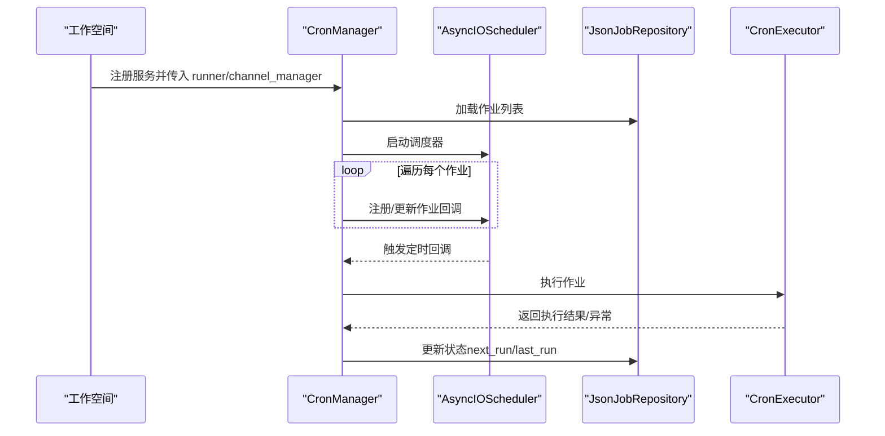
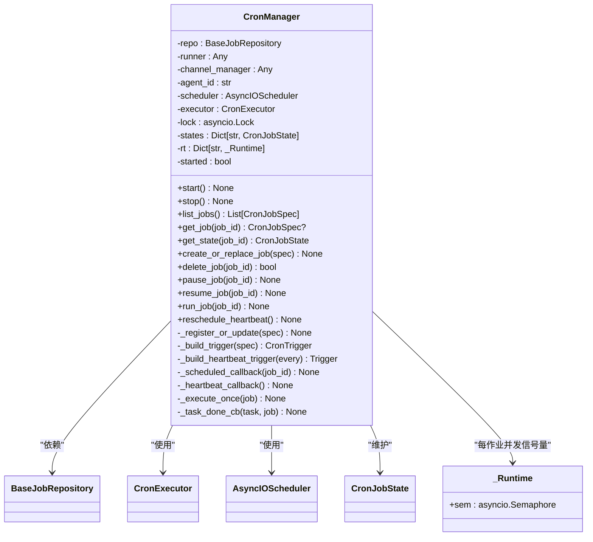
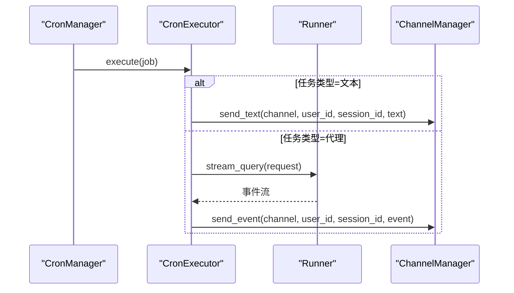
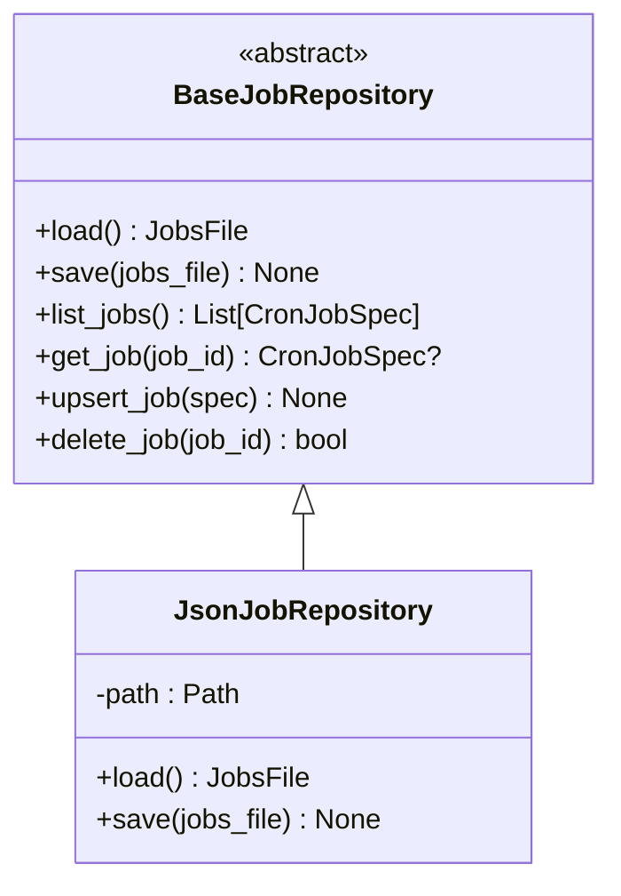
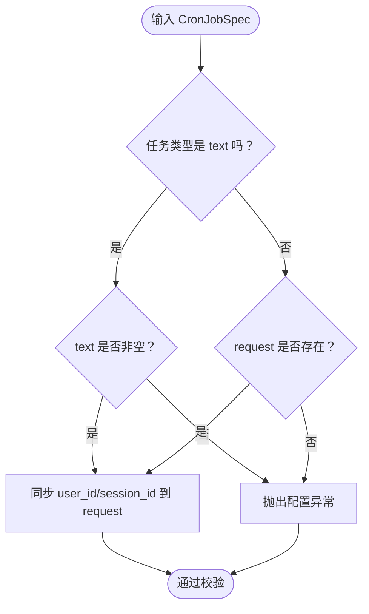
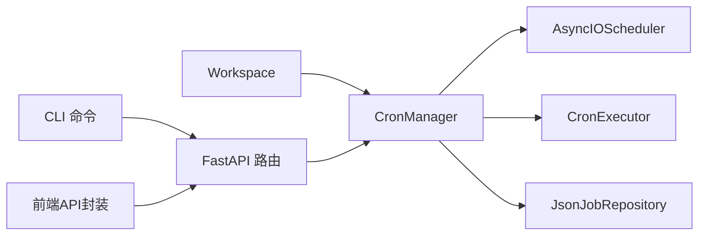

# Cron作业管理器

<cite>
**本文档引用的文件**
- [src/qwenpaw/app/crons/manager.py](file://src/qwenpaw/app/crons/manager.py)
- [src/qwenpaw/app/crons/models.py](file://src/qwenpaw/app/crons/models.py)
- [src/qwenpaw/app/crons/repo/base.py](file://src/qwenpaw/app/crons/repo/base.py)
- [src/qwenpaw/app/crons/repo/json_repo.py](file://src/qwenpaw/app/crons/repo/json_repo.py)
- [src/qwenpaw/app/crons/executor.py](file://src/qwenpaw/app/crons/executor.py)
- [src/qwenpaw/app/crons/heartbeat.py](file://src/qwenpaw/app/crons/heartbeat.py)
- [src/qwenpaw/app/crons/api.py](file://src/qwenpaw/app/crons/api.py)
- [src/qwenpaw/app/workspace/workspace.py](file://src/qwenpaw/app/workspace/workspace.py)
- [src/qwenpaw/constant.py](file://src/qwenpaw/constant.py)
- [src/qwenpaw/cli/cron_cmd.py](file://src/qwenpaw/cli/cron_cmd.py)
- [console/src/api/modules/cronjob.ts](file://console/src/api/modules/cronjob.ts)
- [console/src/api/types/cronjob.ts](file://console/src/api/types/cronjob.ts)
</cite>

## 目录
1. [简介](#简介)
2. [项目结构](#项目结构)
3. [核心组件](#核心组件)
4. [架构总览](#架构总览)
5. [详细组件分析](#详细组件分析)
6. [依赖关系分析](#依赖关系分析)
7. [性能考虑](#性能考虑)
8. [故障排除指南](#故障排除指南)
9. [结论](#结论)
10. [附录：API使用示例](#附录api使用示例)

## 简介
本文件为 Cron 作业管理器的详细技术文档，围绕 CronManager 类展开，深入解释作业的创建、注册、更新与删除机制；阐述 AsyncIOScheduler 的初始化与启动流程；详解作业状态管理（状态跟踪、并发控制、资源管理）；解释作业生命周期（从创建到销毁）；说明配置验证与错误处理；提供作业管理 API 使用示例；解释与作业仓库的交互与数据持久化；最后给出性能优化建议与最佳实践。

## 项目结构
Cron 作业管理器位于后端 Python 包 src/qwenpaw/app/crons 下，前端控制台位于 console/src/api/modules 与 console/src/api/types 中，CLI 命令位于 src/qwenpaw/cli/cron_cmd.py。工作空间在 src/qwenpaw/app/workspace/workspace.py 中注册 CronManager 服务。

```mermaid
graph TB
subgraph "后端"
M["CronManager<br/>任务调度与状态管理"]
E["CronExecutor<br/>执行器"]
R["JsonJobRepository<br/>JSON仓库"]
HB["Heartbeat<br/>心跳触发"]
API["FastAPI 路由<br/>/cron/*"]
end
subgraph "前端"
FE_API["console/src/api/modules/cronjob.ts<br/>前端API封装"]
FE_TYPES["console/src/api/types/cronjob.ts<br/>类型定义"]
end
subgraph "CLI"
CLI["src/qwenpaw/cli/cron_cmd.py<br/>命令行工具"]
end
subgraph "工作空间"
WS["src/qwenpaw/app/workspace/workspace.py<br/>服务注册与注入"]
end
API --> M
FE_API --> API
FE_TYPES --> FE_API
CLI --> API
M --> E
M --> R
M --> HB
WS --> M
```

**图表来源**
- [src/qwenpaw/app/crons/manager.py:38-118](file://src/qwenpaw/app/crons/manager.py#L38-L118)
- [src/qwenpaw/app/crons/executor.py:13-90](file://src/qwenpaw/app/crons/executor.py#L13-L90)
- [src/qwenpaw/app/crons/repo/json_repo.py:12-47](file://src/qwenpaw/app/crons/repo/json_repo.py#L12-L47)
- [src/qwenpaw/app/crons/heartbeat.py:119-213](file://src/qwenpaw/app/crons/heartbeat.py#L119-L213)
- [src/qwenpaw/app/crons/api.py:1-117](file://src/qwenpaw/app/crons/api.py#L1-L117)
- [console/src/api/modules/cronjob.ts:1-54](file://console/src/api/modules/cronjob.ts#L1-L54)
- [console/src/api/types/cronjob.ts:1-57](file://console/src/api/types/cronjob.ts#L1-L57)
- [src/qwenpaw/cli/cron_cmd.py:1-480](file://src/qwenpaw/cli/cron_cmd.py#L1-L480)
- [src/qwenpaw/app/workspace/workspace.py:241-275](file://src/qwenpaw/app/workspace/workspace.py#L241-L275)

**章节来源**
- [src/qwenpaw/app/crons/manager.py:38-118](file://src/qwenpaw/app/crons/manager.py#L38-L118)
- [src/qwenpaw/app/crons/api.py:1-117](file://src/qwenpaw/app/crons/api.py#L1-L117)
- [src/qwenpaw/app/workspace/workspace.py:241-275](file://src/qwenpaw/app/workspace/workspace.py#L241-L275)

## 核心组件
- CronManager：核心调度与状态管理器，负责作业的注册/更新、暂停/恢复、一次性运行、心跳调度等。
- CronExecutor：具体执行器，根据任务类型（文本或代理）执行并分发结果。
- BaseJobRepository/JsonJobRepository：作业仓库抽象与 JSON 文件实现，负责作业的持久化读写。
- CronJobSpec/CronJobState：作业规格与运行状态的数据模型。
- FastAPI 路由与 CLI：对外暴露 REST API 与命令行接口。
- 工作空间服务注册：在工作空间中注入 CronManager 并按优先级启动。

**章节来源**
- [src/qwenpaw/app/crons/manager.py:38-388](file://src/qwenpaw/app/crons/manager.py#L38-L388)
- [src/qwenpaw/app/crons/executor.py:13-90](file://src/qwenpaw/app/crons/executor.py#L13-L90)
- [src/qwenpaw/app/crons/repo/base.py:10-54](file://src/qwenpaw/app/crons/repo/base.py#L10-L54)
- [src/qwenpaw/app/crons/repo/json_repo.py:12-47](file://src/qwenpaw/app/crons/repo/json_repo.py#L12-L47)
- [src/qwenpaw/app/crons/models.py:59-180](file://src/qwenpaw/app/crons/models.py#L59-L180)
- [src/qwenpaw/app/crons/api.py:1-117](file://src/qwenpaw/app/crons/api.py#L1-L117)
- [src/qwenpaw/cli/cron_cmd.py:1-480](file://src/qwenpaw/cli/cron_cmd.py#L1-L480)
- [src/qwenpaw/app/workspace/workspace.py:241-275](file://src/qwenpaw/app/workspace/workspace.py#L241-L275)

## 架构总览
CronManager 通过 AsyncIOScheduler 驱动作业调度，使用 CronExecutor 执行具体任务，使用 JsonJobRepository 持久化作业配置。工作空间在启动时注册 CronManager 服务，API 层与 CLI 层通过依赖注入获取 CronManager 实例进行操作。



**图表来源**
- [src/qwenpaw/app/workspace/workspace.py:241-275](file://src/qwenpaw/app/workspace/workspace.py#L241-L275)
- [src/qwenpaw/app/crons/manager.py:63-118](file://src/qwenpaw/app/crons/manager.py#L63-L118)
- [src/qwenpaw/app/crons/manager.py:242-273](file://src/qwenpaw/app/crons/manager.py#L242-L273)
- [src/qwenpaw/app/crons/executor.py:18-90](file://src/qwenpaw/app/crons/executor.py#L18-L90)
- [src/qwenpaw/app/crons/repo/json_repo.py:29-47](file://src/qwenpaw/app/crons/repo/json_repo.py#L29-L47)

## 详细组件分析

### CronManager：调度与状态管理
- 初始化与锁：持有 repo、runner、channel_manager、AsyncIOScheduler、CronExecutor；使用 asyncio.Lock 保证并发安全；维护状态字典与每作业运行时信号量。
- 启动流程：加载作业文件，启动调度器，逐个注册或更新作业；若启动时遇到无效作业，自动禁用并写回仓库；可选启用心跳作业。
- 作业控制：create_or_replace_job、delete_job、pause_job、resume_job、run_job（一次性异步触发）。
- 回调与执行：_scheduled_callback 与 _execute_once 组成调度-执行链；_task_done_cb 处理后台任务异常并向前端推送错误信息。
- 心跳：支持基于 cron 表达式或间隔字符串的心跳触发，动态重调度。



**图表来源**
- [src/qwenpaw/app/crons/manager.py:38-388](file://src/qwenpaw/app/crons/manager.py#L38-L388)

**章节来源**
- [src/qwenpaw/app/crons/manager.py:38-388](file://src/qwenpaw/app/crons/manager.py#L38-L388)

### CronExecutor：作业执行器
- 文本任务：直接通过 channel_manager 发送固定文本内容。
- 代理任务：以 request 形式调用 runner.stream_query，流式事件通过 channel_manager 分发；支持超时控制与取消处理。



**图表来源**
- [src/qwenpaw/app/crons/executor.py:18-90](file://src/qwenpaw/app/crons/executor.py#L18-L90)

**章节来源**
- [src/qwenpaw/app/crons/executor.py:13-90](file://src/qwenpaw/app/crons/executor.py#L13-L90)

### 作业仓库与持久化
- BaseJobRepository：定义 load/save/list/get/upsert/delete 等抽象方法，默认实现提供常用便利操作。
- JsonJobRepository：单文件 JSON 存储，采用原子写入（临时文件+替换），路径可配置。



**图表来源**
- [src/qwenpaw/app/crons/repo/base.py:10-54](file://src/qwenpaw/app/crons/repo/base.py#L10-L54)
- [src/qwenpaw/app/crons/repo/json_repo.py:12-47](file://src/qwenpaw/app/crons/repo/json_repo.py#L12-L47)

**章节来源**
- [src/qwenpaw/app/crons/repo/base.py:10-54](file://src/qwenpaw/app/crons/repo/base.py#L10-L54)
- [src/qwenpaw/app/crons/repo/json_repo.py:12-47](file://src/qwenpaw/app/crons/repo/json_repo.py#L12-L47)
- [src/qwenpaw/constant.py:121-121](file://src/qwenpaw/constant.py#L121-L121)

### 数据模型与配置验证
- ScheduleSpec：校验 cron 字段数量（5/4/3 可归一化），day-of-week 数字转英文缩写，拒绝 6 字段（秒）。
- CronJobSpec：校验任务类型与字段一致性（text 需要非空 text；agent 需要 request，且同步 user_id/session_id 到 dispatch target）。
- JobRuntimeSpec：并发度、超时、错失宽限时间。
- CronJobState：记录下次/上次运行时间、状态与错误信息。



**图表来源**
- [src/qwenpaw/app/crons/models.py:140-160](file://src/qwenpaw/app/crons/models.py#L140-L160)

**章节来源**
- [src/qwenpaw/app/crons/models.py:59-180](file://src/qwenpaw/app/crons/models.py#L59-L180)

### 心跳机制
- 支持 cron 表达式与间隔两种形式；根据用户时区与活跃时间段过滤；可选择发送到上次目标或仅运行。
- 提供一次性运行函数，用于手动触发或调度器回调。

**章节来源**
- [src/qwenpaw/app/crons/heartbeat.py:40-213](file://src/qwenpaw/app/crons/heartbeat.py#L40-L213)
- [src/qwenpaw/app/crons/manager.py:295-348](file://src/qwenpaw/app/crons/manager.py#L295-L348)

### API 与 CLI
- FastAPI 路由：/cron/jobs（GET/POST/PUT/DELETE）、/cron/jobs/{job_id}/pause、/cron/jobs/{job_id}/resume、/cron/jobs/{job_id}/run、/cron/jobs/{job_id}/state。
- CLI：cron group 提供 list/get/state/create/delete/pause/resume/run 等命令，支持从 JSON 文件或参数行构建作业规范。
- 前端封装：console/src/api/modules/cronjob.ts 提供统一的请求封装；types 定义了输入输出类型。

**章节来源**
- [src/qwenpaw/app/crons/api.py:1-117](file://src/qwenpaw/app/crons/api.py#L1-L117)
- [src/qwenpaw/cli/cron_cmd.py:1-480](file://src/qwenpaw/cli/cron_cmd.py#L1-L480)
- [console/src/api/modules/cronjob.ts:1-54](file://console/src/api/modules/cronjob.ts#L1-L54)
- [console/src/api/types/cronjob.ts:1-57](file://console/src/api/types/cronjob.ts#L1-L57)

## 依赖关系分析
- CronManager 依赖 AsyncIOScheduler 进行调度，依赖 CronExecutor 执行任务，依赖 JsonJobRepository 进行持久化。
- 工作空间在服务注册阶段注入 CronManager，确保在工作空间启动时正确初始化与关闭。
- API 与 CLI 通过依赖注入获取 CronManager 实例，避免全局状态耦合。



**图表来源**
- [src/qwenpaw/app/workspace/workspace.py:241-275](file://src/qwenpaw/app/workspace/workspace.py#L241-L275)
- [src/qwenpaw/app/crons/manager.py:38-61](file://src/qwenpaw/app/crons/manager.py#L38-L61)
- [src/qwenpaw/app/crons/api.py:13-25](file://src/qwenpaw/app/crons/api.py#L13-L25)
- [src/qwenpaw/cli/cron_cmd.py:1-480](file://src/qwenpaw/cli/cron_cmd.py#L1-L480)

**章节来源**
- [src/qwenpaw/app/workspace/workspace.py:241-275](file://src/qwenpaw/app/workspace/workspace.py#L241-L275)
- [src/qwenpaw/app/crons/manager.py:38-61](file://src/qwenpaw/app/crons/manager.py#L38-L61)
- [src/qwenpaw/app/crons/api.py:13-25](file://src/qwenpaw/app/crons/api.py#L13-L25)

## 性能考虑
- 并发控制：每作业独立 asyncio.Semaphore 控制最大并发度，避免过载；默认并发度为 1，可根据任务特性调整。
- 超时与错失宽限：通过 runtime.timeout_seconds 限制单次执行时长；misfire_grace_seconds 控制错过触发后的容忍窗口。
- 调度器启动与注册：在工作空间启动阶段集中初始化，避免重复启动；批量注册作业时逐个移除旧作业再添加，减少冲突。
- I/O 与网络：代理任务采用流式事件分发，降低内存峰值；超时控制防止长时间阻塞。
- 存储原子性：JSON 仓库采用临时文件+替换策略，保证写入原子性，减少损坏风险。

[本节为通用性能指导，不直接分析特定文件，故无“章节来源”]

## 故障排除指南
- 作业启动失败被自动禁用：启动时若作业配置无效，会记录警告并自动设置 enabled=false 写回仓库，便于后续修复。
- 后台任务异常：run_job 创建的后台任务异常会被抑制并记录日志，同时向前端推送错误消息以便用户感知。
- 错误处理与日志：心跳与执行器均捕获异常并记录详细信息，便于定位问题。
- 配置校验：cron 字段数量与格式、任务类型与字段一致性、day-of-week 归一化等均在模型层进行严格校验。

**章节来源**
- [src/qwenpaw/app/crons/manager.py:72-92](file://src/qwenpaw/app/crons/manager.py#L72-L92)
- [src/qwenpaw/app/crons/manager.py:217-238](file://src/qwenpaw/app/crons/manager.py#L217-L238)
- [src/qwenpaw/app/crons/heartbeat.py:119-213](file://src/qwenpaw/app/crons/heartbeat.py#L119-L213)
- [src/qwenpaw/app/crons/models.py:64-88](file://src/qwenpaw/app/crons/models.py#L64-L88)

## 结论
Cron 作业管理器通过清晰的职责分离（调度、执行、存储、API/CLI/前端）与严格的配置校验，提供了稳定可靠的作业调度能力。其并发控制、超时与错失宽限、原子存储与错误处理机制共同保障了生产环境的可靠性。配合工作空间的服务注册与心跳机制，形成完整的自动化运维与监控闭环。

[本节为总结性内容，不直接分析特定文件，故无“章节来源”]

## 附录：API使用示例

### 1) 创建作业（REST）
- 方法与路径：POST /cron/jobs
- 请求体：CronJobSpec（id 将被忽略，服务器生成）
- 成功响应：返回新创建的 CronJobSpec

**章节来源**
- [src/qwenpaw/app/crons/api.py:41-50](file://src/qwenpaw/app/crons/api.py#L41-L50)

### 2) 获取作业详情（REST）
- 方法与路径：GET /cron/jobs/{job_id}
- 成功响应：CronJobView（包含 spec 与 state）

**章节来源**
- [src/qwenpaw/app/crons/api.py:33-38](file://src/qwenpaw/app/crons/api.py#L33-L38)

### 3) 替换作业（REST）
- 方法与路径：PUT /cron/jobs/{job_id}
- 请求体：CronJobSpec（要求 id 与路径一致）
- 成功响应：返回更新后的 CronJobSpec

**章节来源**
- [src/qwenpaw/app/crons/api.py:53-62](file://src/qwenpaw/app/crons/api.py#L53-L62)

### 4) 删除作业（REST）
- 方法与路径：DELETE /cron/jobs/{job_id}
- 成功响应：{"deleted": true}

**章节来源**
- [src/qwenpaw/app/crons/api.py:65-73](file://src/qwenpaw/app/crons/api.py#L65-L73)

### 5) 暂停/恢复作业（REST）
- 方法与路径：POST /cron/jobs/{job_id}/pause
- 方法与路径：POST /cron/jobs/{job_id}/resume
- 成功响应：{"paused": true} 或 {"resumed": true}

**章节来源**
- [src/qwenpaw/app/crons/api.py:76-94](file://src/qwenpaw/app/crons/api.py#L76-L94)

### 6) 一次性运行作业（REST）
- 方法与路径：POST /cron/jobs/{job_id}/run
- 成功响应：{"started": true}

**章节来源**
- [src/qwenpaw/app/crons/api.py:97-105](file://src/qwenpaw/app/crons/api.py#L97-L105)

### 7) 获取作业状态（REST）
- 方法与路径：GET /cron/jobs/{job_id}/state
- 成功响应：CronJobState（包含 next_run_at/last_run_at/last_status/last_error）

**章节来源**
- [src/qwenpaw/app/crons/api.py:108-116](file://src/qwenpaw/app/crons/api.py#L108-L116)

### 8) CLI 使用示例
- 查看帮助：qwenpaw cron --help
- 列出作业：qwenpaw cron list [--agent-id default]
- 获取作业：qwenpaw cron get <job_id> [--agent-id default]
- 获取状态：qwenpaw cron state <job_id> [--agent-id default]
- 创建作业：qwenpaw cron create -f <job.json> 或通过 --type/--name/--cron/--channel/--target-user/--target-session/--text 等参数行构建
- 删除作业：qwenpaw cron delete <job_id>
- 暂停/恢复：qwenpaw cron pause <job_id> / qwenpaw cron resume <job_id>
- 一次性运行：qwenpaw cron run <job_id>

**章节来源**
- [src/qwenpaw/cli/cron_cmd.py:27-480](file://src/qwenpaw/cli/cron_cmd.py#L27-L480)

### 9) 前端调用示例
- 使用 console/src/api/modules/cronjob.ts 中的方法封装：
  - listCronJobs/getCronJob/replaceCronJob/deleteCronJob/pauseCronJob/resumeCronJob/runCronJob/getCronJobState

**章节来源**
- [console/src/api/modules/cronjob.ts:8-53](file://console/src/api/modules/cronjob.ts#L8-L53)
- [console/src/api/types/cronjob.ts:33-53](file://console/src/api/types/cronjob.ts#L33-L53)