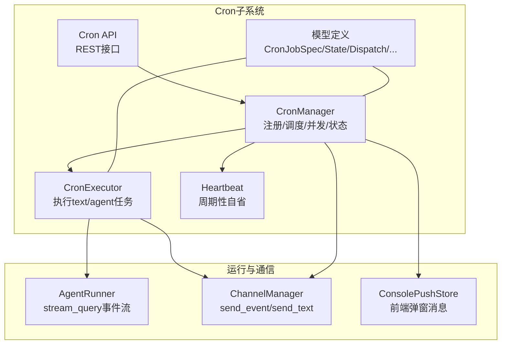
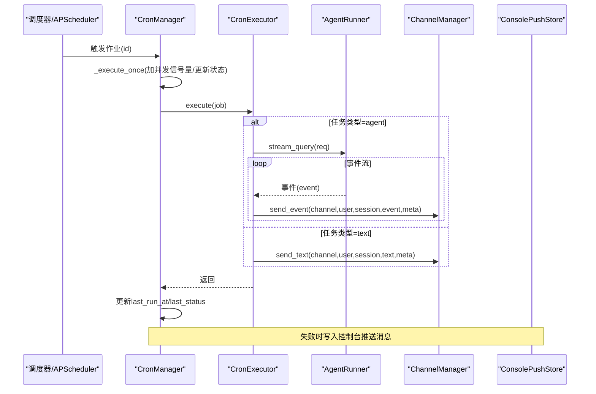
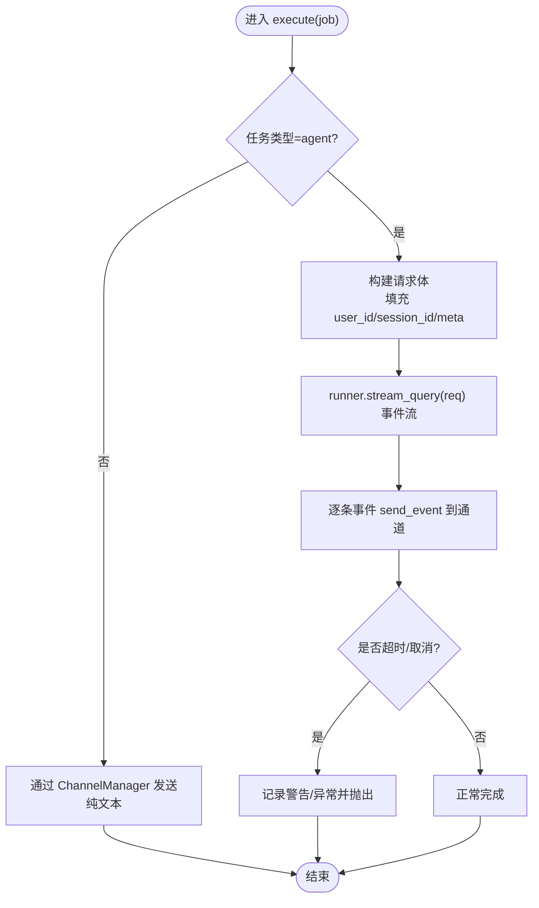
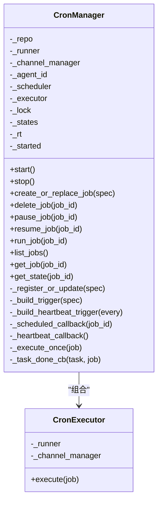
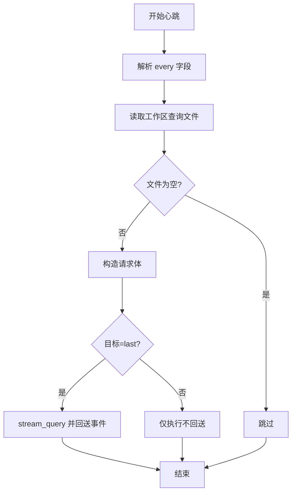
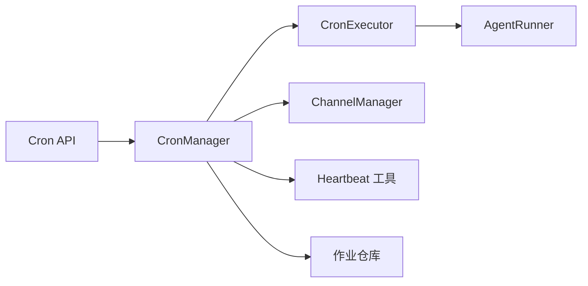

# 任务执行器

<cite>
**本文引用的文件**
- [src/qwenpaw/app/crons/executor.py](file://src/qwenpaw/app/crons/executor.py)
- [src/qwenpaw/app/crons/manager.py](file://src/qwenpaw/app/crons/manager.py)
- [src/qwenpaw/app/crons/models.py](file://src/qwenpaw/app/crons/models.py)
- [src/qwenpaw/app/crons/heartbeat.py](file://src/qwenpaw/app/crons/heartbeat.py)
- [src/qwenpaw/app/crons/api.py](file://src/qwenpaw/app/crons/api.py)
- [src/qwenpaw/app/runner/runner.py](file://src/qwenpaw/app/runner/runner.py)
- [src/qwenpaw/app/channels/manager.py](file://src/qwenpaw/app/channels/manager.py)
- [src/qwenpaw/app/console_push_store.py](file://src/qwenpaw/app/console_push_store.py)
</cite>

## 目录
1. [简介](#简介)
2. [项目结构](#项目结构)
3. [核心组件](#核心组件)
4. [架构总览](#架构总览)
5. [详细组件分析](#详细组件分析)
6. [依赖分析](#依赖分析)
7. [性能考量](#性能考量)
8. [故障排查指南](#故障排查指南)
9. [结论](#结论)
10. [附录](#附录)

## 简介
本文件面向Cron任务执行器，系统性阐述 CronExecutor 类的设计与执行流程，覆盖任务调度、参数传递、结果处理、执行上下文（代理ID、通道管理、运行时环境）、安全机制（权限控制与资源限制）、执行结果反馈（成功/错误/日志）、配置项与参数化设置、与代理系统的集成与通信协议，以及性能监控与调试技巧。目标是帮助开发者与运维人员快速理解并高效使用该执行器。

## 项目结构
围绕Cron任务执行器的关键模块如下：
- 执行器：负责具体任务的执行与事件流转发
- 管理器：负责作业注册、调度、并发控制、状态维护与心跳
- 模型定义：规范作业、调度、分发、运行时配置与状态
- 心跳：周期性触发的“自省”任务，支持最后分发回传
- API：对外暴露作业的增删改查、启停与状态查询
- 运行器：执行代理请求，生成事件流
- 通道管理器：将事件或纯文本发送到指定渠道
- 控制台推送存储：在控制台会话中展示错误与提示消息

图表来源
- [src/qwenpaw/app/crons/manager.py:38-118](file://src/qwenpaw/app/crons/manager.py#L38-L118)
- [src/qwenpaw/app/crons/executor.py:13-90](file://src/qwenpaw/app/crons/executor.py#L13-L90)
- [src/qwenpaw/app/crons/heartbeat.py:119-213](file://src/qwenpaw/app/crons/heartbeat.py#L119-L213)
- [src/qwenpaw/app/crons/api.py:13-117](file://src/qwenpaw/app/crons/api.py#L13-L117)
- [src/qwenpaw/app/runner/runner.py:349-595](file://src/qwenpaw/app/runner/runner.py#L349-L595)
- [src/qwenpaw/app/channels/manager.py:630-673](file://src/qwenpaw/app/channels/manager.py#L630-L673)
- [src/qwenpaw/app/console_push_store.py:22-97](file://src/qwenpaw/app/console_push_store.py#L22-L97)

章节来源
- [src/qwenpaw/app/crons/manager.py:38-118](file://src/qwenpaw/app/crons/manager.py#L38-L118)
- [src/qwenpaw/app/crons/executor.py:13-90](file://src/qwenpaw/app/crons/executor.py#L13-L90)
- [src/qwenpaw/app/crons/heartbeat.py:119-213](file://src/qwenpaw/app/crons/heartbeat.py#L119-L213)
- [src/qwenpaw/app/crons/api.py:13-117](file://src/qwenpaw/app/crons/api.py#L13-L117)
- [src/qwenpaw/app/runner/runner.py:349-595](file://src/qwenpaw/app/runner/runner.py#L349-L595)
- [src/qwenpaw/app/channels/manager.py:630-673](file://src/qwenpaw/app/channels/manager.py#L630-L673)
- [src/qwenpaw/app/console_push_store.py:22-97](file://src/qwenpaw/app/console_push_store.py#L22-L97)

## 核心组件
- CronExecutor：单次任务执行器，支持两类任务类型：
  - text：直接向指定通道发送纯文本
  - agent：以分发目标用户身份发起一次代理对话，边流式输出事件并逐条转发至通道
- CronManager：作业生命周期与调度中心，负责：
  - 加载/注册/更新作业
  - 基于 APScheduler 的定时触发
  - 并发控制（每作业信号量）
  - 状态追踪（下次/上次运行时间、状态、错误）
  - 心跳作业（可按 cron 或间隔配置）
  - 异步后台任务失败回调与前端错误推送
- 模型与配置：
  - CronJobSpec：作业定义（调度、任务类型、文本/请求、分发目标、运行时参数、元数据）
  - CronJobState：作业状态（next_run_at/last_run_at/last_status/last_error）
  - DispatchSpec/Target：分发目标（user_id/session_id）与模式（stream/final）
  - JobRuntimeSpec：并发、超时、错失宽限
- 心跳：从工作区读取固定文件内容，构造请求后调用 runner.stream_query，并可选地将事件回送到“上次分发”的目标
- API：提供作业的 CRUD、暂停/恢复、立即运行、状态查询等接口
- 运行器：实现 stream_query 事件流，注入代理上下文（agent_id/session_id/channel），并进行工具审批、命令路径、会话状态加载/保存等
- 通道管理器：根据通道名获取实例，合并/派发事件或纯文本
- 控制台推送存储：在会话维度保留有限条目，供前端轮询展示

章节来源
- [src/qwenpaw/app/crons/executor.py:13-90](file://src/qwenpaw/app/crons/executor.py#L13-L90)
- [src/qwenpaw/app/crons/manager.py:38-118](file://src/qwenpaw/app/crons/manager.py#L38-L118)
- [src/qwenpaw/app/crons/models.py:59-180](file://src/qwenpaw/app/crons/models.py#L59-L180)
- [src/qwenpaw/app/crons/heartbeat.py:119-213](file://src/qwenpaw/app/crons/heartbeat.py#L119-L213)
- [src/qwenpaw/app/crons/api.py:13-117](file://src/qwenpaw/app/crons/api.py#L13-L117)
- [src/qwenpaw/app/runner/runner.py:349-595](file://src/qwenpaw/app/runner/runner.py#L349-L595)
- [src/qwenpaw/app/channels/manager.py:630-673](file://src/qwenpaw/app/channels/manager.py#L630-L673)
- [src/qwenpaw/app/console_push_store.py:22-97](file://src/qwenpaw/app/console_push_store.py#L22-L97)

## 架构总览
下图展示从“作业被调度/手动触发”到“事件/文本送达通道”的完整链路，以及错误回传与前端展示。

图表来源
- [src/qwenpaw/app/crons/manager.py:349-387](file://src/qwenpaw/app/crons/manager.py#L349-L387)
- [src/qwenpaw/app/crons/executor.py:18-90](file://src/qwenpaw/app/crons/executor.py#L18-L90)
- [src/qwenpaw/app/runner/runner.py:349-595](file://src/qwenpaw/app/runner/runner.py#L349-L595)
- [src/qwenpaw/app/channels/manager.py:630-673](file://src/qwenpaw/app/channels/manager.py#L630-L673)
- [src/qwenpaw/app/console_push_store.py:22-97](file://src/qwenpaw/app/console_push_store.py#L22-L97)

## 详细组件分析

### CronExecutor 组件
职责与流程
- 接收 CronJobSpec，解析分发目标与元数据
- 若任务类型为 text：直接通过 ChannelManager 发送纯文本
- 若任务类型为 agent：构建请求（填充 user_id/session_id），调用 runner.stream_query 获取事件流，逐条通过 ChannelManager.send_event 转发
- 执行过程受超时保护；取消/超时/异常均被记录并抛出

关键点
- 参数传递：将作业中的 dispatch.target.user_id/session_id 同步到请求体，确保上下文一致
- 结果处理：事件流逐条发送，meta 透传；文本任务直接发送
- 超时控制：由执行器统一设置超时阈值，避免长时间阻塞

图表来源
- [src/qwenpaw/app/crons/executor.py:18-90](file://src/qwenpaw/app/crons/executor.py#L18-L90)

章节来源
- [src/qwenpaw/app/crons/executor.py:13-90](file://src/qwenpaw/app/crons/executor.py#L13-L90)

### CronManager 组件
职责与流程
- 初始化：创建 AsyncIOScheduler 与 CronExecutor 实例
- 启动：加载作业列表，逐个注册（校验触发器、建立并发信号量、加入调度器、暂停/启用状态同步）
- 运行：_execute_once 在信号量内执行，更新状态（running/success/error/cancelled），记录 last_run_at
- 回调：_scheduled_callback 与 _heartbeat_callback 分别驱动定时与心跳
- 错误处理：后台任务失败通过回调记录日志并向控制台推送错误消息
- API 集成：提供 CRUD、暂停/恢复、立即运行、状态查询等

并发与状态
- 每作业独立信号量，控制最大并发
- 维护作业状态字典，记录 next_run_at/last_run_at/last_status/last_error

图表来源
- [src/qwenpaw/app/crons/manager.py:38-118](file://src/qwenpaw/app/crons/manager.py#L38-L118)
- [src/qwenpaw/app/crons/executor.py:13-17](file://src/qwenpaw/app/crons/executor.py#L13-L17)

章节来源
- [src/qwenpaw/app/crons/manager.py:38-118](file://src/qwenpaw/app/crons/manager.py#L38-L118)
- [src/qwenpaw/app/crons/manager.py:242-387](file://src/qwenpaw/app/crons/manager.py#L242-L387)

### 心跳（Heartbeat）组件
职责与流程
- 解析配置中的“every”字段，支持 cron 表达式或间隔字符串
- 从工作区读取固定文件内容作为查询文本，构造请求
- 可选将事件流回送到“上次分发”目标（last_dispatch）
- 设置超时保护，记录超时日志

图表来源
- [src/qwenpaw/app/crons/heartbeat.py:119-213](file://src/qwenpaw/app/crons/heartbeat.py#L119-L213)

章节来源
- [src/qwenpaw/app/crons/heartbeat.py:119-213](file://src/qwenpaw/app/crons/heartbeat.py#L119-L213)

### API 层
- 提供作业的增删改查、暂停/恢复、立即运行、状态查询等 REST 接口
- 通过依赖注入获取当前工作空间的 CronManager 实例
- 对未找到作业返回 404，对内部错误返回 500

章节来源
- [src/qwenpaw/app/crons/api.py:13-117](file://src/qwenpaw/app/crons/api.py#L13-L117)

### 运行器（AgentRunner）与通道管理器（ChannelManager）
- AgentRunner.stream_query：注入代理上下文（agent_id/session_id/channel），加载会话状态，重建系统提示，流式产出事件
- ChannelManager：根据通道名获取实例，合并/派发事件或纯文本，支持会话级元数据透传

章节来源
- [src/qwenpaw/app/runner/runner.py:349-595](file://src/qwenpaw/app/runner/runner.py#L349-L595)
- [src/qwenpaw/app/channels/manager.py:630-673](file://src/qwenpaw/app/channels/manager.py#L630-L673)

### 执行上下文与运行时环境
- 上下文注入：在查询处理过程中设置当前 agent_id 与 session_id，用于模型创建与令牌用量跟踪
- 运行时环境：基于工作区目录构建环境上下文，支持工具调用与会话状态持久化
- 会话状态：加载/保存会话状态，确保系统提示始终反映最新文件

章节来源
- [src/qwenpaw/app/runner/runner.py:391-400](file://src/qwenpaw/app/runner/runner.py#L391-L400)
- [src/qwenpaw/app/runner/runner.py:522-534](file://src/qwenpaw/app/runner/runner.py#L522-L534)

### 安全机制与资源限制
- 权限控制：作业以分发目标用户身份运行，确保上下文一致性；工具调用前的审批流程在运行器中处理
- 资源限制：每作业并发信号量、全局超时、错失宽限时间；心跳与文本任务均有超时保护
- 日志与错误：统一记录执行状态与异常，必要时向控制台推送错误消息

章节来源
- [src/qwenpaw/app/crons/manager.py:242-272](file://src/qwenpaw/app/crons/manager.py#L242-L272)
- [src/qwenpaw/app/crons/executor.py:75-89](file://src/qwenpaw/app/crons/executor.py#L75-L89)
- [src/qwenpaw/app/runner/runner.py:251-347](file://src/qwenpaw/app/runner/runner.py#L251-L347)

### 执行结果处理与反馈
- 成功：更新 last_status 为 success，记录 last_run_at
- 错误：捕获异常，更新 last_status 为 error，记录 last_error
- 取消：记录 cancelled 状态
- 前端反馈：后台任务失败时，若存在 session_id，则通过控制台推送存储写入错误消息，前端轮询展示

章节来源
- [src/qwenpaw/app/crons/manager.py:360-387](file://src/qwenpaw/app/crons/manager.py#L360-L387)
- [src/qwenpaw/app/crons/manager.py:217-238](file://src/qwenpaw/app/crons/manager.py#L217-L238)
- [src/qwenpaw/app/console_push_store.py:22-97](file://src/qwenpaw/app/console_push_store.py#L22-L97)

### 配置选项与参数化设置
- 作业级别
  - schedule.cron：5字段 cron 表达式（自动规范化周字段）
  - schedule.timezone：调度时区
  - task_type：text 或 agent
  - text/request：二选一（text需非空；agent需提供 request）
  - dispatch.target：user_id/session_id
  - dispatch.mode：stream/final
  - dispatch.meta：透传元数据
  - runtime.max_concurrency：每作业最大并发
  - runtime.timeout_seconds：执行超时
  - runtime.misfire_grace_seconds：错失触发宽限
  - meta：作业级元数据
- 心跳配置
  - every：cron 表达式或间隔字符串（如 30m/1h）
  - active_hours：活跃时段检查
  - target：main/last（last 时回送到上次分发）

章节来源
- [src/qwenpaw/app/crons/models.py:59-180](file://src/qwenpaw/app/crons/models.py#L59-L180)
- [src/qwenpaw/app/crons/heartbeat.py:28-78](file://src/qwenpaw/app/crons/heartbeat.py#L28-L78)

### 与代理系统的集成与通信协议
- 代理集成：CronExecutor 通过 runner.stream_query 与 AgentRunner 对接，后者负责上下文注入、会话状态、工具审批与事件流生成
- 通道集成：CronExecutor/Manager 通过 ChannelManager 将事件或文本发送到指定通道，支持会话级元数据透传
- 协议要点：事件流逐条发送，meta 透传；文本任务直接发送；心跳可选择回送至上次分发目标

章节来源
- [src/qwenpaw/app/crons/executor.py:65-73](file://src/qwenpaw/app/crons/executor.py#L65-L73)
- [src/qwenpaw/app/channels/manager.py:630-673](file://src/qwenpaw/app/channels/manager.py#L630-L673)
- [src/qwenpaw/app/crons/heartbeat.py:188-202](file://src/qwenpaw/app/crons/heartbeat.py#L188-L202)

## 依赖分析
- CronManager 依赖 CronExecutor、通道管理器、仓库（作业持久化）、心跳工具函数
- CronExecutor 依赖 runner（事件流）与通道管理器
- API 层依赖 CronManager
- 运行器与通道管理器分别独立于 Cron 子系统，但被 CronExecutor/Manager 使用

图表来源
- [src/qwenpaw/app/crons/api.py:13-117](file://src/qwenpaw/app/crons/api.py#L13-L117)
- [src/qwenpaw/app/crons/manager.py:38-118](file://src/qwenpaw/app/crons/manager.py#L38-L118)
- [src/qwenpaw/app/crons/executor.py:13-17](file://src/qwenpaw/app/crons/executor.py#L13-L17)
- [src/qwenpaw/app/runner/runner.py:349-595](file://src/qwenpaw/app/runner/runner.py#L349-L595)
- [src/qwenpaw/app/channels/manager.py:630-673](file://src/qwenpaw/app/channels/manager.py#L630-L673)

章节来源
- [src/qwenpaw/app/crons/api.py:13-117](file://src/qwenpaw/app/crons/api.py#L13-L117)
- [src/qwenpaw/app/crons/manager.py:38-118](file://src/qwenpaw/app/crons/manager.py#L38-L118)

## 性能考量
- 并发控制：每作业独立信号量，避免资源争抢；建议根据通道/模型能力合理设置 max_concurrency
- 超时与宽限：runtime.timeout_seconds 限制单次执行时长；misfire_grace_seconds 降低错失触发影响
- 事件流：采用流式事件发送，减少一次性堆积；文本任务直接发送，避免额外开销
- 心跳：心跳任务独立于业务作业，超时保护避免阻塞；可配置活跃时段减少无效执行
- 日志与内存：控制台推送存储限制数量与年龄，避免长期运行内存膨胀

## 故障排查指南
常见问题与定位方法
- 作业未触发
  - 检查作业是否启用、调度器是否启动、触发器是否有效
  - 查看状态 next_run_at 是否更新
- 作业执行超时
  - 提升 runtime.timeout_seconds 或优化请求处理
  - 检查 runner 侧是否有阻塞操作
- 作业报错
  - 查看 last_status/last_error，关注异常堆栈
  - 前端控制台会话中查看推送的错误消息
- 文本/事件未送达通道
  - 确认通道名正确、通道可用
  - 检查 ChannelManager 的 send_event/send_text 调用是否成功
- 心跳未执行
  - 检查配置中 heartbeat.enabled 与 every 设置
  - 确认查询文件存在且非空

章节来源
- [src/qwenpaw/app/crons/manager.py:217-238](file://src/qwenpaw/app/crons/manager.py#L217-L238)
- [src/qwenpaw/app/crons/manager.py:360-387](file://src/qwenpaw/app/crons/manager.py#L360-L387)
- [src/qwenpaw/app/console_push_store.py:22-97](file://src/qwenpaw/app/console_push_store.py#L22-L97)

## 结论
Cron 任务执行器通过清晰的职责划分与严格的资源控制，实现了稳定可靠的定时与手动触发任务执行。其与代理运行器、通道管理器及控制台推送系统的协作，保证了从请求到响应的完整链路与可观测性。通过合理的配置与监控，可在多场景下安全高效地运行各类自动化任务。

## 附录
- 关键流程时序参考
  - 作业调度与执行：见“架构总览”序列图
  - 心跳执行：见“心跳（Heartbeat）组件”流程图
- 数据模型参考
  - CronJobSpec/CronJobState/DispatchSpec/JobRuntimeSpec 等详见模型定义文件