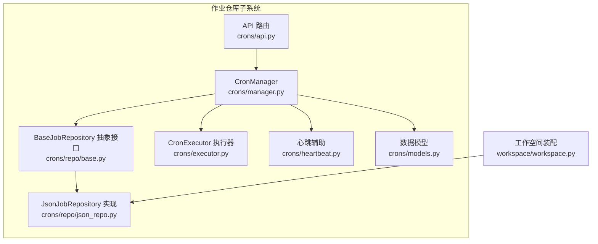
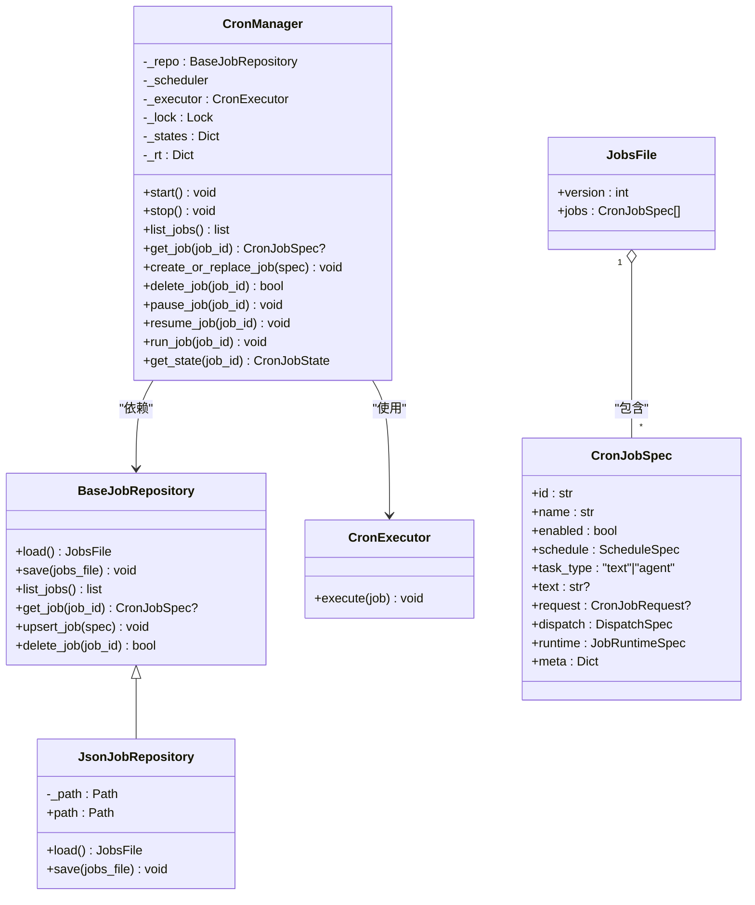
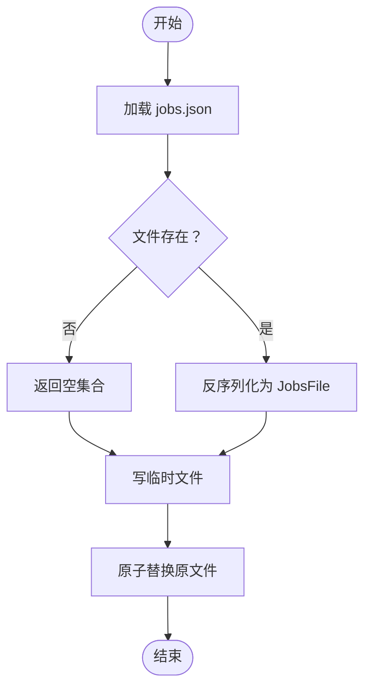
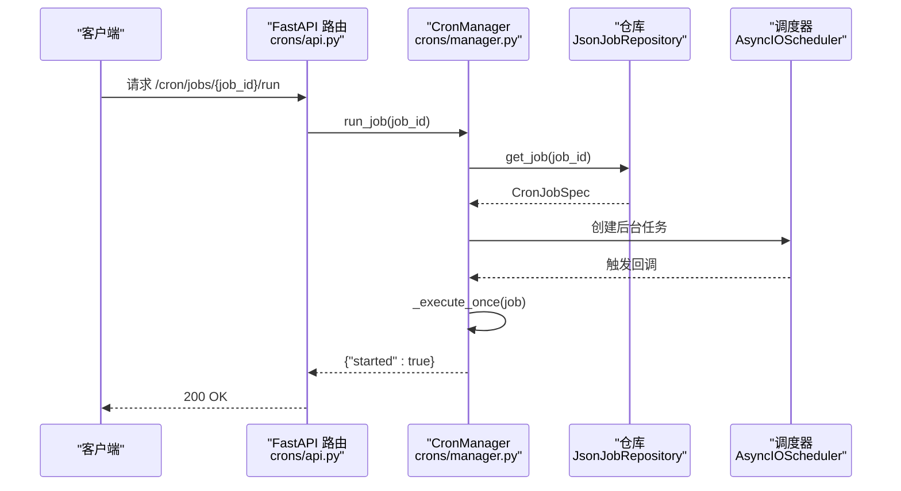
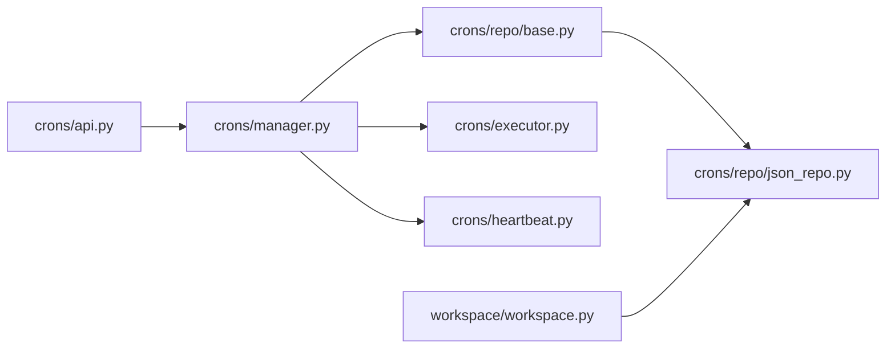

# 作业仓库

<cite>
**本文引用的文件**
- [src/qwenpaw/app/crons/repo/base.py](file://src/qwenpaw/app/crons/repo/base.py)
- [src/qwenpaw/app/crons/repo/json_repo.py](file://src/qwenpaw/app/crons/repo/json_repo.py)
- [src/qwenpaw/app/crons/models.py](file://src/qwenpaw/app/crons/models.py)
- [src/qwenpaw/app/crons/manager.py](file://src/qwenpaw/app/crons/manager.py)
- [src/qwenpaw/app/crons/api.py](file://src/qwenpaw/app/crons/api.py)
- [src/qwenpaw/app/crons/executor.py](file://src/qwenpaw/app/crons/executor.py)
- [src/qwenpaw/app/crons/heartbeat.py](file://src/qwenpaw/app/crons/heartbeat.py)
- [src/qwenpaw/app/workspace/workspace.py](file://src/qwenpaw/app/workspace/workspace.py)
</cite>

## 目录
1. [简介](#简介)
2. [项目结构](#项目结构)
3. [核心组件](#核心组件)
4. [架构总览](#架构总览)
5. [详细组件分析](#详细组件分析)
6. [依赖关系分析](#依赖关系分析)
7. [性能与并发特性](#性能与并发特性)
8. [故障排查指南](#故障排查指南)
9. [结论](#结论)
10. [附录：配置与扩展](#附录配置与扩展)

## 简介
本文件面向“作业仓库”（Cron 作业仓库）子系统，系统性阐述其数据存储设计、数据模型、持久化机制、仓库接口设计原则、读写操作流程、并发与一致性保障、可扩展性与自定义存储后端、版本与迁移策略、缓存与性能优化、以及备份与恢复最佳实践。目标是帮助开发者与运维人员快速理解并安全地维护该子系统。

## 项目结构
作业仓库相关代码主要位于以下模块：
- 仓库接口与实现：crons/repo/base.py、crons/repo/json_repo.py
- 数据模型：crons/models.py
- 业务管理器：crons/manager.py
- API 层：crons/api.py
- 执行器：crons/executor.py
- 心跳调度辅助：crons/heartbeat.py
- 工作空间装配：app/workspace/workspace.py

图表来源
- [src/qwenpaw/app/crons/api.py:1-117](file://src/qwenpaw/app/crons/api.py#L1-L117)
- [src/qwenpaw/app/crons/manager.py:1-388](file://src/qwenpaw/app/crons/manager.py#L1-L388)
- [src/qwenpaw/app/crons/repo/base.py:1-54](file://src/qwenpaw/app/crons/repo/base.py#L1-L54)
- [src/qwenpaw/app/crons/repo/json_repo.py:1-47](file://src/qwenpaw/app/crons/repo/json_repo.py#L1-L47)
- [src/qwenpaw/app/crons/executor.py:1-90](file://src/qwenpaw/app/crons/executor.py#L1-L90)
- [src/qwenpaw/app/crons/heartbeat.py:1-213](file://src/qwenpaw/app/crons/heartbeat.py#L1-L213)
- [src/qwenpaw/app/crons/models.py:1-180](file://src/qwenpaw/app/crons/models.py#L1-L180)
- [src/qwenpaw/app/workspace/workspace.py:1-389](file://src/qwenpaw/app/workspace/workspace.py#L1-L389)

章节来源
- [src/qwenpaw/app/crons/repo/base.py:1-54](file://src/qwenpaw/app/crons/repo/base.py#L1-L54)
- [src/qwenpaw/app/crons/repo/json_repo.py:1-47](file://src/qwenpaw/app/crons/repo/json_repo.py#L1-L47)
- [src/qwenpaw/app/crons/models.py:1-180](file://src/qwenpaw/app/crons/models.py#L1-L180)
- [src/qwenpaw/app/crons/manager.py:1-388](file://src/qwenpaw/app/crons/manager.py#L1-L388)
- [src/qwenpaw/app/crons/api.py:1-117](file://src/qwenpaw/app/crons/api.py#L1-L117)
- [src/qwenpaw/app/crons/executor.py:1-90](file://src/qwenpaw/app/crons/executor.py#L1-L90)
- [src/qwenpaw/app/crons/heartbeat.py:1-213](file://src/qwenpaw/app/crons/heartbeat.py#L1-L213)
- [src/qwenpaw/app/workspace/workspace.py:1-389](file://src/qwenpaw/app/workspace/workspace.py#L1-L389)

## 核心组件
- 仓库接口与实现
  - 抽象接口：BaseJobRepository 定义了统一的异步加载与保存契约，并提供常用便捷操作（列举、查询、UPSERT、删除）。
  - JSON 实现：JsonJobRepository 基于单文件 jobs.json，采用“写临时文件再原子替换”的方式实现持久化。
- 数据模型
  - CronJobSpec：作业规格，包含调度、任务类型、分发目标、运行时参数等。
  - JobsFile：作业集合容器，含版本号与作业列表。
  - CronJobState/CronJobView：运行状态与视图包装。
- 业务管理器
  - CronManager：负责启动/停止、注册/更新作业、并发控制、状态跟踪、执行派发与错误上报。
- API 层
  - 提供作业 CRUD、暂停/恢复、立即运行、状态查询等 HTTP 接口。
- 执行器与心跳
  - CronExecutor：根据作业类型（文本/代理）执行并分发到通道。
  - heartbeat 辅助：解析心跳表达式与间隔，支持按配置调度。

章节来源
- [src/qwenpaw/app/crons/repo/base.py:10-54](file://src/qwenpaw/app/crons/repo/base.py#L10-L54)
- [src/qwenpaw/app/crons/repo/json_repo.py:12-47](file://src/qwenpaw/app/crons/repo/json_repo.py#L12-L47)
- [src/qwenpaw/app/crons/models.py:59-180](file://src/qwenpaw/app/crons/models.py#L59-L180)
- [src/qwenpaw/app/crons/manager.py:38-388](file://src/qwenpaw/app/crons/manager.py#L38-L388)
- [src/qwenpaw/app/crons/api.py:13-117](file://src/qwenpaw/app/crons/api.py#L13-L117)
- [src/qwenpaw/app/crons/executor.py:13-90](file://src/qwenpaw/app/crons/executor.py#L13-L90)
- [src/qwenpaw/app/crons/heartbeat.py:40-213](file://src/qwenpaw/app/crons/heartbeat.py#L40-L213)

## 架构总览
作业仓库采用“接口+实现”的分层设计，结合 FastAPI 的路由层、管理器层、执行器层与存储层，形成清晰的职责边界。工作空间在启动时注入 JsonJobRepository 到 CronManager，确保作业配置持久化到工作空间目录下的 jobs.json 文件。

图表来源
- [src/qwenpaw/app/crons/repo/base.py:10-54](file://src/qwenpaw/app/crons/repo/base.py#L10-L54)
- [src/qwenpaw/app/crons/repo/json_repo.py:12-47](file://src/qwenpaw/app/crons/repo/json_repo.py#L12-L47)
- [src/qwenpaw/app/crons/manager.py:38-388](file://src/qwenpaw/app/crons/manager.py#L38-L388)
- [src/qwenpaw/app/crons/executor.py:13-90](file://src/qwenpaw/app/crons/executor.py#L13-L90)
- [src/qwenpaw/app/crons/models.py:163-180](file://src/qwenpaw/app/crons/models.py#L163-L180)

## 详细组件分析

### 仓库接口与实现
- 接口设计原则
  - 统一异步契约：load/save 明确为异步，便于未来扩展数据库/远程存储。
  - 常用操作封装：list_jobs/get_job/upsert_job/delete_job 提升易用性。
  - 可选原子性：save 应尽可能保证原子性，避免部分写入导致数据不一致。
- JSON 实现要点
  - 单文件存储：jobs.json，位于工作空间目录。
  - 原子写入：先写临时文件，再移动替换，避免部分写入。
  - 缺省行为：文件不存在时返回空集合，版本号默认为 1。
  - 类型校验：通过 Pydantic 模型验证与反序列化，确保数据结构正确。

章节来源
- [src/qwenpaw/app/crons/repo/base.py:10-54](file://src/qwenpaw/app/crons/repo/base.py#L10-L54)
- [src/qwenpaw/app/crons/repo/json_repo.py:12-47](file://src/qwenpaw/app/crons/repo/json_repo.py#L12-L47)

### 数据模型与序列化
- 关键模型
  - ScheduleSpec：标准化 cron 表达式（兼容 3/4/5 字段），统一周字段命名。
  - CronJobSpec：作业核心定义，包含调度、任务类型、请求体、分发目标、运行时参数与元信息。
  - JobsFile：作业集合容器，带版本号，用于后续迁移与兼容。
  - CronJobState/CronJobView：运行态与视图包装，便于 API 返回。
- 序列化与校验
  - 使用 Pydantic 进行字段校验与序列化，支持 JSON 模式导出。
  - 任务类型约束：当 task_type 为 text 时必须提供非空文本；为 agent 时必须提供请求体，并自动同步用户与会话信息。

章节来源
- [src/qwenpaw/app/crons/models.py:59-180](file://src/qwenpaw/app/crons/models.py#L59-L180)

### 读写操作流程
- 加载（load）
  - 若文件不存在，返回空集合；存在则读取并反序列化为 JobsFile。
- 保存（save）
  - 创建父目录；写入临时文件；原子替换原文件。
- 更新（upsert）
  - 先加载，若存在同 id 则替换，否则追加；最后保存。
- 删除（delete）
  - 先加载，过滤掉指定 id 的作业；若长度未变化则无变更；否则保存。

图表来源
- [src/qwenpaw/app/crons/repo/json_repo.py:29-47](file://src/qwenpaw/app/crons/repo/json_repo.py#L29-L47)

章节来源
- [src/qwenpaw/app/crons/repo/base.py:25-54](file://src/qwenpaw/app/crons/repo/base.py#L25-L54)
- [src/qwenpaw/app/crons/repo/json_repo.py:29-47](file://src/qwenpaw/app/crons/repo/json_repo.py#L29-L47)

### 并发与一致性
- 并发控制
  - CronManager 内部使用 asyncio.Lock 保护关键写路径（创建/替换、删除、启停）。
  - 每个作业使用独立信号量限制并发度（runtime.max_concurrency）。
- 一致性保障
  - 仓库保存采用原子写入策略，避免部分写入。
  - 管理器在注册/更新作业前先构建触发器并校验，失败不会污染现有调度状态。
- 错误处理
  - 后台执行任务异常被吞并并记录日志，必要时向前端推送错误消息。
  - 对无效作业在启动时自动禁用并回写仓库，保证系统稳定。

章节来源
- [src/qwenpaw/app/crons/manager.py:38-388](file://src/qwenpaw/app/crons/manager.py#L38-L388)
- [src/qwenpaw/app/crons/repo/json_repo.py:36-47](file://src/qwenpaw/app/crons/repo/json_repo.py#L36-L47)

### API 与工作流
- API 路由
  - GET /cron/jobs：列举作业
  - GET /cron/jobs/{job_id}：获取作业及状态视图
  - POST /cron/jobs：创建作业（服务端生成 id）
  - PUT /cron/jobs/{job_id}：替换作业
  - DELETE /cron/jobs/{job_id}：删除作业
  - POST /cron/jobs/{job_id}/pause：暂停
  - POST /cron/jobs/{job_id}/resume：恢复
  - POST /cron/jobs/{job_id}/run：立即运行
  - GET /cron/jobs/{job_id}/state：获取状态
- 控制流
  - API 依赖注入当前工作空间的 CronManager，所有操作委托给管理器。
  - 立即运行采用 fire-and-forget 异步任务，完成后回调更新状态。

图表来源
- [src/qwenpaw/app/crons/api.py:97-105](file://src/qwenpaw/app/crons/api.py#L97-L105)
- [src/qwenpaw/app/crons/manager.py:190-214](file://src/qwenpaw/app/crons/manager.py#L190-L214)

章节来源
- [src/qwenpaw/app/crons/api.py:13-117](file://src/qwenpaw/app/crons/api.py#L13-L117)
- [src/qwenpaw/app/crons/manager.py:190-214](file://src/qwenpaw/app/crons/manager.py#L190-L214)

### 执行器与分发
- 文本任务：直接将固定文本发送到指定通道与会话。
- 代理任务：以作业中的请求作为输入，通过 runner 流式查询，逐事件发送到通道。
- 超时与取消：按作业超时时间限制执行；支持取消并记录状态。

章节来源
- [src/qwenpaw/app/crons/executor.py:18-90](file://src/qwenpaw/app/crons/executor.py#L18-L90)

### 心跳与调度
- 心跳支持两种模式：cron 表达式与间隔字符串（如 30m、1h）。
- CronManager 在启动时根据配置注册心跳作业，支持动态重调度。
- 触发器构建严格校验 cron 字段数量与格式。

章节来源
- [src/qwenpaw/app/crons/heartbeat.py:40-213](file://src/qwenpaw/app/crons/heartbeat.py#L40-L213)
- [src/qwenpaw/app/crons/manager.py:295-315](file://src/qwenpaw/app/crons/manager.py#L295-L315)

## 依赖关系分析
- 组件耦合
  - CronManager 依赖 BaseJobRepository（抽象）、CronExecutor（执行）、AsyncIOScheduler（调度）。
  - API 仅依赖 CronManager，保持路由层薄。
  - 工作空间装配 CronManager 时注入 JsonJobRepository，形成端到端闭环。
- 外部依赖
  - APScheduler：异步调度器，支持 CronTrigger/IntervalTrigger。
  - Pydantic：数据模型与序列化。
  - Python 标准库：json、shutil、pathlib、asyncio。

图表来源
- [src/qwenpaw/app/crons/api.py:1-117](file://src/qwenpaw/app/crons/api.py#L1-L117)
- [src/qwenpaw/app/crons/manager.py:1-388](file://src/qwenpaw/app/crons/manager.py#L1-L388)
- [src/qwenpaw/app/crons/repo/base.py:1-54](file://src/qwenpaw/app/crons/repo/base.py#L1-L54)
- [src/qwenpaw/app/crons/repo/json_repo.py:1-47](file://src/qwenpaw/app/crons/repo/json_repo.py#L1-L47)
- [src/qwenpaw/app/crons/executor.py:1-90](file://src/qwenpaw/app/crons/executor.py#L1-L90)
- [src/qwenpaw/app/crons/heartbeat.py:1-213](file://src/qwenpaw/app/crons/heartbeat.py#L1-L213)
- [src/qwenpaw/app/workspace/workspace.py:241-262](file://src/qwenpaw/app/workspace/workspace.py#L241-L262)

章节来源
- [src/qwenpaw/app/workspace/workspace.py:241-262](file://src/qwenpaw/app/workspace/workspace.py#L241-L262)
- [src/qwenpaw/app/crons/manager.py:38-111](file://src/qwenpaw/app/crons/manager.py#L38-L111)

## 性能与并发特性
- 并发控制
  - 作业级信号量限制并发，避免资源争用。
  - 管理器关键路径加锁，保证状态一致性。
- I/O 与序列化
  - JSON 文件读写为本地磁盘 I/O，建议将工作空间置于高性能存储。
  - 原子写入减少竞态窗口。
- 调度与状态
  - APScheduler 高效管理触发器；状态缓存于内存字典，降低重复查询成本。
- 超时与取消
  - 代理任务设置超时，防止长时间阻塞；支持取消并及时清理状态。

章节来源
- [src/qwenpaw/app/crons/manager.py:38-388](file://src/qwenpaw/app/crons/manager.py#L38-L388)
- [src/qwenpaw/app/crons/executor.py:75-90](file://src/qwenpaw/app/crons/executor.py#L75-L90)

## 故障排查指南
- 常见问题
  - 作业未生效：检查 CronManager 是否已启动；确认作业 enabled 且调度器已注册。
  - 立即运行失败：查看后台任务回调日志；确认通道与会话配置正确。
  - 数据不一致：确认保存是否成功；检查临时文件是否被中断。
- 日志定位
  - CronManager 在启动时对无效作业进行警告并自动禁用，便于快速定位配置问题。
  - 执行器与心跳均输出详细上下文日志，包含作业 id、通道、用户与会话标识。
- 建议
  - 对生产环境启用更严格的 cron 校验与超时设置。
  - 定期巡检 jobs.json 文件完整性与权限。

章节来源
- [src/qwenpaw/app/crons/manager.py:63-111](file://src/qwenpaw/app/crons/manager.py#L63-L111)
- [src/qwenpaw/app/crons/manager.py:217-239](file://src/qwenpaw/app/crons/manager.py#L217-L239)
- [src/qwenpaw/app/crons/executor.py:28-36](file://src/qwenpaw/app/crons/executor.py#L28-L36)

## 结论
作业仓库通过清晰的接口分层、严谨的数据模型与原子持久化策略，实现了高可用的 Cron 作业管理。配合并发控制、状态跟踪与错误上报机制，能够在复杂场景下保持稳定性与可观测性。对于扩展需求，可通过实现 BaseJobRepository 接口接入新的存储后端；对于版本演进，可在 JobsFile 中引入版本号并编写迁移逻辑。

## 附录：配置与扩展

### 仓库配置与装配
- 工作空间装配
  - 工作空间在注册 CronManager 服务时，注入 JsonJobRepository，路径为工作空间目录下的 jobs.json。
- 运行时参数
  - timezone：调度器时区。
  - agent_id：用于加载心跳配置与状态关联。

章节来源
- [src/qwenpaw/app/workspace/workspace.py:241-262](file://src/qwenpaw/app/workspace/workspace.py#L241-L262)
- [src/qwenpaw/app/crons/manager.py:38-56](file://src/qwenpaw/app/crons/manager.py#L38-L56)

### 自定义存储后端
- 实现步骤
  - 实现 BaseJobRepository 接口的所有方法（load/save）。
  - 如需原子写入，参考 JsonJobRepository 的“写临时文件再替换”策略。
  - 在工作空间装配处替换为自定义实现。
- 注意事项
  - 保证异步契约与线程安全。
  - 对数据模型进行严格校验与序列化。

章节来源
- [src/qwenpaw/app/crons/repo/base.py:10-21](file://src/qwenpaw/app/crons/repo/base.py#L10-L21)
- [src/qwenpaw/app/crons/repo/json_repo.py:36-47](file://src/qwenpaw/app/crons/repo/json_repo.py#L36-L47)
- [src/qwenpaw/app/workspace/workspace.py:241-262](file://src/qwenpaw/app/workspace/workspace.py#L241-L262)

### 数据迁移与版本升级
- 版本策略
  - 在 JobsFile 中维护 version 字段，新增字段或结构变更时，读取时进行兼容转换。
- 迁移流程
  - 读取旧版本 JobsFile；
  - 将旧字段映射到新结构；
  - 写回新版本；
  - 记录迁移日志，便于回滚。
- 建议
  - 保留旧版本读取逻辑一段时间，确保平滑过渡。

章节来源
- [src/qwenpaw/app/crons/models.py:163-166](file://src/qwenpaw/app/crons/models.py#L163-L166)

### 缓存与性能优化
- 状态缓存
  - CronManager 内部维护作业状态字典，减少重复查询。
- 并发优化
  - 作业级信号量限制并发，避免过载。
  - 调度器与执行器均为异步，提升吞吐。
- 存储优化
  - 使用原子写入减少锁竞争；
  - 将工作空间目录置于高性能磁盘。

章节来源
- [src/qwenpaw/app/crons/manager.py:58-61](file://src/qwenpaw/app/crons/manager.py#L58-L61)
- [src/qwenpaw/app/crons/manager.py:248-250](file://src/qwenpaw/app/crons/manager.py#L248-L250)
- [src/qwenpaw/app/crons/repo/json_repo.py:36-47](file://src/qwenpaw/app/crons/repo/json_repo.py#L36-L47)

### 备份与恢复最佳实践
- 备份
  - 定期复制工作空间目录下的 jobs.json；
  - 建议保留多个历史版本，便于回滚。
- 恢复
  - 停止服务后，将备份文件覆盖到原位置；
  - 启动服务后检查 CronManager 日志，确认作业已正确注册。
- 安全
  - 对备份文件进行权限控制，避免未授权修改。

章节来源
- [src/qwenpaw/app/crons/repo/json_repo.py:36-47](file://src/qwenpaw/app/crons/repo/json_repo.py#L36-L47)
- [src/qwenpaw/app/crons/manager.py:63-111](file://src/qwenpaw/app/crons/manager.py#L63-L111)