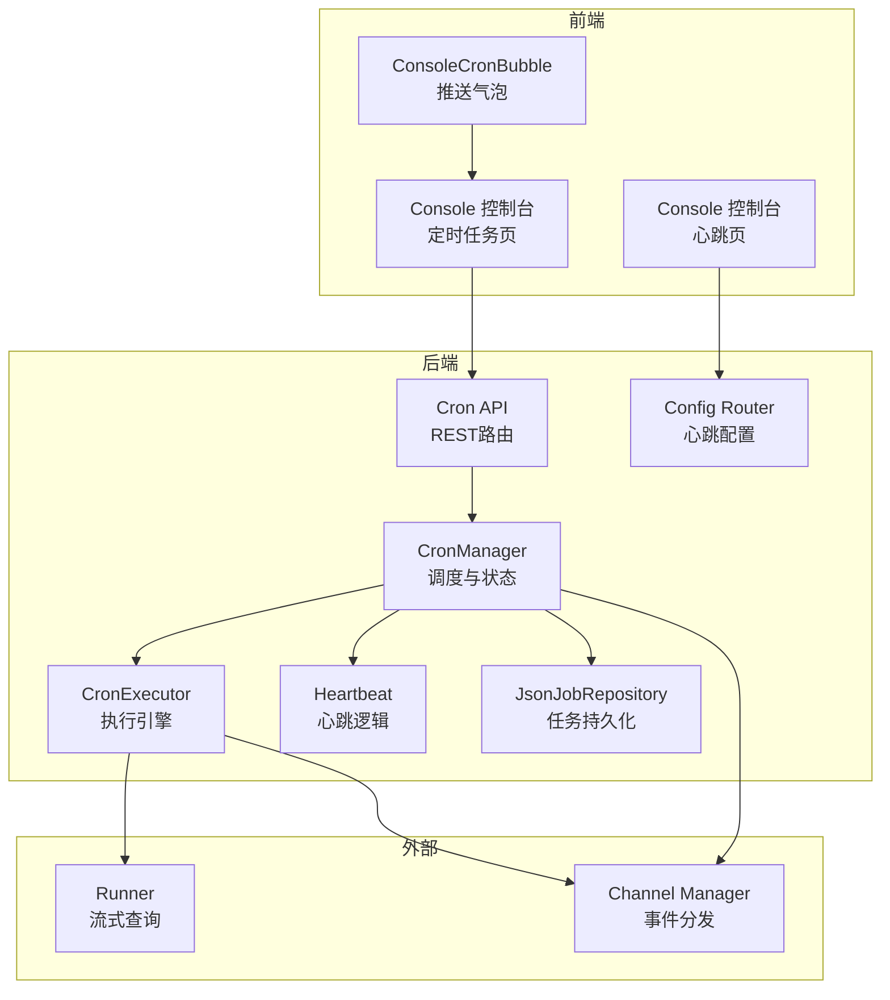
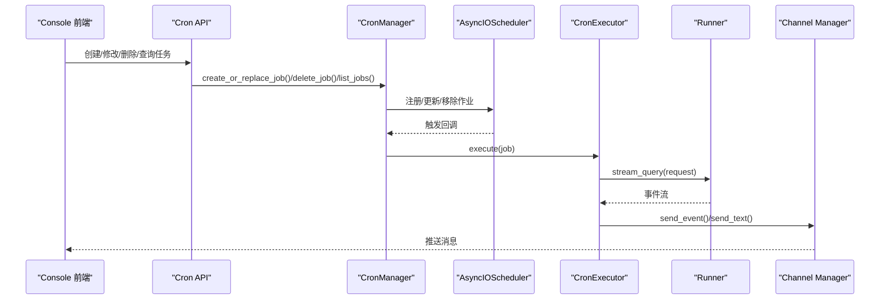
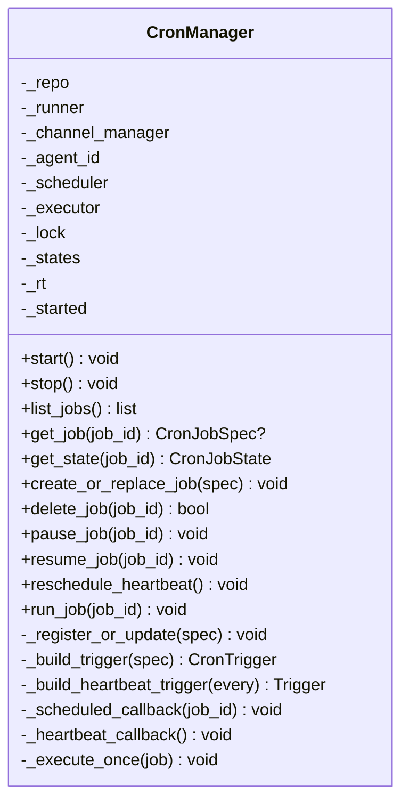
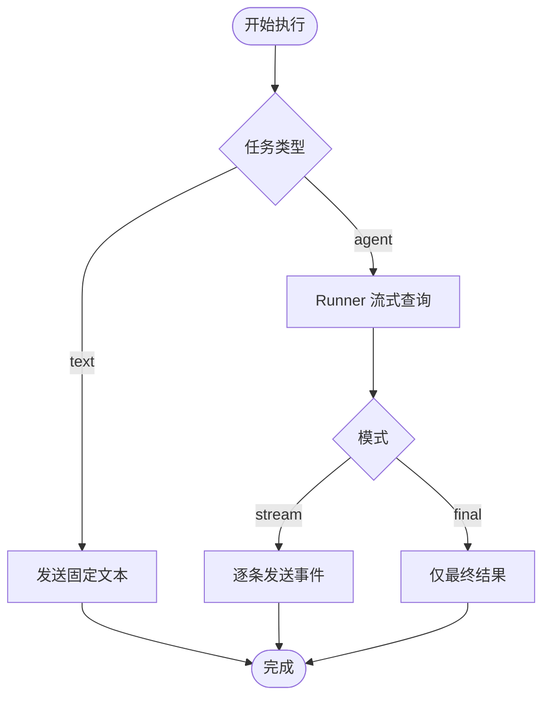
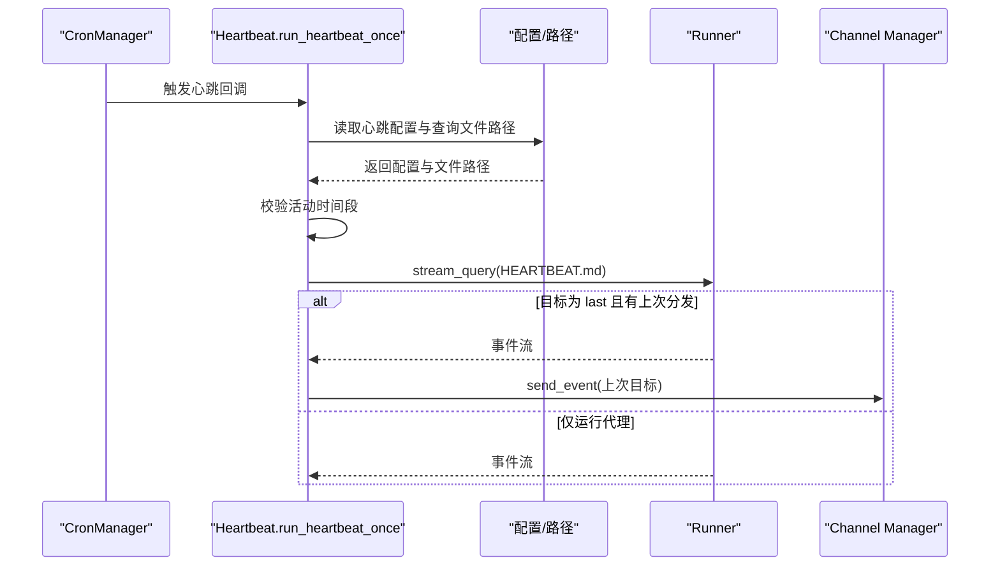
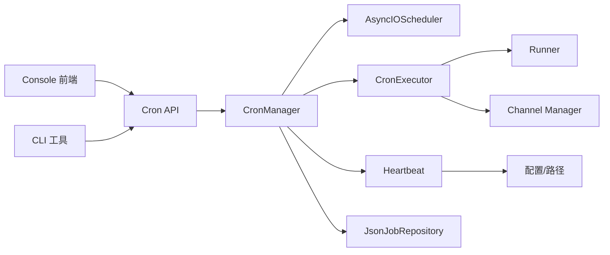

# 定时任务系统

<cite>
**本文引用的文件**
- [src/qwenpaw/app/crons/manager.py](file://src/qwenpaw/app/crons/manager.py)
- [src/qwenpaw/app/crons/executor.py](file://src/qwenpaw/app/crons/executor.py)
- [src/qwenpaw/app/crons/heartbeat.py](file://src/qwenpaw/app/crons/heartbeat.py)
- [src/qwenpaw/app/crons/models.py](file://src/qwenpaw/app/crons/models.py)
- [src/qwenpaw/app/crons/repo/base.py](file://src/qwenpaw/app/crons/repo/base.py)
- [src/qwenpaw/app/crons/repo/json_repo.py](file://src/qwenpaw/app/crons/repo/json_repo.py)
- [src/qwenpaw/app/crons/api.py](file://src/qwenpaw/app/crons/api.py)
- [src/qwenpaw/app/routers/config.py](file://src/qwenpaw/app/routers/config.py)
- [src/qwenpaw/config/config.py](file://src/qwenpaw/config/config.py)
- [src/qwenpaw/cli/cron_cmd.py](file://src/qwenpaw/cli/cron_cmd.py)
- [src/qwenpaw/app/runner/task_tracker.py](file://src/qwenpaw/app/runner/task_tracker.py)
- [console/src/api/modules/cronjob.ts](file://console/src/api/modules/cronjob.ts)
- [console/src/pages/Control/CronJobs/index.tsx](file://console/src/pages/Control/CronJobs/index.tsx)
- [console/src/pages/Control/Heartbeat/index.tsx](file://console/src/pages/Control/Heartbeat/index.tsx)
- [console/src/components/ConsoleCronBubble/index.tsx](file://console/src/components/ConsoleCronBubble/index.tsx)
- [console/src/api/modules/heartbeat.ts](file://console/src/api/modules/heartbeat.ts)
- [website/public/docs/heartbeat.en.md](file://website/public/docs/heartbeat.en.md)
</cite>

## 目录
1. [简介](#简介)
2. [项目结构](#项目结构)
3. [核心组件](#核心组件)
4. [架构总览](#架构总览)
5. [详细组件分析](#详细组件分析)
6. [依赖分析](#依赖分析)
7. [性能考虑](#性能考虑)
8. [故障排除指南](#故障排除指南)
9. [结论](#结论)
10. [附录](#附录)

## 简介
本技术文档面向QwenPaw的定时任务系统，围绕基于Cron的作业管理、心跳机制、执行引擎、任务监控与API使用进行系统性说明。内容涵盖任务定义与调度算法、并发与超时控制、状态跟踪与日志、任务配置与参数化（Cron表达式、执行参数、重试策略）、任务管理API、与代理系统的集成（触发与结果分发）、最佳实践与性能优化，以及故障排除与调试技巧。

## 项目结构
定时任务系统主要由以下模块构成：
- 调度与管理：CronManager负责加载任务、注册APScheduler作业、维护状态与并发控制、触发心跳。
- 执行引擎：CronExecutor负责具体任务执行，支持“文本消息”和“代理问答”两类任务，并通过通道管理器发送事件。
- 心跳机制：heartbeat模块解析心跳配置（间隔或Cron），在指定时间窗口内运行HEARTBEAT.md内容，可选择回发到上次目标。
- 数据模型：models定义任务规格、调度、派发、运行时参数与状态视图。
- 存储仓库：repo抽象了任务持久化接口，JsonJobRepository提供单文件JSON存储。
- API层：FastAPI路由提供任务的增删改查、暂停/恢复、立即执行与状态查询。
- 配置与CLI：配置路由支持热更新心跳；CLI提供命令行工具对定时任务进行管理。
- 前端集成：Console前端提供可视化界面与推送气泡提示，展示错误与状态。

图表来源
- [src/qwenpaw/app/crons/manager.py:38-118](file://src/qwenpaw/app/crons/manager.py#L38-L118)
- [src/qwenpaw/app/crons/executor.py:13-90](file://src/qwenpaw/app/crons/executor.py#L13-L90)
- [src/qwenpaw/app/crons/heartbeat.py:119-213](file://src/qwenpaw/app/crons/heartbeat.py#L119-L213)
- [src/qwenpaw/app/crons/repo/json_repo.py:12-47](file://src/qwenpaw/app/crons/repo/json_repo.py#L12-L47)
- [src/qwenpaw/app/crons/api.py:13-117](file://src/qwenpaw/app/crons/api.py#L13-L117)
- [src/qwenpaw/app/routers/config.py:303-342](file://src/qwenpaw/app/routers/config.py#L303-L342)

章节来源
- [src/qwenpaw/app/crons/manager.py:38-118](file://src/qwenpaw/app/crons/manager.py#L38-L118)
- [src/qwenpaw/app/crons/api.py:13-117](file://src/qwenpaw/app/crons/api.py#L13-L117)

## 核心组件
- CronManager：异步调度器封装，负责启动/停止、任务注册/更新/删除、暂停/恢复、心跳重调度、状态维护与并发信号量。
- CronExecutor：任务执行器，根据任务类型分别发送固定文本或向代理发起问答并按模式（流式/最终）分发事件。
- Heartbeat：心跳逻辑，解析“间隔字符串”或“Cron表达式”，在用户时区内活动时间段内运行HEARTBEAT.md查询，可回发至上次目标。
- 模型与仓库：CronJobSpec/CronJobState等数据模型，JsonJobRepository提供jobs.json单文件原子写入。
- API与CLI：REST API提供任务全生命周期管理；CLI提供命令行工具。
- 前端：Console页面与推送气泡，展示任务列表、状态与错误提示。

章节来源
- [src/qwenpaw/app/crons/manager.py:38-388](file://src/qwenpaw/app/crons/manager.py#L38-L388)
- [src/qwenpaw/app/crons/executor.py:13-90](file://src/qwenpaw/app/crons/executor.py#L13-L90)
- [src/qwenpaw/app/crons/heartbeat.py:119-213](file://src/qwenpaw/app/crons/heartbeat.py#L119-L213)
- [src/qwenpaw/app/crons/models.py:59-180](file://src/qwenpaw/app/crons/models.py#L59-L180)
- [src/qwenpaw/app/crons/repo/json_repo.py:12-47](file://src/qwenpaw/app/crons/repo/json_repo.py#L12-L47)
- [src/qwenpaw/app/crons/api.py:13-117](file://src/qwenpaw/app/crons/api.py#L13-L117)
- [src/qwenpaw/cli/cron_cmd.py:27-480](file://src/qwenpaw/cli/cron_cmd.py#L27-L480)

## 架构总览
定时任务系统采用“调度器+执行器+仓库+API+前端”的分层设计：
- 调度层：基于AsyncIOScheduler，支持CronTrigger与IntervalTrigger，作业注册时设置misfire宽限与并发信号量。
- 执行层：按任务类型分流，文本任务直接发送，代理任务通过Runner流式查询并将事件逐条分发给通道管理器。
- 监控层：CronManager维护每个作业的状态（下一次运行、最近一次运行、最近状态、错误信息），并通过控制台推送存储上报错误。
- 配置层：心跳配置支持“间隔字符串”和“Cron表达式”，并可设置活动时间段；配置变更通过路由热更新调度器中的心跳作业。

图表来源
- [src/qwenpaw/app/crons/api.py:28-117](file://src/qwenpaw/app/crons/api.py#L28-L117)
- [src/qwenpaw/app/crons/manager.py:242-328](file://src/qwenpaw/app/crons/manager.py#L242-L328)
- [src/qwenpaw/app/crons/executor.py:18-90](file://src/qwenpaw/app/crons/executor.py#L18-L90)

## 详细组件分析

### CronManager：调度与状态管理
- 启动流程：加载jobs.json，逐个注册作业，构建CronTrigger或IntervalTrigger，设置misfire宽限与并发信号量；如启用心跳则注册心跳作业。
- 作业控制：创建/替换、删除、暂停/恢复；删除时清理状态与运行时信号量；运行时状态通过字典维护。
- 心跳重调度：读取心跳配置，移除旧心跳作业，按新配置添加或移除心跳作业。
- 异常处理：后台任务失败通过控制台推送存储上报，避免阻塞调用方。

图表来源
- [src/qwenpaw/app/crons/manager.py:38-388](file://src/qwenpaw/app/crons/manager.py#L38-L388)

章节来源
- [src/qwenpaw/app/crons/manager.py:63-118](file://src/qwenpaw/app/crons/manager.py#L63-L118)
- [src/qwenpaw/app/crons/manager.py:132-153](file://src/qwenpaw/app/crons/manager.py#L132-L153)
- [src/qwenpaw/app/crons/manager.py:154-189](file://src/qwenpaw/app/crons/manager.py#L154-L189)
- [src/qwenpaw/app/crons/manager.py:190-214](file://src/qwenpaw/app/crons/manager.py#L190-L214)
- [src/qwenpaw/app/crons/manager.py:242-328](file://src/qwenpaw/app/crons/manager.py#L242-L328)
- [src/qwenpaw/app/crons/manager.py:349-388](file://src/qwenpaw/app/crons/manager.py#L349-L388)

### CronExecutor：任务执行引擎
- 文本任务：直接调用通道管理器发送文本消息。
- 代理任务：构造请求（携带目标用户与会话），通过Runner流式查询，按模式（stream/final）逐条发送事件到通道。
- 超时控制：以任务运行时超时秒数限制执行时间，超时抛出异常。
- 错误传播：取消与异常均向上抛出，由调用方统一处理。

图表来源
- [src/qwenpaw/app/crons/executor.py:18-90](file://src/qwenpaw/app/crons/executor.py#L18-L90)

章节来源
- [src/qwenpaw/app/crons/executor.py:18-90](file://src/qwenpaw/app/crons/executor.py#L18-L90)

### 心跳机制：定期检查、状态报告与异常检测
- 配置解析：支持“间隔字符串（如30m、1h）”与“Cron表达式（5字段）”，并校验活动时间段（用户时区）。
- 执行流程：读取HEARTBEAT.md内容，构造用户消息请求，运行代理；若目标为“last”且存在上次分发，则将事件回发到上次目标；否则仅运行代理。
- 异常处理：超时与异常被记录并忽略，确保不影响主循环。

图表来源
- [src/qwenpaw/app/crons/heartbeat.py:119-213](file://src/qwenpaw/app/crons/heartbeat.py#L119-L213)
- [src/qwenpaw/app/crons/manager.py:329-348](file://src/qwenpaw/app/crons/manager.py#L329-L348)

章节来源
- [src/qwenpaw/app/crons/heartbeat.py:40-117](file://src/qwenpaw/app/crons/heartbeat.py#L40-L117)
- [src/qwenpaw/app/crons/heartbeat.py:119-213](file://src/qwenpaw/app/crons/heartbeat.py#L119-L213)
- [src/qwenpaw/app/routers/config.py:303-342](file://src/qwenpaw/app/routers/config.py#L303-L342)

### 任务配置与参数化
- Cron表达式：支持5字段（分钟 小时 日 月 星期），自动规范化星期字段；不支持6字段（秒）。
- 执行参数：最大并发、单次执行超时、错过触发的宽限秒数。
- 重试策略：未实现内置重试；可通过调整misfire宽限与并发控制规避重复执行风险。
- 分发目标：指定通道、用户与会话，支持流式/最终两种模式。

章节来源
- [src/qwenpaw/app/crons/models.py:59-180](file://src/qwenpaw/app/crons/models.py#L59-L180)
- [src/qwenpaw/app/crons/manager.py:274-294](file://src/qwenpaw/app/crons/manager.py#L274-L294)

### 任务管理API使用指南
- 列表与详情：GET /cron/jobs、GET /cron/jobs/{job_id}
- 创建与替换：POST /cron/jobs、PUT /cron/jobs/{job_id}
- 删除：DELETE /cron/jobs/{job_id}
- 控制：POST /cron/jobs/{job_id}/pause、POST /cron/jobs/{job_id}/resume
- 立即执行：POST /cron/jobs/{job_id}/run
- 状态查询：GET /cron/jobs/{job_id}/state

前端与CLI映射：
- Console前端通过[cronjob.ts:8-53](file://console/src/api/modules/cronjob.ts#L8-L53)调用上述API。
- CLI命令通过[cron_cmd.py:36-480](file://src/qwenpaw/cli/cron_cmd.py#L36-L480)封装HTTP请求。

章节来源
- [src/qwenpaw/app/crons/api.py:28-117](file://src/qwenpaw/app/crons/api.py#L28-L117)
- [console/src/api/modules/cronjob.ts:8-53](file://console/src/api/modules/cronjob.ts#L8-L53)
- [src/qwenpaw/cli/cron_cmd.py:36-480](file://src/qwenpaw/cli/cron_cmd.py#L36-L480)

### 任务与代理系统的集成
- 触发：CronManager注册作业后，由调度器在到期时调用回调；也可通过/run接口触发一次性执行。
- 结果处理：CronExecutor通过Runner流式查询获取事件，再由通道管理器将事件发送到指定通道；错误通过控制台推送存储上报。
- 会话与用户：任务请求中携带目标用户与会话ID，确保上下文一致。

章节来源
- [src/qwenpaw/app/crons/manager.py:190-214](file://src/qwenpaw/app/crons/manager.py#L190-L214)
- [src/qwenpaw/app/crons/executor.py:18-90](file://src/qwenpaw/app/crons/executor.py#L18-L90)
- [src/qwenpaw/app/crons/manager.py:349-388](file://src/qwenpaw/app/crons/manager.py#L349-L388)

## 依赖分析
- CronManager依赖：AsyncIOScheduler、CronExecutor、心跳函数、仓库接口、控制台推送存储。
- CronExecutor依赖：Runner流式查询、通道管理器。
- 心跳模块依赖：配置函数、文件读取、时区解析。
- API依赖：CronManager依赖注入、异常处理。
- 前端依赖：API模块、页面组件、推送轮询。

图表来源
- [src/qwenpaw/app/crons/api.py:13-25](file://src/qwenpaw/app/crons/api.py#L13-L25)
- [src/qwenpaw/app/crons/manager.py:38-61](file://src/qwenpaw/app/crons/manager.py#L38-L61)
- [src/qwenpaw/app/crons/executor.py:13-17](file://src/qwenpaw/app/crons/executor.py#L13-L17)
- [src/qwenpaw/app/crons/heartbeat.py:119-136](file://src/qwenpaw/app/crons/heartbeat.py#L119-L136)
- [console/src/api/modules/cronjob.ts:8-53](file://console/src/api/modules/cronjob.ts#L8-L53)
- [src/qwenpaw/cli/cron_cmd.py:36-480](file://src/qwenpaw/cli/cron_cmd.py#L36-L480)

章节来源
- [src/qwenpaw/app/crons/manager.py:38-61](file://src/qwenpaw/app/crons/manager.py#L38-L61)
- [src/qwenpaw/app/crons/executor.py:13-17](file://src/qwenpaw/app/crons/executor.py#L13-L17)
- [src/qwenpaw/app/crons/heartbeat.py:119-136](file://src/qwenpaw/app/crons/heartbeat.py#L119-L136)
- [src/qwenpaw/app/crons/api.py:13-25](file://src/qwenpaw/app/crons/api.py#L13-L25)
- [console/src/api/modules/cronjob.ts:8-53](file://console/src/api/modules/cronjob.ts#L8-L53)
- [src/qwenpaw/cli/cron_cmd.py:36-480](file://src/qwenpaw/cli/cron_cmd.py#L36-L480)

## 性能考虑
- 并发控制：每个作业独立信号量限制最大并发，避免资源争用；建议根据下游通道与Runner能力合理设置max_concurrency。
- 超时与宽限：设置合理的timeout_seconds与misfire_grace_seconds，防止长时间阻塞与重复执行。
- 事件分发：流式模式适合长耗时任务，但需注意网络与前端轮询开销；最终模式减少事件数量但可能丢失中间态。
- 心跳频率：心跳间隔不宜过短，避免频繁读取文件与运行代理；结合活动时间段减少无效执行。
- 存储写入：JsonJobRepository采用临时文件+替换的方式保证原子性，建议避免高并发频繁写入。

## 故障排除指南
- 任务未执行
  - 检查作业是否启用、调度器是否启动、Cron表达式是否有效。
  - 查看作业状态（下一次运行、最近状态、错误信息）。
- 执行失败
  - 查看CronManager日志与控制台推送气泡中的错误提示；必要时提高日志级别。
  - 检查Runner与通道管理器可用性；确认目标用户/会话ID正确。
- 心跳异常
  - 确认心跳配置（enabled、every、target、active_hours）；检查HEARTBEAT.md是否存在且非空。
  - 若target=last，确认agent.json中的last_dispatch存在且完整。
- 配置热更新
  - 通过配置路由更新心跳配置后，CronManager会异步重调度心跳作业；如失败会在日志中记录警告。

章节来源
- [src/qwenpaw/app/crons/manager.py:217-239](file://src/qwenpaw/app/crons/manager.py#L217-L239)
- [src/qwenpaw/app/crons/heartbeat.py:119-213](file://src/qwenpaw/app/crons/heartbeat.py#L119-L213)
- [src/qwenpaw/app/routers/config.py:303-342](file://src/qwenpaw/app/routers/config.py#L303-L342)
- [console/src/components/ConsoleCronBubble/index.tsx:17-30](file://console/src/components/ConsoleCronBubble/index.tsx#L17-L30)

## 结论
QwenPaw的定时任务系统以APScheduler为核心，结合自研执行器与仓库抽象，提供了稳定、可扩展的任务调度能力。通过清晰的API与前端界面，用户可以便捷地创建、管理与监控任务；心跳机制进一步增强了系统的可观测性与自愈能力。建议在生产环境中合理配置并发与超时参数，关注事件分发模式与心跳频率，以获得更佳的性能与稳定性。

## 附录

### Cron表达式语法与示例
- 5字段格式：分钟 小时 日 月 星期（星期0=周日）
- 支持范围、列表与步进表达式；系统会将数字形式的星期统一为英文缩写。
- 不支持6字段（秒）。

章节来源
- [src/qwenpaw/app/crons/models.py:59-88](file://src/qwenpaw/app/crons/models.py#L59-L88)

### 心跳配置字段说明
- enabled：是否启用心跳
- every：间隔字符串（如30m、1h）或5字段Cron表达式
- target：main（仅运行代理）、last（回发到上次目标）
- active_hours：活动时间段（start/end）

章节来源
- [website/public/docs/heartbeat.en.md:77-89](file://website/public/docs/heartbeat.en.md#L77-L89)
- [src/qwenpaw/app/routers/config.py:303-342](file://src/qwenpaw/app/routers/config.py#L303-L342)
- [console/src/pages/Control/Heartbeat/index.tsx:51-149](file://console/src/pages/Control/Heartbeat/index.tsx#L51-L149)