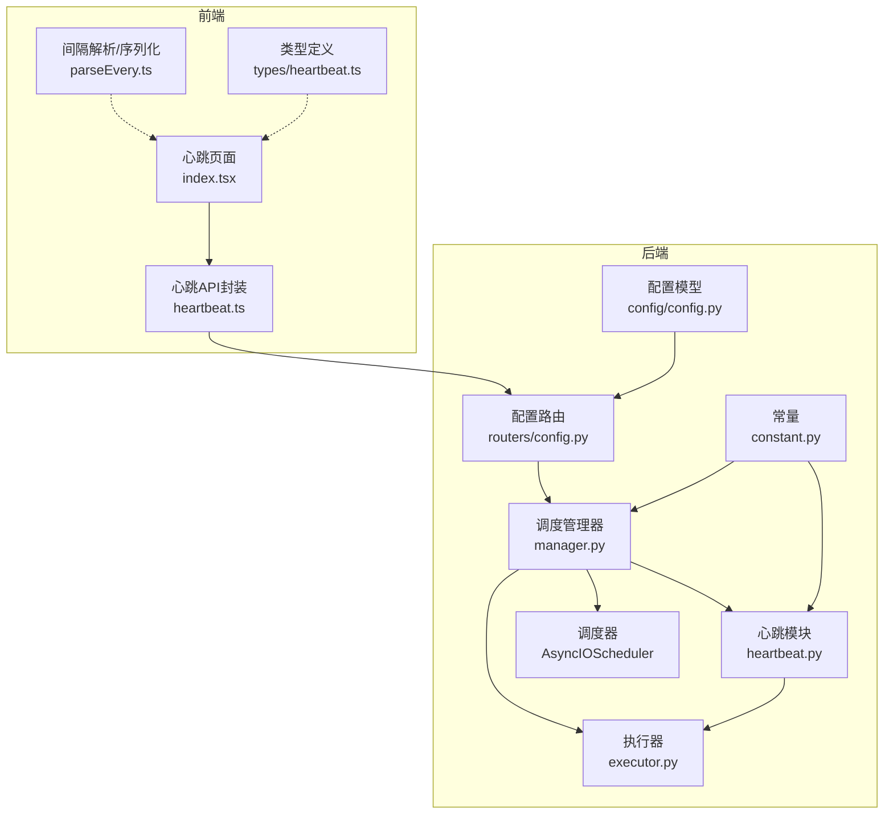
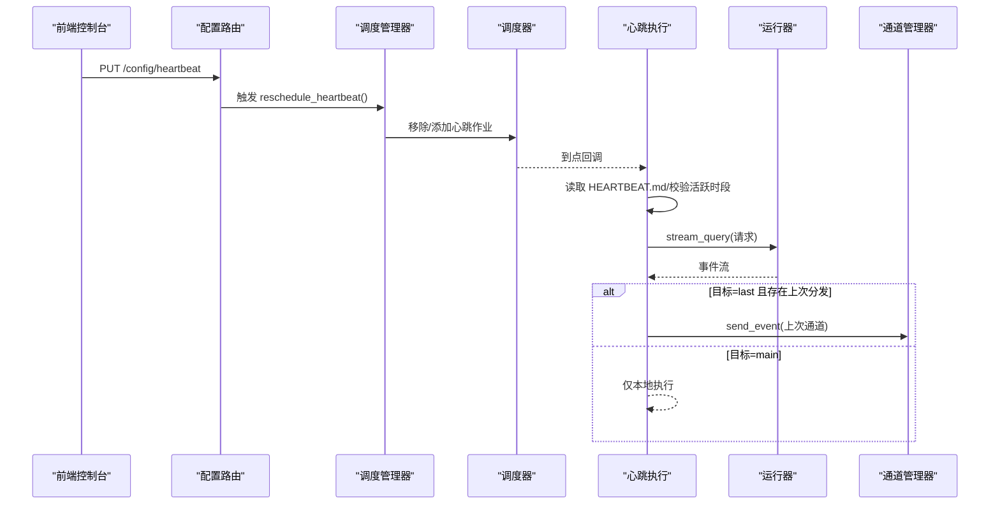
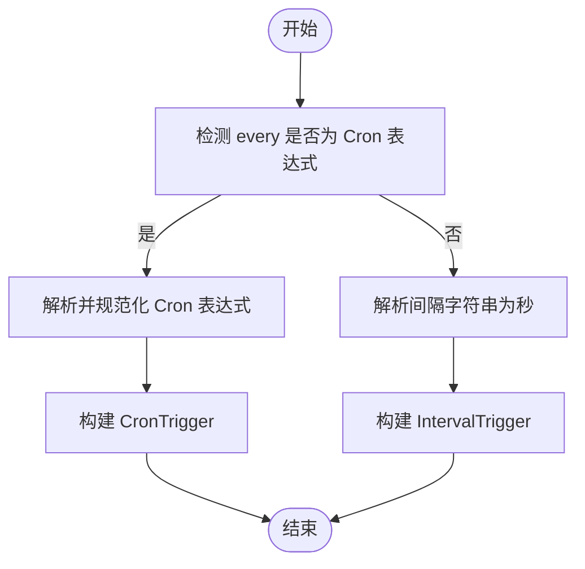
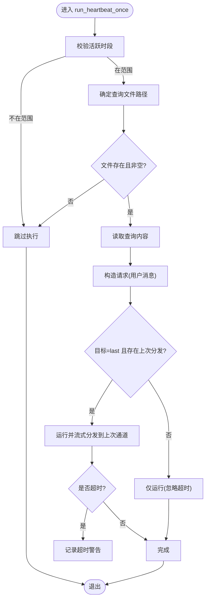
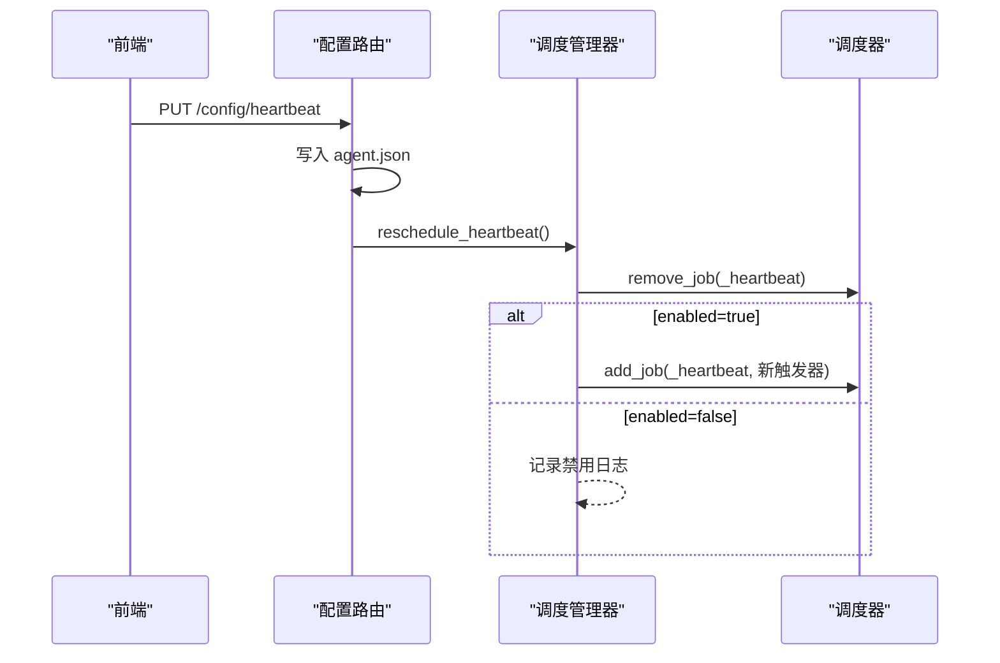
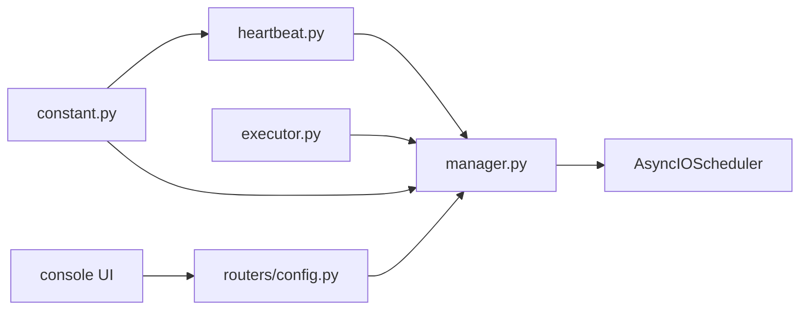

# 心跳机制

<cite>
**本文引用的文件**
- [src/qwenpaw/app/crons/heartbeat.py](file://src/qwenpaw/app/crons/heartbeat.py)
- [src/qwenpaw/app/crons/manager.py](file://src/qwenpaw/app/crons/manager.py)
- [src/qwenpaw/app/crons/executor.py](file://src/qwenpaw/app/crons/executor.py)
- [src/qwenpaw/app/crons/models.py](file://src/qwenpaw/app/crons/models.py)
- [src/qwenpaw/app/routers/config.py](file://src/qwenpaw/app/routers/config.py)
- [src/qwenpaw/config/config.py](file://src/qwenpaw/config/config.py)
- [src/qwenpaw/constant.py](file://src/qwenpaw/constant.py)
- [console/src/pages/Control/Heartbeat/index.tsx](file://console/src/pages/Control/Heartbeat/index.tsx)
- [console/src/pages/Control/Heartbeat/parseEvery.ts](file://console/src/pages/Control/Heartbeat/parseEvery.ts)
- [console/src/api/modules/heartbeat.ts](file://console/src/api/modules/heartbeat.ts)
- [console/src/api/types/heartbeat.ts](file://console/src/api/types/heartbeat.ts)
- [website/public/docs/heartbeat.zh.md](file://website/public/docs/heartbeat.zh.md)
</cite>

## 目录
1. [简介](#简介)
2. [项目结构](#项目结构)
3. [核心组件](#核心组件)
4. [架构总览](#架构总览)
5. [详细组件分析](#详细组件分析)
6. [依赖分析](#依赖分析)
7. [性能考虑](#性能考虑)
8. [故障排除指南](#故障排除指南)
9. [结论](#结论)
10. [附录](#附录)

## 简介
本文件系统性地阐述心跳机制的设计原理与实现细节，覆盖心跳触发器的构建逻辑（Cron 表达式解析与时间间隔计算）、心跳任务的执行流程（健康检查、状态报告与异常检测）、动态配置更新与重新调度、与代理系统及通道的集成方式、以及监控与诊断方法。同时给出配置项与自定义参数说明，并提供常见问题排查建议。

## 项目结构
心跳机制涉及后端 Python 服务与前端控制台两部分：
- 后端负责心跳触发器构建、调度、执行与状态管理，以及与通道系统的对接。
- 前端提供心跳配置界面，支持启用/禁用、间隔设置、目标通道选择与活跃时段配置。

图表来源
- [src/qwenpaw/app/crons/heartbeat.py:1-213](file://src/qwenpaw/app/crons/heartbeat.py#L1-L213)
- [src/qwenpaw/app/crons/manager.py:1-388](file://src/qwenpaw/app/crons/manager.py#L1-L388)
- [src/qwenpaw/app/crons/executor.py:1-90](file://src/qwenpaw/app/crons/executor.py#L1-L90)
- [src/qwenpaw/app/routers/config.py:285-343](file://src/qwenpaw/app/routers/config.py#L285-L343)
- [src/qwenpaw/config/config.py:1-200](file://src/qwenpaw/config/config.py#L1-L200)
- [src/qwenpaw/constant.py:147-151](file://src/qwenpaw/constant.py#L147-L151)
- [console/src/pages/Control/Heartbeat/index.tsx:1-272](file://console/src/pages/Control/Heartbeat/index.tsx#L1-L272)
- [console/src/pages/Control/Heartbeat/parseEvery.ts:1-44](file://console/src/pages/Control/Heartbeat/parseEvery.ts#L1-L44)
- [console/src/api/modules/heartbeat.ts:1-13](file://console/src/api/modules/heartbeat.ts#L1-L13)
- [console/src/api/types/heartbeat.ts:1-12](file://console/src/api/types/heartbeat.ts#L1-L12)

章节来源
- [src/qwenpaw/app/crons/heartbeat.py:1-213](file://src/qwenpaw/app/crons/heartbeat.py#L1-L213)
- [src/qwenpaw/app/crons/manager.py:1-388](file://src/qwenpaw/app/crons/manager.py#L1-L388)
- [src/qwenpaw/app/crons/executor.py:1-90](file://src/qwenpaw/app/crons/executor.py#L1-L90)
- [src/qwenpaw/app/routers/config.py:285-343](file://src/qwenpaw/app/routers/config.py#L285-L343)
- [src/qwenpaw/config/config.py:1-200](file://src/qwenpaw/config/config.py#L1-L200)
- [src/qwenpaw/constant.py:147-151](file://src/qwenpaw/constant.py#L147-L151)
- [console/src/pages/Control/Heartbeat/index.tsx:1-272](file://console/src/pages/Control/Heartbeat/index.tsx#L1-L272)
- [console/src/pages/Control/Heartbeat/parseEvery.ts:1-44](file://console/src/pages/Control/Heartbeat/parseEvery.ts#L1-L44)
- [console/src/api/modules/heartbeat.ts:1-13](file://console/src/api/modules/heartbeat.ts#L1-L13)
- [console/src/api/types/heartbeat.ts:1-12](file://console/src/api/types/heartbeat.ts#L1-L12)

## 核心组件
- 心跳触发器与解析
  - Cron 表达式识别与规范化：支持 5 场 Cron，周字段统一为英文缩写。
  - 时间间隔解析：支持“h/m/s”组合的间隔字符串，转换为秒级间隔。
- 心跳执行器
  - 读取工作空间内的心跳查询文件，构造请求并调用运行器。
  - 支持两种目标：仅本地执行或回发到“上次对话”的通道。
- 调度管理器
  - 基于 APScheduler 的异步调度器，支持 CronTrigger 与 IntervalTrigger。
  - 提供心跳作业的启停、暂停/恢复、重新调度与状态记录。
- 配置与路由
  - 后端提供心跳配置的 GET/PUT 接口，支持热重载与后台重新调度。
  - 前端提供可视化配置界面，支持间隔单位换算与活跃时段设置。
- 常量与默认值
  - 心跳文件名、默认间隔、默认目标、特殊目标标识等。

章节来源
- [src/qwenpaw/app/crons/heartbeat.py:28-117](file://src/qwenpaw/app/crons/heartbeat.py#L28-L117)
- [src/qwenpaw/app/crons/manager.py:295-315](file://src/qwenpaw/app/crons/manager.py#L295-L315)
- [src/qwenpaw/app/routers/config.py:285-343](file://src/qwenpaw/app/routers/config.py#L285-L343)
- [src/qwenpaw/constant.py:147-151](file://src/qwenpaw/constant.py#L147-L151)

## 架构总览
心跳机制采用“配置驱动 + 异步调度 + 流式事件”的设计：
- 配置层：前端提交心跳配置，后端写入 agent.json 并触发后台重新调度。
- 调度层：根据 every 字段构建 CronTrigger 或 IntervalTrigger，加入调度器。
- 执行层：按需读取 HEARTBEAT.md，构造请求，运行器流式返回事件，通道管理器按目标通道发送。

图表来源
- [src/qwenpaw/app/routers/config.py:308-343](file://src/qwenpaw/app/routers/config.py#L308-L343)
- [src/qwenpaw/app/crons/manager.py:154-189](file://src/qwenpaw/app/crons/manager.py#L154-L189)
- [src/qwenpaw/app/crons/heartbeat.py:119-213](file://src/qwenpaw/app/crons/heartbeat.py#L119-L213)
- [src/qwenpaw/app/crons/executor.py:18-90](file://src/qwenpaw/app/crons/executor.py#L18-L90)

## 详细组件分析

### 心跳触发器构建逻辑
- Cron 表达式识别
  - 通过字段数与字符集判断是否为合法 Cron。
  - 将周字段数字映射为英文缩写，保证与标准 crontab 一致。
- Cron 规范化
  - 统一为 5 场表达式，必要时自动补全缺省字段。
- 时间间隔解析
  - 支持“Nh”“Nm”“Ns”组合，计算总秒数；非法输入回退为默认 30 分钟。
- 触发器生成
  - Cron 表达式 → CronTrigger；间隔字符串 → IntervalTrigger。

图表来源
- [src/qwenpaw/app/crons/heartbeat.py:40-78](file://src/qwenpaw/app/crons/heartbeat.py#L40-L78)
- [src/qwenpaw/app/crons/heartbeat.py:48-56](file://src/qwenpaw/app/crons/heartbeat.py#L48-L56)
- [src/qwenpaw/app/crons/manager.py:295-315](file://src/qwenpaw/app/crons/manager.py#L295-L315)

章节来源
- [src/qwenpaw/app/crons/heartbeat.py:40-78](file://src/qwenpaw/app/crons/heartbeat.py#L40-L78)
- [src/qwenpaw/app/crons/heartbeat.py:48-56](file://src/qwenpaw/app/crons/heartbeat.py#L48-L56)
- [src/qwenpaw/app/crons/manager.py:295-315](file://src/qwenpaw/app/crons/manager.py#L295-L315)

### 心跳任务执行流程
- 前置条件
  - 校验活跃时段；不在范围内则跳过。
  - 工作空间内存在心跳查询文件且非空。
- 请求构造
  - 读取查询内容作为单条用户消息，填充会话与用户标识。
- 执行策略
  - 目标=main：仅运行，忽略超时。
  - 目标=last 且存在上次分发：运行并流式转发至上次通道，带超时保护。
- 异常处理
  - 超时记录警告日志；其他异常捕获并记录，不影响调度循环。

图表来源
- [src/qwenpaw/app/crons/heartbeat.py:119-213](file://src/qwenpaw/app/crons/heartbeat.py#L119-L213)

章节来源
- [src/qwenpaw/app/crons/heartbeat.py:119-213](file://src/qwenpaw/app/crons/heartbeat.py#L119-L213)

### 动态配置更新与重新调度
- 配置接口
  - GET /config/heartbeat 返回当前心跳配置。
  - PUT /config/heartbeat 更新配置并触发后台重新调度。
- 后台重新调度
  - 调度管理器移除现有心跳作业，按新 every 重新构建触发器并注册。
  - 若禁用则移除作业；若启用则添加作业并记录日志。

图表来源
- [src/qwenpaw/app/routers/config.py:308-343](file://src/qwenpaw/app/routers/config.py#L308-L343)
- [src/qwenpaw/app/crons/manager.py:154-189](file://src/qwenpaw/app/crons/manager.py#L154-L189)

章节来源
- [src/qwenpaw/app/routers/config.py:285-343](file://src/qwenpaw/app/routers/config.py#L285-L343)
- [src/qwenpaw/app/crons/manager.py:154-189](file://src/qwenpaw/app/crons/manager.py#L154-L189)

### 与代理系统与通道的集成
- 代理运行器
  - 通过运行器的流式查询接口执行心跳请求，支持事件流回放。
- 通道管理器
  - 当目标为“上次”时，从代理配置中读取上次分发信息，向对应通道发送事件。
- 工作空间目录
  - 心跳查询文件位于当前智能体的工作空间根目录，便于多智能体隔离。

章节来源
- [src/qwenpaw/app/crons/heartbeat.py:170-202](file://src/qwenpaw/app/crons/heartbeat.py#L170-L202)
- [src/qwenpaw/app/crons/executor.py:18-90](file://src/qwenpaw/app/crons/executor.py#L18-L90)

### 监控与诊断
- 日志
  - 调度与执行过程的关键节点均输出日志，包括启动、重新调度、超时、失败等。
- 状态
  - 调度管理器维护作业状态（最近/下一次运行时间、状态、错误信息），可通过状态接口查询。
- 前端推送
  - 后台任务失败时，将错误信息推送到控制台推送存储，前端可展示。

章节来源
- [src/qwenpaw/app/crons/manager.py:217-239](file://src/qwenpaw/app/crons/manager.py#L217-L239)
- [src/qwenpaw/app/crons/manager.py:386-388](file://src/qwenpaw/app/crons/manager.py#L386-L388)

## 依赖分析
- 模块耦合
  - 调度管理器依赖心跳模块与执行器，心跳模块依赖配置与常量。
  - 配置路由依赖调度管理器以触发重新调度。
- 外部依赖
  - APScheduler 异步调度器用于 CronTrigger 与 IntervalTrigger。
  - FastAPI 路由提供配置接口。
- 潜在风险
  - Cron 表达式格式错误可能导致作业无法注册；应确保字段规范。
  - 通道目标=last 但缺少上次分发信息时，将回退为仅本地执行。

图表来源
- [src/qwenpaw/app/crons/heartbeat.py:1-26](file://src/qwenpaw/app/crons/heartbeat.py#L1-L26)
- [src/qwenpaw/app/crons/manager.py:1-62](file://src/qwenpaw/app/crons/manager.py#L1-L62)
- [src/qwenpaw/app/crons/executor.py:1-17](file://src/qwenpaw/app/crons/executor.py#L1-L17)
- [src/qwenpaw/app/routers/config.py:1-26](file://src/qwenpaw/app/routers/config.py#L1-L26)
- [src/qwenpaw/constant.py:147-151](file://src/qwenpaw/constant.py#L147-L151)

章节来源
- [src/qwenpaw/app/crons/heartbeat.py:1-26](file://src/qwenpaw/app/crons/heartbeat.py#L1-L26)
- [src/qwenpaw/app/crons/manager.py:1-62](file://src/qwenpaw/app/crons/manager.py#L1-L62)
- [src/qwenpaw/app/crons/executor.py:1-17](file://src/qwenpaw/app/crons/executor.py#L1-L17)
- [src/qwenpaw/app/routers/config.py:1-26](file://src/qwenpaw/app/routers/config.py#L1-L26)
- [src/qwenpaw/constant.py:147-151](file://src/qwenpaw/constant.py#L147-L151)

## 性能考虑
- 并发与超时
  - 心跳执行默认超时约 120 秒，避免阻塞调度器。
  - 通道发送采用流式事件，边产生边发送，降低内存峰值。
- 调度粒度
  - CronTrigger 与时区解析由调度器负责；IntervalTrigger 适合高频短周期场景。
- 资源限制
  - 建议合理设置 every，避免过于频繁导致资源紧张。
  - 使用“活跃时段”减少夜间或非工作时间的负载。

## 故障排除指南
- 心跳未执行
  - 检查配置 enabled 是否为 true。
  - 校验 every 格式：Cron 表达式必须为 5 场，间隔字符串支持“h/m/s”组合。
  - 确认活跃时段设置是否覆盖当前时间。
  - 确认工作空间内存在有效的心跳查询文件。
- 超时告警
  - 心跳或通道发送超时会记录警告；适当增大超时或优化运行器性能。
- 通道未收到消息
  - 目标=last 时需存在上次分发记录；否则将仅本地执行。
  - 检查通道配置与授权状态。
- 重新调度无效
  - 确保调度器已启动；后端会在 PUT 配置后异步重新调度。
  - 查看日志确认是否出现配置错误导致作业未注册。

章节来源
- [src/qwenpaw/app/crons/heartbeat.py:119-213](file://src/qwenpaw/app/crons/heartbeat.py#L119-L213)
- [src/qwenpaw/app/crons/manager.py:154-189](file://src/qwenpaw/app/crons/manager.py#L154-L189)
- [src/qwenpaw/app/routers/config.py:308-343](file://src/qwenpaw/app/routers/config.py#L308-L343)

## 结论
心跳机制通过“配置驱动 + 异步调度 + 流式事件”的架构，实现了稳定、可配置、可观测的心跳能力。其支持 Cron 与间隔两种触发方式，具备活跃时段控制与动态重载能力，并与通道系统无缝集成。通过完善的日志与状态管理，能够满足日常自检、摘要与提醒等场景需求。

## 附录

### 配置项与自定义参数
- enabled: 是否启用心跳（布尔）
- every: 间隔字符串或 Cron 表达式
  - 间隔字符串示例：30m、1h、2h30m、90s
  - Cron 表达式示例：0 9 * * *（每天 9:00）
- target: 分发目标
  - main：仅本地执行
  - last：回发到上次对话的通道
- activeHours: 可选，仅在指定时间段内执行
  - start/end：HH:mm 格式
- 文件与默认值
  - 心跳查询文件名：HEARTBEAT.md（可通过环境变量自定义）
  - 默认间隔：约 6 小时（以实际实现为准）

章节来源
- [src/qwenpaw/constant.py:147-151](file://src/qwenpaw/constant.py#L147-L151)
- [website/public/docs/heartbeat.zh.md:56-63](file://website/public/docs/heartbeat.zh.md#L56-L63)
- [console/src/api/types/heartbeat.ts:1-12](file://console/src/api/types/heartbeat.ts#L1-L12)