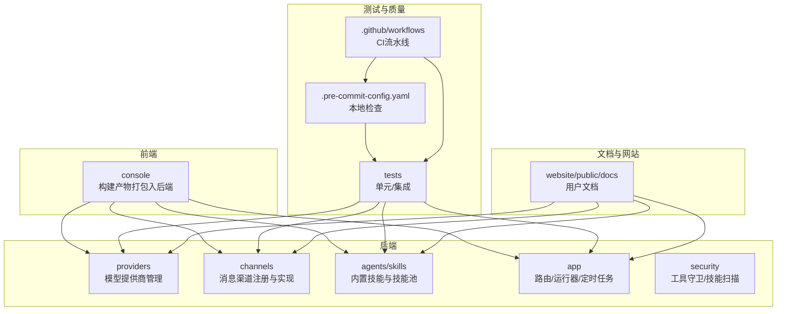
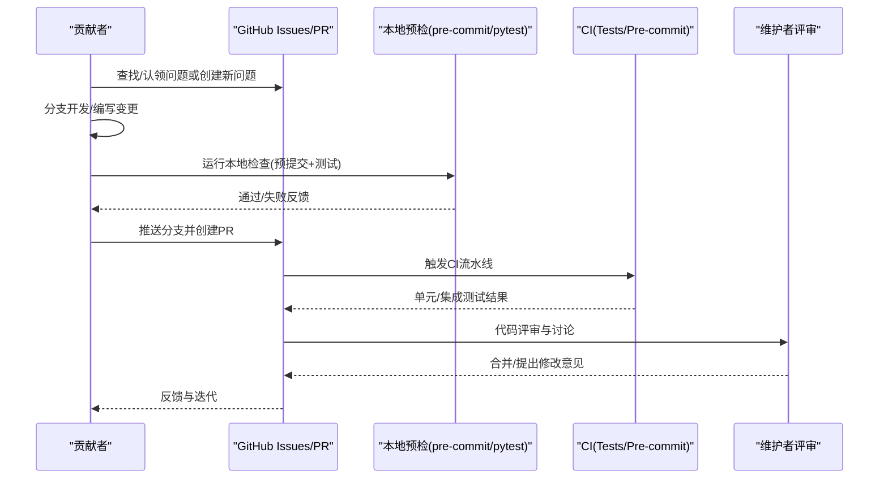
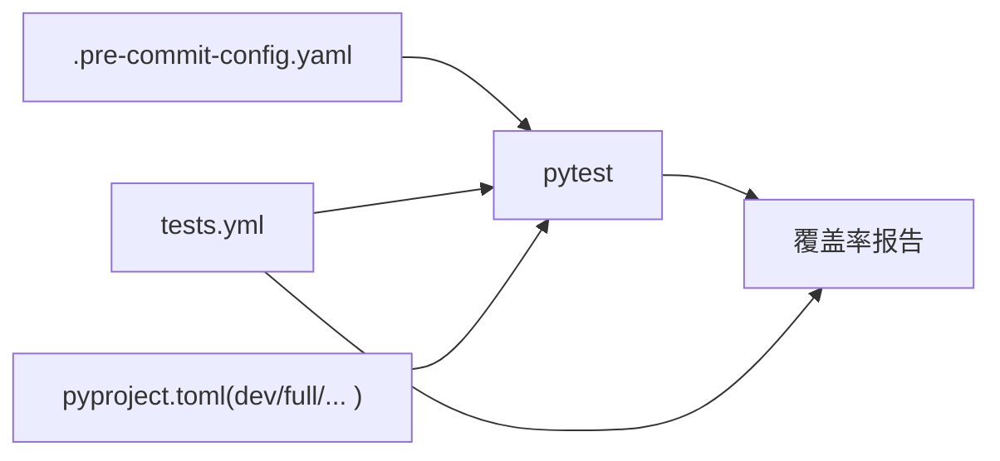

# 代码贡献

<cite>
**本文引用的文件**
- [CONTRIBUTING.md](file://CONTRIBUTING.md)
- [README.md](file://README.md)
- [.pre-commit-config.yaml](file://.pre-commit-config.yaml)
- [pyproject.toml](file://pyproject.toml)
- [.github/PULL_REQUEST_TEMPLATE.md](file://.github/PULL_REQUEST_TEMPLATE.md)
- [.github/workflows/pre-commit.yml](file://.github/workflows/pre-commit.yml)
- [.github/workflows/tests.yml](file://.github/workflows/tests.yml)
- [scripts/run_tests.py](file://scripts/run_tests.py)
- [src/qwenpaw/providers/provider_manager.py](file://src/qwenpaw/providers/provider_manager.py)
- [src/qwenpaw/app/channels/registry.py](file://src/qwenpaw/app/channels/registry.py)
- [src/qwenpaw/agents/skills_hub.py](file://src/qwenpaw/agents/skills_hub.py)
</cite>

## 目录
1. [简介](#简介)
2. [项目结构](#项目结构)
3. [核心组件](#核心组件)
4. [架构总览](#架构总览)
5. [详细组件分析](#详细组件分析)
6. [依赖分析](#依赖分析)
7. [性能考虑](#性能考虑)
8. [故障排查指南](#故障排查指南)
9. [结论](#结论)
10. [附录](#附录)

## 简介
本指南面向希望为 QwenPaw 贡献代码与功能的开发者，覆盖从问题发现到拉取请求（PR）合并的全流程，包括：
- 如何查找/认领现有问题、创建新问题
- 提交信息与 PR 标题格式规范（Conventional Commits）
- 本地质量门禁（pre-commit、pytest、格式化）
- 不同类型贡献（新增模型提供商、新增渠道、基础技能）的流程与要点
- 代码评审标准与合并要求
- 社区参与与沟通渠道

## 项目结构
QwenPaw 是一个前后端一体化的个人智能体平台，支持多渠道接入、可扩展的“技能”系统、本地与云端模型、以及安全沙箱等能力。贡献者主要围绕以下模块开展工作：
- 后端核心：providers（模型提供商）、channels（消息渠道）、agents/skills（技能）、app（应用路由与运行器）、security（安全扫描与守卫）
- 前端控制台：console（React/Vite 构建产物打包进后端包）
- 测试与质量：tests（单元/集成）、pre-commit 钩子、GitHub Actions 工作流
- 文档与网站：website/public/docs（用户文档）

章节来源
- [README.md: 安装与贡献入口:458-466](file://README.md#L458-L466)

## 核心组件
- 模型提供商管理：统一注册与管理内置/自定义提供商，提供连接性检查、模型列表获取、配置更新等能力。
- 渠道注册中心：内置渠道清单与加载机制，支持从工作目录加载自定义渠道类并注册路由。
- 技能中心：支持从社区 Hub 导入技能，解析 SKILL.md、references/scripts 树，冲突检测与安装。
- 质量门禁：pre-commit 钩子（语法/样式/静态检查），pytest 测试套件（单元/集成），CI 自动化。

章节来源
- [src/qwenpaw/providers/provider_manager.py: 内置提供商与注册:710-732](file://src/qwenpaw/providers/provider_manager.py#L710-L732)
- [src/qwenpaw/app/channels/registry.py: 渠道注册与自定义渠道发现:20-36](file://src/qwenpaw/app/channels/registry.py#L20-L36)
- [src/qwenpaw/agents/skills_hub.py: 技能导入与校验:642-702](file://src/qwenpaw/agents/skills_hub.py#L642-L702)

## 架构总览
下图展示贡献流程的关键节点：从问题识别、本地开发、质量门禁，到 CI 校验与评审合并。

图表来源
- [CONTRIBUTING.md: 贡献流程与质量门禁:15-86](file://CONTRIBUTING.md#L15-L86)
- [.github/workflows/pre-commit.yml: 预提交检查:1-41](file://.github/workflows/pre-commit.yml#L1-L41)
- [.github/workflows/tests.yml: 测试与覆盖率:1-259](file://.github/workflows/tests.yml#L1-L259)

章节来源
- [CONTRIBUTING.md: 贡献流程与质量门禁:15-86](file://CONTRIBUTING.md#L15-L86)
- [.github/workflows/pre-commit.yml: 预提交检查:1-41](file://.github/workflows/pre-commit.yml#L1-L41)
- [.github/workflows/tests.yml: 测试与覆盖率:1-259](file://.github/workflows/tests.yml#L1-L259)

## 详细组件分析

### 一、问题发现与创建
- 在开始任何改动前，请先在 Issues 中搜索是否已有相关计划或问题；如无则创建新问题，描述背景、动机与预期行为，便于维护者评估与对齐方向。
- 若问题已存在且未分配，请在评论中声明以便避免重复劳动。

章节来源
- [CONTRIBUTING.md: 检查现有计划与问题:15-21](file://CONTRIBUTING.md#L15-L21)

### 二、提交信息与 PR 标题规范（Conventional Commits）
- 提交信息与 PR 标题遵循 Conventional Commits 规范，格式为：<type>(<scope>): <subject>。
- 类型建议：
  - feat：新特性
  - fix：缺陷修复
  - docs：仅文档
  - style：代码风格（空白、格式等）
  - refactor：重构（非修复bug且非新增特性）
  - perf：性能改进
  - test：新增或更新测试
  - chore/build/refactor/style/perf/test/chore：其他维护类
- 示例参考贡献指南中的示例。

章节来源
- [CONTRIBUTING.md: 提交信息格式:23-59](file://CONTRIBUTING.md#L23-L59)

### 三、PR 描述与模板
- 使用仓库提供的 PR 模板，按模板字段填写：
  - 描述变更目的与影响范围
  - 关联 Issue 或相关任务
  - 安全注意事项（如渠道鉴权、环境变量处理）
  - 影响组件勾选
  - 本地验证证据（预提交与测试输出摘要）
- 保持描述简洁清晰，必要时补充截图或日志片段。

章节来源
- [.github/PULL_REQUEST_TEMPLATE.md: PR 模板字段:1-54](file://.github/PULL_REQUEST_TEMPLATE.md#L1-L54)

### 四、本地质量门禁（必须通过）
- 安装开发依赖与可选特性集，确保本地环境满足测试与格式化需求。
- 运行预提交钩子，修正自动修复项后再次运行直至全部通过。
- 执行 pytest 全量测试，确保单元/集成用例通过。
- 如涉及前端变更（console/website），请在对应目录执行格式化命令后再提交。
- 文档更新：若用户可见的行为发生变更，需同步更新网站文档。

章节来源
- [CONTRIBUTING.md: 本地质量门禁:70-86](file://CONTRIBUTING.md#L70-L86)
- [.pre-commit-config.yaml: 预提交钩子配置:1-121](file://.pre-commit-config.yaml#L1-L121)
- [pyproject.toml: 开发与可选依赖:75-103](file://pyproject.toml#L75-L103)

### 五、不同类型的贡献流程

#### 新增模型/模型提供商
- 要求：
  - 与 OpenAI chat.completions 或 Anthropic messages API 兼容；否则需先开 issue 讨论。
  - 建议支持 /model/list 端点以自动获取模型列表。
- 实施步骤：
  - 在提供商管理器中注册新的 Provider 实例，并在内置提供商列表中添加默认模型清单（如适用）。
  - 提供至少一个可用模型用于连接测试，并在 PR 中附上连接测试与聊天会话截图。
  - 更新模型文档（website/public/docs/models.*.md），必要时新增小节说明配置差异。
  - 可为内置模型预设能力标签，降低用户验证成本。
- 参考路径：
  - 提供商注册与内置列表：[src/qwenpaw/providers/provider_manager.py:463-663](file://src/qwenpaw/providers/provider_manager.py#L463-L663)

章节来源
- [CONTRIBUTING.md: 新增模型/提供商:95-111](file://CONTRIBUTING.md#L95-L111)
- [src/qwenpaw/providers/provider_manager.py: 内置提供商定义:463-663](file://src/qwenpaw/providers/provider_manager.py#L463-L663)

#### 新增渠道
- 协议与实现：
  - 统一通道契约：原生负载 → content_parts（文本/图片/文件等）→ AgentRequest → 通道发送响应。
  - 实现方式：继承 BaseChannel，设置唯一 channel 键，实现生命周期与消息处理；长连接通道可复用队列与消费者循环。
  - 发现机制：内置通道在注册表中登记；自定义通道从工作目录加载，模块内定义的 BaseChannel 子类将被自动发现。
- CLI 支持：channels 子命令用于安装/添加/移除/配置自定义通道。
- 文档：新增内置通道时，需在网站文档中补充认证、Webhook 等说明。
- 参考路径：
  - 注册表与自定义通道发现：[src/qwenpaw/app/channels/registry.py:20-36](file://src/qwenpaw/app/channels/registry.py#L20-L36)
  - 自定义通道加载与路由注册：[src/qwenpaw/app/channels/registry.py:97-194](file://src/qwenpaw/app/channels/registry.py#L97-L194)

章节来源
- [CONTRIBUTING.md: 新增渠道:114-131](file://CONTRIBUTING.md#L114-L131)
- [src/qwenpaw/app/channels/registry.py: 注册表与自定义通道:20-36](file://src/qwenpaw/app/channels/registry.py#L20-L36)

#### 新增基础技能
- 结构与位置：
  - 每个技能为目录，包含 SKILL.md（至少含 name/description，可选 metadata）、references/（可选）、scripts/（可选）。
  - 内置技能位于 src/qwenpaw/agents/skills/<skill_name>/，工作目录下的 customized_skills 与内置技能合并为 active_skills。
- 内容要求：
  - 明确触发时机与使用场景；在 SKILL.md front matter 的 description 中给出明确触发关键词与边界。
  - 优先贡献对大多数用户有广泛价值的技能，避免过于小众或个人化的流程。
- 技能 Hub：
  - 支持从社区 Hub 导入，遵循 SKILL.md + references/scripts 布局与 Hub 打包格式。
- 参考路径：
  - 技能 Hub 导入与解析：[src/qwenpaw/agents/skills_hub.py:642-702](file://src/qwenpaw/agents/skills_hub.py#L642-L702)

章节来源
- [CONTRIBUTING.md: 新增基础技能:134-184](file://CONTRIBUTING.md#L134-L184)
- [src/qwenpaw/agents/skills_hub.py: Hub 导入与解析:642-702](file://src/qwenpaw/agents/skills_hub.py#L642-L702)

### 六、代码评审标准与合并要求
- 评审关注点：
  - 是否符合 Conventional Commits 与 PR 模板要求
  - 是否通过本地与 CI 预提交/测试
  - 是否更新了相关文档（尤其是用户可见行为变更）
  - 是否引入了破坏性变更或重型依赖（需事先讨论）
- 合并条件：
  - 预提交与测试均通过
  - 至少一位维护者批准
  - 无阻塞性评论；所有修改意见已解决

章节来源
- [CONTRIBUTING.md: Do's and Don'ts:208-226](file://CONTRIBUTING.md#L208-L226)
- [.github/PULL_REQUEST_TEMPLATE.md: Checklist:29-35](file://.github/PULL_REQUEST_TEMPLATE.md#L29-L35)

### 七、社区参与与沟通
- 讨论与协作：
  - GitHub Discussions：用于想法讨论与任务认领
  - GitHub Issues：缺陷与功能请求
  - 社区频道：DingTalk、Discord 等
- 路线图与贡献方向：
  - 参考路线图中标注“Seeking Contributors”的条目，优先选择这些方向进行贡献

章节来源
- [CONTRIBUTING.md: 获取帮助:229-233](file://CONTRIBUTING.md#L229-L233)
- [README.md: 贡献与路线图:458-466](file://README.md#L458-L466)

## 依赖分析
- 本地检查链路：
  - 预提交钩子：AST/Docstring/YAML/JSON/XML/TOML、mypy、flake8、pylint、black、prettier 等
  - 测试：pytest（单元/集成），支持并行与覆盖率
- CI 链路：
  - 预提交检查工作流
  - 多平台多版本 Python 的单元/集成测试与覆盖率报告
- 依赖与可选特性：
  - 开发依赖与可选特性（local/ollama,llamacpp,whisper,full 等）在 pyproject.toml 中定义

图表来源
- [.pre-commit-config.yaml: 预提交钩子:1-121](file://.pre-commit-config.yaml#L1-L121)
- [.github/workflows/tests.yml: 测试与覆盖率:1-259](file://.github/workflows/tests.yml#L1-L259)
- [pyproject.toml: 开发与可选依赖:75-103](file://pyproject.toml#L75-L103)

章节来源
- [.pre-commit-config.yaml: 预提交钩子:1-121](file://.pre-commit-config.yaml#L1-L121)
- [.github/workflows/tests.yml: 测试与覆盖率:1-259](file://.github/workflows/tests.yml#L1-L259)
- [pyproject.toml: 开发与可选依赖:75-103](file://pyproject.toml#L75-L103)

## 性能考虑
- 本地开发阶段：
  - 使用 scripts/run_tests.py 的并行模式加速测试（需要 pytest-xdist）
  - 仅针对特定子目录运行单元测试以缩短反馈周期
- CI 阶段：
  - 多平台矩阵与多 Python 版本并行测试，确保兼容性
  - 覆盖率报告用于识别未覆盖路径，指导补充测试

章节来源
- [scripts/run_tests.py: 并行与覆盖率选项:1-282](file://scripts/run_tests.py#L1-L282)
- [.github/workflows/tests.yml: 并行矩阵与覆盖率:38-47](file://.github/workflows/tests.yml#L38-L47)

## 故障排查指南
- 预提交失败：
  - 本地运行 pre-commit run --all-files，根据提示修复；若自动修复，提交后再次运行直至通过
  - 关注 AST/Docstring/YAML/JSON/XML/TOML、mypy、flake8、pylint、black、prettier 等规则
- 测试失败：
  - 使用 scripts/run_tests.py 指定子目录或并行模式定位问题
  - 查看覆盖率报告定位缺失用例
- CI 失败：
  - 预提交检查失败：修复本地问题后重新推送
  - 测试失败：确认本地测试通过；检查矩阵中不同平台/版本的差异
- 文档与前端：
  - 涉及 console/website 的变更，先在对应目录执行格式化再提交

章节来源
- [CONTRIBUTING.md: 本地质量门禁与前端格式化:70-86](file://CONTRIBUTING.md#L70-L86)
- [.github/workflows/pre-commit.yml: 预提交检查:1-41](file://.github/workflows/pre-commit.yml#L1-L41)
- [.github/workflows/tests.yml: 测试与覆盖率:1-259](file://.github/workflows/tests.yml#L1-L259)
- [scripts/run_tests.py: 测试运行器:1-282](file://scripts/run_tests.py#L1-L282)

## 结论
遵循本指南可显著提升贡献效率与代码质量。请始终以 Conventional Commits 与 PR 模板为准绳，确保本地与 CI 的质量门禁全部通过，并及时更新相关文档。欢迎在 Discussions 中交流想法，在 Issues 中认领任务，共同推动 QwenPaw 的演进。

## 附录

### A. 提交信息与 PR 标题格式速查
- 提交信息与 PR 标题格式：<type>(<scope>): <subject>
- 常用类型：feat, fix, docs, style, refactor, perf, test, chore, build, revert
- scope 必须为小写（字母、数字、连字符、下划线）

章节来源
- [CONTRIBUTING.md: 提交信息与 PR 标题格式:23-67](file://CONTRIBUTING.md#L23-L67)

### B. 本地质量门禁清单
- 安装开发依赖与可选特性集
- 运行 pre-commit run --all-files（直至全部通过）
- 运行 pytest（单元/集成）
- 前端变更：在 console/website 目录执行格式化
- 更新网站文档（如有用户可见行为变更）

章节来源
- [CONTRIBUTING.md: 本地质量门禁:70-86](file://CONTRIBUTING.md#L70-L86)

### C. 新增模型提供商关键步骤
- 确保与 OpenAI/Anthropic API 兼容
- 在 provider_manager.py 中注册 Provider 实例与默认模型清单
- 提供连接测试与截图
- 更新模型文档
- 可选：预设能力标签

章节来源
- [CONTRIBUTING.md: 新增模型/提供商:95-111](file://CONTRIBUTING.md#L95-L111)
- [src/qwenpaw/providers/provider_manager.py: 内置提供商定义:463-663](file://src/qwenpaw/providers/provider_manager.py#L463-L663)

### D. 新增渠道关键步骤
- 继承 BaseChannel，设置唯一 channel 键
- 实现生命周期与消息处理
- 内置通道在注册表登记；自定义通道从工作目录加载
- 补充网站文档（认证、Webhook 等）

章节来源
- [CONTRIBUTING.md: 新增渠道:114-131](file://CONTRIBUTING.md#L114-L131)
- [src/qwenpaw/app/channels/registry.py: 注册表与自定义通道:20-36](file://src/qwenpaw/app/channels/registry.py#L20-L36)

### E. 新增基础技能关键步骤
- 目录结构：SKILL.md + references/ + scripts/
- 内置技能位于 src/qwenpaw/agents/skills/<skill_name>/
- 在 SKILL.md front matter 中明确触发关键词与边界
- 可从 Skills Hub 导入，遵循 Hub 打包格式

章节来源
- [CONTRIBUTING.md: 新增基础技能:134-184](file://CONTRIBUTING.md#L134-L184)
- [src/qwenpaw/agents/skills_hub.py: Hub 导入与解析:642-702](file://src/qwenpaw/agents/skills_hub.py#L642-L702)