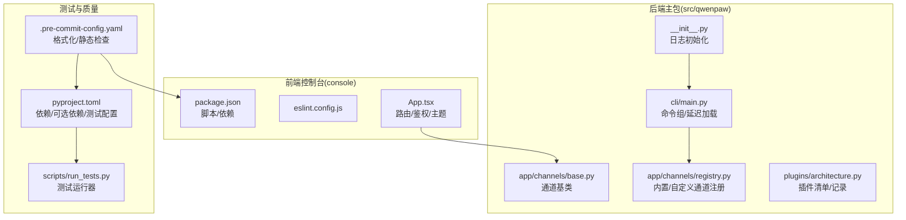
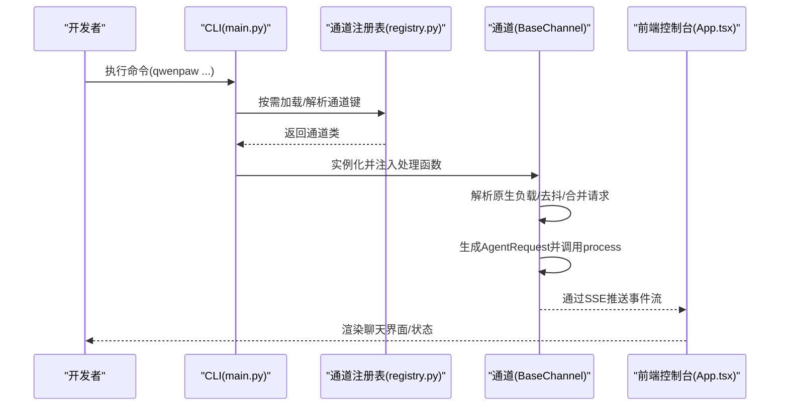
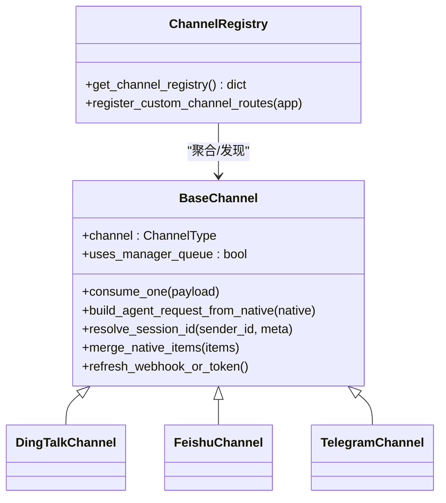
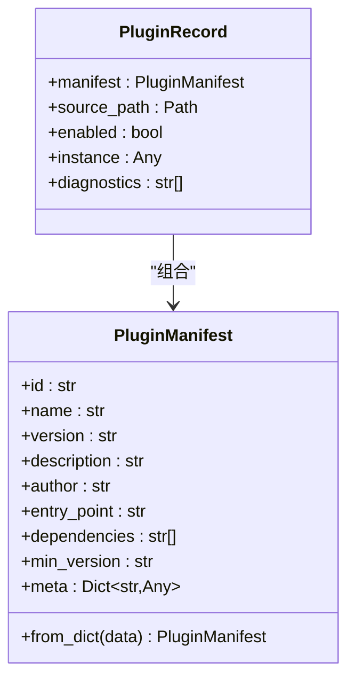
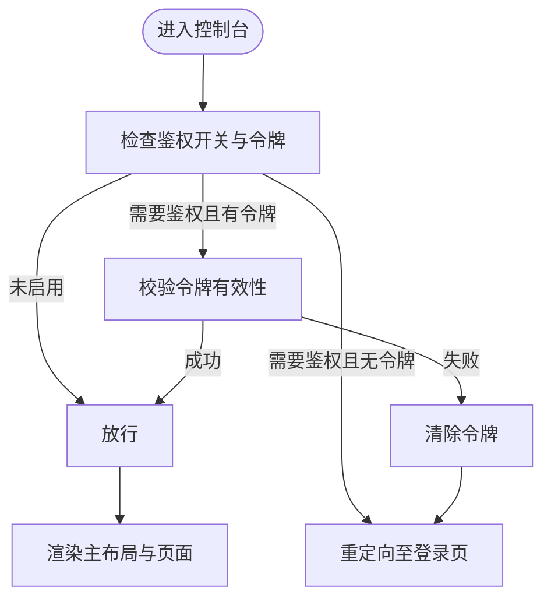
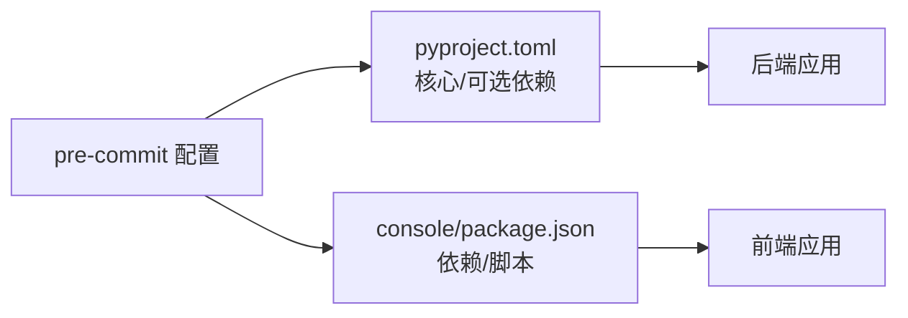

# 开发指南

<cite>
**本文引用的文件**   
- [CONTRIBUTING.md](file://CONTRIBUTING.md)
- [README.md](file://README.md)
- [pyproject.toml](file://pyproject.toml)
- [.pre-commit-config.yaml](file://.pre-commit-config.yaml)
- [console/package.json](file://console/package.json)
- [console/eslint.config.js](file://console/eslint.config.js)
- [scripts/run_tests.py](file://scripts/run_tests.py)
- [src/qwenpaw/__init__.py](file://src/qwenpaw/__init__.py)
- [src/qwenpaw/cli/main.py](file://src/qwenpaw/cli/main.py)
- [src/qwenpaw/app/channels/base.py](file://src/qwenpaw/app/channels/base.py)
- [src/qwenpaw/app/channels/registry.py](file://src/qwenpaw/app/channels/registry.py)
- [src/qwenpaw/plugins/architecture.py](file://src/qwenpaw/plugins/architecture.py)
- [console/src/App.tsx](file://console/src/App.tsx)
</cite>

## 目录
1. [简介](#简介)
2. [项目结构](#项目结构)
3. [核心组件](#核心组件)
4. [架构总览](#架构总览)
5. [详细组件分析](#详细组件分析)
6. [依赖分析](#依赖分析)
7. [性能考虑](#性能考虑)
8. [故障排除指南](#故障排除指南)
9. [结论](#结论)
10. [附录](#附录)

## 简介
本开发指南面向希望为 QwenPaw 贡献代码与扩展功能的开发者，覆盖从开发环境搭建、编码规范、测试策略、质量门禁、到插件与技能扩展、渠道适配、自定义 UI 组件开发、调试与性能分析、以及社区协作与发布流程的全流程说明。QwenPaw 是一个在用户自有环境中运行的个人智能助理，支持多渠道接入、可扩展的技能系统、本地与云端模型、以及多层安全机制。

## 项目结构
仓库采用“前后端分离 + 多模块后端”的组织方式：
- 前端控制台（React + Vite）位于 console/，构建产物打包进 Python 包用于 Web UI。
- 后端主包位于 src/qwenpaw/，包含 CLI、应用服务、通道（channels）、技能（skills）、插件（plugins）、工作区（workspace）、安全（security）、本地模型（local_models）等子系统。
- 测试位于 tests/，分为单元测试与集成测试。
- 构建与打包脚本位于 scripts/，包含前端构建、Docker 打包、安装脚本等。
- 文档与网站位于 website/，包含文档站点与发布资源。

**图表来源**
- [console/src/App.tsx:1-196](file://console/src/App.tsx#L1-L196)
- [src/qwenpaw/cli/main.py:1-171](file://src/qwenpaw/cli/main.py#L1-L171)
- [src/qwenpaw/app/channels/base.py:1-800](file://src/qwenpaw/app/channels/base.py#L1-L800)
- [src/qwenpaw/app/channels/registry.py:1-195](file://src/qwenpaw/app/channels/registry.py#L1-L195)
- [src/qwenpaw/plugins/architecture.py:1-55](file://src/qwenpaw/plugins/architecture.py#L1-L55)
- [pyproject.toml:1-111](file://pyproject.toml#L1-L111)
- [.pre-commit-config.yaml:1-121](file://.pre-commit-config.yaml#L1-L121)
- [scripts/run_tests.py:1-282](file://scripts/run_tests.py#L1-L282)

**章节来源**
- [README.md: 安装与开发入口:433-456](file://README.md#L433-L456)
- [pyproject.toml: 依赖与可选依赖:1-111](file://pyproject.toml#L1-L111)
- [console/package.json: 前端脚本与依赖:1-62](file://console/package.json#L1-L62)

## 核心组件
- 日志与初始化：后端包初始化时设置日志级别，并尝试加载持久化环境变量，失败时仅告警不阻断启动。
- CLI 命令体系：基于 Click 的延迟加载分组，按需导入子命令模块，减少启动开销。
- 通道系统：统一的 BaseChannel 抽象，定义消息解析、会话合并、去抖处理、渲染风格、错误处理与发送回调等通用能力；通过注册表聚合内置与自定义通道。
- 插件架构：以清单（PluginManifest）与记录（PluginRecord）描述插件元数据、来源路径、启用状态与诊断信息。
- 前端控制台：基于 React + Ant Design 的单页应用，支持国际化、主题切换、鉴权守卫与路由。

**章节来源**
- [src/qwenpaw/__init__.py: 包初始化与日志:1-33](file://src/qwenpaw/__init__.py#L1-L33)
- [src/qwenpaw/cli/main.py: CLI 分组与延迟加载:58-171](file://src/qwenpaw/cli/main.py#L58-L171)
- [src/qwenpaw/app/channels/base.py: 通道抽象与处理流程:70-800](file://src/qwenpaw/app/channels/base.py#L70-L800)
- [src/qwenpaw/app/channels/registry.py: 通道注册与发现:1-195](file://src/qwenpaw/app/channels/registry.py#L1-L195)
- [src/qwenpaw/plugins/architecture.py: 插件清单与记录:1-55](file://src/qwenpaw/plugins/architecture.py#L1-L55)
- [console/src/App.tsx: 鉴权/路由/主题:1-196](file://console/src/App.tsx#L1-L196)

## 架构总览
下图展示从 CLI 到通道、再到处理流程与前端控制台的整体交互：

**图表来源**
- [src/qwenpaw/cli/main.py:95-171](file://src/qwenpaw/cli/main.py#L95-L171)
- [src/qwenpaw/app/channels/registry.py:190-195](file://src/qwenpaw/app/channels/registry.py#L190-L195)
- [src/qwenpaw/app/channels/base.py:446-536](file://src/qwenpaw/app/channels/base.py#L446-L536)
- [console/src/App.tsx:151-184](file://console/src/App.tsx#L151-L184)

## 详细组件分析

### 通道系统（Channel）
- 设计要点
  - 统一契约：所有通道继承 BaseChannel，遵循“原生负载 → content_parts → AgentRequest → process → 发送响应”的流程。
  - 会话管理：通过 resolve_session_id 将发送者与渠道元信息映射为会话标识，支持去抖合并与时间窗口合并。
  - 渲染与过滤：通过 RenderStyle 控制工具详情显示、思维内容过滤、内部工具可见性等。
  - 错误与取消：统一的事件流封装，支持任务跟踪与取消、错误上报与清理。
- 自定义通道
  - 在工作目录的自定义通道目录中实现 BaseChannel 子类，设置唯一 channel 键，注册后即可被注册表发现。
  - 可选地在模块级提供 register_app_routes(app) 以挂载 /api/ 前缀的路由。

**图表来源**
- [src/qwenpaw/app/channels/base.py:70-127](file://src/qwenpaw/app/channels/base.py#L70-L127)
- [src/qwenpaw/app/channels/registry.py:20-78](file://src/qwenpaw/app/channels/registry.py#L20-L78)

**章节来源**
- [src/qwenpaw/app/channels/base.py: 通道抽象与处理流程:70-800](file://src/qwenpaw/app/channels/base.py#L70-L800)
- [src/qwenpaw/app/channels/registry.py: 注册与发现:97-195](file://src/qwenpaw/app/channels/registry.py#L97-L195)

### 插件架构（Plugin）
- 清单与记录
  - PluginManifest：描述插件元数据（id/name/version/description/author/entry_point/dependencies/min_version/meta）。
  - PluginRecord：记录已加载插件的清单、来源路径、启用状态、实例与诊断信息。
- 使用建议
  - 通过清单声明入口点与依赖，确保最小版本兼容。
  - 记录诊断信息以便排查加载与运行问题。

**图表来源**
- [src/qwenpaw/plugins/architecture.py:9-55](file://src/qwenpaw/plugins/architecture.py#L9-L55)

**章节来源**
- [src/qwenpaw/plugins/architecture.py: 插件清单与记录:1-55](file://src/qwenpaw/plugins/architecture.py#L1-L55)

### 前端控制台（Console）
- 功能特性
  - 国际化与主题：支持多语言切换、Ant Design 主题算法切换、全局样式重置。
  - 鉴权守卫：根据后端认证状态与令牌决定是否放行或跳转登录。
  - 路由与布局：BrowserRouter + Routes + MainLayout，区分 /console 基路径。
- 开发建议
  - 遵循 ESLint 规则与 Prettier 格式化；变更涉及前端时先执行格式化脚本。

**图表来源**
- [console/src/App.tsx:49-104](file://console/src/App.tsx#L49-L104)

**章节来源**
- [console/src/App.tsx: 鉴权与路由:1-196](file://console/src/App.tsx#L1-L196)
- [console/package.json: 前端脚本:6-16](file://console/package.json#L6-L16)
- [console/eslint.config.js: ESLint 配置:1-29](file://console/eslint.config.js#L1-L29)

## 依赖分析
- Python 依赖与可选生态
  - 核心依赖：HTTP 客户端、调度器、浏览器自动化、IM SDK、加密与密钥存储、YAML/JSON 工具等。
  - 可选依赖：本地模型（llama.cpp/mlx）、Ollama、Whisper、完整生态（full）等。
- 前端依赖
  - React 生态、Ant Design、i18n、Markdown 渲染、拖拽库、状态管理等。
- 质量门禁
  - pre-commit 集成 AST 校验、YAML/JSON/XML/Docstring/编码检查、mypy、black、flake8、pylint、prettier 等。

**图表来源**
- [pyproject.toml:1-111](file://pyproject.toml#L1-L111)
- [console/package.json:1-62](file://console/package.json#L1-L62)
- [.pre-commit-config.yaml:1-121](file://.pre-commit-config.yaml#L1-L121)

**章节来源**
- [pyproject.toml: 依赖与可选依赖:75-111](file://pyproject.toml#L75-L111)
- [.pre-commit-config.yaml: 质量门禁:1-121](file://.pre-commit-config.yaml#L1-L121)
- [console/package.json: 依赖与脚本:18-59](file://console/package.json#L18-L59)

## 性能考虑
- 启动与导入优化
  - CLI 使用延迟加载分组，避免一次性导入全部子命令模块，降低启动时间。
  - 通道基类对去抖与合并进行异步处理，减少重复请求与渲染压力。
- 并行测试
  - 测试运行器支持并行执行（需 pytest-xdist），提升回归效率。
- 建议
  - 对长耗时操作使用异步与队列；对频繁渲染的数据进行节流/去抖；对大文件/媒体处理使用流式接口。

**章节来源**
- [src/qwenpaw/cli/main.py: 延迟加载与计时:58-93](file://src/qwenpaw/cli/main.py#L58-L93)
- [src/qwenpaw/app/channels/base.py: 去抖与合并:669-758](file://src/qwenpaw/app/channels/base.py#L669-L758)
- [scripts/run_tests.py: 并行测试:165-167](file://scripts/run_tests.py#L165-L167)

## 故障排除指南
- 常见问题定位
  - 日志级别：通过环境变量设置日志级别，必要时在应用启动后重新输出初始化计时与调试信息。
  - 通道加载失败：检查自定义通道模块是否符合 BaseChannel 子类规范，确认 channel 键唯一且注册表可发现。
  - 前端构建缺失：确认已先构建前端再安装 Python 包，或将构建产物复制到包内指定目录。
- 修复步骤
  - 重新运行预提交钩子，修正格式化与静态检查问题。
  - 使用测试运行器执行特定子目录或集成测试，定位问题范围。
  - 清理缓存与重建：删除缓存、重新安装依赖、清理浏览器缓存。

**章节来源**
- [src/qwenpaw/__init__.py: 日志初始化:22-32](file://src/qwenpaw/__init__.py#L22-L32)
- [src/qwenpaw/app/channels/registry.py: 加载失败与缓存:63-78](file://src/qwenpaw/app/channels/registry.py#L63-L78)
- [README.md: 安装与更新注意事项:454-456](file://README.md#L454-L456)
- [.pre-commit-config.yaml: 钩子规则:1-121](file://.pre-commit-config.yaml#L1-L121)
- [scripts/run_tests.py: 测试运行:148-173](file://scripts/run_tests.py#L148-L173)

## 结论
本指南提供了从开发环境、编码规范、测试与质量门禁，到通道与插件扩展、前端控制台开发、调试与性能优化、故障排除与社区协作的完整路径。建议在提交前完成本地质量门禁与测试，并参考贡献指南中的类型与格式规范，确保变更可维护与可合并。

## 附录

### 开发规范与提交流程
- 提交信息与 PR 标题
  - 遵循约定式提交规范，类型包括 feat/fix/docs/test/refactor/perf/chore/style/build/revert。
- 本地质量门禁
  - 安装开发依赖与预提交钩子，运行全量检查与测试，确保通过后再提交。
- 前端格式化
  - 变更涉及 console 或 website 时，先执行格式化脚本。

**章节来源**
- [CONTRIBUTING.md: 提交与质量门禁:23-86](file://CONTRIBUTING.md#L23-L86)
- [CONTRIBUTING.md: PR 标题格式:51-67](file://CONTRIBUTING.md#L51-L67)

### 测试策略与质量保证
- 测试类型
  - 单元测试：按子模块划分，覆盖关键逻辑与边界条件。
  - 集成测试：验证端到端流程与外部依赖交互。
- 运行方式
  - 使用测试运行器选择性运行单元/集成测试，支持覆盖率与并行执行。

**章节来源**
- [scripts/run_tests.py: 测试运行器:1-282](file://scripts/run_tests.py#L1-L282)
- [pyproject.toml: 测试标记与默认模式:105-111](file://pyproject.toml#L105-L111)

### 插件开发与自定义 UI 组件
- 插件开发
  - 使用插件清单描述元数据与依赖，记录运行诊断信息，确保最小版本兼容。
- 自定义 UI 组件
  - 基于现有组件与设计系统，保持一致的主题与国际化；遵循 ESLint 与 Prettier 规范。

**章节来源**
- [src/qwenpaw/plugins/architecture.py: 插件清单与记录:1-55](file://src/qwenpaw/plugins/architecture.py#L1-L55)
- [console/eslint.config.js: ESLint 规则:1-29](file://console/eslint.config.js#L1-L29)

### 渠道适配与自定义通道
- 适配步骤
  - 继承 BaseChannel，实现原生负载解析、会话标识解析、请求构建与发送路径。
  - 在注册表中注册内置通道，或在工作目录自定义通道目录中提供可用类。
- 注意事项
  - 严格遵守 /api/ 前缀挂载自定义路由，避免被 SPA 捕获。

**章节来源**
- [src/qwenpaw/app/channels/base.py: 通道抽象:538-638](file://src/qwenpaw/app/channels/base.py#L538-L638)
- [src/qwenpaw/app/channels/registry.py: 注册与路由钩子:135-195](file://src/qwenpaw/app/channels/registry.py#L135-L195)

### 开发环境搭建与调试
- 环境准备
  - 先构建前端控制台，再安装 Python 包；如需本地模型或额外功能，选择相应可选依赖。
- 调试工具
  - CLI 支持延迟加载与初始化计时输出；通道基类提供事件流与错误处理；前端控制台具备鉴权与路由调试。
- 性能分析
  - 使用异步与队列减少阻塞；利用测试并行与覆盖率报告定位热点。

**章节来源**
- [README.md: 从源码安装:433-456](file://README.md#L433-L456)
- [src/qwenpaw/cli/main.py: 初始化计时:52-56](file://src/qwenpaw/cli/main.py#L52-L56)
- [src/qwenpaw/app/channels/base.py: 事件流与错误处理:446-536](file://src/qwenpaw/app/channels/base.py#L446-L536)
- [scripts/run_tests.py: 并行与覆盖率:165-167](file://scripts/run_tests.py#L165-L167)

### 社区参与与沟通
- 贡献入口
  - 通过 GitHub Issues/Projects/路线图了解方向；在 Discussions 中讨论想法与任务。
- 行为准则
  - 尊重与包容，遵循欢迎的贡献文化。

**章节来源**
- [CONTRIBUTING.md: 贡献入口与帮助:229-236](file://CONTRIBUTING.md#L229-L236)