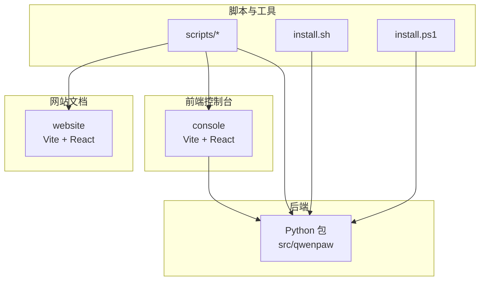
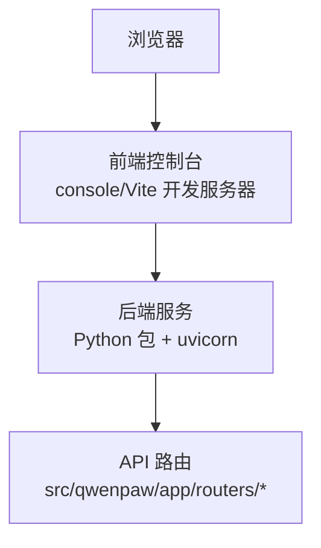
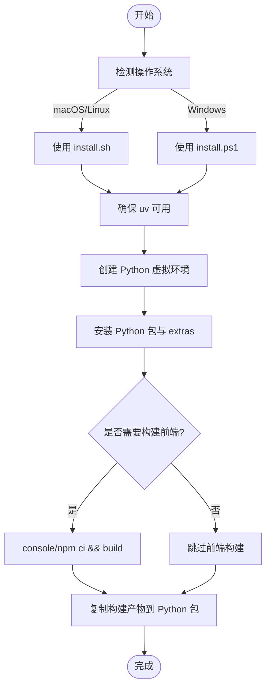
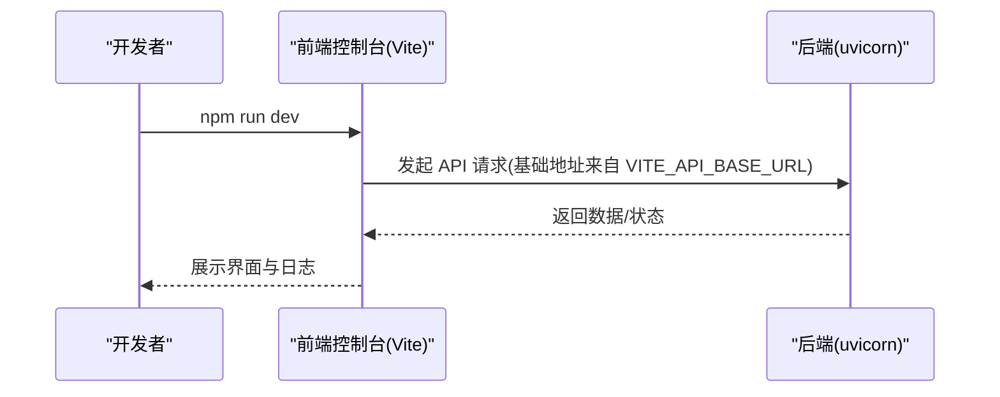
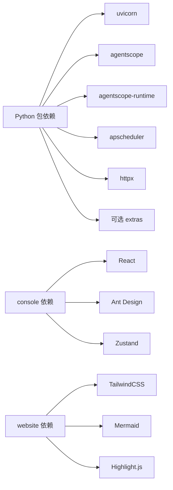

# 开发环境搭建

<cite>
**本文引用的文件**
- [README.md](file://README.md)
- [pyproject.toml](file://pyproject.toml)
- [console/package.json](file://console/package.json)
- [website/package.json](file://website/package.json)
- [scripts/install.sh](file://scripts/install.sh)
- [scripts/install.ps1](file://scripts/install.ps1)
- [console/vite.config.ts](file://console/vite.config.ts)
- [website/vite.config.ts](file://website/vite.config.ts)
- [console/tsconfig.json](file://console/tsconfig.json)
- [website/tsconfig.json](file://website/tsconfig.json)
- [scripts/README.md](file://scripts/README.md)
- [CONTRIBUTING.md](file://CONTRIBUTING.md)
- [console/eslint.config.js](file://console/eslint.config.js)
- [.pre-commit-config.yaml](file://.pre-commit-config.yaml)
- [setup.py](file://setup.py)
</cite>

## 目录
1. [简介](#简介)
2. [项目结构](#项目结构)
3. [核心组件](#核心组件)
4. [架构总览](#架构总览)
5. [详细组件分析](#详细组件分析)
6. [依赖关系分析](#依赖关系分析)
7. [性能考虑](#性能考虑)
8. [故障排查指南](#故障排查指南)
9. [结论](#结论)
10. [附录](#附录)

## 简介
本指南面向希望在本地进行 QwenPaw 开发与贡献的工程师，覆盖系统要求、前置条件、依赖安装与环境配置、IDE 与开发工具推荐、开发服务器启动与配置、开发工作流与最佳实践、常见问题与优化建议，以及开发工具链与自动化脚本的使用方法。内容基于仓库中的安装脚本、构建配置与贡献规范整理而成。

## 项目结构
QwenPaw 采用前后端分离的多模块组织方式：
- 后端 Python 包：位于 src/qwenpaw，通过 setuptools 动态打包，提供命令行入口与 Web 服务。
- 前端控制台：位于 console，基于 Vite + React，构建产物复制到 Python 包中供后端分发。
- 网站文档：位于 website，基于 Vite + React 文档站点。
- 脚本与安装器：位于 scripts，提供一键安装、测试运行、打包与 Docker 构建等自动化脚本。
- 配置文件：各子项目包含独立的包管理与构建配置文件。

图表来源
- [console/vite.config.ts:1-109](file://console/vite.config.ts#L1-L109)
- [website/vite.config.ts:1-48](file://website/vite.config.ts#L1-L48)
- [scripts/install.sh:1-340](file://scripts/install.sh#L1-L340)
- [scripts/install.ps1:1-477](file://scripts/install.ps1#L1-L477)
- [scripts/README.md:1-53](file://scripts/README.md#L1-L53)

章节来源
- [README.md:433-455](file://README.md#L433-L455)
- [scripts/README.md:1-53](file://scripts/README.md#L1-L53)

## 核心组件
- Python 版本与依赖
  - Python 版本范围：>=3.10,<3.14
  - 关键依赖：uvicorn、apscheduler、playwright、transformers、httpx、agentscope-runtime 等
  - 可选扩展：local、ollama、llamacpp、mlx、whisper、full 等
- 前端控制台
  - 使用 Vite + React，支持开发服务器、构建与预览
  - 环境变量：VITE_API_BASE_URL 控制后端 API 基础地址
- 网站文档
  - 使用 Vite + React + TailwindCSS，支持搜索索引生成与 SPA 回退页面
- 安装器
  - macOS/Linux：install.sh 自动安装 uv 并创建虚拟环境，支持 extras 选项
  - Windows：install.ps1 支持多种自动安装路径与 PATH 注册
- 测试与质量门禁
  - pytest、pre-commit、eslint、black、flake8、pylint 等

章节来源
- [pyproject.toml:1-111](file://pyproject.toml#L1-L111)
- [console/package.json:1-62](file://console/package.json#L1-L62)
- [website/package.json:1-51](file://website/package.json#L1-L51)
- [scripts/install.sh:1-340](file://scripts/install.sh#L1-L340)
- [scripts/install.ps1:1-477](file://scripts/install.ps1#L1-L477)
- [CONTRIBUTING.md:70-85](file://CONTRIBUTING.md#L70-L85)

## 架构总览
下图展示开发环境下的典型交互：前端控制台通过 Vite 开发服务器提供界面，请求经由代理或直接访问后端 API；后端 Python 包提供 Web 服务与业务逻辑，并内置静态资源（控制台）。

图表来源
- [console/vite.config.ts:34-37](file://console/vite.config.ts#L34-L37)
- [pyproject.toml:15-16](file://pyproject.toml#L15-L16)

章节来源
- [console/vite.config.ts:1-109](file://console/vite.config.ts#L1-L109)
- [pyproject.toml:15-16](file://pyproject.toml#L15-L16)

## 详细组件分析

### 系统要求与前置条件
- 操作系统
  - macOS/Linux：install.sh 仅支持 Linux 与 macOS
  - Windows：install.ps1 提供完整支持，含执行策略与 PATH 注册
- Python
  - 版本范围：>=3.10,<3.14
  - 推荐版本：3.12（安装器默认）
- Node.js
  - 前端控制台与网站文档均使用 Vite，需安装 Node.js 以支持 npm/pnpm
- 其他
  - Docker（可选）：用于容器化部署与开发验证
  - uv（可选）：安装器会自动下载与配置 uv，也可手动安装

章节来源
- [scripts/install.sh:95-100](file://scripts/install.sh#L95-L100)
- [scripts/install.ps1:68-83](file://scripts/install.ps1#L68-L83)
- [pyproject.toml:6-6](file://pyproject.toml#L6-L6)
- [console/package.json:1-62](file://console/package.json#L1-L62)
- [website/package.json:1-51](file://website/package.json#L1-L51)

### 依赖安装与环境配置
- 方式一：一键安装器（推荐）
  - macOS/Linux：curl 安装脚本，自动处理 uv、虚拟环境与 extras
  - Windows：PowerShell 或 CMD 安装脚本，自动处理执行策略与 PATH
- 方式二：从源码安装
  - 先构建前端控制台并复制到 Python 包目录
  - 使用 pip 安装 Python 包（可带 extras）
- 方式三：手动虚拟环境
  - 使用 uv 创建虚拟环境，安装 Python 依赖与可选 extras
  - 安装前端依赖并构建控制台

图表来源
- [scripts/install.sh:104-241](file://scripts/install.sh#L104-L241)
- [scripts/install.ps1:121-320](file://scripts/install.ps1#L121-L320)
- [scripts/README.md:5-11](file://scripts/README.md#L5-L11)

章节来源
- [scripts/install.sh:1-340](file://scripts/install.sh#L1-L340)
- [scripts/install.ps1:1-477](file://scripts/install.ps1#L1-L477)
- [scripts/README.md:1-53](file://scripts/README.md#L1-L53)

### IDE 配置与开发工具推荐
- VS Code 插件建议
  - ESLint、Prettier、TypeScript TSServer、Python（由 uv 虚拟环境提供）
  - 建议启用格式化与类型检查
- 前端开发
  - 使用 console 的 ESLint 规则与 TypeScript 配置
  - 在根目录执行 npm 脚本进行格式化与检查
- 质量门禁
  - 安装 pre-commit 并运行一次性钩子，确保提交前通过黑化、Flake8、Pylint、Prettier 等检查

章节来源
- [console/eslint.config.js:1-29](file://console/eslint.config.js#L1-L29)
- [console/tsconfig.json:1-8](file://console/tsconfig.json#L1-L8)
- [website/tsconfig.json:1-26](file://website/tsconfig.json#L1-L26)
- [CONTRIBUTING.md:70-85](file://CONTRIBUTING.md#L70-L85)
- [.pre-commit-config.yaml:1-121](file://.pre-commit-config.yaml#L1-L121)

### 开发服务器启动与配置
- 后端服务
  - 使用 Python 包提供的命令行入口启动应用
  - 默认监听端口与路由见后端依赖声明
- 前端开发服务器
  - 控制台：npm run dev（Vite 开发服务器，端口 5173）
  - 网站文档：npm run dev（Vite 开发服务器）
- API 基础地址
  - 前端通过 VITE_API_BASE_URL 环境变量控制后端 API 基础地址
  - 控制台开发时可按需设置该变量以指向后端服务

图表来源
- [console/vite.config.ts:9-16](file://console/vite.config.ts#L9-L16)
- [console/vite.config.ts:34-37](file://console/vite.config.ts#L34-L37)
- [pyproject.toml:15-16](file://pyproject.toml#L15-L16)

章节来源
- [console/vite.config.ts:1-109](file://console/vite.config.ts#L1-L109)
- [website/vite.config.ts:1-48](file://website/vite.config.ts#L1-L48)
- [pyproject.toml:15-16](file://pyproject.toml#L15-L16)

### 开发工作流程与最佳实践
- 本地开发
  - 前端：console/npm run dev；网站：website/npm run dev
  - 后端：使用 uv 虚拟环境运行 Python 应用
- 提交前检查
  - 安装开发依赖与 pre-commit，运行一次性检查
  - 前端变更使用 console/website 的格式化脚本
- 测试
  - 使用 scripts/run_tests.py 运行单元/集成测试，支持并行与覆盖率
- 文档与发布
  - 使用脚本构建网站与轮子包，遵循贡献规范的提交格式

章节来源
- [CONTRIBUTING.md:70-85](file://CONTRIBUTING.md#L70-L85)
- [scripts/README.md:30-53](file://scripts/README.md#L30-L53)

### 常见环境问题与解决方案
- Windows 执行策略限制
  - 若执行策略为 Restricted，安装器会尝试提升为 RemoteSigned；否则请手动设置并重试
- Constrained Language Mode
  - 可能导致自动下载 uv 失败或无法更新 PATH；需手动安装 uv 并添加到 PATH
- macOS 首次启动慢
  - 首次初始化 Python 环境与依赖加载可能耗时较长，请耐心等待
- 前端构建缺失
  - 若未安装 Node.js，安装器会跳过前端构建；请安装 Node.js 并重新运行安装器

章节来源
- [scripts/install.ps1:68-83](file://scripts/install.ps1#L68-L83)
- [scripts/install.ps1:150-191](file://scripts/install.ps1#L150-L191)
- [scripts/install.sh:187-192](file://scripts/install.sh#L187-L192)
- [README.md:313-327](file://README.md#L313-L327)

### 开发工具链与自动化脚本
- 一键安装
  - macOS/Linux：curl 安装脚本，支持 extras 与自定义版本
  - Windows：PowerShell/CMD 安装脚本，支持多种自动安装路径
- 构建与测试
  - wheel_build.sh：构建前端并打包 Python 轮子
  - website_build.sh：构建网站文档
  - run_tests.py：统一运行测试，支持单元/集成/覆盖率/并行
- Docker 构建
  - docker_build.sh：多阶段构建镜像，包含前端与后端

章节来源
- [scripts/README.md:1-53](file://scripts/README.md#L1-L53)
- [scripts/install.sh:1-340](file://scripts/install.sh#L1-L340)
- [scripts/install.ps1:1-477](file://scripts/install.ps1#L1-L477)

## 依赖关系分析
- Python 包依赖
  - 核心：uvicorn、apscheduler、httpx、agentscope、agentscope-runtime 等
  - 可选：ollama、llama-cpp-python、mlx-lm、whisper 等
- 前端依赖
  - 控制台：React、Ant Design、Zustand、i18n 等
  - 网站：TailwindCSS、Mermaid、Highlight.js 等
- 构建与工具
  - Vite、TypeScript、ESLint、Prettier、pre-commit、pytest 等

图表来源
- [pyproject.toml:7-46](file://pyproject.toml#L7-L46)
- [console/package.json:18-42](file://console/package.json#L18-L42)
- [website/package.json:12-37](file://website/package.json#L12-L37)

章节来源
- [pyproject.toml:1-111](file://pyproject.toml#L1-L111)
- [console/package.json:1-62](file://console/package.json#L1-L62)
- [website/package.json:1-51](file://website/package.json#L1-L51)

## 性能考虑
- 前端打包优化
  - Vite 配置对 React、UI 组件库、Markdown 渲染、拖拽库等进行分包，减少首屏体积
- 后端服务
  - 使用 uvicorn 提供高性能 ASGI 服务
- 本地模型
  - 可选 llamacpp、mlx、ollama 等后端，按需启用以平衡性能与资源占用

章节来源
- [console/vite.config.ts:51-103](file://console/vite.config.ts#L51-L103)
- [pyproject.toml:15-16](file://pyproject.toml#L15-L16)

## 故障排查指南
- 安装器失败
  - 检查网络与镜像源选择（安装器会自动选择 PyPI 源）
  - Windows 用户检查执行策略与 Constrained Language Mode
- 前端不可用
  - 确认 Node.js 已安装且 npm ci 成功
  - 确认控制台构建产物已复制到 Python 包目录
- 测试失败
  - 使用 run_tests.py 的帮助选项查看支持的参数与模式
- 质量门禁
  - pre-commit 报错时根据规则修复（黑化、Flake8、Pylint、Prettier）

章节来源
- [scripts/install.sh:33-43](file://scripts/install.sh#L33-L43)
- [scripts/install.ps1:150-191](file://scripts/install.ps1#L150-L191)
- [scripts/README.md:30-53](file://scripts/README.md#L30-L53)
- [.pre-commit-config.yaml:1-121](file://.pre-commit-config.yaml#L1-L121)

## 结论
通过安装器与脚本工具链，QwenPaw 提供了跨平台的一键安装体验与完善的开发与测试支持。建议在本地开发时优先使用安装器创建隔离的 Python 环境，结合 Vite 前端开发服务器与后端服务进行联调，并在提交前运行质量门禁与测试脚本，确保代码风格与功能稳定。

## 附录
- 快速开始（从源码）
  - 构建前端控制台并复制到 Python 包
  - 安装 Python 包（可带 extras）
  - 初始化配置并启动应用
- 贡献流程
  - 遵循 Conventional Commits，提交前运行 pre-commit 与 pytest

章节来源
- [README.md:433-455](file://README.md#L433-L455)
- [CONTRIBUTING.md:23-67](file://CONTRIBUTING.md#L23-L67)