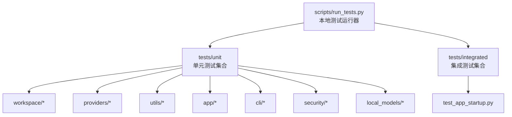
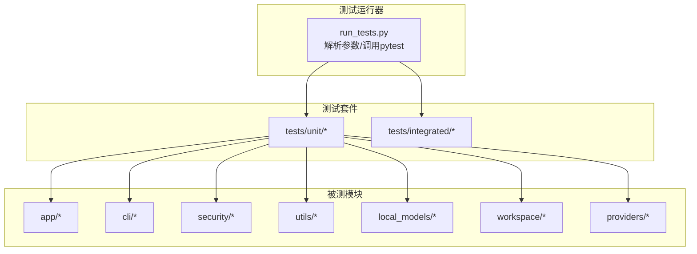
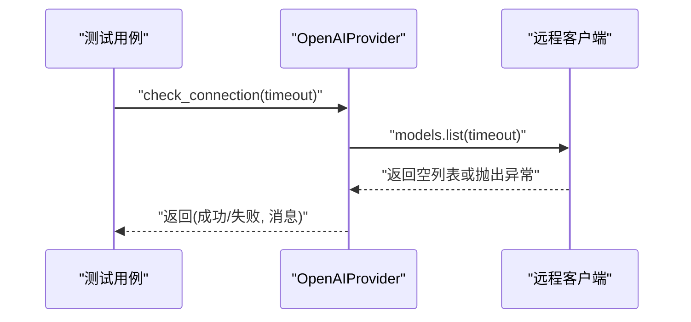
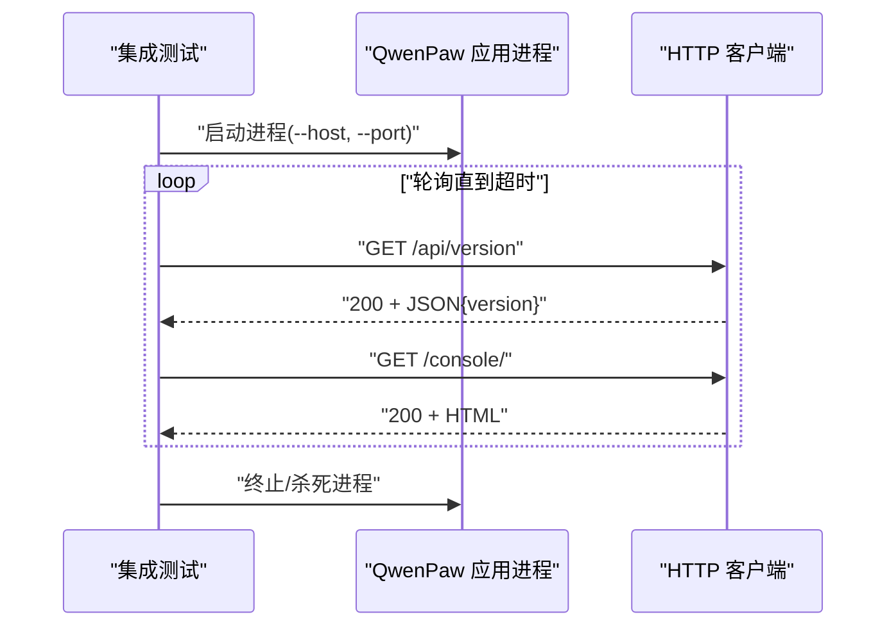
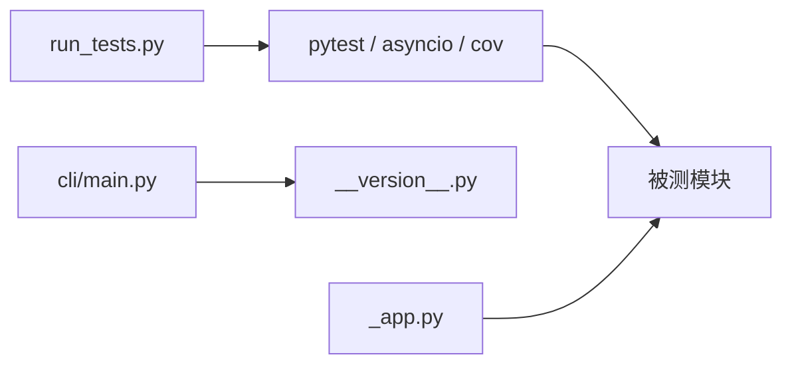

# 测试策略

<cite>
**本文引用的文件**
- [scripts/run_tests.py](file://scripts/run_tests.py)
- [pyproject.toml](file://pyproject.toml)
- [tests/unit/workspace/test_workspace.py](file://tests/unit/workspace/test_workspace.py)
- [tests/unit/providers/test_openai_provider.py](file://tests/unit/providers/test_openai_provider.py)
- [tests/unit/utils/test_command_runner.py](file://tests/unit/utils/test_command_runner.py)
- [tests/integrated/test_app_startup.py](file://tests/integrated/test_app_startup.py)
- [tests/unit/local_models/test_model_manager.py](file://tests/unit/local_models/test_model_manager.py)
- [tests/unit/app/test_chat_updates.py](file://tests/unit/app/test_chat_updates.py)
- [tests/unit/cli/test_cli_version.py](file://tests/unit/cli/test_cli_version.py)
- [tests/unit/security/test_secret_store.py](file://tests/unit/security/test_secret_store.py)
- [src/qwenpaw/__version__.py](file://src/qwenpaw/__version__.py)
- [src/qwenpaw/cli/main.py](file://src/qwenpaw/cli/main.py)
- [src/qwenpaw/app/_app.py](file://src/qwenpaw/app/_app.py)
</cite>

## 目录
1. [引言](#引言)
2. [项目结构](#项目结构)
3. [核心组件](#核心组件)
4. [架构总览](#架构总览)
5. [详细组件分析](#详细组件分析)
6. [依赖分析](#依赖分析)
7. [性能考虑](#性能考虑)
8. [故障排查指南](#故障排查指南)
9. [结论](#结论)
10. [附录](#附录)

## 引言
本测试策略文档面向 QwenPaw 项目，系统化地定义测试架构与测试分类（单元测试、集成测试、端到端测试），明确测试环境搭建与配置、测试用例编写规范、测试场景与示例、持续集成中的测试流程与自动化策略、性能测试与回归测试方法，以及测试调试技巧与常见问题排查路径。目标是帮助开发者在不同阶段高效定位问题、提升质量与稳定性。

## 项目结构
QwenPaw 的测试体系由本地测试运行器与测试目录组成：
- 本地测试运行器：提供统一入口，支持按类别运行、并行执行、覆盖率生成等能力。
- 测试目录：
  - 单元测试 tests/unit：覆盖应用、CLI、安全、工具、工作区、模型管理等模块。
  - 集成测试 tests/integrated：验证应用启动、控制台页面可用性、版本接口等端到端行为。

图表来源
- [scripts/run_tests.py:1-282](file://scripts/run_tests.py#L1-L282)
- [tests/unit/workspace/test_workspace.py:1-97](file://tests/unit/workspace/test_workspace.py#L1-L97)
- [tests/integrated/test_app_startup.py:1-133](file://tests/integrated/test_app_startup.py#L1-L133)

章节来源
- [scripts/run_tests.py:1-282](file://scripts/run_tests.py#L1-L282)
- [pyproject.toml:105-111](file://pyproject.toml#L105-L111)

## 核心组件
- 测试运行器
  - 支持按类别运行（单元/集成）、并行执行、覆盖率报告生成。
  - 命令行参数：-u/--unit、-i/--integrated、-a/--all、-c/--coverage、-p/--parallel。
- 测试框架与标记
  - 使用 pytest 及 asyncio 默认模式，支持自定义标记（如 slow）。
- 覆盖率配置
  - 指定覆盖率范围为 src/qwenpaw，输出 HTML 与缺失行报告。

章节来源
- [scripts/run_tests.py:175-277](file://scripts/run_tests.py#L175-L277)
- [pyproject.toml:105-111](file://pyproject.toml#L105-L111)

## 架构总览
下图展示测试运行器如何组织与调度测试，以及测试覆盖的主要模块。

图表来源
- [scripts/run_tests.py:148-173](file://scripts/run_tests.py#L148-L173)
- [tests/unit/workspace/test_workspace.py:1-97](file://tests/unit/workspace/test_workspace.py#L1-L97)
- [tests/unit/providers/test_openai_provider.py:1-269](file://tests/unit/providers/test_openai_provider.py#L1-L269)
- [tests/unit/utils/test_command_runner.py:1-600](file://tests/unit/utils/test_command_runner.py#L1-L600)
- [tests/integrated/test_app_startup.py:1-133](file://tests/integrated/test_app_startup.py#L1-L133)
- [tests/unit/local_models/test_model_manager.py:1-414](file://tests/unit/local_models/test_model_manager.py#L1-L414)
- [tests/unit/app/test_chat_updates.py:1-142](file://tests/unit/app/test_chat_updates.py#L1-L142)
- [tests/unit/cli/test_cli_version.py:1-13](file://tests/unit/cli/test_cli_version.py#L1-L13)
- [tests/unit/security/test_secret_store.py:1-176](file://tests/unit/security/test_secret_store.py#L1-L176)

## 详细组件分析

### 单元测试设计与实践
- 设计理念
  - 面向模块与功能边界进行隔离测试，优先使用 monkeypatch/factory 函数构造可控输入，减少外部依赖。
  - 对异步逻辑使用 asyncio 标记，确保事件循环正确驱动。
- 典型场景
  - 工作区初始化与状态断言：验证实例属性、默认值、短 UUID 行为与字符串表示。
  - 提供商连接检查与模型列表处理：模拟客户端响应，验证去重与规范化逻辑、错误分支。
  - 命令执行与进程管理：覆盖同步/异步子进程、跨平台差异、优雅关闭与强制终止。
  - 本地模型下载管理：校验下载源选择、进度与错误传播、目录布局与清理。
  - 聊天更新语义：验证部分字段更新、只读字段拒绝、时间戳更新不覆盖名称。
  - CLI 版本输出：通过 Click 测试运行器验证版本选项。
  - 安全密钥存储：加密/解密往返、字典字段加解密、兼容性与容错。
- 断言模式
  - 状态断言：对象属性、内部状态标志位。
  - 行为断言：函数返回值、异常类型与消息、副作用（日志、文件、队列消息）。
  - 时序断言：异步等待、超时、优雅关闭顺序。
- 覆盖率要求
  - 建议对核心业务路径（连接检查、模型列表、命令执行、下载流程、聊天更新）达到高覆盖率；对边界与错误路径不低于中等覆盖率。

图表来源
- [tests/unit/providers/test_openai_provider.py:21-55](file://tests/unit/providers/test_openai_provider.py#L21-L55)

章节来源
- [tests/unit/workspace/test_workspace.py:1-97](file://tests/unit/workspace/test_workspace.py#L1-L97)
- [tests/unit/providers/test_openai_provider.py:1-269](file://tests/unit/providers/test_openai_provider.py#L1-L269)
- [tests/unit/utils/test_command_runner.py:1-600](file://tests/unit/utils/test_command_runner.py#L1-L600)
- [tests/unit/local_models/test_model_manager.py:1-414](file://tests/unit/local_models/test_model_manager.py#L1-L414)
- [tests/unit/app/test_chat_updates.py:1-142](file://tests/unit/app/test_chat_updates.py#L1-L142)
- [tests/unit/cli/test_cli_version.py:1-13](file://tests/unit/cli/test_cli_version.py#L1-L13)
- [tests/unit/security/test_secret_store.py:1-176](file://tests/unit/security/test_secret_store.py#L1-L176)

### 集成测试设计与实践
- 设计理念
  - 以真实进程与网络交互验证系统级行为，避免过度依赖外部服务。
  - 通过临时端口探测、HTTP 客户端轮询、日志采集与进程退出码判断，保证健壮性。
- 典型场景
  - 应用启动与控制台可用性：启动后轮询 /api/version 与 /console/，断言返回码、内容类型与 HTML 结构。
- 断言模式
  - 进程生命周期：启动、健康检查、优雅关闭、异常时的日志提取与诊断。
  - 接口契约：状态码、响应体结构、内容类型。

图表来源
- [tests/integrated/test_app_startup.py:33-133](file://tests/integrated/test_app_startup.py#L33-L133)

章节来源
- [tests/integrated/test_app_startup.py:1-133](file://tests/integrated/test_app_startup.py#L1-L133)

### 端到端测试设计与实践
- 设计理念
  - 在真实或受控环境中，从用户操作到系统响应形成闭环验证，覆盖多通道、多技能、多代理协作等场景。
  - 与集成测试互补：集成测试关注“是否能启动”，端到端测试关注“能否完成典型任务”。
- 建议场景
  - 多代理会话与上下文切换、渠道消息收发、定时任务触发、本地模型下载与推理、安全策略生效（工具守卫、扫描规则）。
- 断言模式
  - 业务结果一致性、消息链完整性、资源释放与错误恢复。

[本节为概念性说明，不直接分析具体文件，故无章节来源]

## 依赖分析
- 测试运行器依赖
  - pytest、pytest-asyncio、pytest-cov、hypothesis（可选）。
  - 并行执行依赖 pytest-xdist（在运行器中以 -p/--parallel 启用）。
- 被测模块依赖
  - FastAPI、uvicorn、agentscope-runtime、各渠道 SDK、本地模型相关库等。
- 关键耦合点
  - CLI 主入口与版本常量耦合，用于 CLI 测试。
  - 应用生命周期与多代理管理器耦合，影响集成测试的启动与停止序列。

图表来源
- [scripts/run_tests.py:63-74](file://scripts/run_tests.py#L63-L74)
- [src/qwenpaw/cli/main.py:146-171](file://src/qwenpaw/cli/main.py#L146-L171)
- [src/qwenpaw/__version__.py:1-3](file://src/qwenpaw/__version__.py#L1-L3)
- [src/qwenpaw/app/_app.py:424-429](file://src/qwenpaw/app/_app.py#L424-L429)

章节来源
- [pyproject.toml:75-103](file://pyproject.toml#L75-L103)
- [scripts/run_tests.py:148-173](file://scripts/run_tests.py#L148-L173)
- [src/qwenpaw/cli/main.py:146-171](file://src/qwenpaw/cli/main.py#L146-L171)
- [src/qwenpaw/app/_app.py:424-429](file://src/qwenpaw/app/_app.py#L424-L429)

## 性能考虑
- 单元测试
  - 使用 monkeypatch 替换耗时外部调用，避免真实网络/磁盘 IO。
  - 对异步流程使用合理的超时与断言，避免长阻塞。
- 集成测试
  - 启动与停止流程应尽量短，避免长时间占用资源。
  - 日志采集采用线程与缓冲，防止阻塞主流程。
- 端到端测试
  - 将长耗时步骤拆分为多个小场景，结合缓存与预置数据。
  - 使用独立测试环境与隔离数据目录，避免并发干扰。
- 覆盖率与性能平衡
  - 在 CI 中开启覆盖率但不强制过高阈值，优先保障关键路径覆盖。

[本节提供通用指导，不直接分析具体文件，故无章节来源]

## 故障排查指南
- 本地测试运行器提示未安装 pytest
  - 按提示安装开发依赖，再重新运行。
- 并行执行失败
  - 确认已安装 pytest-xdist；若失败，回退串行执行。
- 覆盖率报告未生成
  - 确认指定覆盖范围与报告格式；检查 htmlcov 目录权限。
- 集成测试启动超时
  - 检查端口占用、依赖安装、日志输出；确认 /api/version 与 /console/ 可访问。
- CLI 版本测试失败
  - 核对版本常量与 CLI 版本选项绑定是否一致。
- 安全存储解密异常
  - 检查主密钥生成与文件写入、密钥环回退逻辑、错误容错路径。

章节来源
- [scripts/run_tests.py:221-228](file://scripts/run_tests.py#L221-L228)
- [tests/integrated/test_app_startup.py:67-104](file://tests/integrated/test_app_startup.py#L67-L104)
- [tests/unit/cli/test_cli_version.py:8-13](file://tests/unit/cli/test_cli_version.py#L8-L13)
- [tests/unit/security/test_secret_store.py:141-176](file://tests/unit/security/test_secret_store.py#L141-L176)

## 结论
通过分层测试策略与清晰的运行器与配置，QwenPaw 能够在不同阶段快速发现缺陷、降低回归风险。建议持续完善端到端测试场景，强化性能与安全专项测试，并在 CI 中固化测试流程与覆盖率基线，以保障产品稳定交付。

## 附录
- 测试运行器命令参考
  - 运行全部测试：python scripts/run_tests.py
  - 仅运行单元测试：python scripts/run_tests.py -u
  - 仅运行集成测试：python scripts/run_tests.py -i
  - 指定子目录：python scripts/run_tests.py -u providers
  - 并行执行：python scripts/run_tests.py -p
  - 生成覆盖率：python scripts/run_tests.py -c
- 测试用例编写规范（建议）
  - 命名：test_*，描述性强，体现前置条件、动作与期望。
  - 断言：优先断言结果与副作用，避免断言实现细节。
  - 异步：使用 asyncio 标记，合理设置超时。
  - 数据：使用临时目录与工厂函数，避免全局状态。
  - 标记：对慢速或特殊场景使用 pytest 标记，便于选择性执行。

章节来源
- [scripts/run_tests.py:175-277](file://scripts/run_tests.py#L175-L277)