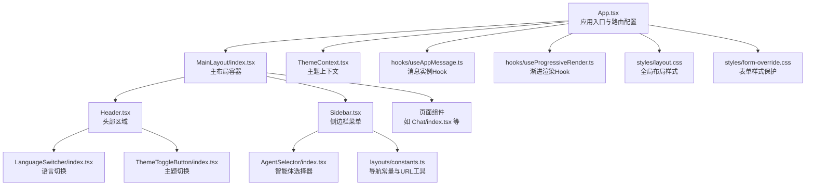
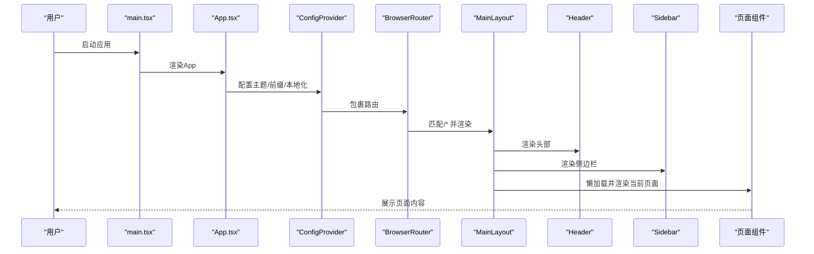
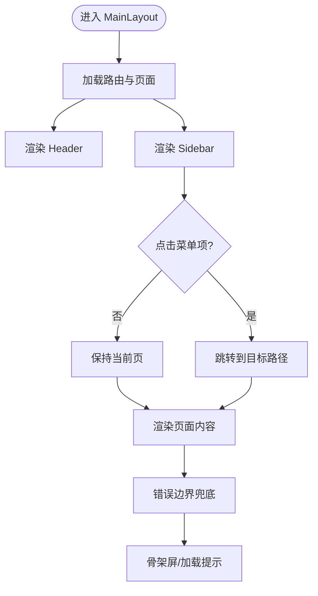
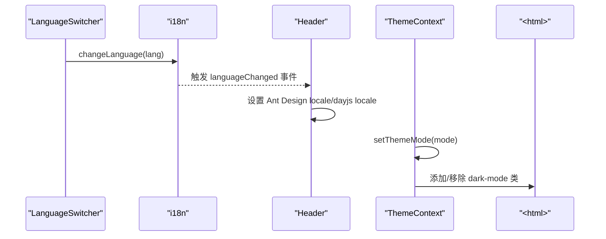
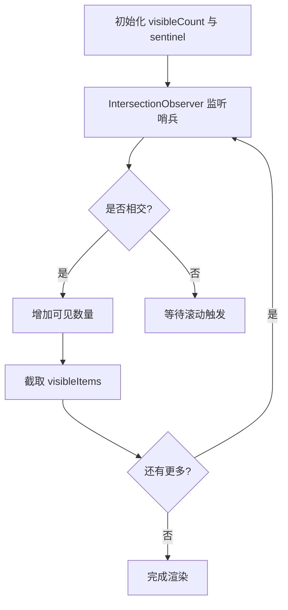
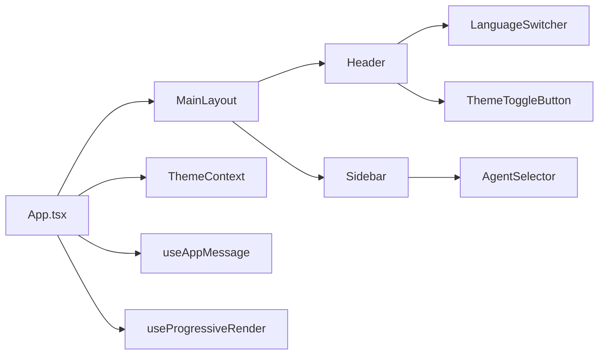

# UI组件开发

<cite>
**本文引用的文件**
- [App.tsx](file://console/src/App.tsx)
- [main.tsx](file://console/src/main.tsx)
- [MainLayout/index.tsx](file://console/src/layouts/MainLayout/index.tsx)
- [Header.tsx](file://console/src/layouts/Header.tsx)
- [Sidebar.tsx](file://console/src/layouts/Sidebar.tsx)
- [ThemeContext.tsx](file://console/src/contexts/ThemeContext.tsx)
- [ThemeToggleButton/index.tsx](file://console/src/components/ThemeToggleButton/index.tsx)
- [LanguageSwitcher/index.tsx](file://console/src/components/LanguageSwitcher/index.tsx)
- [AgentSelector/index.tsx](file://console/src/components/AgentSelector/index.tsx)
- [useAppMessage.ts](file://console/src/hooks/useAppMessage.ts)
- [useProgressiveRender.ts](file://console/src/hooks/useProgressiveRender.ts)
- [layout.css](file://console/src/styles/layout.css)
- [form-override.css](file://console/src/styles/form-override.css)
- [constants.ts](file://console/src/layouts/constants.ts)
- [Chat/index.tsx](file://console/src/pages/Chat/index.tsx)
</cite>

## 目录
1. [引言](#引言)
2. [项目结构](#项目结构)
3. [核心组件](#核心组件)
4. [架构总览](#架构总览)
5. [详细组件分析](#详细组件分析)
6. [依赖关系分析](#依赖关系分析)
7. [性能考虑](#性能考虑)
8. [故障排查指南](#故障排查指南)
9. [结论](#结论)
10. [附录](#附录)

## 引言
本指南面向QwenPaw前端UI组件开发，系统讲解React组件开发模式（函数组件与类组件的适用场景）、Props接口设计与状态管理策略；详解Ant Design组件的使用规范（样式定制、主题配置、响应式设计）；阐述页面布局（MainLayout主布局、Sidebar侧边栏、Header头部）的实现；总结自定义Hook（如useAppMessage、useProgressiveRender）的设计与用法；并覆盖UI组件测试方法、样式规范与性能优化技巧，以及国际化、主题切换与无障碍访问的实现要点。

## 项目结构
QwenPaw前端位于console/src目录，采用按功能域分层的组织方式：API封装、组件库、布局、页面、上下文、Hooks、样式与国际化资源。路由在顶层App中配置，主布局由MainLayout统一承载，Header与Sidebar分别负责顶部导航与侧边菜单，页面组件按模块拆分，样式通过全局CSS与Less模块化结合。

图表来源
- [App.tsx:187-196](file://console/src/App.tsx#L187-L196)
- [MainLayout/index.tsx:75-129](file://console/src/layouts/MainLayout/index.tsx#L75-L129)
- [Header.tsx:52-306](file://console/src/layouts/Header.tsx#L52-L306)
- [Sidebar.tsx:57-516](file://console/src/layouts/Sidebar.tsx#L57-L516)
- [ThemeContext.tsx:51-105](file://console/src/contexts/ThemeContext.tsx#L51-L105)
- [LanguageSwitcher/index.tsx:13-69](file://console/src/components/LanguageSwitcher/index.tsx#L13-L69)
- [ThemeToggleButton/index.tsx:18-53](file://console/src/components/ThemeToggleButton/index.tsx#L18-L53)
- [AgentSelector/index.tsx:17-197](file://console/src/components/AgentSelector/index.tsx#L17-L197)
- [useAppMessage.ts:12-16](file://console/src/hooks/useAppMessage.ts#L12-L16)
- [useProgressiveRender.ts:17-52](file://console/src/hooks/useProgressiveRender.ts#L17-L52)
- [layout.css:1-800](file://console/src/styles/layout.css#L1-L800)
- [form-override.css:1-16](file://console/src/styles/form-override.css#L1-L16)
- [constants.ts:13-38](file://console/src/layouts/constants.ts#L13-L38)

章节来源
- [App.tsx:187-196](file://console/src/App.tsx#L187-L196)
- [MainLayout/index.tsx:75-129](file://console/src/layouts/MainLayout/index.tsx#L75-L129)

## 核心组件
- 应用入口与路由：顶层App负责国际化、主题、路由与鉴权守卫，使用ConfigProvider包裹以统一Ant Design主题与前缀。
- 主布局：MainLayout整合Header、Sidebar与页面内容区，支持懒加载与错误边界。
- 头部组件：Header集成语言切换、主题切换、版本检测与更新弹窗。
- 侧边栏：Sidebar提供多级菜单、折叠交互、账户操作与权限控制。
- 主题上下文：ThemeContext提供主题模式（light/dark/system）与持久化存储。
- 自定义Hook：useAppMessage确保消息实例与ConfigProvider前缀一致；useProgressiveRender实现长列表渐进渲染。
- 样式体系：全局layout.css与form-override.css配合Less模块化，实现深色主题与组件覆盖。

章节来源
- [App.tsx:110-185](file://console/src/App.tsx#L110-L185)
- [MainLayout/index.tsx:75-129](file://console/src/layouts/MainLayout/index.tsx#L75-L129)
- [Header.tsx:52-306](file://console/src/layouts/Header.tsx#L52-L306)
- [Sidebar.tsx:57-516](file://console/src/layouts/Sidebar.tsx#L57-L516)
- [ThemeContext.tsx:51-105](file://console/src/contexts/ThemeContext.tsx#L51-L105)
- [useAppMessage.ts:12-16](file://console/src/hooks/useAppMessage.ts#L12-L16)
- [useProgressiveRender.ts:17-52](file://console/src/hooks/useProgressiveRender.ts#L17-L52)
- [layout.css:1-800](file://console/src/styles/layout.css#L1-L800)
- [form-override.css:1-16](file://console/src/styles/form-override.css#L1-L16)

## 架构总览
下图展示应用启动到页面渲染的关键流程：初始化国际化与主题、设置Ant Design ConfigProvider、路由匹配MainLayout、懒加载页面组件、异常边界兜底与骨架屏提示。

图表来源
- [main.tsx:1-31](file://console/src/main.tsx#L1-L31)
- [App.tsx:151-185](file://console/src/App.tsx#L151-L185)
- [MainLayout/index.tsx:98-122](file://console/src/layouts/MainLayout/index.tsx#L98-L122)

## 详细组件分析

### 布局组件：MainLayout、Header、Sidebar
- MainLayout
  - 负责路由分发与页面容器，使用Suspense与ChunkErrorBoundary提升用户体验。
  - 侧边栏key映射与选中态同步，支持懒加载页面。
- Header
  - 集成语言切换、主题切换、版本检测与更新弹窗，使用Markdown渲染更新说明。
  - 通过ConfigProvider的prefixCls与主题算法影响全局样式。
- Sidebar
  - 多级菜单与折叠交互，支持账户信息修改与登出。
  - 使用useAppMessage进行错误/成功提示，结合鉴权状态控制显示。

图表来源
- [MainLayout/index.tsx:75-129](file://console/src/layouts/MainLayout/index.tsx#L75-L129)
- [Header.tsx:52-306](file://console/src/layouts/Header.tsx#L52-L306)
- [Sidebar.tsx:57-516](file://console/src/layouts/Sidebar.tsx#L57-L516)

章节来源
- [MainLayout/index.tsx:75-129](file://console/src/layouts/MainLayout/index.tsx#L75-L129)
- [Header.tsx:52-306](file://console/src/layouts/Header.tsx#L52-L306)
- [Sidebar.tsx:57-516](file://console/src/layouts/Sidebar.tsx#L57-L516)

### 主题与国际化：ThemeContext、LanguageSwitcher、Header中的语言切换
- ThemeContext
  - 提供themeMode（light/dark/system）、isDark解析结果、切换与持久化。
  - 监听系统主题变化，动态更新<html>类名以驱动全局CSS变量覆盖。
- LanguageSwitcher
  - 下拉切换语言并保存至localStorage与后端偏好。
- Header
  - 初始化语言与dayjs本地化，监听语言变更事件，动态设置Ant Design locale与dayjs locale。

图表来源
- [LanguageSwitcher/index.tsx:13-69](file://console/src/components/LanguageSwitcher/index.tsx#L13-L69)
- [Header.tsx:135-149](file://console/src/layouts/Header.tsx#L135-L149)
- [ThemeContext.tsx:51-105](file://console/src/contexts/ThemeContext.tsx#L51-L105)

章节来源
- [ThemeContext.tsx:51-105](file://console/src/contexts/ThemeContext.tsx#L51-L105)
- [LanguageSwitcher/index.tsx:13-69](file://console/src/components/LanguageSwitcher/index.tsx#L13-L69)
- [Header.tsx:135-149](file://console/src/layouts/Header.tsx#L135-L149)

### 自定义Hook：useAppMessage、useProgressiveRender
- useAppMessage
  - 从Ant Design App.useApp获取message、modal、notification实例，确保与ConfigProvider的prefixCls一致。
- useProgressiveRender
  - 对超长列表进行渐进渲染：初始显示固定数量，滚动触底时批量加载更多；通过IntersectionObserver监听哨兵元素，不破坏现有布局。

图表来源
- [useProgressiveRender.ts:17-52](file://console/src/hooks/useProgressiveRender.ts#L17-L52)

章节来源
- [useAppMessage.ts:12-16](file://console/src/hooks/useAppMessage.ts#L12-L16)
- [useProgressiveRender.ts:17-52](file://console/src/hooks/useProgressiveRender.ts#L17-L52)

### 页面组件：Chat页面（示例）
- Chat页面作为默认落地页被预加载，其他页面采用懒加载与重试机制。
- 组件内集成模型选择、会话管理、输入处理、复制与附件能力，并通过useAppMessage统一消息提示。
- 使用useIMEComposition处理输入法组合键，避免误提交；useMultimodalCapabilities查询模型多模态能力。

章节来源
- [MainLayout/index.tsx:12-51](file://console/src/layouts/MainLayout/index.tsx#L12-L51)
- [Chat/index.tsx:1-200](file://console/src/pages/Chat/index.tsx#L1-L200)

### 样式与主题：全局样式与组件覆盖
- 全局布局样式
  - layout.css通过<html>类名dark-mode切换深色主题，覆盖Ant Design与自研组件的背景、边框、文字颜色等。
- 表单样式保护
  - form-override.css保护必填星号与自定义标记，防止第三方组件覆盖。
- 组件样式
  - 各组件通过Less模块化命名空间（如qwenpaw-前缀）与Ant Design保持一致。

章节来源
- [layout.css:1-800](file://console/src/styles/layout.css#L1-L800)
- [form-override.css:1-16](file://console/src/styles/form-override.css#L1-L16)

## 依赖关系分析
- 组件耦合
  - MainLayout对Header、Sidebar强依赖；Sidebar依赖ThemeContext与useAppMessage；Header依赖LanguageSwitcher与ThemeToggleButton。
- 外部依赖
  - Ant Design、@agentscope-ai/design、@agentscope-ai/icons、react-i18next、dayjs等。
- 潜在循环依赖
  - 当前结构清晰，未发现明显循环依赖；ThemeContext作为全局上下文被广泛使用，属于预期的跨层依赖。

图表来源
- [App.tsx:187-196](file://console/src/App.tsx#L187-L196)
- [MainLayout/index.tsx:75-129](file://console/src/layouts/MainLayout/index.tsx#L75-L129)
- [Header.tsx:52-306](file://console/src/layouts/Header.tsx#L52-L306)
- [Sidebar.tsx:57-516](file://console/src/layouts/Sidebar.tsx#L57-L516)
- [AgentSelector/index.tsx:17-197](file://console/src/components/AgentSelector/index.tsx#L17-L197)
- [LanguageSwitcher/index.tsx:13-69](file://console/src/components/LanguageSwitcher/index.tsx#L13-L69)
- [ThemeToggleButton/index.tsx:18-53](file://console/src/components/ThemeToggleButton/index.tsx#L18-L53)
- [ThemeContext.tsx:51-105](file://console/src/contexts/ThemeContext.tsx#L51-L105)
- [useAppMessage.ts:12-16](file://console/src/hooks/useAppMessage.ts#L12-L16)
- [useProgressiveRender.ts:17-52](file://console/src/hooks/useProgressiveRender.ts#L17-L52)

## 性能考虑
- 懒加载与重试
  - MainLayout对非首屏页面采用lazyWithRetry，提升首屏加载速度与稳定性。
- 渐进渲染
  - useProgressiveRender通过IntersectionObserver与批量加载，降低长列表渲染压力。
- 骨架屏与错误边界
  - Suspense + Spin提供加载反馈；ChunkErrorBoundary在页面分块失败时兜底。
- 样式优化
  - 通过全局CSS减少重复计算，避免深层嵌套导致的重绘；合理使用前缀cls与模块化Less。

章节来源
- [MainLayout/index.tsx:12-51](file://console/src/layouts/MainLayout/index.tsx#L12-L51)
- [useProgressiveRender.ts:17-52](file://console/src/hooks/useProgressiveRender.ts#L17-L52)

## 故障排查指南
- 国际化与本地化
  - 若语言切换无效，检查i18n事件绑定与localStorage写入；确认Header中dayjs与Ant Design locale设置逻辑。
- 主题切换
  - 若深色主题不生效，检查<html>类名是否添加dark-mode；确认ThemeContext的setThemeMode与系统主题监听。
- 消息提示
  - 若消息不显示或样式异常，确认使用useAppMessage而非静态导入，确保与ConfigProvider前缀一致。
- 页面懒加载
  - 若页面空白或报错，检查lazyWithRetry与ChunkErrorBoundary；查看网络面板与控制台错误日志。
- 表单样式覆盖
  - 若必填星号颜色异常，检查form-override.css是否正确引入。

章节来源
- [Header.tsx:135-149](file://console/src/layouts/Header.tsx#L135-L149)
- [ThemeContext.tsx:51-105](file://console/src/contexts/ThemeContext.tsx#L51-L105)
- [useAppMessage.ts:12-16](file://console/src/hooks/useAppMessage.ts#L12-L16)
- [MainLayout/index.tsx:88-122](file://console/src/layouts/MainLayout/index.tsx#L88-L122)
- [form-override.css:1-16](file://console/src/styles/form-override.css#L1-L16)

## 结论
本指南基于QwenPaw前端实际实现，总结了React组件开发模式、Ant Design使用规范、主题与国际化、页面布局、自定义Hook与性能优化等关键实践。建议在新组件开发中遵循：优先使用函数组件与Hooks；通过Context与Hook解耦状态；统一使用ConfigProvider前缀；采用渐进渲染与懒加载优化性能；严格维护样式覆盖与无障碍访问。

## 附录
- 开发最佳实践
  - Props接口设计：明确可选/必填字段，使用类型守卫与默认值；避免过深嵌套。
  - 状态管理：局部状态优先；跨组件共享使用Context；复杂状态引入轻量状态库。
  - 测试：为Hook编写单元测试；为UI组件编写快照与交互测试；对懒加载与错误边界进行集成测试。
  - 可访问性：为按钮与菜单提供aria-label；保证键盘可访问；高对比度与字体大小适配。
  - 国际化：所有文案统一通过i18n；日期与数字格式化使用dayjs与Intl；避免硬编码字符串。