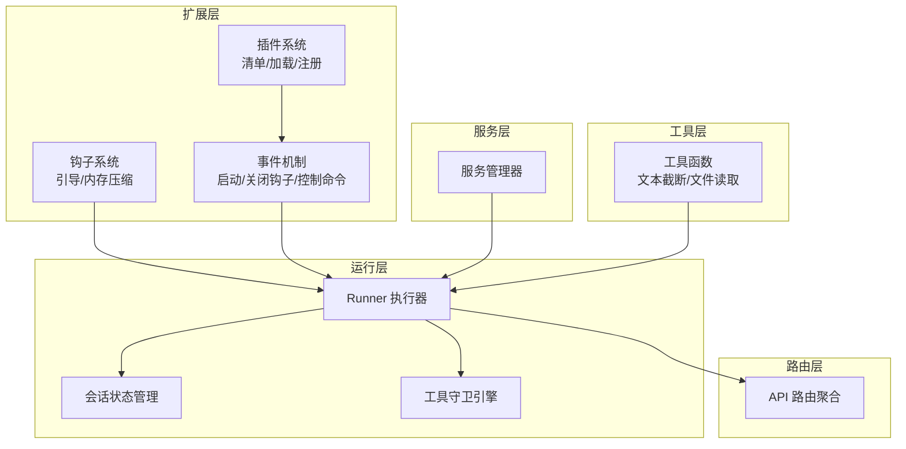
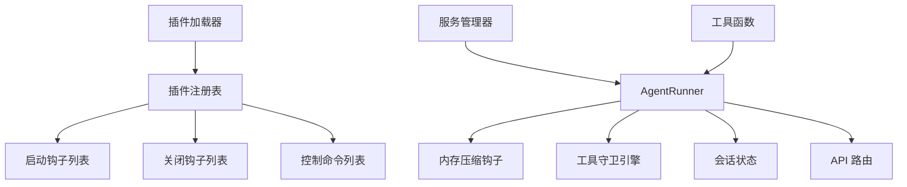
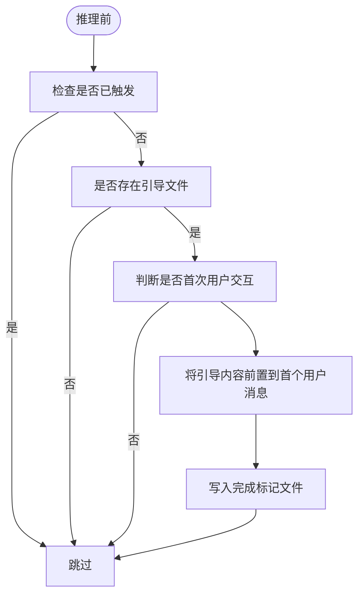
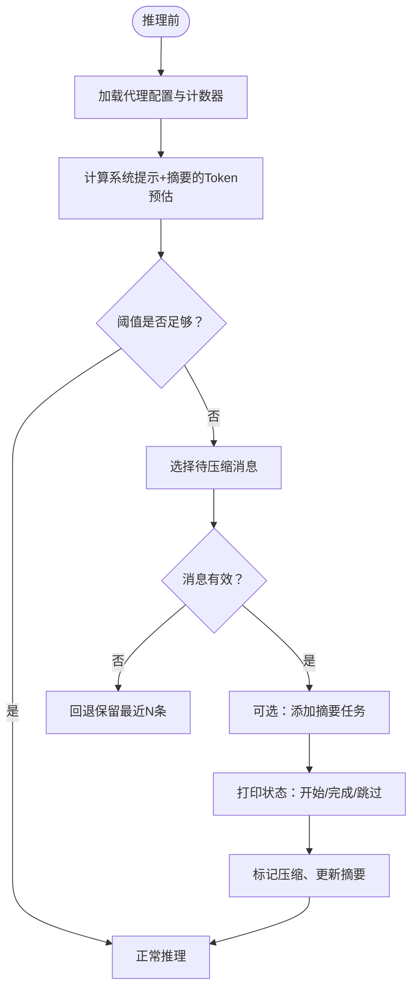
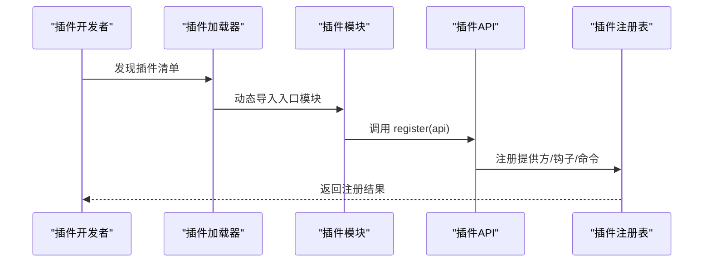
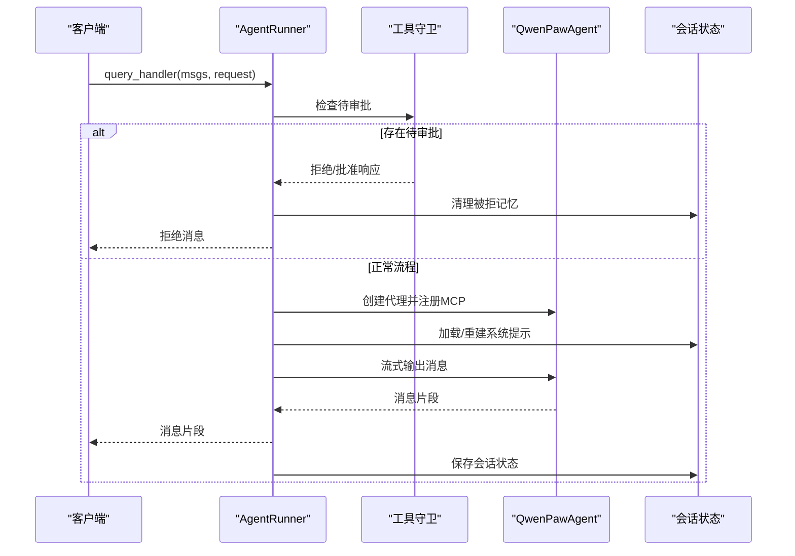
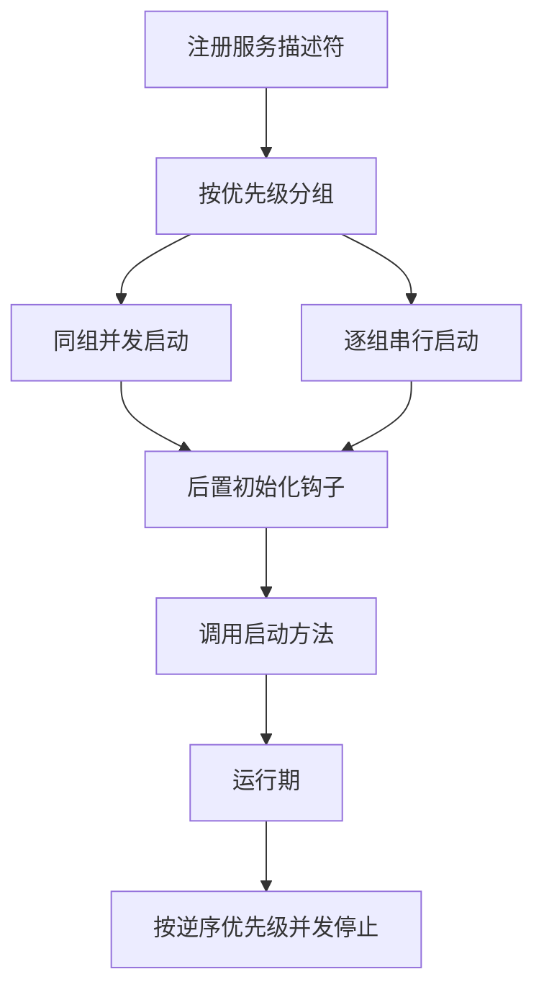
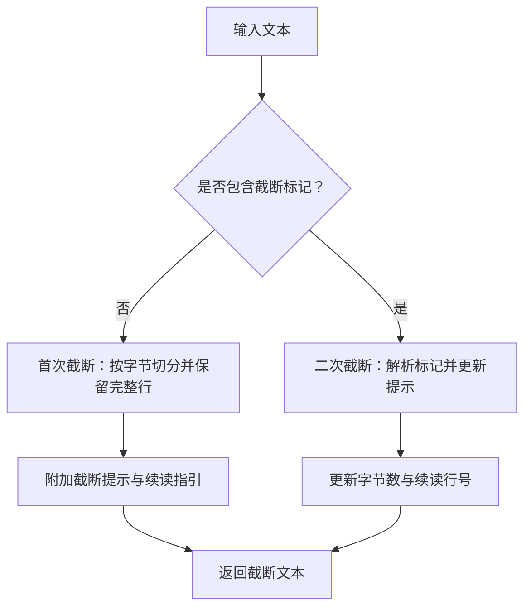
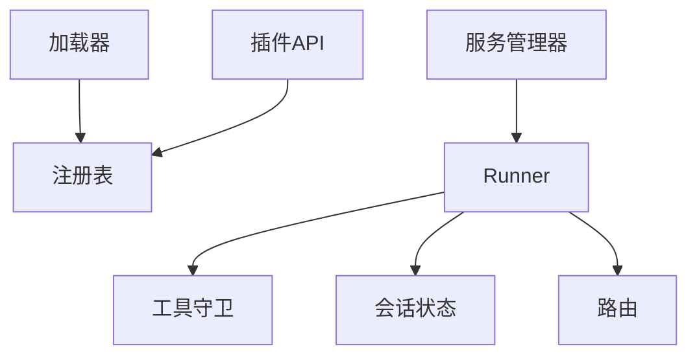

# 扩展点识别与利用

<cite>
**本文引用的文件**
- [src/qwenpaw/agents/hooks/bootstrap.py](file://src/qwenpaw/agents/hooks/bootstrap.py)
- [src/qwenpaw/agents/hooks/memory_compaction.py](file://src/qwenpaw/agents/hooks/memory_compaction.py)
- [src/qwenpaw/plugins/architecture.py](file://src/qwenpaw/plugins/architecture.py)
- [src/qwenpaw/plugins/registry.py](file://src/qwenpaw/plugins/registry.py)
- [src/qwenpaw/plugins/loader.py](file://src/qwenpaw/plugins/loader.py)
- [src/qwenpaw/plugins/api.py](file://src/qwenpaw/plugins/api.py)
- [src/qwenpaw/app/runner/runner.py](file://src/qwenpaw/app/runner/runner.py)
- [src/qwenpaw/app/routers/__init__.py](file://src/qwenpaw/app/routers/__init__.py)
- [src/qwenpaw/app/workspace/service_manager.py](file://src/qwenpaw/app/workspace/service_manager.py)
- [src/qwenpaw/constant.py](file://src/qwenpaw/constant.py)
- [src/qwenpaw/agents/utils/setup_utils.py](file://src/qwenpaw/agents/utils/setup_utils.py)
- [src/qwenpaw/agents/tools/utils.py](file://src/qwenpaw/agents/tools/utils.py)
- [src/qwenpaw/security/tool_guard/engine.py](file://src/qwenpaw/security/tool_guard/engine.py)
- [src/qwenpaw/app/_app.py](file://src/qwenpaw/app/_app.py)
</cite>

## 目录
1. [引言](#引言)
2. [项目结构](#项目结构)
3. [核心组件](#核心组件)
4. [架构总览](#架构总览)
5. [详细组件分析](#详细组件分析)
6. [依赖分析](#依赖分析)
7. [性能考量](#性能考量)
8. [故障排查指南](#故障排查指南)
9. [结论](#结论)
10. [附录](#附录)

## 引言
本指南面向希望在 QwenPaw 中进行扩展开发的工程师与技术作者，系统讲解扩展点体系：钩子系统（如引导钩子、内存压缩钩子）、插件与事件（启动/关闭钩子、控制命令）、依赖注入与服务管理、Runner 执行器扩展、Router 路由扩展以及工具函数扩展。文档同时覆盖安全与性能注意事项、兼容性保障策略，并提供从“识别现有扩展点”到“设计与落地”的完整方法论。

## 项目结构
QwenPaw 将扩展能力分布在多个层次：
- 钩子层：在推理前后插入逻辑，如引导提示与上下文压缩。
- 插件层：通过插件清单与加载器动态发现与注册能力。
- 事件层：以注册表为中心的启动/关闭钩子与控制命令。
- 运行层：Runner 负责请求处理、会话状态、工具守卫与错误兜底。
- 路由层：统一挂载各模块 API 路由。
- 服务层：Workspace 服务管理器负责服务生命周期与依赖关系。
- 工具层：通用工具函数（如文本截断、文件读取）支撑扩展行为。

图示来源
- [src/qwenpaw/agents/hooks/bootstrap.py:20-104](file://src/qwenpaw/agents/hooks/bootstrap.py#L20-L104)
- [src/qwenpaw/agents/hooks/memory_compaction.py:27-214](file://src/qwenpaw/agents/hooks/memory_compaction.py#L27-L214)
- [src/qwenpaw/plugins/loader.py:19-241](file://src/qwenpaw/plugins/loader.py#L19-L241)
- [src/qwenpaw/plugins/registry.py:42-254](file://src/qwenpaw/plugins/registry.py#L42-L254)
- [src/qwenpaw/app/runner/runner.py:70-735](file://src/qwenpaw/app/runner/runner.py#L70-L735)
- [src/qwenpaw/app/routers/__init__.py:1-60](file://src/qwenpaw/app/routers/__init__.py#L1-L60)
- [src/qwenpaw/app/workspace/service_manager.py:74-421](file://src/qwenpaw/app/workspace/service_manager.py#L74-L421)
- [src/qwenpaw/agents/tools/utils.py:153-238](file://src/qwenpaw/agents/tools/utils.py#L153-L238)

章节来源
- [src/qwenpaw/app/routers/__init__.py:1-60](file://src/qwenpaw/app/routers/__init__.py#L1-L60)
- [src/qwenpaw/app/workspace/service_manager.py:74-421](file://src/qwenpaw/app/workspace/service_manager.py#L74-L421)

## 核心组件
- 钩子系统
  - 引导钩子：在首次用户交互时自动注入引导内容，避免重复触发。
  - 内存压缩钩子：在推理前检查上下文 Token，必要时压缩历史消息并归档。
- 插件系统
  - 清单与记录：描述插件元信息与加载状态。
  - 加载器：扫描目录、解析清单、动态导入模块并调用注册接口。
  - 注册表：集中管理提供方、启动/关闭钩子、控制命令。
  - 插件 API：为插件开发者提供注册入口。
- 事件机制
  - 启动/关闭钩子：按优先级排序执行，支持同步与异步回调。
  - 控制命令：注册命令处理器，支持优先级。
- Runner 执行器
  - 请求处理：构建环境上下文、加载配置、创建代理、流式输出消息。
  - 工具守卫：拦截工具调用，等待审批或拒绝。
  - 会话状态：保存/恢复会话状态，清理被拒消息。
- 路由扩展
  - 统一挂载多模块路由，支持代理作用域路由包装。
- 服务管理
  - 服务描述符：定义生命周期、依赖、并发初始化策略。
  - 生命周期：按优先级并发/串行启动；可重用实例在热重载中复用。
- 工具函数
  - 文本截断：带换行完整性与续读提示，支持二次截断。
  - 安全读取：限制最大读取字节数，规避内存风险。

章节来源
- [src/qwenpaw/agents/hooks/bootstrap.py:20-104](file://src/qwenpaw/agents/hooks/bootstrap.py#L20-L104)
- [src/qwenpaw/agents/hooks/memory_compaction.py:27-214](file://src/qwenpaw/agents/hooks/memory_compaction.py#L27-L214)
- [src/qwenpaw/plugins/architecture.py:9-55](file://src/qwenpaw/plugins/architecture.py#L9-L55)
- [src/qwenpaw/plugins/loader.py:19-241](file://src/qwenpaw/plugins/loader.py#L19-L241)
- [src/qwenpaw/plugins/registry.py:42-254](file://src/qwenpaw/plugins/registry.py#L42-L254)
- [src/qwenpaw/plugins/api.py:10-186](file://src/qwenpaw/plugins/api.py#L10-L186)
- [src/qwenpaw/app/runner/runner.py:70-735](file://src/qwenpaw/app/runner/runner.py#L70-L735)
- [src/qwenpaw/app/routers/__init__.py:1-60](file://src/qwenpaw/app/routers/__init__.py#L1-L60)
- [src/qwenpaw/app/workspace/service_manager.py:30-421](file://src/qwenpaw/app/workspace/service_manager.py#L30-L421)
- [src/qwenpaw/agents/tools/utils.py:153-238](file://src/qwenpaw/agents/tools/utils.py#L153-L238)

## 架构总览
下图展示扩展点在系统中的位置与交互关系：插件通过加载器与注册表接入事件机制；Runner 在请求处理链路中使用钩子、守卫与会话；路由统一对外暴露 API；服务管理器协调内部组件生命周期。

图示来源
- [src/qwenpaw/plugins/loader.py:84-197](file://src/qwenpaw/plugins/loader.py#L84-L197)
- [src/qwenpaw/plugins/registry.py:149-253](file://src/qwenpaw/plugins/registry.py#L149-L253)
- [src/qwenpaw/app/runner/runner.py:349-595](file://src/qwenpaw/app/runner/runner.py#L349-L595)
- [src/qwenpaw/app/routers/__init__.py:25-46](file://src/qwenpaw/app/routers/__init__.py#L25-L46)
- [src/qwenpaw/app/workspace/service_manager.py:171-329](file://src/qwenpaw/app/workspace/service_manager.py#L171-L329)
- [src/qwenpaw/agents/tools/utils.py:153-238](file://src/qwenpaw/agents/tools/utils.py#L153-L238)

## 详细组件分析

### 钩子系统：引导与内存压缩
- 引导钩子（BootstrapHook）
  - 触发条件：首次用户交互且存在引导文件，且未触发过。
  - 行为：读取系统提示与记忆，将引导内容前置到首个用户消息，随后写入完成标记文件。
  - 注意：仅一次有效，避免重复注入。
- 内存压缩钩子（MemoryCompactionHook）
  - 触发时机：推理前。
  - 行为：计算系统提示与压缩摘要的 Token 预估，结合阈值决定是否压缩；保留近期消息；可选生成摘要并归档。
  - 失败保护：当消息有效性校验失败时，回退保留最近若干条消息以确保可用性。

图示来源
- [src/qwenpaw/agents/hooks/bootstrap.py:42-104](file://src/qwenpaw/agents/hooks/bootstrap.py#L42-L104)

图示来源
- [src/qwenpaw/agents/hooks/memory_compaction.py:62-214](file://src/qwenpaw/agents/hooks/memory_compaction.py#L62-L214)

章节来源
- [src/qwenpaw/agents/hooks/bootstrap.py:20-104](file://src/qwenpaw/agents/hooks/bootstrap.py#L20-L104)
- [src/qwenpaw/agents/hooks/memory_compaction.py:27-214](file://src/qwenpaw/agents/hooks/memory_compaction.py#L27-L214)

### 插件与事件：注册表、加载器与 API
- 清单与记录
  - 清单定义插件元信息（ID、名称、版本、入口、依赖等）。
  - 记录跟踪源路径、启用状态、实例与诊断信息。
- 加载器
  - 扫描插件目录，解析 plugin.json，动态导入模块，调用插件的注册方法。
  - 支持同步/异步注册，异常捕获与日志记录。
- 注册表
  - 提供提供方、启动/关闭钩子、控制命令的注册与查询。
  - 启动/关闭钩子按优先级排序，低优先级先执行。
- 插件 API
  - 对外暴露注册接口：注册提供方、启动/关闭钩子、控制命令。
  - 提供运行时助手访问入口。

图示来源
- [src/qwenpaw/plugins/loader.py:84-197](file://src/qwenpaw/plugins/loader.py#L84-L197)
- [src/qwenpaw/plugins/api.py:10-186](file://src/qwenpaw/plugins/api.py#L10-L186)
- [src/qwenpaw/plugins/registry.py:42-254](file://src/qwenpaw/plugins/registry.py#L42-L254)

章节来源
- [src/qwenpaw/plugins/architecture.py:9-55](file://src/qwenpaw/plugins/architecture.py#L9-L55)
- [src/qwenpaw/plugins/loader.py:19-241](file://src/qwenpaw/plugins/loader.py#L19-L241)
- [src/qwenpaw/plugins/registry.py:42-254](file://src/qwenpaw/plugins/registry.py#L42-L254)
- [src/qwenpaw/plugins/api.py:10-186](file://src/qwenpaw/plugins/api.py#L10-L186)

### Runner 执行器扩展
- 请求处理链
  - 环境上下文构建、MCP 客户端注入、代理配置加载、会话状态加载与重建系统提示。
  - 流式输出消息，支持取消与异常转换。
- 工具守卫与审批
  - 检查会话是否有待审批项，支持批准/拒绝；超时自动拒绝并清理会话记忆。
- 会话状态
  - 保存/恢复会话状态，清理被拒消息并追加拒绝提示。
- 初始化与关闭
  - 初始化加载 .env，创建会话存储；关闭阶段预留扩展点。

图示来源
- [src/qwenpaw/app/runner/runner.py:349-595](file://src/qwenpaw/app/runner/runner.py#L349-L595)

章节来源
- [src/qwenpaw/app/runner/runner.py:70-735](file://src/qwenpaw/app/runner/runner.py#L70-L735)

### Router 路由扩展
- 路由聚合
  - 统一 include 多个模块路由（代理、技能、工具、工作区等）。
  - 提供代理作用域路由包装，便于按 agentId 分组。
- 扩展建议
  - 新增路由时遵循模块化命名，保持与现有风格一致；注意权限与鉴权中间件的挂载。

章节来源
- [src/qwenpaw/app/routers/__init__.py:1-60](file://src/qwenpaw/app/routers/__init__.py#L1-L60)

### 服务管理：依赖注入与生命周期
- 服务描述符
  - 定义服务类、初始化参数、后置初始化钩子、启动/停止方法、依赖关系、优先级与并发初始化策略。
- 生命周期管理
  - 按优先级分组，同优先级并发启动；支持可重用服务在热重载时复用并触发重载钩子。
  - 停止阶段按逆序优先级并发停止，忽略可重用服务（除非最终关闭）。

图示来源
- [src/qwenpaw/app/workspace/service_manager.py:158-329](file://src/qwenpaw/app/workspace/service_manager.py#L158-L329)

章节来源
- [src/qwenpaw/app/workspace/service_manager.py:74-421](file://src/qwenpaw/app/workspace/service_manager.py#L74-L421)

### 工具函数扩展：文本截断与安全读取
- 文本截断
  - 首次截断：按字节边界切分，保留完整行，附加截断提示与续读指引。
  - 二次截断：解析已有提示，更新字节数与续读起始行。
- 安全读取
  - 限制最大读取字节数，UTF-8 BOM 自动处理，编码错误时静默丢弃不完整字符。

图示来源
- [src/qwenpaw/agents/tools/utils.py:153-206](file://src/qwenpaw/agents/tools/utils.py#L153-L206)

章节来源
- [src/qwenpaw/agents/tools/utils.py:1-238](file://src/qwenpaw/agents/tools/utils.py#L1-L238)

## 依赖分析
- 组件耦合
  - Runner 依赖配置加载、会话状态、工具守卫与 MCP 管理器；与服务管理器解耦，通过注入方式集成。
  - 插件注册表作为中心枢纽，被加载器与插件 API 使用，避免直接耦合具体实现。
  - 钩子通过代理内存接口与配置计数器协作，避免强绑定具体模型。
- 外部依赖
  - FastAPI 路由聚合；Agentscope 运行时 Runner 与消息流；dotenv 环境变量加载。
- 循环依赖
  - 当前结构以注册表与加载器为中心，避免循环导入；服务管理器通过描述符延迟解析类，降低耦合。

图示来源
- [src/qwenpaw/plugins/loader.py:19-241](file://src/qwenpaw/plugins/loader.py#L19-L241)
- [src/qwenpaw/plugins/registry.py:42-254](file://src/qwenpaw/plugins/registry.py#L42-L254)
- [src/qwenpaw/app/runner/runner.py:70-735](file://src/qwenpaw/app/runner/runner.py#L70-L735)
- [src/qwenpaw/app/routers/__init__.py:25-46](file://src/qwenpaw/app/routers/__init__.py#L25-L46)
- [src/qwenpaw/app/workspace/service_manager.py:74-421](file://src/qwenpaw/app/workspace/service_manager.py#L74-L421)

章节来源
- [src/qwenpaw/plugins/loader.py:19-241](file://src/qwenpaw/plugins/loader.py#L19-L241)
- [src/qwenpaw/plugins/registry.py:42-254](file://src/qwenpaw/plugins/registry.py#L42-L254)
- [src/qwenpaw/app/runner/runner.py:70-735](file://src/qwenpaw/app/runner/runner.py#L70-L735)

## 性能考量
- 上下文压缩
  - 合理设置压缩阈值与保留比例，避免频繁压缩导致额外 IO；保留近期消息确保连续性。
- 并发与序列化
  - 服务管理器支持同优先级并发初始化；长耗时操作应异步化并提供进度反馈。
- 工具调用
  - 工具守卫可能引入延迟，建议在高并发场景下优化规则集与缓存策略。
- 文件读取
  - 使用安全读取函数限制内存占用，避免大文件一次性读入。

## 故障排查指南
- 插件加载失败
  - 检查插件目录与清单文件；确认入口模块导出必需对象；查看加载器异常日志。
- 钩子未生效
  - 确认钩子注册优先级与触发条件；检查代理内存接口与配置计数器是否正确初始化。
- 工具守卫阻塞
  - 检查审批队列与超时设置；确认会话状态清理逻辑是否正确执行。
- 会话状态异常
  - 查看会话保存/加载路径与权限；核对消息格式与标记位。

章节来源
- [src/qwenpaw/plugins/loader.py:199-241](file://src/qwenpaw/plugins/loader.py#L199-L241)
- [src/qwenpaw/agents/hooks/memory_compaction.py:143-175](file://src/qwenpaw/agents/hooks/memory_compaction.py#L143-L175)
- [src/qwenpaw/security/tool_guard/engine.py:169-226](file://src/qwenpaw/security/tool_guard/engine.py#L169-L226)
- [src/qwenpaw/app/runner/runner.py:599-708](file://src/qwenpaw/app/runner/runner.py#L599-L708)

## 结论
QwenPaw 的扩展点体系以“钩子 + 插件 + 事件 + Runner + 路由 + 服务管理 + 工具函数”为核心，既保证了灵活性，又提供了清晰的生命周期与安全边界。通过本文的方法论与实践建议，开发者可以快速识别现有扩展点、设计合理的扩展方案，并在安全与性能之间取得平衡。

## 附录

### 扩展点开发步骤
- 识别现有扩展点
  - 钩子：查看引导与内存压缩钩子的调用点与接口。
  - 插件：扫描插件目录与注册表接口。
  - 事件：查询启动/关闭钩子与控制命令注册处。
  - Runner：定位请求处理链与会话状态管理。
  - 路由：遍历路由聚合文件。
  - 服务：检查服务描述符与生命周期方法。
  - 工具：阅读文本截断与安全读取函数。
- 评估扩展需求
  - 明确扩展目标（功能增强、性能优化、安全加固）。
  - 评估对现有钩子/事件/Runner 的侵入度与兼容性。
- 设计扩展方案
  - 优先使用注册表与加载器进行声明式扩展。
  - 钩子与 Runner 扩展需最小化副作用，确保幂等与可回滚。
  - 路由与服务扩展遵循模块化与可测试原则。
- 安全与性能
  - 工具守卫与权限控制必须前置；对高开销操作采用异步与缓存。
  - 关注上下文压缩阈值与保留策略，避免过度 IO。
- 兼容性保证
  - 通过环境变量与配置项提供降级开关；对新特性提供渐进式启用。
  - 严格遵循现有命名与数据结构，避免破坏既有 API。

章节来源
- [src/qwenpaw/agents/utils/setup_utils.py:14-77](file://src/qwenpaw/agents/utils/setup_utils.py#L14-L77)
- [src/qwenpaw/constant.py:196-208](file://src/qwenpaw/constant.py#L196-L208)
- [src/qwenpaw/app/_app.py:362-385](file://src/qwenpaw/app/_app.py#L362-L385)