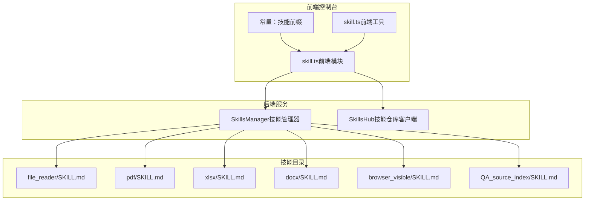
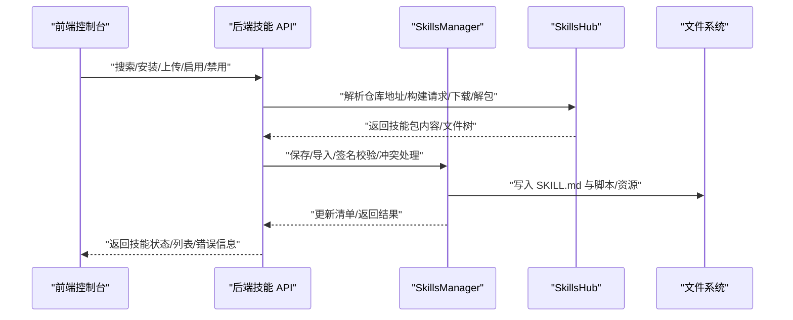
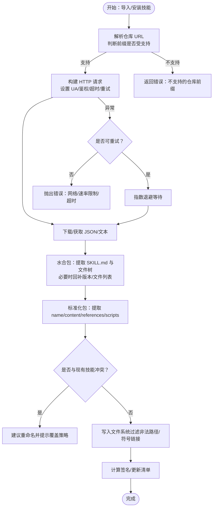
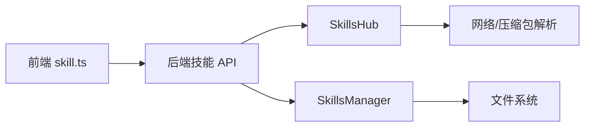

# 技能开发

<cite>
**本文引用的文件**
- [skills_hub.py](file://src/qwenpaw/agents/skills_hub.py)
- [skills_manager.py](file://src/qwenpaw/agents/skills_manager.py)
- [skill.ts（前端模块）](file://console/src/api/modules/skill.ts)
- [skill.ts（前端工具）](file://console/src/utils/skill.ts)
- [SKILL.md（文件读取）](file://src/qwenpaw/agents/skills/file_reader/SKILL.md)
- [SKILL.md（PDF 处理）](file://src/qwenpaw/agents/skills/pdf/SKILL.md)
- [SKILL.md（XLSX 表格）](file://src/qwenpaw/agents/skills/xlsx/SKILL.md)
- [SKILL.md（DOCX 文档）](file://src/qwenpaw/agents/skills/docx/SKILL.md)
- [SKILL.md（可见浏览器）](file://src/qwenpaw/agents/skills/browser_visible/SKILL.md)
- [SKILL.md（QA 索引）](file://src/qwenpaw/agents/skills/QA_source_index/SKILL.md)
- [常量：技能前缀](file://console/src/constants/skill.ts)
</cite>

## 目录
1. [简介](#简介)
2. [项目结构](#项目结构)
3. [核心组件](#核心组件)
4. [架构总览](#架构总览)
5. [详细组件分析](#详细组件分析)
6. [依赖分析](#依赖分析)
7. [性能考量](#性能考量)
8. [故障排查指南](#故障排查指南)
9. [结论](#结论)
10. [附录](#附录)

## 简介
本指南面向开发者，系统讲解 QwenPaw 技能系统的目录结构、命名规范、描述文件（SKILL.md）编写规范、技能加载机制（SkillsHub 仓库、SkillsManager 管理器与动态加载流程）、开发最佳实践（工具调用模式、错误处理、性能优化、安全）、多类型技能开发示例（文件处理、网络请求、系统操作），以及测试、调试与发布流程。

## 项目结构
QwenPaw 将“技能”抽象为可被工作区与共享技能池管理的独立单元，每个技能由一个目录组成，其中包含描述文件 SKILL.md 与可选的脚本与资源。前端控制台通过 API 与后端交互，实现技能的搜索、安装、启用、配置与可视化。

图表来源
- [skills_manager.py](file://src/qwenpaw/agents/skills_manager.py)
- [skills_hub.py](file://src/qwenpaw/agents/skills_hub.py)
- [skill.ts（前端模块）](file://console/src/api/modules/skill.ts)
- [常量：技能前缀](file://console/src/constants/skill.ts)
- [SKILL.md（文件读取）](file://src/qwenpaw/agents/skills/file_reader/SKILL.md)
- [SKILL.md（PDF 处理）](file://src/qwenpaw/agents/skills/pdf/SKILL.md)
- [SKILL.md（XLSX 表格）](file://src/qwenpaw/agents/skills/xlsx/SKILL.md)
- [SKILL.md（DOCX 文档）](file://src/qwenpaw/agents/skills/docx/SKILL.md)
- [SKILL.md（可见浏览器）](file://src/qwenpaw/agents/skills/browser_visible/SKILL.md)
- [SKILL.md（QA 索引）](file://src/qwenpaw/agents/skills/QA_source_index/SKILL.md)

章节来源
- [skills_manager.py](file://src/qwenpaw/agents/skills_manager.py)
- [skills_hub.py](file://src/qwenpaw/agents/skills_hub.py)
- [skill.ts（前端模块）](file://console/src/api/modules/skill.ts)
- [常量：技能前缀](file://console/src/constants/skill.ts)

## 核心组件
- 技能仓库客户端（SkillsHub）
  - 支持从远程仓库（如 clawhub.ai、skills.sh 等）搜索、拉取、解析技能包，并进行下载与解包。
  - 提供重试、超时、速率限制、取消检查、缓存等能力。
- 技能管理器（SkillsManager）
  - 负责技能清单（workspace/pool）的读写、签名校验、冲突检测与重命名建议、环境变量注入、内置/自定义技能分类、批量导入与同步。
- 前端技能 API（skill.ts）
  - 提供技能列表、刷新、搜索、上传、启用/禁用、批量删除、安装任务状态查询与取消、AI 优化流式接口等。
- 技能描述文件（SKILL.md）
  - 使用 YAML Front Matter 定义元数据（名称、描述、版本、许可证、emoji、requires 等），正文用于技能说明、前置条件、使用示例与注意事项。

章节来源
- [skills_hub.py](file://src/qwenpaw/agents/skills_hub.py)
- [skills_manager.py](file://src/qwenpaw/agents/skills_manager.py)
- [skill.ts（前端模块）](file://console/src/api/modules/skill.ts)
- [SKILL.md（文件读取）](file://src/qwenpaw/agents/skills/file_reader/SKILL.md)
- [SKILL.md（PDF 处理）](file://src/qwenpaw/agents/skills/pdf/SKILL.md)
- [SKILL.md（XLSX 表格）](file://src/qwenpaw/agents/skills/xlsx/SKILL.md)
- [SKILL.md（DOCX 文档）](file://src/qwenpaw/agents/skills/docx/SKILL.md)
- [SKILL.md（可见浏览器）](file://src/qwenpaw/agents/skills/browser_visible/SKILL.md)
- [SKILL.md（QA 索引）](file://src/qwenpaw/agents/skills/QA_source_index/SKILL.md)

## 架构总览
技能系统从前端发起请求，经由后端 API 调用 SkillsManager 与 SkillsHub，完成技能的本地化、校验、注册与运行时注入。运行时根据渠道与配置注入环境变量，确保技能具备所需依赖与参数。

图表来源
- [skills_hub.py](file://src/qwenpaw/agents/skills_hub.py)
- [skills_manager.py](file://src/qwenpaw/agents/skills_manager.py)
- [skill.ts（前端模块）](file://console/src/api/modules/skill.ts)

## 详细组件分析

### 技能目录结构与命名规范
- 目录组织
  - 每个技能为独立目录，根下必须包含 SKILL.md；可包含 references/ 与 scripts/ 子目录及其它资源文件。
  - 目录名即技能标识（name 字段优先来自 SKILL.md，但磁盘目录名用于稳定路由与同步）。
- 命名与路径
  - 目录名不允许包含路径分隔符、空字符、点号等非法字符；支持字母、数字、连字符与下划线。
  - 文件路径不得越权（禁止绝对路径、上层目录跳转、符号链接）。
- 清单与签名
  - 通过内容哈希（signature）识别技能变更；忽略常见系统产物（如 __pycache__、.DS_Store 等）。
  - 工作区与共享技能池分别维护 skill.json 清单，支持内置/自定义分类与版本标记。

章节来源
- [skills_manager.py](file://src/qwenpaw/agents/skills_manager.py)

### SKILL.md 描述文件编写规范
- 元数据（YAML Front Matter）
  - 必填字段：name、description
  - 可选字段：metadata（含版本、emoji、requires 等）
  - 许可证：license（若为专有）
- 正文内容
  - 使用说明、前置条件、命令/代码示例、注意事项与安全行为。
  - 对于依赖外部工具的技能，明确列出二进制依赖与安装方式。
- 示例参考
  - 文件读取：强调仅处理文本类文件、大文件摘要策略、安全与行为约束。
  - PDF 处理：列出 pypdf、pdfplumber、reportlab、poppler 工具链，提供合并/拆分/旋转/OCR/表单等示例。
  - XLSX 表格：强调公式驱动、颜色编码标准、数字格式规则、公式验证与错误修复。
  - DOCX 文档：docx-js 使用要点、表格宽度与单元格宽度一致性、图像插入、页眉页脚、目录生成。
  - 可见浏览器：与 headless 模式的区别、何时使用、注意事项。

章节来源
- [SKILL.md（文件读取）](file://src/qwenpaw/agents/skills/file_reader/SKILL.md)
- [SKILL.md（PDF 处理）](file://src/qwenpaw/agents/skills/pdf/SKILL.md)
- [SKILL.md（XLSX 表格）](file://src/qwenpaw/agents/skills/xlsx/SKILL.md)
- [SKILL.md（DOCX 文档）](file://src/qwenpaw/agents/skills/docx/SKILL.md)
- [SKILL.md（可见浏览器）](file://src/qwenpaw/agents/skills/browser_visible/SKILL.md)
- [SKILL.md（QA 索引）](file://src/qwenpaw/agents/skills/QA_source_index/SKILL.md)

### 技能加载机制与动态流程
- SkillsHub（技能仓库）
  - 支持从多个受支持的仓库前缀（如 https://skills.sh/、https://clawhub.ai/、https://github.com/ 等）解析与下载技能包。
  - 解析远程响应为统一的“包”结构，提取 SKILL.md 与脚本/资源树，必要时回补版本与文件列表。
  - 提供重试、超时、背压、速率限制与取消检查，保障稳定性与可控性。
- SkillsManager（技能管理器）
  - 读取/写入工作区与共享技能池清单，计算签名、检测冲突并建议重命名。
  - 将技能包内容落盘，解析 frontmatter，注入环境变量（基于 metadata.requires.env），并记录版本与更新时间。
  - 提供批量导入、上传 Zip、下载/上传至池、渠道与标签管理、配置读写等能力。

图表来源
- [skills_hub.py](file://src/qwenpaw/agents/skills_hub.py)
- [skills_manager.py](file://src/qwenpaw/agents/skills_manager.py)
- [常量：技能前缀](file://console/src/constants/skill.ts)

章节来源
- [skills_hub.py](file://src/qwenpaw/agents/skills_hub.py)
- [skills_manager.py](file://src/qwenpaw/agents/skills_manager.py)
- [常量：技能前缀](file://console/src/constants/skill.ts)

### 前端技能 API 与控制台集成
- 列表与刷新
  - 支持按代理（agent）维度获取技能列表，支持刷新与缓存失效。
- 搜索与安装
  - 搜索仓库技能、启动安装任务、轮询状态、取消任务。
- 上传与导入
  - 支持上传 Zip 包，自动导入并处理冲突；支持从仓库导入到技能池。
- 配置与通道
  - 支持为技能设置/更新配置、设置渠道与标签；提供 AI 优化流式接口。
- 缓存与错误
  - 前端对技能相关接口做 TTL 缓存，支持按 agent/workspace/pool 维度清理。

章节来源
- [skill.ts（前端模块）](file://console/src/api/modules/skill.ts)
- [skill.ts（前端工具）](file://console/src/utils/skill.ts)

### 开发最佳实践
- 工具调用模式
  - 明确外部依赖（二进制/库）并在 SKILL.md 中列出；避免在技能中硬编码路径，使用 cwd 参数或相对路径。
  - 对于复杂流程，优先使用脚本目录（scripts/）封装，保持 SKILL.md 的可读性。
- 错误处理策略
  - 对网络/IO/解析异常进行分类与重试；对速率限制与 429/5xx 场景提供清晰提示与退避。
  - 对 Zip 包进行大小与路径合法性校验，拒绝不安全条目。
- 性能优化
  - 大文件读取采用分块/采样/摘要策略；避免一次性 dump 全部内容。
  - 使用缓存（如 GitHub/TTL）减少重复请求；对清单写入使用原子替换与文件锁。
- 安全性考虑
  - 严格校验与过滤文件路径，禁止符号链接与越界访问。
  - 环境变量注入遵循最小暴露原则，仅注入声明的 require_envs。
  - 内置/自定义技能区分与保护位，避免误改内置模板。

章节来源
- [skills_hub.py](file://src/qwenpaw/agents/skills_hub.py)
- [skills_manager.py](file://src/qwenpaw/agents/skills_manager.py)

### 多类型技能开发示例

#### 文件处理技能（文本读取）
- 关键点
  - 仅处理文本类文件；大文件采用尾窗/摘要策略；缺失工具时给出替代方案。
- 参考
  - [SKILL.md（文件读取）](file://src/qwenpaw/agents/skills/file_reader/SKILL.md)

章节来源
- [SKILL.md（文件读取）](file://src/qwenpaw/agents/skills/file_reader/SKILL.md)

#### 网络请求技能（PDF 处理）
- 关键点
  - 依赖 pypdf/pdfplumber/reportlab/poppler 工具链；提供合并/拆分/旋转/OCR/表单等示例。
- 参考
  - [SKILL.md（PDF 处理）](file://src/qwenpaw/agents/skills/pdf/SKILL.md)

章节来源
- [SKILL.md（PDF 处理）](file://src/qwenpaw/agents/skills/pdf/SKILL.md)

#### 系统操作技能（XLSX 表格）
- 关键点
  - 强调公式驱动、颜色编码标准、数字格式规则、公式验证与错误修复；使用 openpyxl/pandas。
- 参考
  - [SKILL.md（XLSX 表格）](file://src/qwenpaw/agents/skills/xlsx/SKILL.md)

章节来源
- [SKILL.md（XLSX 表格）](file://src/qwenpaw/agents/skills/xlsx/SKILL.md)

#### 文档生成技能（DOCX 文档）
- 关键点
  - 使用 docx-js 生成/编辑文档；强调表格宽度一致性、图像插入、页眉页脚、目录生成与样式覆盖。
- 参考
  - [SKILL.md（DOCX 文档）](file://src/qwenpaw/agents/skills/docx/SKILL.md)

章节来源
- [SKILL.md（DOCX 文档）](file://src/qwenpaw/agents/skills/docx/SKILL.md)

#### 可视化与交互技能（可见浏览器）
- 关键点
  - 与 headless 模式对比；何时使用可见浏览器；注意图形环境与窗口占用。
- 参考
  - [SKILL.md（可见浏览器）](file://src/qwenpaw/agents/skills/browser_visible/SKILL.md)

章节来源
- [SKILL.md（可见浏览器）](file://src/qwenpaw/agents/skills/browser_visible/SKILL.md)

### 测试方法、调试技巧与发布流程
- 测试方法
  - 单元测试：针对 SkillsHub 的网络/解析逻辑、SkillsManager 的清单/签名/冲突处理进行断言。
  - 集成测试：从前端 skill.ts 发起搜索/安装/上传/启用/禁用，验证后端返回与文件系统落盘。
- 调试技巧
  - 前端：利用缓存失效与日志定位问题；关注安装任务状态轮询与取消。
  - 后端：开启详细日志，检查网络重试、速率限制、路径合法性与签名差异。
- 发布流程
  - 内置技能：随版本打包，签名缓存用于池同步比对。
  - 自定义技能：通过仓库安装或上传 Zip 导入，经签名校验后进入工作区/池。
  - 版本与许可证：在 SKILL.md 中声明版本与许可证，确保合规与追踪。

章节来源
- [skills_hub.py](file://src/qwenpaw/agents/skills_hub.py)
- [skills_manager.py](file://src/qwenpaw/agents/skills_manager.py)
- [skill.ts（前端模块）](file://console/src/api/modules/skill.ts)

## 依赖分析
- 前端对后端 API 的依赖
  - skill.ts 模块封装了技能相关的所有 HTTP 接口，包括搜索、安装、上传、启用/禁用、配置与标签管理等。
  - 常量文件定义了受支持的仓库前缀，前端在输入校验与 UI 展示中使用。
- 后端对技能包与文件系统的依赖
  - SkillsHub 依赖网络与压缩包解析，负责将远程包标准化为本地文件树。
  - SkillsManager 依赖清单文件（JSON）与签名计算，负责落盘与冲突处理。

图表来源
- [skill.ts（前端模块）](file://console/src/api/modules/skill.ts)
- [skills_hub.py](file://src/qwenpaw/agents/skills_hub.py)
- [skills_manager.py](file://src/qwenpaw/agents/skills_manager.py)

章节来源
- [skill.ts（前端模块）](file://console/src/api/modules/skill.ts)
- [skills_hub.py](file://src/qwenpaw/agents/skills_hub.py)
- [skills_manager.py](file://src/qwenpaw/agents/skills_manager.py)

## 性能考量
- 网络与 IO
  - 使用背压与指数退避降低重试成本；限制响应体大小与 Zip 解压总量，防止内存压力。
- 文件系统
  - 落盘前进行路径合法性与安全性检查；使用原子写入与文件锁保证并发安全。
- 前端体验
  - 对技能列表与搜索结果做短 TTL 缓存，减少重复请求；提供缓存失效接口以保证一致性。

## 故障排查指南
- 仓库前缀不受支持
  - 检查输入 URL 是否属于受支持前缀集合；否则返回错误并提示更换来源。
- 网络错误与速率限制
  - 429/5xx 场景会触发重试与退避；若耗尽重试仍失败，返回明确提示（可设置 GITHUB_TOKEN 以提升限额）。
- 路径与 Zip 安全
  - 拒绝绝对路径、上层跳转与符号链接；超过大小上限或包含不安全条目时抛错。
- 冲突与重命名
  - 当同名技能存在时，建议带时间戳的重命名；必要时允许覆盖策略。
- 环境变量注入失败
  - 当键已被占用或值不一致时，跳过注入并记录警告；确保仅注入声明的 require_envs。

章节来源
- [skills_hub.py](file://src/qwenpaw/agents/skills_hub.py)
- [skills_manager.py](file://src/qwenpaw/agents/skills_manager.py)
- [常量：技能前缀](file://console/src/constants/skill.ts)

## 结论
QwenPaw 技能系统通过清晰的目录结构、严格的清单与签名机制、完善的仓库客户端与管理器，实现了可扩展、可审计、可复用的技能生态。开发者只需遵循 SKILL.md 规范与最佳实践，即可快速构建高质量技能，并通过前端控制台高效管理与发布。

## 附录
- 常用仓库前缀
  - https://skills.sh/、https://clawhub.ai/、https://skillsmp.com/、https://lobehub.com/、https://market.lobehub.com/、https://github.com/、https://modelscope.cn/skills/
- 建议的 SKILL.md 元数据字段
  - name、description、metadata.version、metadata.qwenpaw.emoji、metadata.requires（bins/env）

章节来源
- [常量：技能前缀](file://console/src/constants/skill.ts)