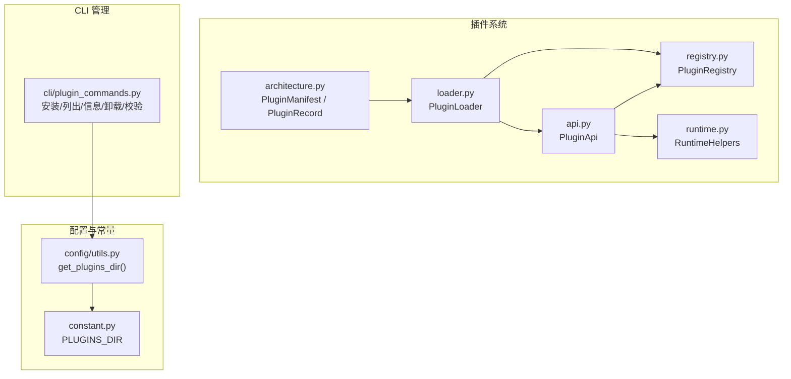
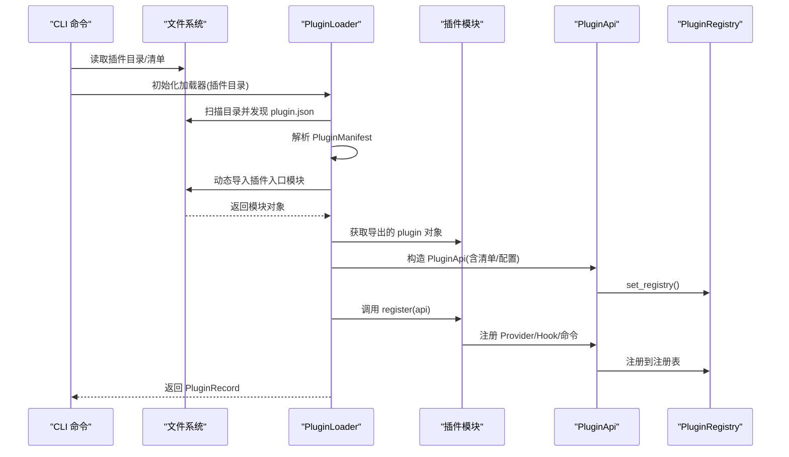
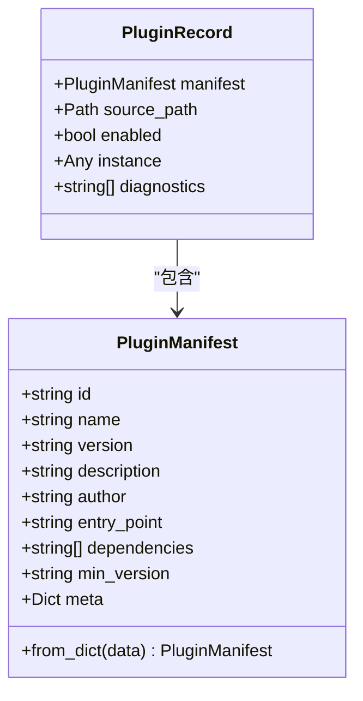
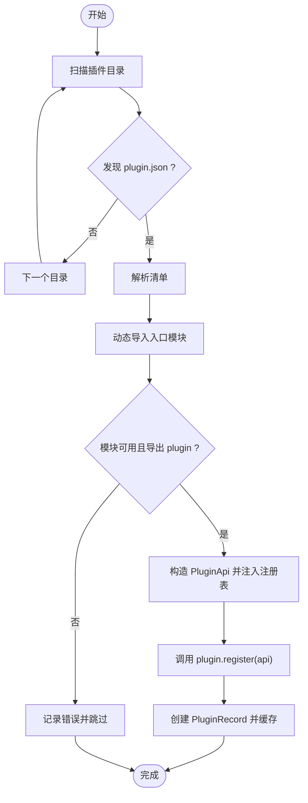
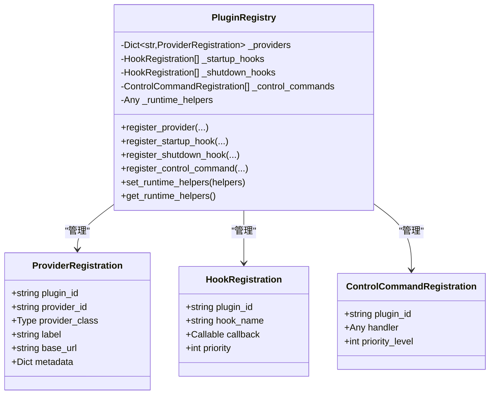
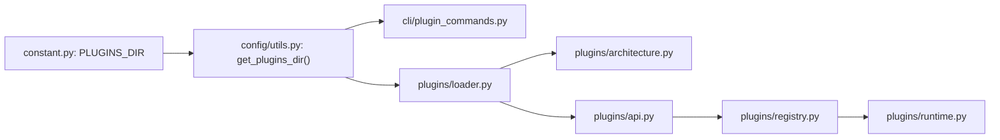

# 插件开发

<cite>
**本文引用的文件**
- [src/qwenpaw/plugins/__init__.py](file://src/qwenpaw/plugins/__init__.py)
- [src/qwenpaw/plugins/architecture.py](file://src/qwenpaw/plugins/architecture.py)
- [src/qwenpaw/plugins/loader.py](file://src/qwenpaw/plugins/loader.py)
- [src/qwenpaw/plugins/registry.py](file://src/qwenpaw/plugins/registry.py)
- [src/qwenpaw/plugins/api.py](file://src/qwenpaw/plugins/api.py)
- [src/qwenpaw/plugins/runtime.py](file://src/qwenpaw/plugins/runtime.py)
- [src/qwenpaw/cli/plugin_commands.py](file://src/qwenpaw/cli/plugin_commands.py)
- [src/qwenpaw/config/utils.py](file://src/qwenpaw/config/utils.py)
- [src/qwenpaw/constant.py](file://src/qwenpaw/constant.py)
- [website/public/docs/plugins.zh.md](file://website/public/docs/plugins.zh.md)
- [website/public/docs/plugins.en.md](file://website/public/docs/plugins.en.md)
</cite>

## 目录
1. [简介](#简介)
2. [项目结构](#项目结构)
3. [核心组件](#核心组件)
4. [架构总览](#架构总览)
5. [详细组件分析](#详细组件分析)
6. [依赖分析](#依赖分析)
7. [性能考虑](#性能考虑)
8. [故障排查指南](#故障排查指南)
9. [结论](#结论)
10. [附录](#附录)

## 简介
本指南面向希望为 QwenPaw 开发插件的开发者，系统讲解插件架构与实现细节，包括：
- 插件清单与记录的数据结构
- 插件加载器的动态导入与生命周期管理
- 插件注册表与发现、依赖解析
- 插件 API 的设计与使用
- 完整开发示例（从基础模板到复杂功能）
- 配置管理、版本兼容性与性能优化最佳实践

## 项目结构
QwenPaw 插件系统位于 src/qwenpaw/plugins 目录，围绕“清单-记录-加载-注册-运行时”五要素构建；CLI 提供插件安装、验证等管理能力；常量与配置模块提供插件目录与运行时环境。

图示来源
- [src/qwenpaw/plugins/architecture.py:9-55](file://src/qwenpaw/plugins/architecture.py#L9-L55)
- [src/qwenpaw/plugins/loader.py:19-241](file://src/qwenpaw/plugins/loader.py#L19-L241)
- [src/qwenpaw/plugins/registry.py:42-254](file://src/qwenpaw/plugins/registry.py#L42-L254)
- [src/qwenpaw/plugins/api.py:10-186](file://src/qwenpaw/plugins/api.py#L10-L186)
- [src/qwenpaw/plugins/runtime.py:10-68](file://src/qwenpaw/plugins/runtime.py#L10-L68)
- [src/qwenpaw/cli/plugin_commands.py:1-411](file://src/qwenpaw/cli/plugin_commands.py#L1-L411)
- [src/qwenpaw/config/utils.py:638-643](file://src/qwenpaw/config/utils.py#L638-L643)
- [src/qwenpaw/constant.py:190-191](file://src/qwenpaw/constant.py#L190-L191)

章节来源
- [src/qwenpaw/plugins/__init__.py:1-16](file://src/qwenpaw/plugins/__init__.py#L1-L16)
- [src/qwenpaw/plugins/architecture.py:1-55](file://src/qwenpaw/plugins/architecture.py#L1-L55)
- [src/qwenpaw/plugins/loader.py:1-241](file://src/qwenpaw/plugins/loader.py#L1-L241)
- [src/qwenpaw/plugins/registry.py:1-254](file://src/qwenpaw/plugins/registry.py#L1-L254)
- [src/qwenpaw/plugins/api.py:1-186](file://src/qwenpaw/plugins/api.py#L1-L186)
- [src/qwenpaw/plugins/runtime.py:1-68](file://src/qwenpaw/plugins/runtime.py#L1-L68)
- [src/qwenpaw/cli/plugin_commands.py:1-411](file://src/qwenpaw/cli/plugin_commands.py#L1-L411)
- [src/qwenpaw/config/utils.py:638-643](file://src/qwenpaw/config/utils.py#L638-L643)
- [src/qwenpaw/constant.py:190-191](file://src/qwenpaw/constant.py#L190-L191)

## 核心组件
- 插件清单与记录
  - PluginManifest：描述插件元数据与入口点
  - PluginRecord：记录已加载插件的状态与实例
- 插件加载器
  - PluginLoader：扫描目录、读取清单、动态导入、调用注册方法、收集记录
- 插件注册表
  - PluginRegistry：集中注册 Provider、Hook、控制命令，维护运行时助手
- 插件 API
  - PluginApi：插件向注册表注册能力的统一接口
- 运行时助手
  - RuntimeHelpers：提供 Provider 查询、日志等运行期能力

章节来源
- [src/qwenpaw/plugins/architecture.py:9-55](file://src/qwenpaw/plugins/architecture.py#L9-L55)
- [src/qwenpaw/plugins/loader.py:19-241](file://src/qwenpaw/plugins/loader.py#L19-L241)
- [src/qwenpaw/plugins/registry.py:42-254](file://src/qwenpaw/plugins/registry.py#L42-L254)
- [src/qwenpaw/plugins/api.py:10-186](file://src/qwenpaw/plugins/api.py#L10-L186)
- [src/qwenpaw/plugins/runtime.py:10-68](file://src/qwenpaw/plugins/runtime.py#L10-L68)

## 架构总览
下图展示了从 CLI 到插件加载、注册与运行的整体流程。

图示来源
- [src/qwenpaw/cli/plugin_commands.py:104-247](file://src/qwenpaw/cli/plugin_commands.py#L104-L247)
- [src/qwenpaw/plugins/loader.py:32-221](file://src/qwenpaw/plugins/loader.py#L32-L221)
- [src/qwenpaw/plugins/api.py:35-42](file://src/qwenpaw/plugins/api.py#L35-L42)
- [src/qwenpaw/plugins/registry.py:42-72](file://src/qwenpaw/plugins/registry.py#L42-L72)

## 详细组件分析

### 插件清单与记录：PluginManifest 与 PluginRecord
- PluginManifest 字段
  - id、name、version、description、author、entry_point、dependencies、min_version、meta
  - 提供 from_dict 工厂方法，便于从 JSON 构建
- PluginRecord 字段
  - manifest、source_path、enabled、instance、diagnostics
  - 记录加载后的插件实例与诊断信息

图示来源
- [src/qwenpaw/plugins/architecture.py:9-55](file://src/qwenpaw/plugins/architecture.py#L9-L55)

章节来源
- [src/qwenpaw/plugins/architecture.py:9-55](file://src/qwenpaw/plugins/architecture.py#L9-L55)

### 插件加载器：PluginLoader
- 发现机制
  - 遍历插件目录，查找每个子目录下的 plugin.json
  - 读取并解析为 PluginManifest
- 动态导入
  - 基于 entry_point 生成唯一模块名，使用 importlib.spec_from_file_location
  - 设置 __package__ 与 __path__ 以支持相对导入
  - 执行模块并获取导出的 plugin 对象
- 注册调用
  - 将 PluginApi 注入插件，调用其 register 方法（同步或异步）
- 错误处理
  - 对缺失清单、入口点、必需导出、注册失败等情况进行异常与日志记录
- 并发加载
  - 提供 load_all_plugins 并行加载多个插件

图示来源
- [src/qwenpaw/plugins/loader.py:32-221](file://src/qwenpaw/plugins/loader.py#L32-L221)

章节来源
- [src/qwenpaw/plugins/loader.py:19-241](file://src/qwenpaw/plugins/loader.py#L19-L241)

### 插件注册表：PluginRegistry
- Provider 注册
  - register_provider：防止重复注册，合并元数据
- Hook 注册
  - register_startup_hook / register_shutdown_hook：按优先级排序
- 控制命令注册
  - register_control_command：记录处理器与优先级
- 运行时助手
  - set_runtime_helpers / get_runtime_helpers：提供 Provider 管理器等运行期能力

图示来源
- [src/qwenpaw/plugins/registry.py:11-254](file://src/qwenpaw/plugins/registry.py#L11-L254)

章节来源
- [src/qwenpaw/plugins/registry.py:42-254](file://src/qwenpaw/plugins/registry.py#L42-L254)

### 插件 API：PluginApi
- 能力
  - register_provider：注册自定义 Provider
  - register_startup_hook / register_shutdown_hook：注册生命周期钩子（支持优先级）
  - register_control_command：注册控制命令处理器
  - runtime：访问运行时助手
- 设计要点
  - 通过 set_registry 注入注册表引用
  - 将插件清单与配置传递给运行时

章节来源
- [src/qwenpaw/plugins/api.py:10-186](file://src/qwenpaw/plugins/api.py#L10-L186)

### 运行时助手：RuntimeHelpers
- 能力
  - 获取 Provider、列举 Provider、日志记录
- 用途
  - 在 Hook 或其他运行期场景中访问 Provider 管理器

章节来源
- [src/qwenpaw/plugins/runtime.py:10-68](file://src/qwenpaw/plugins/runtime.py#L10-L68)

### CLI 插件管理：plugin_commands
- 功能
  - install：从本地路径或 URL 下载并安装插件，支持 requirements.txt 自动安装
  - list：列出已安装插件
  - info：查看插件详情（含依赖、元信息）
  - uninstall：卸载插件
  - validate：校验插件清单与入口点
- 安全与约束
  - 安装/卸载需在 QwenPaw 离线状态下执行
  - 下载时进行 Zip Slip 防护

章节来源
- [src/qwenpaw/cli/plugin_commands.py:1-411](file://src/qwenpaw/cli/plugin_commands.py#L1-L411)

## 依赖分析
- 插件目录来源
  - PLUGINS_DIR 来源于常量与配置工具，CLI 与加载器均依赖该目录
- 组件耦合
  - Loader 依赖 Architecture（清单）、API（注册接口）、Registry（注册中心）
  - Registry 作为单例，被 API 注入
  - RuntimeHelpers 由 Registry 持有并暴露给插件

图示来源
- [src/qwenpaw/constant.py:190-191](file://src/qwenpaw/constant.py#L190-L191)
- [src/qwenpaw/config/utils.py:638-643](file://src/qwenpaw/config/utils.py#L638-L643)
- [src/qwenpaw/cli/plugin_commands.py:104-247](file://src/qwenpaw/cli/plugin_commands.py#L104-L247)
- [src/qwenpaw/plugins/loader.py:22-29](file://src/qwenpaw/plugins/loader.py#L22-L29)
- [src/qwenpaw/plugins/architecture.py:9-55](file://src/qwenpaw/plugins/architecture.py#L9-L55)
- [src/qwenpaw/plugins/api.py:35-42](file://src/qwenpaw/plugins/api.py#L35-L42)
- [src/qwenpaw/plugins/registry.py:42-72](file://src/qwenpaw/plugins/registry.py#L42-L72)
- [src/qwenpaw/plugins/runtime.py:13-19](file://src/qwenpaw/plugins/runtime.py#L13-L19)

章节来源
- [src/qwenpaw/constant.py:190-191](file://src/qwenpaw/constant.py#L190-L191)
- [src/qwenpaw/config/utils.py:638-643](file://src/qwenpaw/config/utils.py#L638-L643)
- [src/qwenpaw/cli/plugin_commands.py:104-247](file://src/qwenpaw/cli/plugin_commands.py#L104-L247)
- [src/qwenpaw/plugins/loader.py:22-29](file://src/qwenpaw/plugins/loader.py#L22-L29)
- [src/qwenpaw/plugins/registry.py:42-72](file://src/qwenpaw/plugins/registry.py#L42-L72)

## 性能考虑
- 动态导入
  - 使用 importlib.spec_from_file_location 并设置 __path__ 以支持相对导入，避免污染全局 sys.path
- 并发加载
  - load_all_plugins 支持逐个插件异步等待，提升整体加载吞吐
- Hook 优先级
  - 启停钩子按优先级排序，避免不必要的阻塞
- 依赖安装
  - CLI 在安装时自动处理 requirements.txt，减少手动干预与失败重试成本

[本节为通用建议，无需具体文件引用]

## 故障排查指南
- 插件未加载
  - 使用 qwenpaw plugin list 检查安装状态
  - 使用 qwenpaw plugin info <id> 校验清单字段与入口点
  - 查看应用日志中插件加载与注册信息
- 依赖安装失败
  - 检查 requirements.txt 格式
  - 手动 pip 安装验证
  - 使用 --force 重新安装
- Provider 未显示
  - 确认插件已安装并重启应用
  - 检查 Web UI 的模型管理页面
- 命令未响应
  - 确认插件已安装
  - 检查启动钩子是否成功执行
  - 查看日志中的 patch 信息

章节来源
- [website/public/docs/plugins.zh.md:655-696](file://website/public/docs/plugins.zh.md#L655-L696)
- [website/public/docs/plugins.en.md:655-696](file://website/public/docs/plugins.en.md#L655-L696)

## 结论
QwenPaw 插件系统以清晰的数据结构与职责分离为核心，结合 CLI 管理与动态导入机制，提供了可扩展、可维护的插件生态。开发者可通过 PluginApi 注册 Provider、Hook 与控制命令，配合 RuntimeHelpers 与注册表实现复杂功能。遵循清单格式、优先级与安全实践，可获得稳定可靠的插件体验。

[本节为总结，无需具体文件引用]

## 附录

### 插件开发示例（从基础到复杂）

- 基础模板
  - 目录结构
    - plugin.json（必需）
    - plugin.py（必需）
    - README.md（推荐）
  - plugin.json 字段
    - id、name、version、description、author、entry_point、dependencies、min_version、meta
  - plugin.py
    - 导出类实例 plugin，实现 register(api) 方法
- 示例 1：添加自定义 Provider
  - 在 plugin.py 中加载 provider.py 并通过 api.register_provider 注册
  - 在 plugin.json 中声明依赖（如 httpx）
- 示例 2：添加启动钩子
  - 在 register 中通过 api.register_startup_hook 注册回调，设置优先级
- 示例 3：添加自定义命令
  - 通过启动钩子对 AgentRunner.query_handler 进行 monkey patch，将 /command 转换为提示词

章节来源
- [website/public/docs/plugins.zh.md:133-564](file://website/public/docs/plugins.zh.md#L133-L564)
- [website/public/docs/plugins.en.md:133-564](file://website/public/docs/plugins.en.md#L133-L564)

### 插件 API 参考
- register_provider
  - 参数：provider_id、provider_class、label、base_url、metadata
  - 作用：注册自定义 Provider
- register_startup_hook / register_shutdown_hook
  - 参数：hook_name、callback、priority
  - 作用：注册生命周期钩子（越低越早执行）
- register_control_command
  - 参数：handler、priority_level
  - 作用：注册控制命令处理器
- runtime
  - 属性：访问运行时助手（Provider 查询、日志等）

章节来源
- [src/qwenpaw/plugins/api.py:43-175](file://src/qwenpaw/plugins/api.py#L43-L175)
- [website/public/docs/plugins.zh.md:704-742](file://website/public/docs/plugins.zh.md#L704-L742)
- [website/public/docs/plugins.en.md:704-742](file://website/public/docs/plugins.en.md#L704-L742)

### 配置管理与版本兼容
- 插件目录
  - PLUGINS_DIR 由常量与配置工具共同决定，CLI 与加载器均基于此路径
- 版本兼容
  - 清单中的 min_version 字段可用于版本约束
- 依赖管理
  - requirements.txt 在安装时自动处理
- 安全
  - CLI 在安装/卸载时要求应用离线
  - 下载插件时进行 Zip Slip 防护

章节来源
- [src/qwenpaw/constant.py:190-191](file://src/qwenpaw/constant.py#L190-L191)
- [src/qwenpaw/config/utils.py:638-643](file://src/qwenpaw/config/utils.py#L638-L643)
- [src/qwenpaw/cli/plugin_commands.py:21-97](file://src/qwenpaw/cli/plugin_commands.py#L21-L97)
- [src/qwenpaw/plugins/architecture.py:18-21](file://src/qwenpaw/plugins/architecture.py#L18-L21)