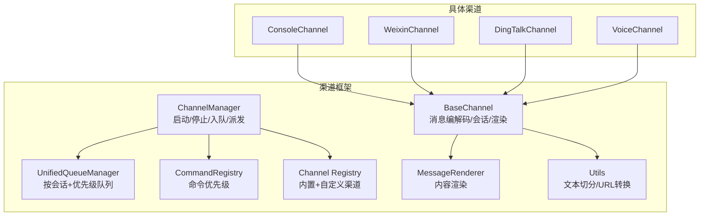
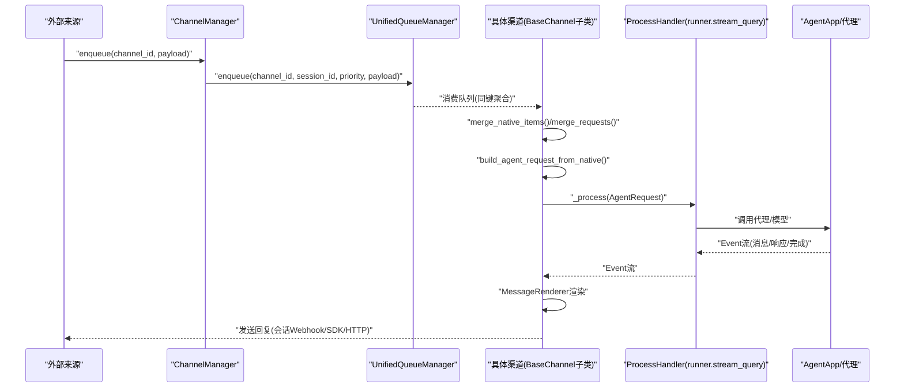
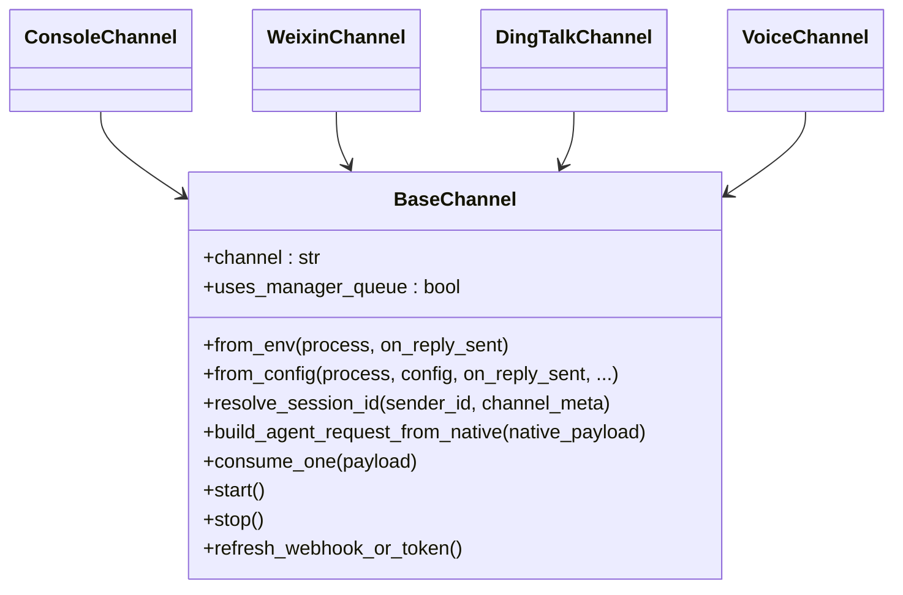
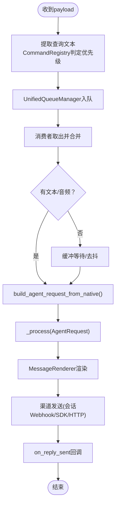
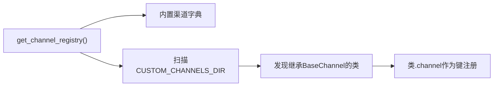
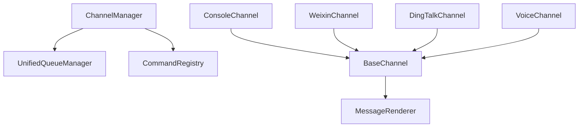

# 渠道适配器开发

<cite>
**本文档引用的文件**
- [src/qwenpaw/app/channels/base.py](file://src/qwenpaw/app/channels/base.py)
- [src/qwenpaw/app/channels/manager.py](file://src/qwenpaw/app/channels/manager.py)
- [src/qwenpaw/app/channels/command_registry.py](file://src/qwenpaw/app/channels/command_registry.py)
- [src/qwenpaw/app/channels/registry.py](file://src/qwenpaw/app/channels/registry.py)
- [src/qwenpaw/app/channels/schema.py](file://src/qwenpaw/app/channels/schema.py)
- [src/qwenpaw/app/channels/unified_queue_manager.py](file://src/qwenpaw/app/channels/unified_queue_manager.py)
- [src/qwenpaw/app/channels/renderer.py](file://src/qwenpaw/app/channels/renderer.py)
- [src/qwenpaw/app/channels/utils.py](file://src/qwenpaw/app/channels/utils.py)
- [src/qwenpaw/app/channels/console/channel.py](file://src/qwenpaw/app/channels/console/channel.py)
- [src/qwenpaw/app/channels/voice/channel.py](file://src/qwenpaw/app/channels/voice/channel.py)
- [src/qwenpaw/app/channels/weixin/channel.py](file://src/qwenpaw/app/channels/weixin/channel.py)
- [src/qwenpaw/app/channels/dingtalk/channel.py](file://src/qwenpaw/app/channels/dingtalk/channel.py)
</cite>

## 目录
1. [简介](#简介)
2. [项目结构](#项目结构)
3. [核心组件](#核心组件)
4. [架构总览](#架构总览)
5. [详细组件分析](#详细组件分析)
6. [依赖关系分析](#依赖关系分析)
7. [性能考虑](#性能考虑)
8. [故障排查指南](#故障排查指南)
9. [结论](#结论)
10. [附录](#附录)

## 简介
本指南面向希望在QwenPaw中开发新渠道适配器（Channel Adapter）的开发者，系统讲解BaseChannel基类设计与继承方法、消息处理流程、渠道注册体系、配置与认证、连接池与并发控制、以及与代理系统的集成与数据流转。文档同时提供即时通讯、语音通话、Webhook等类型渠道的开发范式与最佳实践，并给出测试、调试与性能优化建议。

## 项目结构
QwenPaw的渠道适配器位于src/qwenpaw/app/channels目录下，采用“基类 + 多子类 + 统一队列 + 注册表”的分层架构：
- 基类与通用能力：BaseChannel、统一队列、渲染器、工具函数
- 渠道注册表：内置渠道清单与自定义渠道发现
- 渠道管理器：统一调度、优先级队列、生命周期管理
- 典型渠道实现：Console、WeChat、DingTalk、Voice等

图示来源
- [src/qwenpaw/app/channels/base.py:70-127](file://src/qwenpaw/app/channels/base.py#L70-L127)
- [src/qwenpaw/app/channels/unified_queue_manager.py:60-117](file://src/qwenpaw/app/channels/unified_queue_manager.py#L60-L117)
- [src/qwenpaw/app/channels/command_registry.py:23-62](file://src/qwenpaw/app/channels/command_registry.py#L23-L62)
- [src/qwenpaw/app/channels/manager.py:68-106](file://src/qwenpaw/app/channels/manager.py#L68-L106)
- [src/qwenpaw/app/channels/registry.py:190-195](file://src/qwenpaw/app/channels/registry.py#L190-L195)
- [src/qwenpaw/app/channels/renderer.py:78-86](file://src/qwenpaw/app/channels/renderer.py#L78-L86)
- [src/qwenpaw/app/channels/utils.py:121-134](file://src/qwenpaw/app/channels/utils.py#L121-L134)

章节来源
- [src/qwenpaw/app/channels/base.py:70-127](file://src/qwenpaw/app/channels/base.py#L70-L127)
- [src/qwenpaw/app/channels/manager.py:68-106](file://src/qwenpaw/app/channels/manager.py#L68-L106)
- [src/qwenpaw/app/channels/registry.py:190-195](file://src/qwenpaw/app/channels/registry.py#L190-L195)

## 核心组件
- BaseChannel：所有渠道的抽象基类，负责消息到AgentRequest的构建、会话ID解析、渲染样式、时间去抖、控制命令检测、事件流发送、生命周期钩子等。
- UnifiedQueueManager：基于三元键（渠道、会话、优先级）的动态队列与消费者模型，支持自动清理空闲队列。
- CommandRegistry：命令前缀到优先级等级的映射，用于区分控制命令与普通消息。
- ChannelManager：统一注入process处理器、设置工作区、建立队列、启动/停止各渠道实例。
- MessageRenderer：将Agent消息转换为渠道可发送的内容块（文本/图片/音频/视频/文件/拒绝），并支持过滤与样式控制。
- 渠道注册表：内置渠道清单与自定义渠道扫描，支持插件式扩展。

章节来源
- [src/qwenpaw/app/channels/base.py:70-127](file://src/qwenpaw/app/channels/base.py#L70-L127)
- [src/qwenpaw/app/channels/unified_queue_manager.py:60-117](file://src/qwenpaw/app/channels/unified_queue_manager.py#L60-L117)
- [src/qwenpaw/app/channels/command_registry.py:23-62](file://src/qwenpaw/app/channels/command_registry.py#L23-L62)
- [src/qwenpaw/app/channels/manager.py:68-106](file://src/qwenpaw/app/channels/manager.py#L68-L106)
- [src/qwenpaw/app/channels/renderer.py:78-86](file://src/qwenpaw/app/channels/renderer.py#L78-L86)
- [src/qwenpaw/app/channels/registry.py:190-195](file://src/qwenpaw/app/channels/registry.py#L190-L195)

## 架构总览
下图展示从消息进入、命令识别、队列合并、请求构建、代理处理到渠道回复的完整链路。

图示来源
- [src/qwenpaw/app/channels/manager.py:39-65](file://src/qwenpaw/app/channels/manager.py#L39-L65)
- [src/qwenpaw/app/channels/unified_queue_manager.py:119-163](file://src/qwenpaw/app/channels/unified_queue_manager.py#L119-L163)
- [src/qwenpaw/app/channels/base.py:619-630](file://src/qwenpaw/app/channels/base.py#L619-L630)
- [src/qwenpaw/app/channels/base.py:446-535](file://src/qwenpaw/app/channels/base.py#L446-L535)

章节来源
- [src/qwenpaw/app/channels/manager.py:39-65](file://src/qwenpaw/app/channels/manager.py#L39-L65)
- [src/qwenpaw/app/channels/unified_queue_manager.py:119-163](file://src/qwenpaw/app/channels/unified_queue_manager.py#L119-L163)
- [src/qwenpaw/app/channels/base.py:619-630](file://src/qwenpaw/app/channels/base.py#L619-L630)

## 详细组件分析

### BaseChannel 设计与继承
- 抽象方法与约定
  - 必须实现：from_env/from_config工厂方法；build_agent_request_from_native原生消息转AgentRequest；consume_one或stream_one（后者更常见）。
  - 可选覆盖：resolve_session_id、merge_native_items、merge_requests、get_to_handle_from_request、get_on_reply_sent_args、_before_consume_process、_on_consume_error、_on_process_completed等。
- 属性与行为
  - uses_manager_queue：是否由ChannelManager统一入队与消费。
  - debounce机制：对无文本内容进行缓冲合并，避免碎片化输入。
  - 渲染与样式：通过MessageRenderer与RenderStyle控制工具消息、思考内容、媒体块的呈现。
  - 安全策略：允许白名单、群聊/私聊策略、@提及策略、拒绝文案。
  - 工作区注入：set_workspace注入任务跟踪与聊天管理器，支持取消与追踪。
- 生命周期
  - start/stop：通道启动/停止；部分长连接通道（如Voice）禁用统一队列。
  - refresh_webhook_or_token：可选刷新凭证或Webhook地址。

图示来源
- [src/qwenpaw/app/channels/base.py:70-127](file://src/qwenpaw/app/channels/base.py#L70-L127)
- [src/qwenpaw/app/channels/console/channel.py:63-75](file://src/qwenpaw/app/channels/console/channel.py#L63-L75)
- [src/qwenpaw/app/channels/weixin/channel.py:60-68](file://src/qwenpaw/app/channels/weixin/channel.py#L60-L68)
- [src/qwenpaw/app/channels/dingtalk/channel.py:112-126](file://src/qwenpaw/app/channels/dingtalk/channel.py#L112-L126)
- [src/qwenpaw/app/channels/voice/channel.py:17-26](file://src/qwenpaw/app/channels/voice/channel.py#L17-L26)

章节来源
- [src/qwenpaw/app/channels/base.py:70-127](file://src/qwenpaw/app/channels/base.py#L70-L127)
- [src/qwenpaw/app/channels/console/channel.py:63-75](file://src/qwenpaw/app/channels/console/channel.py#L63-L75)
- [src/qwenpaw/app/channels/weixin/channel.py:60-68](file://src/qwenpaw/app/channels/weixin/channel.py#L60-L68)
- [src/qwenpaw/app/channels/dingtalk/channel.py:112-126](file://src/qwenpaw/app/channels/dingtalk/channel.py#L112-L126)
- [src/qwenpaw/app/channels/voice/channel.py:17-26](file://src/qwenpaw/app/channels/voice/channel.py#L17-L26)

### 消息处理流程
- 接收与入队
  - ChannelManager根据CommandRegistry提取查询文本，计算优先级，使用UnifiedQueueManager按（渠道、会话、优先级）入队。
- 合并与去抖
  - 对同一会话的多个原生消息进行合并（merge_native_items/merge_requests），对无文本消息进行时间去抖（debounce）。
- 请求构建与执行
  - 将原生payload转为AgentRequest，调用ProcessHandler（runner.stream_query）执行，逐条产出Event。
- 渲染与发送
  - 使用MessageRenderer将消息内容转为渠道可发送的块，按渠道特性选择Webhook/卡片/HTTP等方式发送。
- 回调与追踪
  - on_reply_sent回调携带（渠道、目标、会话）参数；TaskTracker支持取消与追踪。

图示来源
- [src/qwenpaw/app/channels/manager.py:280-297](file://src/qwenpaw/app/channels/manager.py#L280-L297)
- [src/qwenpaw/app/channels/unified_queue_manager.py:119-163](file://src/qwenpaw/app/channels/unified_queue_manager.py#L119-L163)
- [src/qwenpaw/app/channels/base.py:619-630](file://src/qwenpaw/app/channels/base.py#L619-L630)
- [src/qwenpaw/app/channels/base.py:659-695](file://src/qwenpaw/app/channels/base.py#L659-L695)
- [src/qwenpaw/app/channels/base.py:446-535](file://src/qwenpaw/app/channels/base.py#L446-L535)

章节来源
- [src/qwenpaw/app/channels/manager.py:280-297](file://src/qwenpaw/app/channels/manager.py#L280-L297)
- [src/qwenpaw/app/channels/unified_queue_manager.py:119-163](file://src/qwenpaw/app/channels/unified_queue_manager.py#L119-L163)
- [src/qwenpaw/app/channels/base.py:619-630](file://src/qwenpaw/app/channels/base.py#L619-L630)
- [src/qwenpaw/app/channels/base.py:659-695](file://src/qwenpaw/app/channels/base.py#L659-L695)
- [src/qwenpaw/app/channels/base.py:446-535](file://src/qwenpaw/app/channels/base.py#L446-L535)

### 渠道注册系统
- 内置渠道清单：imessage、discord、dingtalk、feishu、qq、telegram、mattermost、mqtt、console、matrix、voice、wecom、xiaoyi、weixin、onebot。
- 自定义渠道：扫描CUSTOM_CHANNELS_DIR，导入模块并查找继承BaseChannel的类，注册其channel键。
- 路由钩子：支持自定义渠道在FastAPI上挂载/api前缀路由，避免被SPA捕获。

图示来源
- [src/qwenpaw/app/channels/registry.py:20-78](file://src/qwenpaw/app/channels/registry.py#L20-L78)
- [src/qwenpaw/app/channels/registry.py:97-129](file://src/qwenpaw/app/channels/registry.py#L97-L129)
- [src/qwenpaw/app/channels/registry.py:135-188](file://src/qwenpaw/app/channels/registry.py#L135-L188)

章节来源
- [src/qwenpaw/app/channels/registry.py:20-78](file://src/qwenpaw/app/channels/registry.py#L20-L78)
- [src/qwenpaw/app/channels/registry.py:97-129](file://src/qwenpaw/app/channels/registry.py#L97-L129)
- [src/qwenpaw/app/channels/registry.py:135-188](file://src/qwenpaw/app/channels/registry.py#L135-L188)

### 不同类型渠道适配器开发范式
- 即时通讯渠道（如WeChat）
  - 长轮询/短轮询接收消息，解析多类型内容（文本/图片/语音/文件），去重与上下文令牌缓存，支持主动发送（心跳/定时任务）。
  - 会话ID：私聊weixin:<user_id>，群聊weixin:group:<group_id>。
  - 示例参考：WeixinChannel的_getupdates循环、_on_message解析、媒体下载与去重逻辑。

- 语音渠道（如Voice）
  - 长连接WebSocket/ConversationRelay，不使用统一队列（uses_manager_queue=False），需要自行维护会话与令牌。
  - 示例参考：VoiceChannel的start/stop、会话管理、Webhook令牌生成与校验。

- Webhook渠道（如DingTalk）
  - 通过会话Webhook或卡片能力进行多消息发送，支持早期ACK以降低重试风暴，存储会话Webhook以便后续主动推送。
  - 示例参考：DingTalkChannel的_session_webhook_store、_ack_early、_reply_sync/_reply_sync_batch。

- 控制台渠道（Console）
  - 轻量输出通道，将Agent输出打印到终端，支持媒体路径解析与前端推送。

章节来源
- [src/qwenpaw/app/channels/weixin/channel.py:416-486](file://src/qwenpaw/app/channels/weixin/channel.py#L416-L486)
- [src/qwenpaw/app/channels/weixin/channel.py:491-764](file://src/qwenpaw/app/channels/weixin/channel.py#L491-L764)
- [src/qwenpaw/app/channels/voice/channel.py:17-26](file://src/qwenpaw/app/channels/voice/channel.py#L17-L26)
- [src/qwenpaw/app/channels/voice/channel.py:81-157](file://src/qwenpaw/app/channels/voice/channel.py#L81-L157)
- [src/qwenpaw/app/channels/dingtalk/channel.py:307-317](file://src/qwenpaw/app/channels/dingtalk/channel.py#L307-L317)
- [src/qwenpaw/app/channels/dingtalk/channel.py:353-378](file://src/qwenpaw/app/channels/dingtalk/channel.py#L353-L378)
- [src/qwenpaw/app/channels/dingtalk/channel.py:626-711](file://src/qwenpaw/app/channels/dingtalk/channel.py#L626-L711)
- [src/qwenpaw/app/channels/dingtalk/channel.py:766-800](file://src/qwenpaw/app/channels/dingtalk/channel.py#L766-L800)
- [src/qwenpaw/app/channels/console/channel.py:445-448](file://src/qwenpaw/app/channels/console/channel.py#L445-L448)

### 渠道配置管理、认证机制与连接池
- 配置来源
  - from_env：从环境变量加载渠道参数（如WEIXIN_*、DINGTALK_*、CONSOLE_*）。
  - from_config：从配置对象（含Pydantic模型或字典）加载，支持过滤工具消息、显示工具详情、过滤思考内容等。
- 认证与凭证
  - WeChat：支持bot_token直连或二维码登录持久化；上下文令牌缓存用于主动发送。
  - DingTalk：OAuth/OpenAPI客户端、机器人/卡片SDK、会话Webhook有效期管理。
  - Voice：Twilio账号与电话号码配置，Cloudflare隧道暴露本地端口。
- 连接池与并发
  - UnifiedQueueManager按（渠道、会话、优先级）隔离队列，自动清理空闲队列，避免固定worker池带来的资源浪费。
  - 渠道内部可使用aiohttp等异步HTTP客户端，注意超时与错误重试策略。

章节来源
- [src/qwenpaw/app/channels/weixin/channel.py:148-201](file://src/qwenpaw/app/channels/weixin/channel.py#L148-L201)
- [src/qwenpaw/app/channels/dingtalk/channel.py:229-301](file://src/qwenpaw/app/channels/dingtalk/channel.py#L229-L301)
- [src/qwenpaw/app/channels/voice/channel.py:53-79](file://src/qwenpaw/app/channels/voice/channel.py#L53-L79)
- [src/qwenpaw/app/channels/unified_queue_manager.py:274-428](file://src/qwenpaw/app/channels/unified_queue_manager.py#L274-L428)

### 与代理系统的集成与数据流转
- ProcessHandler
  - 由make_process_from_runner将runner.stream_query包装为ProcessHandler注入ChannelManager/Channel。
- 事件流
  - BaseChannel._stream_with_tracker将Agent事件序列化为SSE格式，逐条yield，便于前端实时展示。
- 主动发送
  - ChannelManager.send_text/send_event支持定时任务/心跳触发的主动消息，统一走渠道的send_content_parts/send接口。

章节来源
- [src/qwenpaw/app/channels/utils.py:121-134](file://src/qwenpaw/app/channels/utils.py#L121-L134)
- [src/qwenpaw/app/channels/base.py:446-535](file://src/qwenpaw/app/channels/base.py#L446-L535)
- [src/qwenpaw/app/channels/manager.py:630-710](file://src/qwenpaw/app/channels/manager.py#L630-L710)

## 依赖关系分析
- 组件耦合
  - ChannelManager依赖CommandRegistry与UnifiedQueueManager；BaseChannel依赖MessageRenderer与配置工具。
  - 具体渠道仅依赖BaseChannel与自身SDK/HTTP客户端，低耦合高内聚。
- 关键依赖链
  - ChannelManager → UnifiedQueueManager（队列与消费者）
  - ChannelManager → CommandRegistry（命令优先级）
  - BaseChannel → MessageRenderer（内容渲染）
  - 渠道实现 → SDK/HTTP客户端（第三方服务）

图示来源
- [src/qwenpaw/app/channels/manager.py:68-106](file://src/qwenpaw/app/channels/manager.py#L68-L106)
- [src/qwenpaw/app/channels/unified_queue_manager.py:60-117](file://src/qwenpaw/app/channels/unified_queue_manager.py#L60-L117)
- [src/qwenpaw/app/channels/command_registry.py:23-62](file://src/qwenpaw/app/channels/command_registry.py#L23-L62)
- [src/qwenpaw/app/channels/renderer.py:78-86](file://src/qwenpaw/app/channels/renderer.py#L78-L86)
- [src/qwenpaw/app/channels/base.py:70-127](file://src/qwenpaw/app/channels/base.py#L70-L127)

章节来源
- [src/qwenpaw/app/channels/manager.py:68-106](file://src/qwenpaw/app/channels/manager.py#L68-L106)
- [src/qwenpaw/app/channels/unified_queue_manager.py:60-117](file://src/qwenpaw/app/channels/unified_queue_manager.py#L60-L117)
- [src/qwenpaw/app/channels/command_registry.py:23-62](file://src/qwenpaw/app/channels/command_registry.py#L23-L62)
- [src/qwenpaw/app/channels/renderer.py:78-86](file://src/qwenpaw/app/channels/renderer.py#L78-L86)
- [src/qwenpaw/app/channels/base.py:70-127](file://src/qwenpaw/app/channels/base.py#L70-L127)

## 性能考虑
- 队列与并发
  - 使用UnifiedQueueManager按会话+优先级隔离，避免全局锁竞争；空闲队列自动清理，降低内存占用。
  - 合理设置队列最大长度与超时，防止阻塞导致的堆积。
- 去抖与合并
  - 对无文本消息进行时间去抖，减少碎片化输入；对同一会话批量消息进行合并，降低下游压力。
- 渲染与传输
  - 使用MessageRenderer统一渲染，避免重复格式化；对大文本进行切分（split_text），控制单次发送大小。
- 异步与超时
  - 渠道内部使用异步HTTP客户端，设置合理超时与重试；对第三方SDK调用进行异常捕获与降级。
- 资源释放
  - 在stop中关闭会话、取消任务、释放连接；对Cloudflare隧道、Twilio webhook等外部资源进行显式清理。

章节来源
- [src/qwenpaw/app/channels/unified_queue_manager.py:274-428](file://src/qwenpaw/app/channels/unified_queue_manager.py#L274-L428)
- [src/qwenpaw/app/channels/base.py:659-695](file://src/qwenpaw/app/channels/base.py#L659-L695)
- [src/qwenpaw/app/channels/renderer.py:352-384](file://src/qwenpaw/app/channels/renderer.py#L352-L384)
- [src/qwenpaw/app/channels/utils.py:18-76](file://src/qwenpaw/app/channels/utils.py#L18-L76)
- [src/qwenpaw/app/channels/voice/channel.py:138-157](file://src/qwenpaw/app/channels/voice/channel.py#L138-L157)

## 故障排查指南
- 命令识别与优先级
  - 检查CommandRegistry是否正确注册命令前缀与优先级；确认查询文本大小写与空白字符处理。
- 队列堆积与卡顿
  - 查看UnifiedQueueManager指标（队列总数、每个队列的积压与处理计数）；检查是否有长时间空闲队列未清理。
- 渲染异常
  - 检查MessageRenderer的样式配置（过滤工具消息、过滤思考内容、媒体类型支持）；确认内容块类型与URL解析。
- 第三方SDK错误
  - WeChat/DingTalk/Twilio等SDK调用失败时，查看日志中的状态码与错误信息；必要时刷新token或重新配置Webhook。
- 会话Webhook失效
  - DingTalk会话Webhook存在过期时间，需在发送失败后清除并重新保存；或改用Open API进行主动推送。

章节来源
- [src/qwenpaw/app/channels/command_registry.py:136-218](file://src/qwenpaw/app/channels/command_registry.py#L136-L218)
- [src/qwenpaw/app/channels/unified_queue_manager.py:430-471](file://src/qwenpaw/app/channels/unified_queue_manager.py#L430-L471)
- [src/qwenpaw/app/channels/renderer.py:78-86](file://src/qwenpaw/app/channels/renderer.py#L78-L86)
- [src/qwenpaw/app/channels/weixin/channel.py:371-411](file://src/qwenpaw/app/channels/weixin/channel.py#L371-L411)
- [src/qwenpaw/app/channels/dingtalk/channel.py:488-513](file://src/qwenpaw/app/channels/dingtalk/channel.py#L488-L513)

## 结论
QwenPaw的渠道适配器体系以BaseChannel为核心，结合CommandRegistry与UnifiedQueueManager实现了高扩展、高可靠的消息处理流水线。通过清晰的生命周期管理、严格的会话隔离与去抖合并策略，以及灵活的渲染与发送机制，开发者可以快速实现多种渠道的适配与集成。建议在新渠道开发中遵循本文档的范式，充分利用注册表、队列与渲染器能力，并关注性能与稳定性。

## 附录
- 开发步骤建议
  - 明确channel键与会话ID规则（resolve_session_id）
  - 实现from_env/from_config工厂方法与build_agent_request_from_native
  - 如需统一队列，保持uses_manager_queue为True；否则自行管理长连接与并发
  - 使用MessageRenderer统一渲染，确保媒体与文本兼容
  - 在ChannelManager.set_workspace后接入任务跟踪与聊天管理
- 测试与调试
  - 使用单元测试覆盖命令识别、会话合并、渲染逻辑与错误分支
  - 通过ChannelManager.metrics与UnifiedQueueManager.metrics观察运行状态
  - 对第三方SDK调用增加超时与重试，记录关键日志以便回溯