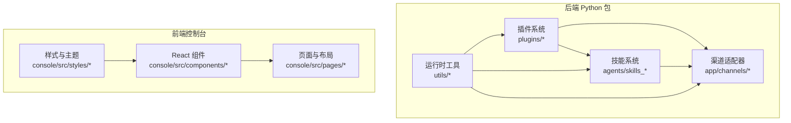
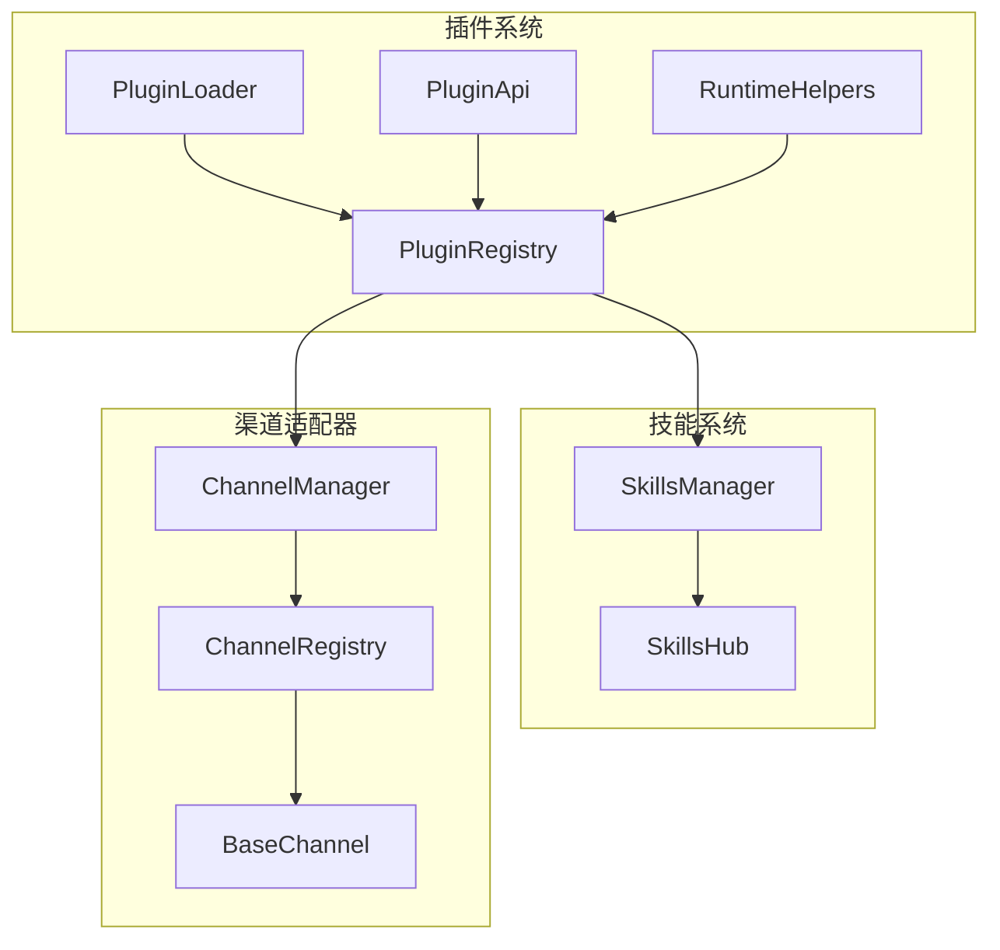
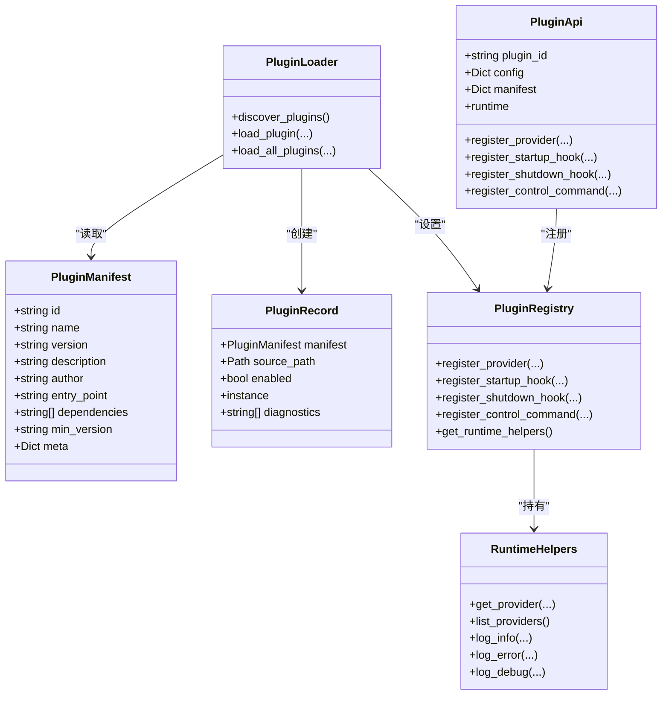
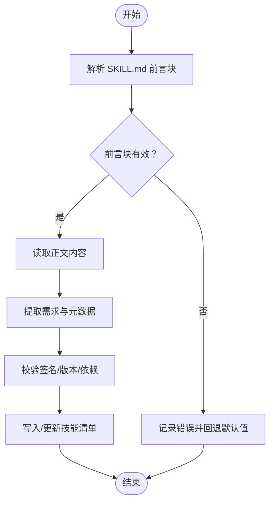
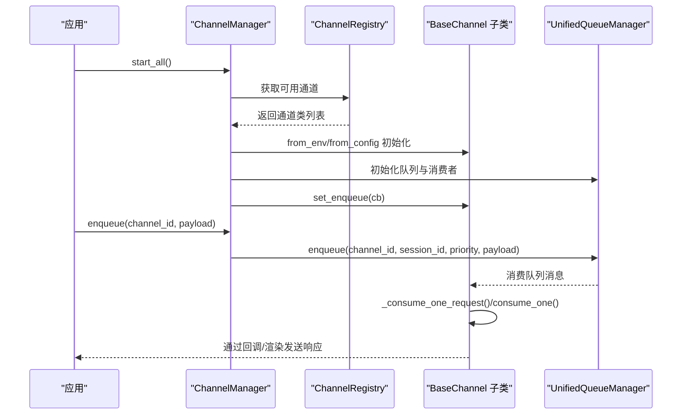
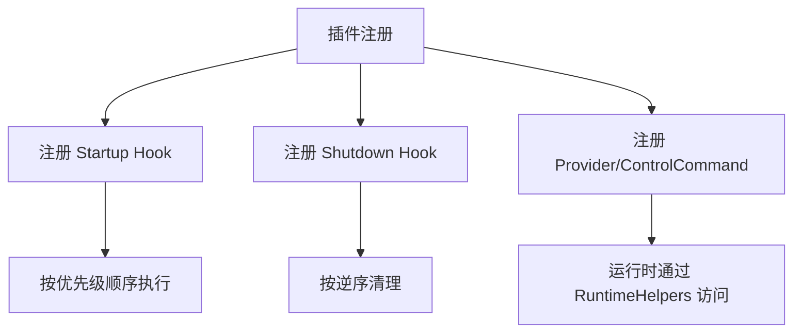
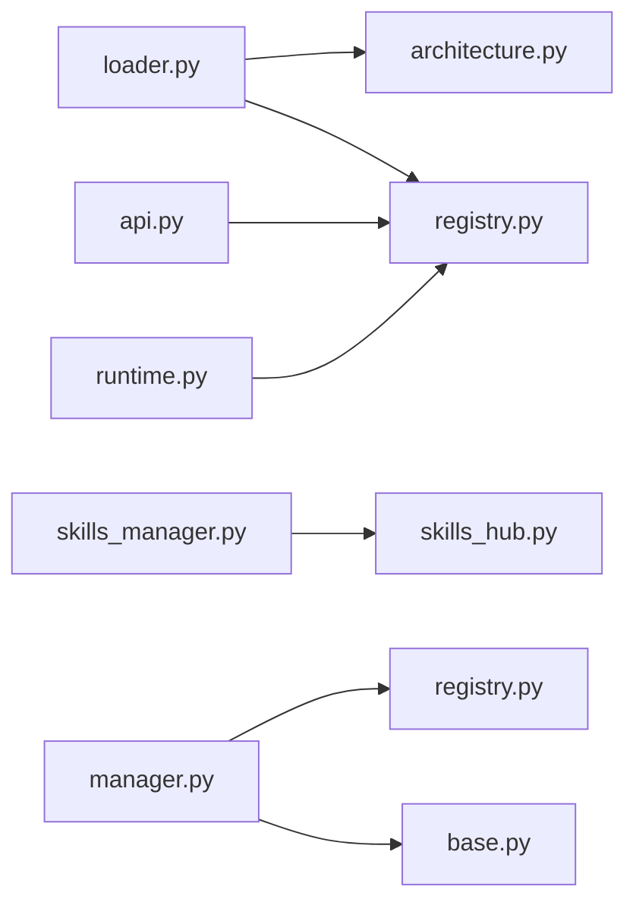

# 自定义开发

<cite>
**本文引用的文件**
- [plugins/architecture.py](file://src/qwenpaw/plugins/architecture.py)
- [plugins/registry.py](file://src/qwenpaw/plugins/registry.py)
- [plugins/loader.py](file://src/qwenpaw/plugins/loader.py)
- [plugins/runtime.py](file://src/qwenpaw/plugins/runtime.py)
- [plugins/api.py](file://src/qwenpaw/plugins/api.py)
- [skills_hub.py](file://src/qwenpaw/agents/skills_hub.py)
- [skills_manager.py](file://src/qwenpaw/agents/skills_manager.py)
- [base.py](file://src/qwenpaw/app/channels/base.py)
- [manager.py](file://src/qwenpaw/app/channels/manager.py)
- [registry.py](file://src/qwenpaw/app/channels/registry.py)
- [SKILL.md 示例（QA_source_index）](file://src/qwenpaw/agents/skills/QA_source_index/SKILL.md)
- [SKILL.md 示例（guidance）](file://src/qwenpaw/agents/skills/guidance/SKILL.md)
- [SKILL.md 示例（docx）](file://src/qwenpaw/agents/skills/docx/SKILL.md)
</cite>

## 目录
1. [简介](#简介)
2. [项目结构](#项目结构)
3. [核心组件](#核心组件)
4. [架构总览](#架构总览)
5. [详细组件分析](#详细组件分析)
6. [依赖分析](#依赖分析)
7. [性能考虑](#性能考虑)
8. [故障排查指南](#故障排查指南)
9. [结论](#结论)
10. [附录](#附录)

## 简介
本指南面向希望在 QwenPaw 平台上进行“自定义开发”的工程师与高级用户，覆盖四大主题：
- 插件开发：插件架构、接口规范与实现步骤
- 新技能编写：技能目录结构、SKILL.md 编写规范与最佳实践
- 渠道适配器开发：BaseChannel 基类继承、消息处理流程与注册机制
- 自定义 UI 组件：React 组件开发、样式规范与状态管理
- 扩展点识别与利用：钩子系统、事件机制与依赖注入
- 测试与调试：开发、集成与运行期调试方法

本指南以代码为依据，配合图示与流程，帮助读者快速落地。

## 项目结构
QwenPaw 的自定义开发涉及后端 Python 包与前端 React 控制台两大层面：
- 后端 Python 包（src/qwenpaw）：提供插件系统、技能管理、渠道适配器、运行时工具等能力
- 前端控制台（console/src）：提供 UI 组件、页面与国际化资源

[此图为概念性结构示意，不直接映射具体文件，故不附“图表来源”]

## 核心组件
- 插件系统：通过 Manifest 与 Loader 动态加载插件，通过 API 注册 Provider、Hook、ControlCommand，并由 Registry 统一管理
- 技能系统：通过 SKILL.md 前言块声明元数据，统一解析与校验，支持从 Hub 导入与本地工作区同步
- 渠道适配器：统一抽象 BaseChannel，ChannelManager 负责队列与消费，注册表负责发现与加载
- 运行时工具：提供日志、Provider 查询、环境变量注入等辅助能力

**章节来源**
- [plugins/architecture.py:1-55](file://src/qwenpaw/plugins/architecture.py#L1-L55)
- [plugins/registry.py:1-254](file://src/qwenpaw/plugins/registry.py#L1-L254)
- [plugins/loader.py:1-241](file://src/qwenpaw/plugins/loader.py#L1-L241)
- [plugins/runtime.py:1-68](file://src/qwenpaw/plugins/runtime.py#L1-L68)
- [skills_manager.py:1-800](file://src/qwenpaw/agents/skills_manager.py#L1-L800)
- [base.py:1-800](file://src/qwenpaw/app/channels/base.py#L1-L800)
- [manager.py:1-711](file://src/qwenpaw/app/channels/manager.py#L1-L711)
- [registry.py:1-195](file://src/qwenpaw/app/channels/registry.py#L1-L195)

## 架构总览
下图展示插件系统、技能系统与渠道适配器之间的交互关系，以及它们如何被运行时工具所支撑。

**图表来源**
- [plugins/loader.py:19-241](file://src/qwenpaw/plugins/loader.py#L19-L241)
- [plugins/registry.py:42-254](file://src/qwenpaw/plugins/registry.py#L42-L254)
- [plugins/api.py:10-186](file://src/qwenpaw/plugins/api.py#L10-L186)
- [plugins/runtime.py:10-68](file://src/qwenpaw/plugins/runtime.py#L10-L68)
- [skills_manager.py:1-800](file://src/qwenpaw/agents/skills_manager.py#L1-L800)
- [skills_hub.py:1-800](file://src/qwenpaw/agents/skills_hub.py#L1-L800)
- [manager.py:68-711](file://src/qwenpaw/app/channels/manager.py#L68-L711)
- [registry.py:190-195](file://src/qwenpaw/app/channels/registry.py#L190-L195)
- [base.py:70-800](file://src/qwenpaw/app/channels/base.py#L70-L800)

## 详细组件分析

### 插件开发指南
- 插件架构
  - Manifest：描述插件标识、版本、入口、依赖等
  - Record：记录已加载插件实例与诊断信息
- 插件加载
  - Loader 发现目录中的 plugin.json，动态导入入口模块，调用 plugin.register(api)，并注册到 PluginRegistry
- 插件 API
  - PluginApi 提供注册 Provider、Startup/Shutdown Hook、Control Command 的接口
- 注册中心
  - PluginRegistry 统一存储 Provider、Hook、ControlCommand，并按优先级排序
- 运行时助手
  - RuntimeHelpers 提供 Provider 查询、日志等便捷方法

**图表来源**
- [plugins/architecture.py:9-55](file://src/qwenpaw/plugins/architecture.py#L9-L55)
- [plugins/api.py:10-186](file://src/qwenpaw/plugins/api.py#L10-L186)
- [plugins/registry.py:42-254](file://src/qwenpaw/plugins/registry.py#L42-L254)
- [plugins/loader.py:19-241](file://src/qwenpaw/plugins/loader.py#L19-L241)
- [plugins/runtime.py:10-68](file://src/qwenpaw/plugins/runtime.py#L10-L68)

实现步骤（建议）
- 准备目录结构：在插件根目录放置 plugin.json（包含 id、name、version、entry_point 等字段）
- 实现入口模块：导出 plugin 对象，提供 register(api) 方法
- 在 register 中：
  - 使用 api.register_provider(...) 注册自定义 Provider
  - 使用 api.register_startup_hook(...) 注册启动钩子
  - 使用 api.register_shutdown_hook(...) 注册关闭钩子
  - 使用 api.register_control_command(...) 注册控制命令处理器
- 启动后，PluginLoader 将自动发现并加载你的插件

**章节来源**
- [plugins/architecture.py:9-55](file://src/qwenpaw/plugins/architecture.py#L9-L55)
- [plugins/loader.py:84-198](file://src/qwenpaw/plugins/loader.py#L84-L198)
- [plugins/api.py:43-175](file://src/qwenpaw/plugins/api.py#L43-L175)
- [plugins/registry.py:73-253](file://src/qwenpaw/plugins/registry.py#L73-L253)
- [plugins/runtime.py:21-67](file://src/qwenpaw/plugins/runtime.py#L21-L67)

### 新技能编写指南
- 目录结构
  - 每个技能位于独立目录，根目录包含 SKILL.md
  - 可选：references/ 与 scripts/ 子目录存放引用与脚本
- SKILL.md 规范
  - 前言块（YAML）必需字段：name、description
  - metadata 可选：builtin_skill_version、qwenpaw.emoji、qwenpaw.requires 等
  - 正文：清晰的使用步骤、注意事项与输出质量要求
- 示例参考
  - QA_source_index：主题映射与文档定位
  - guidance：安装与配置问答流程
  - docx：复杂文档操作与依赖清单

**图表来源**
- [skills_manager.py:207-247](file://src/qwenpaw/agents/skills_manager.py#L207-L247)
- [skills_manager.py:720-749](file://src/qwenpaw/agents/skills_manager.py#L720-L749)
- [skills_hub.py:642-702](file://src/qwenpaw/agents/skills_hub.py#L642-L702)

最佳实践
- 前言块必须包含 name 与 description，便于 UI 展示与检索
- 使用 metadata.qwenpaw.emoji 为技能添加表情符号，提升可读性
- 在 metadata.qwenpaw.requires 中声明外部依赖（如二进制、环境变量），便于运行期检测
- 正文采用“步骤化 + 注意事项”的结构，确保可复现与可维护

**章节来源**
- [SKILL.md 示例（QA_source_index）:1-51](file://src/qwenpaw/agents/skills/QA_source_index/SKILL.md#L1-L51)
- [SKILL.md 示例（guidance）:1-138](file://src/qwenpaw/agents/skills/guidance/SKILL.md#L1-L138)
- [SKILL.md 示例（docx）:1-488](file://src/qwenpaw/agents/skills/docx/SKILL.md#L1-L488)
- [skills_manager.py:543-571](file://src/qwenpaw/agents/skills_manager.py#L543-L571)
- [skills_manager.py:720-749](file://src/qwenpaw/agents/skills_manager.py#L720-L749)

### 渠道适配器开发指南
- 继承 BaseChannel
  - 必须实现：from_env/from_config、build_agent_request_from_native、consume_one（或 _consume_one_request）
  - 可选：resolve_session_id、get_to_handle_from_request、send_content_parts/send_event 等
- ChannelManager
  - 负责统一队列与消费者循环，按优先级合并批量消息
  - 支持替换通道、清理队列、发送文本事件
- 注册机制
  - 内置通道通过注册表发现；自定义通道可放入 CUSTOM_CHANNELS_DIR，由注册表扫描加载
  - 可选：模块级 register_app_routes(app) 注册 HTTP 路由（需以 /api/ 开头）

**图表来源**
- [manager.py:68-711](file://src/qwenpaw/app/channels/manager.py#L68-L711)
- [registry.py:190-195](file://src/qwenpaw/app/channels/registry.py#L190-L195)
- [base.py:70-800](file://src/qwenpaw/app/channels/base.py#L70-L800)

实现步骤（建议）
- 在自定义通道目录中创建模块，导出继承 BaseChannel 的类
- 实现 from_env/from_config，完成配置解析与初始化
- 实现 build_agent_request_from_native，将平台原生消息转换为 AgentRequest
- 实现 send_content_parts/send_event，将响应内容渲染并发送
- 如需 HTTP 路由，提供 register_app_routes(app) 并确保路由以 /api/ 开头
- 在配置中启用该通道，或通过环境变量控制可用通道集合

**章节来源**
- [base.py:538-658](file://src/qwenpaw/app/channels/base.py#L538-L658)
- [base.py:604-631](file://src/qwenpaw/app/channels/base.py#L604-L631)
- [base.py:659-800](file://src/qwenpaw/app/channels/base.py#L659-L800)
- [manager.py:86-213](file://src/qwenpaw/app/channels/manager.py#L86-L213)
- [registry.py:97-130](file://src/qwenpaw/app/channels/registry.py#L97-L130)
- [registry.py:135-188](file://src/qwenpaw/app/channels/registry.py#L135-L188)

### 自定义 UI 组件开发指南
- 组件组织
  - 页面与布局：console/src/pages、console/src/layouts
  - 通用组件：console/src/components
  - 样式与主题：console/src/styles
- 开发要点
  - 使用 TypeScript/React，遵循现有组件风格
  - 样式采用 CSS Modules（.module.less）隔离作用域
  - 状态管理：优先使用 React Hooks；跨页面共享状态可通过 Context 或集中式 Store
  - 国际化：使用 console/src/locales 与 i18n 工具
- 与后端集成
  - 通过 console/src/api 发起请求，遵循现有模块划分
  - 对接后端路由与权限控制，注意鉴权头与错误处理

[本节为通用指导，不直接分析具体文件，故不附“章节来源”]

### 扩展点识别与利用指南
- 钩子系统
  - Startup/Shutdown Hook：通过 PluginApi.register_startup_hook/register_shutdown_hook 注册，按优先级执行
- 事件机制
  - ChannelManager 使用 UnifiedQueueManager 对消息进行批处理与优先级调度
- 依赖注入
  - RuntimeHelpers 提供 Provider 查询与日志能力，PluginApi.runtime 即可访问
  - 技能配置通过环境变量注入，apply_skill_config_env_overrides 在一次对话中生效

**图表来源**
- [plugins/api.py:89-151](file://src/qwenpaw/plugins/api.py#L89-L151)
- [plugins/registry.py:149-221](file://src/qwenpaw/plugins/registry.py#L149-L221)
- [plugins/runtime.py:21-67](file://src/qwenpaw/plugins/runtime.py#L21-L67)
- [skills_manager.py:673-718](file://src/qwenpaw/agents/skills_manager.py#L673-L718)

**章节来源**
- [plugins/api.py:89-175](file://src/qwenpaw/plugins/api.py#L89-L175)
- [plugins/registry.py:149-253](file://src/qwenpaw/plugins/registry.py#L149-L253)
- [plugins/runtime.py:21-67](file://src/qwenpaw/plugins/runtime.py#L21-L67)
- [skills_manager.py:673-718](file://src/qwenpaw/agents/skills_manager.py#L673-L718)

### 测试与调试方法
- 插件测试
  - 单元测试：针对 PluginApi、PluginRegistry、PluginLoader 的行为进行断言
  - 集成测试：模拟 plugin.json 与入口模块，验证加载与注册流程
- 技能测试
  - 使用 SKILL.md 前言块与正文解析逻辑，构造边界用例（空 name、非法字符、缺失依赖）
  - Hub 导入流程：模拟网络请求、缓存与错误重试
- 渠道适配器测试
  - Mock ChannelManager 与 UnifiedQueueManager，验证消息合并、去抖与优先级
  - 单元测试覆盖 from_env/from_config、build_agent_request_from_native、send_* 方法
- 调试技巧
  - 启用后端日志（RuntimeHelpers.log_*），观察加载、注册、处理链路
  - 前端控制台开启开发者工具，检查 API 请求与状态变化

[本节为通用指导，不直接分析具体文件，故不附“章节来源”]

## 依赖分析
- 插件系统内部依赖
  - Loader 依赖 Architecture 与 Registry；API 依赖 Registry；RuntimeHelpers 由 Registry 持有
- 技能系统依赖
  - SkillsManager 依赖 frontmatter、安全扫描与文件处理工具
  - SkillsHub 依赖 HTTP 请求、缓存与错误处理
- 渠道适配器依赖
  - ChannelManager 依赖 ChannelRegistry、UnifiedQueueManager
  - BaseChannel 依赖渲染器与配置加载

**图表来源**
- [plugins/loader.py:12-29](file://src/qwenpaw/plugins/loader.py#L12-L29)
- [plugins/registry.py:42-71](file://src/qwenpaw/plugins/registry.py#L42-L71)
- [plugins/api.py:35-41](file://src/qwenpaw/plugins/api.py#L35-L41)
- [plugins/runtime.py:13-19](file://src/qwenpaw/plugins/runtime.py#L13-L19)
- [skills_manager.py:23-33](file://src/qwenpaw/agents/skills_manager.py#L23-L33)
- [skills_hub.py:22-35](file://src/qwenpaw/agents/skills_hub.py#L22-L35)
- [manager.py:21-25](file://src/qwenpaw/app/channels/manager.py#L21-L25)
- [registry.py:12-13](file://src/qwenpaw/app/channels/registry.py#L12-L13)
- [base.py:36-38](file://src/qwenpaw/app/channels/base.py#L36-L38)

**章节来源**
- [plugins/loader.py:12-29](file://src/qwenpaw/plugins/loader.py#L12-L29)
- [plugins/registry.py:42-71](file://src/qwenpaw/plugins/registry.py#L42-L71)
- [plugins/api.py:35-41](file://src/qwenpaw/plugins/api.py#L35-L41)
- [plugins/runtime.py:13-19](file://src/qwenpaw/plugins/runtime.py#L13-L19)
- [skills_manager.py:23-33](file://src/qwenpaw/agents/skills_manager.py#L23-L33)
- [skills_hub.py:22-35](file://src/qwenpaw/agents/skills_hub.py#L22-L35)
- [manager.py:21-25](file://src/qwenpaw/app/channels/manager.py#L21-L25)
- [registry.py:12-13](file://src/qwenpaw/app/channels/registry.py#L12-L13)
- [base.py:36-38](file://src/qwenpaw/app/channels/base.py#L36-L38)

## 性能考虑
- 插件加载
  - 使用动态导入与模块缓存，避免重复加载
  - Manifest 校验与异常捕获，防止单个插件失败影响整体
- 技能管理
  - 使用签名与缓存避免重复计算；ZIP 导入限制大小与路径安全性
  - 前言块解析与正文提取分离，降低 IO 成本
- 渠道适配器
  - 去抖与批量合并减少下游压力；优先级队列保障关键任务及时处理

[本节为通用指导，不直接分析具体文件，故不附“章节来源”]

## 故障排查指南
- 插件相关
  - 插件未加载：检查 plugin.json 字段、入口模块是否导出 plugin 对象、register 是否返回异步结果
  - 注册冲突：Provider/ControlCommand 名称冲突时，查看注册中心日志与错误提示
- 技能相关
  - SKILL.md 解析失败：检查前言块 YAML 语法与必需字段
  - Hub 导入失败：关注 HTTP 错误码、速率限制与超时重试策略
- 渠道相关
  - 消息未送达：检查 ChannelManager 队列状态、去抖与合并逻辑
  - 权限与白名单：确认 allowlist 与群聊/私聊策略

**章节来源**
- [plugins/loader.py:118-197](file://src/qwenpaw/plugins/loader.py#L118-L197)
- [plugins/registry.py:95-112](file://src/qwenpaw/plugins/registry.py#L95-L112)
- [skills_hub.py:316-403](file://src/qwenpaw/agents/skills_hub.py#L316-L403)
- [base.py:283-305](file://src/qwenpaw/app/channels/base.py#L283-L305)
- [manager.py:302-348](file://src/qwenpaw/app/channels/manager.py#L302-L348)

## 结论
通过插件系统、技能系统与渠道适配器的协同，QwenPaw 为自定义扩展提供了清晰的边界与强大的扩展点。遵循本文的架构与实现步骤，即可高效地完成插件、技能与渠道的定制开发，并借助统一的运行时工具与测试方法保障质量与稳定性。

## 附录
- 代码模板与示例路径
  - 插件入口与注册：[plugins/api.py:43-175](file://src/qwenpaw/plugins/api.py#L43-L175)
  - 插件加载流程：[plugins/loader.py:84-198](file://src/qwenpaw/plugins/loader.py#L84-L198)
  - 技能前言块解析：[skills_manager.py:207-247](file://src/qwenpaw/agents/skills_manager.py#L207-L247)
  - 渠道适配器基类：[base.py:70-800](file://src/qwenpaw/app/channels/base.py#L70-L800)
  - 渠道注册表：[registry.py:190-195](file://src/qwenpaw/app/channels/registry.py#L190-L195)
  - 渠道管理器：[manager.py:68-711](file://src/qwenpaw/app/channels/manager.py#L68-L711)
  - 技能 Hub 导入：[skills_hub.py:642-702](file://src/qwenpaw/agents/skills_hub.py#L642-L702)