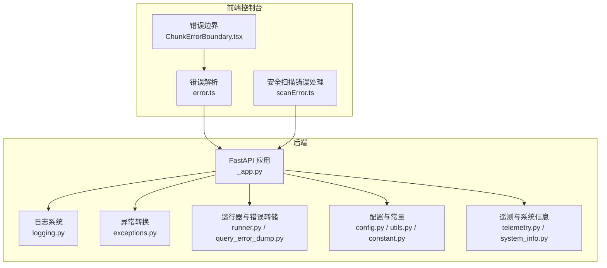
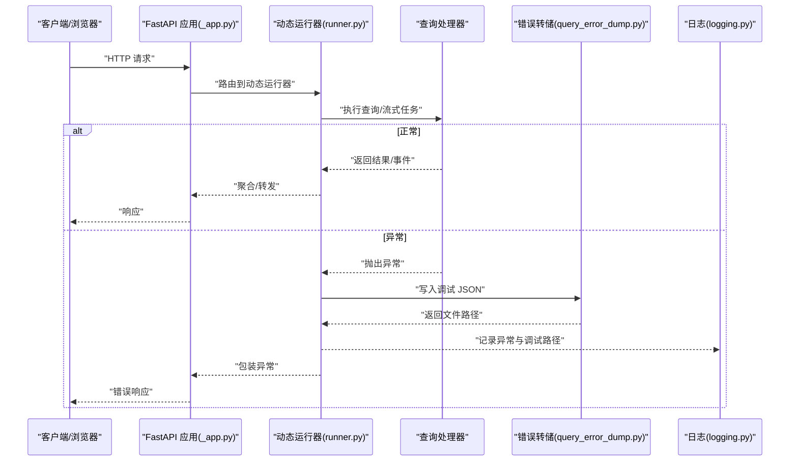
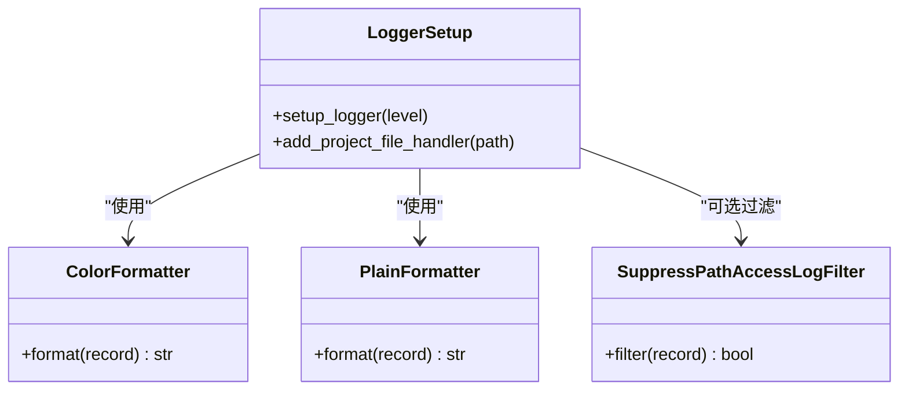
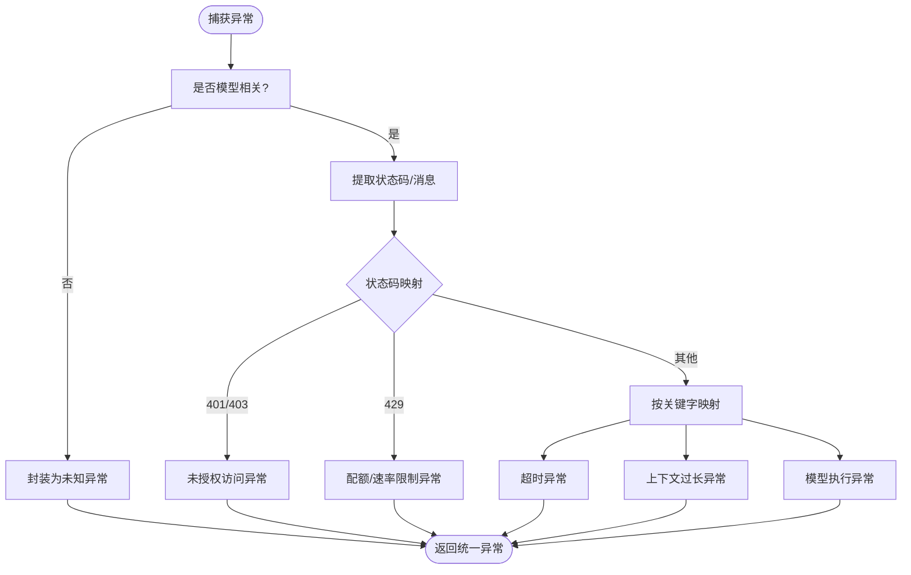
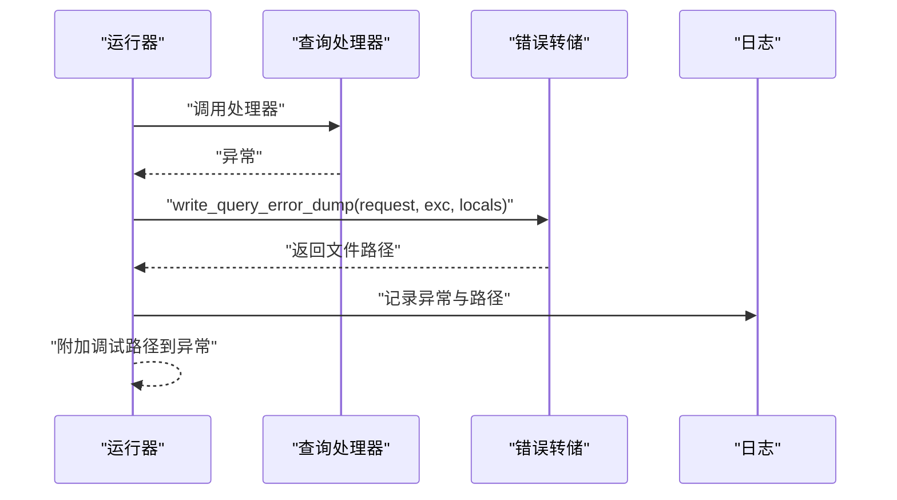
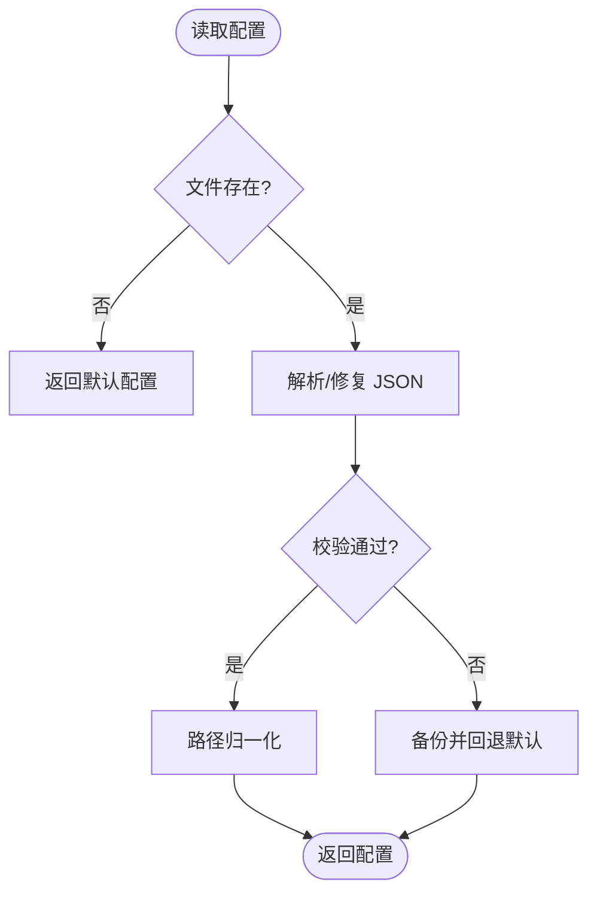
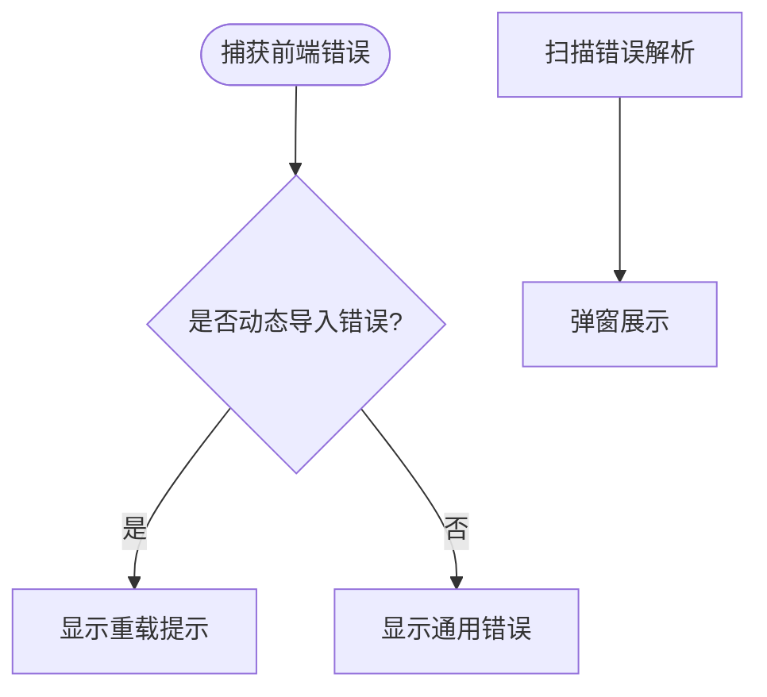
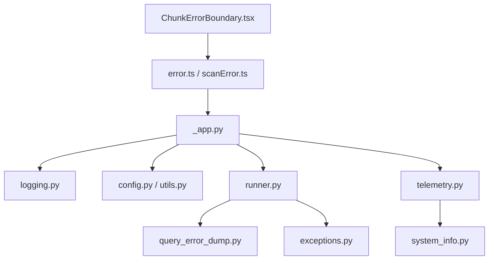

# 调试与故障排除

<cite>
**本文引用的文件**
- [src/qwenpaw/utils/logging.py](file://src/qwenpaw/utils/logging.py)
- [src/qwenpaw/exceptions.py](file://src/qwenpaw/exceptions.py)
- [src/qwenpaw/app/_app.py](file://src/qwenpaw/app/_app.py)
- [src/qwenpaw/app/runner/query_error_dump.py](file://src/qwenpaw/app/runner/query_error_dump.py)
- [src/qwenpaw/app/runner/runner.py](file://src/qwenpaw/app/runner/runner.py)
- [src/qwenpaw/utils/telemetry.py](file://src/qwenpaw/utils/telemetry.py)
- [src/qwenpaw/utils/system_info.py](file://src/qwenpaw/utils/system_info.py)
- [src/qwenpaw/constant.py](file://src/qwenpaw/constant.py)
- [src/qwenpaw/config/utils.py](file://src/qwenpaw/config/utils.py)
- [src/qwenpaw/config/config.py](file://src/qwenpaw/config/config.py)
- [src/qwenpaw/cli/main.py](file://src/qwenpaw/cli/main.py)
- [console/src/utils/error.ts](file://console/src/utils/error.ts)
- [console/src/utils/scanError.ts](file://console/src/utils/scanError.ts)
- [console/src/components/ChunkErrorBoundary.tsx](file://console/src/components/ChunkErrorBoundary.tsx)
</cite>

## 目录
1. [简介](#简介)
2. [项目结构](#项目结构)
3. [核心组件](#核心组件)
4. [架构总览](#架构总览)
5. [详细组件分析](#详细组件分析)
6. [依赖分析](#依赖分析)
7. [性能考虑](#性能考虑)
8. [故障排除指南](#故障排除指南)
9. [结论](#结论)
10. [附录](#附录)

## 简介
本指南面向开发者与运维人员，系统化梳理 QwenPaw 的调试与故障排除方法，覆盖开发环境调试技巧、日志系统使用与配置、性能分析与优化、常见问题诊断与解决、错误处理机制与异常捕获策略、可观测性（指标与告警）以及工具推荐与最佳实践。文档以仓库源码为依据，结合前端控制台与后端服务的实现细节，帮助快速定位与解决问题。

## 项目结构
QwenPaw 采用前后端分离架构：后端基于 FastAPI 提供 API 与多智能体运行器；前端控制台通过 React 构建，负责配置管理、会话与可观测性展示。调试相关的关键模块分布如下：
- 后端核心：日志、异常转换、应用生命周期、运行器、配置加载、常量与环境变量、遥测与系统信息采集
- 前端控制台：错误边界、错误解析与扫描错误弹窗、UI 错误提示

图表来源
- [src/qwenpaw/app/_app.py:1-569](file://src/qwenpaw/app/_app.py#L1-L569)
- [src/qwenpaw/utils/logging.py:1-202](file://src/qwenpaw/utils/logging.py#L1-L202)
- [src/qwenpaw/exceptions.py:1-254](file://src/qwenpaw/exceptions.py#L1-L254)
- [src/qwenpaw/app/runner/runner.py:559-594](file://src/qwenpaw/app/runner/runner.py#L559-L594)
- [src/qwenpaw/app/runner/query_error_dump.py:1-105](file://src/qwenpaw/app/runner/query_error_dump.py#L1-L105)
- [src/qwenpaw/config/config.py:1-800](file://src/qwenpaw/config/config.py#L1-L800)
- [src/qwenpaw/config/utils.py:1-673](file://src/qwenpaw/config/utils.py#L1-L673)
- [src/qwenpaw/constant.py:1-307](file://src/qwenpaw/constant.py#L1-L307)
- [src/qwenpaw/utils/telemetry.py:1-305](file://src/qwenpaw/utils/telemetry.py#L1-L305)
- [src/qwenpaw/utils/system_info.py:1-229](file://src/qwenpaw/utils/system_info.py#L1-L229)
- [console/src/components/ChunkErrorBoundary.tsx:1-85](file://console/src/components/ChunkErrorBoundary.tsx#L1-L85)
- [console/src/utils/error.ts:1-12](file://console/src/utils/error.ts#L1-L12)
- [console/src/utils/scanError.ts:1-173](file://console/src/utils/scanError.ts#L1-L173)

章节来源
- [src/qwenpaw/app/_app.py:1-569](file://src/qwenpaw/app/_app.py#L1-L569)
- [src/qwenpaw/utils/logging.py:1-202](file://src/qwenpaw/utils/logging.py#L1-L202)
- [src/qwenpaw/exceptions.py:1-254](file://src/qwenpaw/exceptions.py#L1-L254)
- [src/qwenpaw/app/runner/runner.py:559-594](file://src/qwenpaw/app/runner/runner.py#L559-L594)
- [src/qwenpaw/app/runner/query_error_dump.py:1-105](file://src/qwenpaw/app/runner/query_error_dump.py#L1-L105)
- [src/qwenpaw/config/config.py:1-800](file://src/qwenpaw/config/config.py#L1-L800)
- [src/qwenpaw/config/utils.py:1-673](file://src/qwenpaw/config/utils.py#L1-L673)
- [src/qwenpaw/constant.py:1-307](file://src/qwenpaw/constant.py#L1-L307)
- [src/qwenpaw/utils/telemetry.py:1-305](file://src/qwenpaw/utils/telemetry.py#L1-L305)
- [src/qwenpaw/utils/system_info.py:1-229](file://src/qwenpaw/utils/system_info.py#L1-L229)
- [console/src/components/ChunkErrorBoundary.tsx:1-85](file://console/src/components/ChunkErrorBoundary.tsx#L1-L85)
- [console/src/utils/error.ts:1-12](file://console/src/utils/error.ts#L1-L12)
- [console/src/utils/scanError.ts:1-173](file://console/src/utils/scanError.ts#L1-L173)

## 核心组件
- 日志系统：统一输出格式、彩色终端、文件轮转、访问日志过滤、命名空间隔离
- 异常体系：业务异常与模型异常转换，便于统一上报与客户端展示
- 运行器与错误转储：在查询处理器异常时生成调试 JSON，包含请求、异常、代理状态等
- 配置与常量：工作目录、日志级别、并发与限流、通道与插件开关、容器检测
- 遥测与系统信息：安装方式、系统版本、架构、GPU 检测、上传与标记
- 前端错误边界与解析：动态导入失败检测、扫描错误弹窗、错误详情提取

章节来源
- [src/qwenpaw/utils/logging.py:1-202](file://src/qwenpaw/utils/logging.py#L1-L202)
- [src/qwenpaw/exceptions.py:1-254](file://src/qwenpaw/exceptions.py#L1-L254)
- [src/qwenpaw/app/runner/runner.py:559-594](file://src/qwenpaw/app/runner/runner.py#L559-L594)
- [src/qwenpaw/app/runner/query_error_dump.py:1-105](file://src/qwenpaw/app/runner/query_error_dump.py#L1-L105)
- [src/qwenpaw/constant.py:1-307](file://src/qwenpaw/constant.py#L1-L307)
- [src/qwenpaw/config/utils.py:1-673](file://src/qwenpaw/config/utils.py#L1-L673)
- [src/qwenpaw/utils/telemetry.py:1-305](file://src/qwenpaw/utils/telemetry.py#L1-L305)
- [src/qwenpaw/utils/system_info.py:1-229](file://src/qwenpaw/utils/system_info.py#L1-L229)
- [console/src/components/ChunkErrorBoundary.tsx:1-85](file://console/src/components/ChunkErrorBoundary.tsx#L1-L85)
- [console/src/utils/error.ts:1-12](file://console/src/utils/error.ts#L1-L12)
- [console/src/utils/scanError.ts:1-173](file://console/src/utils/scanError.ts#L1-L173)

## 架构总览
下图展示了从请求到响应的关键路径，以及调试与可观测性贯穿其中的节点。

图表来源
- [src/qwenpaw/app/_app.py:1-569](file://src/qwenpaw/app/_app.py#L1-L569)
- [src/qwenpaw/app/runner/runner.py:559-594](file://src/qwenpaw/app/runner/runner.py#L559-L594)
- [src/qwenpaw/app/runner/query_error_dump.py:1-105](file://src/qwenpaw/app/runner/query_error_dump.py#L1-L105)
- [src/qwenpaw/utils/logging.py:1-202](file://src/qwenpaw/utils/logging.py#L1-L202)

## 详细组件分析

### 日志系统与配置
- 彩色终端输出：根据是否为终端自动启用 ANSI 颜色，避免管道重定向时的乱码
- 文件输出：按平台选择 FileHandler 或 RotatingFileHandler，支持路径去绝对化与重复添加防护
- 访问日志过滤：可按路径子串抑制 uvicorn 访问日志，降低噪音
- 命名空间隔离：仅输出项目命名空间的日志，避免第三方库干扰
- 日志级别映射：字符串到数值映射，支持命令行与环境变量控制

图表来源
- [src/qwenpaw/utils/logging.py:51-202](file://src/qwenpaw/utils/logging.py#L51-L202)

章节来源
- [src/qwenpaw/utils/logging.py:1-202](file://src/qwenpaw/utils/logging.py#L1-L202)
- [src/qwenpaw/constant.py:159-160](file://src/qwenpaw/constant.py#L159-L160)

### 异常体系与转换
- 业务异常：提供 ProviderError、ModelFormatterError、SystemCommandException、ChannelError、AgentStateError、SkillsError 等
- 模型异常转换：根据状态码与消息关键字，将第三方模型异常转换为统一的运行时异常类型，保留原始异常信息
- 客户端错误解析：前端从错误消息中解析 JSON 详情，用于 UI 展示

图表来源
- [src/qwenpaw/exceptions.py:107-254](file://src/qwenpaw/exceptions.py#L107-L254)
- [console/src/utils/error.ts:1-12](file://console/src/utils/error.ts#L1-L12)

章节来源
- [src/qwenpaw/exceptions.py:1-254](file://src/qwenpaw/exceptions.py#L1-L254)
- [console/src/utils/error.ts:1-12](file://console/src/utils/error.ts#L1-L12)

### 运行器与错误转储
- 查询处理器异常时，生成包含请求、异常、代理状态、时间戳的 JSON 转储文件，并在异常对象上附加调试路径
- 运行器对动态代理进行调试输出，便于定位会话与代理状态

图表来源
- [src/qwenpaw/app/runner/runner.py:559-594](file://src/qwenpaw/app/runner/runner.py#L559-L594)
- [src/qwenpaw/app/runner/query_error_dump.py:48-105](file://src/qwenpaw/app/runner/query_error_dump.py#L48-L105)

章节来源
- [src/qwenpaw/app/runner/runner.py:559-594](file://src/qwenpaw/app/runner/runner.py#L559-L594)
- [src/qwenpaw/app/runner/query_error_dump.py:1-105](file://src/qwenpaw/app/runner/query_error_dump.py#L1-L105)

### 配置与常量
- 工作目录与路径：支持旧版路径迁移、跨平台媒体目录、插件与本地模型目录
- 日志级别与文档开关：通过环境变量控制
- LLM 并发与限流：最大并发、每分钟请求数、退避参数、获取信号量超时
- 通道与插件：容器内运行检测、可用通道枚举、Playwright 浏览器路径探测
- 配置读取：自动修复 JSON、字段回退、备份损坏配置

图表来源
- [src/qwenpaw/config/utils.py:491-531](file://src/qwenpaw/config/utils.py#L491-L531)
- [src/qwenpaw/constant.py:89-121](file://src/qwenpaw/constant.py#L89-L121)

章节来源
- [src/qwenpaw/constant.py:1-307](file://src/qwenpaw/constant.py#L1-L307)
- [src/qwenpaw/config/utils.py:1-673](file://src/qwenpaw/config/utils.py#L1-L673)
- [src/qwenpaw/config/config.py:1-800](file://src/qwenpaw/config/config.py#L1-L800)

### 遥测与系统信息
- 遥测：安装方式检测、系统信息采集、上传与标记文件管理
- 系统信息：操作系统、架构、CUDA 版本、内存与显存大小检测

图表来源
- [src/qwenpaw/utils/system_info.py:111-121](file://src/qwenpaw/utils/system_info.py#L111-L121)
- [src/qwenpaw/utils/telemetry.py:286-305](file://src/qwenpaw/utils/telemetry.py#L286-L305)

章节来源
- [src/qwenpaw/utils/telemetry.py:1-305](file://src/qwenpaw/utils/telemetry.py#L1-L305)
- [src/qwenpaw/utils/system_info.py:1-229](file://src/qwenpaw/utils/system_info.py#L1-L229)

### 前端错误边界与扫描错误
- 动态导入失败检测与友好提示，支持自动重载
- 扫描错误弹窗：渲染发现列表、警告与错误模态框
- 错误详情解析：从错误消息中提取 JSON 详情

图表来源
- [console/src/components/ChunkErrorBoundary.tsx:17-28](file://console/src/components/ChunkErrorBoundary.tsx#L17-L28)
- [console/src/utils/scanError.ts:11-27](file://console/src/utils/scanError.ts#L11-L27)
- [console/src/utils/error.ts:1-12](file://console/src/utils/error.ts#L1-L12)

章节来源
- [console/src/components/ChunkErrorBoundary.tsx:1-85](file://console/src/components/ChunkErrorBoundary.tsx#L1-L85)
- [console/src/utils/scanError.ts:1-173](file://console/src/utils/scanError.ts#L1-L173)
- [console/src/utils/error.ts:1-12](file://console/src/utils/error.ts#L1-L12)

## 依赖分析
- 后端模块耦合：应用生命周期依赖日志、配置、运行器；运行器依赖异常转换与转储；遥测与系统信息独立但被应用生命周期调用
- 前端与后端交互：前端通过 API 获取配置、环境变量、扫描结果；错误边界与扫描错误处理提升用户体验

图表来源
- [src/qwenpaw/app/_app.py:1-569](file://src/qwenpaw/app/_app.py#L1-L569)
- [src/qwenpaw/utils/logging.py:1-202](file://src/qwenpaw/utils/logging.py#L1-L202)
- [src/qwenpaw/config/config.py:1-800](file://src/qwenpaw/config/config.py#L1-L800)
- [src/qwenpaw/config/utils.py:1-673](file://src/qwenpaw/config/utils.py#L1-L673)
- [src/qwenpaw/app/runner/runner.py:559-594](file://src/qwenpaw/app/runner/runner.py#L559-L594)
- [src/qwenpaw/app/runner/query_error_dump.py:1-105](file://src/qwenpaw/app/runner/query_error_dump.py#L1-L105)
- [src/qwenpaw/exceptions.py:1-254](file://src/qwenpaw/exceptions.py#L1-L254)
- [src/qwenpaw/utils/telemetry.py:1-305](file://src/qwenpaw/utils/telemetry.py#L1-L305)
- [src/qwenpaw/utils/system_info.py:1-229](file://src/qwenpaw/utils/system_info.py#L1-L229)
- [console/src/utils/error.ts:1-12](file://console/src/utils/error.ts#L1-L12)
- [console/src/utils/scanError.ts:1-173](file://console/src/utils/scanError.ts#L1-L173)
- [console/src/components/ChunkErrorBoundary.tsx:1-85](file://console/src/components/ChunkErrorBoundary.tsx#L1-L85)

## 性能考虑
- 日志开销控制：访问日志过滤、文件轮转、终端颜色检测避免不必要的格式化
- LLM 并发与限流：通过环境变量控制最大并发、每分钟请求数、退避与获取信号量超时，防止上游限流与阻塞
- 内存与上下文压缩：配置项支持上下文压缩比例、最近保留比例、工具结果压缩阈值与保留天数
- 系统资源检测：采集内存与显存大小，辅助判断本地模型运行瓶颈

章节来源
- [src/qwenpaw/utils/logging.py:99-157](file://src/qwenpaw/utils/logging.py#L99-L157)
- [src/qwenpaw/constant.py:220-282](file://src/qwenpaw/constant.py#L220-L282)
- [src/qwenpaw/config/config.py:295-451](file://src/qwenpaw/config/config.py#L295-L451)
- [src/qwenpaw/utils/system_info.py:111-121](file://src/qwenpaw/utils/system_info.py#L111-L121)

## 故障排除指南

### 开发环境调试技巧
- IDE 配置
  - Python：启用 UTF-8 编码与断点策略，建议在入口处设置断点观察初始化流程
  - 前端：确保 npm 依赖完整，构建产物正确挂载
- 断点设置
  - 后端：在 CLI 入口、应用生命周期、运行器查询处理器、异常转换处设置断点
  - 前端：在路由懒加载边界、错误解析函数、扫描错误处理处设置断点
- 变量监控
  - 观察请求对象、会话 ID、用户 ID、通道名称、代理状态字典、异常详情与调试转储路径

章节来源
- [src/qwenpaw/cli/main.py:1-171](file://src/qwenpaw/cli/main.py#L1-L171)
- [src/qwenpaw/app/_app.py:166-422](file://src/qwenpaw/app/_app.py#L166-L422)
- [src/qwenpaw/app/runner/runner.py:559-594](file://src/qwenpaw/app/runner/runner.py#L559-L594)
- [console/src/components/ChunkErrorBoundary.tsx:17-28](file://console/src/components/ChunkErrorBoundary.tsx#L17-L28)
- [console/src/utils/scanError.ts:11-27](file://console/src/utils/scanError.ts#L11-L27)

### 日志系统使用与配置
- 日志级别
  - 支持 critical、error、warning、info、debug 字符串映射，可通过环境变量或命令行设置
- 日志格式
  - 终端：彩色格式，包含级别、路径与行号
  - 文件：纯文本格式，包含时间、级别、路径与消息
- 访问日志过滤
  - 可配置路径子串抑制，减少噪声
- 文件输出
  - Windows/Linux 使用普通文件句柄，macOS 使用轮转文件句柄，避免锁冲突

章节来源
- [src/qwenpaw/utils/logging.py:18-202](file://src/qwenpaw/utils/logging.py#L18-L202)
- [src/qwenpaw/constant.py:159-160](file://src/qwenpaw/constant.py#L159-L160)

### 性能分析与优化
- 导入与启动耗时
  - CLI 记录各模块导入耗时，便于定位慢启动模块
- LLM 并发与限流
  - 调整最大并发、每分钟请求数、退避基线与上限、获取信号量超时
- 上下文与工具结果压缩
  - 调整压缩比例、最近保留比例、旧/近期阈值与保留天数
- 系统资源
  - 采集内存与显存大小，评估本地模型运行瓶颈

章节来源
- [src/qwenpaw/cli/main.py:31-56](file://src/qwenpaw/cli/main.py#L31-L56)
- [src/qwenpaw/constant.py:220-282](file://src/qwenpaw/constant.py#L220-L282)
- [src/qwenpaw/config/config.py:295-451](file://src/qwenpaw/config/config.py#L295-L451)
- [src/qwenpaw/utils/system_info.py:111-121](file://src/qwenpaw/utils/system_info.py#L111-L121)

### 常见问题诊断与解决
- 安装问题
  - 容器内运行：设置容器标志，避免 Playwright 下载与浏览器探测
  - 配置损坏：配置读取器自动修复 JSON 并备份，必要时回退默认配置
- 运行时错误
  - 动态导入失败：前端错误边界检测并提示重载
  - 模型异常：统一转换为运行时异常，保留原始异常信息与状态码
  - 查询处理器异常：生成调试 JSON，记录异常与调试路径
- 功能异常
  - 通道不可用：检查可用通道白名单/黑名单与容器标志
  - 插件加载：查看插件注册与控制命令注册日志

章节来源
- [src/qwenpaw/config/utils.py:374-389](file://src/qwenpaw/config/utils.py#L374-L389)
- [src/qwenpaw/config/utils.py:456-531](file://src/qwenpaw/config/utils.py#L456-L531)
- [console/src/components/ChunkErrorBoundary.tsx:17-28](file://console/src/components/ChunkErrorBoundary.tsx#L17-L28)
- [src/qwenpaw/exceptions.py:107-254](file://src/qwenpaw/exceptions.py#L107-L254)
- [src/qwenpaw/app/runner/runner.py:559-594](file://src/qwenpaw/app/runner/runner.py#L559-L594)
- [src/qwenpaw/config/utils.py:343-372](file://src/qwenpaw/config/utils.py#L343-L372)

### 错误处理机制与异常捕获策略
- 后端
  - 运行器捕获异常，写入调试 JSON，附加调试路径，转换为统一异常类型
  - 应用生命周期记录启动/关闭钩子执行情况，异常时记录详细信息
- 前端
  - 错误边界区分动态导入错误与渲染错误，提供重载按钮
  - 错误解析函数从消息中提取 JSON 详情，扫描错误处理弹窗展示发现列表

章节来源
- [src/qwenpaw/app/runner/runner.py:559-594](file://src/qwenpaw/app/runner/runner.py#L559-L594)
- [src/qwenpaw/app/_app.py:320-398](file://src/qwenpaw/app/_app.py#L320-L398)
- [console/src/components/ChunkErrorBoundary.tsx:44-57](file://console/src/components/ChunkErrorBoundary.tsx#L44-L57)
- [console/src/utils/error.ts:1-12](file://console/src/utils/error.ts#L1-L12)
- [console/src/utils/scanError.ts:87-139](file://console/src/utils/scanError.ts#L87-L139)

### 监控与可观测性
- 指标收集
  - 遥测：安装方式、系统版本、架构、GPU 检测、上传与标记
  - 系统信息：内存与显存大小，辅助性能分析
- 告警设置
  - 建议在 CI/CD 中集成遥测上传失败告警与配置损坏备份告警
  - 在生产环境开启日志级别与访问日志过滤，减少噪声

章节来源
- [src/qwenpaw/utils/telemetry.py:286-305](file://src/qwenpaw/utils/telemetry.py#L286-L305)
- [src/qwenpaw/utils/system_info.py:111-121](file://src/qwenpaw/utils/system_info.py#L111-L121)

### 调试工具推荐与使用技巧
- 后端
  - 使用断点观察初始化流程与运行器查询处理器
  - 利用调试 JSON 文件定位请求上下文与代理状态
- 前端
  - 使用 React DevTools 检查错误边界与扫描错误组件状态
  - 在网络面板观察动态导入与 API 响应

章节来源
- [src/qwenpaw/app/runner/query_error_dump.py:48-105](file://src/qwenpaw/app/runner/query_error_dump.py#L48-L105)
- [console/src/components/ChunkErrorBoundary.tsx:59-81](file://console/src/components/ChunkErrorBoundary.tsx#L59-L81)

## 结论
本指南基于 QwenPaw 的实际源码实现了从日志、异常、运行器到配置与前端错误边界的全链路调试与故障排除方法。通过合理配置日志级别与格式、利用异常转换与调试 JSON、结合性能参数与系统信息采集，能够高效定位问题并制定优化策略。建议在开发与生产环境中持续完善可观测性与告警机制，保障系统稳定运行。

## 附录
- 关键环境变量
  - 日志级别：用于控制日志输出级别
  - 文档开关：控制 OpenAPI 文档暴露
  - 容器标志：指示容器内运行
  - 并发与限流：控制 LLM 并发、QPM、退避与获取超时
  - 通道与插件：控制通道启用/禁用、插件目录
- 常用命令与路径
  - 配置文件：工作目录下的 config.json
  - 日志文件：工作目录下的应用日志文件
  - 调试 JSON：临时目录中的查询错误转储文件

章节来源
- [src/qwenpaw/constant.py:159-282](file://src/qwenpaw/constant.py#L159-L282)
- [src/qwenpaw/config/utils.py:391-394](file://src/qwenpaw/config/utils.py#L391-L394)
- [src/qwenpaw/app/_app.py:171-171](file://src/qwenpaw/app/_app.py#L171-L171)