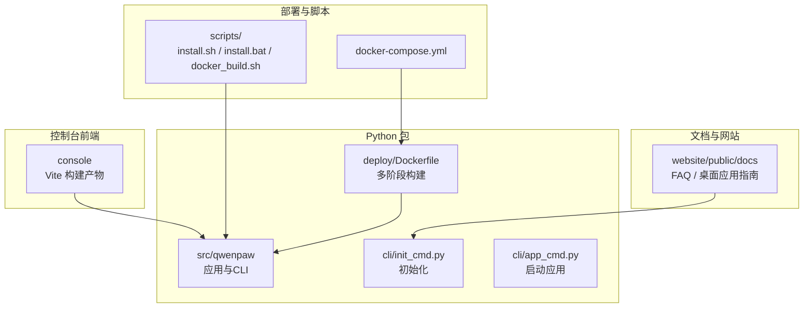
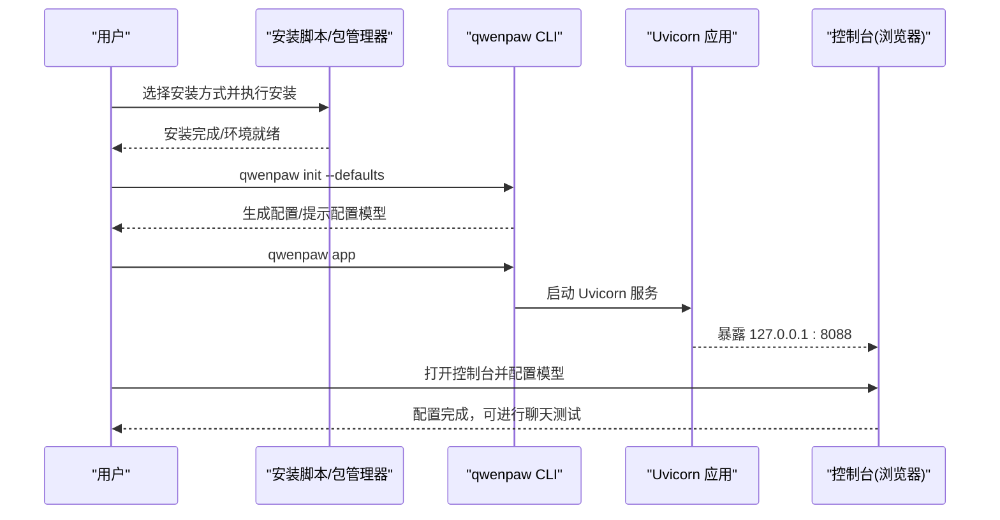
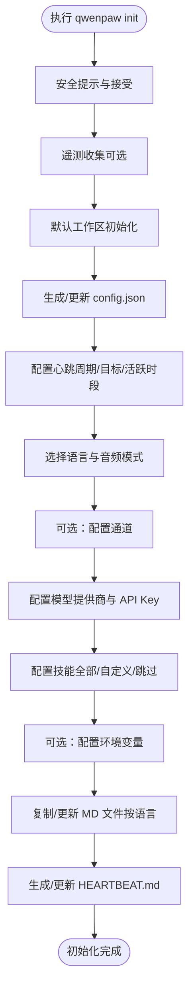
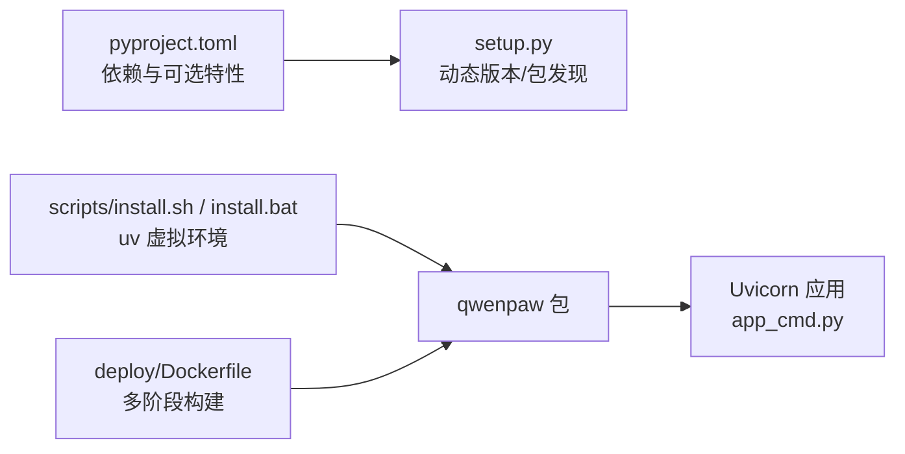

# 快速开始

<cite>
**本文引用的文件**
- [README.md](file://README.md)
- [scripts/install.sh](file://scripts/install.sh)
- [scripts/install.bat](file://scripts/install.bat)
- [deploy/Dockerfile](file://deploy/Dockerfile)
- [scripts/docker_build.sh](file://scripts/docker_build.sh)
- [docker-compose.yml](file://docker-compose.yml)
- [pyproject.toml](file://pyproject.toml)
- [setup.py](file://setup.py)
- [src/qwenpaw/cli/init_cmd.py](file://src/qwenpaw/cli/init_cmd.py)
- [src/qwenpaw/cli/app_cmd.py](file://src/qwenpaw/cli/app_cmd.py)
- [website/public/docs/faq.zh.md](file://website/public/docs/faq.zh.md)
- [website/public/docs/desktop.zh.md](file://website/public/docs/desktop.zh.md)
- [scripts/README.md](file://scripts/README.md)
</cite>

## 目录
1. [简介](#简介)
2. [项目结构](#项目结构)
3. [核心组件](#核心组件)
4. [架构总览](#架构总览)
5. [详细组件分析](#详细组件分析)
6. [依赖关系分析](#依赖关系分析)
7. [性能考虑](#性能考虑)
8. [故障排除指南](#故障排除指南)
9. [结论](#结论)
10. [附录](#附录)

## 简介
本指南面向初学者，带你从零开始完成 QwenPaw 的安装与首次使用，覆盖六种安装方式：pip 安装、脚本安装、Docker 部署、阿里云 ECS 一键部署、ModelScope 云平台、桌面应用（Beta）。随后介绍初始化流程（配置 API 密钥、模型提供商与基础参数）、首次运行后的控制台配置与聊天测试步骤，并提供常见安装问题与故障排除建议。

## 项目结构
QwenPaw 采用“Python 包 + 前端控制台 + CLI”的分层组织方式：
- Python 包与 CLI：位于 src/qwenpaw，提供应用入口、路由、通道、模型提供者、工作空间、迁移与工具等能力
- 控制台前端：位于 console，通过构建产物复制到 Python 包内，随包分发
- 部署与打包：deploy 提供 Docker 多阶段构建与入口脚本；scripts 提供安装脚本、构建脚本与测试脚本
- 文档与网站：website 提供静态站点与文档；FAQ 与桌面应用指南位于 website/public/docs

图表来源
- [deploy/Dockerfile:1-103](file://deploy/Dockerfile#L1-L103)
- [scripts/install.sh:1-340](file://scripts/install.sh#L1-L340)
- [scripts/install.bat:1-557](file://scripts/install.bat#L1-L557)
- [scripts/docker_build.sh:1-32](file://scripts/docker_build.sh#L1-L32)
- [docker-compose.yml:1-23](file://docker-compose.yml#L1-L23)
- [src/qwenpaw/cli/init_cmd.py:1-523](file://src/qwenpaw/cli/init_cmd.py#L1-L523)
- [src/qwenpaw/cli/app_cmd.py:1-112](file://src/qwenpaw/cli/app_cmd.py#L1-L112)

章节来源
- [README.md:104-120](file://README.md#L104-L120)
- [scripts/README.md:21-28](file://scripts/README.md#L21-L28)

## 核心组件
- 初始化 CLI：负责创建工作目录、生成配置、引导用户配置模型提供商、技能与环境变量等
- 应用启动 CLI：基于 Uvicorn 启动 FastAPI 应用，默认监听 127.0.0.1:8088
- Docker 镜像：多阶段构建，先构建前端，再安装 Python 依赖并打包运行
- 安装脚本：跨平台自动安装 uv、创建虚拟环境、安装包与前端资源，并更新 PATH

章节来源
- [src/qwenpaw/cli/init_cmd.py:119-523](file://src/qwenpaw/cli/init_cmd.py#L119-L523)
- [src/qwenpaw/cli/app_cmd.py:15-112](file://src/qwenpaw/cli/app_cmd.py#L15-L112)
- [deploy/Dockerfile:1-103](file://deploy/Dockerfile#L1-L103)
- [scripts/install.sh:1-340](file://scripts/install.sh#L1-L340)

## 架构总览
下图展示从安装到首次运行的关键流程：安装脚本/包管理器安装 → 初始化配置 → 启动应用 → 控制台配置模型 → 聊天测试。

图表来源
- [src/qwenpaw/cli/init_cmd.py:119-523](file://src/qwenpaw/cli/init_cmd.py#L119-L523)
- [src/qwenpaw/cli/app_cmd.py:15-112](file://src/qwenpaw/cli/app_cmd.py#L15-L112)
- [README.md:104-120](file://README.md#L104-L120)

## 详细组件分析

### 六种安装方式与操作步骤

- 方式一：pip 安装
  - 适用人群：已有 Python 环境，偏好标准包管理流程
  - 步骤要点
    - 安装：pip install qwenpaw
    - 初始化：qwenpaw init --defaults
    - 启动：qwenpaw app
    - 访问：浏览器打开 http://127.0.0.1:8088/ 进入控制台
  - 注意事项
    - Python 版本要求：>=3.10，<3.14
    - 若网络受限，可使用国内镜像源
  - 预期结果
    - 控制台可见，可配置模型与技能
  - 章节来源
    - [README.md:106-118](file://README.md#L106-L118)
    - [pyproject.toml:6-6](file://pyproject.toml#L6-L6)

- 方式二：脚本安装（macOS/Linux / Windows）
  - 适用人群：不想手动配置 Python 环境
  - 步骤要点
    - macOS/Linux：curl -fsSL https://qwenpaw.agentscope.io/install.sh | bash
    - Windows（PowerShell）：irm https://qwenpaw.agentscope.io/install.ps1 | iex
    - Windows（CMD）：curl -fsSL https://qwenpaw.agentscope.io/install.bat -o install.bat && install.bat
    - 可选 extras：--extras ollama 或 --extras ollama,local
  - 注意事项
    - 自动检测并安装 uv；若失败，按提示手动安装 uv 并重试
    - Windows LTSC/受限语言模式可能无法自动写入 PATH，需手动配置
  - 预期结果
    - 新终端可直接使用 qwenpaw 命令；执行 qwenpaw init --defaults 与 qwenpaw app
  - 章节来源
    - [README.md:122-187](file://README.md#L122-L187)
    - [scripts/install.sh:1-340](file://scripts/install.sh#L1-L340)
    - [scripts/install.bat:1-557](file://scripts/install.bat#L1-L557)
    - [website/public/docs/faq.zh.md:45-71](file://website/public/docs/faq.zh.md#L45-L71)

- 方式三：Docker 部署
  - 适用人群：希望快速获得隔离环境与持久化数据
  - 步骤要点
    - 拉取镜像：docker pull agentscope/qwenpaw:latest
    - 运行容器：映射 8088 端口，挂载工作目录与密钥目录
    - 可选：通过 --env-file 或 -e 注入 API 密钥
    - 连接宿主机服务（如 Ollama/LM Studio）：使用 host.docker.internal 或 host 网络
  - 注意事项
    - 默认只挂载工作目录时，密钥目录会自动迁移至工作目录内以实现持久化
    - 容器内 localhost 指向容器自身，连接宿主机需使用 host.docker.internal 或 host 网络
  - 预期结果
    - 浏览器打开 http://127.0.0.1:8088/，可配置模型与技能
  - 章节来源
    - [README.md:230-272](file://README.md#L230-L272)
    - [deploy/Dockerfile:1-103](file://deploy/Dockerfile#L1-L103)
    - [scripts/docker_build.sh:1-32](file://scripts/docker_build.sh#L1-L32)
    - [docker-compose.yml:1-23](file://docker-compose.yml#L1-L23)

- 方式四：阿里云 ECS 一键部署
  - 适用人群：希望在阿里云 ECS 上快速上线
  - 步骤要点
    - 打开“QwenPaw 在 ECS 一键部署”链接，按向导完成实例创建与配置
  - 预期结果
    - 服务启动后可通过公网/内网访问控制台
  - 章节来源
    - [README.md:275-278](file://README.md#L275-L278)

- 方式五：ModelScope 云平台
  - 适用人群：无需本地环境，直接在 ModelScope Studio 中体验
  - 步骤要点
    - 打开 Studio 一键克隆 QwenPaw 项目，设置为非公开以保护隐私
  - 预期结果
    - 在线环境中完成初始化与模型配置
  - 章节来源
    - [README.md:281-285](file://README.md#L281-L285)

- 方式六：桌面应用（Beta）
  - 适用人群：不习惯命令行或希望零配置体验
  - 步骤要点
    - 下载对应平台安装包，双击安装
    - 首次启动可能耗时 10-60 秒，耐心等待浏览器窗口出现
    - macOS 首次启动需解除 Gatekeeper 限制
  - 注意事项
    - Windows 需要 Microsoft WebView2 运行时
    - Beta 版本可能存在兼容性与性能问题
  - 预期结果
    - 自动打开浏览器控制台，可进行模型配置与聊天测试
  - 章节来源
    - [README.md:287-330](file://README.md#L287-L330)
    - [website/public/docs/desktop.zh.md:1-256](file://website/public/docs/desktop.zh.md#L1-L256)

### 初始化流程（配置 API 密钥、模型提供商与基础参数）

- 初始化命令
  - qwenpaw init --defaults：使用默认配置，跳过交互
  - qwenpaw init：交互式引导，包含安全提示、心跳配置、语言选择、音频模式、通道、模型提供商、技能与环境变量等
- 关键配置项
  - 心跳配置：周期、目标、活跃时段
  - 语言与音频模式：MD 文件语言、语音转写提供者类型
  - 通道：可选开启 iMessage/Discord/DingTalk/Feishu/QQ/Console
  - 模型提供商：DashScope、ModelScope、OpenAI、Gemini、Ollama 等（按需配置）
  - 技能：可批量下载并启用，或自定义选择
  - 环境变量：如 DASHSCOPE_API_KEY 等
- 预期结果
  - 生成配置文件与默认工作区，控制台可直接使用

图表来源
- [src/qwenpaw/cli/init_cmd.py:119-523](file://src/qwenpaw/cli/init_cmd.py#L119-L523)

章节来源
- [src/qwenpaw/cli/init_cmd.py:119-523](file://src/qwenpaw/cli/init_cmd.py#L119-L523)
- [README.md:332-345](file://README.md#L332-L345)

### 首次运行后的基本配置与测试

- 启动应用
  - qwenpaw app（默认监听 127.0.0.1:8088）
  - 可通过 --host/--port 自定义绑定地址与端口
- 控制台配置模型
  - 打开 http://127.0.0.1:8088/ → 设置 → 模型
  - 选择提供商并填写 API Key；启用提供商与模型
  - 本地模型：llama.cpp、Ollama、LM Studio（无需 API Key）
- 聊天测试
  - 在控制台或各通道中发起对话，验证模型响应
- 章节来源
  - [src/qwenpaw/cli/app_cmd.py:15-112](file://src/qwenpaw/cli/app_cmd.py#L15-L112)
  - [README.md:332-345](file://README.md#L332-L345)

## 依赖关系分析
- 包管理与入口
  - pyproject.toml 定义项目元数据、依赖与可选特性（local、ollama、llamacpp、mlx、whisper、full）
  - setup.py 委托 setuptools 动态读取版本与包发现
  - scripts/install.sh/install.bat 通过 uv 创建虚拟环境并安装包
- 前端与打包
  - Dockerfile 多阶段构建：先构建 console 前端，再复制到 Python 包内
  - scripts/docker_build.sh 支持自定义通道过滤与构建参数
- 运行时
  - app_cmd.py 基于 Uvicorn 启动 FastAPI 应用，支持日志级别与访问日志过滤

图表来源
- [pyproject.toml:1-111](file://pyproject.toml#L1-L111)
- [setup.py:1-5](file://setup.py#L1-L5)
- [scripts/install.sh:1-340](file://scripts/install.sh#L1-L340)
- [scripts/install.bat:1-557](file://scripts/install.bat#L1-L557)
- [deploy/Dockerfile:1-103](file://deploy/Dockerfile#L1-L103)
- [src/qwenpaw/cli/app_cmd.py:15-112](file://src/qwenpaw/cli/app_cmd.py#L15-L112)

章节来源
- [pyproject.toml:1-111](file://pyproject.toml#L1-L111)
- [scripts/docker_build.sh:1-32](file://scripts/docker_build.sh#L1-L32)

## 性能考虑
- Docker 环境
  - 使用 host.docker.internal 连接宿主机服务可避免端口映射冲突
  - host 网络模式（Linux）可减少端口映射开销，但需注意端口冲突
- 本地模型
  - Ollama/LM Studio 上下文长度建议至少 32K，复杂任务可更高
- 日志与调试
  - 启动时可设置 --log-level debug，便于定位问题
- 章节来源
  - [README.md:246-268](file://README.md#L246-L268)
  - [website/public/docs/faq.zh.md:281-302](file://website/public/docs/faq.zh.md#L281-L302)
  - [src/qwenpaw/cli/app_cmd.py:31-112](file://src/qwenpaw/cli/app_cmd.py#L31-L112)

## 故障排除指南
- Windows 端口 8088 冲突
  - 症状：Address already in use 或权限错误
  - 解决：更换端口（qwenpaw app --port 8090 或 docker -p 映射到 8090）
  - 章节来源
    - [website/public/docs/faq.zh.md:127-186](file://website/public/docs/faq.zh.md#L127-L186)

- Windows LTSC/受限语言模式
  - 症状：脚本无法写入 PATH 或无法自动下载 uv
  - 解决：手动安装 uv，将 uv 与 QwenPaw bin 目录加入 PATH，重新运行安装脚本
  - 章节来源
    - [website/public/docs/faq.zh.md:45-71](file://website/public/docs/faq.zh.md#L45-L71)
    - [README.md:158-180](file://README.md#L158-L180)

- Docker 连接宿主机服务
  - 症状：容器内 localhost 指向容器自身，无法访问宿主机服务
  - 解决：使用 host.docker.internal 或 host 网络模式
  - 章节来源
    - [README.md:246-268](file://README.md#L246-L268)

- 本地模型上下文长度过小
  - 症状：多轮对话不稳定、工具调用丢失上下文、长任务偏离目标
  - 解决：将模型上下文长度设置为至少 32K，必要时更高
  - 章节来源
    - [website/public/docs/faq.zh.md:281-302](file://website/public/docs/faq.zh.md#L281-L302)

- 桌面应用（Windows）无响应或白屏
  - 症状：无 WebView2 运行时导致白屏或无响应
  - 解决：安装 Microsoft WebView2，使用 Debug 模式查看日志
  - 章节来源
    - [website/public/docs/desktop.zh.md:73-93](file://website/public/docs/desktop.zh.md#L73-L93)

- 桌面应用（macOS）首次启动被拦截
  - 症状：系统提示无法验证开发者
  - 解决：右键打开或系统设置中允许，或使用终端命令解除隔离（谨慎）
  - 章节来源
    - [website/public/docs/desktop.zh.md:116-159](file://website/public/docs/desktop.zh.md#L116-L159)

- 定时任务未启动
  - 排查：确认服务运行、启用状态、DispatchChannel、DispatchTargetUserID/SessionID、Cron 表达式
  - 章节来源
    - [website/public/docs/faq.zh.md:311-346](file://website/public/docs/faq.zh.md#L311-L346)

- 获取错误详情与帮助
  - 建议：在 GitHub 提 Issue，附带错误详情文件与模型提供商/模型名/版本信息
  - 章节来源
    - [website/public/docs/faq.zh.md:378-387](file://website/public/docs/faq.zh.md#L378-L387)

## 结论
通过本指南，你可以根据自身环境与偏好选择任意一种安装方式，快速完成初始化与首次运行。建议优先使用脚本安装或 Docker，以获得更稳定的环境与持久化配置；在生产或共享环境中，务必重视安全配置与最小权限原则。遇到问题时，结合本指南的故障排除章节与官方文档，可高效定位并解决问题。

## 附录
- 安装脚本与构建脚本说明
  - scripts/README.md 提供 wheel 构建、网站构建与 Docker 构建的使用说明
  - 章节来源
    - [scripts/README.md:1-53](file://scripts/README.md#L1-L53)