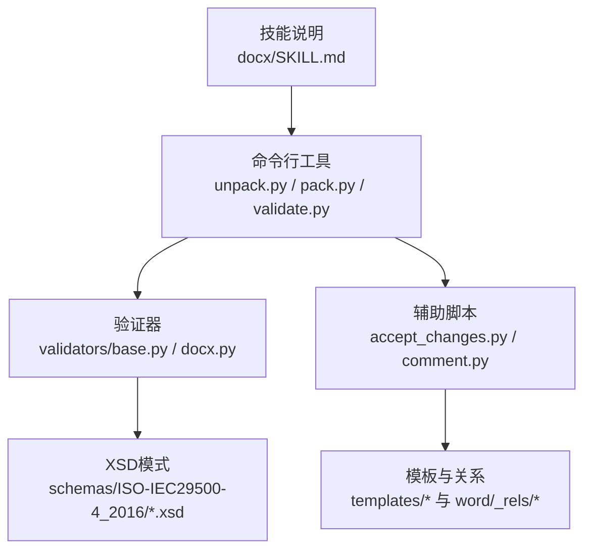
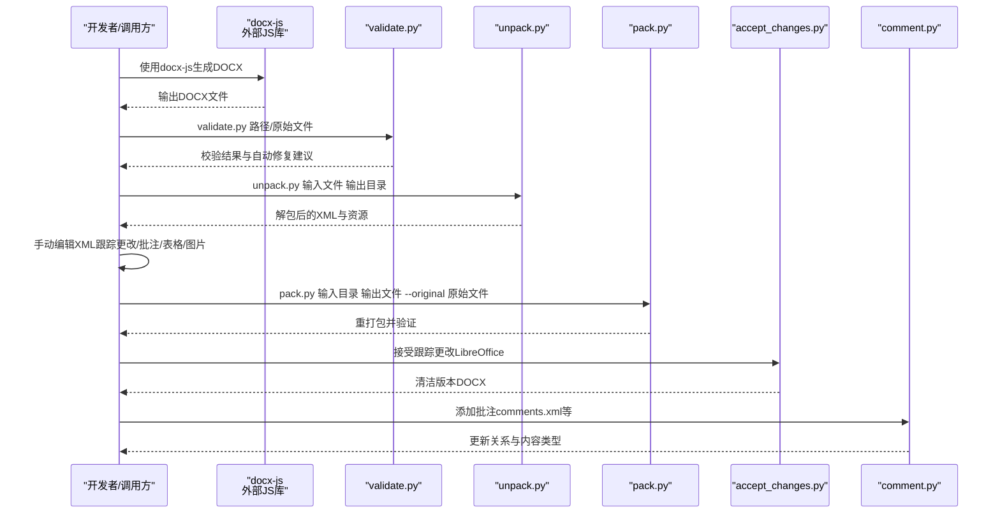
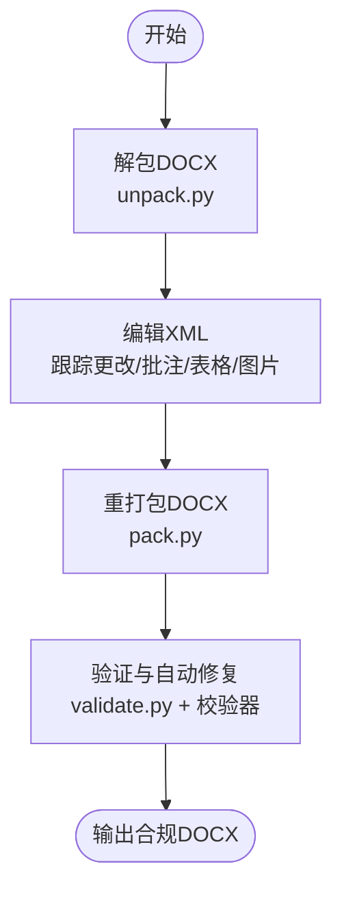
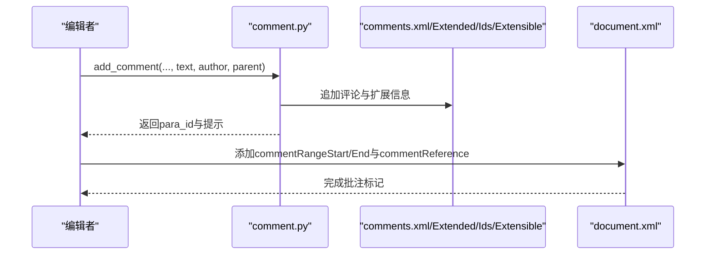
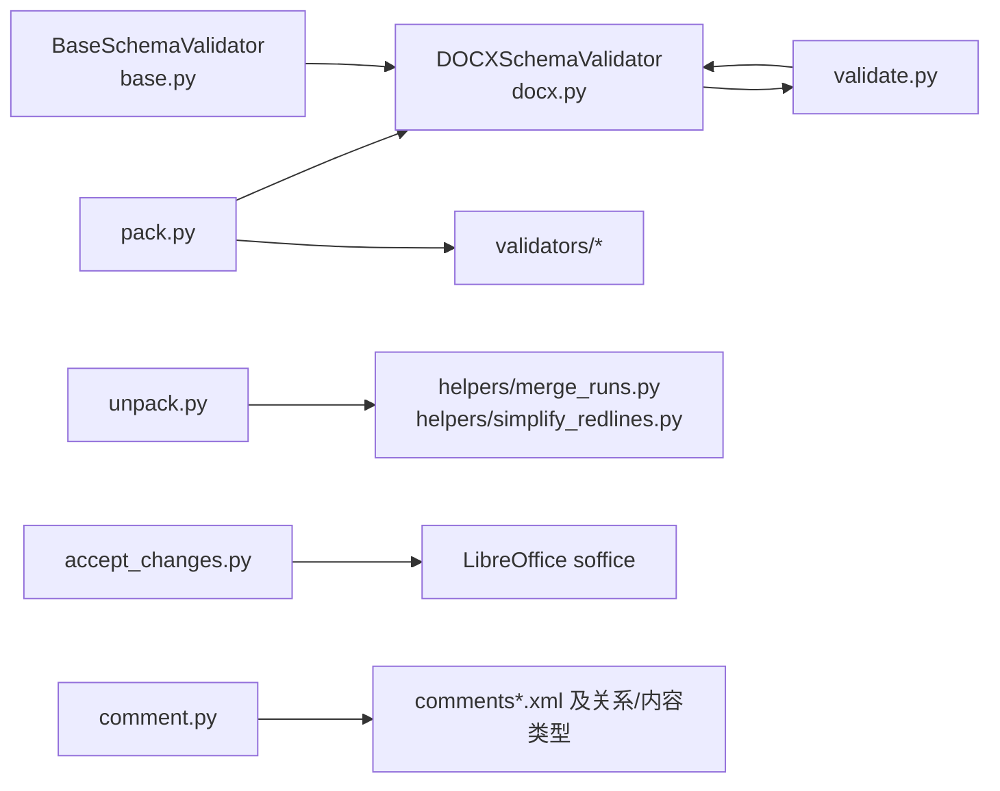

# DOCX文档处理

<cite>
**本文引用的文件**
- [docx/SKILL.md](file://src/qwenpaw/agents/skills/docx/SKILL.md)
- [docx/scripts/office/validators/docx.py](file://src/qwenpaw/agents/skills/docx/scripts/office/validators/docx.py)
- [docx/scripts/office/validators/base.py](file://src/qwenpaw/agents/skills/docx/scripts/office/validators/base.py)
- [docx/scripts/office/validate.py](file://src/qwenpaw/agents/skills/docx/scripts/office/validate.py)
- [docx/scripts/office/pack.py](file://src/qwenpaw/agents/skills/docx/scripts/office/pack.py)
- [docx/scripts/office/unpack.py](file://src/qwenpaw/agents/skills/docx/scripts/office/unpack.py)
- [docx/scripts/accept_changes.py](file://src/qwenpaw/agents/skills/docx/scripts/accept_changes.py)
- [docx/scripts/comment.py](file://src/qwenpaw/agents/skills/docx/scripts/comment.py)
</cite>

## 目录
1. [简介](#简介)
2. [项目结构](#项目结构)
3. [核心组件](#核心组件)
4. [架构总览](#架构总览)
5. [详细组件分析](#详细组件分析)
6. [依赖关系分析](#依赖关系分析)
7. [性能考量](#性能考量)
8. [故障排查指南](#故障排查指南)
9. [结论](#结论)
10. [附录](#附录)

## 简介
本文件面向QwenPaw中“DOCX文档处理”技能，系统性阐述DOCX作为ZIP压缩包的内部结构与XML组织方式，覆盖关系文件管理、媒体资源存储、文档创建（docx-js）、编辑（解包→修改→重打包）与验证、以及高级功能（跟踪更改、批注、表格、图片插入）的实现要点。同时提供专业排版技巧（智能引号实体转换、段落标记处理、编号列表配置）与工具链（LibreOffice集成、Pandoc文本提取、PDF导出）的使用方法。

## 项目结构
该技能位于src/qwenpaw/agents/skills/docx目录下，包含技能说明文档与Python脚本工具集，涵盖解包、打包、验证、跟踪更改接受、批注添加等功能，并提供XSD校验器以确保生成或编辑后的DOCX符合OOXML规范。

图表来源
- [docx/SKILL.md:1-488](file://src/qwenpaw/agents/skills/docx/SKILL.md#L1-L488)
- [docx/scripts/office/unpack.py:1-133](file://src/qwenpaw/agents/skills/docx/scripts/office/unpack.py#L1-L133)
- [docx/scripts/office/pack.py:1-160](file://src/qwenpaw/agents/skills/docx/scripts/office/pack.py#L1-L160)
- [docx/scripts/office/validate.py:1-112](file://src/qwenpaw/agents/skills/docx/scripts/office/validate.py#L1-L112)
- [docx/scripts/office/validators/base.py:1-848](file://src/qwenpaw/agents/skills/docx/scripts/office/validators/base.py#L1-L848)
- [docx/scripts/office/validators/docx.py:1-448](file://src/qwenpaw/agents/skills/docx/scripts/office/validators/docx.py#L1-L448)
- [docx/scripts/accept_changes.py:1-139](file://src/qwenpaw/agents/skills/docx/scripts/accept_changes.py#L1-L139)
- [docx/scripts/comment.py:1-319](file://src/qwenpaw/agents/skills/docx/scripts/comment.py#L1-L319)

章节来源
- [docx/SKILL.md:1-488](file://src/qwenpaw/agents/skills/docx/SKILL.md#L1-L488)

## 核心组件
- 文档创建与验证：通过docx-js生成DOCX后，使用validate.py进行XSD与语义校验；必要时自动修复常见问题（如ID越界、空白保留策略）。
- 解包与编辑：unpack.py将DOCX解压为可编辑的XML结构，合并相邻文本运行、简化跟踪修订、转义智能引号，便于直接编辑。
- 重打包与校验：pack.py在重打包前对XML进行紧凑化处理，随后执行验证器并可选自动修复，最终输出合规的DOCX。
- 高级功能：accept_changes.py借助LibreOffice宏接受跟踪更改；comment.py负责在comments.xml等文件中添加批注及扩展信息，并维护关系与内容类型声明。

章节来源
- [docx/scripts/office/validate.py:25-107](file://src/qwenpaw/agents/skills/docx/scripts/office/validate.py#L25-L107)
- [docx/scripts/office/unpack.py:34-74](file://src/qwenpaw/agents/skills/docx/scripts/office/unpack.py#L34-L74)
- [docx/scripts/office/pack.py:24-66](file://src/qwenpaw/agents/skills/docx/scripts/office/pack.py#L24-L66)
- [docx/scripts/accept_changes.py:37-90](file://src/qwenpaw/agents/skills/docx/scripts/accept_changes.py#L37-L90)
- [docx/scripts/comment.py:218-290](file://src/qwenpaw/agents/skills/docx/scripts/comment.py#L218-L290)

## 架构总览
下图展示从创建到编辑再到验证的整体流程，以及关键模块之间的交互。

图表来源
- [docx/scripts/office/validate.py:25-107](file://src/qwenpaw/agents/skills/docx/scripts/office/validate.py#L25-L107)
- [docx/scripts/office/unpack.py:34-74](file://src/qwenpaw/agents/skills/docx/scripts/office/unpack.py#L34-L74)
- [docx/scripts/office/pack.py:24-66](file://src/qwenpaw/agents/skills/docx/scripts/office/pack.py#L24-L66)
- [docx/scripts/accept_changes.py:37-90](file://src/qwenpaw/agents/skills/docx/scripts/accept_changes.py#L37-L90)
- [docx/scripts/comment.py:218-290](file://src/qwenpaw/agents/skills/docx/scripts/comment.py#L218-L290)

## 详细组件分析

### DOCX内部结构与XML组织
- DOCX本质是ZIP容器，内部包含word/、word/_rels/、[Content_Types].xml、docProps/等目录与文件。核心内容由word/document.xml承载，样式、编号、关系、媒体等分布在相应XML中。
- 关系文件（.rels）用于建立文档与媒体、批注等部件的关联；内容类型（[Content_Types].xml）声明各部件的MIME类型，缺失会导致平台无法识别媒体或部件。
- 智能引号在编辑前后需保持为XML实体（如&#x201C;），以避免在不同平台渲染时出现字符编码或字体差异导致的显示异常。

章节来源
- [docx/SKILL.md:26-35](file://src/qwenpaw/agents/skills/docx/SKILL.md#L26-L35)
- [docx/scripts/office/unpack.py:26-31](file://src/qwenpaw/agents/skills/docx/scripts/office/unpack.py#L26-L31)
- [docx/scripts/office/validators/base.py:492-596](file://src/qwenpaw/agents/skills/docx/scripts/office/validators/base.py#L492-L596)

### 文档创建流程（docx-js到JavaScript API）
- 页面设置：显式指定宽度/高度与页边距（DXA单位），避免默认A4与目标纸张不一致。
- 字体与样式：使用默认字体（如Arial），通过样式覆盖内置标题样式（Heading1/2等），并设置outlineLevel以支持目录。
- 列表与编号：使用LevelFormat.BULLET与独立的reference，避免手动Unicode符号；同一reference延续编号，不同reference重启编号。
- 表格：必须同时设置Table.width与columnWidths，且每单元格宽度匹配；使用Clear着色避免黑底；合理设置内边距提升可读性。
- 图片：ImageRun必须指定type（png/jpg等），并提供altText三要素；绘制尺寸与EMUs换算遵循约定。
- 分页：PageBreak必须置于段落内，或使用pageBreakBefore属性。
- 目录：仅使用HeadingLevel，确保目录项层级正确。

章节来源
- [docx/SKILL.md:71-301](file://src/qwenpaw/agents/skills/docx/SKILL.md#L71-L301)

### 文档编辑机制（解包→修改→重打包→验证）
- 解包：将ZIP内容解出，美化XML，合并相邻文本运行，简化同作者连续修订，转义智能引号，便于后续编辑。
- 修改：在unpacked/word/目录下按需修改XML，注意：
  - 跟踪更改：插入用<w:ins>、删除用<w:del>，删除内使用<w:delText>与<w:delInstrText>；替换应最小化改动范围。
  - 批注：先在comments.xml等文件中写入内容，再在document.xml中添加commentRangeStart/End与commentReference标记；标记必须是段落直接子节点。
  - 表格：确保表宽等于列宽之和，单元格宽度与对应列宽一致；使用Clear着色与内边距。
  - 图片：在word/media/放置资源，更新word/_rels/document.xml.rels与[Content_Types].xml，再在document.xml中引用。
- 重打包：对XML进行紧凑化处理，去除无意义空白与注释，压缩为ZIP输出。
- 验证：执行XSD校验与语义校验（如ID唯一性、关系完整性、空白保留策略、跟踪修订一致性等），必要时自动修复。

图表来源
- [docx/scripts/office/unpack.py:34-74](file://src/qwenpaw/agents/skills/docx/scripts/office/unpack.py#L34-L74)
- [docx/scripts/office/pack.py:24-66](file://src/qwenpaw/agents/skills/docx/scripts/office/pack.py#L24-L66)
- [docx/scripts/office/validate.py:25-107](file://src/qwenpaw/agents/skills/docx/scripts/office/validate.py#L25-L107)

章节来源
- [docx/SKILL.md:304-360](file://src/qwenpaw/agents/skills/docx/SKILL.md#L304-L360)
- [docx/scripts/office/unpack.py:34-74](file://src/qwenpaw/agents/skills/docx/scripts/office/unpack.py#L34-L74)
- [docx/scripts/office/pack.py:24-66](file://src/qwenpaw/agents/skills/docx/scripts/office/pack.py#L24-L66)

### 跟踪更改与批注处理
- 跟踪更改：
  - 插入：<w:ins>包裹<w:r>，包含<w:t>；删除：<w:del>包裹<w:r>，包含<w:delText>或<w:delInstrText>。
  - 最小化编辑：仅标记变更部分，保留原格式（复制<w:rPr>）。
  - 删除整段：在<w:pPr><w:rPr>中加入<w:del/>，以确保接受更改时正确合并。
- 批注：
  - 先在comments.xml写入内容，再在commentsExtended.xml、commentsIds.xml、commentsExtensible.xml中补充扩展信息。
  - 在document.xml中添加commentRangeStart/End与commentReference标记，且必须是段落直接子节点。

图表来源
- [docx/scripts/comment.py:218-290](file://src/qwenpaw/agents/skills/docx/scripts/comment.py#L218-L290)
- [docx/SKILL.md:436-461](file://src/qwenpaw/agents/skills/docx/SKILL.md#L436-L461)

章节来源
- [docx/SKILL.md:370-435](file://src/qwenpaw/agents/skills/docx/SKILL.md#L370-L435)
- [docx/scripts/comment.py:218-290](file://src/qwenpaw/agents/skills/docx/scripts/comment.py#L218-L290)

### 表格与图片操作
- 表格：
  - 必须同时设置Table.width（DXA）与columnWidths，且二者相等。
  - 每个单元格宽度需与对应列宽一致；使用ShadingType.CLEAR避免黑底；合理设置内边距。
- 图片：
  - 将媒体放入word/media/，在document.xml.rels中新增关系，在[Content_Types].xml中声明内容类型，最后在document.xml中引用。

章节来源
- [docx/SKILL.md:188-247](file://src/qwenpaw/agents/skills/docx/SKILL.md#L188-L247)
- [docx/SKILL.md:462-487](file://src/qwenpaw/agents/skills/docx/SKILL.md#L462-L487)

### 智能引号实体转换与段落标记处理
- 智能引号：编辑前后统一转换为XML实体（如&#x201C;/&#x201D;/&#x2018;/&#x2019;），确保跨平台一致性。
- 段落标记：不要在JS中使用\n，应拆分为多个段落；分页使用PageBreak置于段落内或pageBreakBefore属性。

章节来源
- [docx/scripts/office/unpack.py:91-98](file://src/qwenpaw/agents/skills/docx/scripts/office/unpack.py#L91-L98)
- [docx/SKILL.md:249-290](file://src/qwenpaw/agents/skills/docx/SKILL.md#L249-L290)

### 编号列表配置
- 使用LevelFormat.BULLET与独立reference，避免手动Unicode符号。
- 同一reference延续编号，不同reference重启编号；确保列表项与编号配置一致。

章节来源
- [docx/SKILL.md:154-186](file://src/qwenpaw/agents/skills/docx/SKILL.md#L154-L186)

### LibreOffice集成与Pandoc/PDF导出
- LibreOffice：通过accept_changes.py调用LibreOffice宏接受跟踪更改，输出干净版本DOCX。
- Pandoc：用于从DOCX提取文本（含跟踪更改），支持多种格式转换。
- PDF导出：先将DOCX转换为PDF，再使用pdftoppm（或pdf2image）进行图像化处理。

章节来源
- [docx/SKILL.md:15-22](file://src/qwenpaw/agents/skills/docx/SKILL.md#L15-L22)
- [docx/SKILL.md:36-68](file://src/qwenpaw/agents/skills/docx/SKILL.md#L36-L68)
- [docx/scripts/accept_changes.py:37-90](file://src/qwenpaw/agents/skills/docx/scripts/accept_changes.py#L37-L90)

## 依赖关系分析
- 校验器体系：BaseSchemaValidator提供通用校验能力（XML语法、命名空间、ID唯一性、关系完整性、内容类型声明、XSD校验），DOCXSchemaValidator在此基础上增加空白保留、删除/插入约束、评论标记配对、ID约束等专项规则。
- 工具链耦合：unpack.py依赖helpers中的合并运行与简化修订逻辑；pack.py在重打包前进行XML紧凑化，并调用validators执行验证与自动修复。
- 外部依赖：docx-js（外部JS库）用于创建DOCX；LibreOffice用于接受跟踪更改；Pandoc用于文本提取；pdftoppm/pdf2image用于PDF转图像。

图表来源
- [docx/scripts/office/validators/base.py:12-108](file://src/qwenpaw/agents/skills/docx/scripts/office/validators/base.py#L12-L108)
- [docx/scripts/office/validators/docx.py:17-65](file://src/qwenpaw/agents/skills/docx/scripts/office/validators/docx.py#L17-L65)
- [docx/scripts/office/validate.py:22-53](file://src/qwenpaw/agents/skills/docx/scripts/office/validate.py#L22-L53)
- [docx/scripts/office/unpack.py:23-24](file://src/qwenpaw/agents/skills/docx/scripts/office/unpack.py#L23-L24)
- [docx/scripts/office/pack.py:22-29](file://src/qwenpaw/agents/skills/docx/scripts/office/pack.py#L22-L29)
- [docx/scripts/accept_changes.py:13-13](file://src/qwenpaw/agents/skills/docx/scripts/accept_changes.py#L13-L13)
- [docx/scripts/comment.py:25-32](file://src/qwenpaw/agents/skills/docx/scripts/comment.py#L25-L32)

章节来源
- [docx/scripts/office/validators/base.py:12-108](file://src/qwenpaw/agents/skills/docx/scripts/office/validators/base.py#L12-L108)
- [docx/scripts/office/validators/docx.py:17-65](file://src/qwenpaw/agents/skills/docx/scripts/office/validators/docx.py#L17-L65)
- [docx/scripts/office/pack.py:69-105](file://src/qwenpaw/agents/skills/docx/scripts/office/pack.py#L69-L105)

## 性能考量
- 解包阶段：一次性美化XML与转义智能引号，减少后续编辑成本。
- 重打包阶段：XML紧凑化去除冗余空白与注释，降低ZIP体积与加载时间。
- 校验阶段：优先执行快速规则（XML语法、命名空间、ID唯一性），再执行较慢的XSD校验，必要时启用自动修复以减少人工干预。
- 外部工具：LibreOffice宏执行有超时容忍，Pandoc/PDF工具耗时较长，建议在后台任务中执行并缓存中间产物。

## 故障排查指南
- XML语法错误：validate.py会报告具体文件与行号；优先检查标签闭合、命名空间声明与属性拼写。
- 关系与内容类型缺失：pack.py在验证阶段会提示未声明的媒体扩展名或未引用的文件，需补全[word/_rels/document.xml.rels]与[Content_Types].xml。
- ID冲突或越界：DOCXSchemaValidator会检测paraId/durableId是否超出限制或重复，自动修复hex ID并重新生成有效值。
- 跟踪更改不生效：确认删除/插入标签位置正确，删除内使用delText/delInstrText，且最小化编辑范围。
- 批注标记无效：确保commentRangeStart/End与commentReference在document.xml中作为段落直接子节点出现，且ID与comments.xml中的comment一致。
- LibreOffice宏失败：检查soffice可用性、用户配置文件初始化与宏文件写入权限。

章节来源
- [docx/scripts/office/validate.py:25-107](file://src/qwenpaw/agents/skills/docx/scripts/office/validate.py#L25-L107)
- [docx/scripts/office/pack.py:69-105](file://src/qwenpaw/agents/skills/docx/scripts/office/pack.py#L69-L105)
- [docx/scripts/office/validators/docx.py:113-162](file://src/qwenpaw/agents/skills/docx/scripts/office/validators/docx.py#L113-L162)
- [docx/scripts/accept_changes.py:37-90](file://src/qwenpaw/agents/skills/docx/scripts/accept_changes.py#L37-L90)
- [docx/scripts/comment.py:218-290](file://src/qwenpaw/agents/skills/docx/scripts/comment.py#L218-L290)

## 结论
该技能以“解包—编辑—重打包—验证”的流水线为核心，结合docx-js创建、LibreOffice接受修订、Pandoc/PDF工具链，形成完整的DOCX处理闭环。通过严格的XSD与语义校验、自动修复与模板化批注/关系/内容类型管理，确保生成与编辑后的文档在多平台与工具链间保持兼容与一致性。

## 附录
- 常用DXA换算：1440 DXA = 1英寸；US Letter宽高分别为12240/15840 DXA。
- 表格宽度计算：表宽=列宽之和=内容宽度（页宽-左右边距）。
- 智能引号实体对照：左单引号/右单引号/左双引号/右双引号分别对应&#x2018;/&#x2019;/&#x201C;/&#x201D;。