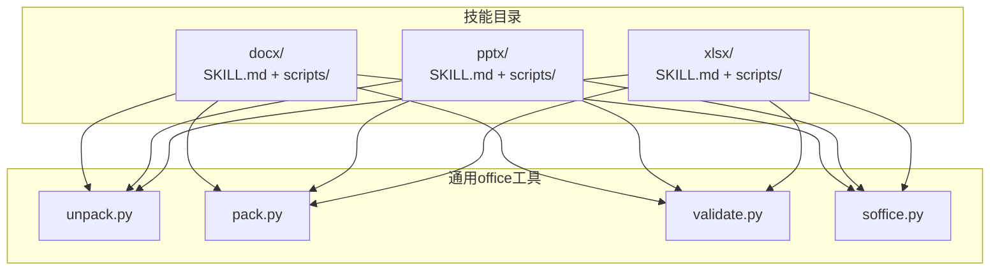
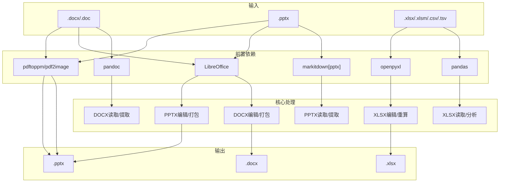
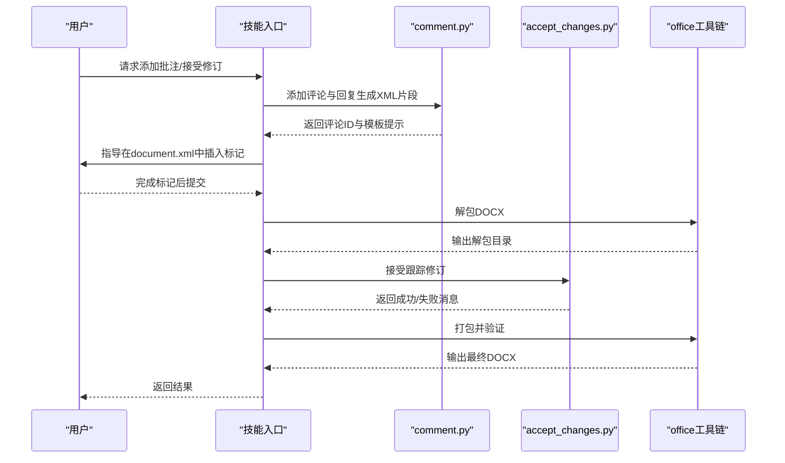
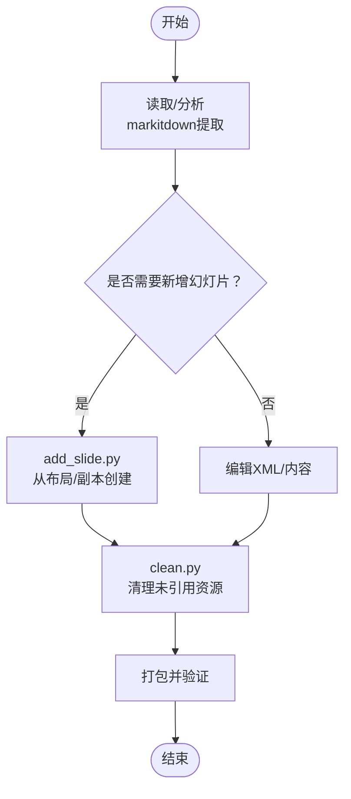
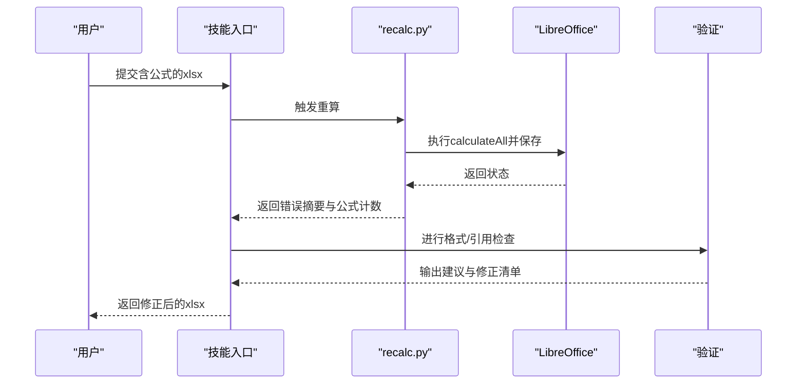
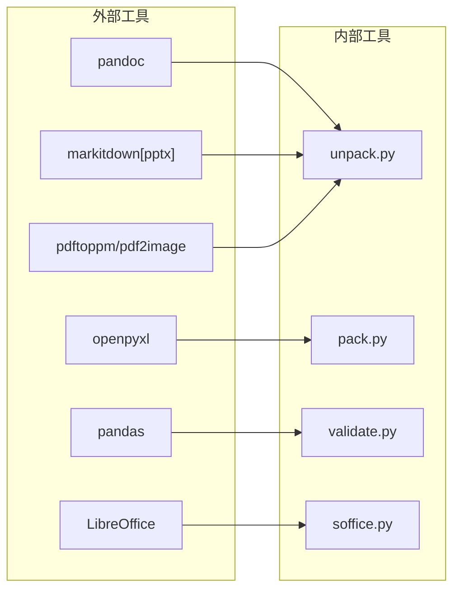

# Office文档处理技能

<cite>
**本文档引用的文件**
- [SKILL.md（docx）](file://src/qwenpaw/agents/skills/docx/SKILL.md)
- [accept_changes.py](file://src/qwenpaw/agents/skills/docx/scripts/accept_changes.py)
- [comment.py](file://src/qwenpaw/agents/skills/docx/scripts/comment.py)
- [SKILL.md（pptx）](file://src/qwenpaw/agents/skills/pptx/SKILL.md)
- [add_slide.py](file://src/qwenpaw/agents/skills/pptx/scripts/add_slide.py)
- [clean.py](file://src/qwenpaw/agents/skills/pptx/scripts/clean.py)
- [SKILL.md（xlsx）](file://src/qwenpaw/agents/skills/xlsx/SKILL.md)
- [recalc.py](file://src/qwenpaw/agents/skills/xlsx/scripts/recalc.py)
</cite>

## 目录
1. [简介](#简介)
2. [项目结构](#项目结构)
3. [核心组件](#核心组件)
4. [架构总览](#架构总览)
5. [详细组件分析](#详细组件分析)
6. [依赖关系分析](#依赖关系分析)
7. [性能考量](#性能考量)
8. [故障排查指南](#故障排查指南)
9. [结论](#结论)
10. [附录](#附录)

## 简介
本文件面向QwenPaw的Office文档处理技能，系统化梳理并说明以下能力与实现方案：
- DOCX：文本提取、样式保留、批注处理、模板生成、跟踪修订接受、XML解包/打包与校验
- PPTX：内容提取、幻灯片编辑、图表/媒体元素管理、布局与主题清理、从零创建与模板复用
- XLSX：数据提取、公式计算与重算、格式转换、图表生成、错误检测与修复
- 统一的Office文件解析、验证、打包与解包流程，以及XML结构、样式继承与版本兼容策略

目标是帮助开发者与使用者在不直接操作底层XML的情况下，安全高效地完成复杂Office文档的自动化处理。

## 项目结构
本技能以“技能”为单位组织，每个Office类型（docx/pptx/xlsx）对应一个独立技能目录，内含：
- 技能说明文档（SKILL.md），定义使用场景、前置条件、工作流与最佳实践
- scripts/office：通用的解包/打包/验证/辅助工具（如soffice.py）
- 各自专用脚本：如docx的accept_changes.py、comment.py；pptx的add_slide.py、clean.py；xlsx的recalc.py

**图示来源**
- [SKILL.md（docx）:1-120](file://src/qwenpaw/agents/skills/docx/SKILL.md#L1-L120)
- [SKILL.md（pptx）:1-60](file://src/qwenpaw/agents/skills/pptx/SKILL.md#L1-L60)
- [SKILL.md（xlsx）:70-120](file://src/qwenpaw/agents/skills/xlsx/SKILL.md#L70-L120)

**章节来源**
- [SKILL.md（docx）:1-120](file://src/qwenpaw/agents/skills/docx/SKILL.md#L1-L120)
- [SKILL.md（pptx）:1-60](file://src/qwenpaw/agents/skills/pptx/SKILL.md#L1-L60)
- [SKILL.md（xlsx）:70-120](file://src/qwenpaw/agents/skills/xlsx/SKILL.md#L70-L120)

## 核心组件
- 文档读取与提取
  - DOCX：pandoc提取（支持跟踪修订）、原始XML访问
  - PPTX：markitdown提取、缩略图可视化
  - XLSX：pandas数据分析、openpyxl读写与公式
- 编辑与生成
  - DOCX：docx-js模板生成、XML解包/打包、跟踪修订接受、批注添加
  - PPTX：从布局创建新幻灯片、清理未引用资源、从零创建
  - XLSX：openpyxl格式化与公式、LibreOffice重算、错误检测
- 工具链
  - 解包/打包/验证：统一的office工具链，确保ZIP容器完整性与XML合法性
  - soffice桥接：调用LibreOffice进行转换、重算、接受修订等

**章节来源**
- [SKILL.md（docx）:30-120](file://src/qwenpaw/agents/skills/docx/SKILL.md#L30-L120)
- [SKILL.md（pptx）:25-60](file://src/qwenpaw/agents/skills/pptx/SKILL.md#L25-L60)
- [SKILL.md（xlsx）:80-120](file://src/qwenpaw/agents/skills/xlsx/SKILL.md#L80-L120)

## 架构总览
下图展示了三类Office文档处理的统一架构：前置依赖、核心流程与输出形态。

**图示来源**
- [SKILL.md（docx）:15-60](file://src/qwenpaw/agents/skills/docx/SKILL.md#L15-L60)
- [SKILL.md（pptx）:15-46](file://src/qwenpaw/agents/skills/pptx/SKILL.md#L15-L46)
- [SKILL.md（xlsx）:78-120](file://src/qwenpaw/agents/skills/xlsx/SKILL.md#L78-L120)

## 详细组件分析

### DOCX处理组件
- 文本提取与跟踪修订
  - 使用pandoc提取正文并保留跟踪修订信息
  - 原始XML可通过解包工具获取，便于精确定位与修改
- 批注处理
  - 提供comment.py用于在comments.xml中添加评论与回复，并自动维护关系与内容类型
  - 添加标记后需在document.xml中插入范围起止与引用标记
- 跟踪修订接受
  - 使用accept_changes.py通过LibreOffice宏接受所有修订，生成干净版文档
- 模板生成与样式
  - 推荐使用docx-js创建新文档，注意显式设置页面尺寸、方向与字体
  - 列表、表格、图片、分页符等均有严格规则，避免使用百分比宽度与Unicode符号
- XML解包/打包与校验
  - 解包时合并相邻文本运行、规范化智能引号实体
  - 打包时自动修复部分问题（如durableId、空格保留），但不处理结构性Schema违规

**图示来源**
- [comment.py:218-291](file://src/qwenpaw/agents/skills/docx/scripts/comment.py#L218-L291)
- [accept_changes.py:37-90](file://src/qwenpaw/agents/skills/docx/scripts/accept_changes.py#L37-L90)
- [SKILL.md（docx）:308-360](file://src/qwenpaw/agents/skills/docx/SKILL.md#L308-L360)

**章节来源**
- [SKILL.md（docx）:30-120](file://src/qwenpaw/agents/skills/docx/SKILL.md#L30-L120)
- [comment.py:1-319](file://src/qwenpaw/agents/skills/docx/scripts/comment.py#L1-L319)
- [accept_changes.py:1-139](file://src/qwenpaw/agents/skills/docx/scripts/accept_changes.py#L1-L139)

### PPTX处理组件
- 内容提取与可视化
  - 使用markitdown提取纯文本与结构化信息
  - 通过缩略图快速检查布局与排版
- 幻灯片编辑与新增
  - add_slide.py支持从现有幻灯片复制或从布局模板创建新幻灯片
  - 自动维护[Content_Types].xml与presentation.xml.rels中的关系
- 清理未引用资源
  - clean.py扫描并删除未被引用的幻灯片、媒体、图表、主题、备注等资源，保持文件精简
- 从零创建
  - 结合pptxgenjs与模板，可实现无模板时的全新演示文稿生成

**图示来源**
- [add_slide.py:33-87](file://src/qwenpaw/agents/skills/pptx/scripts/add_slide.py#L33-L87)
- [clean.py:241-264](file://src/qwenpaw/agents/skills/pptx/scripts/clean.py#L241-L264)
- [SKILL.md（pptx）:50-60](file://src/qwenpaw/agents/skills/pptx/SKILL.md#L50-L60)

**章节来源**
- [SKILL.md（pptx）:25-60](file://src/qwenpaw/agents/skills/pptx/SKILL.md#L25-L60)
- [add_slide.py:1-196](file://src/qwenpaw/agents/skills/pptx/scripts/add_slide.py#L1-L196)
- [clean.py:1-287](file://src/qwenpaw/agents/skills/pptx/scripts/clean.py#L1-L287)

### XLSX处理组件
- 数据分析与读取
  - pandas读取Excel，支持多工作表与列选择，便于清洗与统计
- 公式计算与重算
  - openpyxl保存公式字符串但不计算值，需使用recalc.py通过LibreOffice执行重算
  - 脚本返回JSON，包含错误类型与位置，便于定位#REF!/#DIV/0!/#VALUE!等
- 格式化与生成
  - 使用openpyxl进行单元格样式、对齐、填充与列宽控制
  - 遵循财务模型颜色与格式规范，确保可读性与一致性

**图示来源**
- [recalc.py:80-187](file://src/qwenpaw/agents/skills/xlsx/scripts/recalc.py#L80-L187)
- [SKILL.md（xlsx）:220-277](file://src/qwenpaw/agents/skills/xlsx/SKILL.md#L220-L277)

**章节来源**
- [SKILL.md（xlsx）:78-120](file://src/qwenpaw/agents/skills/xlsx/SKILL.md#L78-L120)
- [recalc.py:1-210](file://src/qwenpaw/agents/skills/xlsx/scripts/recalc.py#L1-L210)

## 依赖关系分析
- 外部工具依赖
  - pandoc（DOCX文本提取）
  - markitdown[pptx]（PPTX文本提取）
  - openpyxl/pandas（XLSX读写与分析）
  - LibreOffice（转换、重算、接受修订）
  - pdftoppm/pdf2image（图像化工作流）
- 内部工具链
  - office/unpack.py/office/pack.py/office/validate.py提供统一的解包/打包/校验
  - office/soffice.py封装LibreOffice命令行调用与环境配置

**图示来源**
- [SKILL.md（docx）:15-60](file://src/qwenpaw/agents/skills/docx/SKILL.md#L15-L60)
- [SKILL.md（pptx）:15-46](file://src/qwenpaw/agents/skills/pptx/SKILL.md#L15-L46)
- [SKILL.md（xlsx）:78-120](file://src/qwenpaw/agents/skills/xlsx/SKILL.md#L78-L120)

**章节来源**
- [SKILL.md（docx）:15-60](file://src/qwenpaw/agents/skills/docx/SKILL.md#L15-L60)
- [SKILL.md（pptx）:15-46](file://src/qwenpaw/agents/skills/pptx/SKILL.md#L15-L46)
- [SKILL.md（xlsx）:78-120](file://src/qwenpaw/agents/skills/xlsx/SKILL.md#L78-L120)

## 性能考量
- 文件体积与I/O
  - 清理未引用资源（PPTX clean.py）可显著减小输出文件体积，提升传输与加载效率
  - DOCX/PPTX解包/打包涉及大量XML读写，建议在SSD上执行并避免频繁磁盘抖动
- 计算密集型任务
  - XLSX重算可能耗时较长，合理设置超时参数；必要时分表或分区域重算
  - LibreOffice进程启动开销较大，尽量复用已初始化的用户配置
- 格式与渲染
  - DOCX使用DXA单位与明确页面尺寸可减少跨平台渲染差异带来的二次调整成本
  - PPTX布局与主题清理有助于降低渲染负担

## 故障排查指南
- DOCX
  - 批注无法显示：确认comments.xml、commentsExtended.xml、commentsIds.xml、commentsExtensible.xml齐全且关系正确
  - 跟踪修订接受失败：检查LibreOffice宏是否正确安装与初始化
  - XML打包报错：使用auto-repair修复常见问题，仍失败则检查Schema合规性
- PPTX
  - 新增幻灯片后引用缺失：检查presentation.xml.rels与[Content_Types].xml中的关系条目
  - 清理后资源仍可见：确认clean.py已遍历移除所有未引用文件
- XLSX
  - 公式错误：根据recalc.py返回的错误摘要定位单元格，优先检查引用与数据类型
  - 重算超时：适当提高超时时间或拆分计算范围

**章节来源**
- [comment.py:137-216](file://src/qwenpaw/agents/skills/docx/scripts/comment.py#L137-L216)
- [accept_changes.py:93-122](file://src/qwenpaw/agents/skills/docx/scripts/accept_changes.py#L93-L122)
- [add_slide.py:141-155](file://src/qwenpaw/agents/skills/pptx/scripts/add_slide.py#L141-L155)
- [clean.py:241-264](file://src/qwenpaw/agents/skills/pptx/scripts/clean.py#L241-L264)
- [recalc.py:112-124](file://src/qwenpaw/agents/skills/xlsx/scripts/recalc.py#L112-L124)

## 结论
QwenPaw的Office文档处理技能通过标准化的工具链与严格的流程约束，实现了对DOCX/PPTX/XLSX的高可靠处理。其关键优势在于：
- 统一的解包/打包/验证机制，保障ZIP容器与XML结构的完整性
- 针对各格式的专用脚本与最佳实践，覆盖从提取到生成的全生命周期
- 与LibreOffice的深度集成，满足复杂格式与公式计算需求
- 对批注、修订、布局、主题等高级特性的精细支持

## 附录
- 版本兼容性与标准
  - DOCX/PPTX/XLSX均遵循ISO/IEC 29500系列与ECMA标准，工具链在XML命名空间与元素顺序上严格遵循规范
- 高级特性处理
  - 嵌套表格与交叉引用：通过精确的XML定位与关系维护保证结构正确
  - 宏与数字签名：当前脚本聚焦于非宏与非签名场景；如需处理宏/签名文件，请谨慎评估并做好备份
- 最佳实践清单
  - DOCX：显式设置页面尺寸与方向；使用docx-js编号而非Unicode符号；表格同时设置表宽与单元格宽
  - PPTX：先缩略图检查再批量修改；使用clean.py定期瘦身
  - XLSX：公式优先，避免硬编码；重算后逐项验证错误类型