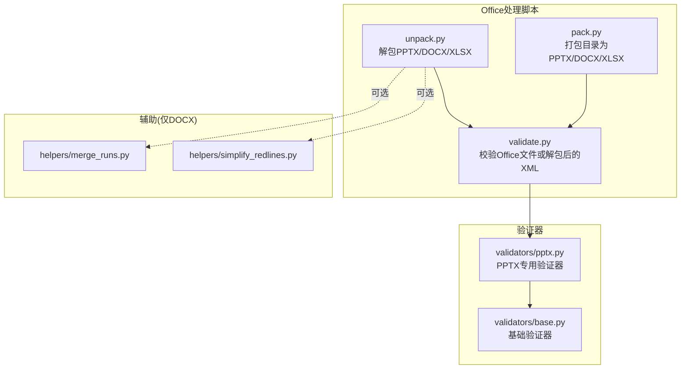
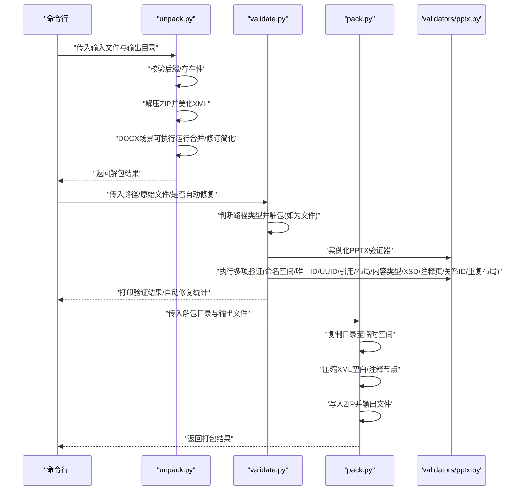
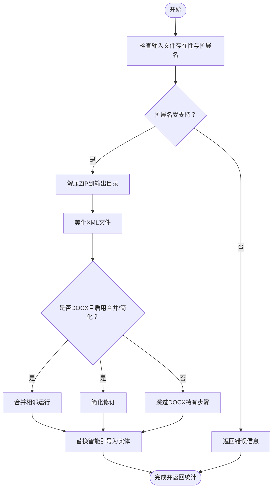
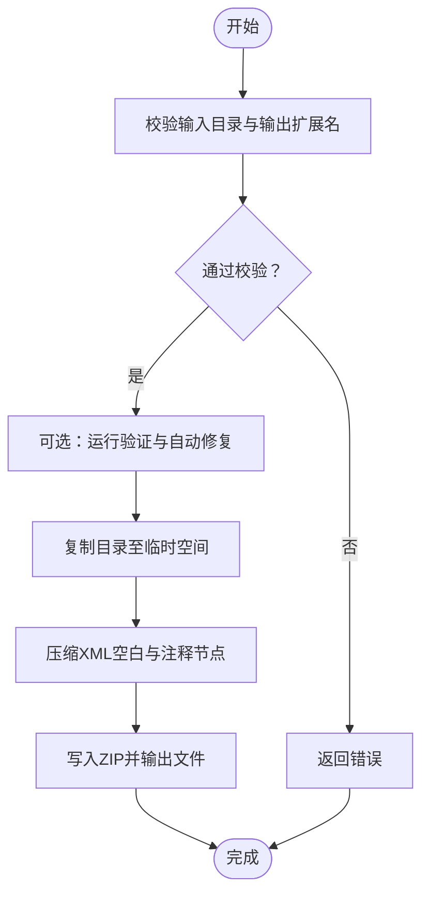
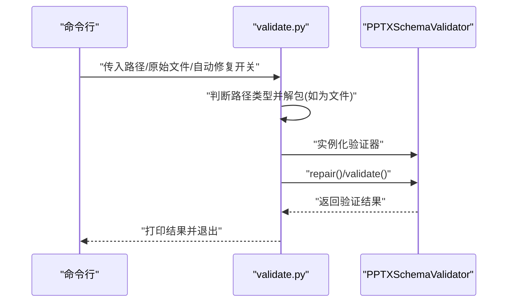
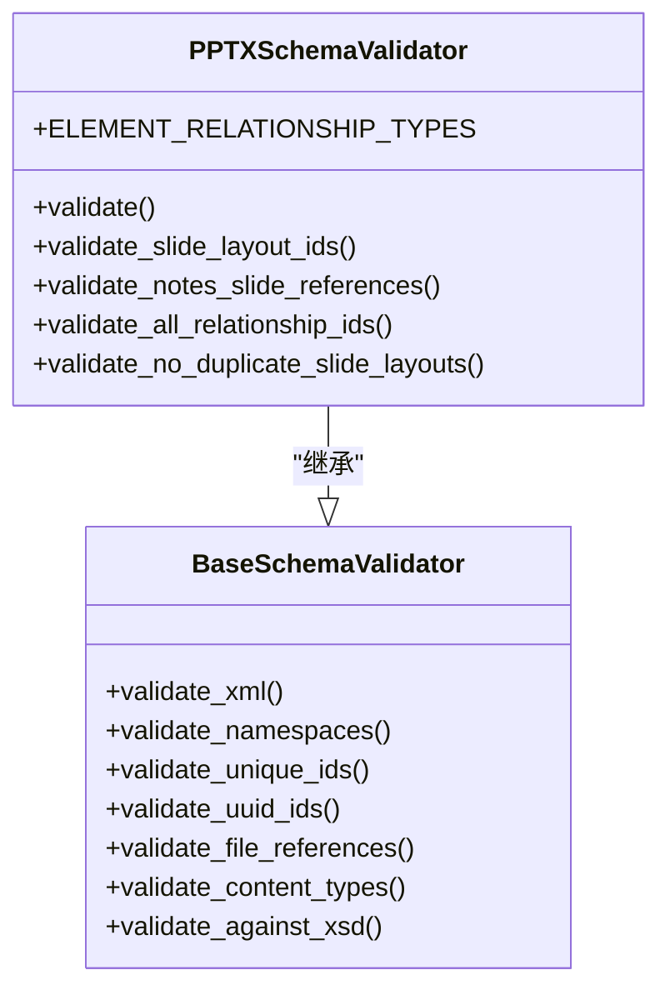
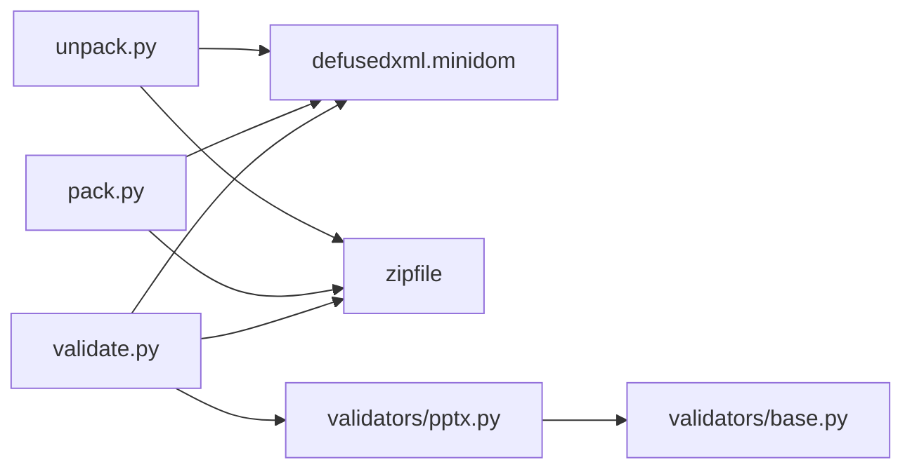

# PPTX演示文稿处理

<cite>
**本文引用的文件**
- [src/qwenpaw/agents/skills/docx/scripts/office/pack.py](file://src/qwenpaw/agents/skills/docx/scripts/office/pack.py)
- [src/qwenpaw/agents/skills/docx/scripts/office/unpack.py](file://src/qwenpaw/agents/skills/docx/scripts/office/unpack.py)
- [src/qwenpaw/agents/skills/docx/scripts/office/validate.py](file://src/qwenpaw/agents/skills/docx/scripts/office/validate.py)
- [src/qwenpaw/agents/skills/docx/scripts/office/validators/pptx.py](file://src/qwenpaw/agents/skills/docx/scripts/office/validators/pptx.py)
- [src/qwenpaw/agents/skills/docx/scripts/office/validators/base.py](file://src/qwenpaw/agents/skills/docx/scripts/office/validators/base.py)
- [src/qwenpaw/agents/skills/docx/scripts/office/helpers/merge_runs.py](file://src/qwenpaw/agents/skills/docx/scripts/office/helpers/merge_runs.py)
- [src/qwenpaw/agents/skills/docx/scripts/office/helpers/simplify_redlines.py](file://src/qwenpaw/agents/skills/docx/scripts/office/helpers/simplify_redlines.py)
- [src/qwenpaw/agents/skills/pptx/scripts/office/validators/pptx.py](file://src/qwenpaw/agents/skills/pptx/scripts/office/validators/pptx.py)
- [src/qwenpaw/agents/skills/pptx/scripts/office/validators/__init__.py](file://src/qwenpaw/agents/skills/pptx/scripts/office/validators/__init__.py)
</cite>

## 目录
1. [简介](#简介)
2. [项目结构](#项目结构)
3. [核心组件](#核心组件)
4. [架构总览](#架构总览)
5. [详细组件分析](#详细组件分析)
6. [依赖分析](#依赖分析)
7. [性能考虑](#性能考虑)
8. [故障排查指南](#故障排查指南)
9. [结论](#结论)
10. [附录](#附录)

## 简介
本技术文档围绕QwenPaw中与PPTX演示文稿处理相关的脚本与验证器展开，系统性说明PowerPoint演示文稿的ZIP结构与XML组织方式，覆盖解包、打包、校验、XML格式化与压缩、以及与PPTX结构相关的验证规则。文档同时给出基于现有代码的处理流程图与类关系图，帮助读者快速理解如何对PPTX进行编辑、修复与再打包。

## 项目结构
与PPTX处理直接相关的代码位于Office处理脚本与验证器模块中，主要包含：
- 解包与打包：unpack.py、pack.py
- 校验工具：validate.py
- 验证器：validators/pptx.py、validators/base.py
- 文档辅助处理（仅在DOCX场景）：helpers/merge_runs.py、helpers/simplify_redlines.py

**图表来源**
- [src/qwenpaw/agents/skills/docx/scripts/office/unpack.py:1-133](file://src/qwenpaw/agents/skills/docx/scripts/office/unpack.py#L1-L133)
- [src/qwenpaw/agents/skills/docx/scripts/office/pack.py:1-160](file://src/qwenpaw/agents/skills/docx/scripts/office/pack.py#L1-L160)
- [src/qwenpaw/agents/skills/docx/scripts/office/validate.py:1-112](file://src/qwenpaw/agents/skills/docx/scripts/office/validate.py#L1-L112)
- [src/qwenpaw/agents/skills/docx/scripts/office/validators/pptx.py:1-60](file://src/qwenpaw/agents/skills/docx/scripts/office/validators/pptx.py#L1-L60)
- [src/qwenpaw/agents/skills/docx/scripts/office/validators/base.py](file://src/qwenpaw/agents/skills/docx/scripts/office/validators/base.py)

**章节来源**
- [src/qwenpaw/agents/skills/docx/scripts/office/unpack.py:1-133](file://src/qwenpaw/agents/skills/docx/scripts/office/unpack.py#L1-L133)
- [src/qwenpaw/agents/skills/docx/scripts/office/pack.py:1-160](file://src/qwenpaw/agents/skills/docx/scripts/office/pack.py#L1-L160)
- [src/qwenpaw/agents/skills/docx/scripts/office/validate.py:1-112](file://src/qwenpaw/agents/skills/docx/scripts/office/validate.py#L1-L112)

## 核心组件
- 解包器（unpack）：负责将PPTX/DOCX/XLSX解压为可编辑的XML目录，美化XML格式，并在DOCX场景下进行运行合并与修订简化。
- 打包器（pack）：将已编辑的XML目录重新打包为PPTX/DOCX/XLSX，自动压缩XML空白节点，支持可选的验证与自动修复。
- 校验器（validate）：对已解包目录或原始Office文件进行XSD模式校验，支持自动修复常见问题。
- PPTX验证器：专门针对PresentationML命名空间、关系类型、唯一ID、UUID、文件引用、幻灯片布局ID、内容类型、注释页引用、关系ID一致性与重复布局检测等进行验证。
- 基础验证器：提供通用的XML校验、命名空间校验、唯一ID与UUID校验、文件引用校验、内容类型校验、XSD校验等能力。
- DOCX辅助：在解包时提供运行合并与修订简化的可选步骤（PPTX不适用）。

**章节来源**
- [src/qwenpaw/agents/skills/docx/scripts/office/unpack.py:34-79](file://src/qwenpaw/agents/skills/docx/scripts/office/unpack.py#L34-L79)
- [src/qwenpaw/agents/skills/docx/scripts/office/pack.py:24-66](file://src/qwenpaw/agents/skills/docx/scripts/office/pack.py#L24-L66)
- [src/qwenpaw/agents/skills/docx/scripts/office/validate.py:25-107](file://src/qwenpaw/agents/skills/docx/scripts/office/validate.py#L25-L107)
- [src/qwenpaw/agents/skills/docx/scripts/office/validators/pptx.py:10-60](file://src/qwenpaw/agents/skills/docx/scripts/office/validators/pptx.py#L10-L60)
- [src/qwenpaw/agents/skills/docx/scripts/office/validators/base.py](file://src/qwenpaw/agents/skills/docx/scripts/office/validators/base.py)

## 架构总览
下图展示了PPTX处理的整体流程：从输入Office文件到解包、编辑、校验与再打包的关键步骤。

**图表来源**
- [src/qwenpaw/agents/skills/docx/scripts/office/unpack.py:34-79](file://src/qwenpaw/agents/skills/docx/scripts/office/unpack.py#L34-L79)
- [src/qwenpaw/agents/skills/docx/scripts/office/validate.py:71-107](file://src/qwenpaw/agents/skills/docx/scripts/office/validate.py#L71-L107)
- [src/qwenpaw/agents/skills/docx/scripts/office/pack.py:24-66](file://src/qwenpaw/agents/skills/docx/scripts/office/pack.py#L24-L66)
- [src/qwenpaw/agents/skills/docx/scripts/office/validators/pptx.py:25-60](file://src/qwenpaw/agents/skills/docx/scripts/office/validators/pptx.py#L25-L60)

## 详细组件分析

### 组件A：解包器（unpack）
职责与流程
- 输入校验：确保输入文件存在且扩展名为受支持的Office类型。
- 解压：使用ZIP读取器解压到目标目录。
- XML美化：对所有XML与关系文件进行格式化，提升可读性。
- DOCX可选处理：在DOCX场景下，可选择合并相邻相同格式的运行与简化同一作者的修订。
- 智能引号转义：替换智能引号为HTML实体，避免渲染问题。
- 输出：返回解包数量与可选的合并/简化统计信息。

**图表来源**
- [src/qwenpaw/agents/skills/docx/scripts/office/unpack.py:34-79](file://src/qwenpaw/agents/skills/docx/scripts/office/unpack.py#L34-L79)
- [src/qwenpaw/agents/skills/docx/scripts/office/unpack.py:82-98](file://src/qwenpaw/agents/skills/docx/scripts/office/unpack.py#L82-L98)
- [src/qwenpaw/agents/skills/docx/scripts/office/helpers/merge_runs.py](file://src/qwenpaw/agents/skills/docx/scripts/office/helpers/merge_runs.py)
- [src/qwenpaw/agents/skills/docx/scripts/office/helpers/simplify_redlines.py](file://src/qwenpaw/agents/skills/docx/scripts/office/helpers/simplify_redlines.py)

**章节来源**
- [src/qwenpaw/agents/skills/docx/scripts/office/unpack.py:34-79](file://src/qwenpaw/agents/skills/docx/scripts/office/unpack.py#L34-L79)
- [src/qwenpaw/agents/skills/docx/scripts/office/unpack.py:82-98](file://src/qwenpaw/agents/skills/docx/scripts/office/unpack.py#L82-L98)

### 组件B：打包器（pack）
职责与流程
- 输入校验：确认输入目录存在且输出文件扩展名为受支持类型。
- 可选验证：若提供原始文件，调用验证器进行自动修复与校验。
- 临时目录：复制解包目录到临时空间，避免污染源目录。
- XML压缩：遍历XML与关系文件，移除空白文本节点与注释节点，减少体积。
- 再打包：以ZIP_DEFLATE压缩写入最终文件。

**图表来源**
- [src/qwenpaw/agents/skills/docx/scripts/office/pack.py:24-66](file://src/qwenpaw/agents/skills/docx/scripts/office/pack.py#L24-L66)
- [src/qwenpaw/agents/skills/docx/scripts/office/pack.py:69-105](file://src/qwenpaw/agents/skills/docx/scripts/office/pack.py#L69-L105)
- [src/qwenpaw/agents/skills/docx/scripts/office/pack.py:108-128](file://src/qwenpaw/agents/skills/docx/scripts/office/pack.py#L108-L128)

**章节来源**
- [src/qwenpaw/agents/skills/docx/scripts/office/pack.py:24-66](file://src/qwenpaw/agents/skills/docx/scripts/office/pack.py#L24-L66)
- [src/qwenpaw/agents/skills/docx/scripts/office/pack.py:69-105](file://src/qwenpaw/agents/skills/docx/scripts/office/pack.py#L69-L105)

### 组件C：校验器（validate）
职责与流程
- 路径解析：接受已解包目录或原始Office文件；若为文件则临时解包。
- 验证器选择：根据扩展名选择对应验证器（PPTX使用PPTXSchemaValidator）。
- 自动修复：可选开启自动修复（如ID与空格保留等常见问题）。
- 执行验证：依次执行多项验证并汇总结果，退出码指示成功与否。

**图表来源**
- [src/qwenpaw/agents/skills/docx/scripts/office/validate.py:25-107](file://src/qwenpaw/agents/skills/docx/scripts/office/validate.py#L25-L107)
- [src/qwenpaw/agents/skills/docx/scripts/office/validators/pptx.py:25-60](file://src/qwenpaw/agents/skills/docx/scripts/office/validators/pptx.py#L25-L60)

**章节来源**
- [src/qwenpaw/agents/skills/docx/scripts/office/validate.py:25-107](file://src/qwenpaw/agents/skills/docx/scripts/office/validate.py#L25-L107)

### 组件D：PPTX验证器（PPTXSchemaValidator）
职责与验证点
- XML有效性：确保XML语法正确。
- 命名空间：校验PresentationML命名空间。
- 唯一ID：检查各元素ID唯一性。
- UUID：校验UUID格式与一致性。
- 文件引用：校验内部文件引用完整性。
- 幻灯片布局ID：校验布局ID关联正确性。
- 内容类型：校验媒体与关系类型声明。
- XSD模式：依据标准XSD进行结构校验。
- 注释页引用：校验备注页与幻灯片关系。
- 关系ID一致性：校验关系表中ID一致性。
- 重复布局：防止出现重复的幻灯片布局定义。

**图表来源**
- [src/qwenpaw/agents/skills/docx/scripts/office/validators/pptx.py:10-60](file://src/qwenpaw/agents/skills/docx/scripts/office/validators/pptx.py#L10-L60)
- [src/qwenpaw/agents/skills/docx/scripts/office/validators/base.py](file://src/qwenpaw/agents/skills/docx/scripts/office/validators/base.py)

**章节来源**
- [src/qwenpaw/agents/skills/docx/scripts/office/validators/pptx.py:10-60](file://src/qwenpaw/agents/skills/docx/scripts/office/validators/pptx.py#L10-L60)

### 组件E：DOCX辅助（仅用于解包阶段）
- 运行合并：合并相邻具有相同格式的文本运行，减少冗余。
- 修订简化：将同一作者的相邻修订进行简化，降低复杂度。
- 该步骤不适用于PPTX，因此在PPTX处理中不会执行。

**章节来源**
- [src/qwenpaw/agents/skills/docx/scripts/office/helpers/merge_runs.py](file://src/qwenpaw/agents/skills/docx/scripts/office/helpers/merge_runs.py)
- [src/qwenpaw/agents/skills/docx/scripts/office/helpers/simplify_redlines.py](file://src/qwenpaw/agents/skills/docx/scripts/office/helpers/simplify_redlines.py)

## 依赖分析
- 组件耦合
  - 解包器与打包器均依赖ZIP读写与XML美化库，但彼此独立。
  - 校验器根据文件类型动态选择验证器，PPTX场景依赖PPTXSchemaValidator。
  - PPTXSchemaValidator继承基础验证器，复用通用校验逻辑。
- 外部依赖
  - 使用安全XML解析库进行XML美化与解析。
  - ZIP写入采用压缩算法，减少输出体积。
- 循环依赖
  - 未发现循环导入；验证器模块通过相对导入组织清晰。

**图表来源**
- [src/qwenpaw/agents/skills/docx/scripts/office/unpack.py:16-24](file://src/qwenpaw/agents/skills/docx/scripts/office/unpack.py#L16-L24)
- [src/qwenpaw/agents/skills/docx/scripts/office/pack.py:13-22](file://src/qwenpaw/agents/skills/docx/scripts/office/pack.py#L13-L22)
- [src/qwenpaw/agents/skills/docx/scripts/office/validate.py:16-22](file://src/qwenpaw/agents/skills/docx/scripts/office/validate.py#L16-L22)
- [src/qwenpaw/agents/skills/docx/scripts/office/validators/pptx.py](file://src/qwenpaw/agents/skills/docx/scripts/office/validators/pptx.py#L7)
- [src/qwenpaw/agents/skills/docx/scripts/office/validators/base.py](file://src/qwenpaw/agents/skills/docx/scripts/office/validators/base.py)

**章节来源**
- [src/qwenpaw/agents/skills/docx/scripts/office/unpack.py:16-24](file://src/qwenpaw/agents/skills/docx/scripts/office/unpack.py#L16-L24)
- [src/qwenpaw/agents/skills/docx/scripts/office/pack.py:13-22](file://src/qwenpaw/agents/skills/docx/scripts/office/pack.py#L13-L22)
- [src/qwenpaw/agents/skills/docx/scripts/office/validate.py:16-22](file://src/qwenpaw/agents/skills/docx/scripts/office/validate.py#L16-L22)

## 性能考虑
- XML压缩：在打包阶段移除空白与注释节点，显著减小文件体积，提升传输与存储效率。
- ZIP压缩：使用压缩算法写入最终文件，进一步降低体积。
- 解包与校验：建议在本地磁盘进行，避免频繁I/O；对大型文件可分步执行，先解包再逐步修改。
- 安全解析：使用安全XML解析库，避免过大或恶意XML导致内存与CPU压力。

## 故障排查指南
- 输入文件无效
  - 现象：提示“不是有效的Office文件”或“不存在”。
  - 排查：确认扩展名与文件存在性；检查ZIP完整性。
  - 参考
    - [src/qwenpaw/agents/skills/docx/scripts/office/unpack.py:44-48](file://src/qwenpaw/agents/skills/docx/scripts/office/unpack.py#L44-L48)
    - [src/qwenpaw/agents/skills/docx/scripts/office/unpack.py:76-79](file://src/qwenpaw/agents/skills/docx/scripts/office/unpack.py#L76-L79)
- 校验失败
  - 现象：验证器报告XSD错误或关系不一致。
  - 排查：开启自动修复；检查命名空间、ID唯一性、UUID、文件引用与布局ID。
  - 参考
    - [src/qwenpaw/agents/skills/docx/scripts/office/validate.py:97-107](file://src/qwenpaw/agents/skills/docx/scripts/office/validate.py#L97-L107)
    - [src/qwenpaw/agents/skills/docx/scripts/office/validators/pptx.py:25-60](file://src/qwenpaw/agents/skills/docx/scripts/office/validators/pptx.py#L25-L60)
- 打包失败
  - 现象：无法写入ZIP或XML解析异常。
  - 排查：确认临时目录权限；检查XML格式是否被破坏；必要时回滚到上一次有效备份。
  - 参考
    - [src/qwenpaw/agents/skills/docx/scripts/office/pack.py:52-66](file://src/qwenpaw/agents/skills/docx/scripts/office/pack.py#L52-L66)
    - [src/qwenpaw/agents/skills/docx/scripts/office/pack.py:108-128](file://src/qwenpaw/agents/skills/docx/scripts/office/pack.py#L108-L128)

**章节来源**
- [src/qwenpaw/agents/skills/docx/scripts/office/unpack.py:44-48](file://src/qwenpaw/agents/skills/docx/scripts/office/unpack.py#L44-L48)
- [src/qwenpaw/agents/skills/docx/scripts/office/unpack.py:76-79](file://src/qwenpaw/agents/skills/docx/scripts/office/unpack.py#L76-L79)
- [src/qwenpaw/agents/skills/docx/scripts/office/validate.py:97-107](file://src/qwenpaw/agents/skills/docx/scripts/office/validate.py#L97-L107)
- [src/qwenpaw/agents/skills/docx/scripts/office/pack.py:52-66](file://src/qwenpaw/agents/skills/docx/scripts/office/pack.py#L52-L66)

## 结论
通过对QwenPaw中Office处理脚本与验证器的分析，可以形成一套完整的PPTX编辑工作流：解包—编辑—校验—再打包。该流程充分利用了ZIP结构与XML组织特性，在保证合规性的同时优化了文件体积与可维护性。对于PPTX特有的结构（如幻灯片、母版、主题、布局与关系），验证器提供了针对性的校验规则，确保生成的演示文稿符合PresentationML规范。

## 附录
- PPTX处理常用命令
  - 解包：python unpack.py presentation.pptx unpacked/
  - 校验：python validate.py unpacked/ 或 python validate.py presentation.pptx --original presentation.pptx --auto-repair
  - 打包：python pack.py unpacked/ output.pptx
- 注意事项
  - DOCX特有步骤（运行合并与修订简化）不适用于PPTX。
  - 在修改XML后务必进行校验，避免关系与ID不一致导致播放异常。