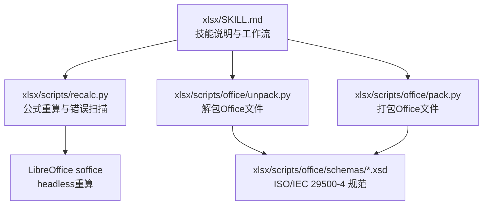
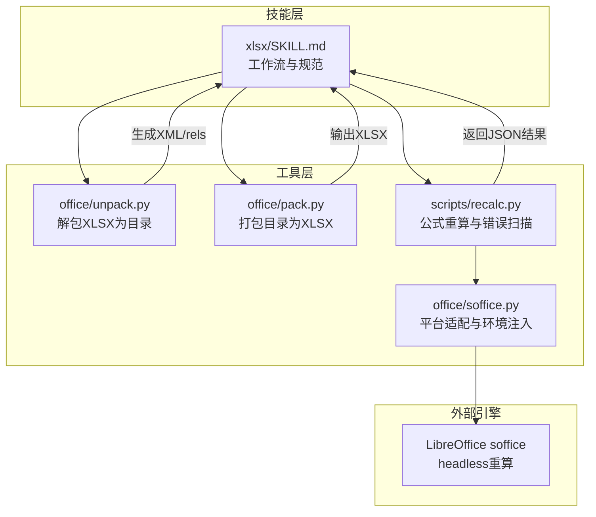
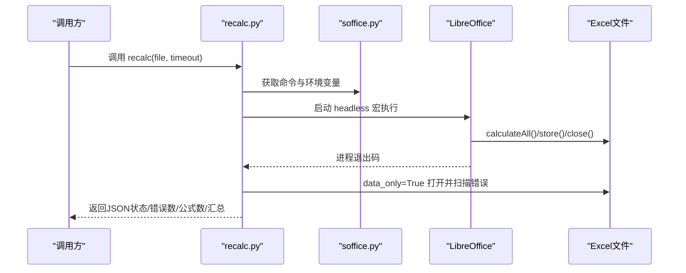
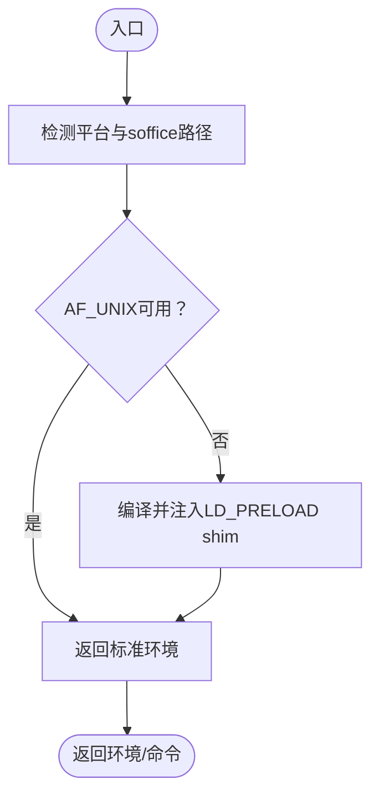
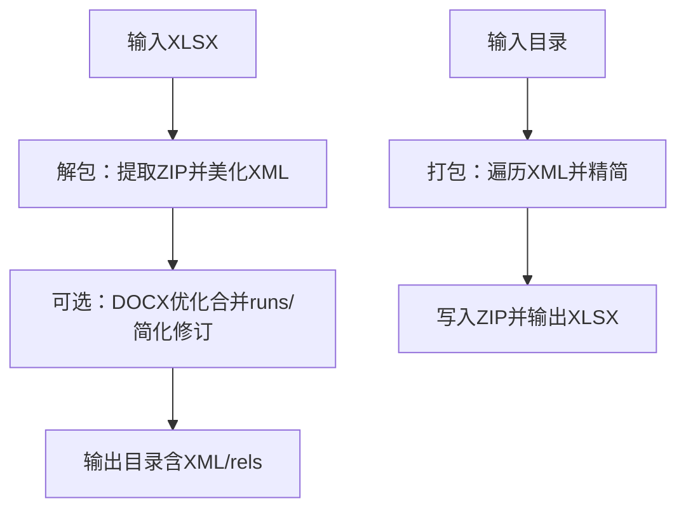
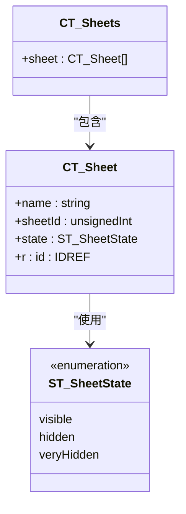
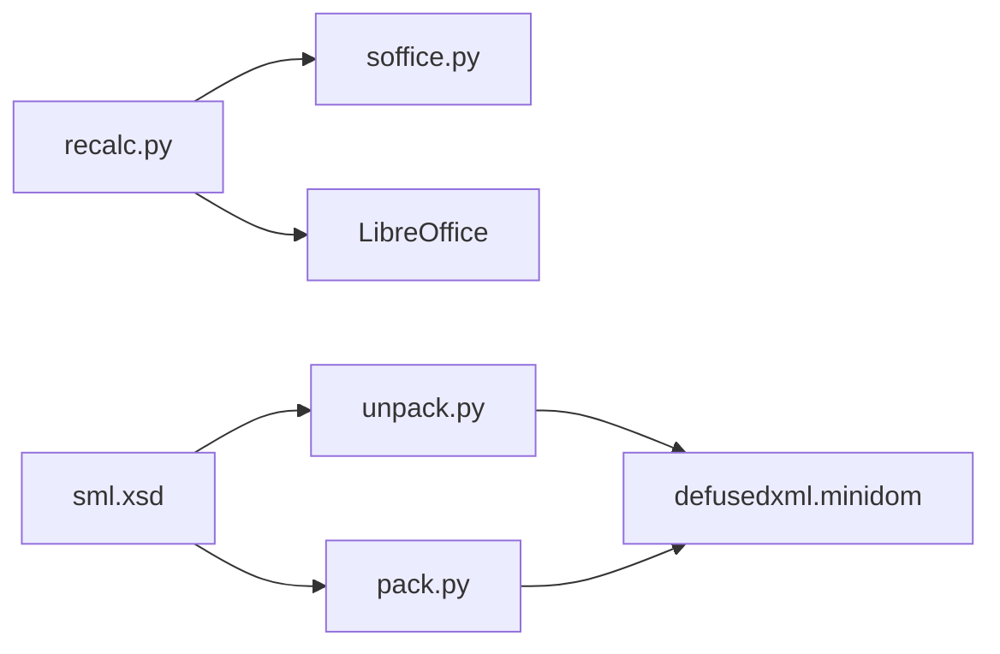

# XLSX电子表格处理

<cite>
**本文档引用的文件**
- [xlsx/SKILL.md](file://src/qwenpaw/agents/skills/xlsx/SKILL.md)
- [xlsx/scripts/recalc.py](file://src/qwenpaw/agents/skills/xlsx/scripts/recalc.py)
- [xlsx/scripts/office/soffice.py](file://src/qwenpaw/agents/skills/xlsx/scripts/office/soffice.py)
- [xlsx/scripts/office/pack.py](file://src/qwenpaw/agents/skills/xlsx/scripts/office/pack.py)
- [xlsx/scripts/office/unpack.py](file://src/qwenpaw/agents/skills/xlsx/scripts/office/unpack.py)
- [xlsx/scripts/office/schemas/ISO-IEC29500-4_2016/sml.xsd](file://src/qwenpaw/agents/skills/xlsx/scripts/office/schemas/ISO-IEC29500-4_2016/sml.xsd)
</cite>

## 目录
1. [简介](#简介)
2. [项目结构](#项目结构)
3. [核心组件](#核心组件)
4. [架构总览](#架构总览)
5. [详细组件分析](#详细组件分析)
6. [依赖关系分析](#依赖关系分析)
7. [性能考虑](#性能考虑)
8. [故障排查指南](#故障排查指南)
9. [结论](#结论)
10. [附录](#附录)

## 简介
本文件面向QwenPaw项目中的XLSX电子表格处理技能，系统化梳理其基于ZIP容器与XML规范的底层结构、工作簿与工作表组织方式、单元格数据类型处理、公式计算与校验、以及基于LibreOffice的动态重算流程。同时结合仓库中提供的脚本工具，给出可落地的读写、编辑、校验与打包/解包的工作流建议，帮助开发者在企业级场景中实现高性能、可维护的XLSX处理能力。

## 项目结构
XLSX技能位于agents/skills/xlsx目录，围绕“技能说明文档 + 脚本工具”的结构组织：
- 技能说明：xlsx/SKILL.md，定义使用范围、最佳实践、公式校验要求与工作流
- 办公文档通用工具：xlsx/scripts/office/ 下的unpack.py、pack.py、soffice.py，以及schemas目录下的XSD规范
- 公式重算：xlsx/scripts/recalc.py，封装LibreOffice自动化调用与错误扫描

**图示来源**
- [xlsx/SKILL.md:1-306](file://src/qwenpaw/agents/skills/xlsx/SKILL.md#L1-L306)
- [xlsx/scripts/recalc.py:1-210](file://src/qwenpaw/agents/skills/xlsx/scripts/recalc.py#L1-L210)
- [xlsx/scripts/office/unpack.py:1-133](file://src/qwenpaw/agents/skills/xlsx/scripts/office/unpack.py#L1-L133)
- [xlsx/scripts/office/pack.py:1-160](file://src/qwenpaw/agents/skills/xlsx/scripts/office/pack.py#L1-L160)
- [xlsx/scripts/office/schemas/ISO-IEC29500-4_2016/sml.xsd:4194-4226](file://src/qwenpaw/agents/skills/xlsx/scripts/office/schemas/ISO-IEC29500-4_2016/sml.xsd#L4194-L4226)

**章节来源**
- [xlsx/SKILL.md:1-306](file://src/qwenpaw/agents/skills/xlsx/SKILL.md#L1-L306)

## 核心组件
- 工作簿与工作表元数据：通过sml.xsd中的CT_Sheets/CT_Sheet结构描述工作簿中sheet集合及其属性（名称、sheetId、状态、关系ID）
- 解包与打包：unpack.py负责将XLSX解压为目录并美化XML；pack.py负责将目录压缩回XLSX并进行XML精简与可选校验
- 公式重算：recalc.py通过LibreOffice soffice以headless模式执行宏，触发calculateAll并扫描常见Excel错误类型
- 平台适配：soffice.py在受限环境中自动注入LD_PRELOAD以绕过AF_UNIX套接字限制

**章节来源**
- [xlsx/scripts/office/schemas/ISO-IEC29500-4_2016/sml.xsd:4194-4226](file://src/qwenpaw/agents/skills/xlsx/scripts/office/schemas/ISO-IEC29500-4_2016/sml.xsd#L4194-L4226)
- [xlsx/scripts/office/unpack.py:1-133](file://src/qwenpaw/agents/skills/xlsx/scripts/office/unpack.py#L1-L133)
- [xlsx/scripts/office/pack.py:1-160](file://src/qwenpaw/agents/skills/xlsx/scripts/office/pack.py#L1-L160)
- [xlsx/scripts/recalc.py:1-210](file://src/qwenpaw/agents/skills/xlsx/scripts/recalc.py#L1-L210)
- [xlsx/scripts/office/soffice.py:1-219](file://src/qwenpaw/agents/skills/xlsx/scripts/office/soffice.py#L1-L219)

## 架构总览
下图展示XLSX处理的整体架构：技能层（SKILL.md）定义工作流与约束；工具层（unpack/pack/recalc/soffice）提供底层能力；LibreOffice作为外部引擎完成公式重算与保存。

**图示来源**
- [xlsx/SKILL.md:78-240](file://src/qwenpaw/agents/skills/xlsx/SKILL.md#L78-L240)
- [xlsx/scripts/office/unpack.py:34-75](file://src/qwenpaw/agents/skills/xlsx/scripts/office/unpack.py#L34-L75)
- [xlsx/scripts/office/pack.py:24-66](file://src/qwenpaw/agents/skills/xlsx/scripts/office/pack.py#L24-L66)
- [xlsx/scripts/recalc.py:80-186](file://src/qwenpaw/agents/skills/xlsx/scripts/recalc.py#L80-L186)
- [xlsx/scripts/office/soffice.py:26-64](file://src/qwenpaw/agents/skills/xlsx/scripts/office/soffice.py#L26-L64)

## 详细组件分析

### 组件A：公式重算与错误扫描（recalc.py）
职责与流程：
- 自动配置LibreOffice宏（首次运行时写入Macro1.xba）
- 以headless模式调用soffice执行宏，触发calculateAll并保存
- 使用data_only=True加载工作簿，遍历所有单元格，识别常见Excel错误字符串（如#REF!、#DIV/0!等）
- 统计错误总数与按类型分组的位置列表，同时统计公式数量
- 返回JSON结构，便于上层工作流判断与修复

**图示来源**
- [xlsx/scripts/recalc.py:80-186](file://src/qwenpaw/agents/skills/xlsx/scripts/recalc.py#L80-L186)
- [xlsx/scripts/office/soffice.py:26-64](file://src/qwenpaw/agents/skills/xlsx/scripts/office/soffice.py#L26-L64)

**章节来源**
- [xlsx/scripts/recalc.py:1-210](file://src/qwenpaw/agents/skills/xlsx/scripts/recalc.py#L1-L210)

### 组件B：LibreOffice平台适配（soffice.py）
职责与流程：
- 检测当前平台，优先使用PATH中的soffice，Windows下补充多种候选路径
- 在Linux受限环境下检测AF_UNIX套接字是否可用，必要时编译并注入LD_PRELOAD shim以绕过限制
- 提供get_soffice_env/get_soffice_cmd接口，供其他模块复用

**图示来源**
- [xlsx/scripts/office/soffice.py:26-100](file://src/qwenpaw/agents/skills/xlsx/scripts/office/soffice.py#L26-L100)

**章节来源**
- [xlsx/scripts/office/soffice.py:1-219](file://src/qwenpaw/agents/skills/xlsx/scripts/office/soffice.py#L1-L219)

### 组件C：XLSX解包与打包（unpack.py / pack.py）
职责与流程：
- 解包：校验输入为XLSX，解压至目标目录，美化XML，对DOCX执行额外的排版优化（合并runs、简化修订）
- 打包：将目录内容压缩为XLSX，对XML进行精简（去除空白文本节点与注释），可选与原始文件对比校验

**图示来源**
- [xlsx/scripts/office/unpack.py:34-75](file://src/qwenpaw/agents/skills/xlsx/scripts/office/unpack.py#L34-L75)
- [xlsx/scripts/office/pack.py:24-66](file://src/qwenpaw/agents/skills/xlsx/scripts/office/pack.py#L24-L66)

**章节来源**
- [xlsx/scripts/office/unpack.py:1-133](file://src/qwenpaw/agents/skills/xlsx/scripts/office/unpack.py#L1-L133)
- [xlsx/scripts/office/pack.py:1-160](file://src/qwenpaw/agents/skills/xlsx/scripts/office/pack.py#L1-L160)

### 组件D：工作簿与工作表结构（sml.xsd）
- CT_Sheets：包含多个sheet元素
- CT_Sheet：关键属性包括name、sheetId、state（visible/hidden/veryHidden）、r:id（关系ID）

**图示来源**
- [xlsx/scripts/office/schemas/ISO-IEC29500-4_2016/sml.xsd:4194-4226](file://src/qwenpaw/agents/skills/xlsx/scripts/office/schemas/ISO-IEC29500-4_2016/sml.xsd#L4194-L4226)

**章节来源**
- [xlsx/scripts/office/schemas/ISO-IEC29500-4_2016/sml.xsd:4194-4226](file://src/qwenpaw/agents/skills/xlsx/scripts/office/schemas/ISO-IEC29500-4_2016/sml.xsd#L4194-L4226)

## 依赖关系分析
- recalc.py依赖soffice.py提供的命令与环境，间接依赖LibreOffice
- unpack.py/pack.py依赖defusedxml.minidom进行XML解析与美化
- sml.xsd为工作簿/工作表结构的权威规范来源

**图示来源**
- [xlsx/scripts/recalc.py:13-15](file://src/qwenpaw/agents/skills/xlsx/scripts/recalc.py#L13-L15)
- [xlsx/scripts/office/soffice.py:26-64](file://src/qwenpaw/agents/skills/xlsx/scripts/office/soffice.py#L26-L64)
- [xlsx/scripts/office/unpack.py:20-24](file://src/qwenpaw/agents/skills/xlsx/scripts/office/unpack.py#L20-L24)
- [xlsx/scripts/office/pack.py:20-22](file://src/qwenpaw/agents/skills/xlsx/scripts/office/pack.py#L20-L22)
- [xlsx/scripts/office/schemas/ISO-IEC29500-4_2016/sml.xsd:4194-4226](file://src/qwenpaw/agents/skills/xlsx/scripts/office/schemas/ISO-IEC29500-4_2016/sml.xsd#L4194-L4226)

**章节来源**
- [xlsx/scripts/recalc.py:1-210](file://src/qwenpaw/agents/skills/xlsx/scripts/recalc.py#L1-L210)
- [xlsx/scripts/office/unpack.py:1-133](file://src/qwenpaw/agents/skills/xlsx/scripts/office/unpack.py#L1-L133)
- [xlsx/scripts/office/pack.py:1-160](file://src/qwenpaw/agents/skills/xlsx/scripts/office/pack.py#L1-L160)
- [xlsx/scripts/office/schemas/ISO-IEC29500-4_2016/sml.xsd:4194-4226](file://src/qwenpaw/agents/skills/xlsx/scripts/office/schemas/ISO-IEC29500-4_2016/sml.xsd#L4194-L4226)

## 性能考虑
- 大文件读取：优先使用openpyxl的read_only或write_only模式（见技能说明），减少内存占用
- 批量XML处理：pack.py对XML进行精简，降低文件体积与后续解析成本
- 公式重算：合理设置timeout，避免长时间阻塞；仅在需要动态值时执行重算
- 平台适配：soffice.py在Linux受限环境下自动注入shim，避免因套接字问题导致的失败重试

**章节来源**
- [xlsx/SKILL.md:289-295](file://src/qwenpaw/agents/skills/xlsx/SKILL.md#L289-L295)
- [xlsx/scripts/office/pack.py:108-129](file://src/qwenpaw/agents/skills/xlsx/scripts/office/pack.py#L108-L129)
- [xlsx/scripts/recalc.py:97-102](file://src/qwenpaw/agents/skills/xlsx/scripts/recalc.py#L97-L102)
- [xlsx/scripts/office/soffice.py:76-100](file://src/qwenpaw/agents/skills/xlsx/scripts/office/soffice.py#L76-L100)

## 故障排查指南
- LibreOffice宏未正确配置：检查宏文件是否存在且包含指定子程序名；确认soffice命令可用
- 套接字受限导致连接失败：Linux环境启用LD_PRELOAD shim；Windows/macOS无需此步骤
- 公式错误定位：根据recalc.py返回的error_summary定位具体单元格位置，逐项修复
- 文件损坏或格式不合法：使用unpack.py先解包验证XML结构，再用pack.py重新打包

**章节来源**
- [xlsx/scripts/recalc.py:54-78](file://src/qwenpaw/agents/skills/xlsx/scripts/recalc.py#L54-L78)
- [xlsx/scripts/office/soffice.py:76-100](file://src/qwenpaw/agents/skills/xlsx/scripts/office/soffice.py#L76-L100)
- [xlsx/scripts/office/unpack.py:76-79](file://src/qwenpaw/agents/skills/xlsx/scripts/office/unpack.py#L76-L79)
- [xlsx/scripts/office/pack.py:38-39](file://src/qwenpaw/agents/skills/xlsx/scripts/office/pack.py#L38-L39)

## 结论
本技能以“规范+工具+引擎”三位一体的方式实现XLSX处理：以sml.xsd为结构依据，以unpack/pack工具保障ZIP/XML一致性，以recalc+LibreOffice实现公式动态重算与错误扫描。配合平台适配与性能优化策略，可在企业级场景中稳定地完成从数据读取、编辑、公式计算到最终交付的全流程。

## 附录
- 单元格数据类型与公式：遵循技能说明中的“零公式错误”与“使用公式而非硬编码值”的原则
- 工作簿/工作表元数据：参考sml.xsd中的CT_Sheets/CT_Sheet结构
- 打包/解包：用于快速迭代与校验，建议在CI中开启XML精简与可选校验

**章节来源**
- [xlsx/SKILL.md:15-71](file://src/qwenpaw/agents/skills/xlsx/SKILL.md#L15-L71)
- [xlsx/scripts/office/schemas/ISO-IEC29500-4_2016/sml.xsd:4194-4226](file://src/qwenpaw/agents/skills/xlsx/scripts/office/schemas/ISO-IEC29500-4_2016/sml.xsd#L4194-L4226)
- [xlsx/scripts/office/unpack.py:34-75](file://src/qwenpaw/agents/skills/xlsx/scripts/office/unpack.py#L34-L75)
- [xlsx/scripts/office/pack.py:24-66](file://src/qwenpaw/agents/skills/xlsx/scripts/office/pack.py#L24-L66)