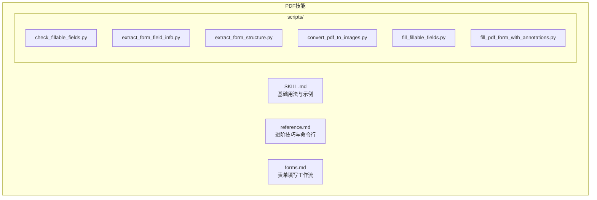
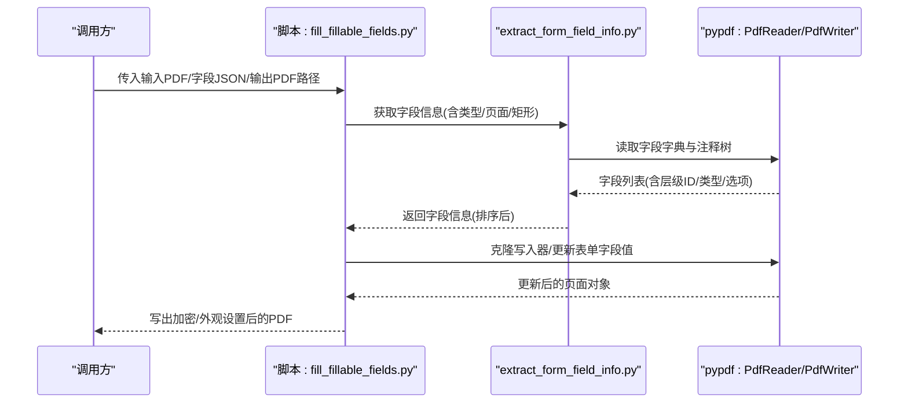
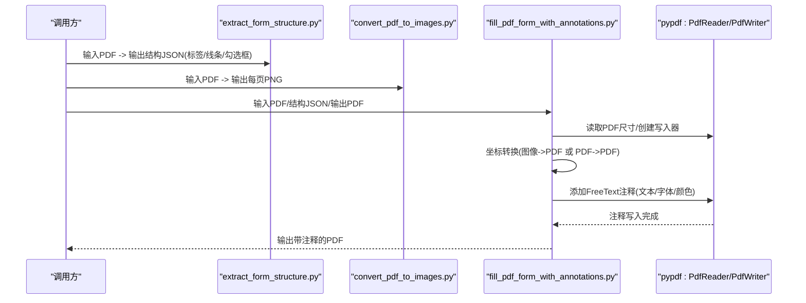
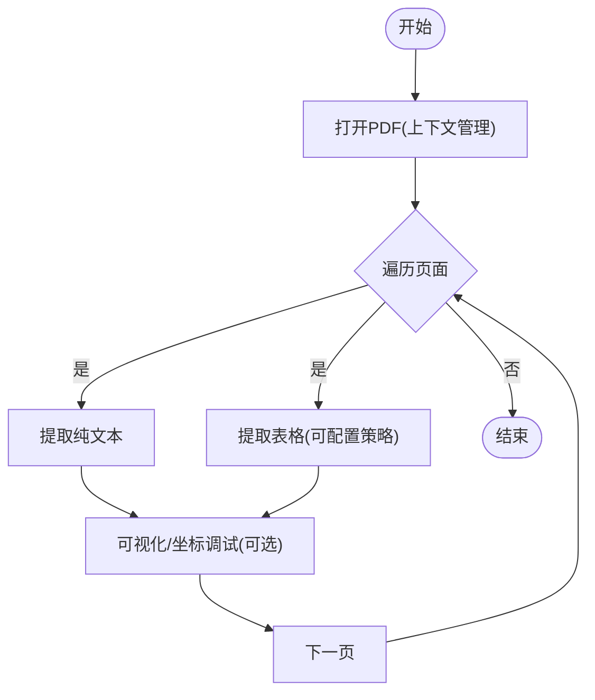
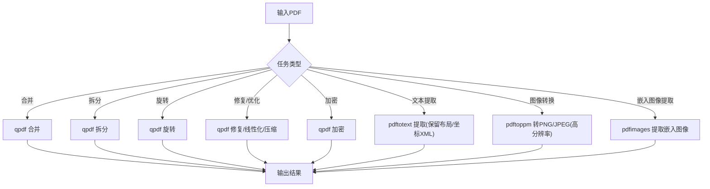
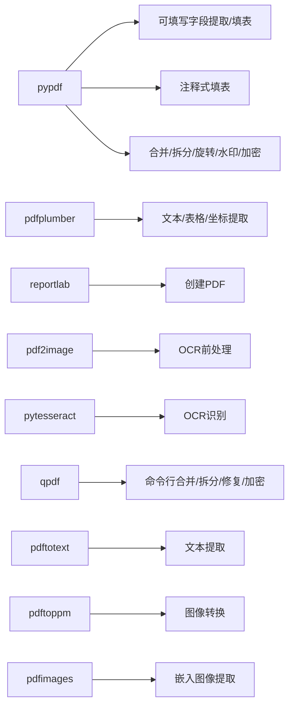

# PDF处理技能

<cite>
**本文引用的文件**
- [SKILL.md](file://src/qwenpaw/agents/skills/pdf/SKILL.md)
- [reference.md](file://src/qwenpaw/agents/skills/pdf/reference.md)
- [forms.md](file://src/qwenpaw/agents/skills/pdf/forms.md)
- [convert_pdf_to_images.py](file://src/qwenpaw/agents/skills/pdf/scripts/convert_pdf_to_images.py)
- [fill_fillable_fields.py](file://src/qwenpaw/agents/skills/pdf/scripts/fill_fillable_fields.py)
- [fill_pdf_form_with_annotations.py](file://src/qwenpaw/agents/skills/pdf/scripts/fill_pdf_form_with_annotations.py)
- [extract_form_field_info.py](file://src/qwenpaw/agents/skills/pdf/scripts/extract_form_field_info.py)
- [extract_form_structure.py](file://src/qwenpaw/agents/skills/pdf/scripts/extract_form_structure.py)
- [check_fillable_fields.py](file://src/qwenpaw/agents/skills/pdf/scripts/check_fillable_fields.py)
</cite>

## 目录
1. [简介](#简介)
2. [项目结构](#项目结构)
3. [核心组件](#核心组件)
4. [架构总览](#架构总览)
5. [详细组件分析](#详细组件分析)
6. [依赖分析](#依赖分析)
7. [性能考虑](#性能考虑)
8. [故障排查指南](#故障排查指南)
9. [结论](#结论)
10. [附录](#附录)

## 简介
本技术文档面向QwenPaw的PDF处理技能，系统化梳理并讲解PDF文件的多种处理能力：文本提取、表格识别、PDF合并与分割、页面旋转、水印添加、PDF创建、表单填写（可填写字段与非可填写字段）、加密与解密、图片提取以及扫描版PDF的OCR识别等。文档同时覆盖pypdf、pdfplumber、reportlab、pdftotext、pdftoppm、qpdf等工具库的使用方法与最佳实践，并提供命令行工具的使用指南与高级功能说明。为便于工程落地，文档给出关键流程的时序图与类图，帮助读者快速理解与扩展。

## 项目结构
PDF处理技能位于技能目录下，采用“技能说明 + 脚本工具”的组织方式：
- 技能说明文档：SKILL.md（基础用法与示例）、reference.md（进阶技巧与命令行）、forms.md（表单填写工作流）
- 脚本工具：scripts/ 下的多个Python脚本，分别负责表单字段信息提取、结构提取、图像转换、注释式填表、可填写字段填表等



**图表来源**
- [SKILL.md](file://src/qwenpaw/agents/skills/pdf/SKILL.md)
- [reference.md](file://src/qwenpaw/agents/skills/pdf/reference.md)
- [forms.md](file://src/qwenpaw/agents/skills/pdf/forms.md)
- [check_fillable_fields.py](file://src/qwenpaw/agents/skills/pdf/scripts/check_fillable_fields.py)
- [extract_form_field_info.py](file://src/qwenpaw/agents/skills/pdf/scripts/extract_form_field_info.py)
- [extract_form_structure.py](file://src/qwenpaw/agents/skills/pdf/scripts/extract_form_structure.py)
- [convert_pdf_to_images.py](file://src/qwenpaw/agents/skills/pdf/scripts/convert_pdf_to_images.py)
- [fill_fillable_fields.py](file://src/qwenpaw/agents/skills/pdf/scripts/fill_fillable_fields.py)
- [fill_pdf_form_with_annotations.py](file://src/qwenpaw/agents/skills/pdf/scripts/fill_pdf_form_with_annotations.py)

**章节来源**
- [SKILL.md](file://src/qwenpaw/agents/skills/pdf/SKILL.md)
- [reference.md](file://src/qwenpaw/agents/skills/pdf/reference.md)
- [forms.md](file://src/qwenpaw/agents/skills/pdf/forms.md)

## 核心组件
- 文本与表格提取：基于pdfplumber进行布局感知的文本与表格抽取；pypdf用于基础文本提取与元数据读取
- PDF创建与编辑：基于reportlab生成PDF；pypdf进行合并、拆分、旋转、加水印、加密/解密、裁剪等
- 表单处理：可填写字段通过pypdf直接赋值；非可填写字段通过结构提取与注释标注的方式进行填表
- 图像与OCR：pdfimages/pdftoppm进行图像提取；结合pytesseract对扫描版PDF进行OCR识别
- 命令行工具：qpdf、pdftotext、pdftoppm、pdfimages等，支持批量与高性能处理

**章节来源**
- [SKILL.md](file://src/qwenpaw/agents/skills/pdf/SKILL.md)
- [reference.md](file://src/qwenpaw/agents/skills/pdf/reference.md)
- [forms.md](file://src/qwenpaw/agents/skills/pdf/forms.md)

## 架构总览
下图展示了PDF处理技能的整体架构与关键交互：

```mermaid
graph TB
U["用户/调用方"]
subgraph "Python库层"
P1["pypdf<br/>读写/合并/拆分/旋转/水印/加密"]
P2["pdfplumber<br/>文本/表格/坐标"]
P3["reportlab<br/>创建PDF"]
P4["pdf2image<br/>PDF转图像"]
P5["pytesseract<br/>OCR识别"]
end
subgraph "命令行工具"
C1["qpdf<br/>合并/拆分/旋转/修复/加密"]
C2["pdftotext<br/>文本提取"]
C3["pdftoppm<br/>图像转换"]
C4["pdfimages<br/>嵌入图像提取"]
end
subgraph "脚本工具"
S1["check_fillable_fields.py"]
S2["extract_form_field_info.py"]
S3["extract_form_structure.py"]
S4["convert_pdf_to_images.py"]
S5["fill_fillable_fields.py"]
S6["fill_pdf_form_with_annotations.py"]
end
U --> P1
U --> P2
U --> P3
U --> P4
U --> P5
U --> C1
U --> C2
U --> C3
U --> C4
P1 <- --> S5
P1 <- --> S6
P2 <- --> S3
P4 <- --> S4
P1 <- --> S1
P1 <- --> S2
```

**图表来源**
- [SKILL.md](file://src/qwenpaw/agents/skills/pdf/SKILL.md)
- [reference.md](file://src/qwenpaw/agents/skills/pdf/reference.md)
- [forms.md](file://src/qwenpaw/agents/skills/pdf/forms.md)
- [check_fillable_fields.py](file://src/qwenpaw/agents/skills/pdf/scripts/check_fillable_fields.py)
- [extract_form_field_info.py](file://src/qwenpaw/agents/skills/pdf/scripts/extract_form_field_info.py)
- [extract_form_structure.py](file://src/qwenpaw/agents/skills/pdf/scripts/extract_form_structure.py)
- [convert_pdf_to_images.py](file://src/qwenpaw/agents/skills/pdf/scripts/convert_pdf_to_images.py)
- [fill_fillable_fields.py](file://src/qwenpaw/agents/skills/pdf/scripts/fill_fillable_fields.py)
- [fill_pdf_form_with_annotations.py](file://src/qwenpaw/agents/skills/pdf/scripts/fill_pdf_form_with_annotations.py)

## 详细组件分析

### 组件A：表单可填写字段处理（pypdf）
该组件负责检测PDF是否具备可填写字段、提取字段信息、校验字段值并写回PDF。



**图表来源**
- [fill_fillable_fields.py](file://src/qwenpaw/agents/skills/pdf/scripts/fill_fillable_fields.py)
- [extract_form_field_info.py](file://src/qwenpaw/agents/skills/pdf/scripts/extract_form_field_info.py)

**章节来源**
- [fill_fillable_fields.py](file://src/qwenpaw/agents/skills/pdf/scripts/fill_fillable_fields.py)
- [extract_form_field_info.py](file://src/qwenpaw/agents/skills/pdf/scripts/extract_form_field_info.py)

### 组件B：非可填写字段注释式填表（pypdf + pdfplumber）
该组件通过结构提取或图像视觉估计，计算字段坐标并以FreeText注释形式填入文本。



**图表来源**
- [extract_form_structure.py](file://src/qwenpaw/agents/skills/pdf/scripts/extract_form_structure.py)
- [convert_pdf_to_images.py](file://src/qwenpaw/agents/skills/pdf/scripts/convert_pdf_to_images.py)
- [fill_pdf_form_with_annotations.py](file://src/qwenpaw/agents/skills/pdf/scripts/fill_pdf_form_with_annotations.py)

**章节来源**
- [forms.md](file://src/qwenpaw/agents/skills/pdf/forms.md)
- [extract_form_structure.py](file://src/qwenpaw/agents/skills/pdf/scripts/extract_form_structure.py)
- [convert_pdf_to_images.py](file://src/qwenpaw/agents/skills/pdf/scripts/convert_pdf_to_images.py)
- [fill_pdf_form_with_annotations.py](file://src/qwenpaw/agents/skills/pdf/scripts/fill_pdf_form_with_annotations.py)

### 组件C：文本与表格提取（pdfplumber）
该组件提供布局感知的文本与表格抽取，并支持坐标级调试与自定义表格提取策略。



**图表来源**
- [reference.md](file://src/qwenpaw/agents/skills/pdf/reference.md)

**章节来源**
- [reference.md](file://src/qwenpaw/agents/skills/pdf/reference.md)

### 组件D：命令行工具链（qpdf、pdftotext、pdftoppm、pdfimages）
该组件提供高性能的批处理能力，适合大文件与批量任务。



**图表来源**
- [reference.md](file://src/qwenpaw/agents/skills/pdf/reference.md)

**章节来源**
- [reference.md](file://src/qwenpaw/agents/skills/pdf/reference.md)

## 依赖分析
- pypdf：核心PDF读写与表单处理，支持合并/拆分/旋转/水印/加密/裁剪/注释
- pdfplumber：文本/表格/坐标提取，适合结构化数据与布局分析
- reportlab：从零创建PDF，适合报告与模板生成
- pdf2image + pytesseract：扫描版PDF OCR识别
- poppler-utils(qpdf/pdftotext/pdftoppm/pdfimages)：命令行工具，适合批处理与高性能场景
- 脚本工具：围绕pypdf与pdfplumber构建的表单处理流水线



**图表来源**
- [SKILL.md](file://src/qwenpaw/agents/skills/pdf/SKILL.md)
- [reference.md](file://src/qwenpaw/agents/skills/pdf/reference.md)
- [forms.md](file://src/qwenpaw/agents/skills/pdf/forms.md)

**章节来源**
- [SKILL.md](file://src/qwenpaw/agents/skills/pdf/SKILL.md)
- [reference.md](file://src/qwenpaw/agents/skills/pdf/reference.md)
- [forms.md](file://src/qwenpaw/agents/skills/pdf/forms.md)

## 性能考虑
- 大PDF处理：优先使用命令行工具（如qpdf）进行拆分与线性化；或采用分块写入（按页范围写入）
- 文本提取：纯文本优先pdftotext；结构化数据优先pdfplumber；避免一次性加载超大PDF到内存
- 图像提取：pdfimages比渲染页面更快；预览用低分辨率，最终输出用高分辨率
- 表单填充：pdf-lib在JavaScript环境维护表单结构更佳；Python端pypdf直接赋值更快
- 内存管理：分页迭代、及时释放资源、避免重复加载同一PDF

**章节来源**
- [reference.md](file://src/qwenpaw/agents/skills/pdf/reference.md)

## 故障排查指南
- 加密PDF：先尝试pypdf解密；若失败，使用qpdf修复或重制
- 文本提取异常：扫描版PDF优先OCR；确认pdftotext版本与参数；必要时降级到pdfplumber
- 表单字段缺失：检查字段类型与层级ID；核对checkbox/radio/choice的值集合
- 坐标不匹配：统一坐标系（PDF或图像），确保宽高一致；使用脚本校验边界框
- 批量处理：加入日志记录与异常捕获，逐个文件处理并记录失败原因

**章节来源**
- [reference.md](file://src/qwenpaw/agents/skills/pdf/reference.md)
- [forms.md](file://src/qwenpaw/agents/skills/pdf/forms.md)

## 结论
QwenPaw的PDF处理技能以pypdf为核心，结合pdfplumber、reportlab与poppler-utils命令行工具，形成从结构化提取到复杂编辑与批处理的完整能力矩阵。对于表单处理，既支持可填写字段的直接赋值，也支持非可填写字段的结构/视觉定位与注释式填表。配合命令行工具，可在大规模与高并发场景中获得稳定与高效的处理体验。

## 附录

### 常见任务与参考路径
- 文本提取（基础）：[SKILL.md](file://src/qwenpaw/agents/skills/pdf/SKILL.md)
- 表格提取与导出：[SKILL.md](file://src/qwenpaw/agents/skills/pdf/SKILL.md)
- 合并多页PDF：[SKILL.md](file://src/qwenpaw/agents/skills/pdf/SKILL.md)
- 扫描版PDF OCR：[SKILL.md](file://src/qwenpaw/agents/skills/pdf/SKILL.md)
- 添加水印：[SKILL.md](file://src/qwenpaw/agents/skills/pdf/SKILL.md)
- 创建PDF：[SKILL.md](file://src/qwenpaw/agents/skills/pdf/SKILL.md)
- 图片提取：[SKILL.md](file://src/qwenpaw/agents/skills/pdf/SKILL.md)
- 加密/解密：[SKILL.md](file://src/qwenpaw/agents/skills/pdf/SKILL.md)
- 命令行工具速查：[reference.md](file://src/qwenpaw/agents/skills/pdf/reference.md)

### 表单填写工作流（步骤概览）
- 检测可填写字段：[check_fillable_fields.py](file://src/qwenpaw/agents/skills/pdf/scripts/check_fillable_fields.py)
- 可填写字段：提取字段信息 → 生成字段值JSON → 填充字段 → 写出PDF
  - 参考：[extract_form_field_info.py](file://src/qwenpaw/agents/skills/pdf/scripts/extract_form_field_info.py)、[fill_fillable_fields.py](file://src/qwenpaw/agents/skills/pdf/scripts/fill_fillable_fields.py)
- 非可填写字段：结构提取或图像视觉估计 → 坐标转换 → 注释式填表
  - 参考：[extract_form_structure.py](file://src/qwenpaw/agents/skills/pdf/scripts/extract_form_structure.py)、[convert_pdf_to_images.py](file://src/qwenpaw/agents/skills/pdf/scripts/convert_pdf_to_images.py)、[fill_pdf_form_with_annotations.py](file://src/qwenpaw/agents/skills/pdf/scripts/fill_pdf_form_with_annotations.py)

**章节来源**
- [forms.md](file://src/qwenpaw/agents/skills/pdf/forms.md)
- [check_fillable_fields.py](file://src/qwenpaw/agents/skills/pdf/scripts/check_fillable_fields.py)
- [extract_form_field_info.py](file://src/qwenpaw/agents/skills/pdf/scripts/extract_form_field_info.py)
- [fill_fillable_fields.py](file://src/qwenpaw/agents/skills/pdf/scripts/fill_fillable_fields.py)
- [extract_form_structure.py](file://src/qwenpaw/agents/skills/pdf/scripts/extract_form_structure.py)
- [convert_pdf_to_images.py](file://src/qwenpaw/agents/skills/pdf/scripts/convert_pdf_to_images.py)
- [fill_pdf_form_with_annotations.py](file://src/qwenpaw/agents/skills/pdf/scripts/fill_pdf_form_with_annotations.py)