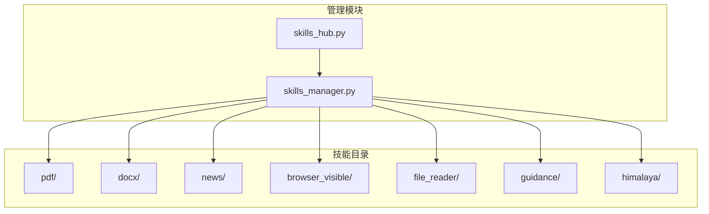
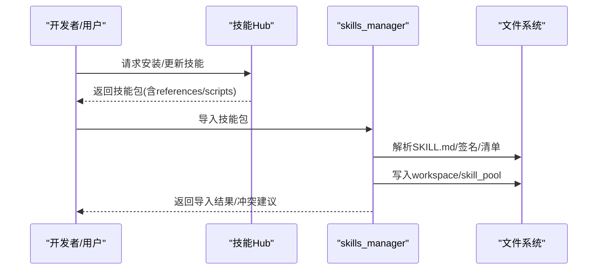
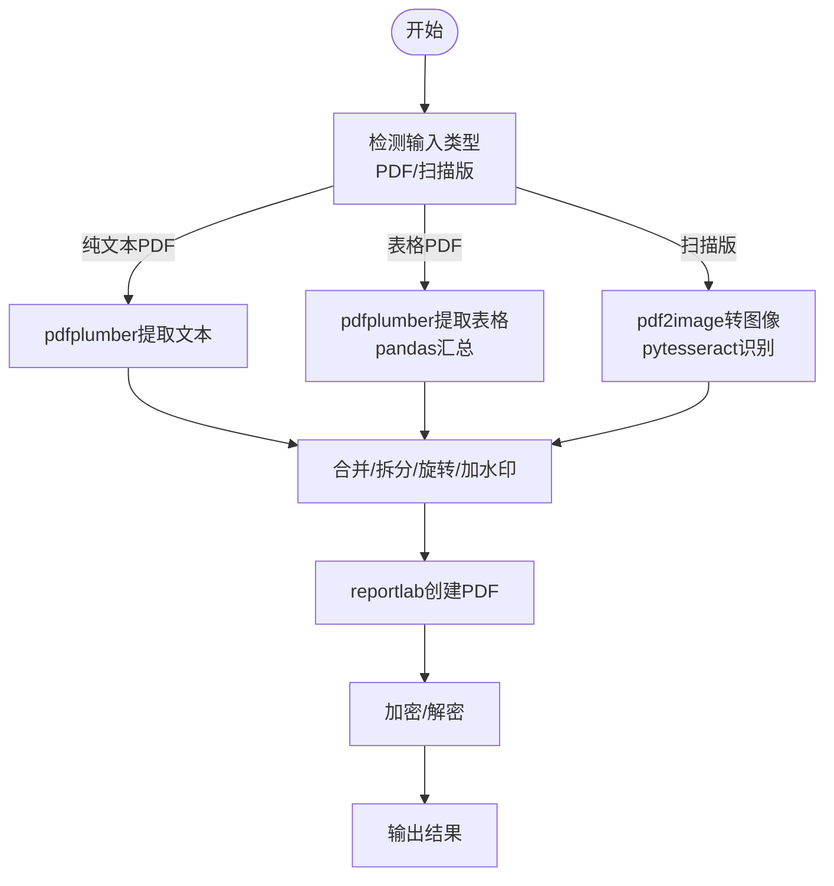
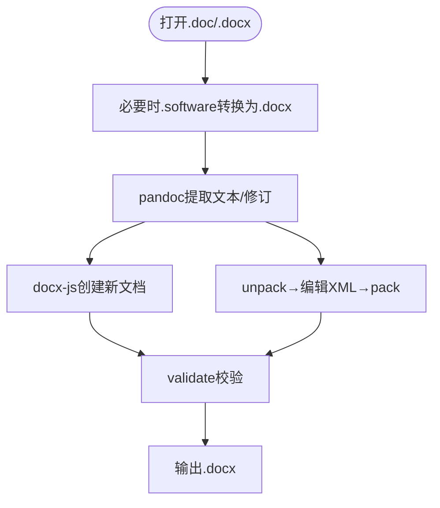
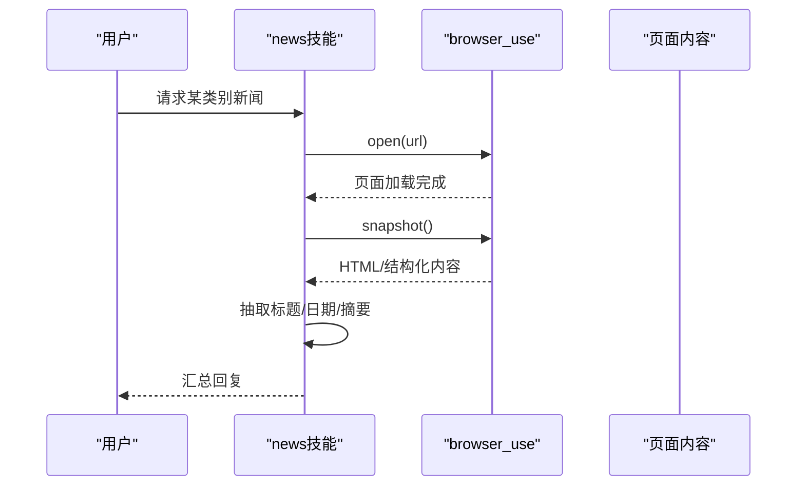
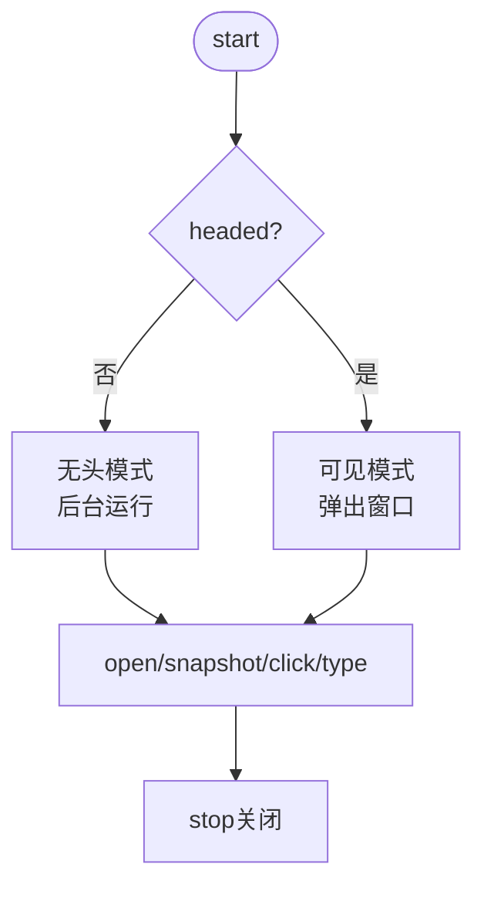
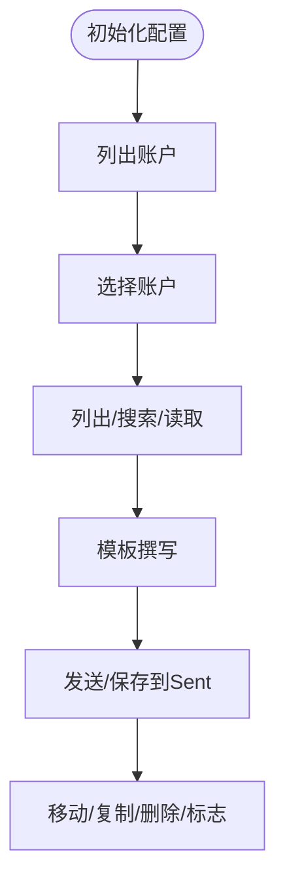
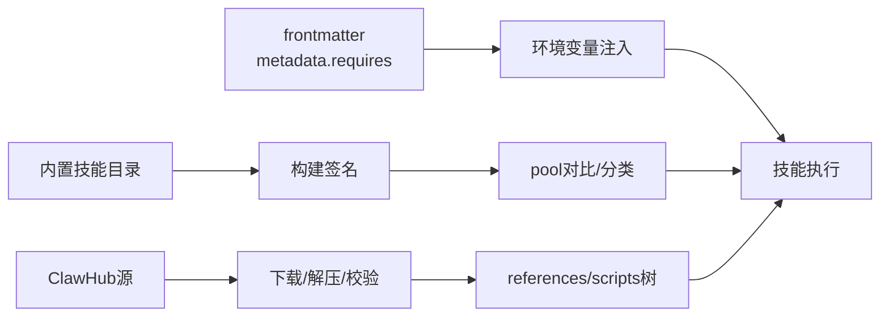

# 内置技能详解

<cite>
**本文引用的文件**
- [skills_hub.py](file://src/qwenpaw/agents/skills_hub.py)
- [skills_manager.py](file://src/qwenpaw/agents/skills_manager.py)
- [pdf/SKILL.md](file://src/qwenpaw/agents/skills/pdf/SKILL.md)
- [docx/SKILL.md](file://src/qwenpaw/agents/skills/docx/SKILL.md)
- [news/SKILL.md](file://src/qwenpaw/agents/skills/news/SKILL.md)
- [browser_visible/SKILL.md](file://src/qwenpaw/agents/skills/browser_visible/SKILL.md)
- [file_reader/SKILL.md](file://src/qwenpaw/agents/skills/file_reader/SKILL.md)
- [guidance/SKILL.md](file://src/qwenpaw/agents/skills/guidance/SKILL.md)
- [himalaya/SKILL.md](file://src/qwenpaw/agents/skills/himalaya/SKILL.md)
</cite>

## 目录
1. [简介](#简介)
2. [项目结构](#项目结构)
3. [核心组件](#核心组件)
4. [架构总览](#架构总览)
5. [详细组件分析](#详细组件分析)
6. [依赖分析](#依赖分析)
7. [性能考虑](#性能考虑)
8. [故障排查指南](#故障排查指南)
9. [结论](#结论)
10. [附录](#附录)

## 简介
本文件面向QwenPaw内置技能系统，提供全面技术文档，覆盖以下技能的能力特性与实现原理：
- PDF处理：文本与表格提取、格式转换、合并拆分、旋转、加水印、创建PDF、表单填充、加密解密、图片提取、扫描版OCR等
- Office文档处理：docx读取、分析、创建与编辑、.doc转.docx、跟踪修订接受、图像导出、XML级编辑与打包校验
- 新闻摘要：基于浏览器自动化抓取权威站点，快照页面并生成摘要
- 浏览器自动化：CDP与可见浏览器两种模式的差异、适用场景与参数配置
- 文件读取：多文本格式支持与内容解析策略
- 指导技能：对话式交互与上下文管理
- Himalaya技能：引用管理与学术文献处理（邮件CLI）

同时给出参数配置、使用示例、最佳实践、性能优化与错误处理策略。

## 项目结构
QwenPaw的内置技能位于agents/skills目录下，每个技能以独立子目录呈现，并包含SKILL.md说明文件。技能管理与安装由skills_manager与skills_hub模块负责，统一解析frontmatter元数据、构建签名、同步到工作区、注入环境变量等。

图表来源
- [skills_manager.py:120-143](file://src/qwenpaw/agents/skills_manager.py#L120-L143)
- [skills_hub.py:120-143](file://src/qwenpaw/agents/skills_hub.py#L120-L143)

章节来源
- [skills_manager.py:120-143](file://src/qwenpaw/agents/skills_manager.py#L120-L143)
- [skills_hub.py:120-143](file://src/qwenpaw/agents/skills_hub.py#L120-L143)

## 核心组件
- 技能清单与签名：内置技能目录通过遍历SKILL.md构建签名，用于池化同步与冲突检测
- 工作区与共享池：区分workspace skills与shared skill pool，支持builtin/customized分类与保留意图
- 环境变量注入：按技能声明的require_envs注入环境变量，避免硬编码
- 安全扫描：导入/保存前对技能目录进行安全扫描
- Hub集成：支持从ClawHub等源拉取技能包，自动展开references/scripts树，校验zip安全性

章节来源
- [skills_manager.py:98-117](file://src/qwenpaw/agents/skills_manager.py#L98-L117)
- [skills_manager.py:120-143](file://src/qwenpaw/agents/skills_manager.py#L120-L143)
- [skills_manager.py:543-571](file://src/qwenpaw/agents/skills_manager.py#L543-L571)
- [skills_manager.py:674-717](file://src/qwenpaw/agents/skills_manager.py#L674-L717)
- [skills_hub.py:485-501](file://src/qwenpaw/agents/skills_hub.py#L485-L501)
- [skills_hub.py:642-702](file://src/qwenpaw/agents/skills_hub.py#L642-L702)

## 架构总览
技能生命周期：内置技能打包于源代码，运行时由skills_manager解析frontmatter、构建签名、写入manifest；skills_hub负责从远端源下载、解压、校验并注入workspace或pool。技能执行时，apply_skill_config_env_overrides按需注入环境变量，确保工具链（如poppler、LibreOffice、himalaya等）可用。

图表来源
- [skills_hub.py:556-640](file://src/qwenpaw/agents/skills_hub.py#L556-L640)
- [skills_manager.py:294-311](file://src/qwenpaw/agents/skills_manager.py#L294-L311)
- [skills_manager.py:720-749](file://src/qwenpaw/agents/skills_manager.py#L720-L749)

## 详细组件分析

### PDF处理技能
- 功能特性
  - 文本与表格提取：pdfplumber按页提取文本与表格，支持pandas导出
  - 格式转换：pypdf合并/拆分/旋转/加水印/加密/解密；命令行工具qpdf、pdftotext、pdfimages配合
  - 创建PDF：reportlab基础与高级用法，Canvas/Platypus
  - 表单处理：pypdf与JavaScript库结合（见FORMS.md）
  - 扫描版OCR：pdf2image + pytesseract
- 实现要点
  - 依赖管理：pypdf、pdfplumber、reportlab、pdftotext、pdftoppm、qpdf、pytesseract、pdf2image
  - 命令行与Python双路径：优先可靠工具链，必要时回退
  - 快速参考与最佳实践：合并/拆分/提取/创建/OCR/加密等任务的推荐方案
- 参数与使用示例
  - 合并：使用pypdf的PdfWriter逐页添加
  - 提取表格：pdfplumber逐页提取并汇总为DataFrame
  - OCR：pdf2image转图像后pytesseract识别
  - 加水印：合并页面后写入输出
  - 加密：writer.encrypt设置用户密码与所有者密码
- 最佳实践
  - 大文件分页处理，避免内存峰值
  - OCR前预估分辨率，平衡速度与精度
  - 表单填充遵循FORMS.md与reference.md
- 性能与错误处理
  - 分页循环与流式写入降低内存占用
  - 对不可识别字符/布局变化做容错与提示

图表来源
- [pdf/SKILL.md:15-330](file://src/qwenpaw/agents/skills/pdf/SKILL.md#L15-L330)

章节来源
- [pdf/SKILL.md:15-330](file://src/qwenpaw/agents/skills/pdf/SKILL.md#L15-L330)

### Office文档处理（docx）
- 功能特性
  - 读取与分析：pandoc提取带跟踪修订的Markdown；解包查看原始XML
  - 创建新文档：docx-js（JavaScript）生成，Packer导出
  - 编辑现有文档：解包→编辑XML→打包校验（validate.py）
  - 转换：.doc转.docx（LibreOffice soffice）
  - 图像导出：PDF导出后pdftoppm转图像
  - 接受修订：accept_changes.py
- 实现要点
  - docx是ZIP归档，内部XML决定渲染效果
  - 页面尺寸、方向、列表、表格、图片、页眉页脚、目录等均有严格规范
  - 自动修复：修复durableId、缺失space属性等
- 参数与使用示例
  - .doc转.docx：soffice --headless --convert-to docx
  - 读取：pandoc --track-changes=all
  - 创建：docx-js定义Document/Section/Paragraph/Table等
  - 编辑：unpack→修改XML→pack（validate可选）
- 最佳实践
  - 明确页面尺寸（US Letter需显式设置）
  - 列表使用编号配置，避免Unicode符号
  - 表格同时设置table width与cell width，使用CLEAR着色
  - 图片必须指定type并提供altText
  - 目录使用HeadingLevel，且包含outlineLevel
- 错误处理
  - Auto-repair可修复部分问题，但不保证Schema合规
  - XML嵌套/关系缺失需手工修正

图表来源
- [docx/SKILL.md:36-67](file://src/qwenpaw/agents/skills/docx/SKILL.md#L36-L67)
- [docx/SKILL.md:304-346](file://src/qwenpaw/agents/skills/docx/SKILL.md#L304-L346)

章节来源
- [docx/SKILL.md:15-33](file://src/qwenpaw/agents/skills/docx/SKILL.md#L15-L33)

### 新闻摘要技能
- 功能特性
  - 聚合权威站点（政治、金融、社会、世界、科技、体育、娱乐）
  - 结合browser_use与snapshot获取页面内容，抽取标题与要点
- 参数与使用示例
  - browser_use open/snapshot/click等动作组合
  - 多类别轮询时，先open再snapshot，避免内容混杂
- 最佳实践
  - 站点结构可能变更，失败时提示用户直接打开链接
  - 按时间或重要性组织摘要，注明来源

图表来源
- [news/SKILL.md:13-41](file://src/qwenpaw/agents/skills/news/SKILL.md#L13-L41)

章节来源
- [news/SKILL.md:1-48](file://src/qwenpaw/agents/skills/news/SKILL.md#L1-L48)

### 浏览器自动化（CDP与可见浏览器）
- CDP（无头模式）
  - 默认后台运行，适合自动化、批量任务
  - 支持start/open/snapshot/click/type等
- 可见浏览器（headed模式）
  - 弹出真实Chromium窗口，适合演示、调试、人工交互
  - headed=true启动后，后续open/snapshot/click等与无头一致
- 参数与使用示例
  - headed模式：start时传入headed=true
  - 切换：先stop再以headed=true重新start
- 最佳实践
  - 服务器/无图形环境慎用可见模式
  - 多类别新闻场景，先open再snapshot，避免混页

图表来源
- [browser_visible/SKILL.md:23-37](file://src/qwenpaw/agents/skills/browser_visible/SKILL.md#L23-L37)

章节来源
- [browser_visible/SKILL.md:1-50](file://src/qwenpaw/agents/skills/browser_visible/SKILL.md#L1-L50)

### 文件读取技能
- 功能特性
  - 仅处理文本类文件：txt、md、json/yaml、csv/tsv、log、sql、ini/toml、编程语言源码、html/xml等
  - 类型探测：使用file命令判断MIME类型
  - 大文件：采用尾部窗口（tail）与摘要策略
- 参数与使用示例
  - read_file读取内容
  - JSON/YAML列顶级键/重要字段
  - CSV/TSV展示头部+首几行
- 最佳实践
  - 优先读取最小必要片段
  - 避免执行不受信任文件
  - 工具缺失时提示替代格式

章节来源
- [file_reader/SKILL.md:1-59](file://src/qwenpaw/agents/skills/file_reader/SKILL.md#L1-L59)

### 指导技能
- 功能特性
  - 面向QwenPaw安装与配置问答，优先本地文档，再兜底官网
  - 交互流程：定位文档→检索匹配→阅读内容→提取信息→作答
- 参数与使用示例
  - 通过memory记录文档目录，或在项目源码与工作目录中搜索
  - 使用find/cat/file_reader读取文档
- 最佳实践
  - 回答语言与用户一致
  - 版本差异明确标注
  - 提供可复制的原文片段与前置条件

章节来源
- [guidance/SKILL.md:1-138](file://src/qwenpaw/agents/skills/guidance/SKILL.md#L1-L138)

### Himalaya技能（学术文献与邮件CLI）
- 功能特性
  - IMAP/SMTP邮件管理：列出、读取、写入、回复、转发、搜索、整理
  - 多账户支持：配置多个账户并切换
  - MML（MIME元语言）：模板化撰写与发送
- 参数与使用示例
  - 配置：himalaya account configure
  - 列目录/列表/搜索/读取/发送/移动/删除/标志
  - 输出格式：--output json/plain
- 最佳实践
  - 使用template write | template send管道
  - 附件场景使用Python smtplib（himalaya限制）
  - 163邮箱需开启send-after-auth与创建Sent文件夹
- 错误处理
  - 未找到文件夹：先创建Sent
  - 发送失败：改用template send
  - 调试：RUST_LOG=debug/trace

图表来源
- [himalaya/SKILL.md:37-67](file://src/qwenpaw/agents/skills/himalaya/SKILL.md#L37-L67)
- [himalaya/SKILL.md:125-150](file://src/qwenpaw/agents/skills/himalaya/SKILL.md#L125-L150)
- [himalaya/SKILL.md:196-201](file://src/qwenpaw/agents/skills/himalaya/SKILL.md#L196-L201)

章节来源
- [himalaya/SKILL.md:1-296](file://src/qwenpaw/agents/skills/himalaya/SKILL.md#L1-L296)

## 依赖分析
- 技能依赖声明：skills_manager从frontmatter解析metadata.requires（bins/env），并注入环境变量
- 签名与冲突：内置技能签名缓存，pool中builtin/customized分类与保留意图
- Hub下载与校验：skills_hub支持ClawHub源，自动hydrate包体、解压、校验zip安全性、提取references/scripts树

图表来源
- [skills_manager.py:543-571](file://src/qwenpaw/agents/skills_manager.py#L543-L571)
- [skills_manager.py:98-117](file://src/qwenpaw/agents/skills_manager.py#L98-L117)
- [skills_manager.py:408-446](file://src/qwenpaw/agents/skills_manager.py#L408-L446)
- [skills_hub.py:556-640](file://src/qwenpaw/agents/skills_hub.py#L556-L640)
- [skills_hub.py:458-474](file://src/qwenpaw/agents/skills_hub.py#L458-L474)

章节来源
- [skills_manager.py:543-571](file://src/qwenpaw/agents/skills_manager.py#L543-L571)
- [skills_manager.py:98-117](file://src/qwenpaw/agents/skills_manager.py#L98-L117)
- [skills_manager.py:408-446](file://src/qwenpaw/agents/skills_manager.py#L408-L446)
- [skills_hub.py:556-640](file://src/qwenpaw/agents/skills_hub.py#L556-L640)
- [skills_hub.py:458-474](file://src/qwenpaw/agents/skills_hub.py#L458-L474)

## 性能考虑
- I/O与内存
  - PDF/Office大文件采用分页/分块处理，避免一次性加载
  - 文本文件优先小片段读取与摘要，避免dump全量内容
- 工具链效率
  - 优先使用命令行工具（qpdf、pdftotext、pdfimages、soffice）以减少Python层开销
  - docx-js生成后立即validate，避免后续反复修复
- 并发与锁
  - manifest写入采用原子替换与文件锁，避免并发冲突
- 网络与重试
  - Hub请求支持指数退避、超时与重试，速率限制与429友好提示

## 故障排查指南
- Hub网络问题
  - 429/5xx自动重试与退避；GitHub速率限制提示设置GITHUB_TOKEN
  - 超大响应体/zip限制抛出SkillsError
- 技能导入冲突
  - 名称冲突时建议时间戳后缀重命名，或返回冲突详情
- 环境变量注入失败
  - 要求的env未提供时记录警告；确保配置与require_envs匹配
- PDF/Office异常
  - OCR失败：检查poppler与tesseract安装；扫描版提高DPI
  - docx校验失败：使用validate自动修复，必要时手工修正XML
- 浏览器
  - 可见模式无窗口：确认图形环境与headed=true；先stop再以headed=true重启
- 邮件CLI
  - 发送失败：改用template send；163需配置send-after-auth与Sent文件夹

章节来源
- [skills_hub.py:316-368](file://src/qwenpaw/agents/skills_hub.py#L316-L368)
- [skills_manager.py:778-798](file://src/qwenpaw/agents/skills_manager.py#L778-L798)
- [skills_manager.py:674-717](file://src/qwenpaw/agents/skills_manager.py#L674-L717)
- [pdf/SKILL.md:248-265](file://src/qwenpaw/agents/skills/pdf/SKILL.md#L248-L265)
- [docx/SKILL.md:348-354](file://src/qwenpaw/agents/skills/docx/SKILL.md#L348-L354)
- [browser_visible/SKILL.md:46-49](file://src/qwenpaw/agents/skills/browser_visible/SKILL.md#L46-L49)
- [himalaya/SKILL.md:182-186](file://src/qwenpaw/agents/skills/himalaya/SKILL.md#L182-L186)
- [himalaya/SKILL.md:196-201](file://src/qwenpaw/agents/skills/himalaya/SKILL.md#L196-L201)

## 结论
QwenPaw内置技能体系以标准化的SKILL.md描述、严格的签名与清单管理、灵活的环境变量注入以及健壮的Hub集成为核心，覆盖PDF/Office/新闻/浏览器/文件读取/指导/Himalaya等多类场景。通过清晰的参数配置、最佳实践与完善的错误处理策略，既能满足日常自动化需求，也能应对复杂文档与邮件管理任务。

## 附录
- 常用命令与工具
  - poppler：pdftotext、qpdf、pdfimages、pdftoppm
  - LibreOffice：soffice（.doc转.docx、接受修订、导出PDF）
  - docx-js：生成与导出.docx
  - himalaya：邮件CLI（账户配置、列表/读取/发送/移动/删除/标志）
- 环境变量与配置
  - QWENPAW_SKILL_CONFIG_<NAME>：技能完整配置JSON
  - GITHUB_TOKEN/GH_TOKEN：提升Hub访问配额
  - RUST_LOG/RUST_BACKTRACE：himalaya调试