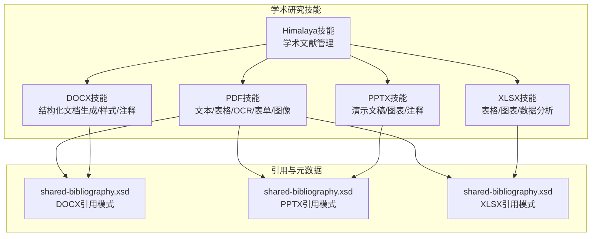
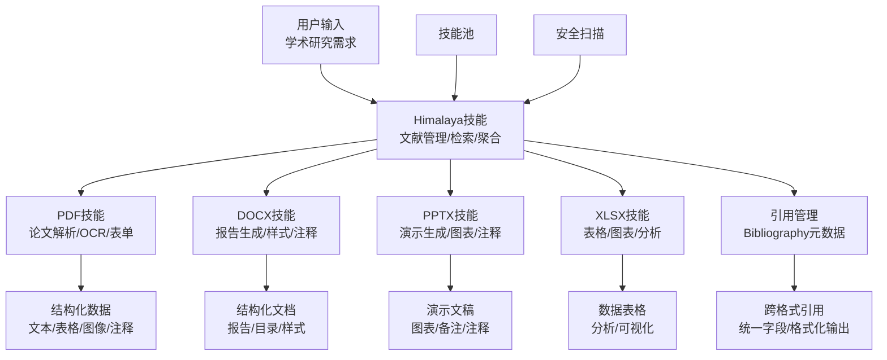
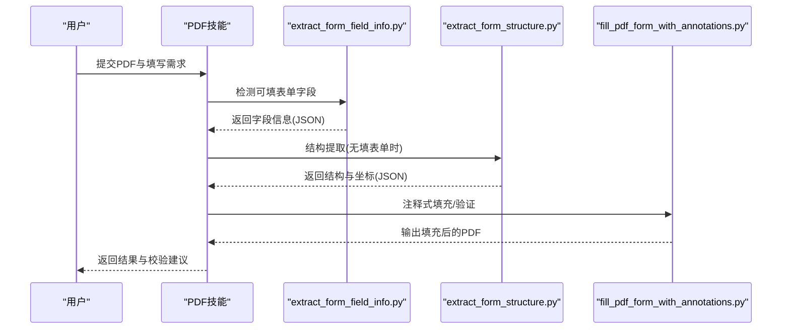
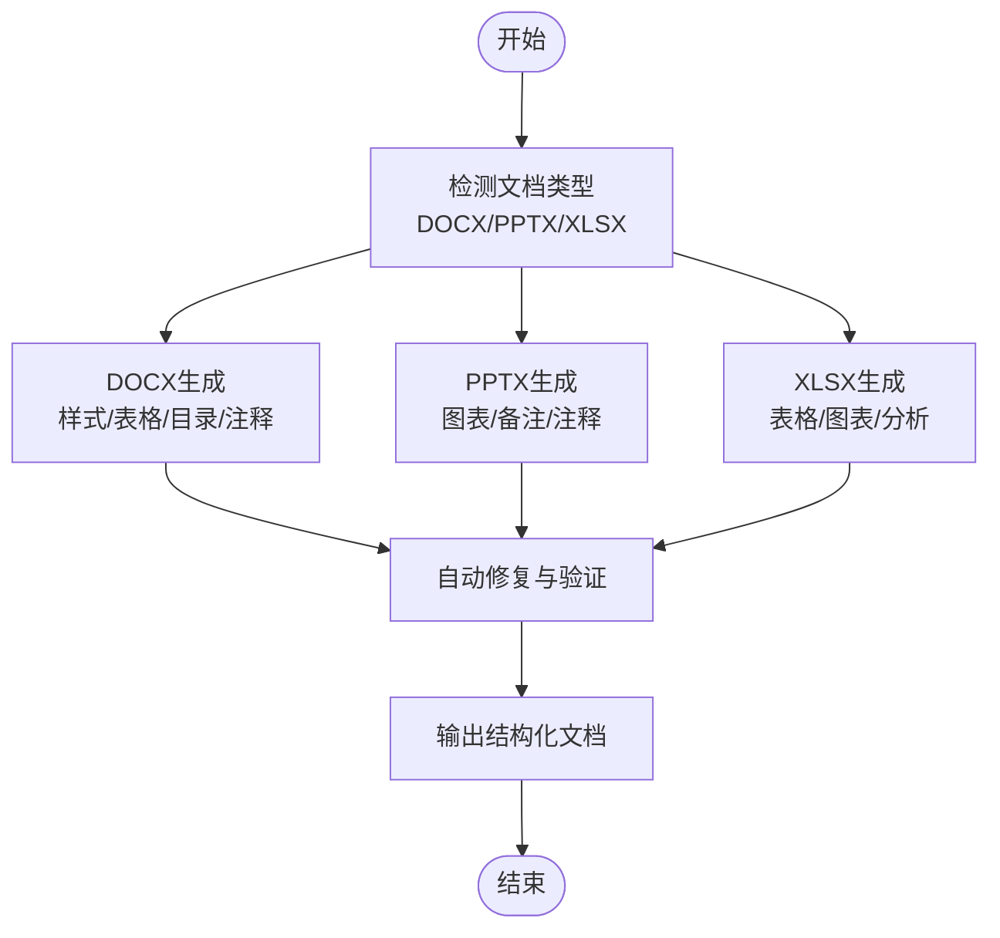
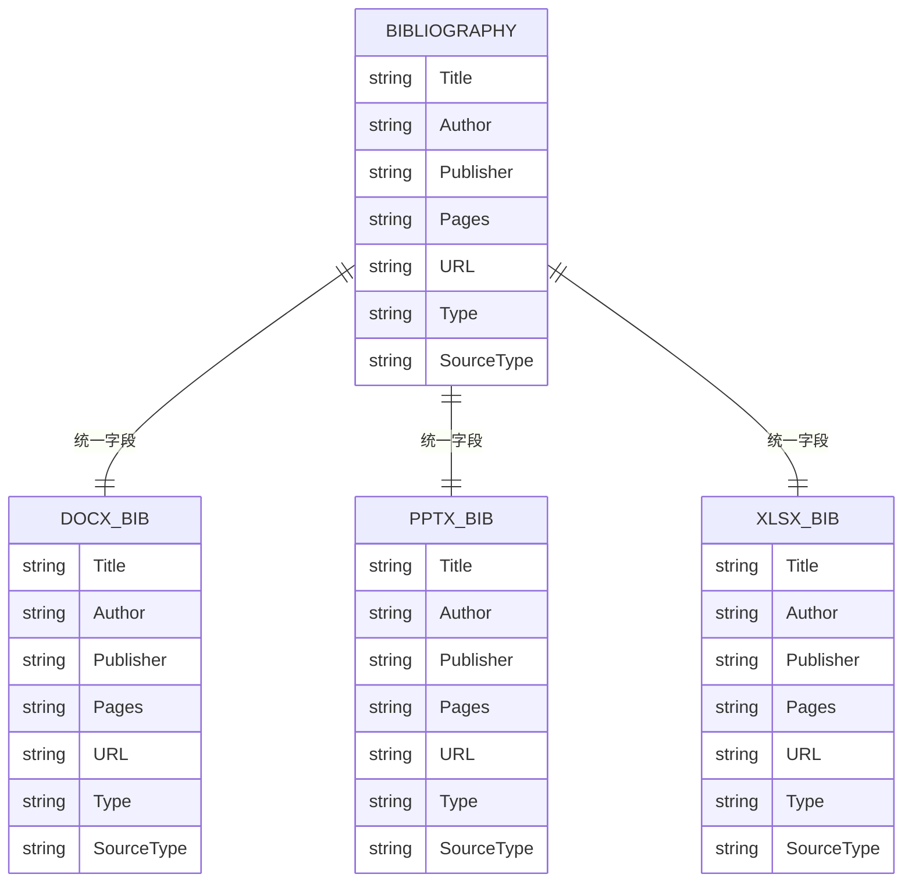
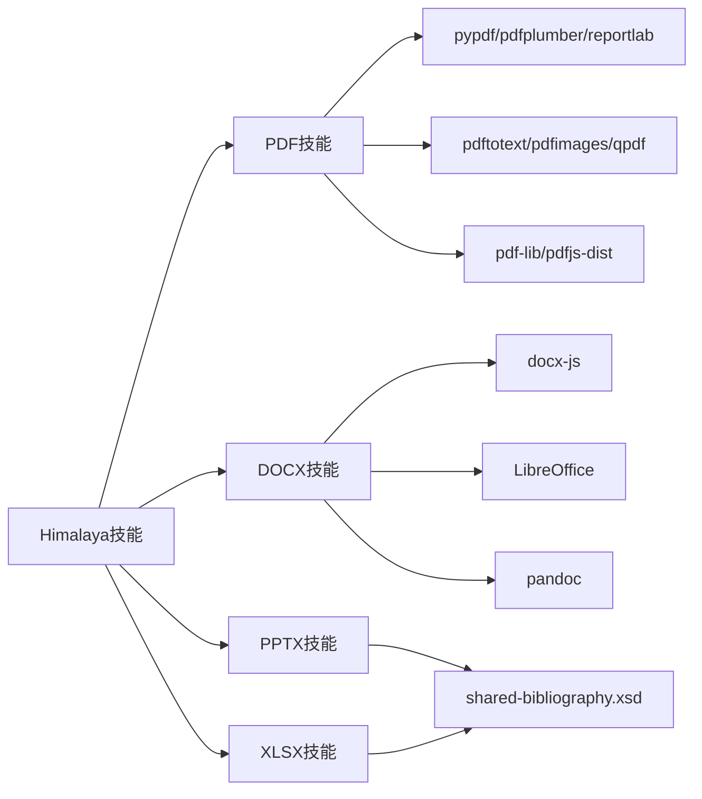

# 学术研究技能

<cite>
**本文引用的文件**
- [src/qwenpaw/agents/skills/pdf/SKILL.md](file://src/qwenpaw/agents/skills/pdf/SKILL.md)
- [src/qwenpaw/agents/skills/pdf/reference.md](file://src/qwenpaw/agents/skills/pdf/reference.md)
- [src/qwenpaw/agents/skills/pdf/forms.md](file://src/qwenpaw/agents/skills/pdf/forms.md)
- [src/qwenpaw/agents/skills/pdf/scripts/extract_form_field_info.py](file://src/qwenpaw/agents/skills/pdf/scripts/extract_form_field_info.py)
- [src/qwenpaw/agents/skills/pdf/scripts/extract_form_structure.py](file://src/qwenpaw/agents/skills/pdf/scripts/extract_form_structure.py)
- [src/qwenpaw/agents/skills/pdf/scripts/fill_pdf_form_with_annotations.py](file://src/qwenpaw/agents/skills/pdf/scripts/fill_pdf_form_with_annotations.py)
- [src/qwenpaw/agents/skills/docx/SKILL.md](file://src/qwenpaw/agents/skills/docx/SKILL.md)
- [src/qwenpaw/agents/skills/pptx/scripts/office/schemas/ISO-IEC29500-4_2016/shared-bibliography.xsd](file://src/qwenpaw/agents/skills/pptx/scripts/office/schemas/ISO-IEC29500-4_2016/shared-bibliography.xsd)
- [src/qwenpaw/agents/skills/docx/scripts/office/schemas/ISO-IEC29500-4_2016/shared-bibliography.xsd](file://src/qwenpaw/agents/skills/docx/scripts/office/schemas/ISO-IEC29500-4_2016/shared-bibliography.xsd)
- [src/qwenpaw/agents/skills/xlsx/scripts/office/schemas/ISO-IEC29500-4_2016/shared-bibliography.xsd](file://src/qwenpaw/agents/skills/xlsx/scripts/office/schemas/ISO-IEC29500-4_2016/shared-bibliography.xsd)
- [website/public/docs/skills.zh.md](file://website/public/docs/skills.zh.md)
- [website/public/docs/skills.en.md](file://website/public/docs/skills.en.md)
- [website/public/docs/memory.en.md](file://website/public/docs/memory.en.md)
- [console/src/pages/Settings/Security/components/SkillScannerSection.tsx](file://console/src/pages/Settings/Security/components/SkillScannerSection.tsx)
</cite>

## 目录
1. [简介](#简介)
2. [项目结构](#项目结构)
3. [核心组件](#核心组件)
4. [架构总览](#架构总览)
5. [详细组件分析](#详细组件分析)
6. [依赖关系分析](#依赖关系分析)
7. [性能考虑](#性能考虑)
8. [故障排查指南](#故障排查指南)
9. [结论](#结论)
10. [附录](#附录)

## 简介
本技术文档面向QwenPaw的学术研究技能，聚焦“Himalaya”技能在学术文献管理方面的能力，以及与之协同的PDF、DOCX、PPTX、XLSX等文档处理技能。内容覆盖参考文献格式化、引用管理、文献检索、学术资源聚合、PDF文献解析、摘要提取、关键词标注、分类标签、学术数据库集成、API接口调用、批量处理、数据同步、合规要求（学术规范、版权处理、数据隐私、格式标准化）、复杂学术场景（多语言文献、公式渲染、图表提取、实验数据处理）以及学术搜索引擎优化、影响力评估、研究趋势分析等高级分析功能。

## 项目结构
学术研究相关能力主要分布在以下模块：
- PDF处理技能：提供文本/表格提取、OCR、表单填写、图像提取、加密/解密、合并/拆分等能力，支撑论文全文解析与结构化信息抽取。
- 文档（DOCX/PPTX/XLSX）技能：提供结构化内容生成、样式控制、图表与表格处理、注释与修订跟踪等，支撑学术报告、演示文稿与数据表格的自动化生成与编辑。
- 引用与文献元数据：通过OpenXML Schema中的Bibliography类型，统一不同格式下的参考文献字段，便于跨格式引用管理与格式化输出。
- 技能池与集成：技能池页面支持内置技能导入、URL导入、ZIP上传、工作区同步等，便于学术研究团队共享与复用技能。

**图示来源**
- [src/qwenpaw/agents/skills/pdf/SKILL.md:1-330](file://src/qwenpaw/agents/skills/pdf/SKILL.md#L1-L330)
- [src/qwenpaw/agents/skills/docx/SKILL.md:1-488](file://src/qwenpaw/agents/skills/docx/SKILL.md#L1-L488)
- [src/qwenpaw/agents/skills/pptx/scripts/office/schemas/ISO-IEC29500-4_2016/shared-bibliography.xsd:1-128](file://src/qwenpaw/agents/skills/pptx/scripts/office/schemas/ISO-IEC29500-4_2016/shared-bibliography.xsd#L1-L128)
- [src/qwenpaw/agents/skills/docx/scripts/office/schemas/ISO-IEC29500-4_2016/shared-bibliography.xsd:1-128](file://src/qwenpaw/agents/skills/docx/scripts/office/schemas/ISO-IEC29500-4_2016/shared-bibliography.xsd#L1-L128)
- [src/qwenpaw/agents/skills/xlsx/scripts/office/schemas/ISO-IEC29500-4_2016/shared-bibliography.xsd:1-128](file://src/qwenpaw/agents/skills/xlsx/scripts/office/schemas/ISO-IEC29500-4_2016/shared-bibliography.xsd#L1-L128)

**章节来源**
- [website/public/docs/skills.zh.md:68-116](file://website/public/docs/skills.zh.md#L68-L116)
- [website/public/docs/skills.en.md:73-124](file://website/public/docs/skills.en.md#L73-L124)

## 核心组件
- PDF技能：提供基础与高级PDF处理能力，包括文本/表格提取、OCR、表单结构识别与注释填充、命令行工具链（pdftotext、qpdf、pdfimages）、以及JavaScript库（pdf-lib、pdfjs）的高级用法，支撑学术论文的全文解析与结构化信息抽取。
- 文档技能（DOCX/PPTX/XLSX）：提供结构化内容生成、样式控制、图表与表格处理、注释与修订跟踪，支撑学术报告、演示文稿与数据表格的自动化生成与编辑。
- 引用与元数据：通过OpenXML Schema中的Bibliography类型，统一不同格式下的参考文献字段，便于跨格式引用管理与格式化输出。
- 技能池与集成：技能池页面支持内置技能导入、URL导入、ZIP上传、工作区同步等，便于学术研究团队共享与复用技能。

**章节来源**
- [src/qwenpaw/agents/skills/pdf/SKILL.md:1-330](file://src/qwenpaw/agents/skills/pdf/SKILL.md#L1-L330)
- [src/qwenpaw/agents/skills/pdf/reference.md:1-612](file://src/qwenpaw/agents/skills/pdf/reference.md#L1-L612)
- [src/qwenpaw/agents/skills/pdf/forms.md:1-299](file://src/qwenpaw/agents/skills/pdf/forms.md#L1-L299)
- [src/qwenpaw/agents/skills/docx/SKILL.md:1-488](file://src/qwenpaw/agents/skills/docx/SKILL.md#L1-L488)

## 架构总览
学术研究技能的整体架构围绕“文献采集—结构化解析—知识抽取—成果产出—合规与安全”的闭环展开。PDF技能负责原始文献解析；DOCX/PPTX/XLSX技能负责结构化成果产出；Himalaya技能作为学术文献管理中枢，协调上述能力并提供引用管理、检索与聚合功能；技能池与安全扫描保障团队协作与合规。

**图示来源**
- [src/qwenpaw/agents/skills/pdf/SKILL.md:1-330](file://src/qwenpaw/agents/skills/pdf/SKILL.md#L1-L330)
- [src/qwenpaw/agents/skills/docx/SKILL.md:1-488](file://src/qwenpaw/agents/skills/docx/SKILL.md#L1-L488)
- [src/qwenpaw/agents/skills/pptx/scripts/office/schemas/ISO-IEC29500-4_2016/shared-bibliography.xsd:1-128](file://src/qwenpaw/agents/skills/pptx/scripts/office/schemas/ISO-IEC29500-4_2016/shared-bibliography.xsd#L1-L128)
- [src/qwenpaw/agents/skills/docx/scripts/office/schemas/ISO-IEC29500-4_2016/shared-bibliography.xsd:1-128](file://src/qwenpaw/agents/skills/docx/scripts/office/schemas/ISO-IEC29500-4_2016/shared-bibliography.xsd#L1-L128)
- [src/qwenpaw/agents/skills/xlsx/scripts/office/schemas/ISO-IEC29500-4_2016/shared-bibliography.xsd:1-128](file://src/qwenpaw/agents/skills/xlsx/scripts/office/schemas/ISO-IEC29500-4_2016/shared-bibliography.xsd#L1-L128)

## 详细组件分析

### PDF技能：学术论文处理与结构化解析
PDF技能是学术论文处理的核心，提供从原始PDF到结构化数据的全链路能力：
- 文本与表格提取：支持布局保留的文本提取与表格结构化输出，结合pandas进行进一步分析。
- OCR与扫描件处理：对扫描版PDF进行图像转换与OCR识别，生成可检索文本。
- 表单结构识别与注释填充：通过结构提取与坐标校验，实现非填表型表单的注释式填写。
- 图像提取与命令行工具：利用pdfimages与poppler-utils提取嵌入图像，支持高分辨率导出。
- 加密/解密与批量处理：提供密码保护与权限控制，支持批量合并/拆分与页面裁剪。

**图示来源**
- [src/qwenpaw/agents/skills/pdf/SKILL.md:1-330](file://src/qwenpaw/agents/skills/pdf/SKILL.md#L1-L330)
- [src/qwenpaw/agents/skills/pdf/forms.md:1-299](file://src/qwenpaw/agents/skills/pdf/forms.md#L1-L299)
- [src/qwenpaw/agents/skills/pdf/scripts/extract_form_field_info.py:1-44](file://src/qwenpaw/agents/skills/pdf/scripts/extract_form_field_info.py#L1-L44)
- [src/qwenpaw/agents/skills/pdf/scripts/extract_form_structure.py:48-115](file://src/qwenpaw/agents/skills/pdf/scripts/extract_form_structure.py#L48-L115)
- [src/qwenpaw/agents/skills/pdf/scripts/fill_pdf_form_with_annotations.py:52-78](file://src/qwenpaw/agents/skills/pdf/scripts/fill_pdf_form_with_annotations.py#L52-L78)

**章节来源**
- [src/qwenpaw/agents/skills/pdf/SKILL.md:1-330](file://src/qwenpaw/agents/skills/pdf/SKILL.md#L1-L330)
- [src/qwenpaw/agents/skills/pdf/reference.md:1-612](file://src/qwenpaw/agents/skills/pdf/reference.md#L1-L612)
- [src/qwenpaw/agents/skills/pdf/forms.md:1-299](file://src/qwenpaw/agents/skills/pdf/forms.md#L1-L299)

### 文档技能：学术报告与演示的结构化生成
文档技能（DOCX/PPTX/XLSX）提供结构化内容生成与样式控制，支撑学术报告、演示文稿与数据表格的自动化生成与编辑：
- DOCX：支持docx-js创建与样式控制、表格宽度与单元格内边距规则、页眉页脚与目录生成、注释与修订跟踪。
- PPTX：支持图表与注释、幻灯片布局与备注、跨格式引用模式。
- XLSX：支持表格与图表、数据分析与格式清理。

**图示来源**
- [src/qwenpaw/agents/skills/docx/SKILL.md:1-488](file://src/qwenpaw/agents/skills/docx/SKILL.md#L1-L488)
- [src/qwenpaw/agents/skills/pptx/scripts/office/schemas/ISO-IEC29500-4_2016/shared-bibliography.xsd:1-128](file://src/qwenpaw/agents/skills/pptx/scripts/office/schemas/ISO-IEC29500-4_2016/shared-bibliography.xsd#L1-L128)
- [src/qwenpaw/agents/skills/xlsx/scripts/office/schemas/ISO-IEC29500-4_2016/shared-bibliography.xsd:1-128](file://src/qwenpaw/agents/skills/xlsx/scripts/office/schemas/ISO-IEC29500-4_2016/shared-bibliography.xsd#L1-L128)

**章节来源**
- [src/qwenpaw/agents/skills/docx/SKILL.md:1-488](file://src/qwenpaw/agents/skills/docx/SKILL.md#L1-L488)

### 引用与元数据：跨格式引用管理
通过OpenXML Schema中的Bibliography类型，统一不同格式下的参考文献字段，便于跨格式引用管理与格式化输出：
- 支持多种Source类型（期刊文章、图书、会议论文、专利等）。
- 统一字段（标题、作者、出版者、页码、URL、DOI等），确保引用一致性。

**图示来源**
- [src/qwenpaw/agents/skills/pptx/scripts/office/schemas/ISO-IEC29500-4_2016/shared-bibliography.xsd:1-128](file://src/qwenpaw/agents/skills/pptx/scripts/office/schemas/ISO-IEC29500-4_2016/shared-bibliography.xsd#L1-L128)
- [src/qwenpaw/agents/skills/docx/scripts/office/schemas/ISO-IEC29500-4_2016/shared-bibliography.xsd:1-128](file://src/qwenpaw/agents/skills/docx/scripts/office/schemas/ISO-IEC29500-4_2016/shared-bibliography.xsd#L1-L128)
- [src/qwenpaw/agents/skills/xlsx/scripts/office/schemas/ISO-IEC29500-4_2016/shared-bibliography.xsd:1-128](file://src/qwenpaw/agents/skills/xlsx/scripts/office/schemas/ISO-IEC29500-4_2016/shared-bibliography.xsd#L1-L128)

**章节来源**
- [src/qwenpaw/agents/skills/pptx/scripts/office/schemas/ISO-IEC29500-4_2016/shared-bibliography.xsd:1-128](file://src/qwenpaw/agents/skills/pptx/scripts/office/schemas/ISO-IEC29500-4_2016/shared-bibliography.xsd#L1-L128)
- [src/qwenpaw/agents/skills/docx/scripts/office/schemas/ISO-IEC29500-4_2016/shared-bibliography.xsd:1-128](file://src/qwenpaw/agents/skills/docx/scripts/office/schemas/ISO-IEC29500-4_2016/shared-bibliography.xsd#L1-L128)
- [src/qwenpaw/agents/skills/xlsx/scripts/office/schemas/ISO-IEC29500-4_2016/shared-bibliography.xsd:1-128](file://src/qwenpaw/agents/skills/xlsx/scripts/office/schemas/ISO-IEC29500-4_2016/shared-bibliography.xsd#L1-L128)

### 技能池与集成：团队协作与复用
技能池页面支持内置技能导入、URL导入、ZIP上传、工作区同步等，便于学术研究团队共享与复用技能：
- 内置技能：提供PDF、DOCX、PPTX、XLSX等技能的统一入口。
- 导入方式：支持从Hub/GitHub URL导入、ZIP上传、工作区同步。
- 更新机制：内置技能可能显示“最新/已过期”，可通过“更新内置技能”刷新。

**章节来源**
- [website/public/docs/skills.zh.md:68-116](file://website/public/docs/skills.zh.md#L68-L116)
- [website/public/docs/skills.en.md:73-124](file://website/public/docs/skills.en.md#L73-L124)

## 依赖关系分析
学术研究技能的依赖关系围绕PDF、DOCX、PPTX、XLSX四大文档格式展开，同时通过Bibliography Schema实现跨格式引用统一：

**图示来源**
- [src/qwenpaw/agents/skills/pdf/SKILL.md:15-330](file://src/qwenpaw/agents/skills/pdf/SKILL.md#L15-L330)
- [src/qwenpaw/agents/skills/docx/SKILL.md:15-488](file://src/qwenpaw/agents/skills/docx/SKILL.md#L15-L488)
- [src/qwenpaw/agents/skills/pptx/scripts/office/schemas/ISO-IEC29500-4_2016/shared-bibliography.xsd:1-128](file://src/qwenpaw/agents/skills/pptx/scripts/office/schemas/ISO-IEC29500-4_2016/shared-bibliography.xsd#L1-L128)
- [src/qwenpaw/agents/skills/xlsx/scripts/office/schemas/ISO-IEC29500-4_2016/shared-bibliography.xsd:1-128](file://src/qwenpaw/agents/skills/xlsx/scripts/office/schemas/ISO-IEC29500-4_2016/shared-bibliography.xsd#L1-L128)

**章节来源**
- [src/qwenpaw/agents/skills/pdf/SKILL.md:15-330](file://src/qwenpaw/agents/skills/pdf/SKILL.md#L15-L330)
- [src/qwenpaw/agents/skills/docx/SKILL.md:15-488](file://src/qwenpaw/agents/skills/docx/SKILL.md#L15-L488)

## 性能考虑
- 大型PDF处理：采用流式处理与分块策略，避免一次性加载整份PDF；使用qpdf进行分页拆分与优化。
- 文本提取：对纯文本优先使用pdftotext -bbox-layout；对结构化表格使用pdfplumber并设置合理的容差参数。
- 图像提取：优先使用pdfimages进行高速提取；预览使用低分辨率，最终输出使用高分辨率。
- 表单填充：pdf-lib在保持表单结构方面表现更佳；预处理阶段进行字段与坐标校验，减少错误重试成本。
- 内存管理：实现分块写入与临时文件清理，降低内存峰值占用。

[本节为通用指导，无需特定文件引用]

## 故障排查指南
- 加密PDF：使用pypdf的解密接口处理密码保护；若失败，尝试qpdf修复后再解密。
- 崩溃/损坏PDF：使用qpdf检查与修复结构；必要时替换输入文件。
- 文本提取异常：对扫描版PDF进行OCR回退；确认字体与编码兼容性。
- 表单字段不匹配：核对字段ID与值；使用坐标校验脚本检查边界框与字体大小。
- 安全扫描：通过控制台的安全扫描组件查看白名单与扫描发现，确保技能使用符合组织策略。

**章节来源**
- [src/qwenpaw/agents/skills/pdf/reference.md:567-601](file://src/qwenpaw/agents/skills/pdf/reference.md#L567-L601)
- [console/src/pages/Settings/Security/components/SkillScannerSection.tsx:434-463](file://console/src/pages/Settings/Security/components/SkillScannerSection.tsx#L434-L463)

## 结论
QwenPaw的学术研究技能通过PDF、DOCX、PPTX、XLSX等多格式文档处理能力，结合统一的Bibliography元数据模型与Himalaya技能的文献管理中枢，构建了从文献采集、结构化解析、知识抽取到成果产出的完整闭环。配合技能池与安全扫描机制，能够满足学术研究团队在引用管理、批量处理、数据同步与合规要求等方面的复杂需求，并为高级分析（如搜索引擎优化、影响力评估、研究趋势分析）提供坚实的数据基础。

[本节为总结性内容，无需特定文件引用]

## 附录
- 学术规范与版权处理：在引用与生成过程中严格遵循各格式的版权与许可条款，避免侵权使用；对受版权保护的内容进行标注与限制。
- 数据隐私：对涉及个人隐私或机密信息的文档进行脱敏处理；在批量处理中避免敏感数据泄露。
- 格式标准化：统一使用DXA单位与标准样式，确保跨平台一致性；对表格与图表进行尺寸与比例校验。
- 高级分析：结合结构化数据进行统计分析与可视化，支持学术搜索引擎优化与影响力评估。

[本节为通用指导，无需特定文件引用]