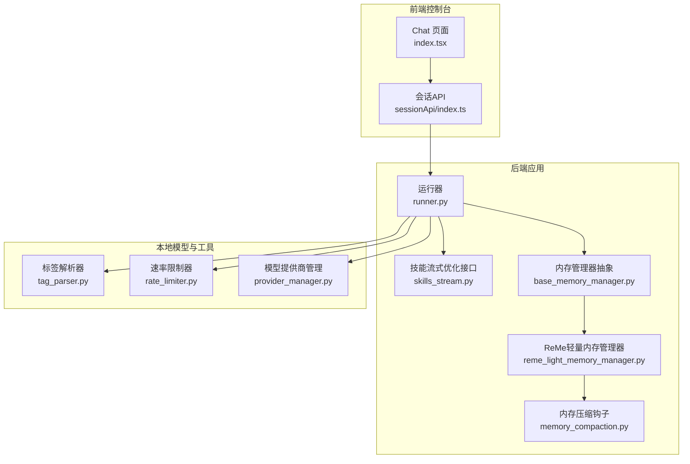
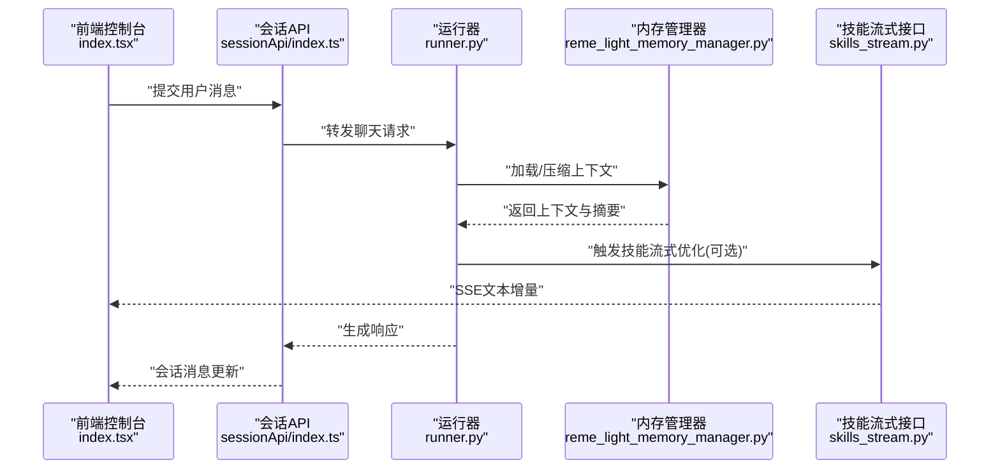
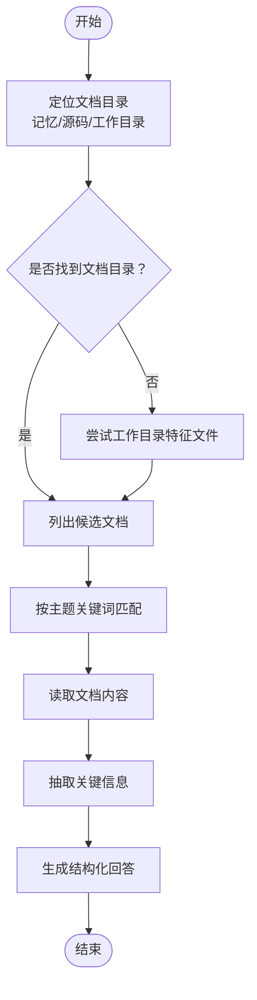
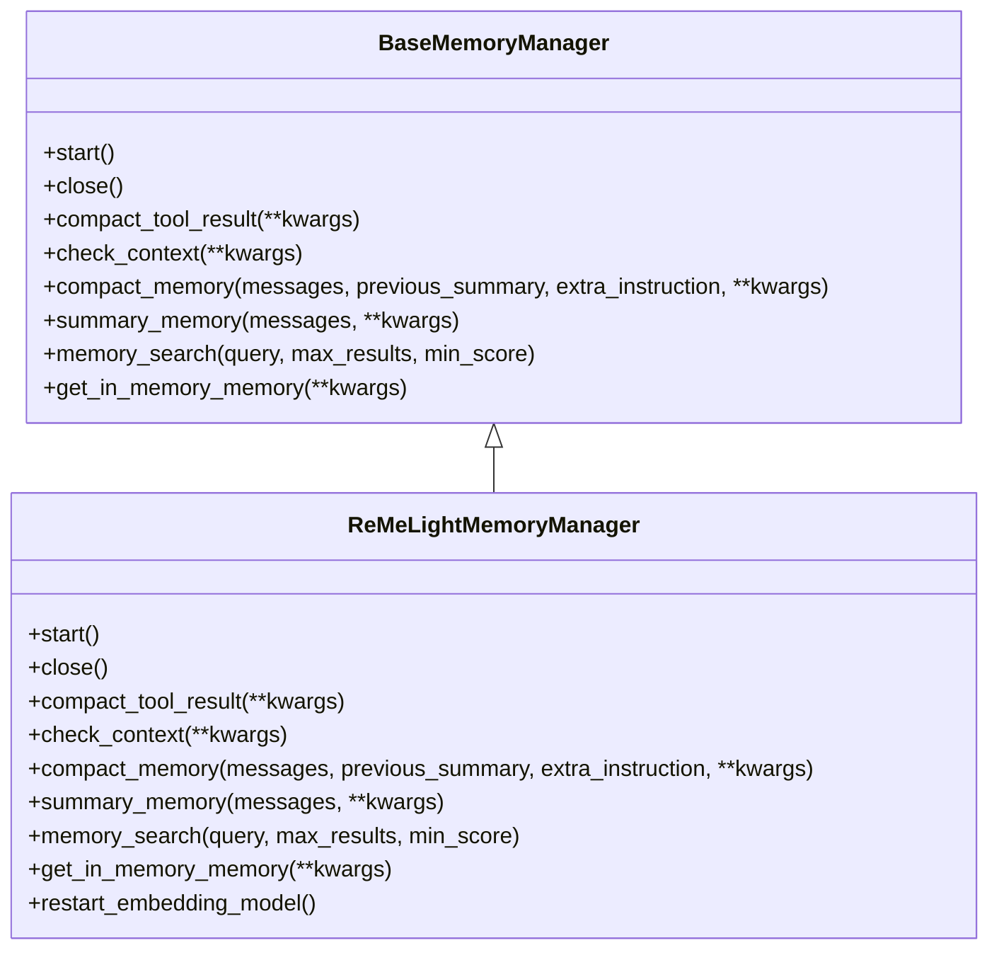
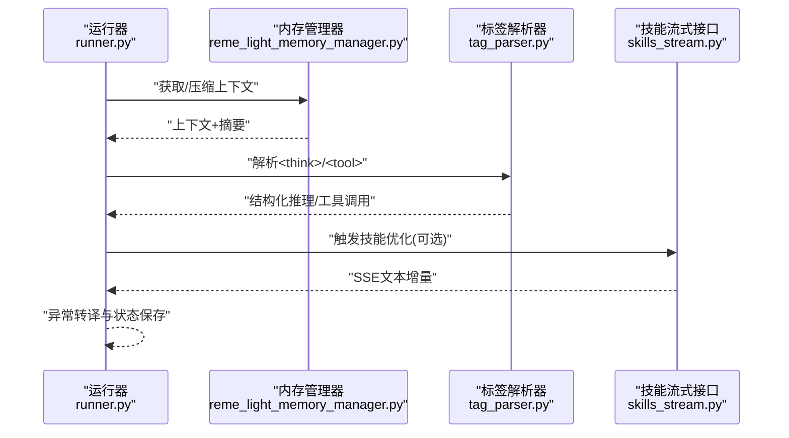
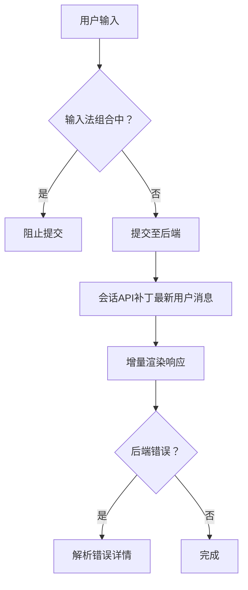
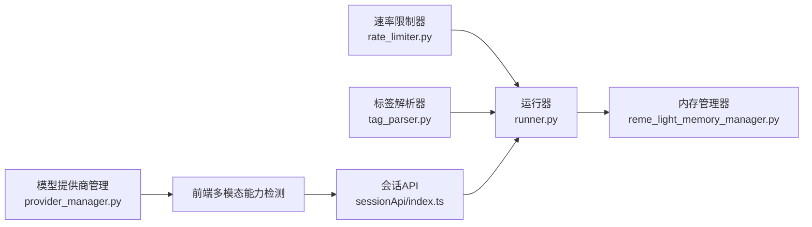

# 指导交互技能

<cite>
**本文引用的文件**
- [SKILL.md](file://src/qwenpaw/agents/skills/guidance/SKILL.md)
- [base_memory_manager.py](file://src/qwenpaw/agents/memory/base_memory_manager.py)
- [reme_light_memory_manager.py](file://src/qwenpaw/agents/memory/reme_light_memory_manager.py)
- [memory_compaction.py](file://src/qwenpaw/agents/hooks/memory_compaction.py)
- [context.en.md](file://website/public/docs/context.en.md)
- [memory.en.md](file://website/public/docs/memory.en.md)
- [runner.py](file://src/qwenpaw/app/runner/runner.py)
- [skills_stream.py](file://src/qwenpaw/app/routers/skills_stream.py)
- [tag_parser.py](file://src/qwenpaw/local_models/tag_parser.py)
- [index.tsx](file://console/src/pages/Chat/index.tsx)
- [sessionApi/index.ts](file://console/src/pages/Chat/sessionApi/index.ts)
- [rate_limiter.py](file://src/qwenpaw/providers/rate_limiter.py)
- [provider_manager.py](file://src/qwenpaw/providers/provider_manager.py)
- [error.ts](file://console/src/utils/error.ts)
</cite>

## 目录
1. [简介](#简介)
2. [项目结构](#项目结构)
3. [核心组件](#核心组件)
4. [架构总览](#架构总览)
5. [详细组件分析](#详细组件分析)
6. [依赖分析](#依赖分析)
7. [性能考虑](#性能考虑)
8. [故障排查指南](#故障排查指南)
9. [结论](#结论)
10. [附录](#附录)

## 简介
本文件面向QwenPaw的“指导交互技能”，系统化阐述其对话式交互的设计理念与实现机制，覆盖上下文管理、状态跟踪、意图识别、响应生成等核心技术；并进一步扩展到多轮对话管理、情感分析、知识检索、推荐算法等高级能力的实现方案。文档同时给出自然语言处理与机器学习模型集成、对话流程控制的技术细节，以及在复杂交互场景（多任务并行、条件分支、循环对话、异常处理）中的应对策略，并总结用户体验优化、响应速度提升与准确性改进的性能优化策略。

## 项目结构
指导交互技能位于后端Python工程的skills目录中，前端控制台通过React页面与后端流式接口进行交互。整体结构围绕“技能定义—内存管理—推理执行—前端渲染”的链路展开。

**图表来源**
- [index.tsx:400-800](file://console/src/pages/Chat/index.tsx#L400-L800)
- [sessionApi/index.ts:485-560](file://console/src/pages/Chat/sessionApi/index.ts#L485-L560)
- [runner.py:485-594](file://src/qwenpaw/app/runner/runner.py#L485-L594)
- [skills_stream.py:170-249](file://src/qwenpaw/app/routers/skills_stream.py#L170-L249)
- [base_memory_manager.py:21-126](file://src/qwenpaw/agents/memory/base_memory_manager.py#L21-L126)
- [reme_light_memory_manager.py:38-141](file://src/qwenpaw/agents/memory/reme_light_memory_manager.py#L38-L141)
- [memory_compaction.py:90-213](file://src/qwenpaw/agents/hooks/memory_compaction.py#L90-L213)
- [tag_parser.py:1-53](file://src/qwenpaw/local_models/tag_parser.py#L1-L53)
- [rate_limiter.py:43-136](file://src/qwenpaw/providers/rate_limiter.py#L43-L136)
- [provider_manager.py:316-345](file://src/qwenpaw/providers/provider_manager.py#L316-L345)

**章节来源**
- [index.tsx:400-800](file://console/src/pages/Chat/index.tsx#L400-L800)
- [sessionApi/index.ts:485-560](file://console/src/pages/Chat/sessionApi/index.ts#L485-L560)
- [runner.py:485-594](file://src/qwenpaw/app/runner/runner.py#L485-L594)
- [skills_stream.py:170-249](file://src/qwenpaw/app/routers/skills_stream.py#L170-L249)
- [base_memory_manager.py:21-126](file://src/qwenpaw/agents/memory/base_memory_manager.py#L21-L126)
- [reme_light_memory_manager.py:38-141](file://src/qwenpaw/agents/memory/reme_light_memory_manager.py#L38-L141)
- [memory_compaction.py:90-213](file://src/qwenpaw/agents/hooks/memory_compaction.py#L90-L213)
- [tag_parser.py:1-53](file://src/qwenpaw/local_models/tag_parser.py#L1-L53)
- [rate_limiter.py:43-136](file://src/qwenpaw/providers/rate_limiter.py#L43-L136)
- [provider_manager.py:316-345](file://src/qwenpaw/providers/provider_manager.py#L316-L345)

## 核心组件
- 技能定义与流程
  - 指导交互技能遵循“先查本地文档—再回答—兜底官网”的标准流程，强调基于已读内容的准确回答与多语言一致性。
  - 关键流程节点包括：文档目录定位、文档检索与匹配、内容阅读与相关性筛选、信息抽取与结构化输出、官网兜底检索。
- 内存与上下文
  - 采用ReMe轻量内存管理器，支持向量化+BM25混合检索、工具结果压缩、上下文压缩与摘要生成，确保长对话的稳定性与性能。
  - 内存压缩钩子在推理前自动触发，按阈值与保留区策略进行压缩，保障token占用可控。
- 推理与响应
  - 运行器负责会话生命周期管理、聊天通道注册、技能注入与异常转译，结合模型工厂与格式化器生成最终响应。
  - 流式优化接口提供技能内容的SSE流式优化，便于前端增量渲染。
- 前端交互
  - 控制台Chat页面封装了发送、停止、附件上传、命令提示、多模态能力检测与回放补丁等能力，配合会话API实现多会话与状态同步。

**章节来源**
- [SKILL.md:1-138](file://src/qwenpaw/agents/skills/guidance/SKILL.md#L1-L138)
- [base_memory_manager.py:21-126](file://src/qwenpaw/agents/memory/base_memory_manager.py#L21-L126)
- [reme_light_memory_manager.py:38-141](file://src/qwenpaw/agents/memory/reme_light_memory_manager.py#L38-L141)
- [memory_compaction.py:90-213](file://src/qwenpaw/agents/hooks/memory_compaction.py#L90-L213)
- [runner.py:485-594](file://src/qwenpaw/app/runner/runner.py#L485-L594)
- [skills_stream.py:170-249](file://src/qwenpaw/app/routers/skills_stream.py#L170-L249)
- [index.tsx:400-800](file://console/src/pages/Chat/index.tsx#L400-L800)
- [sessionApi/index.ts:485-560](file://console/src/pages/Chat/sessionApi/index.ts#L485-L560)

## 架构总览
指导交互技能的端到端交互链路由前端发起请求，经由会话API与运行器接入后端，结合内存管理与模型服务生成响应，最后通过流式接口返回给前端渲染。

**图表来源**
- [index.tsx:566-642](file://console/src/pages/Chat/index.tsx#L566-L642)
- [sessionApi/index.ts:485-560](file://console/src/pages/Chat/sessionApi/index.ts#L485-L560)
- [runner.py:485-594](file://src/qwenpaw/app/runner/runner.py#L485-L594)
- [reme_light_memory_manager.py:38-141](file://src/qwenpaw/agents/memory/reme_light_memory_manager.py#L38-L141)
- [skills_stream.py:170-249](file://src/qwenpaw/app/routers/skills_stream.py#L170-L249)

## 详细组件分析

### 指导交互技能（技能定义与流程）
- 设计理念
  - 优先本地文档，再回答用户问题；严格基于已读内容，避免臆测；语言与用户提问一致。
  - 提供标准流程：定位文档位置、文档检索与匹配、阅读内容、提取信息作答、官网兜底。
- 实现要点
  - 文档目录定位：优先从记忆中读取，其次从项目源码与工作目录中推断与验证。
  - 文档检索：按主题关键词与文件命名规范筛选候选文档，必要时全量阅读。
  - 信息抽取：聚焦安装步骤、配置项、示例命令、注意事项与版本差异，保证可复制性与完整性。
  - 官网兜底：当本地信息不足时，使用官网作为权威来源，并在答案中标注来源。

**图表来源**
- [SKILL.md:21-138](file://src/qwenpaw/agents/skills/guidance/SKILL.md#L21-L138)

**章节来源**
- [SKILL.md:1-138](file://src/qwenpaw/agents/skills/guidance/SKILL.md#L1-L138)

### 内存管理与上下文压缩
- 抽象接口
  - 内存管理器抽象定义了启动、关闭、工具结果压缩、上下文检查、内存压缩、摘要生成、搜索与内存对象获取等接口，确保不同后端的一致性。
- ReMe轻量实现
  - 负责与ReMeLight交互，提供向量化+BM25混合检索、索引重建、嵌入模型重启、工具函数注册等能力。
  - 支持按配置选择存储后端（local/chroma/sqlite），并提供向量与全文检索融合策略。
- 压缩钩子
  - 在推理前检查上下文大小，按阈值与保留区策略进行压缩；支持异步摘要任务与无效结果保护。

**图表来源**
- [base_memory_manager.py:21-226](file://src/qwenpaw/agents/memory/base_memory_manager.py#L21-L226)
- [reme_light_memory_manager.py:38-141](file://src/qwenpaw/agents/memory/reme_light_memory_manager.py#L38-L141)

**章节来源**
- [base_memory_manager.py:21-226](file://src/qwenpaw/agents/memory/base_memory_manager.py#L21-L226)
- [reme_light_memory_manager.py:38-141](file://src/qwenpaw/agents/memory/reme_light_memory_manager.py#L38-L141)
- [memory_compaction.py:90-213](file://src/qwenpaw/agents/hooks/memory_compaction.py#L90-L213)
- [context.en.md:57-103](file://website/public/docs/context.en.md#L57-L103)
- [memory.en.md:139-257](file://website/public/docs/memory.en.md#L139-L257)

### 推理执行与响应生成
- 运行器职责
  - 注册聊天通道、注入技能、处理异常转译与会话状态保存；在生成过程中对最新用户消息进行缓存与补丁，保证重连一致性。
- 流式优化接口
  - 提供SSE流式接口，按系统提示词对技能内容进行优化，前端可增量渲染优化结果。
- 标签解析
  - 解析本地模型输出中的<think>与<tool_call>...</tool_call>标签，支持推理与工具调用的结构化提取。

**图表来源**
- [runner.py:485-594](file://src/qwenpaw/app/runner/runner.py#L485-L594)
- [reme_light_memory_manager.py:38-141](file://src/qwenpaw/agents/memory/reme_light_memory_manager.py#L38-L141)
- [tag_parser.py:1-53](file://src/qwenpaw/local_models/tag_parser.py#L1-L53)
- [skills_stream.py:170-249](file://src/qwenpaw/app/routers/skills_stream.py#L170-L249)

**章节来源**
- [runner.py:485-594](file://src/qwenpaw/app/runner/runner.py#L485-L594)
- [skills_stream.py:170-249](file://src/qwenpaw/app/routers/skills_stream.py#L170-L249)
- [tag_parser.py:1-53](file://src/qwenpaw/local_models/tag_parser.py#L1-L53)

### 前端交互与用户体验
- 输入与命令
  - 支持命令建议（/clear、/compact、/approve、/deny）、输入前校验（防输入法组合提交）、多模态能力检测与附件上传。
- 会话与URL同步
  - 会话列表与URL同步，避免重复回调；支持首选会话ID预设与实时ID映射。
- 错误解析
  - 前端错误解析工具可从后端错误消息中提取JSON详情，辅助诊断。

**图表来源**
- [index.tsx:566-642](file://console/src/pages/Chat/index.tsx#L566-L642)
- [sessionApi/index.ts:402-442](file://console/src/pages/Chat/sessionApi/index.ts#L402-L442)
- [error.ts:1-11](file://console/src/utils/error.ts#L1-L11)

**章节来源**
- [index.tsx:400-800](file://console/src/pages/Chat/index.tsx#L400-L800)
- [sessionApi/index.ts:485-560](file://console/src/pages/Chat/sessionApi/index.ts#L485-L560)
- [error.ts:1-11](file://console/src/utils/error.ts#L1-L11)

## 依赖分析
- 外部依赖与集成点
  - 模型提供商管理：维护模型能力探测与清单，用于前端多模态能力检测与后端模型选择。
  - 速率限制器：对并发与QPM进行统一控制，避免上游限流或过载。
  - 本地模型标签解析：解析<think>与<tool_call>...</tool_call>标签，支撑推理与工具调用的结构化提取。
- 内部耦合
  - 运行器与内存管理器松耦合，通过抽象接口交互；ReMe轻量实现封装具体细节。
  - 前端通过会话API与运行器解耦，仅依赖HTTP与SSE协议。

**图表来源**
- [provider_manager.py:316-345](file://src/qwenpaw/providers/provider_manager.py#L316-L345)
- [rate_limiter.py:43-136](file://src/qwenpaw/providers/rate_limiter.py#L43-L136)
- [tag_parser.py:1-53](file://src/qwenpaw/local_models/tag_parser.py#L1-L53)
- [runner.py:485-594](file://src/qwenpaw/app/runner/runner.py#L485-L594)
- [reme_light_memory_manager.py:38-141](file://src/qwenpaw/agents/memory/reme_light_memory_manager.py#L38-L141)
- [index.tsx:400-800](file://console/src/pages/Chat/index.tsx#L400-L800)
- [sessionApi/index.ts:485-560](file://console/src/pages/Chat/sessionApi/index.ts#L485-L560)

**章节来源**
- [provider_manager.py:316-345](file://src/qwenpaw/providers/provider_manager.py#L316-L345)
- [rate_limiter.py:43-136](file://src/qwenpaw/providers/rate_limiter.py#L43-L136)
- [tag_parser.py:1-53](file://src/qwenpaw/local_models/tag_parser.py#L1-L53)
- [runner.py:485-594](file://src/qwenpaw/app/runner/runner.py#L485-L594)
- [reme_light_memory_manager.py:38-141](file://src/qwenpaw/agents/memory/reme_light_memory_manager.py#L38-L141)
- [index.tsx:400-800](file://console/src/pages/Chat/index.tsx#L400-L800)
- [sessionApi/index.ts:485-560](file://console/src/pages/Chat/sessionApi/index.ts#L485-L560)

## 性能考虑
- 内存与上下文
  - 启动时根据平台自动选择稳定后端（local/chroma），并提供向量+BM25混合检索，兼顾语义召回与精确命中。
  - 压缩阈值与保留区策略确保近期高价值消息不被压缩，降低重复检索成本。
- 流式与并发
  - SSE流式接口支持增量渲染，减少首屏等待时间；速率限制器控制并发与QPM，避免抖动。
- 前端体验
  - 输入法组合事件抑制、命令建议、附件上传与多模态能力检测，提升输入效率与反馈及时性。

**章节来源**
- [memory.en.md:139-257](file://website/public/docs/memory.en.md#L139-L257)
- [context.en.md:57-103](file://website/public/docs/context.en.md#L57-L103)
- [rate_limiter.py:43-136](file://src/qwenpaw/providers/rate_limiter.py#L43-L136)
- [skills_stream.py:170-249](file://src/qwenpaw/app/routers/skills_stream.py#L170-L249)
- [index.tsx:400-800](file://console/src/pages/Chat/index.tsx#L400-L800)

## 故障排查指南
- 常见问题
  - 模型未配置：前端构建400错误响应，提示先配置模型；后端异常转译包含调试路径。
  - ReMe未启动：内存搜索返回“未启动”提示，需检查启动流程与索引状态。
  - 压缩失败：无效压缩结果会被保存为日志文件，便于社区反馈。
- 前端错误解析
  - 从后端错误消息中解析JSON详情，辅助定位问题。

**章节来源**
- [runner.py:559-594](file://src/qwenpaw/app/runner/runner.py#L559-L594)
- [reme_light_memory_manager.py:406-427](file://src/qwenpaw/agents/memory/reme_light_memory_manager.py#L406-L427)
- [memory_compaction.py:348-377](file://src/qwenpaw/agents/hooks/memory_compaction.py#L348-L377)
- [error.ts:1-11](file://console/src/utils/error.ts#L1-L11)

## 结论
指导交互技能通过“先本地后官网”的严谨流程与ReMe轻量内存管理器的上下文压缩、混合检索能力，实现了高准确性的问答与指导服务。前端通过SSE流式渲染与命令建议、多模态能力检测等手段显著提升了交互效率与体验。在复杂场景下，运行器与速率限制器协同保障了系统的稳定性与可扩展性。未来可在情感分析、个性化推荐与跨域协作等方面进一步增强，以满足更丰富的指导交互需求。

## 附录
- 相关文档
  - 上下文与内存设计：[context.en.md:57-103](file://website/public/docs/context.en.md#L57-L103)、[memory.en.md:139-257](file://website/public/docs/memory.en.md#L139-L257)
  - 技能定义：[guidance/SKILL.md:1-138](file://src/qwenpaw/agents/skills/guidance/SKILL.md#L1-L138)
  - 前端Chat页面：[index.tsx:400-800](file://console/src/pages/Chat/index.tsx#L400-L800)
  - 会话API：[sessionApi/index.ts:485-560](file://console/src/pages/Chat/sessionApi/index.ts#L485-L560)
  - 运行器与异常转译：[runner.py:559-594](file://src/qwenpaw/app/runner/runner.py#L559-L594)
  - 技能流式优化：[skills_stream.py:170-249](file://src/qwenpaw/app/routers/skills_stream.py#L170-L249)
  - 标签解析：[tag_parser.py:1-53](file://src/qwenpaw/local_models/tag_parser.py#L1-L53)
  - 速率限制：[rate_limiter.py:43-136](file://src/qwenpaw/providers/rate_limiter.py#L43-L136)
  - 模型提供商：[provider_manager.py:316-345](file://src/qwenpaw/providers/provider_manager.py#L316-L345)