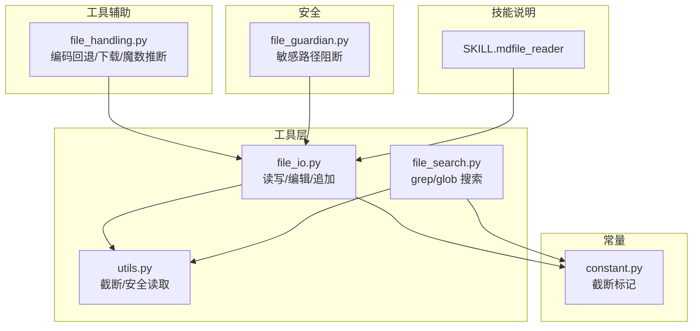
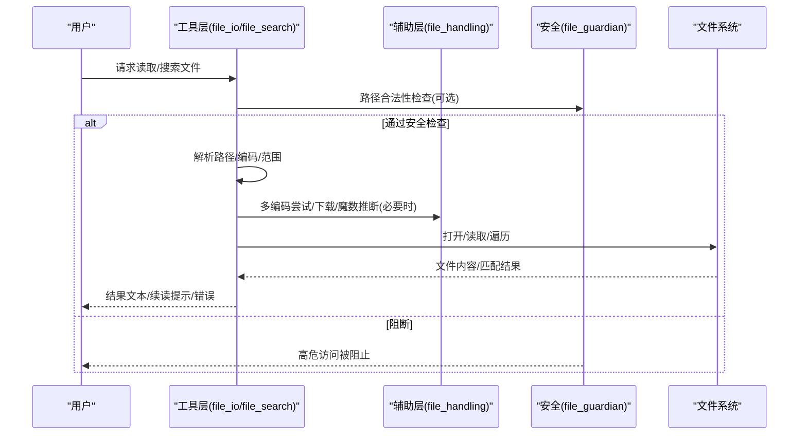
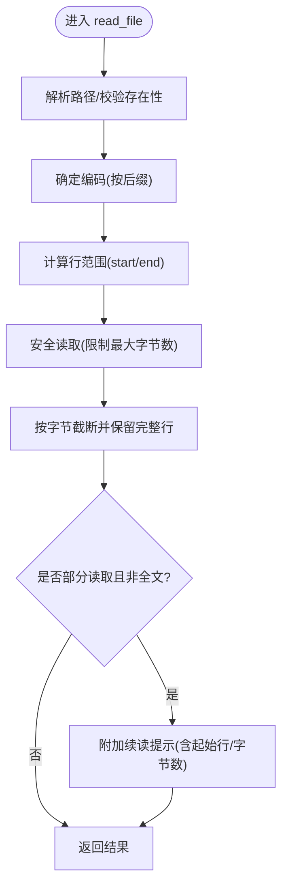
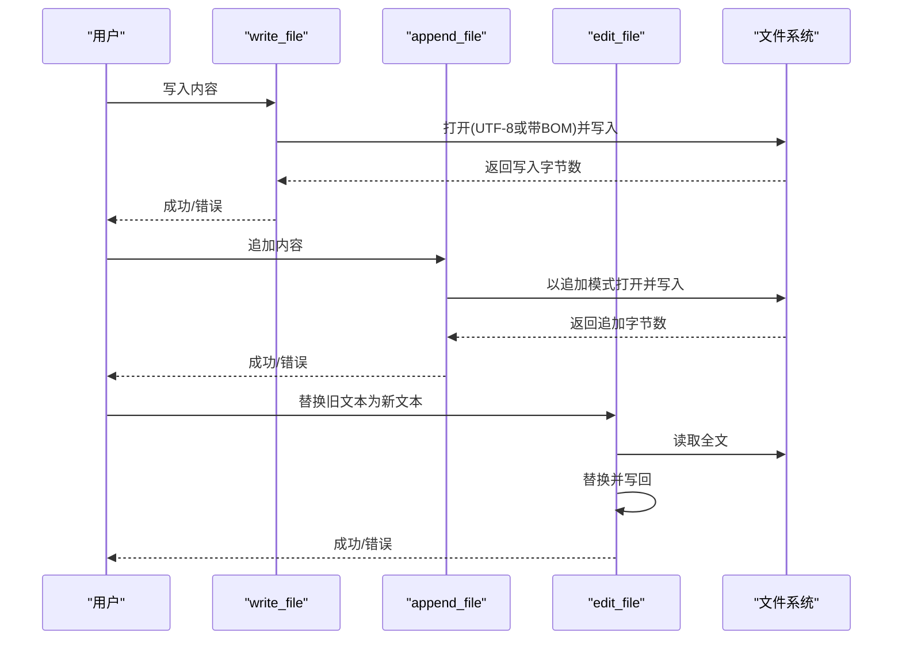
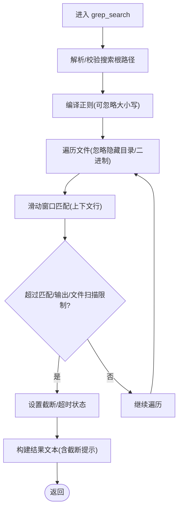
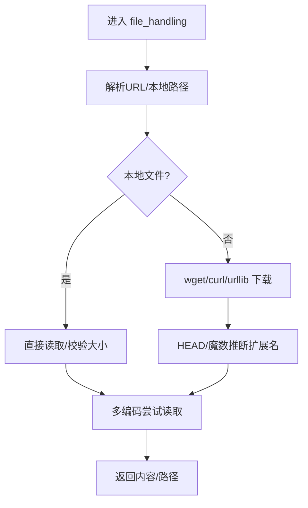
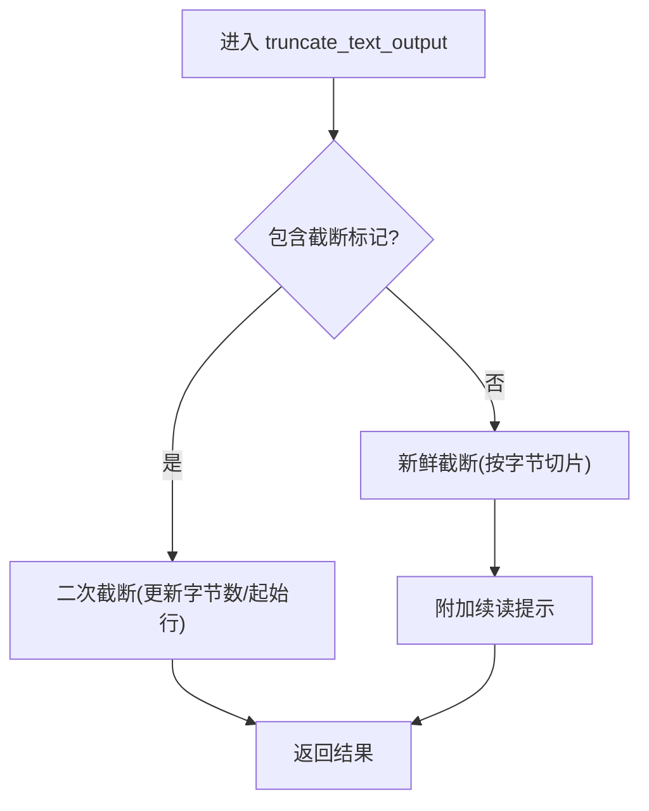
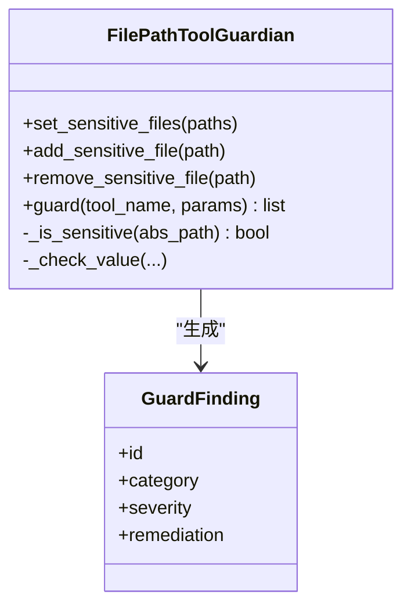
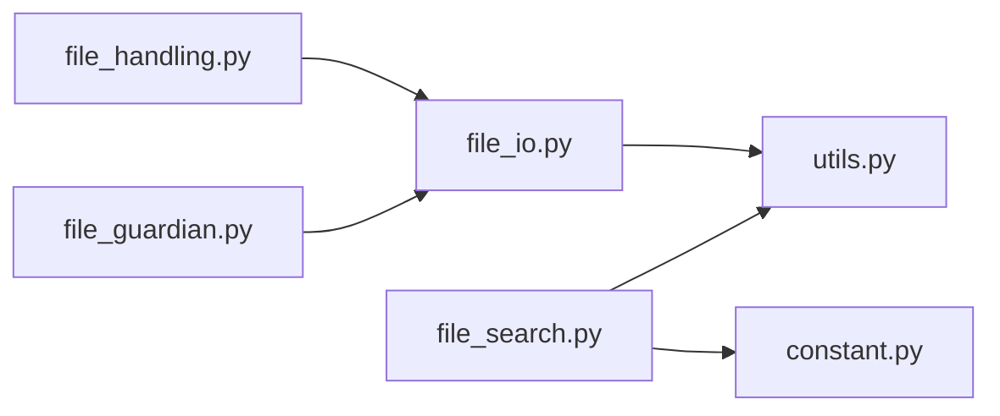

# 文件操作技能

<cite>
**本文引用的文件**
- [file_io.py](file://src/qwenpaw/agents/tools/file_io.py)
- [file_search.py](file://src/qwenpaw/agents/tools/file_search.py)
- [file_handling.py](file://src/qwenpaw/agents/utils/file_handling.py)
- [utils.py](file://src/qwenpaw/agents/tools/utils.py)
- [SKILL.md（file_reader）](file://src/qwenpaw/agents/skills/file_reader/SKILL.md)
- [constant.py](file://src/qwenpaw/constant.py)
- [file_guardian.py](file://src/qwenpaw/security/tool_guard/guardians/file_guardian.py)
- [test_file_search.py](file://tests/unit/agents/tools/test_file_search.py)
</cite>

## 目录
1. [简介](#简介)
2. [项目结构](#项目结构)
3. [核心组件](#核心组件)
4. [架构总览](#架构总览)
5. [详细组件分析](#详细组件分析)
6. [依赖分析](#依赖分析)
7. [性能考虑](#性能考虑)
8. [故障排查指南](#故障排查指南)
9. [结论](#结论)
10. [附录](#附录)

## 简介
本技术文档聚焦于 QwenPaw 的“文件操作技能”，系统性阐述以下能力与实现细节：
- 文件读取：多格式文本解析、编码回退、智能截断与续读提示、大文件分段读取与续传思路
- 文件搜索：递归遍历、模糊匹配、正则过滤、大小限制、超时控制、上下文输出
- 底层能力：文件系统遍历、权限与路径解析、编码转换、下载与扩展名推断
- 性能优化：内存保护、并发读写、滑动窗口匹配、输出截断与续读
- 安全与合规：敏感路径阻断、规则扫描、工具调用守卫

## 项目结构
围绕文件操作技能的相关模块主要分布在 agents/tools 与 agents/utils 下，并辅以安全守卫与测试用例：
- 工具层（agents/tools）
  - file_io.py：文件读写、编辑、追加、路径解析、编码选择
  - file_search.py：grep 内容搜索、glob 文件发现、滑动窗口匹配、超时与截断
  - utils.py：通用截断与安全读取、默认最大字节限制
- 工具辅助（agents/utils）
  - file_handling.py：跨平台编码回退、URL/本地路径解析、远程下载、魔数推断扩展名
- 技能说明（agents/skills/file_reader）
  - SKILL.md：文本类文件读取的使用边界与建议
- 常量与标记（constant.py）
  - TRUNCATION_NOTICE_MARKER：截断提示标记
- 安全守卫（security/tool_guard）
  - file_guardian.py：基于路径的敏感文件阻断与规则扫描
- 测试（tests/unit/agents/tools/test_file_search.py）
  - 针对搜索行为的单元测试，覆盖大小限制、输出截断、超时等场景

**图表来源**
- [file_io.py:1-396](file://src/qwenpaw/agents/tools/file_io.py#L1-L396)
- [file_search.py:1-629](file://src/qwenpaw/agents/tools/file_search.py#L1-L629)
- [utils.py:1-238](file://src/qwenpaw/agents/tools/utils.py#L1-L238)
- [file_handling.py:1-357](file://src/qwenpaw/agents/utils/file_handling.py#L1-L357)
- [constant.py:295-306](file://src/qwenpaw/constant.py#L295-L306)
- [file_guardian.py:1-365](file://src/qwenpaw/security/tool_guard/guardians/file_guardian.py#L1-L365)
- [SKILL.md（file_reader）:1-59](file://src/qwenpaw/agents/skills/file_reader/SKILL.md#L1-L59)

**章节来源**
- [file_io.py:1-396](file://src/qwenpaw/agents/tools/file_io.py#L1-L396)
- [file_search.py:1-629](file://src/qwenpaw/agents/tools/file_search.py#L1-L629)
- [file_handling.py:1-357](file://src/qwenpaw/agents/utils/file_handling.py#L1-L357)
- [utils.py:1-238](file://src/qwenpaw/agents/tools/utils.py#L1-L238)
- [constant.py:295-306](file://src/qwenpaw/constant.py#L295-L306)
- [file_guardian.py:1-365](file://src/qwenpaw/security/tool_guard/guardians/file_guardian.py#L1-L365)
- [SKILL.md（file_reader）:1-59](file://src/qwenpaw/agents/skills/file_reader/SKILL.md#L1-L59)

## 核心组件
- 文件读取工具（read_file）
  - 支持相对/绝对路径解析、行范围读取、智能截断与续读提示
  - 自动选择编码（CSV/TSV/TXT/LOG 使用带 BOM 的 UTF-8，其他默认 UTF-8）
  - 大文件安全读取上限与异常处理
- 文件写入/编辑/追加（write_file/edit_file/append_file）
  - 统一编码策略与错误反馈
- 文件搜索（grep_search/glob_search）
  - 递归遍历、忽略常见隐藏目录、二进制扩展白名单外跳过
  - 正则/模糊匹配、大小限制、上下文行输出、超时控制
- 编码与下载辅助（file_handling）
  - 多编码尝试（含 BOM）、URL/本地路径解析、远程下载、魔数推断真实扩展名
- 截断与续读（utils）
  - 基于字节的截断策略、保留完整行、嵌入续读提示、二次截断更新
- 安全守卫（file_guardian）
  - 敏感路径阻断、规则扫描、shell 命令路径提取与检测

**章节来源**
- [file_io.py:66-396](file://src/qwenpaw/agents/tools/file_io.py#L66-L396)
- [file_search.py:478-629](file://src/qwenpaw/agents/tools/file_search.py#L478-L629)
- [file_handling.py:31-357](file://src/qwenpaw/agents/utils/file_handling.py#L31-L357)
- [utils.py:153-238](file://src/qwenpaw/agents/tools/utils.py#L153-L238)
- [file_guardian.py:184-365](file://src/qwenpaw/security/tool_guard/guardians/file_guardian.py#L184-L365)

## 架构总览
文件操作技能由“工具层”“辅助层”“安全层”协同完成，形成从输入到输出的闭环：
- 输入：用户请求（路径、模式、大小/上下文限制等）
- 处理：路径解析、编码选择、滑动窗口匹配、截断策略
- 输出：结果文本、续读提示、错误信息
- 安全：敏感路径阻断、规则扫描

**图表来源**
- [file_io.py:23-396](file://src/qwenpaw/agents/tools/file_io.py#L23-L396)
- [file_search.py:134-629](file://src/qwenpaw/agents/tools/file_search.py#L134-L629)
- [file_handling.py:111-357](file://src/qwenpaw/agents/utils/file_handling.py#L111-L357)
- [file_guardian.py:184-365](file://src/qwenpaw/security/tool_guard/guardians/file_guardian.py#L184-L365)

## 详细组件分析

### 文件读取工具（read_file）
- 路径解析与编码
  - 相对路径解析至当前工作空间或全局工作目录
  - 根据文件后缀自动选择编码（CSV/TSV/TXT/LOG 使用带 BOM 的 UTF-8）
- 行范围读取与截断
  - 支持 start_line/end_line 指定范围
  - 基于字节上限进行截断，保留完整行；若未截断但非全文，附加续读提示
- 大文件与异常处理
  - 使用异步安全读取函数限制最大读取字节数
  - 统一异常包装为工具响应

**图表来源**
- [file_io.py:66-205](file://src/qwenpaw/agents/tools/file_io.py#L66-L205)
- [utils.py:153-206](file://src/qwenpaw/agents/tools/utils.py#L153-L206)
- [constant.py:295-306](file://src/qwenpaw/constant.py#L295-L306)

**章节来源**
- [file_io.py:66-205](file://src/qwenpaw/agents/tools/file_io.py#L66-L205)
- [utils.py:153-206](file://src/qwenpaw/agents/tools/utils.py#L153-L206)
- [constant.py:295-306](file://src/qwenpaw/constant.py#L295-L306)

### 文件写入/编辑/追加（write_file/edit_file/append_file）
- 写入与追加
  - 统一编码策略，错误捕获并返回工具响应
- 文本替换（edit_file）
  - 先读取再替换，失败时回显写入阶段错误

**图表来源**
- [file_io.py:208-396](file://src/qwenpaw/agents/tools/file_io.py#L208-L396)

**章节来源**
- [file_io.py:208-396](file://src/qwenpaw/agents/tools/file_io.py#L208-L396)

### 文件搜索（grep_search/glob_search）
- grep_search
  - 递归遍历，忽略常见隐藏目录与已知二进制扩展
  - 正则/模糊匹配、大小限制、上下文行输出、滑动窗口匹配
  - 超时控制与取消信号，支持“截断/超时”状态报告
- glob_search
  - 基于 glob 模式查找文件，支持目录限定与结果截断

**图表来源**
- [file_search.py:478-576](file://src/qwenpaw/agents/tools/file_search.py#L478-L576)

**章节来源**
- [file_search.py:478-576](file://src/qwenpaw/agents/tools/file_search.py#L478-L576)
- [test_file_search.py:519-736](file://tests/unit/agents/tools/test_file_search.py#L519-L736)

### 编码回退与下载辅助（file_handling）
- 多编码尝试
  - 尝试顺序：UTF-8-SIG → UTF-8 → GBK/CP936 → CP1252/Latin-1 → UTF-8 错误替换
- URL/本地路径解析
  - file://、绝对/相对路径、Windows 特殊路径识别
- 远程下载
  - wget/curl/urllib 三路降级，超时控制
- 扩展名推断
  - HEAD 请求 + 魔数（magic bytes）推断真实扩展名

**图表来源**
- [file_handling.py:111-357](file://src/qwenpaw/agents/utils/file_handling.py#L111-L357)

**章节来源**
- [file_handling.py:31-357](file://src/qwenpaw/agents/utils/file_handling.py#L31-L357)

### 截断与续读（utils）
- 新鲜截断（首次截断）
  - 按字节切片，保留完整行，附加续读提示（起始行、总行数、字节数）
- 二次截断（已有提示）
  - 解析既有提示，按新上限重新切片并更新提示字段
- 安全读取
  - 异步读取并限制最大字节数，Unicode 错误时忽略

**图表来源**
- [utils.py:153-206](file://src/qwenpaw/agents/tools/utils.py#L153-L206)
- [constant.py:295-306](file://src/qwenpaw/constant.py#L295-L306)

**章节来源**
- [utils.py:153-206](file://src/qwenpaw/agents/tools/utils.py#L153-L206)
- [constant.py:295-306](file://src/qwenpaw/constant.py#L295-L306)

### 安全守卫（file_guardian）
- 敏感路径阻断
  - 默认阻断工作空间内敏感目录（兼容历史命名），可配置扩展
  - 对 known file tools 与 shell 命令进行路径提取与阻断
- 规则扫描
  - 高危威胁分类与修复建议，支持动态重载

**图表来源**
- [file_guardian.py:184-365](file://src/qwenpaw/security/tool_guard/guardians/file_guardian.py#L184-L365)

**章节来源**
- [file_guardian.py:184-365](file://src/qwenpaw/security/tool_guard/guardians/file_guardian.py#L184-L365)

## 依赖分析
- 工具层内部耦合度低，职责清晰
  - file_io 依赖 utils 的截断与安全读取
  - file_search 依赖常量中的截断标记与上下文限制
- 辅助层与工具层解耦
  - file_handling 提供独立的编码与下载能力，供工具层复用
- 安全层独立于业务逻辑
  - file_guardian 可插拔地拦截敏感路径访问

**图表来源**
- [file_io.py:1-396](file://src/qwenpaw/agents/tools/file_io.py#L1-L396)
- [file_search.py:1-629](file://src/qwenpaw/agents/tools/file_search.py#L1-L629)
- [utils.py:1-238](file://src/qwenpaw/agents/tools/utils.py#L1-L238)
- [file_handling.py:1-357](file://src/qwenpaw/agents/utils/file_handling.py#L1-L357)
- [constant.py:295-306](file://src/qwenpaw/constant.py#L295-L306)
- [file_guardian.py:1-365](file://src/qwenpaw/security/tool_guard/guardians/file_guardian.py#L1-L365)

**章节来源**
- [file_io.py:1-396](file://src/qwenpaw/agents/tools/file_io.py#L1-L396)
- [file_search.py:1-629](file://src/qwenpaw/agents/tools/file_search.py#L1-L629)
- [utils.py:1-238](file://src/qwenpaw/agents/tools/utils.py#L1-L238)
- [file_handling.py:1-357](file://src/qwenpaw/agents/utils/file_handling.py#L1-L357)
- [constant.py:295-306](file://src/qwenpaw/constant.py#L295-L306)
- [file_guardian.py:1-365](file://src/qwenpaw/security/tool_guard/guardians/file_guardian.py#L1-L365)

## 性能考虑
- 内存保护
  - 安全读取限制最大读取字节数，避免大文件一次性加载
- 并发与异步
  - 搜索与读取采用异步线程池执行，避免阻塞事件循环
- 匹配效率
  - 滑动窗口匹配减少重复扫描，上下文输出批量拼接
- 输出截断
  - 基于字节而非字符的截断策略，保证在多字节编码下的一致性
- 超时控制
  - 搜索与 glob 查找设置超时阈值，及时中断长耗时任务

[本节为通用指导，无需具体文件分析]

## 故障排查指南
- 读取失败
  - 检查路径是否存在、是否为文件、权限是否足够
  - 若为大文件，使用行范围参数或分段读取
- 编码乱码
  - 使用多编码尝试读取工具或在写入时指定正确编码
- 搜索无结果
  - 检查搜索根路径、是否被忽略目录影响、是否超出大小/匹配限制
  - 对于超时，缩小搜索范围或缩短上下文行数
- 安全阻断
  - 检查敏感路径列表与启用状态，必要时调整规则

**章节来源**
- [file_io.py:114-132](file://src/qwenpaw/agents/tools/file_io.py#L114-L132)
- [file_search.py:537-547](file://src/qwenpaw/agents/tools/file_search.py#L537-L547)
- [file_guardian.py:313-365](file://src/qwenpaw/security/tool_guard/guardians/file_guardian.py#L313-L365)

## 结论
QwenPaw 的文件操作技能通过“工具层 + 辅助层 + 安全层”的分层设计，实现了：
- 多格式文本读取与智能截断
- 高效的递归搜索与上下文输出
- 跨平台编码回退与远程下载
- 敏感路径阻断与规则扫描
在性能与安全之间取得平衡，满足复杂场景下的文件处理需求。

[本节为总结，无需具体文件分析]

## 附录
- 技能边界与建议
  - file_reader 技能仅处理文本类文件，媒体/压缩/办公文档交由专用技能处理
- 常用参数与行为
  - 读取：支持 start_line/end_line 与续读提示
  - 搜索：支持正则/模糊、大小限制、上下文行、超时控制
  - 写入：统一编码策略，错误明确反馈

**章节来源**
- [SKILL.md（file_reader）:1-59](file://src/qwenpaw/agents/skills/file_reader/SKILL.md#L1-L59)