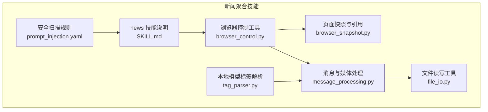
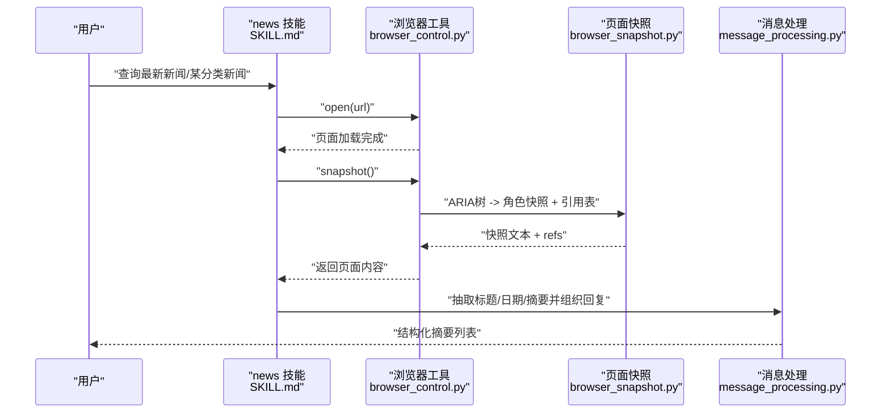
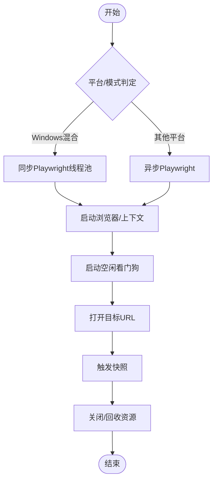
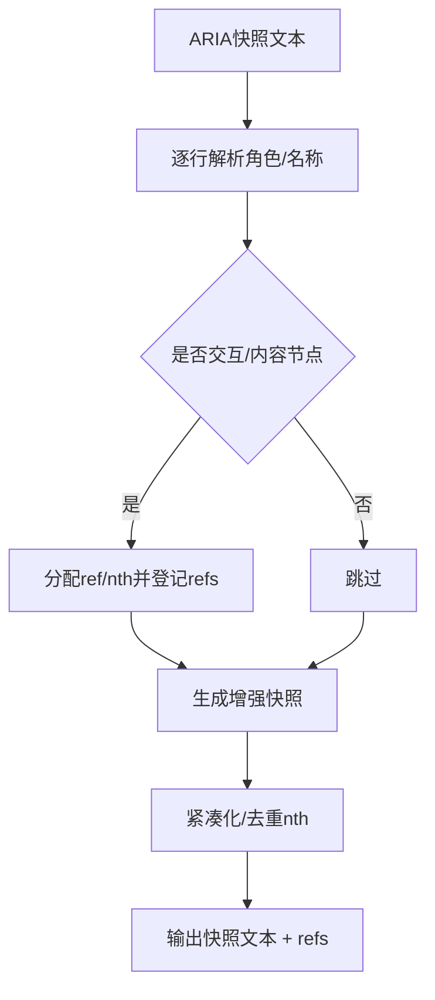
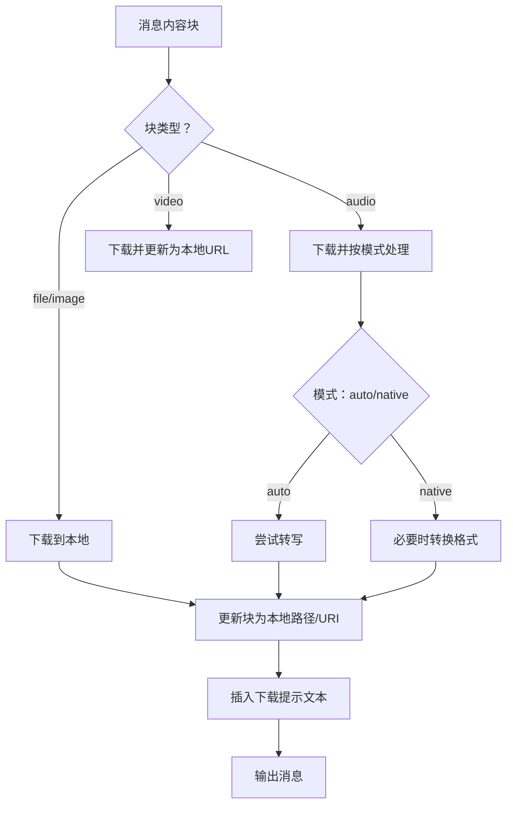
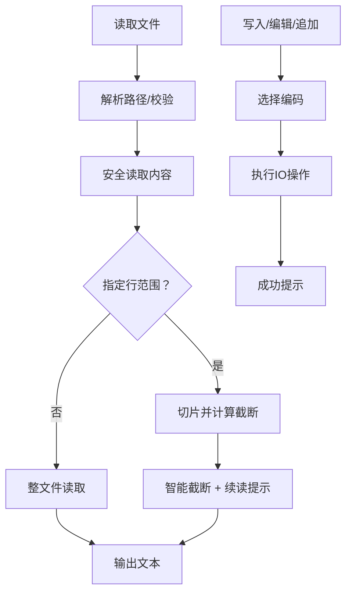
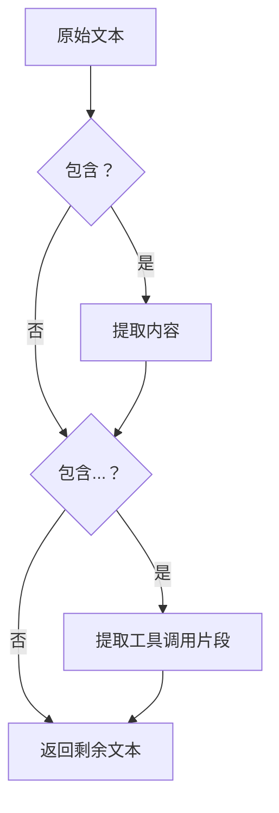
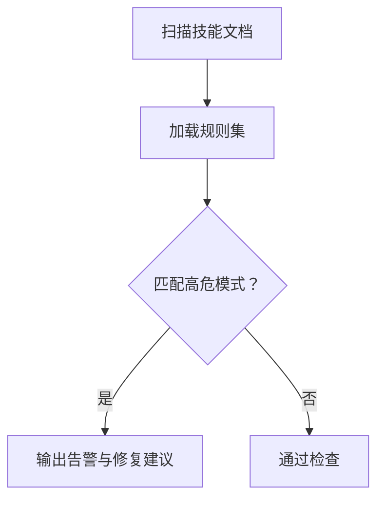
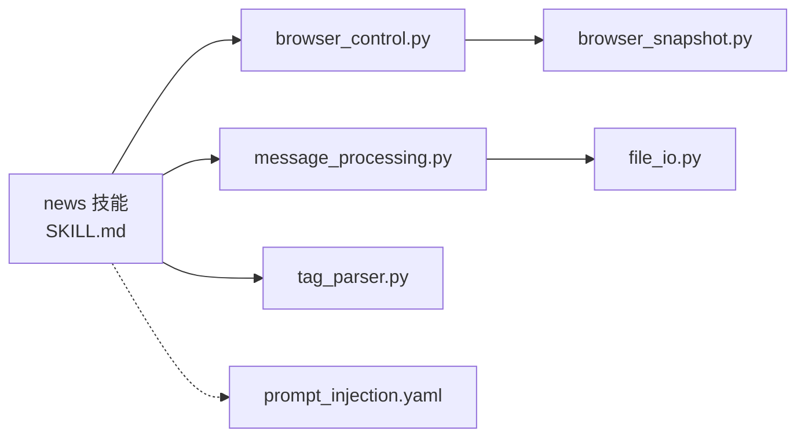

# 新闻聚合技能

<cite>
**本文引用的文件**
- [SKILL.md](file://src/qwenpaw/agents/skills/news/SKILL.md)
- [browser_control.py](file://src/qwenpaw/agents/tools/browser_control.py)
- [browser_snapshot.py](file://src/qwenpaw/agents/tools/browser_snapshot.py)
- [message_processing.py](file://src/qwenpaw/agents/utils/message_processing.py)
- [file_io.py](file://src/qwenpaw/agents/tools/file_io.py)
- [tag_parser.py](file://src/qwenpaw/local_models/tag_parser.py)
- [prompt_injection.yaml](file://src/qwenpaw/security/skill_scanner/rules/signatures/prompt_injection.yaml)
</cite>

## 目录
1. [简介](#简介)
2. [项目结构](#项目结构)
3. [核心组件](#核心组件)
4. [架构总览](#架构总览)
5. [详细组件分析](#详细组件分析)
6. [依赖关系分析](#依赖关系分析)
7. [性能考虑](#性能考虑)
8. [故障排查指南](#故障排查指南)
9. [结论](#结论)
10. [附录](#附录)

## 简介
本技术文档面向QwenPaw的“新闻聚合技能”，系统阐述其在多源信息采集、网页抓取、内容抽取、摘要生成与呈现方面的实现方式与工程化细节。该技能以内置的浏览器自动化工具为核心，结合页面快照与角色定位，完成对权威新闻站点的自动化访问与内容提取，并通过消息处理与工具调用流程，最终向用户输出结构化的新闻摘要列表。

## 项目结构
围绕新闻聚合技能的关键文件与模块如下：
- 技能说明与使用指引：SKILL.md
- 浏览器自动化工具：browser_control.py（Playwright驱动）
- 页面快照与元素引用：browser_snapshot.py（基于ARIA树构建ref映射）
- 消息与媒体块处理：message_processing.py（文件/媒体下载、转写、格式化）
- 文件读写工具：file_io.py（安全读写与编码策略）
- 本地模型标签解析：tag_parser.py（思考与函数调用标签解析）
- 安全扫描规则：prompt_injection.yaml（对抗提示注入攻击）

**图示来源**
- [SKILL.md:1-48](file://src/qwenpaw/agents/skills/news/SKILL.md#L1-L48)
- [browser_control.py:1-800](file://src/qwenpaw/agents/tools/browser_control.py#L1-L800)
- [browser_snapshot.py:1-249](file://src/qwenpaw/agents/tools/browser_snapshot.py#L1-L249)
- [message_processing.py:1-476](file://src/qwenpaw/agents/utils/message_processing.py#L1-L476)
- [file_io.py:1-396](file://src/qwenpaw/agents/tools/file_io.py#L1-L396)
- [tag_parser.py:1-310](file://src/qwenpaw/local_models/tag_parser.py#L1-L310)
- [prompt_injection.yaml:1-18](file://src/qwenpaw/security/skill_scanner/rules/signatures/prompt_injection.yaml#L1-L18)

**章节来源**
- [SKILL.md:1-48](file://src/qwenpaw/agents/skills/news/SKILL.md#L1-L48)

## 核心组件
- 新闻技能说明与使用流程：定义了政治、金融、社会、世界、科技、体育、娱乐七大类权威来源的URL清单与调用步骤，强调先打开页面再进行快照，随后从返回内容中抽取标题、日期与摘要并组织回复。
- 浏览器自动化工具：封装Playwright生命周期管理、上下文与页面状态、网络请求与控制台日志收集、对话框与文件选择器处理、CDP连接与空闲回收等能力，支持同步/异步模式与默认系统浏览器优先策略。
- 页面快照与引用：将ARIA树转换为带ref与nth索引的角色快照，便于后续基于角色与名称定位交互元素或内容区域。
- 消息与媒体处理：统一处理文件/图片/音频/视频块，下载至本地并更新消息内容；支持语音转写与格式转换；提供首次交互判断与引导文本前置等辅助能力。
- 文件读写工具：提供安全的文件读取、行范围读取、写入、编辑与追加操作，自动处理跨平台编码差异与截断提示。
- 本地模型标签解析：解析<think>与<tool_call>...</tool_call>等特殊标签，用于本地模型输出的结构化处理。
- 安全扫描规则：针对提示注入与指令覆盖等高危模式进行签名匹配，保障技能执行的安全性。

**章节来源**
- [SKILL.md:11-47](file://src/qwenpaw/agents/skills/news/SKILL.md#L11-L47)
- [browser_control.py:492-617](file://src/qwenpaw/agents/tools/browser_control.py#L492-L617)
- [browser_snapshot.py:185-249](file://src/qwenpaw/agents/tools/browser_snapshot.py#L185-L249)
- [message_processing.py:388-431](file://src/qwenpaw/agents/utils/message_processing.py#L388-L431)
- [file_io.py:66-206](file://src/qwenpaw/agents/tools/file_io.py#L66-L206)
- [tag_parser.py:23-50](file://src/qwenpaw/local_models/tag_parser.py#L23-L50)
- [prompt_injection.yaml:1-18](file://src/qwenpaw/security/skill_scanner/rules/signatures/prompt_injection.yaml#L1-L18)

## 架构总览
新闻聚合技能的端到端工作流如下：

**图示来源**
- [SKILL.md:27-41](file://src/qwenpaw/agents/skills/news/SKILL.md#L27-L41)
- [browser_control.py:642-800](file://src/qwenpaw/agents/tools/browser_control.py#L642-L800)
- [browser_snapshot.py:185-249](file://src/qwenpaw/agents/tools/browser_snapshot.py#L185-L249)
- [message_processing.py:388-431](file://src/qwenpaw/agents/utils/message_processing.py#L388-L431)

## 详细组件分析

### 组件A：浏览器自动化工具（browser_control.py）
- 职责与特性
  - 生命周期管理：启动/停止浏览器、上下文与页面状态维护、空闲监控与自动回收。
  - 多模式兼容：Windows混合模式（同步Playwright线程池）与标准异步模式；默认优先使用系统Chrome/Edge/Safari，否则回退至Playwright自带Chromium。
  - 连接与调试：支持CDP连接与远程调试端口；持久化上下文以保留Cookie/Storage。
  - 事件与日志：监听页面console、网络请求、对话框与文件选择器，便于问题诊断与行为追踪。
- 关键流程
  - 启动：根据环境变量与平台特性选择执行路径，必要时设置沙箱参数与可执行路径。
  - 打开页面：创建新页签并注册监听器，记录活动时间与页面计数。
  - 快照：触发ARIA快照，交由快照模块生成角色树与引用表。
  - 停止：取消空闲任务、关闭上下文/浏览器、清理状态。

**图示来源**
- [browser_control.py:492-617](file://src/qwenpaw/agents/tools/browser_control.py#L492-L617)
- [browser_control.py:642-800](file://src/qwenpaw/agents/tools/browser_control.py#L642-L800)
- [browser_control.py:174-225](file://src/qwenpaw/agents/tools/browser_control.py#L174-L225)

**章节来源**
- [browser_control.py:492-617](file://src/qwenpaw/agents/tools/browser_control.py#L492-L617)
- [browser_control.py:642-800](file://src/qwenpaw/agents/tools/browser_control.py#L642-L800)
- [browser_control.py:174-225](file://src/qwenpaw/agents/tools/browser_control.py#L174-L225)

### 组件B：页面快照与引用（browser_snapshot.py）
- 职责与特性
  - 将Playwright的ARIA快照解析为结构化角色树，标注交互元素与内容节点。
  - 为每个可定位元素分配唯一ref，并在同名同角色下按出现顺序添加nth索引，避免歧义。
  - 支持仅交互元素快照、紧凑树输出与最大深度限制，便于下游精确定位。
- 关键流程
  - 输入ARIA树字符串，逐行解析角色与名称。
  - 对满足条件的节点生成ref与索引，构建增强后的快照文本与refs字典。
  - 去除非重复项上的冗余nth，保证引用表简洁可用。

**图示来源**
- [browser_snapshot.py:135-183](file://src/qwenpaw/agents/tools/browser_snapshot.py#L135-L183)
- [browser_snapshot.py:185-249](file://src/qwenpaw/agents/tools/browser_snapshot.py#L185-L249)

**章节来源**
- [browser_snapshot.py:135-183](file://src/qwenpaw/agents/tools/browser_snapshot.py#L135-L183)
- [browser_snapshot.py:185-249](file://src/qwenpaw/agents/tools/browser_snapshot.py#L185-L249)

### 组件C：消息与媒体处理（message_processing.py）
- 职责与特性
  - 统一处理文件/图片/音频/视频块：下载至本地、更新消息内容、附加下载提示。
  - 音频处理：根据配置模式进行转写或原生发送，必要时通过ffmpeg转换格式。
  - 辅助能力：首次交互判断、引导文本前置、错误降级与占位符提示。
- 关键流程
  - 解析块类型与来源（base64/url），下载到本地临时路径。
  - 音频块按模式处理：转写成功则替换为文本，失败则提示文件已上传。
  - 其他媒体块直接更新为本地URL或URI，确保下游可访问。

**图示来源**
- [message_processing.py:25-74](file://src/qwenpaw/agents/utils/message_processing.py#L25-L74)
- [message_processing.py:231-304](file://src/qwenpaw/agents/utils/message_processing.py#L231-L304)
- [message_processing.py:388-431](file://src/qwenpaw/agents/utils/message_processing.py#L388-L431)

**章节来源**
- [message_processing.py:25-74](file://src/qwenpaw/agents/utils/message_processing.py#L25-L74)
- [message_processing.py:231-304](file://src/qwenpaw/agents/utils/message_processing.py#L231-L304)
- [message_processing.py:388-431](file://src/qwenpaw/agents/utils/message_processing.py#L388-L431)

### 组件D：文件读写工具（file_io.py）
- 职责与特性
  - 安全读取：支持行范围读取、智能截断与续读提示，避免超长输出。
  - 写入与编辑：自动选择UTF-8/UTF-8-BOM编码，保障跨平台兼容；提供全文替换与追加。
  - 路径解析：相对路径解析到当前工作空间或全局工作目录。
- 关键流程
  - 解析输入路径，校验存在性与文件类型。
  - 读取内容后按需截断，生成续读提示；写入时根据扩展名选择编码。
  - 编辑操作先读取再写入，失败时保持原子性提示。

**图示来源**
- [file_io.py:66-206](file://src/qwenpaw/agents/tools/file_io.py#L66-L206)
- [file_io.py:208-396](file://src/qwenpaw/agents/tools/file_io.py#L208-L396)

**章节来源**
- [file_io.py:66-206](file://src/qwenpaw/agents/tools/file_io.py#L66-L206)
- [file_io.py:208-396](file://src/qwenpaw/agents/tools/file_io.py#L208-L396)

### 组件E：本地模型标签解析（tag_parser.py）
- 职责与特性
  - 解析<think>推理标签与<tool_call>...</tool_call>函数调用标签，分离思考内容与工具调用片段。
  - 支持XML风格函数调用格式解析，便于本地模型输出的结构化处理。
- 关键流程
  - 正则匹配完整<think>与<tool_call>...</tool_call>块，提取推理与工具调用内容。
  - 若未闭合<think>，标记开放标签并保留剩余文本，便于后续拼接。

**图示来源**
- [tag_parser.py:23-50](file://src/qwenpaw/local_models/tag_parser.py#L23-L50)
- [tag_parser.py:271-310](file://src/qwenpaw/local_models/tag_parser.py#L271-L310)

**章节来源**
- [tag_parser.py:23-50](file://src/qwenpaw/local_models/tag_parser.py#L23-L50)
- [tag_parser.py:271-310](file://src/qwenpaw/local_models/tag_parser.py#L271-L310)

### 组件F：安全扫描规则（prompt_injection.yaml）
- 职责与特性
  - 针对“忽略先前指令/覆盖系统提示”等高危模式进行签名匹配，识别提示注入与指令覆盖攻击。
  - 支持中英文关键词组合，适用于Markdown类技能文档的静态扫描。
- 关键流程
  - 读取规则文件，构建正则模式集合。
  - 在技能文档变更或运行前扫描，发现高危模式时给出修复建议。

**图示来源**
- [prompt_injection.yaml:1-18](file://src/qwenpaw/security/skill_scanner/rules/signatures/prompt_injection.yaml#L1-L18)

**章节来源**
- [prompt_injection.yaml:1-18](file://src/qwenpaw/security/skill_scanner/rules/signatures/prompt_injection.yaml#L1-L18)

## 依赖关系分析
- news技能依赖浏览器工具进行页面访问与快照；浏览器工具依赖Playwright与系统浏览器；快照模块依赖ARIA树解析；消息处理模块依赖文件下载与音频转写；文件工具提供安全IO能力；标签解析用于本地模型输出结构化；安全规则用于技能文档与运行时安全扫描。

**图示来源**
- [SKILL.md:11-47](file://src/qwenpaw/agents/skills/news/SKILL.md#L11-L47)
- [browser_control.py:492-617](file://src/qwenpaw/agents/tools/browser_control.py#L492-L617)
- [browser_snapshot.py:185-249](file://src/qwenpaw/agents/tools/browser_snapshot.py#L185-L249)
- [message_processing.py:388-431](file://src/qwenpaw/agents/utils/message_processing.py#L388-L431)
- [file_io.py:66-206](file://src/qwenpaw/agents/tools/file_io.py#L66-L206)
- [tag_parser.py:23-50](file://src/qwenpaw/local_models/tag_parser.py#L23-L50)
- [prompt_injection.yaml:1-18](file://src/qwenpaw/security/skill_scanner/rules/signatures/prompt_injection.yaml#L1-L18)

**章节来源**
- [SKILL.md:11-47](file://src/qwenpaw/agents/skills/news/SKILL.md#L11-L47)
- [browser_control.py:492-617](file://src/qwenpaw/agents/tools/browser_control.py#L492-L617)
- [browser_snapshot.py:185-249](file://src/qwenpaw/agents/tools/browser_snapshot.py#L185-L249)
- [message_processing.py:388-431](file://src/qwenpaw/agents/utils/message_processing.py#L388-L431)
- [file_io.py:66-206](file://src/qwenpaw/agents/tools/file_io.py#L66-L206)
- [tag_parser.py:23-50](file://src/qwenpaw/local_models/tag_parser.py#L23-L50)
- [prompt_injection.yaml:1-18](file://src/qwenpaw/security/skill_scanner/rules/signatures/prompt_injection.yaml#L1-L18)

## 性能考虑
- 浏览器生命周期优化：通过空闲看门狗自动回收资源，避免长时间占用渲染进程；在Windows混合模式下采用线程池降低子进程阻塞风险。
- 快照与定位：仅在需要时生成交互元素快照，减少DOM遍历成本；紧凑树输出与最大深度限制有助于控制下游解析开销。
- IO与转写：文件读写采用智能截断与续读提示，避免一次性输出超大文本；音频转写按需进行，不支持格式时提供降级提示。
- 平台适配：优先使用系统默认浏览器以提升稳定性与兼容性，必要时回退至Playwright自带Chromium。

## 故障排查指南
- 浏览器启动失败
  - 检查Playwright安装与可执行路径；确认沙箱参数与容器/Windows平台差异；查看最近一次错误信息。
  - 参考：[browser_control.py:262-290](file://src/qwenpaw/agents/tools/browser_control.py#L262-L290)，[browser_control.py:510-617](file://src/qwenpaw/agents/tools/browser_control.py#L510-L617)
- 页面无法访问或超时
  - 确认URL可达性与网络状况；检查快照生成是否成功；必要时更换来源或调整超时策略。
  - 参考：[SKILL.md:43-47](file://src/qwenpaw/agents/skills/news/SKILL.md#L43-L47)
- 快照解析异常
  - 检查ARIA树输出是否为空或结构变化；确认角色与名称匹配；适当放宽最大深度或仅提取交互元素。
  - 参考：[browser_snapshot.py:185-249](file://src/qwenpaw/agents/tools/browser_snapshot.py#L185-L249)
- 媒体块处理失败
  - 检查下载路径权限与网络；确认ffmpeg可用性（音频转换）；查看错误降级提示。
  - 参考：[message_processing.py:25-74](file://src/qwenpaw/agents/utils/message_processing.py#L25-L74)，[message_processing.py:117-193](file://src/qwenpaw/agents/utils/message_processing.py#L117-L193)
- 文件读写异常
  - 校验路径与权限；确认编码选择正确；检查截断提示与续读参数。
  - 参考：[file_io.py:66-206](file://src/qwenpaw/agents/tools/file_io.py#L66-L206)，[file_io.py:208-396](file://src/qwenpaw/agents/tools/file_io.py#L208-L396)
- 安全告警
  - 检查技能文档是否存在提示注入或指令覆盖模式；按规则建议修复。
  - 参考：[prompt_injection.yaml:1-18](file://src/qwenpaw/security/skill_scanner/rules/signatures/prompt_injection.yaml#L1-L18)

**章节来源**
- [browser_control.py:262-290](file://src/qwenpaw/agents/tools/browser_control.py#L262-L290)
- [browser_control.py:510-617](file://src/qwenpaw/agents/tools/browser_control.py#L510-L617)
- [SKILL.md:43-47](file://src/qwenpaw/agents/skills/news/SKILL.md#L43-L47)
- [browser_snapshot.py:185-249](file://src/qwenpaw/agents/tools/browser_snapshot.py#L185-L249)
- [message_processing.py:25-74](file://src/qwenpaw/agents/utils/message_processing.py#L25-L74)
- [message_processing.py:117-193](file://src/qwenpaw/agents/utils/message_processing.py#L117-L193)
- [file_io.py:66-206](file://src/qwenpaw/agents/tools/file_io.py#L66-L206)
- [file_io.py:208-396](file://src/qwenpaw/agents/tools/file_io.py#L208-L396)
- [prompt_injection.yaml:1-18](file://src/qwenpaw/security/skill_scanner/rules/signatures/prompt_injection.yaml#L1-L18)

## 结论
QwenPaw的新闻聚合技能以浏览器自动化为核心，结合页面快照与消息处理，实现了从权威新闻站点到结构化摘要的闭环流程。通过平台适配、生命周期管理与安全扫描，系统在易用性、稳定性与安全性方面达到良好平衡。未来可在RSS订阅、API集成、社交媒体监听与多语言支持等方面进一步扩展，以满足更广泛的新闻聚合需求。

## 附录
- 使用建议
  - 明确用户需求后再发起多类别抓取，遵循“先打开页面，再快照”的顺序，避免内容混杂。
  - 当站点结构变化导致抽取失败时，提示用户直接打开链接查看。
  - 对于音频/视频等媒体内容，优先采用转写或转换策略，确保下游模型可消费。
- 扩展方向
  - RSS订阅与API集成：引入RSS解析器与第三方新闻API客户端，补充非网页抓取渠道。
  - 主题分类与情感分析：在抽取后增加NLP模块，实现自动分类与情感打分。
  - 去重与时效性：基于URL指纹与发布时间进行去重与排序。
  - 多语言支持：扩展快照解析与抽取逻辑，适配不同语言的页面结构。
  - 内容审核与虚假信息检测：集成内容审核与事实核查接口，保障信息质量。
  - 版权保护与用户偏好：在聚合结果中标注来源与版权信息，并支持个性化偏好设置。